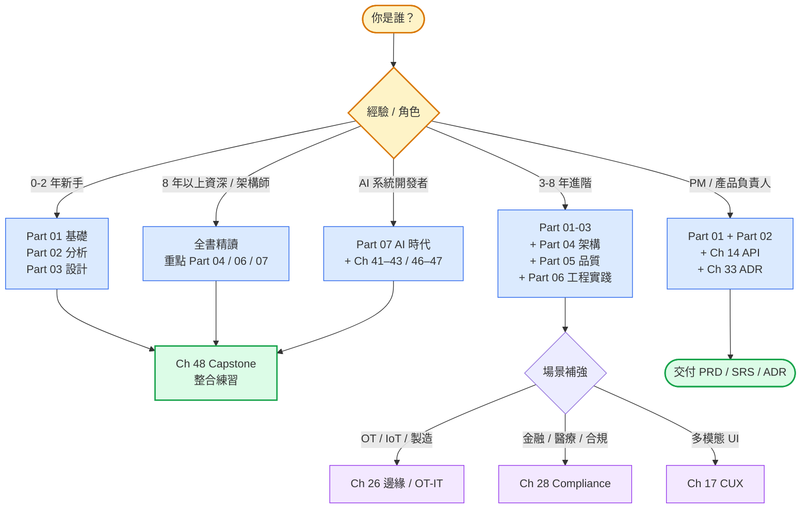
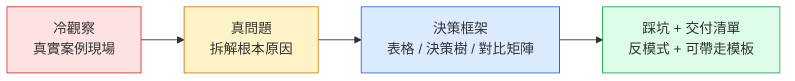

# 《系統分析師的決策手冊》
### *The SA/SD Playbook*

> 一本寫給 2026 年工程師的系統分析與設計實戰書。 
> 從需求到架構，從決策到交付，從傳統方法論到 AI 時代的工程判斷。

**作者：Eddy Kuo**

---

## 關於這本書

這不是一本叫你「填模板」的教科書。

2026 年，AI 會寫程式已經不是新聞。但 AI 不會告訴你「這個決策為什麼這樣做」、「這個邊界為什麼在這裡」、「這個妥協是怎麼來的」。系統分析與設計的核心價值，從「快速交付」轉向了**可傳遞的決策脈絡**——讓系統在三年後仍然可以被理解、被修改、被交接。

本書的每一章都從一個**真實發生過的失敗**出發，拆解它的根本原因，給出可以在會議桌上直接走完的決策框架，以及一張帶走就能用的交付清單。

## 怎麼讀這本書

| 讀者 | 建議路徑 | 預期收穫 |
|---|---|---|
| **新進工程師（0–2 年）** | Part 01 → 02 → 03 → Ch 48 Capstone | 完整需求拆解、模型語言、設計原則，最小可帶走 artifact 套件 |
| **資深工程師 / Tech Lead（3–8 年）** | 上面 + Part 04 → 05 → 06 + Ch 26（OT-IT）/ Ch 28（合規） | 進階架構、品質屬性、現代工程實踐；能設計中型系統 |
| **架構師（8+ 年）** | 全書 + 重點 Part 04 / 06 / 07（Ch 37–47） | AI 時代 SA/SD 整合視角、可帶領團隊建立 Capstone Pack |
| **PM / 產品負責人** | Part 01 → 02 → Ch 14、Ch 33 | 需求拆解、PRD/SRS/MVP 選型、ADR 決策文件 |
| **AI 系統開發者** | Part 07（Ch 37–47） | AI-Native 架構、Multi-Agent、Eval/Drift、Agent 規格 |

### 每章的四段節奏

四段對應四種語氣：**TENSE → STEADY → COACHING → CONSTRUCTIVE**（詳見 [voice-guide.md](book/voice-guide.md)）。

---

## 章節總覽

### ▌ Part 01：基礎

> [篇導讀 →](book/part-01-foundations/00-overview.md) 詞彙層建立 / 章節依存圖 / 三條讀者路徑

#### Ch 1｜為什麼系統分析與系統設計
**核心主題**：在 AI 會寫程式的 2026 年，SA/SD 的價值從「快速交付」轉向「記錄決策脈絡與可傳遞知識」。  
**案例**：PayLoop 18 天上線，但 180 天後無法追蹤交易路徑。  
**關鍵工具**：System Charter、Vibe Coding 危機識別、AI 與人類協作邊界  
**適用場景**：任何開案前的評估、向管理層解釋 SA/SD 必要性

---

#### Ch 2｜SDLC 與方法論演進
**核心主題**：軟體開發生命周期從半年一次大版本演進到 CDE（Context-Driven Engineering），關鍵是讓市場變化速度與系統應變能力對齊。  
**案例**：從瀑布到 Scrum 到 CDE 的方法論演進路徑。  
**關鍵工具**：Release Cadence 決策矩陣、敏捷誤用清單  
**適用場景**：評估團隊應採用哪種開發節奏

---

#### Ch 3｜專案啟動、可行性研究與利害關係人分析
**核心主題**：最大的啟動失敗不在技術，而在遺漏了關鍵利害關係人——那個「組織圖上不顯眼、但能讓專案停下來」的人。  
**案例**：MedCanvas 醫療 EMR 系統，12 個月 PoC 因未訪談夜班護理長而失敗。  
**關鍵工具**：TELOP 五維可行性表、Power-Interest Grid、Salience Model、Project Initiation Brief 模板  
**適用場景**：所有新案子的開案評估

---

#### Ch 4｜需求工程基礎
**核心主題**：需求工程不是「收集客戶願望」，而是識別衝突、管理範圍、用「拒絕清單」記錄不做什麼。  
**案例**：FlowDeck 30 個訪談只用了訪談一種技術，蒐集的全是症狀層描述。  
**關鍵工具**：症狀層 → 問題層 → 需求層三層分類、MoSCoW / Kano / RICE / WSJF 優先級框架、RTM 自動化  
**適用場景**：需求蒐集、Backlog 管理、需求優先級排序

---

#### Ch 5｜UML 模型語言全景
**核心主題**：14 種 UML 圖你只需要 3 種；模型的價值不在完整性，在「有人會用」。  
**案例**：80 頁無人閱讀的 UML vs 3 張每週被回看的 Mermaid 圖。  
**關鍵工具**：圖型選擇決策樹、Mermaid 實作範例、C4 Model 導引  
**適用場景**：架構溝通、系統文件、新人 onboarding

---

### ▌ Part 02：分析

> [篇導讀 →](book/part-02-analysis/00-overview.md) 五種分析工具的問題型別 / 章節依存圖 / 讀者入口

#### Ch 6｜結構化分析
**核心主題**：支付系統 8,400 美元差額無法溯源，根本原因是沒有維護完整的資料血緣圖（Kafka topic → 表 → owner）。  
**案例**：TradePath 支付對帳系統的 DFD 設計缺失。  
**關鍵工具**：Level-0 / Level-1 DFD、資料字典、資料血緣圖、Context Diagram  
**適用場景**：遺留系統理解、資料流梳理、系統整合評估

---

#### Ch 7｜物件導向分析
**核心主題**：47 個完美的用例卻有 18% 出包率，原因是沒有用狀態圖約束跨用例間的訂單狀態語意。  
**案例**：OrderBridge 跨境電商平台的狀態機缺失。  
**關鍵工具**：用例模板（含前置/後置條件）、狀態轉移圖、時序圖、四圖互鎖方法  
**適用場景**：業務流程建模、複雜狀態系統設計

---

#### Ch 8｜資料模型與正規化
**核心主題**：同名 `patient_id` 在四張表有四種語意，SQL Join 通過但業務對不上，99% 的場景都會爆炸。  
**案例**：MedCanvas 跨系統 `patient_id` 語意衝突。  
**關鍵工具**：ER 圖設計、1NF/2NF/3NF/BCNF 判斷流程、語意同名異義識別、Schema 演進策略  
**適用場景**：資料庫設計、跨系統整合、正規化評估

---

#### Ch 9｜流程模型
**核心主題**：訂閱續約涉及 7 個服務的規則散佈，導致 42 美元計費差異三小時無法解釋。  
**案例**：SkyStream 串流平台跨服務流程斷裂。  
**關鍵工具**：BPMN 事件 / 閘道 / 任務分類、狀態機設計、決策表、跨服務流程對齊  
**適用場景**：業務流程自動化、跨團隊流程對齊、計費 / 合規流程設計

---

#### Ch 10｜規格文件
**核心主題**：PRD、SRS、MVP 壓縮的是不同層次的歧義——商業意圖、工程行為、市場驗證，混用就會讓工程吃下不屬於它的風險。  
**案例**：VoltMesh 工業 IoT「即時告警」三個人三種理解，差距 30% 預算。  
**關鍵工具**：PRD / SRS / MVP 選擇決策樹、非功能需求 Quality Scenario 格式、MVP 四種模式對比  
**適用場景**：規格文件撰寫、開案文件選型、需求歧義消除

---

### ▌ Part 03：設計

> [篇導讀 →](book/part-03-design/00-overview.md) 六章 + Ch 17 / 改動半徑到 CUX 的設計地基 / 章節依存圖

#### Ch 11｜軟體架構原則
**核心主題**：SOLID、12-Factor、Clean Architecture 不是檢查清單，是**成本估算工具**——一條規則跨 14 個檔案，就是未來每次改動的額外代價。  
**關鍵工具**：SOLID 原則成本量化、依賴方向檢驗、高內聚低耦合評估矩陣  
**適用場景**：架構審查、重構決策、技術債評估

---

#### Ch 12｜設計模式
**核心主題**：8 個檔案 3,400 行包裝了 100 行核心邏輯，模式堆積掩蓋了業務規則——模式是「為已知問題命名」，不是「讓設計看起來高端」。  
**關鍵工具**：GoF 23 種模式選型矩陣、EIP 整合模式（Saga / Idempotent Receiver）、模式過度設計識別  
**適用場景**：程式碼審查、系統整合設計、模式選型決策

---

#### Ch 13｜架構風格實戰
**核心主題**：六角形架構的核心是適配器邊界清晰——第 9 個廠商接進來時才發現業務邏輯被 3 個 API adapter 深度耦合。  
**關鍵工具**：分層 / 六角形 / 洋蔥 / Clean Architecture 比較表、外部依賴隔離策略  
**適用場景**：新系統架構選型、整合密集型系統設計

---

#### Ch 14｜API 設計
**核心主題**：同一個 `order` 在 REST / GraphQL / Webhook 有三套不同 schema，partner 要學三套術語——API 設計的核心是定義信任邊界，不是選協議。  
**關鍵工具**：REST / GraphQL / gRPC / Webhook / AsyncAPI 選型決策樹、Contract Testing、版本策略  
**適用場景**：API 設計、Partner 整合、多協議系統

---

#### Ch 15｜資料儲存設計
**核心主題**：沒有測量 Workload Profile 就直覺遷移到 Cassandra，結果聚合查詢從 90 秒變 4 分 12 秒。  
**關鍵工具**：Workload Profiling 表、RDBMS / NoSQL / NewSQL / 向量資料庫選型矩陣、讀寫比分析  
**適用場景**：資料庫選型、效能瓶頸排查、儲存架構設計

---

#### Ch 16｜UI/UX 與人機互動的系統觀
**核心主題**：UX 是「錯誤狀態下的決策設計」——14 種失敗情景用 3 句通用文案，導致 42% KYC 流程掉線。  
**關鍵工具**：錯誤路徑設計清單、轉換漏斗分析、容錯 UX 模式  
**適用場景**：UI/UX 設計審查、錯誤流程設計、KYC / Onboarding 系統

---

#### Ch 17｜多模態與對話式互動的系統分析
**核心主題**：語音優先、聊天優先、相機感應、空間運算打破了古典 GUI 的「離散步驟」假設，需要全新的系統分析框架。  
**關鍵工具**：CUX 對話設計模式、多模態輸入容錯分析、意圖識別與狀態管理  
**適用場景**：語音 / 聊天介面設計、AR/VR 系統、AI 對話系統

---

### ▌ Part 04：架構

> [篇導讀 →](book/part-04-architecture/00-overview.md) 八章 + Ch 26 / 複雜度增長的架構工具序列 / 章節依存圖

#### Ch 18｜領域驅動設計（DDD）
**核心主題**：三個系統都叫 `Patient` 但語意各不同——Bounded Context 的價值是語言邊界，不是服務邊界。  
**案例**：MedCanvas 跨系統 Patient 語意衝突。  
**關鍵工具**：Context Map、Ubiquitous Language 建立流程、戰術模式（Aggregate / Repository / Domain Service）  
**適用場景**：複雜業務領域建模、微服務邊界劃分、遺留系統重構

---

#### Ch 19｜Event Storming 與 Event Modeling
**核心主題**：380 張便利貼完成了「我們對齊了」的幻覺，但沒有對應到任何 endpoint 或檔名——工作坊必須有實現路徑。  
**關鍵工具**：Event Storming 三天流程、事件建模格式、聚合識別方法、工作坊輸出轉實作清單  
**適用場景**：新系統架構探索、跨團隊業務對齊、微服務邊界發現

---

#### Ch 20｜C4 Model 與架構視覺化
**核心主題**：47 張投影片從 logo wall 直接跳到程式碼片段，Visa 顧問看不懂「錢怎麼走」——C4 的價值是為不同讀者提供同一份地圖的不同層次。  
**關鍵工具**：C4 四層（Context / Container / Component / Code）、Structurizr DSL、圖型選擇決策樹  
**適用場景**：架構溝通、技術審查、新人 onboarding

---

#### Ch 21｜Modular Monolith
**核心主題**：47 個微服務三年後收回到 6 個模組化單體，新人 onboarding 從 12 週降到 3 週——2026 是微服務反思元年。  
**關鍵工具**：模組邊界設計原則、Strangler Fig 遷移路徑、單體 vs 微服務決策矩陣  
**適用場景**：微服務過度拆分的修復、新系統架構選型、小規模團隊架構

---

#### Ch 22｜微服務架構
**核心主題**：黑五當天 inventory 微服務一慢，整個 32 服務同步鏈 7 分鐘全紅——分散式系統的稅金必須帶來應有的擴展收益。  
**關鍵工具**：服務拆分標準（Conway's Law / DDD Bounded Context）、Synchronous Coupling 識別、分散式追蹤  
**適用場景**：微服務架構設計、服務拆分評估、高流量系統設計

---

#### Ch 23｜事件驅動架構、CQRS 與 Event Sourcing
**核心主題**：三件工具不該綁在一起——為了審計導入 Event Sourcing，結果授權 P99 從 80ms 變 320ms，因為把 ES 用在了熱路徑。  
**關鍵工具**：EDA / CQRS / ES 選型決策樹、熱冷路徑分離設計、Saga 補償事務  
**適用場景**：審計 / 合規系統、高寫入量系統、非同步業務流程

---

#### Ch 24｜雲端原生架構與 Kubernetes
**核心主題**：從 PaaS 遷到自管 K8s，月帳單翻倍、SRE 工時從 8% 升到 35%——不是用 K8s 就是雲端原生。  
**關鍵工具**：K8s vs PaaS 選型矩陣、Operational Complexity 評估、成本分析框架  
**適用場景**：雲端架構選型、K8s 導入評估、多雲 / 混合雲設計

---

#### Ch 25｜Service Mesh、API Gateway、Cell-Based
**核心主題**：`istiod` lease 過期導致 mTLS 全部失效，12 分鐘電網調度系統斷裂——三層流量治理的分工決定系統的韌性下限。  
**關鍵工具**：Service Mesh / API Gateway / Cell-Based 三層分工矩陣、Fail-Safe vs Fail-Open 決策  
**適用場景**：大型微服務流量治理、零信任網路設計、高可靠性關鍵系統

---

#### Ch 26｜邊緣計算與 OT/IT 融合的系統架構
**核心主題**：雲原生工程師遇到實體儲能櫃時的根本盲點——OT 系統不能等 Kubernetes 重新調度，即時控制需要不同的架構假設。  
**關鍵工具**：OT/IT 融合架構圖、邊緣計算延遲預算、安全關鍵系統設計原則  
**適用場景**：工業 IoT、能源 / 電網系統、製造業數位轉型

---

### ▌ Part 05：品質

> [篇導讀 →](book/part-05-quality/00-overview.md) 四章 + Ch 28 / 安全到合規的品質屬性依存順序 / 章節依存圖

#### Ch 27｜安全設計
**核心主題**：KYC 通過、OTP 驗證、風控規則全過，社交工程 + OAuth refresh token 缺陷讓 NT$280 萬被轉走——安全是預設值，不是清單。  
**關鍵工具**：STRIDE Threat Model、Zero Trust 原則、OAuth 2.0 / PKCE 設計、身份驗證流程審查  
**適用場景**：金融 / 支付系統、身份驗證設計、合規安全審查

---

#### Ch 28｜Compliance by Design — AI 合規架構
**核心主題**：EU AI Act 2026/8/2 高風險系統合規執行日已至，罰則達全球年營收 7%——合規必須從架構層設計，不是上線後補。  
**關鍵工具**：EU AI Act 風險分級、GDPR 隱私設計原則、合規 by Design 架構模式、DPIA 流程  
**適用場景**：AI 系統合規、金融 / 醫療 / 政府系統、跨境資料處理

---

#### Ch 29｜可觀測性
**核心主題**：12 個 dashboard 全綠，結帳成功率掉 12%，因為第三方物流 API 7% 機率 503 沒有被監測——可觀測性不是 dashboard 牆。  
**關鍵工具**：Metrics / Traces / Logs 三大支柱、RED 方法、OpenTelemetry 實作、根本原因分析流程  
**適用場景**：生產系統監測、SRE 工具鏈建立、事故根因分析

---

#### Ch 30｜SRE、SLO、Chaos Engineering
**核心主題**：合約寫 99.95% 可用率，實際 99.54%，年度賠款 168,400 美元——可靠度是用 Error Budget 換來的，不是天上掉下來的。  
**關鍵工具**：SLI / SLO / SLA 定義流程、Error Budget 計算、Chaos Engineering 實驗設計  
**適用場景**：SLA 合約談判、可靠度工程建立、系統韌性驗證

---

#### Ch 31｜資料架構
**核心主題**：花 1.4 億蓋 Lakehouse，結果七家醫院還是每週 SFTP CSV——Lakehouse 是儲存層問題，Data Mesh 是組織層問題，不要混。  
**關鍵工具**：Data Mesh / Lakehouse / Lakebase 三層分工矩陣、Data Contract 格式、資料血緣設計  
**適用場景**：資料平台建設、跨組織資料治理、OLAP / OLTP 混合系統

---

### ▌ Part 06：工程實踐

> [篇導讀 →](book/part-06-engineering/00-overview.md) 四章 / 工程文化基礎設施 / IDP → ADR → Fitness → FinOps 依存圖

#### Ch 32｜Platform Engineering 與 IDP
**核心主題**：17 個內部工具交付，90 天後新人 DAU 只有 22%——Platform-as-a-Product 不是 DevOps 重命名，是讓工程師「寧願用平台」的產品設計。  
**關鍵工具**：Paved Road 設計原則、Platform 採納率指標、Golden Path 模板  
**適用場景**：內部開發者平台建設、DevOps 成熟度提升、大型工程組織效率優化

---

#### Ch 33｜架構決策紀錄（ADR）與架構知識管理
**核心主題**：同一個技術決策有 8 種版本說法散在 8 個人腦袋——ADR 是讓決策變成「決定的化石」，新任架構長三個月後還能理解的工具。  
**關鍵工具**：MADR 格式、ADR 生命周期管理、Architecture Knowledge Graph、決策樹  
**適用場景**：架構治理、知識傳承、技術交接

---

#### Ch 34｜架構適應度函式
**核心主題**：ADR-0007 定義了六角形架構，18 個月後 73% domain 類別違反依賴方向，但 CI 從未擋過——把架構規則寫成可執行的測試。  
**關鍵工具**：ArchUnit 規則設計、Fitness Function 分類（原子 / 整體性）、CI 整合  
**適用場景**：架構合規性自動驗證、大型程式庫治理、架構演進控制

---

#### Ch 35｜FinOps、永續工程與綠色軟體
**核心主題**：23 萬美元月帳單與碳排報告需求同時來臨，發現 FinOps 和 ESG 團隊各自跑了一年管的是同一份 Workload Profile。  
**關鍵工具**：FinOps 三階段（Inform / Optimize / Operate）、碳排量化方法、Workload Profiling 整合  
**適用場景**：雲端成本優化、ESG 碳排報告、永續工程設計

---

### ▌ Part 07：AI 時代

> [篇導讀 →](book/part-07-ai-era/00-overview.md) 11 章（Ch 37–47）/ 複雜度增長的 AI 工具序列 / 各讀者入口

#### Ch 37｜AI-Native 架構
**核心主題**：LLM 判成「非緊急」的胸痛病人 STEMI 發作——AI-Native 系統的設計核心是「拿掉 LLM 後系統還能跑」的 Graceful Degradation。  
**關鍵工具**：AI 信任邊界設計、Fallback 策略、Non-AI 路徑保留、決策可審計性  
**適用場景**：AI 輔助決策系統、醫療 / 金融 AI 系統、高可靠性 AI 應用

---

#### Ch 38｜Context-Driven Engineering（CDE）
**核心主題**：28 個工程師用 Cursor 前三個月生產力 2.2x，第六個月回到基線——沒有共享脈絡的 AI 工具，效益無法持續。  
**關鍵工具**：Shared Context 設計、.cursorrules / CLAUDE.md 標準化、ADR + Spec 作為 AI 輸入  
**適用場景**：AI 輔助開發流程設計、團隊 Prompt 標準化、Context 知識管理

---

#### Ch 39｜RAG、Memory 與 Tool 設計
**核心主題**：合規客服 Agent 有 RAG 知識庫（92% accuracy）但無客戶狀態 Memory，同一客戶三通電話被當三次新客戶。  
**關鍵工具**：RAG 架構設計（Chunking / Embedding / Retrieval）、Memory 三層模型、Tool 介面設計  
**適用場景**：企業知識庫 Agent、客服自動化、合規問答系統

---

#### Ch 40｜Multi-Agent 系統設計
**核心主題**：拆成 7 個 Agent 想提升複雜工單品質，結果 P95 從 8s 變 47s、品質從 81% 跌到 56%——不是更多 Agent 解決問題，是更窄的 Agent。  
**關鍵工具**：Agent 拓樸設計（Sequential / Parallel / Hierarchical）、Agent 互動成本評估、Orchestrator 設計  
**適用場景**：複雜業務流程自動化、多步驟 AI 工作流、企業 AI Agent 設計

---

#### Ch 41｜Multi-Agent 共識、狀態與衝突解決
**核心主題**：兩個自主 Agent 對同一件事不同意怎麼辦？——分散式 Agent 系統的共識與衝突解決機制。  
**關鍵工具**：分散式共識機制、Conflict Resolution 策略、State Management 設計、Saga 補償  
**適用場景**：自主 Agent 系統設計、多 Agent 協作架構

---

#### Ch 42｜Agent 設定語言 — SA 的新交付物
**核心主題**：四個 Agent 的 `instructions` 字串硬塞在程式碼裡、沒有版本歷史，SA 連「這個 Agent 是誰、能做什麼」都翻不出來——CLAUDE.md / agent.md / skill.md 是新世代的 SRS。  
**案例**：Caldwell Systems ERP 整合 Agent 的規格真空。  
**關鍵工具**：Agent Identity / Capabilities / Instruction / Handoff 四問框架、跨廠商通用設定語言、Agent 規格版本控制  
**適用場景**：Multi-Agent 系統 SA 交付、Agent 行為治理、跨團隊協作介面

---

#### Ch 43｜Agent Harness 工程 — 從模型到可用代理的執行層設計
**核心主題**：模型從 Sonnet 4.5 升到 Opus 4.7，內部評測 +14pp、PR merge 率 0%——真正該研究的不是模型，是 harness 本身。  
**案例**：Cresvale Engineering Cloud 的 Codex 內評跟 merge 率脫鉤事件。  
**關鍵工具**：Harness 執行層分解（Tool Result 壓縮、Context Window 預算、Trace 接 Review）、Eval-Production Gap 量化、Harness Observability  
**適用場景**：Coding Agent 平台建置、Multi-Agent 執行框架選型、AI 工具效益跟丟診斷

---

#### Ch 44｜AI Coding Agent / Pair Programming
**核心主題**：拆成 9 個微服務後 Cursor PR 通過率從 78% 跌到 24%，因為脈絡分散了但沒有跟著分散 ADR、CLAUDE.md。  
**關鍵工具**：AI-Friendly Codebase 設計、Context Preservation 策略、Monorepo vs Polyrepo 選型  
**適用場景**：AI 輔助開發導入、程式庫 AI 可讀性優化、工程效率提升

---

#### Ch 45｜AI 系統的 Eval、Drift 與 Red Team
**核心主題**：AML 合規 Agent 上線 92% accuracy，六個月後只有 71%——沒有人在持續監測品質漂移。  
**關鍵工具**：Eval Set 設計原則、Drift Monitoring 架構、LLM-as-Judge 設計、Red Team 攻擊模式  
**適用場景**：生產環境 AI 系統監測、合規 AI 品質保證、AI 系統持續評估

---

#### Ch 46｜Agentic QA — 非確定性系統的品質保證
**核心主題**：「同輸入→同輸出」的假設被 LLM 打破——Agent 系統不能用傳統 LGTM review，需要 Eval + Drift Monitoring。  
**關鍵工具**：非確定性測試策略、Eval 框架設計、Drift Detection 指標  
**適用場景**：AI 系統 QA 流程設計、LLM 系統測試策略

---

#### Ch 47｜遺留系統現代化與 AI 逆向工程
**核心主題**：現實大多是 7 年舊 Java EE + 5000 行 stored procedure，不是 Greenfield——用 AI Agent 逆向挖掘隱性知識。  
**關鍵工具**：程式碼考古學方法、AI 輔助分析工具、Strangler Fig 現代化路徑、知識萃取框架  
**適用場景**：遺留系統重構、技術債管理、系統遷移規劃

---

### ▌ Part 08：綜合

> [篇導讀 →](book/part-08-synthesis/00-overview.md) PayLoop 2.0 / 45 份 artifact 對應索引 / 你讀完能做的事

#### Ch 48｜Capstone
**核心主題**：PayLoop 兩年後被金管局再次問及「同一個錯誤六小時內能否回答」，這次 CTO 展示了完整的文件樹（Charter、ADR、C4、Fitness Functions、Data Lineage）。  
**關鍵工具**：完整 SA/SD 文件體系、系統可傳遞性檢查清單、全書決策框架整合  
**適用場景**：全書總複習、開案前的完整檢查、系統知識移交

---

### ▌ Part 09：人類工程師的定位

> [篇導讀 →](book/part-09-human-engineer/00-overview.md) 六章（Ch 49–54）/ AI 使用框架到直覺保護 / 各讀者入口

#### Ch 49｜AI 能力地圖
**核心主題**：VaultStack 讓 AI 設計計費 schema，schema 漂亮，但三週後靜默資料遺失——AI 補全模式，不理解業務語義。  
**關鍵工具**：AI 任務可靠性地圖（技術正確性 vs 業務語義 vs 隱性約束）、委派可靠性評估表  
**適用場景**：決定哪些任務委派 AI、設計 AI 輔助工作流

---

#### Ch 50｜有效使用 AI 輔助
**核心主題**：GridForge 28 人導入 Cursor，生產力 2.1x 三個月後回基線——23 種不同 CLAUDE.md，共享脈絡零碎化。  
**關鍵工具**：Context Engineering 三層架構（持久 / 任務 / 即時）、CLAUDE.md 最小有效設計、委派設計三問  
**適用場景**：團隊 AI 工具導入、CLAUDE.md 設計、委派流程標準化

---

#### Ch 51｜人類不能外包的邊界
**核心主題**：PineRidge EMR 讓 AI 優化 schema，AI 繞過了 2019 年一份從未進入 codebase 的書面合規協議。  
**關鍵工具**：五個不能外包的判斷類別、人類判斷邊界確認清單  
**適用場景**：合規設計、架構決策、遺留系統修改

---

#### Ch 52｜主動研究 AI 弱點
**核心主題**：ClearVault 用 AI 做安全審查，六個月連過，第七個月遭間接提示注入攻擊——AI 訓練截止日前，此攻擊案例尚不成熟。  
**關鍵工具**：訓練截止日偏差監測、Failure Catalog、季度 Red Team 流程  
**適用場景**：AI 輔助安全審查、季度能力校準、團隊 AI 弱點管理

---

#### Ch 53｜AI 程式碼的審計哲學
**核心主題**：PortBridge 的 AI PR 測試全過，三週後買方「已確認」沒有觸發賣方庫存驗證——技術正確，業務語義錯誤。  
**關鍵工具**：三層 AI 程式碼審計（技術正確性 / 意圖符合性 / 架構符合性）、AI 程式碼 Review Checklist  
**適用場景**：AI 輔助開發的 Code Review、PR 規範設計

---

#### Ch 54｜工程直覺保護手冊
**核心主題**：NovaDeck 的 Leon，兩年 AI 全依賴後，在 API 中斷的那個下午，花六小時找一個原本三十分鐘能解決的 bug。  
**關鍵工具**：刻意練習區設計、無 AI 能力清單、團隊工程直覺健康指標  
**適用場景**：個人能力維護、團隊 AI 依賴度評估

---

## 附錄

| 附錄 | 內容 |
|---|---|
| **附錄 A**｜未來趨勢 | 2026–2030 的 SA/SD 看點 |
| **附錄 B**｜工具速查 | 2026 年工具選型速查表 |
| **附錄 C**｜參考書單 | 延伸閱讀推薦清單 |
| **附錄 D**｜案例索引 | 全書 43 個虛構案例索引 |
| **附錄E**｜標準對照 | ISO / IEEE / NIST / EU AI Act / 業界標準對照 |
| **附錄 F**｜Glossary | 全書術語表（280+ 條） |
| **附錄 G**｜引用登記表 | 全書學術引用來源 |

---

## 本書範圍與邊界

### 涵蓋範圍

- 系統分析與設計的完整生命周期：從開案評估到架構交付
- 傳統方法論（UML、DFD、BPMN、ERD）的現代應用
- 現代架構模式（DDD、微服務、EDA、Cloud Native）的實戰決策
- AI 時代的新挑戰（AI-Native 架構、Multi-Agent、CDE、Eval/Drift）
- 品質與工程治理（可觀測性、SRE、FinOps、合規）

### 不涵蓋範圍

- 程式語言教學（假設讀者已具備基本工程能力）
- 專案管理方法論（Scrum/SAFe 的流程細節）
- 特定雲端平台的操作手冊（AWS/GCP/Azure 服務細節）
- 資料科學 / 機器學習模型訓練（聚焦系統整合而非模型開發）

---

## 技術環境

所有程式碼範例與圖表使用：

- **Mermaid**（flowchart、sequenceDiagram、stateDiagram、quadrantChart）
- **Structurizr DSL**（C4 Model）
- 語言中立的偽程式碼

---

## 授權

© 2026 Eddy Kuo. All rights reserved.

本書內容（`book/` 目錄下所有 `.md` 檔案）著作權歸 Eddy Kuo 所有。 
未經書面授權，不得轉載、改作或商業使用。

---

*《系統分析師的決策手冊》／ The SA/SD Playbook* 
*作者：Eddy Kuo*
