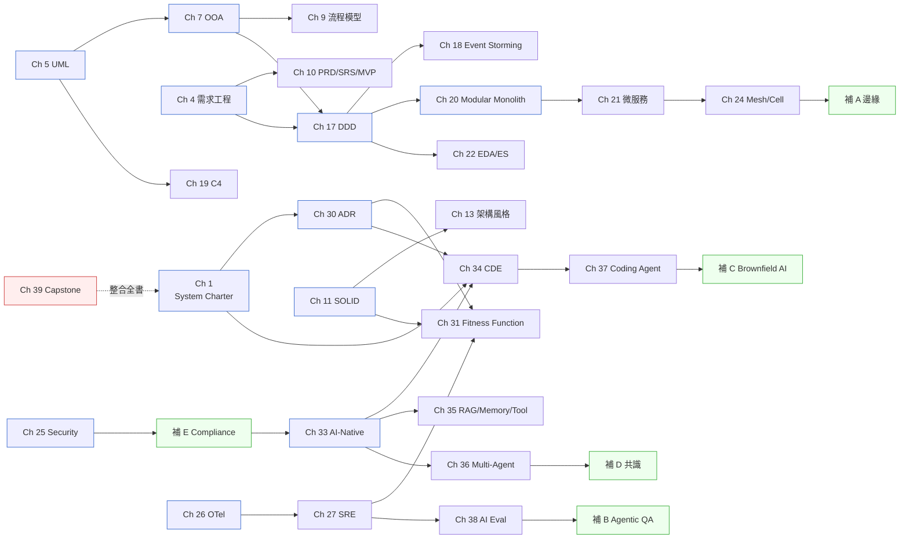

# 02 章節依存圖 ⸺ 如何讀這本書

## 全書八篇地圖

## 跨章關鍵依賴

## 解讀

- **左到右是預設閱讀順序**(I → VIII)。
- **跨章箭頭代表觀念依賴**(後章用到前章的工具或語彙)。
- **6 個補章(A、B、C、D、E、F)**穿插在主章流程中,點出主大綱的 6 個盲點。
- **Ch 39 Capstone** 不是新內容,是把全書 38 章 + 6 補章串成一個 PayLoop 2.0 故事。

## 跳章策略

| 你的需求 | 建議跳到 |
|---|---|
| 馬上要寫 PRD | Ch 4 → Ch 10 |
| 要決定拆不拆微服務 | Ch 1 → Ch 17 → **Ch 20** → Ch 21 |
| 接手遺留系統 | Ch 1 → **補章 C** → Ch 17 → Ch 20 |
| 要引入 AI Agent 工具 | Ch 30 → Ch 34 → Ch 37 → **補章 B** |
| 要做 Compliance 評估 | Ch 25 → **補章 E** → Ch 33 |
| 想看一個整合案例 | **Ch 39 Capstone**(可從這裡開始倒讀) |

## 章節長度概覽

| 篇 | 章數 | 平均字元數 | 特點 |
|---|---|---|---|
| I 認知基礎 | 5 | 25K | 短而緊湊 |
| II 分析 | 5 | 25K | 工具與技法 |
| III 設計基礎 | 6 + 1 補 | 28K | 設計詞彙 |
| IV 進階架構 | 8 + 1 補 | 32K | 密度最高的一段 |
| V 品質屬性 | 4 + 1 補 | 32K | 多 cross-cut |
| VI 現代工程 | 4 | 31K | 工程實踐 |
| VII AI 時代 | 6 + 3 補 | 35K | 篇幅最長 |
| VIII 綜合 | 1 | 47K | 整合章 |

---

下一站:[Ch 1 為什麼系統分析與系統設計](../part-01-foundations/ch-01-why-sa-sd.md)。
