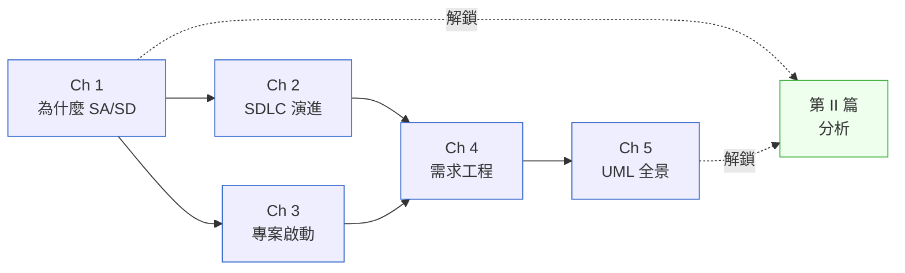

# 第 I 篇|認知基礎

> **你需要先讀這篇,才能理解後面所有工具在幹嘛。**

---

AI 會寫程式之後,系統分析師最常被問的一句話是:「這些圖表和文件,還有人看嗎?」

這篇五章的答案是:看的對象換了。SA/SD 的產出物從「給接手工程師看」變成「給接手工程師加上 AI Agent 看」。但製造「可被傳遞的理解」這件事,本身沒有任何一步消失。

第 I 篇建立的是整本書的**詞彙層**與**思維地圖**。你在後面任何一章看到的決策框架,都預設你讀過這五章的問題意識。

---

## 篇內章節依存圖

---

## 各章核心問句

| 章 | 標題簡稱 | 這章回答的真正問題 |
|---|---|---|
| Ch 1 | 為什麼 SA/SD | AI 會寫程式之後,「可被傳遞的決定」還需要人嗎? |
| Ch 2 | SDLC 演進 | 2026 年的工程節奏是什麼樣子? |
| Ch 3 | 專案啟動 | 誰能讓這件事死掉?怎麼在開工前找到他? |
| Ch 4 | 需求工程 | 從一句「我想要 X」到可以開工的 spec,要做哪些決定? |
| Ch 5 | UML 全景 | 14 種圖裡,哪 3 種你必須會、哪些只要認得? |

---

## 不同讀者的建議入口

- **第一次讀 SA/SD**:依序 Ch 1 → 2 → 3 → 4 → 5。每章的「踩坑清單」比理論更值得先讀。
- **有 3 年以上經驗**:直接讀 Ch 1 的「真問題」和 Ch 4 的決策框架,其餘章節按需索引。
- **架構師**:Ch 1 和 Ch 2 的對照表(1990 vs 2026)是與管理層對話時的語言工具,值得單獨截圖。

---

## 前後篇連結

- **前置**:無(這是全書起點)
- **這篇解鎖**:[第 II 篇 分析](../part-02-analysis/00-overview.md) — 你需要先有「什麼是 SA/SD 產出物」的認識,才能有效使用分析工具
- **長距離影響**:[Ch 33 ADR](../part-06-engineering/ch-33-adr-architecture-knowledge.md)(決策紀錄的哲學來自 Ch 1)、[Ch 37 CDE](../part-07-ai-era/ch-38-context-driven-engineering.md)(Context-Driven Engineering 是 Ch 2 SDLC 演進的終點)
