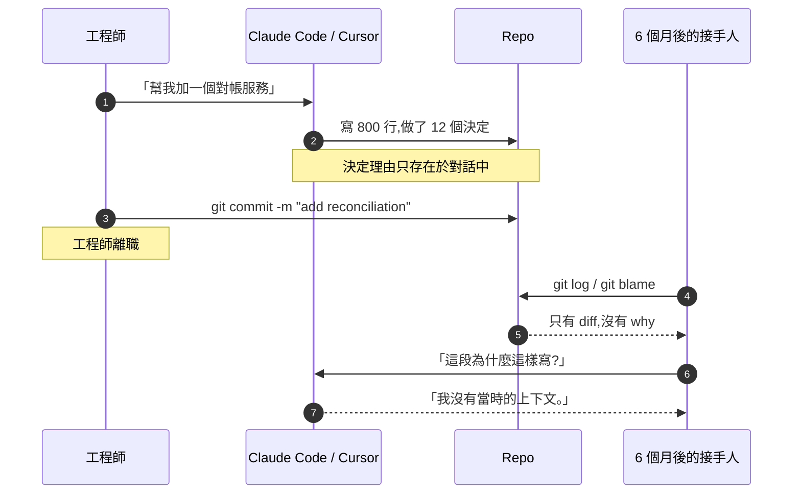
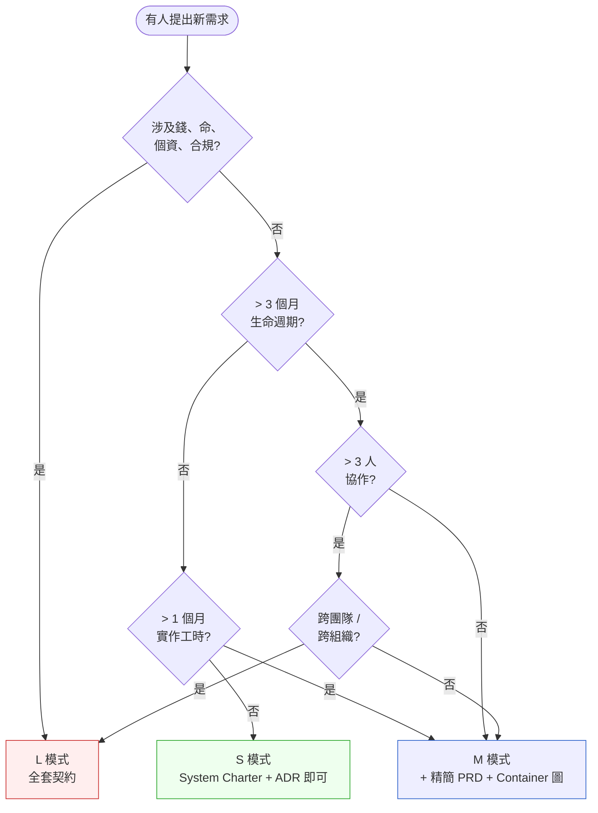

# 第 1 章|為什麼系統分析與系統設計
## ⸺ 在 AI 會寫程式的 2026 年

> **前置閱讀**:無(本書起點)
> **下游章節**:[Ch 2 SDLC 演進](./ch-02-sdlc-evolution.md)、[Ch 33 ADR](../part-06-engineering/ch-33-adr-architecture-knowledge.md)
> **延伸補章**:[Ch 47 遺留現代化](../part-07-ai-era/ch-47-legacy-ai.md)

---

## 1.1 冷觀察 ⸺ 18 天上線、180 天崩潰

我在 2025 年第三季看過一個案例。

虛構新創 **PayLoop**(`CASE-FIN-001`),三名工程師,做跨境小額匯款。他們在 Slack 裡貼了一張截圖,標題是「18 天從零到第一筆真實交易」。技術棧:Next.js 15 + Supabase + Stripe Connect,寫程式的方式叫 *vibe coding* ⸺ Cursor + Claude Code 寫了大概 70% 的程式,人寫了 30%,剩下 0% 是文件。

第 18 天,他們收第一筆 50 美元。第 60 天,月流水破百萬美元。第 180 天,新加坡端發生一次 SGD 流動性事件,對帳對不上,差額 8,400 美元。

Root cause 最後查出來是一個邊緣情境的競態條件(race condition)——Stripe Webhook 與內部清算 job 在毫秒級撞車,導致同一筆訂單狀態被覆寫。這是一個 **bug**,不是「沒寫文件」造成的。但 bug 修掉只花了四個小時;剩下的**十四個小時**,全部花在搞清楚這個問題:

> 「這筆交易在我們系統裡走了哪幾步?哪一步寫了哪張表?哪張表是 source of truth?」

當時寫對帳服務的那位工程師早就離職了,他在 Cursor 裡的 chat history 沒有 export,他做過的決定也沒有寫進任何一份文件。三個月後接手的人,只看得到 git diff,看不到 *為什麼這樣 diff*。Bug 本身或許無從避免,但**缺乏 SA/SD 讓診斷時間從 2 小時拉長成 16 小時**。在一個 24x7 的跨境清算系統,這個差距直接決定商譽損失的量級。

CTO 在事故覆盤會上問了一句話,我把它原樣記下來:

> 「我們有什麼?除了一個會跑的東西之外,我們到底擁有什麼?」



Race condition 早晚都會發生在任何系統上;但這不是 AI 的鍋,也不是 bug 本身的鍋。**16 小時診斷是工程實踐的鍋**。AI 沒有失憶,是「決定發生時的脈絡」從來沒有被持久化——導致本可以兩小時解決的事,變成了一整天的消防演習。

---

## 1.2 真問題 ⸺ SA/SD 不是畫圖,是製造「可被傳遞的理解」

過去三十年,系統分析與系統設計常被當成「上線前要交的文件作業」。在 1990 年代這個詮釋還算合用:當時系統壽命比工程師年資長,文件是團隊輪替的介面。

到了 2025 / 2026,這個詮釋已經跟不上現場節奏 ⸺ 但跟不上的方向不是「SA/SD 不再重要」,而是**它的產出物換了形狀**。把這件事拆開來看會比較清楚。

| 維度 | 1990 年代的 SA/SD | 2026 年的 SA/SD |
|---|---|---|
| **主要產出** | SRS、ERD、UML 全套 | spec.md、ADR、CLAUDE.md、agents.md、Skill 包 |
| **主要讀者** | 接手的工程師 | 接手的工程師 + AI Agent |
| **驗證方式** | Code Review、Walkthrough | CI 中的 Fitness Function、AI 對 spec 的可讀性 |
| **失敗代價** | 文件過期、沒人看 | AI 失去脈絡、產出與意圖偏離 |
| **更新頻率** | 月 / 季 | 與程式碼同 commit |

換句話說,**SA/SD 從「上線前的儀式」變成「協作介面的格式」**。它依然在做同一件事:把模糊的業務問題,轉換成「可被傳遞的決定與限制」。只是現在傳遞的對象多了一個會寫程式的非人類同事。

把這個視角放回現場,可以看到 SA/SD 真正在處理的是三件事。它們不是抽象原則,而是 PayLoop 那類事故每次都繞不開的三個結構性問題:

### 1.2.1 防早期分解(Premature Decomposition)

CNCF 2026 Q1 報告 [^CIT-001] 顯示,42% 採用微服務的組織已經把部分服務整併回模組化單體。這不是突然的轉向 ⸺ Sam Newman 從 2020 年起就在 GOTO 反覆講「先做 modular monolith,bounded context 穩定再拆」[^CIT-002a];ThoughtWorks Technology Radar 在 2024 Vol. 30 已經把 Modular Monolith 從 Trial 升到 Adopt,並把「Microservices Envy」(微服務迷思)列入 Hold [^CIT-002b]。Shopify [^CIT-003] 也公開了「30TB/min 訊息流量,跑在一個模組化單體上」的架構。

換句話說,2026 年不是反思元年,**是反思結果開始在報表上出現的那一年**。

為什麼會這樣?根本原因是這些組織在 Bounded Context 還沒釐清、業務節奏還沒測過的情況下,就先做了服務拆分。結果換來的不是擴展性,而是分散式系統的全套運維成本——服務發現、分散式追蹤、跨服務事務、網路延遲預算,全都要在第一天就處理好。

這些案例的共同點不是「微服務不好」,而是**在 SA/SD 還沒走完的情況下就先做了拓樸決策**。Bounded Context 沒釐清、業務節奏沒測過、團隊組織還在動的時候,先拆服務換到的通常不是擴展性,而是分散式系統的全套運維成本 ⸺ 而且這份成本在帳單上會比預期早三個月出現。

### 1.2.2 防決策失憶(Decision Amnesia)

寫程式的過程其實是一連串小決定:用 PostgreSQL 不是 MySQL、用 UUIDv7 不是 UUIDv4、不接 Kafka 直接走 Postgres LISTEN、把訂單和支付放同一個交易裡、JWT 30 分鐘過期。一個系統做完,輕鬆累積一兩百個這樣的決定。

六個月後,這些決定大概有八成你已經想不起當初為什麼這樣選。再過半年,後來的人會開始「重構」這些決定 ⸺ 不是因為當初錯了,而是因為他們看不到每個選擇背後的脈絡。

ADR(Architecture Decision Record)處理的就是這件事 [^CIT-004]:它不是傳統意義的文件,比較像是**決定的化石**,讓三年後的人能挖出來看當時的氣候。

### 1.2.3 防脈絡崩潰(Context Collapse)

現場會看到什麼?當系統大到沒有人能把全部上下文同時放在腦中,你改一個地方就會出現意外的副作用——改了清算邏輯,觸發了對帳服務的邊緣條件;動了資料模型,壞掉了三個月前才寫的 Webhook 處理邏輯。這不是工程師不夠細心,而是**系統邊界從來沒有被顯式畫出來**,導致每一個局部修改都要求修改者在腦中重建整個系統的狀態。

SA/SD 的核心技藝就是**把上下文壓縮到可被局部推理**:Bounded Context、模組邊界、API 合約、ADR ⸺ 這些都是同一個目的的不同手段:讓你不需要看全部,就能放心改一部分。人與 AI 協作的現場也一樣——沒有邊界的系統,人會吃力、AI 會幻覺,兩者都會出錯。

---

## 1.3 決策框架 ⸺ 何時需要做多少 SA/SD

「文件越多越好」與「敏捷就是不寫文件」這兩個常見的極端,在現場通常都會出事。比較穩的做法是**按專案性質決定劑量**,而劑量本身可以用三個維度來判斷。

下面這張 triage 表在現場相當好用,剛好對應本書框架的三個複雜度模式(S / M / L,定義於 `.claude/agents/orchestrator.md`):

### 1.3.1 三維 Triage 表

| 維度 | S(輕量) | M(常規) | L(嚴謹) |
|---|---|---|---|
| **業務可逆性** | 全可逆(改了就改了) | 部分可逆(資料可遷移) | 不可逆(錢、命、合規罰款) |
| **團隊規模** | 1–3 人 | 4–15 人 | > 15 人 / 跨組織 |
| **生命週期** | < 6 個月 / PoC | 6 個月–3 年 | > 3 年 / 法規鎖定 |
| **典型代表** | 內部工具、一次性活動 | 多數 SaaS 產品 | 金融、醫療、能源、政府 |
| **主要讀者類型** | 同組的工程師,無外部合約 | PM + 跨組 RD + QA,需對齊多方理解 | 監管機構 + 法務 + 外部稽核,需可追溯的證據鏈 |
| **artifact 選擇原則** | 能讓接手人不用問就理解決定 | 能讓跨角色不用開會就對齊需求與邊界 | 能讓監管方在不看程式碼的情況下驗證合規 |
| **必交付 artifact** | System Charter + ADR(1–3 份) | + 精簡 PRD + C4 Container 圖 + ADR(5–10 份) | + SRS + C4 全層 + Threat Model + 合規對照表 |
| **L 比 M 多的原因** | ⸺ | ⸺ | SRS 給監管方看(法規要求文字規格);Threat Model 因為不可逆損失(資金 / 個資)要求威脅面建模;C4 全層因為跨組織整合需要元件與程式碼層級的邊界說明 |
| **AI 介入度** | RD 直接調 Agent 寫程式 | PM/QA Agent 共審 | 全角色契約流程 |

表格的核心邏輯是:**artifact 的種類由「誰需要讀」與「錯了要付什麼代價」決定,而不是單純由規模決定**。S → M 的跨越是讀者從一個人變成多個角色,所以加 PRD(多方對齊)和 C4 Container(跨角色的系統邊界共識);M → L 的跨越是讀者從內部人員擴展到監管機構與法務,所以加 SRS(法規要求的文字規格)和 Threat Model(不可逆損失必須事前建模威脅面)。ADR 在三個模式都存在,只是數量從 1–3 份增加到 5–10 份。

回頭看 PayLoop:他們做的是 fintech,本質上是 L 級(錢、合規、長壽命),但選擇用 S 模式的工作節奏在跑。**錯位的不是工具,是預設值**。一旦預設值對了,後面的工具與流程才有著力點。

### 1.3.2 一張決策樹:這次要做多少 SA/SD?



**這張圖的關鍵不是分支,是預設值**。預設值走 M;S 適合「我願意把這東西丟掉重寫」的場景;L 留給「弄錯會上新聞」的場景。預設值定對了,後面的判斷會輕鬆很多。

### 1.3.3 SA/SD 的「最小可用劑量」

一個好用的拇指法則是:**有比沒有重要,完整比完美重要**。一頁寫完的 ADR,長期下來會贏一份永遠寫不完的 50 頁 SRS。

每個專案開工時值得先確保的最小劑量是:

1. **一份 System Charter**(本章末尾交付,一頁)
2. **每個關鍵技術決策一份 ADR**(< 500 字)
3. **一張 Container 級 C4 圖**(`Ch 20` 詳述)
4. **一份 CLAUDE.md**(若使用 AI 協作)

這四件套在 S 與 M 模式都共通。L 模式才往上加 SRS、Threat Model、合規對照。

---

## 1.4 踩坑清單

下面這四個常見地雷,在不同公司反覆出現。它們的共同點是:**外觀上長得像在做 SA/SD,但實質上沒有產生「可被傳遞的理解」**。每一個都附上修正方向,下次遇到可以這樣處理。

### 反模式 1:用 PRD 取代溝通

寫了一份 80 頁 PRD,團隊各自讀了一頁就開始做。三週後做出來的東西彼此銜接不上 ⸺ 大家把 PRD 當作「責任歸屬」的依據,而不是「彼此對齊」的工具。

> ✅ **修正方向**:PRD 是討論的紀錄,不是討論的替代品。任何 PRD 配一場 30 分鐘 walkthrough,大家走過一次再 approve,效果會穩很多。

### 反模式 2:用 ADR 當週報

每個小決定都寫一份 ADR,連「Tailwind vs Bootstrap」這種等級也單獨寫一頁。半年後 ADR 倉庫有 200 份,大家就停止讀了。

> ✅ **修正方向**:ADR 留給**逆轉成本高**的決定就好。判準可以這樣定:改回來要 > 1 週工程時間,或會影響至少一個外部介面 ⸺ 兩個條件擇一就值得寫。

### 反模式 3:畫了 C4 圖證明自己是架構師

C4 圖在投影片上很好看,但常常跟程式碼脫鉤 ⸺ 半年後圖還是原本那張,系統已經是另一個樣子。圖過期不是壞事,**沒人發現過期才是**。

> ✅ **修正方向**:C4 圖跟 repo 一起版本控制(`docs/architecture/*.dsl`),CI 中加一條 Fitness Function 驗證真實依賴是否還符合圖。具體做法在 [Ch 34](../part-06-engineering/ch-34-fitness-functions.md) 會詳細展開。

### 反模式 4:把「沒寫文件」當作敏捷

「我們敏捷,我們不寫文件」這句話,Kent Beck 沒講過,Jeff Sutherland 沒講過,Agile Manifesto 寫的也是 *"Working software over comprehensive documentation"*,不是 *"no documentation"*。

> ✅ **修正方向**:敏捷的對立面是浪費,不是文件。問自己一句:「這份 artifact 一週後還有人會回來看嗎?」是的話寫;不是的話省下時間做別的。這個小問題能過濾掉八成的無效文件。

---

## 1.5 交付清單 ⸺ 一頁式 System Charter 模板

每個專案開工前,**第一份要產出的不是 PRD,是 System Charter**。它是一頁 Markdown,寫不滿一頁就是寫得不對。

把它存在 `docs/charter.md`,跟程式碼同 repo,跟 README 同層。

````markdown
# System Charter — {專案名稱}

> 版本:v0.1 | 撰寫日期:YYYY-MM-DD | 擁有人:{名字}
> 複雜度:S | M | L  ←(對齊 .claude/CLAUDE.md Section 7.1)

## 1. Problem(我們在解決什麼)
- 一句話業務問題:{誰、在什麼情況下、無法做到什麼、付出什麼代價}
- 不解決的代價(以美金 / 人 / 時間量化):

## 2. Constraints(我們不能動什麼)
- 法規 / 合規:
- 既有系統 / 整合對象:
- 預算 / 時程:
- 技術不可協商項(如「必須跑在 GCP asia-east1」):

## 3. Decisions(已經拍板的事)
- 主要技術選型(語言 / 資料庫 / 雲端):
- 部署形態(Monolith / Modular Monolith / Microservices):
- 介面協議(REST / GraphQL / gRPC / Events):
- 對應 ADR:`docs/adr/0001-*.md`, `docs/adr/0002-*.md`...

## 4. Open Questions(還沒拍板,但需要拍板)
- [ ] {問題},Owner:{名字},Due:YYYY-MM-DD
- [ ] {問題},Owner:{名字},Due:YYYY-MM-DD

## 5. Owners(誰要為哪部分負責)
| 區塊 | Owner | 副手 |
|---|---|---|
| 業務需求 | | |
| 系統架構 | | |
| 資料模型 | | |
| 安全 / 合規 | | |
| 上線 / 維運 | | |

## 6. Out of Scope(明確不做的事)
- 我們不做 X,因為 ...
- 我們不做 Y,因為 ...
````

**為什麼是一頁?** 一頁的篇幅會自然逼出選擇。十頁不會逼,三十頁反而會讓你誤以為自己在做選擇,實際上只是在描述。

**為什麼要有「Out of Scope」?** 沒寫下來的範圍,半年後通常會冒出一場「為什麼當初沒做」的爭論。把它寫進 charter,等於把未來的爭議現在先解決掉,大家也比較好做事。

### 1.5.1 範例:PayLoop 1.0 開工前該寫的那一頁

如果 PayLoop(`CASE-FIN-001`)那 3 名工程師在第 1 天就停下來寫這頁、而不是直接進 Cursor 開工,180 天後的崩潰會有更高機率被擋下來。下面這份就是他們**應該**寫、卻沒寫的版本 ⸺ 註解放在欄位旁,複製去用時刪掉就乾淨了:

````markdown
# System Charter — PayLoop 跨境匯款 MVP

> 版本:v0.1 | 撰寫日期:2025-04-08 | 擁有人:Eddy(共同創辦人)
> 複雜度:M  ←(對齊 .claude/CLAUDE.md Section 7.1;3 人團隊但跨境清算屬高合規)

## 1. Problem(我們在解決什麼)
<!-- 為什麼這欄:逼作者用「誰、做不到什麼、代價多少」三件套寫一句業務問題;
     沒這一句,後面架構決策都會在「我們大概是要做跨境匯款吧」的霧裡。 -->
- 一句話業務問題:在台越南 / 印尼移工每月匯回母國,銀行手續費 USD 25–40
  + 匯差 1.8%,40% 的人因此走 LINE 群私下換匯,承擔對手違約風險
- 不解決的代價:目標族群每年合計付出 USD 2.3 億手續費 + 匯差,
  其中估 USD 4,500 萬流向地下匯兌(2024 金管會口頭估算)

## 2. Constraints(我們不能動什麼)
<!-- 為什麼這欄:把不可協商的鎖死,後續討論才不會在已經拍板的事情上繞圈;
     寫不出代表還沒搞清楚邊界。 -->
- 法規:電子支付機構管理條例 / 新加坡 PSA Major Payment Institution
  ⸺ 兩端都需 license,SG 端 6 個月內必須先以 partner 借用 Currenxie
- 既有系統:必須對接國泰世華 OBU API(SOAP,2008 年規格)
- 預算 / 時程:種子輪 USD 800K,18 個月跑道,Q4 必須有營收

## 3. Decisions(已經拍板的事)
<!-- 為什麼這欄:把已決定的事鎖在 charter,
     之後 AI Agent 在 Cursor 會話內被問「要不要改用 X」時可直接引用拒絕,
     不用第二次決策。 -->
- 主要技術選型:Spring Boot 3.3 + PG 17(配合 OBU 既有 Java 連接器)
- 部署形態:Modular Monolith(3 人團隊,微服務之稅承擔不起)
- 介面協議:對外 REST / 對銀行 SOAP-bridge / Webhook 給商戶
- 對應 ADR:`docs/adr/0001-modular-monolith.md`、
  `docs/adr/0002-pg-not-cockroach.md`

## 4. Open Questions(還沒拍板,但需要拍板)
<!-- 為什麼這欄:把尚未決定但會影響架構的事點名,並設 owner / due date;
     沒設 due 等於不會被拍板。 -->
- [ ] SG 端清算流動性如何避險(SGD 現貨 vs NDF) ⸺ Owner:Eddy,Due:2025-05-15
- [ ] KYC 跑自建還是接 Sumsub ⸺ Owner:Mei,Due:2025-04-30

## 5. Owners(誰要為哪部分負責)
| 區塊 | Owner | 副手 |
|---|---|---|
| 業務需求 | Eddy | ⸺ |
| 系統架構 | Hsin | Eddy |
| 資料模型 | Hsin | ⸺ |
| 安全 / 合規 | Mei | Eddy |
| 上線 / 維運 | Hsin | Mei |

## 6. Out of Scope(明確不做的事)
<!-- 為什麼這欄:沒寫下的範圍半年後通常會冒出「為什麼當初沒做」的爭論;
     寫進 charter 等於把未來的爭議現在先解決掉。 -->
- 我們**不做**台灣境內 P2P 轉帳,因為市場已被 LINE Pay / 街口飽和
- 我們**不做**法人跨境支付(B2B),因為 ticket size 完全不同
- 我們**不做**虛擬資產通道,因為 license 路徑太長
````

PayLoop 的故事告訴我們:**這頁不寫,18 天可以上線,180 天會崩。** 一頁的痛在前面,一年的崩在後面,哪個比較貴自己算。

---

## 1.6 本章交付清單 Recap

讀完本章,你應該已經能做到:

- [ ] 把 SA/SD 在 2026 年的角色講清楚:它是「製造可被傳遞的理解」,不是「上線前的儀式」
- [ ] 用三維 Triage 表(可逆性 / 團隊規模 / 生命週期)幫當前專案決定 S / M / L 劑量
- [ ] 在會議上認得出四個反模式,並有一句話的修正方向可以接著說
- [ ] 為手上的專案寫好一份 System Charter(一頁,放 `docs/charter.md`)

如果四項中先挑一項做完就好,建議是最後那一項 ⸺ 先寫出 charter,再往下讀 Ch 2。這本書每一章都會留一個能帶走的東西,本章留給你的,就是那一頁。

---

## Cross-References

- **下一章**:[Ch 2 SDLC 與方法論演進](./ch-02-sdlc-evolution.md) ⸺ 從瀑布到 CDE 的脈絡
- **深入決策紀錄**:[Ch 33 架構決策紀錄(ADR)](../part-06-engineering/ch-33-adr-architecture-knowledge.md)
- **AI 時代的脈絡工程**:[Ch 38 Context-Driven Engineering](../part-07-ai-era/ch-38-context-driven-engineering.md)
- **遺留系統如何補做 SA/SD**:[Ch 47](../part-07-ai-era/ch-47-legacy-ai.md)

## 引用

[^CIT-001]: CNCF 2026 Q1 Microservices Regression Report. 見 `annex-g-citations.md#cit-001`。
[^CIT-002a]: Sam Newman, "When to Use Microservices (And When Not To!)", GOTO 2020 / 2024 重訪。
[^CIT-002b]: ThoughtWorks Technology Radar Vol. 30 (2024),Modular Monolith → Adopt;Microservices Envy → Hold。
[^CIT-003]: Shopify Engineering Blog, "How we scale our modular monolith to 30TB/min" (2025)。
[^CIT-004]: Michael Nygard, "Documenting Architecture Decisions" (2011)。
