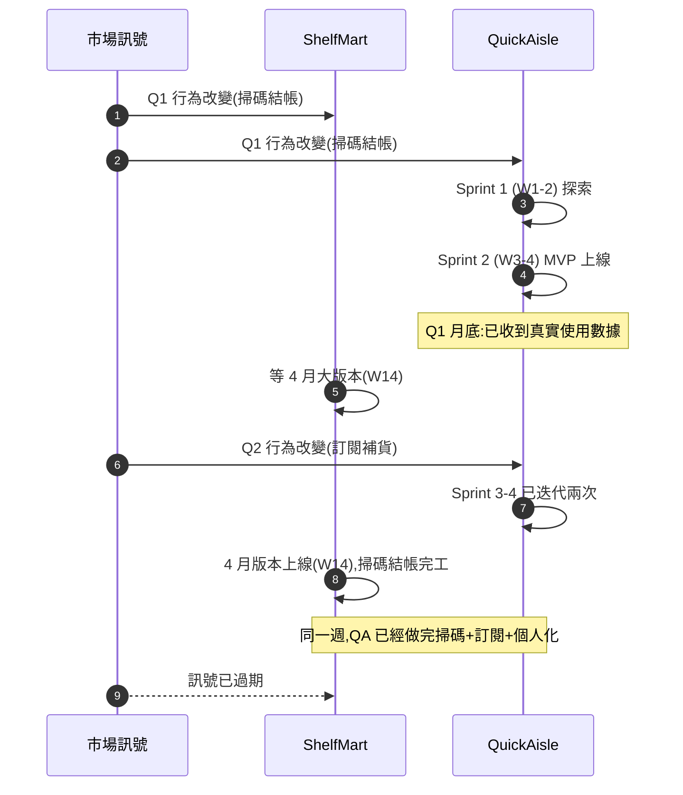
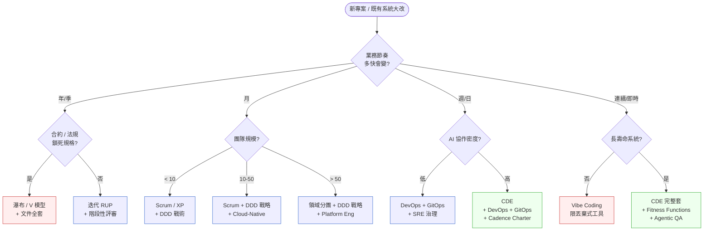

# 第 2 章|SDLC 與方法論演進
## ⸺ 從瀑布到 Context-Driven Engineering

> **前置閱讀**:[Ch 1 為什麼 SA/SD](./ch-01-why-sa-sd.md)
> **下游章節**:[Ch 3 利害關係人與需求工程](./ch-03-project-initiation.md)、[Ch 11 設計總則](../part-03-design/ch-11-architecture-principles.md)、[Ch 38 Context-Driven Engineering](../part-07-ai-era/ch-38-context-driven-engineering.md)
> **延伸補章**:無

---

## 2.1 冷觀察 ⸺ 半年一次的 release,被每兩週一次吃掉

我在 2025 年第二季,跟一家中型電商 **ShelfMart**(`CASE-ECM-002`)的工程主管碰過一次面。

ShelfMart 自有倉、約 280 位員工,主要在東南亞與台灣賣家居用品。線上商店是 Magento 2 改版,後面接一套自製的 OMS(訂單管理系統),再接倉儲。整個系統穩定、營收健康。他們的 release cadence 寫在牆上,字很大:

> **每年 4 月、10 月,大版本上線。中間只開 hotfix 通道。**

那年第一季,一個叫 **QuickAisle** 的競爭者進場,Series A 拿了 1,200 萬美元,團隊 38 個人,後端 Next.js 15 + PostgreSQL 17,每兩週推一個 release,每個月推一個面向消費者的可見變化。第一次促銷他們做了「掃 QR 碼,在實體賣場用手機結帳跳過排隊」,接著兩週做了「結完帳直接在 LINE Bot 問你要不要訂閱補貨」,再兩週做了「個人化貨架」。

ShelfMart 的數位長(CDO)在會議桌上把那季的市佔表攤平,指著一條向下的線跟我說:

> 「我們的系統沒壞、沒當機、沒資安事件。我們就是,慢。」

那天他補了一句,我把它原樣記下來:

> 「我們的對手六個月可以改三次方向,我們六個月只能改一次。一次對了還好,一次錯了就是一年。」

這句話在直覺上很有力,但實際上混進了三件不同的事。ShelfMart 的問題不是「只有一個瓶頸」,而是三個瓶頸疊加,性質各不同:

- **Business Tempo(業務節奏)**:市場每月產生新訊號。QuickAisle 在 Q1 月底就收到掃碼結帳的真實使用數據了。ShelfMart 的訊號到內部要等 60–90 天。
- **Decision Tempo(決策節奏)**:ShelfMart 的戰術級決定(例如「API schema 要不要加一個欄位」)需要走六週的評審流程。這確實太慢,但實際上六週已可做出決定。
- **Deployment Tempo(部署節奏)**:ShelfMart 的真正硬傷。Magento 2 繼承自 2007 年設計理念的架構 + 自製 OMS 緊耦合,任何可見的消費者功能都要碰到三到四個模組,缺乏獨立部署能力。就算 Q1 第一天就拍板做掃碼結帳,也不可能在六週內安全上線 ⸺ 因為架構上跑不通,不是流程上拖太久。

這三個瓶頸要分開治療。CDO 那句「只能改一次方向」指的是決策次數,但如果問 CTO,他會說問題不是「決定太慢」,是「決定了也部署不出去」。



問題不是 ShelfMart 沒做事,是**三個 Tempo 同時失配:業務節奏(月)遠快於決策節奏(六週),而部署節奏(半年)因架構耦合更完全跟不上**。光換流程解決不了部署節奏 ⸺ 那需要動架構。

CDO 那句話的份量,要在他補一個細節之後才完整:他們公司內部其實已經做完一份完整的「掃碼結帳」設計文件 ⸺ 200 頁、ERD、UML、流程圖全有 ⸺ 在 Q1 結束時。那份文件是 4 月才上線的 release 的設計依據。文件本身不爛,做工很好。它的問題是**做完的當下,市場已經換了一個問題了**。

---

## 2.2 真問題 ⸺ SDLC 不是流程選擇,是節奏對齊

回頭看 ShelfMart,很多人會說「他們應該換敏捷」。這句話聽起來像答案,其實沒回答到問題。把它拆開來看就會清楚。

ShelfMart 的瀑布並沒有「執行不力」。每個階段都做了、每個交付都簽了、每張圖都畫了。他們在做的,是**用一個 1990 年代節奏的開發方法,去回應一個 2025 年節奏的市場**。但問題比「換敏捷」更深一層 ⸺ 就算明天把 Scrum 裝上去,Decision Tempo 從六週壓到一週,ShelfMart 的掃碼結帳功能仍然上不了線,因為 Magento 2 + 自製 OMS 的緊耦合架構,讓任何消費者可見的變更都需要同時修改三到四個模組,沒有獨立部署路徑。

換句話說,真正在處理的問題不是單一的「該選哪種方法論」,而是三個 Tempo 同時對齊 ⸺

> 1. **Business Tempo**(業務節奏):市場訊號多快會刷新?ShelfMart 的市場在 QuickAisle 進場後已從季縮到月。
> 2. **Decision Tempo**(決策節奏):從「提出技術決定」到「拍板落地 ADR」要多久?六週對月級市場已是瓶頸,但這是流程問題,可以透過文件化(ADR、CDE)來壓縮。
> 3. **Deployment Tempo**(部署節奏):決定之後,程式碼多快能安全到達生產?ShelfMart 的核心瓶頸在這裡 ⸺ 架構耦合讓每次部署都是全站風險,不是審批流程太慢。CDE 能改善前兩者,但若不解決架構耦合(模組化單體或微服務),Deployment Tempo 不會動。

這個視角放下去,過去 60 年的 SDLC 演進就會變得很乾淨。每個方法論不是「比上一代更好」,而是**在某個時代的節奏失配下,被擠出來的回應**。

### 2.2.1 把演進攤平在一張節奏表上

| 年代 | 主流方法論 | 業務節奏 | 決策節奏 | 為什麼這時出現 |
|---|---|---|---|---|
| 1970s | 瀑布(Waterfall)、結構化分析 | 年/季 | 年 | 主機系統、合約導向、軟體當作工程藍圖交付[^CIT-020] |
| 1980s | V 模型、Spiral | 季 | 季/半年 | 國防、航太、嵌入式系統,要求驗證對應每個階段[^CIT-021] |
| 1990s | RUP、迭代式(Iterative) | 季/月 | 月 | 客戶端/伺服器架構興起,需求變動但仍重前置文件 |
| 2001 | 敏捷宣言(Agile Manifesto)→ Scrum / XP | 月/週 | 週 | 網際網路產品,需求每週變一次[^CIT-022] |
| 2003 起 | Domain-Driven Design(DDD)| 月 | 月 | 大型企業系統,複雜度從技術轉到「業務語意」[^CIT-023] |
| 2007–2010 | Kanban、Lean | 連續 | 日 | 維運壓力上升,把流動取代批次 |
| 2009–2015 | DevOps、SRE | 週/日 | 日 | 雲端讓部署成本逼近零,Dev/Ops 分離成為瓶頸[^CIT-024] |
| 2015 起 | Cloud-Native(CNCF) | 日/小時 | 小時 | 容器、Kubernetes、可動態調度的基礎設施 |
| 2018 起 | GitOps | 連續 | 分鐘 | 把 Git 變成 Source of Truth,部署狀態宣告化 |
| 2024–2025 | Vibe Coding | 不定 | 對話 | LLM 能寫 70% 程式,但脈絡只活在會話裡 |
| 2026 | Context-Driven Engineering(CDE)| 連續 | 小時/班次(驗證連續,決策週級) | AI 持續驗證 Fitness Function;架構決策仍在週級 ADR 評審[^CIT-025] |

**關於 2026 CDE 列的說明**:「決策節奏」欄寫「小時/班次(驗證連續,決策週級)」需要解釋。AI Agent 可以每小時跑一次 Fitness Function 去驗證架構合規性 ⸺ 這是「連續驗證」,讓問題浮現速度從週縮到小時。但「做出架構決策」(例如決定是否換資料庫、是否拆分 Bounded Context)仍然需要人在 ADR 評審中做判斷,節奏是週級。把「AI 能在毫秒內回應 prompt」等同於「團隊能連續做架構決策」是常見的混淆 ⸺ 前者是工具速度,後者是組織認知與協調成本。CDE 的貢獻是讓驗證連續、讓決策有更好的脈絡支撐,但不能讓決策本身的認知成本消失。

每一行的關鍵不是工具,是**第三、四欄的差距**。當業務節奏比決策節奏快兩個量級,不論流程做得多漂亮,結果都是 ShelfMart 那種 ⸺ 文件對、產品錯。

### 2.2.2 1990s 的對 vs 2026 的對

把同一張表的兩端拉出來對比,差別會更清楚:

| 維度 | 1990s 的「對」 | 2026 的「對」 |
|---|---|---|
| 節奏單位 | 季/年 | 週/日,部分連續 |
| 主要交付物 | SRS、ERD、UML 全套 | spec.md、ADR、CLAUDE.md、Skill 包、Cadence Charter |
| 決定發生的位置 | 設計階段、評審會 | 每個 PR、每次 prompt、每次 deploy |
| 文件的角色 | 上線前驗收依據 | 跨人/跨 AI 的協作介面 |
| 失配的代價 | 文件過期沒人看 | AI 失去脈絡、產出與意圖偏離 |
| 治理機制 | 變更控制委員會(CCB) | Fitness Function + 自動化合規檢查 |

兩個時代都有「對」,只是對的形狀不一樣。把 1990 年代的對,套到 2026 年的節奏上,就成了 ShelfMart;把 2025 年的 vibe coding 套到 2026 年的合規系統上,就成了第 1 章的 PayLoop。

### 2.2.3 三個浪潮疊加,而不是取代

值得特別點出來的是:DDD(2003 起)、Cloud-Native(CNCF, 2015 起)、CDE(2026 起)這三個浪潮**不是接續的世代,是疊加的圖層**。

- **DDD** 解的是「業務語意」⸺ Bounded Context、Ubiquitous Language。它跟瀑布、敏捷、CDE 都相容,因為它處理的是「拆問題」這層。
- **Cloud-Native** 解的是「執行節奏」⸺ 容器、K8s、Service Mesh,讓部署從週縮到分鐘。
- **CDE** 解的是「協作介面」⸺ 把脈絡寫成 AI 可讀的格式,讓決定不會隨人或會話消失[^CIT-025]。

ShelfMart 的真正困境,不是「沒做敏捷」,是這三層都還停留在 1990 年代。**只升一層通常救不了**:只升敏捷,DDD 不到位,bounded context 拆錯後拆服務拆爛;只升 Cloud-Native,業務節奏不變,K8s 變成貴的擺飾;只升 CDE,組織決策模式不變,spec.md 也只是另一份過期文件。

---

## 2.3 決策框架 ⸺ 這次該選哪種節奏

「該選哪種方法論」這個問題,如果直接回答,通常會落到「Scrum」這類流行答案,而不是合適答案。比較穩的問法是把它拆成兩個子問題:

1. 業務真正的節奏是什麼?
2. 這個節奏需要的決策節奏是什麼?

兩個子問題各自有可量測的判準,合起來就會把方法論的選擇逼到很窄的範圍。

### 2.3.1 各 SDLC 模型的適用情境

下面這張表在現場很好用,特別是當有人在會議上拋出「我們應該敏捷一點」這種口號時,可以拿出來把對話拉回判準。

| 模型 | 適合 | 不適合 | 主要風險 | 典型代表 |
|---|---|---|---|---|
| **瀑布(Waterfall)** | 規格穩定、合約導向、安全/航太 | 需求變動大、消費者市場 | 後期才驗證,錯了難回 | 政府採購、軍規 |
| **V 模型** | 嵌入式、醫材、車用 | 純應用層 SaaS | 驗證階段重,輕量需求會被壓垮 | 醫療器材韌體、車載控制器 |
| **Spiral** | 高風險研發、原型驗證 | 一般應用開發 | 風險評估循環本身耗時 | 國防研發、太空任務 |
| **迭代(Iterative / RUP)** | 需求逐步浮現的中大型系統 | 小團隊、敏捷成熟組織 | 容易退化成「迷你瀑布」 | 90 年代末企業系統 |
| **Scrum** | 4–9 人團隊、產品可分 sprint 切片 | 連續流動型工作(維運、平台) | 儀式吞時間、Story Point 政治 | 多數 SaaS 產品團隊 |
| **XP(極限編程)** | 工程文化強、TDD/Pair 紀律高 | 工程紀律低的組織 | 無紀律則退化成牛仔模式 | 高紀律新創、開源核心 |
| **Kanban** | 維運、Platform、L2/L3 支援 | 需要長期前瞻規劃 | 流量管理失控、無 cadence | SRE、Platform、客服工程 |
| **DevOps** | 任何節奏要 < 週的產品 | 部署一次半年的封閉系統 | 把「CI/CD 工具」當成 DevOps | 多數雲端產品 |
| **SRE** | 需要 SLO 治理、規模 > 千服務 | 小團隊全棧自管 | 過度形式化、SLO 變成裝飾 | Google、Netflix、Booking |
| **GitOps** | 雲原生、宣告式基礎設施 | 大量手動運維、Snowflake 主機 | Drift 偵測未做、Git 不是真實 SoT | K8s 平台、Crossplane 場景 |
| **DDD** | 領域複雜、跨團隊協作 | 純 CRUD 應用 | 戰術模式做完、戰略沒做 | 大型企業系統 |
| **Cloud-Native** | 流量彈性、多環境部署 | 規模小、IaC 紀律不足 | 工具堆疊膨脹、FinOps 失控 | 中大型雲端產品 |
| **CDE** | AI 高度協作、長壽命系統 | 一次性 PoC、丟棄式工具 | spec/ADR 不被當代碼維護 | 2026 起的多數新系統 |

**這張表的讀法**:從右往左讀更實用。先看「典型代表」是不是你的場景,再回頭看「適合 / 不適合」。從左往右讀很容易選到「最潮的」而不是「最合適的」。

### 2.3.2 決策樹:這次該選哪種節奏



這張圖刻意把「Vibe Coding」放在 hot(警告色)而不是 goal(目標色)。理由是:它是一種**有效但短壽**的節奏,適用於明確會被丟棄的工具。把它當主要開發模式,會落到第 1 章 PayLoop 的位置 ⸺ 不是它本身錯,是**錯位**。

### 2.3.3 一個常被忽略的維度:Feedback Tempo

Business Tempo(業務節奏)、Decision Tempo(決策節奏)、Release Tempo(發布節奏)這三個常被討論。實際在現場,容易被忽略卻最常出問題的是第四個 ⸺ **Feedback Tempo(回饋節奏)**:從使用者實際使用,到團隊收到可行動的訊號之間的延遲。

ShelfMart 的 Release Tempo 是半年,Feedback Tempo 是「下一次大版本之前都收不到具體訊號」⸺ 等於**接近一年**。QuickAisle 的 Release Tempo 是兩週,但他們上 LaunchDarkly 做 feature flag,Feedback Tempo 壓到 24 小時內(灰度 + Amplitude 事件流)。

當 Release Tempo 跟 Feedback Tempo 嚴重失配,表面上是「上線快」,實際上仍然在盲開。比較穩的判準是:

> **Feedback Tempo 應 ≤ Release Tempo × 2**

也就是說,如果你兩週發一次,回饋至少要在四週內回得來;如果回饋要等三個月,那「兩週發一次」只是工程上的快,業務上不會比半年快多少。

---

## 2.4 踩坑清單

下面這四個反模式,是「換了方法論名字、但沒換節奏」的典型結果。共同特徵是 ⸺ 看起來在做敏捷/DevOps/CDE,實際上業務節奏沒任何改變。

### 反模式 1:Scrum-but(我們做 Scrum,但是…)

Ron Jeffries 2007 年點名的句型 [^CIT-026]:「我們做 Scrum,但是 sprint 規劃會還是要兩天」「我們做 Scrum,但是 PO 不參加 daily」「我們做 Scrum,但是回顧會永遠跳過」。儀式還在、效果消失,管理層誤以為投資有回報。

> ✅ **修正方向**:每三個月做一次「Scrum-but 體檢」⸺ 把所有「但是」列出來,各自問「砍掉這條會死嗎」。十條裡通常有六到七條可以砍。剩下的三條,要嘛改成符合 Scrum 的形式,要嘛承認「我們不是做 Scrum,是做混合」。

### 反模式 2:把「敏捷」等同「不寫文件」

承接 [Ch 1 §1.4 反模式 4](./ch-01-why-sa-sd.md):Agile Manifesto 寫的是 "Working software **over** comprehensive documentation",不是 "no documentation"。**過度詮釋成「不寫文件」**,在 AI 協作時代會直接撞牆 ⸺ Agent 沒有 spec/ADR 就只能瞎猜。

> ✅ **修正方向**:把「敏捷」重新定義為「最小可用脈絡」⸺ System Charter 一頁、ADR 一頁、CLAUDE.md 一頁。寫不超過三頁但每一頁都被讀到,比寫 80 頁但沒人看實用得多。

### 反模式 3:把 DevOps 等同 CI/CD 工具堆

買了 GitHub Actions、Argo CD、Datadog、PagerDuty,工具上齊全,但 Dev 與 Ops 還是兩個不講話的部門 [^CIT-027]。DevOps 的 "Cultural" 那一半被忽略,只剩 "Technical" 那一半。

> ✅ **修正方向**:DORA 四指標 + SPACE Framework 並行追蹤(Ch 32 詳述)。任何工具導入前,先問「這個工具會改變哪兩個團隊的協作方式」⸺ 沒答案就不裝。

### 反模式 4:用 Trello 假裝看板

Kanban 不是「Trello 板」[^CIT-028]。真的看板需要:WIP(work-in-progress)上限、清楚的 column policy、cycle time 量測、定期 cadence review。多數團隊只取了「卡片在 column 之間移動」這一層,結果 backlog 暴漲、cycle time 沒人量、瓶頸沒被處理。

> ✅ **修正方向**:任一 column 加 WIP 上限(經驗值 = 團隊人數 × 1.5),每週看 cycle time 中位數。沒上 WIP 的 Trello 板叫「待辦清單」,不叫看板。

---

## 2.5 交付清單 ⸺ 一頁式 Cadence Charter

ShelfMart 那種失配,90% 在 Sprint 0 就可以避免 ⸺ 用一頁文件把四個 Tempo 攤開來看,失配的地方會自己跳出來。

把它存在 `docs/cadence-charter.md`,跟 System Charter(Ch 1)同層。

````markdown
# Cadence Charter — {專案名稱}

> 版本:v0.1 | 撰寫日期:YYYY-MM-DD | 擁有人:{名字}

## 1. Business Tempo(業務節奏)
- 市場 / 客戶行為改變的觀測週期:{日 / 週 / 月 / 季}
- 主要訊號來源:{客戶訪談 / 銷售數據 / 競爭者監測 / 監管變動}
- 訊號到團隊的延遲:{< X 天}

## 2. Decision Tempo(決策節奏)
- 從「提出技術決定」到「拍板 + 落地 ADR」的目標週期:{X 天}
- 決策層級:
  - 戰略級(BC 重劃、平台選型):{季 / 半年}
  - 戰術級(API 改 schema、加 service):{週}
  - 操作級(refactor、bug fix):{日}

## 3. Release Tempo(發布節奏)
- 生產環境部署頻率:{日 / 週 / 雙週 / 月 / 季}
- 部署機制:{手動 / GitOps / Canary / Blue-Green}
- Rollback 平均時間:{< X 分鐘}

## 4. Feedback Tempo(回饋節奏)
- 從上線到收到可行動訊號的目標延遲:{≤ Release Tempo × 2}
- 量測管道:{觀測指標 / A/B 測試 / 客戶訪談 / 客服轉接率}
- 缺口:{若 > 2× Release Tempo,列為 P1}

## 5. 對齊紅旗(任一發生即停下重評)
- [ ] Business Tempo > Decision Tempo × 3
- [ ] Decision Tempo > Release Tempo × 5
- [ ] Feedback Tempo > Release Tempo × 2
- [ ] 任何 Tempo 連續三個季度沒量測

## 6. 本季校準動作
- {動作 1},Owner:{名字},Due:YYYY-MM-DD
- {動作 2},Owner:{名字},Due:YYYY-MM-DD
````

**為什麼分四個 Tempo?** 多數團隊只盯 Release Tempo(部署頻率)。這是必要但不充分的指標 ⸺ 你能每週發版,不代表你能每週做出對的決定,更不代表你每週能收到回饋。四個 Tempo 同時量,失配才會立刻浮現。

**為什麼有「對齊紅旗」?** 失配通常不是突然發生,是慢慢偏掉的。把紅旗訂死,就有自動觸發點。沒紅旗,就會像 ShelfMart 那樣 ⸺ 三年才有人發現問題。

### 2.5.1 範例：ShelfMart 在 QuickAisle 出現後第一週該補的那一頁

ShelfMart 的 CDO 攤開市佔表那一刻,缺的不是另一份 200 頁設計文件,是這頁。下面就是他們在 Q2 開季前**應該**寫、卻沒寫的版本 ⸺ 四個 Tempo 一攤開,半年 release 對上 24 小時 feedback 的失配自己會跳出來:

````markdown
# Cadence Charter — ShelfMart 數位通路 2025

> 版本:v0.1 | 撰寫日期:2025-04-12 | 擁有人:CDO Lin

## 1. Business Tempo(業務節奏)
<!-- 為什麼這欄:市場節奏寫不出來,後面三個 Tempo 都失去比較基準;
     QuickAisle 進場後 ShelfMart 的市場節奏已從季變成月。 -->
- 市場 / 客戶行為改變的觀測週期:**月**(QuickAisle 進場後從季縮短)
- 主要訊號來源:銷售數據(週)、競爭者功能監測(雙週)、客戶訪談(月)
- 訊號到團隊的延遲:目前 60–90 天,目標 < 14 天

## 2. Decision Tempo(決策節奏)
- 戰略級(平台選型、OMS 重構):季
- 戰術級(API 改 schema、加 service):目前 6 週,目標 1 週
- 操作級(refactor、bug fix):目前雙週,目標日

## 3. Release Tempo(發布節奏)
<!-- 為什麼這欄:Release Tempo 是多數人唯一在看的指標,
     但若沒跟 Feedback Tempo 並列,容易誤以為「上線快=決策對」。 -->
- 生產環境部署頻率:目前 **半年大版本 + hotfix**,Q3 目標 雙週
- 部署機制:Magento 維持手動,新 OMS 模組改走 GitOps + Canary
- Rollback 平均時間:目前 4 小時,目標 < 15 分鐘

## 4. Feedback Tempo(回饋節奏)
<!-- 為什麼這欄:這是 ShelfMart 對 QuickAisle 真正落後的維度;
     沒這欄會誤判成「我們上線慢就好」,實際是連訊號都收不到。 -->
- 從上線到收到可行動訊號的目標延遲:≤ 14 天(Release Tempo × 1)
- 量測管道:LaunchDarkly flag + Amplitude 事件流 + 門市 POS 回流
- 缺口:目前 ≈ 90 天,**列為 P1**(Q2 內必須降到 < 30 天)

## 5. 對齊紅旗(任一發生即停下重評)
<!-- 為什麼這欄:失配通常是慢慢偏掉的,訂死紅旗才有自動觸發點;
     ShelfMart 三年沒人發現問題,就是因為沒這條。 -->
- [x] Business Tempo(月)> Decision Tempo(6 週)× 3 的條件 → **觸發**
- [x] Feedback Tempo(90 天)> Release Tempo(180 天)× 2 → 觸發前一刻
- [ ] 任何 Tempo 連續三個季度沒量測

## 6. 本季校準動作
- 引入 LaunchDarkly + Amplitude,Owner:Hsu(平台組),Due:2025-05-30
- OMS 拆出「結帳 BC」改走雙週迭代,Owner:Chen(OMS 組),Due:2025-06-15
- 戰術級 ADR 流程從會議制改為 PR 制,Owner:Lin(CDO),Due:2025-04-30
````

寫到第 5 節兩條紅旗都觸發時,「該不該換敏捷」已經不是問題了 ⸺ 問題變成「先補 Feedback Tempo,還是先拆 BC」,這比抽象方法論之爭好回答得多。

---

## 2.6 本章交付清單 Recap

讀完本章,你應該已經能做到:

- [ ] 把「該選哪種 SDLC」這個問題,翻譯成「四個 Tempo 是否對齊」
- [ ] 用決策樹快速判斷新專案該走哪一套(瀑布 / Scrum / DevOps / CDE)
- [ ] 認得四個常見反模式(Scrum-but / 敏捷=不寫文件 / DevOps=CI-CD / Trello 假看板)
- [ ] 為手上的專案寫好一份 Cadence Charter(一頁,放 `docs/cadence-charter.md`)

如果四項中先挑一項做,建議是最後那一項 ⸺ 把四個 Tempo 寫下來,失配的部分會自己跳出來。後面三項的判斷會輕鬆很多。

---

## Cross-References

- **下一章**:[Ch 3 利害關係人與需求工程](./ch-03-project-initiation.md) ⸺ 把節奏對齊的對話結構化
- **承上前章**:[Ch 1 為什麼 SA/SD](./ch-01-why-sa-sd.md) ⸺ System Charter 與 Cadence Charter 互補
- **設計總則延伸**:[Ch 11 軟體架構原則](../part-03-design/ch-11-architecture-principles.md)
- **AI 時代 CDE 完整展開**:[Ch 38 Context-Driven Engineering](../part-07-ai-era/ch-38-context-driven-engineering.md)

## 引用

[^CIT-020]: Winston W. Royce, "Managing the Development of Large Software Systems" (IEEE WESCON, 1970)。
[^CIT-021]: Barry Boehm, "A Spiral Model of Software Development and Enhancement" (IEEE Computer, 21(5), 1988)。
[^CIT-022]: Beck, Beedle, van Bennekum 等 17 人, "Manifesto for Agile Software Development" (2001)。agilemanifesto.org。
[^CIT-023]: Eric Evans, *Domain-Driven Design* (Addison-Wesley, 2003)。
[^CIT-024]: John Allspaw & Paul Hammond, "10+ Deploys per Day" (Velocity 2009)。
[^CIT-025]: Anthropic, "Building Effective Agents" (2024) 與 2025–2026 系列脈絡工程公開指引。
[^CIT-026]: Ron Jeffries, "We Tried Baseball and It Didn't Work" / Scrum-but 系列文章 (2007 起)。ronjeffries.com。
[^CIT-027]: DORA / Google Cloud, "State of DevOps Report" 系列 (2014–2024)。
[^CIT-028]: David J. Anderson, *Kanban: Successful Evolutionary Change for Your Technology Business* (Blue Hole Press, 2010)。
