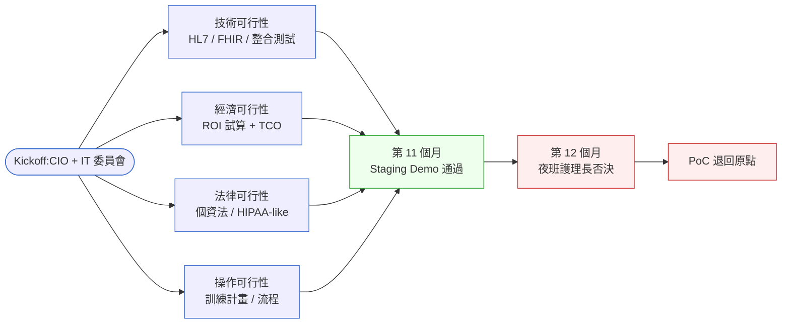
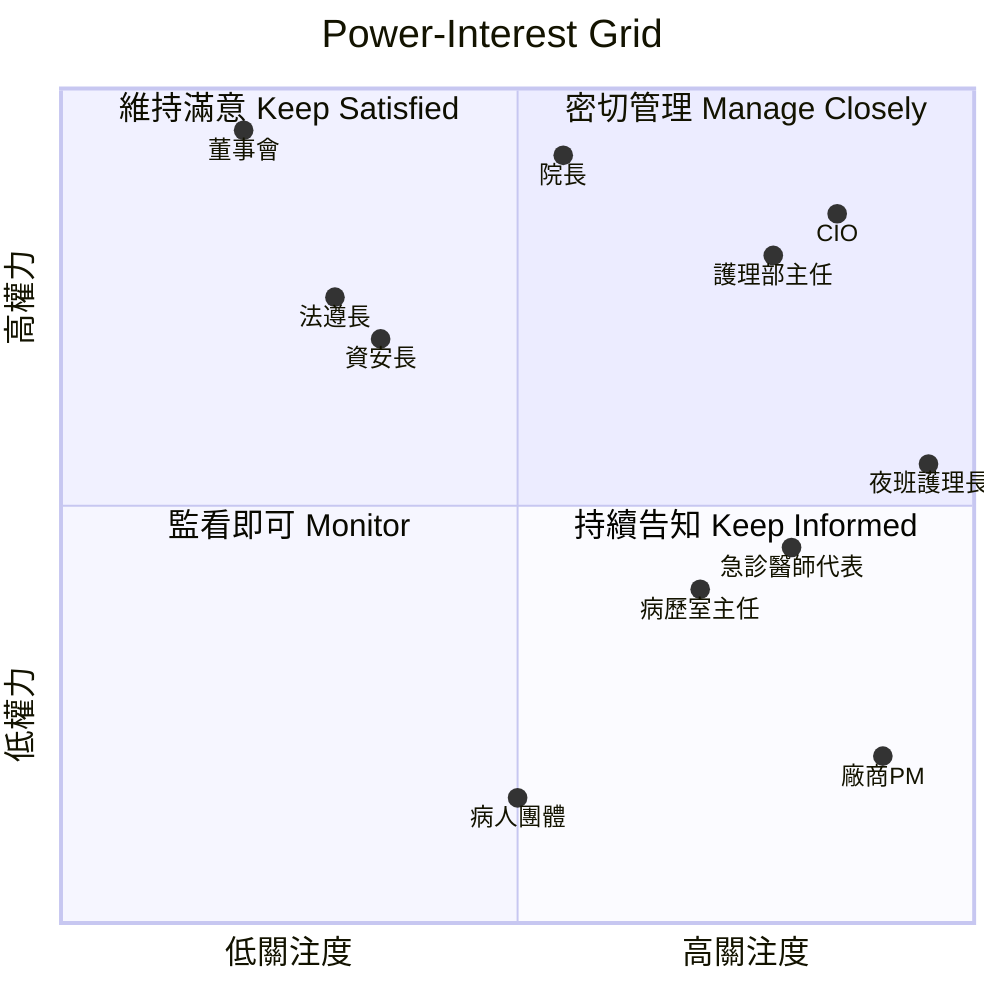
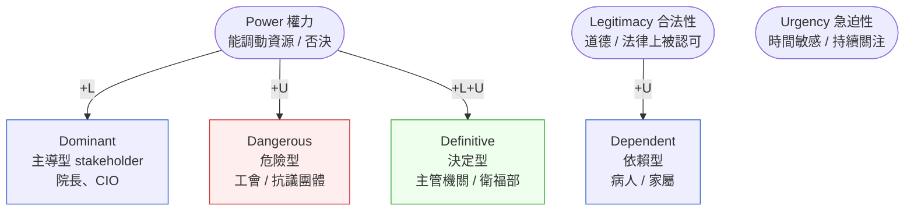
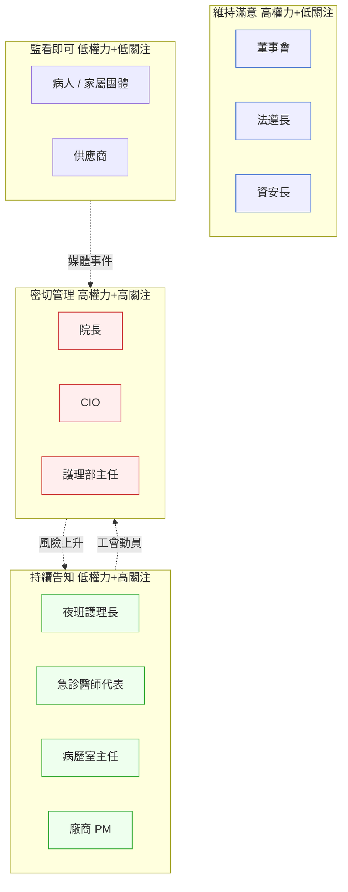

# 第 3 章|專案啟動、可行性研究與利害關係人分析
## ⸺ 啟動階段最大的失敗,不是技術評估

> **前置閱讀**:[Ch 1 為什麼 SA/SD](./ch-01-why-sa-sd.md)、[Ch 2 SDLC 演進](./ch-02-sdlc-evolution.md)
> **下游章節**:[Ch 4 需求工程](./ch-04-requirements-engineering.md)、[Ch 10 風險與不確定性管理](../part-02-analysis/ch-10-spec-documents.md)
> **延伸補章**:[補章 E Compliance by Design](../part-05-quality/chE-compliance.md)

---

## 3.1 冷觀察 ⸺ 12 個月 PoC,被夜班護理長一句話擋下

我在 2024 年看過一個案例。

虛構區域醫院 **聖恩醫療體系(Sheng-En Medical Group)**,旗下三家分院、約 1,200 床,要把跑了 14 年的舊 EMR(Electronic Medical Record,電子病歷)系統換掉,選了一家在台灣中型市場做得不錯的 EMR 廠商 **MedCanvas**(`CASE-HCR-001`)。雙方簽了一份 12 個月的 PoC(Proof of Concept,概念驗證)合約,目標是先把急診與住院兩個科別搬到新平台,跑通 HL7 v2.5 的 ADT(Admit/Discharge/Transfer)訊息與 FHIR R4 的 Encounter / Observation 資源。

技術側其實做完了。第 11 個月,系統在 staging 環境跑得起來,HL7 訊息延遲 < 200ms,FHIR API 通過廠商自己的 Touchstone 測試。CIO 在指導委員會上 demo,投影片做得漂亮,董事會點頭,準備走第 12 個月的試點上線。

第 12 個月第二週,事情卡住了。

夜班護理長(charge nurse)在科部會議上把列印出來的新介面摔在桌上,說了一句話,當時的會議紀錄逐字寫下來:

> 「這個系統三班交班的時候,要點七下才能看到上一班護理師留的觀察。我們現在點兩下。你們要我們半夜兩點多按七下?」

接著她把護理部工會的會員代表名單貼出來,列了 22 位資深護理長的連署,要求 IT 委員會重新評估。三天後,護理部主任在院長室開會,要求暫停 PoC。一個月內,這個 12 個月、估算 NT$4,800 萬的案子被退回原點。

事故覆盤會議上,廠商 PM 的問題不是技術評估漏了什麼,而是更難回答的一句:

> 「我們的可行性研究列了八個利害關係人。為什麼夜班護理長不在裡面?」



這張圖左半邊乍看完整 ⸺ 技術、經濟、法律、操作四維可行性都做了。但右半邊的事告訴你:**真正讓案子死的,是沒有出現在左半邊的東西**。MedCanvas 的可行性研究漏了一個維度:政治可行性(Political Feasibility)。它沒有問:在這個組織裡,誰有能力一句話讓案子停下來?

護理部不是出資方,不是決策者,在 PoC 章程的 sign-off 名單上甚至排不進前五名。但她們是這套系統一天 24 小時、一年 365 天的真正使用者,而且她們有工會,有院長辦公室的行政管道。**她們不是 user persona,她們是 stakeholder ⸺ 而 MedCanvas 把她們當 user persona 處理了**。[^CIT-030]

---

## 3.2 真問題 ⸺ 啟動失敗,通常不是技術評估,是隱性權力地圖

把 MedCanvas 的事故拆開來看,會發現**啟動階段(Initiation Phase)的失敗模式不是隨機的**。它通常落在三個結構性盲點上,而且這三個盲點都跟技術能力無關。

### 3.2.1 可行性研究只算「能不能做」,沒算「會不會被擋下來」

業界沿用幾十年的 TELOS 框架(Technical / Economic / Legal / Operational / Schedule)在多數教科書裡是這樣呈現的:四到五個維度,每個打個分數,加總過門檻就動工。[^CIT-031]

問題是,這五個維度全部假設「組織內部的權力分配是均勻的」。在現實世界,這個假設**幾乎在任何規模超過 30 人的組織裡都是錯的**,而醫院、銀行、政府這類組織錯得最嚴重。

換句話說,可行性研究真正要回答的不只是「我們做不做得出來」,還包括「在這個組織的權力結構裡,這件事走不走得到上線那一天」。後者通常是決定性的,但教科書版的 TELOS 不處理它。本章把 S(Schedule)拿掉、把 P(Political)補進來,得到一個比較貼合現場的版本:**TELOP**。

### 3.2.2 利害關係人盤點漏掉「執行層」與「隱性否決者」

啟動會議上常見的利害關係人清單,八成集中在三類人:出資方(sponsor)、決策者(decision-maker)、技術窗口(technical liaison)。這三類人的共同特徵是**他們在組織圖上有名字**,所以容易被列出來。

但專案能不能活下來,常常取決於另外兩類人,他們在組織圖上幾乎不存在:

- **執行層使用者**:夜班護理師、急診掛號櫃台、藥局調劑窗口。他們不批預算,但他們的日常動作就是系統的真實負載。系統難用,他們會用「系統難用所以我做不完工作」這個語言反推到工會、反推到主管。
- **隱性否決者(Hidden Vetoers)**:法遵、稽核、資訊安全、感染管制、職業安全衛生。他們不主動推進專案,但**任何一條紅線被踩到,他們有能力讓案子停下來**,而且通常不需要解釋太多。

MedCanvas 的失敗,本質上是把「組織圖上的人」當作完整的 stakeholder 清單,沒去摸第二層與第三層。[^CIT-032]

### 3.2.3 風險清冊只列技術風險,沒列「人風險」

打開多數啟動階段的風險清冊(Risk Register),你會看到的條目大概是這個樣子:整合風險、效能風險、資料遷移風險、第三方 API 風險。這些都對,但它們有一個共同特徵:**全是工程師看得見的風險**。

讓 PoC 死掉的風險,通常不在這份清單上。它長這樣:

- 「護理部換主任,新主任不買單」
- 「衛福部更新個資法施行細則,Sandbox 規範變動」
- 「醫師工會理事改選,理事長立場不同」
- 「健保署支付規則調整,影響原本的 ROI 假設」

這些是**組織風險、政治風險、法規風險**,寫進風險清冊的方法跟技術風險不一樣 ⸺ 機率與衝擊都不容易量化,但它們的衝擊一旦發生,通常是案子等級的。

把這三件事合起來看,啟動階段真正要做的不是「拿一份模板填好」,而是**先畫出組織內的隱性權力地圖,再決定要做多深的可行性研究**。這個順序如果倒過來,做出來的可行性研究會很漂亮、但會錯。

---

## 3.3 決策框架 ⸺ TELOP、Power-Interest、與啟動三件套

啟動階段不需要做太多文件,但有三件事值得做透:**TELOP 五維可行性表、Power-Interest Grid、利害關係人盤點清單**。三者合起來大約一頁到兩頁,能擋掉多數的啟動期失敗。

### 3.3.1 TELOP 五維可行性表

把傳統 TELOS 的 S(Schedule,排程)拿掉,補進 P(Political,政治)。原因前面講了:時程是專案管理範疇,放在可行性研究裡會稀釋判斷。**真正會殺死啟動的維度是政治可行性,不是時程**。

| 維度 | 核心提問 | 不通過的訊號 | 可行的訊號 |
|---|---|---|---|
| **T 技術 Technical** | 我們的人、現有平台、現有資料,做得到這件事嗎? | 關鍵能力來自單一外部廠商 / 單一員工 | 至少兩條技術路徑可選,團隊曾做過相近規模 |
| **E 經濟 Economic** | 這件事在 3 年 TCO 下划得來嗎? | ROI 假設靠「未來業務量翻倍」才成立 | ROI 在「業務量持平」假設下仍為正 |
| **L 法律 Legal** | 我們踩到任何紅線嗎? | 個資 / 病歷 / 金流的合規答案是「應該還好」 | 法遵單位已書面 sign-off 範圍 |
| **O 操作 Operational** | 真正每天用這套系統的人,做得了嗎? | 訓練計畫只算「次數」沒算「動線改變」 | 已做過至少一輪實際工作環境的 shadowing |
| **P 政治 Political** | 在這個組織裡,誰能讓這事死掉?他買單嗎? | 沒有任何隱性否決者(法遵 / 工會 / 稽核)被訪談過 | 四個象限的高權力 stakeholder 都被點名且接觸過 |

每個維度可以用 0–3 分:0 = 顯然不行,3 = 顯然可行。**任何一個維度 ≤ 1,案子就應該停下來重新校準,不是繼續往下做**。MedCanvas 的案例,在 P 維度其實只有 0,但這個維度當時根本沒被列上。

### 3.3.2 Power-Interest Grid:把人放進四個象限

Mendelow 1981 年提出的 Power-Interest Grid 是利害關係人分析最廣為使用的工具。[^CIT-033] 它的價值不在於分類本身,而在於**它逼你針對不同象限採取不同策略**,而不是統一發 email 群組通知。



四個象限的處理方式差很多,**用錯象限的策略,常常比沒做還糟**:

| 象限 | 典型角色(EMR 案例) | 接觸頻率 | 接觸方式 | 常見錯誤 |
|---|---|---|---|---|
| **密切管理(高權力 + 高關注)** | 院長、CIO、護理部主任 | 每兩週 | 1-on-1、決策會議 | 把他們當廣播對象,只發週報不互動 |
| **維持滿意(高權力 + 低關注)** | 董事會、法遵長、資安長 | 月度 / 重要節點 | 摘要簡報、紅線 sign-off | 主動拉進每週會,反而引發過度介入 |
| **持續告知(低權力 + 高關注)** | 夜班護理長、急診醫師、廠商 PM | 雙週 | Workshop、shadowing | 只當意見蒐集,不回饋處理結果 |
| **監看即可(低權力 + 低關注)** | 病人團體、家屬代表 | 季度 | 公告、Q&A | 完全忽略 ⸺ 一旦媒體事件,他們會被拉進高權力 |

MedCanvas 當初把夜班護理長放進「監看即可」,實際上她是「持續告知」象限的關鍵節點。**這個分類錯了一格,代價就是 12 個月的 PoC**。

### 3.3.3 Salience Model:當 Power-Interest 不夠用

Mitchell, Agle & Wood 1997 年提出的 Salience Model(顯著性模型)補了 Power-Interest 的一個盲點:**它把「合法性(Legitimacy)」與「急迫性(Urgency)」拉進來,讓你能識別「沒有正式權力、但具有道德訴求且會在媒體上發聲」的群體**。[^CIT-034]



實務上,Power-Interest 適合多數 M 級專案,Salience 適合 L 級(政府、醫療、能源、跨國)。**核心不是用哪個模型,是有沒有真的把名字寫下來、把象限指派下去、把接觸方式排進行事曆**。沒寫下來等於沒做。

### 3.3.4 利害關係人盤點清單(可帶走的格式)

下面這份清單建議放在 `docs/initiation/stakeholder-map.md`,跟 charter 同 repo:

```markdown
## Stakeholder 盤點 — {專案名稱}

| # | 名字 / 角色 | 部門 | 權力 (1–5) | 關注 (1–5) | 象限 | 偏好的接觸方式 | 已知顧慮 | 主要 Owner |
|---|---|---|---|---|---|---|---|---|
| 1 | 王院長 | 院長室 | 5 | 4 | 密切管理 | 月會 + 重大事件即時 | ROI / 醫評 | CIO |
| 2 | 李護理部主任 | 護理部 | 4 | 5 | 密切管理 | 雙週 1:1 | 三班交班動線 | PM |
| 3 | 陳夜班護理長 | 急診 / 護理 | 3 | 5 | 持續告知 | 現場 shadowing + workshop | 點擊次數、響應時間 | UX Lead |
| 4 | 張法遵長 | 法務 | 4 | 2 | 維持滿意 | 紅線 sign-off | 個資法施行細則 | PM |
| ... | | | | | | | | |
```

填這張表時有兩個常見的失準點要避開:

1. **權力與關注分數不要由團隊內部自評**。找一位在組織裡待過 5 年以上、跨部門合作過的人來校準。內部團隊容易把「常聯絡的人」打成高權力,實際上他們可能只是高頻次。
2. **「已知顧慮」這欄如果填不出來,就是還沒訪談過**。沒訪談過的 stakeholder 不應該假設你知道他們在意什麼。這是 MedCanvas 案例的根本問題。

---

## 3.4 踩坑清單

下面四個反模式在啟動階段反覆出現。它們的共同點是**外觀上長得像在做啟動評估,但實質上沒有摸清權力地圖**。每個都附修正方向,下次遇到可以這樣處理。

### 反模式 1:預算可行性灌水

啟動會議上,經濟可行性那一欄常常用「3 年內節省 NT$8,000 萬人力成本」這種句式收尾。問題是當你回頭追,會發現這個數字的假設鏈是:護理師效率提升 15% × 全院 600 位護理師 × 平均月薪 × 36 個月。每個數字單獨看都不算離譜,乘起來就成了夢幻數字。

> ✅ **修正方向**:ROI 假設要做兩個情境 ⸺ 「業務量持平、效率提升 0%」與「業務量持平、效率提升保守值」。如果保守情境下還是正的,案子才有經濟可行性。**ROI 不是賣相,是判斷依據**。再加一條規矩:任何單一假設變動 30%,結論不能反轉,否則該假設要被獨立驗證。

### 反模式 2:用 RACI 取代對話

很多團隊在啟動階段花一整天填 RACI(Responsible / Accountable / Consulted / Informed)矩陣,填完貼上 Confluence,當作利害關係人分析做完了。三個月後跑進現場才發現,被標 C 的法遵長從來沒跟團隊說過話,被標 I 的護理部主任早就把案子歸類成「IT 部門的事」。

RACI 是責任分配工具,不是利害關係人接觸計畫。**它告訴你「誰應該知情」,但不告訴你「他知不知情」、「他買不買單」**。

> ✅ **修正方向**:RACI 完成後,針對每位 R/A/C 加一欄「最近一次實質對話日期」與「下次對話排程」。沒有日期的格子代表還沒接觸過,需要在啟動階段補上。對話可以短(15 分鐘),但要有。

### 反模式 3:user persona 跟 stakeholder 混淆

UX 團隊做了五張 persona 卡片,行銷部很滿意,丟進啟動會議時當作利害關係人分析也做完了。但 persona 是「典型使用者的合成肖像」,stakeholder 是「**有名有姓、有權力、能影響專案命運的真實個人或群體**」。兩者在啟動階段不能互相替代。

夜班護理長不是 persona「李姐,42 歲,有兩個孩子,習慣用 LINE」這種畫像。她是真實的、有名字的、有工會代表權的、上週剛在科部會議發過言的那個人。

> ✅ **修正方向**:Persona 留在 UX 設計階段用,啟動階段的 stakeholder 清單必須是真實名字 + 真實職稱 + 真實聯絡管道。如果兩者用同一份文件,刪掉一份,留的那份只能是 stakeholder 清單。Persona 等到 [Ch 16 UI/UX](../part-03-design/ch-16-uiux-system-view.md) 階段再生。

### 反模式 4:只訪談決策者,不訪談執行者

啟動階段的訪談行程表通常排得很整齊:院長 1 小時、CIO 2 小時、各科主任各 30 分鐘,加起來大約 8 小時搞定。訪談完寫成「需求摘要」,啟動會議用這份摘要 sign-off。

這份摘要的盲點是:**決策者描述的是「我希望這套系統長什麼樣」,不是「這套系統實際被怎麼用」**。前者是願景,後者是日常。願景跟日常的落差,就是 MedCanvas 那 12 個月的縮影。

> ✅ **修正方向**:啟動階段的訪談時數,**決策者與執行者至少要 1:1**(時數比,不是人數比)。具體做法:決策者訪談用會議室,執行者訪談用 shadowing ⸺ 跟著夜班護理師走一趟交班、跟著急診掛號櫃台坐一個下午、看著藥局調劑窗口的真實節奏。Shadowing 一次 4 小時起跳,比訪談紀錄有用十倍。

---

## 3.5 交付清單 ⸺ 一頁式 Project Initiation Brief + Power-Interest Map

啟動階段第一份要產出的,**不是 Project Charter,而是一頁式的 Project Initiation Brief**。Charter 是 Brief 通過後的下一份產物,Brief 是用來決定「值不值得做 Charter」。差一個層級,不要混。

### 3.5.1 Project Initiation Brief 模板

把它放在 `docs/initiation/brief.md`,寫不滿一頁就是寫得不對。

````markdown
# Project Initiation Brief — {專案名稱}

> 版本:v0.1 | 撰寫日期:YYYY-MM-DD | 撰寫人:{名字}
> 複雜度初判:S | M | L  ←(對齊 Ch 1 三維 Triage 表)

## 1. Why Now(為什麼現在做)
- 觸發事件:{法規 / 競爭 / 內部痛點 / 系統壽命到期}
- 不做的代價(用錢、人、時間或合規罰款量化):

## 2. TELOP 五維初判
| 維度 | 評分 (0–3) | 紅旗 | 主要 Owner |
|---|---|---|---|
| T 技術 | | | |
| E 經濟 | | | |
| L 法律 | | | |
| O 操作 | | | |
| P 政治 | | | |

> 任一維度 ≤ 1 即停下重新校準,不續推 Charter。

## 3. 利害關係人初步盤點(連結完整 stakeholder-map.md)
- 已識別的高權力 stakeholder 共 N 位,其中已實質接觸 M 位
- 隱性否決者清單:{法遵 / 資安 / 工會 / 稽核 ...}
- 預期最大政治阻力來源:

## 4. 風險清冊起手(Top 5,涵蓋技術 + 人 + 法規)
| # | 風險描述 | 機率 | 衝擊 | 類別 | 緩解策略 | Owner |
|---|---|---|---|---|---|---|
| 1 | | H/M/L | H/M/L | 技術 / 組織 / 法規 / 政治 | | |
| 2 | | | | | | |
| ... | | | | | | |

## 5. 下一個 Gate 的判斷標準
- [ ] 通過則進入 Charter 撰寫(預計 N 天內)
- [ ] 不通過則退回的具體條件:
- 決策者:
- 決策日期:

## 6. Out of Scope(明確不在這次啟動範圍)
- 我們不做 X,因為 ...
````

**為什麼 Brief 要先於 Charter?** Charter 假設「這事要做」,Brief 不假設。多數啟動失敗的案子,是 Charter 跳過 Brief 直接寫,所以「值不值得做」這個問題從來沒被認真問過。

**為什麼 P 維度放最後?** 因為它最難寫,放在最後逼你不能空著交。寫不出 P 那欄,就是還沒做完啟動評估。

### 3.5.2 一張可帶走的 Power-Interest Map 範例

這張圖建議用 Mermaid `flowchart` 表達(quadrantChart 在多數靜態渲染器上的支援還在浮動),畫成可放進簡報、可貼進 Confluence 的版本:



圖上的虛線比方框更重要 ⸺ 它畫出**象限之間的流動性**。Power-Interest 不是靜態快照:夜班護理長透過工會動員,可以在 48 小時內從「持續告知」跳到「密切管理」;病人團體經過一次媒體事件,也可以從「監看即可」直接進入高權力象限。**啟動階段的功課,是預先想好哪些虛線可能會被觸發,以及觸發時誰要在第一時間接住**。

---

## 3.6 本章交付清單 Recap

讀完本章,你應該已經能做到:

- [ ] 用 TELOP 五維表(技術 / 經濟 / 法律 / 操作 / 政治)替當前專案做一輪可行性初判,且能說出政治可行性為什麼是決定性維度
- [ ] 把專案的利害關係人放進 Power-Interest Grid 四個象限,並對每一格指派接觸頻率與接觸方式
- [ ] 識別出至少三位「組織圖上不顯眼、但能讓專案停下來」的隱性否決者
- [ ] 寫好一頁 Project Initiation Brief(放 `docs/initiation/brief.md`),含 TELOP 評分、Top 5 風險清冊、下一個 Gate 的判斷標準

如果四項中先挑一項做,建議是第三項 ⸺ 把隱性否決者的名字寫下來。寫不出三個,就是這個案子還沒準備好做 Charter。把這個動作做完,再往下讀 [Ch 4 需求工程](./ch-04-requirements-engineering.md)。

---

## Cross-References

- **下一章**:[Ch 4 需求工程與用戶故事](./ch-04-requirements-engineering.md) ⸺ 從利害關係人到可驗證的需求
- **上一章**:[Ch 2 SDLC 與方法學演進](./ch-02-sdlc-evolution.md) ⸺ 啟動階段在不同 SDLC 中的位置
- **風險與不確定性深探**:[Ch 10 風險與不確定性管理](../part-02-analysis/ch-10-spec-documents.md)
- **合規可行性深入**:[補章 E Compliance by Design](../part-05-quality/chE-compliance.md)
- **Charter 的具體格式**:[Ch 1 §1.5 System Charter 模板](./ch-01-why-sa-sd.md#15-交付清單--一頁式-system-charter-模板)

## 引用

[^CIT-030]: Cleland, D. I. & Ireland, L. R., "Project Management: Strategic Design and Implementation" (McGraw-Hill, 2007) — 利害關係人管理章節對「組織圖外利害關係人」的處理。
[^CIT-031]: James A. Hall, "Accounting Information Systems" (Cengage, 9th ed.) — TELOS 框架(Technical / Economic / Legal / Operational / Schedule)的廣為流通版本。
[^CIT-032]: Bryson, J. M., "What to do when stakeholders matter" (Public Management Review, 2004) — 對隱性否決者(hidden vetoers)概念的學術整理。
[^CIT-033]: Mendelow, A. L., "Environmental Scanning: The Impact of the Stakeholder Concept" (ICIS 1981) — Power-Interest Grid 原始來源。
[^CIT-034]: Mitchell, R. K., Agle, B. R. & Wood, D. J., "Toward a Theory of Stakeholder Identification and Salience" (Academy of Management Review, 1997) — Salience Model 原始論文。
