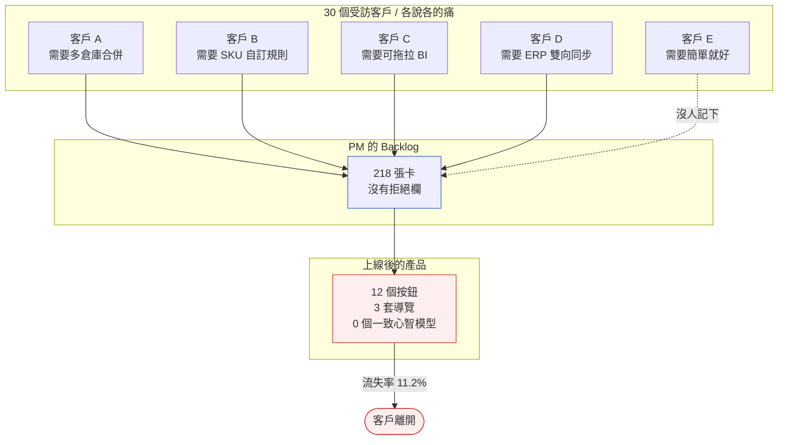
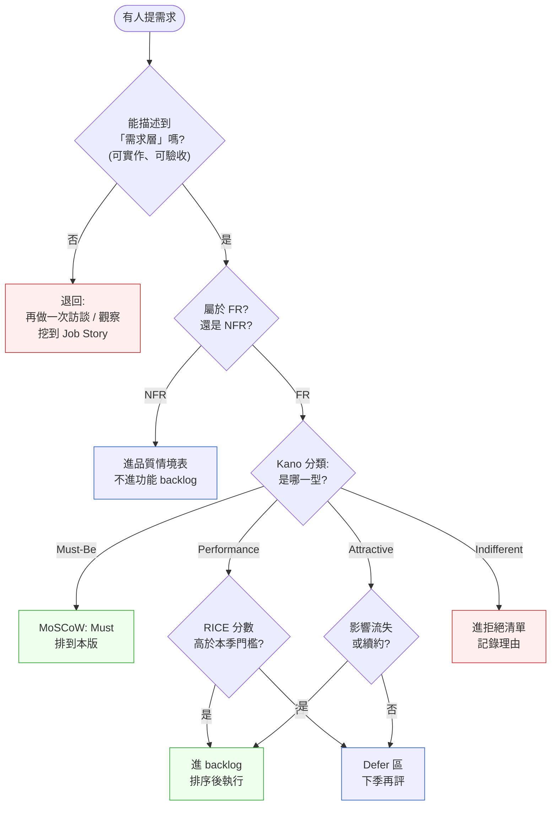

# 第 4 章|需求工程基礎
## ⸺ 從訪談到拒絕清單

> **前置閱讀**:[Ch 1 為什麼 SA/SD](./ch-01-why-sa-sd.md)、[Ch 3 利害關係人地圖](./ch-03-project-initiation.md)
> **下游章節**:[Ch 5 UML 模型語言全景](./ch-05-uml-overview.md)、[Ch 7 用例與流程](../part-02-analysis/ch-07-object-oriented-analysis.md)、[Ch 10 NFR 與品質情境](../part-02-analysis/ch-10-spec-documents.md)
> **延伸補章**:[Ch 17 多模態 UX 與需求](../part-03-design/ch-17-cux.md)

---

## 4.1 冷觀察 ⸺ 30 個客戶,30 種未來,Frankenstein 的流失率

我在 2025 年第二季看過一個案例。

虛構 B2B SaaS 公司 **FlowDeck**(`CASE-SAS-001`),做給中型零售業的營運儀表板,五個產品經理、十二個工程師,ARR 約 320 萬美元。年初時 CEO 在董事會上拍板:「今年的目標是把流失率從 8.4% 降到 4%。」做法很乾脆 ⸺ 每個 PM 領 6 個重點客戶,出去訪談,把痛點蒐集回來放進 backlog。

第六週,backlog 從原本的 47 張卡膨脹到 218 張。第十週,工程團隊開始 sprint;PM 排優先級的方法是「誰客戶比較大就先做誰的」。第二十週,產品上線了三個新模組:多倉庫庫存合併、客製化 SKU 編碼規則、可拖拉的 BI 報表編輯器 ⸺ 分別來自三個不同客戶的訪談筆記。

第二十六週的 NPS 報告出來,反而從 32 掉到 19。客戶 success 團隊的話原樣記在這裡:

> 「以前他們用我們的產品是因為簡單。現在每個畫面都有十二個按鈕,沒有一個是他們點的。」

到第三十六週,流失率不是降到 4%,是升到 11.2%。CTO 在覆盤會問了一句話,當時記在白板上,後來變成這家公司內部那一年最常被引用的句子:

> 「我們把每個客戶的願望都做進來了,結果做出來的東西沒有任何一個客戶想要。」



事後拆解,真正讓 FlowDeck 流血的不是少做了某個功能,**是 backlog 裡沒有一欄叫做「不做的理由」**。每張卡都有 owner、有截止日、有故事點,但沒有人需要為「為什麼這張卡不該被做」負責。於是只要客戶提了,就先進 backlog;進了 backlog,就遲早會被排上;排上了,就遲早會出貨。

需求蒐集從來不是 FlowDeck 的問題。他們的訪談做得比同業仔細,問卷回收率超過 60%,連 Diary Study 都做了兩輪。問題是**蒐集得越仔細,Frankenstein 就拼得越完整**。

---

## 4.2 真問題 ⸺ 需求工程的真正產物是「拒絕清單」

把 FlowDeck 的事拆開來看,需求工程在現場常被誤解成兩件事:一件是「跟客戶聊天」,一件是「把聊天結果寫成清單」。聽起來像在做事,但兩件事都漏掉了真正困難的那一段 ⸺ 在 30 個聲音之間做出**有理由的取捨**。

### 4.2.1 客戶說的話,客戶想要的事,客戶會付錢的功能

這三件事很少重合。Karl Wiegers 在《Software Requirements》第三版裡有一句話被引用得很頻繁 [^CIT-040]:

> *Customers don't always know what they need, but they always know what frustrates them.*

換句話說,訪談蒐到的通常是**症狀**,不是**需求**。客戶說「我要一個可拖拉的 BI 報表編輯器」,他真正在處理的可能是「每個月底我要花四小時手刻 PPT 給老闆看」。這兩個敘述,在 backlog 裡會長成截然不同的兩張卡:前者是六個月的工程量,後者可能只是一個排程匯出 + 三個預設模板。

把它再拆細一點,訪談到的「客戶聲音」可以分成三層,而真正能進 backlog 的只有最底那一層:

| 層級 | 客戶說的話 | 背後其實是 | 適合的 artifact |
|---|---|---|---|
| **症狀層** | 「報表編輯器太難用」 | 工具與場景脫節 | 訪談筆記 |
| **問題層** | 「我每月底要手刻 4 小時 PPT」 | 時間 / 流程痛點 | Job Story |
| **需求層** | 「給我一鍵把當月儀表板輸出成可編輯 PPT」 | 可被實作、可被驗收 | User Story / Use Case |

蒐集技術做得再多,如果沒有從症狀層往下挖到需求層,backlog 就會越長越像 Frankenstein。

### 4.2.2 需求文件的「負空間」⸺ 寫下來的是少數,值錢的是多數

設計的領域有個說法叫 negative space ⸺ 一張海報的力量,常常不來自畫了什麼,而來自留白的部分。需求文件其實也一樣。

一份 backlog 寫進 200 個需求,真正定義產品形狀的不是這 200 個,**是被擋在 backlog 外面的那 600 個**。如果這 600 個的拒絕理由沒有被記錄,半年後新來的 PM 不知道為什麼當初沒做,於是再提一次;客戶不知道為什麼當初沒做,於是再施壓一次;CEO 不知道為什麼當初沒做,於是再拍一次板。

每一輪重新討論,都在燒同一筆決策成本。

### 4.2.3 需求工程的真正產物

把這兩件事合起來:需求工程在 2026 年的真正產物,不是「我們要做什麼」的清單,而是**「我們想清楚了該做什麼、不該做什麼,以及為什麼」的證據**。它可以是一份精簡的 PRD,可以是一份 Job Story 集合,也可以是一份 Decision Log ⸺ 形式不重要,但必須能回答三個問題:

1. 這件事為什麼**進** backlog?(進場理由)
2. 那件事為什麼**沒進** backlog?(拒絕理由)
3. 哪件事為什麼**先做**?(順序理由)

少了第二個問題,backlog 就是 Frankenstein 的零件清單;少了第三個問題,工程團隊就在用「誰嗓門大」當優先級函數。

### 4.2.4 兩種膨脹路徑 ⸺ Decision Log 能防哪一種?

在繼續談框架之前,有一件事值得說清楚:**「12 個按鈕」可以從兩條完全不同的路走出來**,而本章的 Decision Log 只能擋住其中一條。

**路徑 A:沒有過濾的需求接受。** PM 蒐集回 30 個客戶聲音,每一條都直接進 backlog,沒有人問「這張卡為什麼該做」。於是多倉庫合併、SKU 引擎、可拖拉 BI 三個模組同時上線,每個模組各帶幾個按鈕,加在一起就是那 12 顆。客戶 E 說「以前很簡單」⸺ 不是因為 UX 做壞了,是因為根本不應該做這三件事。**這是 Decision Log 能預防的場景**:明確的拒絕欄位,會強迫每張卡在進 backlog 前先回答「為什麼這件事值得做」。

**路徑 B:做了對的功能,但做得不好。** 假設 FlowDeck 只做了那一個多數客戶真正需要的多倉庫合併,卻沒有做可用性測試、上線後沒有更新 onboarding 文件、現有客戶看到新畫面不知道怎麼操作。NPS 一樣會跌,流失率一樣會升,客戶一樣會說「找不到我要的按鈕」⸺ 但這次問題不是功能太多,而是**功能驗收太淺**。Decision Log 對這條路徑沒有直接幫助;它需要的是另一組工具:可用性測試、採用率監控、onboarding 更新流程。

把這兩條路徑放在一起,**本章的框架對應的是路徑 A**。它能幫你回答「要做什麼、不做什麼」,但不能替代「做出來的東西有沒有被用戶接受」這個問題。後者的驗證機制留給 [Ch 10 NFR 與品質情境](../part-02-analysis/ch-10-spec-documents.md) 與 [Ch 27 可觀測性](../part-05-quality/ch-27-observability.md) 展開。在這裡先把邊界釘住:Decision Log 防的是「沒有理由的進場」,不是「有理由進場但執行走偏」。

---

## 4.3 決策框架 ⸺ 蒐集 × 分類 × 優先級 × 拒絕

### 4.3.1 蒐集技術 × 適用情境矩陣

蒐集需求的技術,現場常見的有七種。每一種都有它擅長的場景,**沒有哪一種能單打獨鬥**。下面這張表把它們的成本、產出、適用情境壓在一起,實務上做需求蒐集時可以照著挑:

| 技術 | 主要產出 | 單位成本 | 最強場景 | 最弱場景 |
|---|---|---|---|---|
| **訪談(Interview)** | 動機、脈絡、未說出口的痛 | 中(每場 1–2 小時) | 早期探索、新領域 | 大量量化驗證 |
| **問卷(Survey)** | 量化分布、優先級信號 | 低(規模化便宜) | 已知假設的驗證 | 探索未知問題 |
| **觀察(Contextual Inquiry)** | 真實流程、繞過的工作流 | 高(需現場、需信任) | 客戶嘴上講不清的場景 | 遠端 SaaS、隱私敏感 |
| **原型(Prototype)** | 對「具體選項」的反應 | 中(設計工時) | 介面、互動、新概念 | 需求探索初期 |
| **JAD(Joint App Design)** | 跨角色共識、邊界釐清 | 高(時間 × 人數) | 整合系統、多 stakeholder | 異步團隊、文化衝突大 |
| **A/B 測試** | 行為真相(不是意見) | 低–中(若有流量) | 已上線產品、增量改進 | 0–1 階段、低流量 |
| **Diary Study** | 縱向行為、情境變化 | 中–高(2–4 週) | 偶發場景、情緒曲線 | 急著決策的單點問題 |

挑選的拇指法則是**用兩種以上、互相校正**:訪談 + 問卷(質 + 量)、原型 + A/B(意見 + 行為)、JAD + Diary Study(共識 + 真相)。單一技術都會偏,組合起來才會準。

FlowDeck 那一年的問題不是某一種技術做得不好,**是七種裡只用了訪談一種,還把它當成已經做完了驗證**。30 個訪談看起來樣本不小,但每個 PM 各做各的、沒有交叉、沒有量化、沒有原型驗證,最後出來的就是 30 個高解析度的「症狀層」聲音,而非可實作的需求層描述。

### 4.3.2 功能性 vs 非功能性 ⸺ 兩種需求要分開放

蒐集到的需求要能用,第一步是分類。最該分清楚的兩類是**功能性需求(Functional Requirement, FR)** 與 **非功能性需求(Non-Functional Requirement, NFR)**。IEEE 830 [^CIT-041] 定義的分類沿用至今:

- **FR**:系統「做什麼」⸺ 動作、輸入、輸出、狀態轉移。
- **NFR**:系統「以什麼樣的品質做」⸺ 效能、可用性、安全、可維護、合規。

混在一起的後果現場常見:一張卡寫「做匯出 PPT 功能」,工程估了 3 天,實作出來客戶說「太慢了,要 30 秒內」。那個「30 秒內」是 NFR,從來沒有被討論過,於是工程團隊回頭重寫了一週。

把它們拆開放是現場比較穩的做法 ⸺ FR 進 backlog,NFR 進**品質情境表(Quality Scenario)**。後者長這樣:

```
Source: 一般使用者
Stimulus: 點擊「匯出當月儀表板為 PPT」
Environment: 正常負載、儀表板含 12 個圖
Response: 完成下載
Response Measure: P95 ≤ 30 秒、檔案 ≤ 8 MB
```

NFR 細節留給 [Ch 10](../part-02-analysis/ch-10-spec-documents.md) 展開。本章先記住一件事:**FR 與 NFR 混在同一張卡,是 backlog 開始失準的第一個徵兆**。

### 4.3.3 優先級方法對照 ⸺ MoSCoW / Kano / RICE / WSJF

排優先級的方法現場有四種主流,各自處理不同的問題。挑選時值得先想清楚:**你現在在解決哪個問題?**

| 方法 | 解的是什麼問題 | 輸入需要 | 適合階段 | 弱點 |
|---|---|---|---|---|
| **MoSCoW** | 範圍切割 — 這版上 / 不上 | 簡單分類 | 範圍鎖定、合約交付 | 易變成「全部 Must」 |
| **Kano**[^CIT-042] | 客戶情緒對應 — 哪些是基本、哪些是驚喜 | 客戶問卷(雙向題) | 產品定位、PMF 期 | 需要量化問卷成本 |
| **RICE** | 投資回報 — Reach × Impact × Confidence ÷ Effort | 量化估計 | 增量改進、PM 排期 | 估計值容易自我說服 |
| **WSJF**[^CIT-043] | 延遲成本 — Cost of Delay ÷ Job Size | CoD 評分 | 大型敏捷、SAFe 環境 | CoD 主觀,需多人校準 |

四個方法不是互斥,**可以分層套用**:用 MoSCoW 切大範圍 → 在 Must 裡用 RICE 排序 → 在跨團隊衝突時用 WSJF 仲裁 → 用 Kano 在每季回看「我們是不是又把基本款當成驚喜款在做」。

FlowDeck 那年用的是「客戶大就先做」⸺ 換句話說,以**月費高低**當優先級函數。這個函數的問題在於,它把所有需求都當成同一種:都是「Performance」(Kano 用語)型的、做了會線性加分的需求。但真實世界裡,十張卡有四張是 Must-Be(沒做就是 bug)、四張是 Performance、一張是 Attractive(做了驚喜)、一張是 Indifferent(做了沒人在意)。月費函數沒辦法分辨這些,於是大客戶要求的 Indifferent 也會被優先做。

### 4.3.4 一張決策樹:這個需求要不要進 backlog?

把上面這些壓在一起,做成一張在會議桌上可以直接走完的圖:



這張圖的關鍵不是分支邏輯,**是兩個出口**:Reject 與 Defer。少了這兩個出口,所有需求最後都會流向 Backlog ⸺ FlowDeck 就是這樣走到第 218 張卡。

### 4.3.5 三種敘事格式 ⸺ User Story / Job Story / Use Case

需求進到 backlog 之後,接下來的問題是**用什麼格式描述它**。現場流行的三種,各自服務不同的目的:

| 格式 | 模板 | 強調 | 適合場景 |
|---|---|---|---|
| **User Story**(Mike Cohn)[^CIT-044] | As a {role}, I want {feature}, so that {benefit}. | 角色 + 動作 + 動機 | 已知使用者輪廓、Sprint 拆解 |
| **Job Story**(Intercom)[^CIT-045] | When {situation}, I want to {motivation}, so I can {expected outcome}. | 情境 + 動機 + 結果 | 跨角色場景、PMF 探索 |
| **Use Case**(Ivar Jacobson)[^CIT-046] | Actor / Precondition / Main Flow / Alternative Flows / Postcondition | 完整流程、邊界與例外 | 整合系統、合約交付、嚴謹合規 |

挑選的拇指法則是**按產品階段往上加密度**:0–1 階段用 Job Story(情境 > 角色)、1–10 階段用 User Story(已知角色拆 sprint)、10–100 階段或合規高的場景用 Use Case(邊界與例外要寫死)。

三者之間不是互斥,而是同一個需求可以**多視角共存**:User Story 進 sprint board,Use Case 進合約附件,Job Story 進 PRD 開頭的「為什麼」。

### 4.3.6 需求追蹤矩陣(RTM) ⸺ 不是一次性產物

需求追蹤矩陣(Requirements Traceability Matrix, RTM)在傳統 CMMI / IEEE 流程裡是一張大表,把每個需求對應到設計、測試案例、缺陷紀錄。多數團隊在 kickoff 時做完一次,然後再也沒有更新過。半年後它就是檔案室裡的一份化石。

讓 RTM 在現場活著的做法,是**把它縮小、嵌進 git**:

- 每個需求在 issue tracker 有 ID(`REQ-2026-0042`)
- 每個 commit / PR 在 message 中引用該 ID(`refs REQ-2026-0042`)
- 每個測試案例的標題或 tag 中嵌 ID
- 用一個簡單的 CI script 在每次 PR 自動產出當前的 RTM,當作 readiness 看板

這樣一來,RTM 不是季度才看一次的大表,**而是每次 PR 都在自己更新的活物**。詳細做法留給 [Ch 34 Fitness Functions](../part-06-engineering/ch-34-fitness-functions.md) 展開,本章先把概念釘住:RTM 的價值不在「曾經做過一份」,在「永遠是當前的真相」。

### 4.3.7 2026 視角 ⸺ AI Agent 友善的需求格式

寫需求文件的時候,2026 年的讀者多了一位:會寫程式的 AI Agent。它的特性決定了需求文件的形狀也要跟著變:

- **它不會猜你的脈絡** ⸺ 沒寫進文件的決定,它讀不到。
- **它對結構化敏感** ⸺ Markdown 標題、YAML frontmatter、明確的 section 名稱會大幅提高它的命中率。
- **它的長 context 是有效衰減的** ⸺ 越前面的資訊權重越高,越後面越容易被忽略。

於是 AI 友善的需求文件(*spec-as-prompt-context*)有幾個現場可驗證的特徵:

1. **每份 spec 自帶 frontmatter**:`id`, `status`, `owner`, `acceptance_criteria` 都是 YAML 欄位,不是散文。
2. **驗收條件可機讀**:用 Given / When / Then 寫,而不是「需要快一點」這種模糊敘述。
3. **拒絕理由也是脈絡**:`out_of_scope` 區塊明確寫「不做 X,因為 Y」⸺ 這對 AI 比對 humans 更重要,因為 AI 不會「自然知道我們不做雙因素認證」。
4. **連結 ADR**:每個需求引用其依賴的決策(`adr_refs: [ADR-0012, ADR-0017]`),讓 AI 拉脈絡時能順著引用走。

這個方向會在 [Ch 37 Context-Driven Engineering](../part-07-ai-era/ch-38-context-driven-engineering.md) 整章展開。本章先把它當成下游的伏筆。

---

## 4.4 踩坑清單

下面四個反模式,在做需求工程的團隊裡反覆出現。它們的共同點是**外觀像在做需求工程,實質上沒有產生「拒絕的證據」**。每一個都附修正方向。

### 反模式 1:客戶說什麼都做

每個 PM 領自己的客戶名單,蒐回來的需求都進 backlog,因為「客戶嘛,先進來再說」。半年後 backlog 218 張,心智模型完全沒了主軸。FlowDeck 走的就是這條路。

> ✅ **修正方向**:在 backlog tool 裡新增一欄叫 **Rejected**,跟 Done 並列。每週的 backlog grooming 會議,要求至少**移三張卡到 Rejected**,並寫上拒絕理由(一句話即可)。這個小改動會逼出選擇,而且讓拒絕變成可追溯、可被引用的決策,而不是消失在 Slack 裡的某次討論。

### 反模式 2:需求文件寫成 spec(把該定義行為的地方寫成實作步驟)

PRD 寫了 60 頁,但每一頁都在描述「按鈕長什麼樣、欄位幾個 px、API 路徑叫什麼」。工程團隊照著做完發現:**需求是什麼從來沒有被寫下來**,只有解法被寫下來。一旦解法被驗證不對,沒有一份文件能告訴你原本要解的問題是什麼。

> ✅ **修正方向**:PRD 的每一節以「Why → What → How」三層結構寫,**Why 與 What 是 PM 的責任,How 是工程的責任**。把實作細節從 PRD 拉出來,放到 ADR 或 design doc。一個現場可用的篩子是:把 PRD 拿給沒參與討論的工程師看,如果他能用三種以上不同實作達成,代表 PRD 寫對了(留了實作空間);如果他只看得到一種實作,代表 PRD 寫成了 spec。

### 反模式 3:功能性與非功能性混在一起

「做匯出 PPT 功能」這張卡同時隱含「30 秒內完成」「檔案 ≤ 8MB」「失敗時要有 retry」「要支援未登入下載連結」。工程估點時只估了功能,做完才發現 NFR 全部沒做。然後 PM 說:「啊?這不是當然要的嗎?」工程說:「卡上沒寫。」雙方都對,但專案晚兩週。

> ✅ **修正方向**:每張 backlog 卡的描述模板裡**強制留一個 NFR section**。如果這張卡沒有 NFR,寫「無 NFR 要求」也算。NFR 的描述用 Quality Scenario 格式(Source / Stimulus / Response / Response Measure),不接受「要快一點」「要穩定」這種模糊詞。NFR 的整體 catalog 在 [Ch 10](../part-02-analysis/ch-10-spec-documents.md) 展開,但本章層級的最小劑量是「卡上有那個 section」。

### 反模式 4:追蹤矩陣只在 kickoff 做一次

專案啟動時做了一張 RTM,把 60 個需求對應到 240 個測試案例。三個月後,需求改了 80 次、測試案例改了 300 次,但 RTM 那張 Excel 還停在 kickoff 那一天。當稽核員來問「請出示 REQ-2026-0042 的測試證據」時,大家在 Slack 裡找了兩天。

> ✅ **修正方向**:RTM 不靠人工維護,**靠 commit 與 issue tracker 的 ID 引用自動聚合**。每個 PR title 必須帶 `REQ-NNNN`,CI 跑一次聚合 script,產出當前的 RTM 當 artifact。這樣 RTM 就不是一張會過期的表,而是每次 PR 都自我更新的視圖。先做這一件,之後再讀 [Ch 34](../part-06-engineering/ch-34-fitness-functions.md) 把它升級成 Fitness Function。

---

## 4.5 交付清單 ⸺ 一頁式 Requirements Decision Log

每個專案開工後,**第二份要產出的不是 backlog,是 Requirements Decision Log**(第一份是 Ch 1 的 System Charter)。它是一頁 Markdown,把所有經過評估的需求分成 Yes / No / Defer 三欄,每筆都有理由與決策日期。

把它存在 `docs/requirements/decision-log.md`,跟程式碼同 repo,每次 backlog grooming 之後更新。

````markdown
# Requirements Decision Log — {專案名稱}

> 版本:v0.3 | 最近更新:YYYY-MM-DD | 擁有人:{PM 名字}
> 對齊:System Charter v0.1、ADR-0001 ~ ADR-0017

## 1. Yes — 已決定要做

| ID | 需求摘要 | Kano | 進場理由 | Decided On | Owner |
|---|---|---|---|---|---|
| REQ-0042 | 一鍵匯出儀表板為 PPT | Performance | 解月底手刻痛,RICE = 86 | 2026-04-12 | Alice |
| REQ-0051 | 多倉庫庫存合併視圖 | Must-Be | 客戶 A/B/D 都缺,流失風險 | 2026-04-15 | Bob |

## 2. No — 已決定不做(拒絕清單)

| ID | 需求摘要 | 提出來源 | 拒絕理由 | Decided On | 重新評估時點 |
|---|---|---|---|---|---|
| REQ-0073 | 可拖拉 BI 報表編輯器 | 客戶 C | 已被 REQ-0042 涵蓋 80% 場景,維護成本高 | 2026-04-18 | 不再評估 |
| REQ-0088 | 客製化 SKU 編碼引擎 | 客戶 B | 屬於單一客戶 Indifferent 需求,不擴大產品邊界 | 2026-04-20 | 2027-Q1 |
| REQ-0091 | 自家 SSO 接入(非 SAML) | 客戶 E | 與既有 ADR-0009 抵觸,改建議走 SAML | 2026-04-22 | 不再評估 |

## 3. Defer — 暫不做,但保留

| ID | 需求摘要 | Defer 理由 | 觸發條件 | 重新評估時點 |
|---|---|---|---|---|
| REQ-0064 | ERP 雙向同步 | 等待 ADR-0021(Event Bus 選型)定案 | ADR-0021 落地 | 2026-Q3 |
| REQ-0079 | 行動 App 通知 | 流量未達 PMF 門檻 | DAU > 5,000 | 每月初檢視 |

## 4. 本期關鍵拒絕原則(Rejection Heuristics)

- 任何來自單一客戶且 Kano = Indifferent 的需求,默認進 No 欄。
- 與既有 ADR 抵觸的需求,默認進 No 欄,並回連結到衝突的 ADR。
- 估點 > 5 SP 但 Reach 覆蓋 < 10% 用戶的需求,默認進 Defer 欄。

## 5. 變更紀錄

- 2026-04-22:REQ-0091 從 Defer 改為 No(理由:ADR-0009 已鎖死 SSO 路線)。
- 2026-04-15:新增「本期關鍵拒絕原則」第三條。
````

**為什麼三欄並列?** 把 Yes / No / Defer 放同一頁,等於把「沒做的事」與「做了的事」放在同等可見的位置。半年後新 PM 接手,會先看到 No 那一欄 ⸺ 那是這個產品為什麼是這個形狀的真正答案。

**為什麼每筆要有日期與理由?** 因為人類記憶會褪色。一年後沒人記得「為什麼當初不做客製 SSO」,但 log 裡寫著「2026-04-22 / 與 ADR-0009 抵觸」就夠了。這份 log 不是給現在的人看,是給接手的人看 ⸺ 不論接手的是新 PM、新工程師,還是 AI Agent。

**為什麼要列 Rejection Heuristics?** 因為原則比個案重要。當下次客戶 F 又提出「客製化我們公司專屬的 X」,新 PM 不需要重新一輪辯論 ⸺ 翻到 §4 那條原則,引用 REQ-0088 當前例,五分鐘內就能回覆客戶。Heuristic 是把過去的判斷沉澱成下次的速度。

### 4.5.1 範例:FlowDeck 第 26 週覆盤後該開的那一頁 Decision Log

第 218 張卡膨脹到讓 NPS 從 32 跌到 19 的時候,FlowDeck 缺的不是另一輪訪談,是這頁。下面就是 CTO 在覆盤會後**應該**從第 1 張卡開始補的版本 ⸺ 把已經做進去的、不該做的、暫不做的三欄並列,Frankenstein 的零件清單就會被自然壓縮回產品形狀:

````markdown
# Requirements Decision Log — FlowDeck 2025 Q3 收斂版

> 版本:v0.3 | 最近更新:2025-09-15 | 擁有人:Wei(產品長)
> 對齊:System Charter v0.2、ADR-0001 ~ ADR-0009

## 1. Yes — 已決定要做(本季僅留 5 張)
<!-- 為什麼這欄:Yes 那欄寫越短,產品形狀越清楚;
     第一輪寫不超過 5 張,逼自己回答「真正的核心是什麼」。 -->

| ID | 需求摘要 | Kano | 進場理由 | Decided On | Owner |
|---|---|---|---|---|---|
| REQ-0042 | 一鍵匯出當月儀表板為可編輯 PPT | Performance | 解月底手刻 4hr 痛,RICE = 86 | 2025-09-08 | Alice |
| REQ-0103 | 把 12 按鈕導覽收斂為 4 個一級項 | Must-Be | NPS 訪談 22/30 提及「找不到」 | 2025-09-10 | Yu |
| REQ-0107 | 預設儀表板模板 ×3(零售常用) | Must-Be | 新客上線時間 21 天 → 目標 7 天 | 2025-09-12 | Alice |

## 2. No — 已決定不做(拒絕清單,本季新增 6 條)
<!-- 為什麼這欄:沒寫拒絕理由,半年後同個需求會再被提一次、再被討論一輪;
     寫下來等於把未來的會議費先付掉。 -->

| ID | 需求摘要 | 提出來源 | 拒絕理由 | Decided On | 重新評估時點 |
|---|---|---|---|---|---|
| REQ-0073 | 可拖拉 BI 報表編輯器 | 客戶 C(年費 $42K) | 已被 REQ-0042 涵蓋 80%,維護成本太高 | 2025-09-09 | 不再評估 |
| REQ-0088 | 客製化 SKU 編碼引擎 | 客戶 B(年費 $58K) | 單一客戶 Indifferent,不擴大產品邊界 | 2025-09-09 | 2026-Q2 |
| REQ-0094 | 多倉庫合併視圖第二版(11 種維度) | 客戶 A | v1 已上線,新需求屬個案配置,改走 CSM | 2025-09-11 | 不再評估 |
| REQ-0118 | ERP 雙向同步(SAP B1) | 客戶 D | 與 ADR-0007「先做單向匯出」抵觸 | 2025-09-12 | 2026-Q1 |

## 3. Defer — 暫不做,但保留

| ID | 需求摘要 | Defer 理由 | 觸發條件 | 重新評估時點 |
|---|---|---|---|---|
| REQ-0079 | 行動 App 推播 | DAU 未達門檻 | DAU > 5,000 | 每月初 |
| REQ-0125 | AI 自動異常偵測 | 等待 ADR-0011 模型路線定案 | ADR-0011 落地 | 2025-Q4 |

## 4. 本期關鍵拒絕原則(Rejection Heuristics)
<!-- 為什麼這欄:把判斷沉澱成原則,
     下次客戶提同型需求 5 分鐘就能回覆,不用再開一次需求會。 -->
- 任何來自單一客戶且 Kano = Indifferent 的需求 → 默認進 No,引用 REQ-0088
- 與既有 ADR 抵觸的需求 → 默認進 No,並回連結到衝突的 ADR
- 月費 > $30K 的客戶提出但 Reach < 5% 用戶的需求 → 默認進 Defer,並由 CSM 用配置/服務交付,不進產品
- 任何「客製化」字樣的需求 → 走配置或 Marketplace,不進核心 backlog

## 5. 變更紀錄
- 2025-09-12:REQ-0118 從 Defer 改為 No(ADR-0007 鎖死單向匯出路線)
- 2025-09-09:新增第 4 條 Rejection Heuristic(月費 > $30K 反而要更嚴格)
````

第 4 節那條「月費越高越要嚴格」的原則,是 FlowDeck 那年付了 7 個百分點流失率才學到的事 ⸺ **拒絕清單不只是減法,它是產品形狀的反向描述**。

---

## 4.6 本章交付清單 Recap

讀完本章,你應該已經能做到:

- [ ] 講清楚需求工程的真正產物是「拒絕的證據」,不是「需求清單」⸺ 包括能向團隊解釋為什麼 backlog 需要一欄叫 Rejected
- [ ] 從七種蒐集技術裡組合至少兩種(質 + 量、意見 + 行為)做下一次需求蒐集,而不是只靠訪談
- [ ] 用 4.3.4 的決策樹在會議桌上現場走完一個新需求,並產出 Yes / No / Defer 三種結論之一
- [ ] 為手上的專案建立一份 Requirements Decision Log(三欄,放 `docs/requirements/decision-log.md`)

四項中先挑一項做完就好,建議是最後那一項 ⸺ 先把 Decision Log 開起來,把目前 backlog 裡前 20 張卡分到三欄,接著往下讀 [Ch 5 領域建模](./ch-05-uml-overview.md)。本章留給你的就是那三欄。

---

## Cross-References

- **下一章**:[Ch 5 領域建模與 Bounded Context](./ch-05-uml-overview.md) ⸺ 把需求轉成領域結構
- **用例展開**:[Ch 7 Use Case 與業務流程](../part-02-analysis/ch-07-object-oriented-analysis.md)
- **NFR 深入**:[Ch 10 非功能性需求與品質情境](../part-02-analysis/ch-10-spec-documents.md)
- **AI 友善 spec 完整論述**:[Ch 37 Context-Driven Engineering](../part-07-ai-era/ch-38-context-driven-engineering.md)
- **多模態 / CUX 對需求的影響**:[Ch 17](../part-03-design/ch-17-cux.md)

## 引用

[^CIT-040]: Karl Wiegers & Joy Beatty, *Software Requirements*, 3rd Edition (Microsoft Press, 2013)。需求工程實務經典。
[^CIT-041]: IEEE Std 830-1998, *IEEE Recommended Practice for Software Requirements Specifications*。雖已於 2011 被 ISO/IEC/IEEE 29148 取代,但 FR / NFR 分類框架沿用至今。
[^CIT-042]: Noriaki Kano et al., "Attractive Quality and Must-Be Quality" (1984),*Journal of the Japanese Society for Quality Control*, Vol. 14, No. 2。Kano 模型原文。
[^CIT-043]: Donald Reinertsen, *The Principles of Product Development Flow* (Celeritas, 2009)。WSJF 與 Cost of Delay 概念來源,後被 SAFe 採用。
[^CIT-044]: Mike Cohn, *User Stories Applied: For Agile Software Development* (Addison-Wesley, 2004)。User Story 經典格式來源。
[^CIT-045]: Alan Klement / Intercom Engineering Blog, "Replacing The User Story With The Job Story" (2013)。Job Story 概念提出。
[^CIT-046]: Ivar Jacobson, *Object-Oriented Software Engineering: A Use Case Driven Approach* (Addison-Wesley, 1992)。Use Case 方法學原典。
