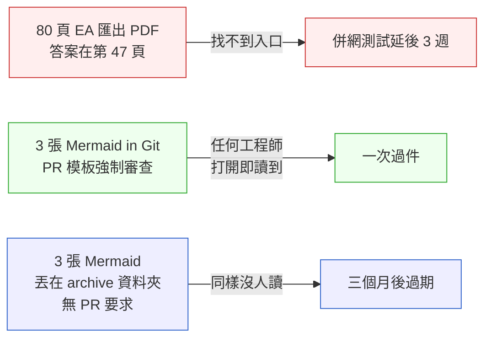
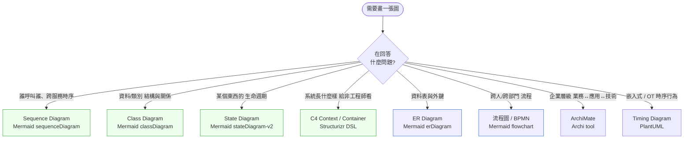
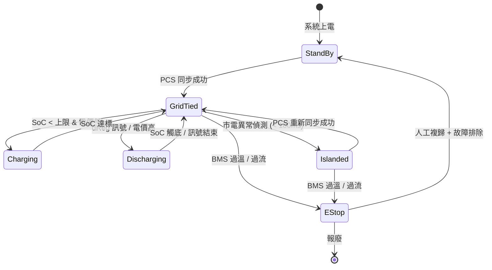

# 第 5 章|UML 模型語言全景
## ⸺ 14 種圖,你只需要 3 種

> **前置閱讀**:[Ch 1 為什麼 SA/SD](./ch-01-why-sa-sd.md)、[Ch 4 系統思考與抽象層次](./ch-04-requirements-engineering.md)
> **下游章節**:[Ch 6 需求工程](../part-02-analysis/ch-06-dfd-structured-analysis.md)、[Ch 7 領域建模](../part-02-analysis/ch-07-object-oriented-analysis.md)、[Ch 18 DDD 戰術設計](../part-04-architecture/ch-18-ddd-strategic-tactical.md)、[Ch 20 C4 模型](../part-04-architecture/ch-20-c4-model-visualization.md)
> **延伸補章**:無

---

## 5.1 冷觀察 ⸺ 一份 80 頁的 UML 投影片,跟一張沒人看不懂的 Mermaid

我在 2025 年下半年,連續兩個月跑了兩家做儲能櫃(BESS, Battery Energy Storage System)的新創,一家在新北汐止,一家在桃園龍潭。兩家的產品都是一個 200kW / 400kWh 級的工商儲能櫃,接 AC 三相 380V,搭一套 EMS(Energy Management System)做削峰填谷與台電輔助服務(sReg / dReg)。技術骨架幾乎一樣,差別只在「文件長什麼樣」。

第一家叫 **AurumGrid**(`CASE-ENR-001`),17 人,CTO 是某家舊 SI 公司出來的資深架構師。我去拜訪那天,會議室桌上躺著一本印出來的 UML 文件,Enterprise Architect 匯出的 PDF,**80 頁,涵蓋 11 種 UML 圖**:Class、Component、Deployment、Sequence、Activity、State、Use Case、Object、Communication、Timing、Package。獨缺 Profile 和 Composite Structure。CTO 翻給我看的時候很自豪:「我們的 SA 做得很完整,審查可以直接過。」

我問現場做 firmware 的工程師有沒有看過這份。他抓抓頭:「我知道有,但我不會打開它,因為打開要先裝 EA viewer。」做 EMS 後端的人也搖頭:「那是上一版,Modbus map 已經改過三次了。」測試的同事直接說:「我們改用 Confluence 上那張流程圖。」

第二家叫 **VoltKnit**,9 人,沒有專職架構師,CTO 自己寫程式。他們的 repo 裡只有 `docs/` 一個資料夾,裡面**三張 Mermaid 圖**:一張 Container 級的 C4,一張儲能櫃離網/併網切換的 State Diagram,一張 EMS 對 PCS(Power Conversion System)下令的 Sequence Diagram。三張加起來不到 200 行 Mermaid 程式碼。他們的 PR 模板有一條:「如果這個 PR 改動了上述三張圖任何一張涵蓋的行為,請在 PR 裡更新對應 .mmd 檔。」

兩家在同一個月,各自要把儲能櫃送去做台電 dReg 0.25 秒響應的併網測試。AurumGrid 的測試延後了三週,因為現場人員問了一個問題沒人答得上來:

> 「離網切回併網的時候,EMS 會不會在 PCS 還沒同步前就送出充電命令?」

這個問題,**兩家都有文件記錄答案**。VoltKnit 那張 State Diagram 就放在 GitHub `docs/state-bess.mmd`,任何工程師在 PR review 流程裡都會看到它。AurumGrid 的那 80 頁 PDF 第 47 頁也有一張 State Diagram 回答了同一個問題 ⸺ 但現場沒有人知道要去翻第 47 頁,沒有人知道那張 PDF 裡有 State Diagram,甚至沒有人記得上次有人打開那個檔案是什麼時候。

差別不是「有沒有記錄答案」,而是**誰在什麼時候、用什麼動作,能找到那個答案**。

這個觀察還有一個反面:只用 Mermaid、不建立 PR 文化,同樣會失敗。假設有第三家公司 **NovaBatt**,也用 Mermaid 畫了三張狀態機,但把 `.mmd` 檔案丟在 `docs/archive/2024Q3/` 底下,PR 模板沒有要求更新圖,CI 也沒有驗證 ⸺ 三個月後那三張圖就跟 AurumGrid 的 PDF 一樣無人問津,只是格式從 PDF 變成了 `.mmd`。**工具(DaC)是必要條件,不是充分條件**;把圖放進 PR 強制審查流程,才是讓圖持續有效的機制。



UML 不是 AurumGrid 出事的原因。**「記錄了但找不到」**,才是。而 NovaBatt 的教訓是:**換了工具但沒換流程,結果一樣**。

---

## 5.2 真問題 ⸺ UML 不是文件套餐,是溝通語言

UML(Unified Modeling Language)2.5.1 規範[^CIT-050]裡列了 **14 種圖**:7 種結構圖、7 種行為圖。Object Management Group 在 2017 年定稿這個版本,從那之後規範本身沒有再大改。

但工程現場的事實是:**這 14 種圖的「被讀率」高度集中**。把它拆開來看會比較清楚。

| UML 2.5.1 結構圖(7 種) | UML 2.5.1 行為圖(7 種) |
|---|---|
| Class Diagram | Use Case Diagram |
| Object Diagram | Activity Diagram |
| Component Diagram | Sequence Diagram |
| Composite Structure Diagram | Communication Diagram |
| Package Diagram | Timing Diagram |
| Deployment Diagram | State Machine Diagram |
| Profile Diagram | Interaction Overview Diagram |

這份清單在 OMG 規範裡是平等的,每張圖都有完整的 metamodel。但是現場讀者的眼睛不平等。

換句話說,UML 真正在解決的問題不是「畫得齊全」,而是**讓兩個人看著同一張圖,在腦中建立同一個模型**。Martin Fowler 在 *UML Distilled* 第 3 版講得很直接:UML 有三種使用模式 ⸺ 速寫(sketch)、藍圖(blueprint)、程式語言(programming language),**現場真正在用的幾乎只有第一種**[^CIT-051]。

把這件事帶回 AurumGrid、VoltKnit 與(假想的)NovaBatt 的對比,可以看到三個結構性問題:

### 5.2.1 工具中心 vs 溝通中心 vs 流程支撐

AurumGrid 的文件習慣是「先選工具,工具能畫什麼就畫什麼」。Enterprise Architect 能匯出 11 種圖,他們就畫 11 種,因為「反正都付錢了」。圖是完整的,但藏在 80 頁 PDF 裡,讀者要知道去哪找、要記得去找,才找得到。VoltKnit 的習慣是「先想要溝通什麼,再選最便宜的呈現方式」,並且把圖掛進 PR 模板 ⸺ 不是因為 Mermaid 比 EA 畫得好,而是因為**圖放在 PR 裡,工程師在 review 時不需要刻意找,就會看到**。

假想的 NovaBatt 則揭示了另一個陷阱:選了 Mermaid,但沒有 PR 文化支撐,圖同樣消失在 `docs/archive/` 深處。**工具中心 → 溝通中心** 是第一步,**溝通中心 → 流程內嵌** 是讓圖持續被讀的第二步;少了任何一步,圖就只是檔案系統上的位元。

工具中心的模型會驅使你**生產讀者不需要的圖**。溝通中心加流程支撐的模型逼你先問:「誰在什麼時候、用什麼動作會讀到這張圖?」這個問題答不出來,圖就不該存在。

### 5.2.2 一次性藝術品 vs 與程式碼同步

UML 在 1990 年代被設計時,軟體釋出週期是月或季,圖過期六個月還算新鮮。2026 年的儲能 EMS,韌體 OTA(Over-the-Air)一週推一版,後端 API 兩天部署一次。**圖跟程式碼脫鉤的速度,比人工更新圖的速度還快**。

這就是為什麼 Diagrams-as-Code(Mermaid、PlantUML、Structurizr DSL、D2)在 2024–2026 年迅速吃掉了 Enterprise Architect、Visio、StarUML 的市占率 ⸺ 不是因為畫得比較好看,而是因為**它們可以放進 Git,可以在 PR 裡 review,可以被 CI 驗證**。

### 5.2.3 全套 UML vs 分層工具鏈

C4 模型(Simon Brown,2018 起)[^CIT-052]、ArchiMate(The Open Group)、ER Diagram(Peter Chen,1976)在 2026 年都有自己的明確定位,不是 UML 的競爭者,而是**在不同抽象層補位**:

- **C4** 補了 UML 在「系統 / 容器 / 元件」三層的缺口,而且天生為非架構師讀者設計。
- **ArchiMate** 補了 UML 從不處理的企業架構(業務 / 應用 / 技術)層面。
- **ER Diagram** 在資料模型這層比 Class Diagram 更精確、更容易跟 DDL 對齊。

換句話說,2026 年問題不再是「UML 還夠不夠用」,而是**在每個抽象層,選最適合的那個工具**。UML 的位置是「程式碼附近的細節層」,不是「全部都用它」。

---

## 5.3 決策框架 ⸺ 14 圖實用度排名 + 該畫哪張的決策樹

下面這幾張表跟流程圖,在現場相當好用。它們的共同前提是:**讀者比工具重要,被讀比畫得齊全重要**。

### 5.3.1 14 種 UML 圖實用度排名(2026 工程現場視角)

排名標準是兩個維度的乘積:**繪製成本(低 → 高)** × **被讀次數(高 → 低)**。

| 排名 | 圖 | 類別 | 工程現場常用度 | 被取代情況 | 建議劑量 |
|---|---|---|---|---|---|
| 1 | **Class Diagram** | 結構 | ★★★★★ | 仍是程式碼層級的標準 | 每個關鍵聚合一張 |
| 2 | **Sequence Diagram** | 行為 | ★★★★★ | 仍是跨服務互動的標準 | 每個關鍵 use case 一張 |
| 3 | **State Machine Diagram** | 行為 | ★★★★☆ | 不可被取代(狀態語意專屬) | 每個有生命週期的實體一張 |
| 4 | Use Case Diagram | 行為 | ★★★☆☆ | 多被 User Story Map 取代 | 對外簡報才畫 |
| 5 | Activity Diagram | 行為 | ★★★☆☆ | 多被 BPMN / 流程圖取代 | 跨人/跨系統流程才畫 |
| 6 | Component Diagram | 結構 | ★★☆☆☆ | 多被 **C4 Container** 取代 | 不建議,改用 C4 |
| 7 | Deployment Diagram | 結構 | ★★☆☆☆ | 多被 **C4 Deployment** 或 K8s manifest 取代 | 不建議,改用 C4 |
| 8 | Package Diagram | 結構 | ★☆☆☆☆ | 多被檔案樹 / module graph 取代 | 不建議 |
| 9 | Object Diagram | 結構 | ★☆☆☆☆ | 多被測試夾具(fixture)取代 | 偵錯時偶爾用 |
| 10 | Composite Structure | 結構 | ☆☆☆☆☆ | 完全被 C4 Component 取代 | 不建議 |
| 11 | Communication Diagram | 行為 | ☆☆☆☆☆ | 等價於 Sequence Diagram 的鏡像 | 不建議,跟 Sequence 二擇一 |
| 12 | Timing Diagram | 行為 | ☆☆☆☆☆ | 嵌入式 / 硬體場景才用 | OT 領域才畫 |
| 13 | Interaction Overview | 行為 | ☆☆☆☆☆ | 過於混合 | 不建議 |
| 14 | Profile Diagram | 結構 | ☆☆☆☆☆ | 規範 metamodel 用,工程現場無感 | 不建議 |

**這張表的關鍵不是排名數字,是前三名與後 11 名的斷層**。Class / Sequence / State 這三張是工程現場日常使用、被 IDE 與 LLM 工具鏈深度支援的;後 11 張多數時候有更便宜或更精準的替代品。Fowler[^CIT-051]在第 3 版(2003 年寫的)就已經把 Class、Sequence、Package、State 列為「最常用四張」,二十多年後這個結論基本沒變,只是 Package 退位、State 升級。

### 5.3.2 決策樹:這次該畫哪張圖?



**這張圖的關鍵是綠色那四個出口**(Sequence / Class / State / C4)。八成的工程現場場景在這四個出口就能解決。剩下兩成才需要 ER、BPMN、ArchiMate、Timing 出場。

### 5.3.3 UML / C4 / ArchiMate / ER 適用情境對照

UML 不是孤兒,它跟另外三套主流模型語言**分層共存**,而非互斥競爭。下面這張表是現場挑工具的速查。

| 維度 | UML 2.5.1 | C4 Model | ArchiMate 3.2 | ER Diagram |
|---|---|---|---|---|
| **抽象層** | 程式碼 / 元件 | 系統 / 容器 / 元件 / 程式碼 | 業務 / 應用 / 技術 / 動機 | 資料 |
| **主要讀者** | 工程師 | 工程師 + PM + 高階主管 | 企業架構師 + 業務 | DBA + 後端 |
| **學習曲線** | 高(14 種圖) | 低(4 層 + 同套元素) | 高(3 層 × 多視圖) | 低 |
| **工具鏈** | EA / PlantUML / StarUML | Structurizr / Mermaid C4 | Archi / Sparx | dbdiagram / Mermaid |
| **可程式碼化** | PlantUML、Mermaid 部分 | Structurizr DSL 完整 | 部分(ArchiMate Open Exchange) | 多種 |
| **適合場景** | 細節層級設計、API 互動 | 給多種讀者看的整體架構 | 大型企業、跨年度規劃 | 資料庫設計、報表 |
| **2026 趨勢** | 14 圖收斂到 3 圖,工具走向 DaC | 逐漸成為事實標準 | 政府 / 金融大型組織仍主流 | 穩定,被 ORM 工具部分自動化 |
| **建議起手** | Class + Sequence + State | Context + Container | 業務層 + 應用層 | 概念層 + 邏輯層 |

選法的順序在現場通常是這樣:先用 **C4 Context / Container** 幫整個系統定位,再用 **UML Class / Sequence / State** 處理單一服務內的細節,最後用 **ER** 收斂資料模型。**ArchiMate 留給有「企業架構師」這個正式職位的組織**,小於 200 人的公司很少需要它。

### 5.3.4 一張示範:VoltKnit 的儲能櫃狀態機

下面這張是 VoltKnit 在他們 EMS repo 裡 `docs/state-bess.md` 的內容,簡化版。儲能櫃在台電輔助服務場景下要在「離網 / 併網 / 待命 / 緊急停機」之間切換,這是 State Diagram 不可被取代的典型場景。



**這張圖回答了三個問題,而且不需要文字補充**:離網切回併網要 PCS 先同步;充放電都只發生在併網態;EStop 只能人工複歸。這就是 State Diagram 在 2026 年仍然不可被取代的原因 ⸺ **狀態語意只有它能精確表達**,而且 Mermaid 在 GitHub / GitLab / Notion / Confluence 都有原生渲染。

---

## 5.4 踩坑清單

下面這四個反模式,在儲能、fintech、SaaS 各種領域都常見。它們的共同點是「畫了圖、但圖沒在做圖該做的事」。

### 反模式 1:把 Class Diagram 當設計文件

某家 healthcare 新創,做電子病歷系統,SA 在系統設計階段畫了一張 80 個類別的 Class Diagram,印出來貼在牆上。半年後有人想對照來看程式碼,發現 80 個類別裡只剩 31 個還存在,新加的 47 個沒進圖,而且圖裡的關聯線跟程式裡的 import 七成對不上。

> ✅ **修正方向**:Class Diagram 留給「跨多個檔案才能看清的關鍵聚合(aggregate)」,單一檔案內的類別關係讓 IDE 自動產出就好(JetBrains 系列 / VS Code 都有外掛)。手繪的 Class Diagram 一旦超過 15 個類別,就值得拆 ⸺ 通常那不是一張圖,是一個 bounded context 沒切清。

### 反模式 2:Activity Diagram 跟流程圖混淆

跨團隊會議上常見的場景:有人畫了一張看起來像流程圖的東西,標題寫「Activity Diagram」。仔細看會發現它沒有 swim lane、沒有 fork/join、沒有 object node ⸺ 那不是 Activity Diagram,那是 flowchart。

問題不在「叫錯名字」,在於**讀者對「Activity Diagram」會預期看到 swim lane**(誰負責什麼),沒看到就會自動腦補,腦補錯了就會開錯會。

> ✅ **修正方向**:跨人 / 跨系統的流程,直接畫 BPMN 或標明是 flowchart 即可,不要硬掛 UML 名號。要畫 Activity Diagram 就把 swim lane 補上,讓「誰做這步」這個資訊明確。Mermaid 的 `flowchart` 配合 subgraph 已經足夠表達 swim lane 的意圖。

### 反模式 3:Sequence Diagram 畫成微服務介面文件

ecommerce 場景常見:Sequence Diagram 上畫了 12 個服務,30 條訊息箭頭,每條箭頭旁邊寫著 `POST /v2/orders/{id}/items`。半年後 API 改版,圖沒跟著改,大家就拿這張圖去複製貼上 API 路徑,結果線上一片 404。

Sequence Diagram 是用來**展示一個 use case 在跨服務間的時序**,不是用來當 API 規格書。API 規格應該在 OpenAPI / AsyncAPI 裡,version 控制獨立做。

> ✅ **修正方向**:Sequence Diagram 的箭頭寫「動作意圖」(`下單`、`扣庫存`、`發貨通知`)而不是寫 HTTP method 加路徑。一張圖聚焦回答一個問題:「這個流程關鍵步驟的順序是什麼、誰呼叫誰?」需要 API 細節時,讀者去看 OpenAPI,不要兩邊都寫。

### 反模式 4:UML 工具鎖定

AurumGrid 的痛:Enterprise Architect 的 `.eap` 檔放在某位前同事的本機,他離職後沒人能打開、沒人能轉檔。這不是 EA 的問題,Visio、StarUML、Lucidchart 也都會發生同樣的事 ⸺ **任何「只有某個工具能開」的格式,都會在三年內變成考古題**。

> ✅ **修正方向**:Diagrams-as-Code 是 2026 年唯一安全的選擇。Mermaid(`.mmd`)、PlantUML(`.puml`)、Structurizr DSL(`.dsl`)、D2(`.d2`)四選一,放進 Git,跟 README 同層。商業工具可以用,但**最終產出必須能匯出純文字格式存進 Git**,不然就是把公司知識存放在某家廠商的授權合約裡。

---

## 5.5 交付清單 ⸺ 一頁式 Diagram Decision Card

每張要進 Git 的圖,**第一份要產出的不是圖本身,是 Diagram Decision Card**。它是一張卡片(等同一段 frontmatter),寫不滿 5 個欄位就是還沒想清楚。

把它存在每個 `.mmd` / `.puml` / `.dsl` 檔案的開頭(用該語言的註解語法包起來),或放在 `docs/diagrams/{slug}.md` 的 frontmatter 區。

````markdown
# Diagram Decision Card — {圖名}

> 對應檔:docs/diagrams/{slug}.mmd | 對應 PR 模板區塊:`diagram-touched`

| 欄位 | 內容 |
|---|---|
| **Type** | Class / Sequence / State / C4-Container / ER / Flowchart |
| **Audience** | 誰會讀這張圖?(例:firmware 工程師、台電審查、新進工程師) |
| **Question Answered** | 這張圖一句話回答的問題是什麼?(例:「離網切回併網時 PCS 同步順序」) |
| **Update Trigger** | 什麼樣的程式碼變更必須更新這張圖?(例:`pcs/state.rs` 變更、`event_bus.proto` 變更) |
| **Tool** | Mermaid / PlantUML / Structurizr DSL / D2 |
| **Storage** | repo 路徑 + 是否進 PR review |
| **Last Verified** | YYYY-MM-DD,由誰對程式碼驗證 |
| **Out of Scope** | 這張圖明確不回答的問題(避免被當成全功能文件) |
````

**為什麼是一張卡片?** 一張卡片的篇幅會逼出「這張圖到底要不要存在」這個問題。Audience 寫不出具體名字 → 讀者其實不存在;Question Answered 寫不出具體一句話 → 圖沒有焦點;Update Trigger 寫不出具體檔案 → 這張圖一定會過期。三個欄位填不出來,這張圖就不該被畫。

**為什麼要有「Out of Scope」?** 跟 Ch 1 的 System Charter 一樣的道理:**沒寫下來的範圍,半年後一定會被誤用**。Sequence Diagram 沒寫「不是 API 規格」,就會被人拿來當 API 規格貼在 wiki 上;State Diagram 沒寫「不涵蓋並行多櫃」,就會被人拿來推論並行行為。把這些誤用點先標出來,後面省下大量解釋。

### 5.5.1 範例:VoltKnit 那張併網狀態機的 Decision Card

VoltKnit(`CASE-ENR-001`)能用三張 Mermaid 圖過台電 dReg 0.25 秒併網測試,關鍵不是圖畫得多漂亮,是每張圖都先填過這張卡。下面就是 §5.3.4 那張 BESS 狀態機放進 repo 時**應該**附上的版本 ⸺ 對照 AurumGrid 那 80 頁 PDF,差別不在工具,而在「讀者是誰、回答什麼、何時要更新」這三件事被寫了下來:

````markdown
# Diagram Decision Card — BESS 併網/離網狀態機

> 對應檔:docs/diagrams/state-bess.mmd
> 對應 PR 模板區塊:`diagram-touched: state-bess`

| 欄位 | 內容 |
|---|---|
| **Type** | State Machine Diagram(Mermaid stateDiagram-v2) |
| **Audience** | <!-- 為什麼這欄:寫不出具體名字代表這張圖沒有真實讀者; 沒讀者的圖不該存在,畫了也只是檔案。 --> ① firmware RD(王、陳)② 台電審查工程師 ③ 新進 EMS 後端 |
| **Question Answered** | <!-- 為什麼這欄:一句話回答不出來,這張圖就沒有焦點; AurumGrid 那張 80 頁 PDF 缺的就是這一句。 --> 「離網切回併網時 PCS 同步順序、以及 EStop 的進入與復歸條件」 |
| **Update Trigger** | <!-- 為什麼這欄:沒寫具體檔案的圖一定會過期; 寫了 trigger 才能掛 PR check,讓圖跟程式碼一起呼吸。 --> `pcs/state.rs` 任一狀態 enum 變更、`bms/safety.rs` 中 EStop 條件變更、`grid/sync.rs` 同步流程變更 |
| **Tool** | Mermaid(理由:GitHub / Notion 原生渲染,不需外部 viewer) |
| **Storage** | `docs/diagrams/state-bess.mmd`,進 PR review,CI 跑 mermaid-cli 驗證語法 |
| **Last Verified** | 2025-08-22,由 Hsu(firmware lead)對照 `pcs/state.rs` 確認 11 條 transition 全對應 |
| **Out of Scope** | <!-- 為什麼這欄:沒寫下不回答的問題,半年後一定會被當全功能文件用; Sequence 的位置、API 細節、多櫃並行行為都要明確排除。 --> ① 不涵蓋多櫃並行控制(見 docs/diagrams/multi-bess.mmd)② 不是 EMS↔PCS 的訊息規格(見 protobuf 檔)③ 不涵蓋 SoC 估算演算法 |
````

把這張卡放在 `.mmd` 檔旁邊,並且讓 PR 模板指向它,半年後新進工程師打開 repo 或收到 PR review 通知,第一眼看到的不是「這張圖在哪」,而是「這張圖為誰存在、什麼時候要改」⸺ 那是 80 頁 PDF 從來給不出來的東西。AurumGrid 的 State Diagram 也在 PDF 裡,差的不是記錄本身,是沒有任何流程把工程師的眼睛帶到那一頁。

---

## 5.6 本章交付清單 Recap

讀完本章,你應該已經能做到:

- [ ] 講清楚 UML 14 種圖中,工程現場真正常用的是 **Class / Sequence / State** 這三種,並能解釋其他 11 張為何被取代或邊緣化
- [ ] 用「該畫哪張圖」決策樹幫當前任務挑出**正確的圖種**,而不是「我們都畫一遍」
- [ ] 在會議上認得出四個反模式(Class Diagram 當設計文件 / Activity 與 flowchart 混用 / Sequence 當 API 文件 / 工具鎖定),並有一句話的修正方向可以接著說
- [ ] 為手上的每一張關鍵圖寫好一份 Diagram Decision Card,放進 repo

如果四項中先挑一項做完就好,建議是最後那一項 ⸺ 把現有 repo 裡所有圖檢查一遍,**沒填得出 Audience / Question / Update Trigger 三欄的圖,就刪掉**。刪不掉的那幾張,才是真正在做溝通的圖。本書 Ch 7(領域建模)會用同樣的視角教 Class Diagram 該怎麼畫,Ch 20 會專門展開 C4。

---

## Cross-References

- **回顧**:[Ch 1 為什麼 SA/SD](./ch-01-why-sa-sd.md)、[Ch 4 系統思考與抽象層次](./ch-04-requirements-engineering.md)
- **下一章**:[Ch 6 需求工程](../part-02-analysis/ch-06-dfd-structured-analysis.md) ⸺ 從 Use Case 走向 User Story Map
- **領域建模深入**:[Ch 7 領域建模](../part-02-analysis/ch-07-object-oriented-analysis.md)、[Ch 18 DDD 戰術設計](../part-04-architecture/ch-18-ddd-strategic-tactical.md)
- **架構視覺化**:[Ch 20 C4 模型](../part-04-architecture/ch-20-c4-model-visualization.md)

## 引用

[^CIT-050]: Object Management Group, "OMG Unified Modeling Language (OMG UML), Version 2.5.1" (2017-12)。omg.org/spec/UML/2.5.1。
[^CIT-051]: Martin Fowler, "UML Distilled: A Brief Guide to the Standard Object Modeling Language, 3rd Edition" (Addison-Wesley, 2003)。提出 sketch / blueprint / programming language 三種使用模式。
[^CIT-052]: Simon Brown, "The C4 model for visualising software architecture" — c4model.com,2018 起持續更新。
