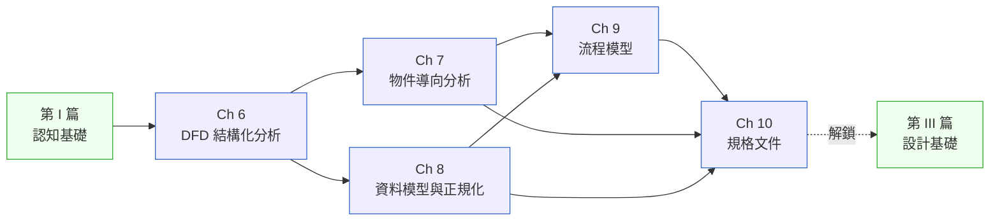

# 第 II 篇|分析

> **工具不是問題。問題是你不知道這個工具是為了回答哪個問題。**

---

DFD、用例圖、ER 圖、BPMN、SRS ⸺ 這五章涵蓋的工具,你可能上課都看過。

但 NorthBay Pay 的 Head of Engineering 在白板前停了三十秒,拿著筆,說「我們公司沒有一張圖可以告訴我這 47 個 Kafka topic 在哪裡產生、被誰消費、寫進哪張表」。他不是因為不知道 DFD 是什麼才說這句話。他是因為**從來沒有人替這個問題負責**。

第 II 篇教的不是工具的畫法。教的是每個工具對應的**問題型別**,以及當你把五個工具的產出接在一起時,spec 文件是怎麼長出來的。

---

## 篇內章節依存圖

---

## 各章核心問句

| 章 | 標題簡稱 | 這章回答的真正問題 |
|---|---|---|
| Ch 6 | 結構化分析 / DFD | 資料從哪裡進、被誰碰過、流到哪裡去——誰該對這張圖負責? |
| Ch 7 | 物件導向分析 | 用例、狀態機、序列圖,三張圖如何讓同一個行為「活起來」? |
| Ch 8 | 資料模型與正規化 | 3NF 通過之後,schema 就是好的嗎? |
| Ch 9 | 流程模型 | BPMN、狀態機、決策表——哪種圖回答哪種「然後呢?」 |
| Ch 10 | 規格文件 | PRD / SRS / MVP 三份文件,如何在一個句子裡不造成三種理解? |

---

## 不同讀者的建議入口

- **第一次接觸需求/分析工作**:依序讀完五章。Ch 10 的「PRD 壓縮三層歧義」模板可以直接抄走用。
- **工程師想看懂 spec**:從 Ch 10 往回讀。先知道終點文件長什麼樣,再補 Ch 6–9 的工具知識。
- **BA / PM / 產品**:Ch 7(用例)+ Ch 9(BPMN)+ Ch 10(PRD 格式)是你的主線;Ch 6 和 Ch 8 是你和工程師溝通時的共同語言。

---

## 前後篇連結

- **前置**:[第 I 篇 認知基礎](../part-01-foundations/00-overview.md)
- **這篇解鎖**:[第 III 篇 設計基礎](../part-03-design/00-overview.md) — spec 文件確定之後,才能開始做架構與設計決策
- **長距離影響**:[Ch 17 DDD](../part-04-architecture/ch-17-ddd-strategic-tactical.md)(Ch 7 的 OOA 是 DDD 戰術設計的前置語言)、[Ch 22 EDA](../part-04-architecture/ch-22-event-driven-cqrs-es.md)(Ch 6 DFD 的進階版,資料流變成事件流)
