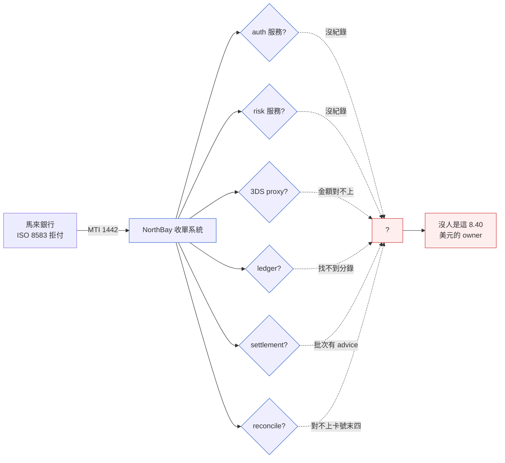
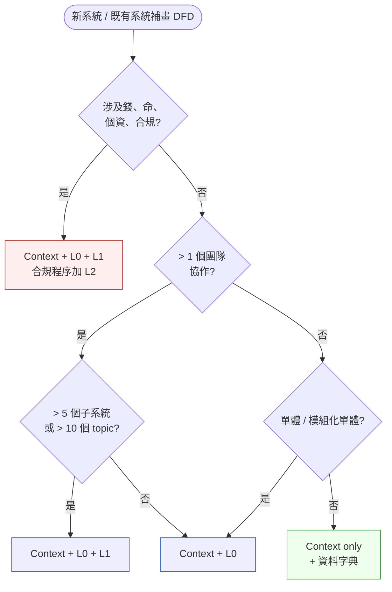
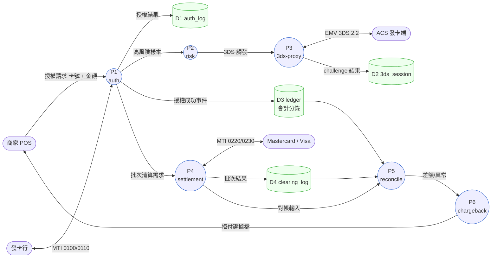

# 第 6 章|結構化分析
## ⸺ DFD、資料字典與系統流程

> **前置閱讀**:[Ch 1 為什麼 SA/SD](../part-01-foundations/ch-01-why-sa-sd.md)、[Ch 5 UML 與模型語言](../part-01-foundations/ch-05-uml-overview.md)
> **下游章節**:[Ch 7 用例與場景分析](./ch-07-object-oriented-analysis.md)、[Ch 8 ERD 與資料建模](./ch-08-data-modeling-normalization.md)、[Ch 23 Event-Driven 架構](../part-04-architecture/ch-23-event-driven-cqrs-es.md)
> **延伸補章**:無

---

## 6.1 冷觀察 ⸺ 一筆 8.40 美元的拒付,沒人答得出走過哪幾張表

我在 2025 年第四季,進到一家虛構支付公司 **NorthBay Pay**(`CASE-FIN-002`)做兩週的調研。

NorthBay 是一家做收單(Acquiring)+ 跨境清算的中型公司,大約 140 人,主力產品是給東南亞中小型電商接 Visa / Mastercard 卡組織。技術棧不算新潮:Spring Boot 3 + PostgreSQL 16 + Kafka 3.7,加一條跑了七年的 SWIFT FIN 介接管線。系統穩、PCI DSS v4.0 過了、東南亞三個地區牌照都有。

那兩週的引子是一封信。一家馬來西亞客戶銀行寄來 ISO 8583 的 1442 拒付訊息(Chargeback,理由代碼 4837 ⸺ No Cardholder Authorization),金額 8.40 美元,要求 30 天內回應證據。8.40 美元的拒付本身不痛,痛在他們找不到這筆交易在自己系統裡走過哪幾步。

風控的人說「這筆有過 3DS Challenge」,但找不到 challenge 的紀錄;清算的人說「我們週日批次有對到 Mastercard MTI 0220 的 advice」,但對的金額和卡號末四碼都對不上;客服系統裡顯示「使用者沒有提交任何爭議」⸺ 因為這是發卡行直接發起的拒付,不是持卡人 case。

事故會議室白板上貼了七張便利貼,代表他們以為的七個服務:`auth`、`risk`、`3ds-proxy`、`ledger`、`settlement`、`reconcile`、`notify`。沒人能在會議桌上把這張圖畫完整。Head of Engineering 在黑板前停了三十秒,拿著筆,然後問了一句話,我把它原樣記下來:

> 「我們有 47 個 Kafka topic,我們公司沒有一張圖,可以告訴我這 47 個 topic 在哪裡產生、被誰消費、寫進哪張表。」

他補了一句:

> 「我五年前看過這家公司剛成立時的 DFD,Visio 畫的,放在某個 SharePoint 上。我現在連那張圖長什麼樣都不記得。」



這不是工程師偷懶。NorthBay 的工程師強、CI 流程嚴、PR 規矩都很正常。問題在於:**從第一天起,沒有人對「資料從哪裡進、被誰碰過、流去哪裡」這件事負責**。架構圖有(C4 Container 級),Sequence 圖也有(每個 feature 都有一張),但沒有一張圖回答 Head of Engineering 那個問題。

DFD 在這家公司只活了三個月 ⸺ 從成立第一週畫好,到第三個月 PoC 結束之後沒人再碰。Visio 檔還在,但是已經跟系統長得不像了。

---

## 6.2 真問題 ⸺ DFD 不是過時,過時的是「畫一次就歸檔」的習慣

DFD(Data Flow Diagram,資料流程圖)是 1979 年 Tom DeMarco 在 *Structured Analysis and System Specification* 提出的 [^CIT-060],隔年 Edward Yourdon 與 Larry Constantine 在 *Structured Design* 把它補成完整的 Yourdon-Coad 標記法 [^CIT-061]。同年 Chris Gane 與 Trish Sarson 提出另一套標記法(圓角矩形畫程序、開口矩形畫資料儲存)[^CIT-062]。兩套標記在 1980–1990 年代是 SA 的主力工具。

到了 2026 年,常見聽到的說法是「DFD 已經被 UML 取代了」「現在都用 Sequence 圖」「Event Storming 已經夠用」。把這幾句話拆開來看,會發現它們各自只說對一部分。

### 6.2.1 DFD、Sequence、Event Storming 各自在處理什麼

| 模型 | 主問題 | 不處理 | 顆粒度 |
|---|---|---|---|
| **DFD** | 資料**從哪來、流去哪、誰碰過、存在哪** | 時間順序、控制流、決策邏輯 | 系統 / 子系統 |
| **Sequence Diagram** | 一次互動中的**訊息與時序** | 資料的全生命週期、跨流程聚合 | 一個 use case |
| **Event Storming** | 業務**事件 + 命令 + 聚合**的領域語意 | 實體服務拓樸、資料儲存細節 | 領域 / 限界上下文 |
| **系統流程圖(System Flowchart)** | 控制流(if/loop)、批次處理順序 | 跨系統資料邊界 | 一個程序 |

換句話說,這四種模型不是互相取代,是**回答不同問題**。NorthBay 的 Head of Engineering 問的是 DFD 的問題:「資料的拓樸是什麼」⸺ 用 Sequence 圖回答會得到 47 張零碎的圖,用 Event Storming 回答會得到「業務事件名稱」但不知道這些事件具體寫進了哪張表。**只有 DFD 在處理「資料拓樸」這個問題**。

### 6.2.2 DFD 跟「系統流程圖」的差別,十五年來一直被搞混

兩者長得很像,但問的是不同問題:

- **系統流程圖** 是控制流,問「程式接下來做什麼」⸺ 主語是動作。
- **DFD** 是資料流,問「資料現在在哪裡」⸺ 主語是資料。

一個常見的誤用是:把 DFD 畫成 Activity Diagram(UML 的活動圖,本質是控制流)。畫出來的東西**看起來像 DFD,但箭頭上面寫的是「呼叫」「批次跑」「成功」「失敗」,而不是資料名稱**。這種圖無法回答 NorthBay 那個問題,因為它根本沒在描述資料。

### 6.2.3 為什麼 2026 年反而需要 DFD

三個結構性變化讓「資料拓樸」這件事比以前更重要,而不是更不重要:

**第一,Event-Driven 架構讓資料路徑變得不可見**。Kafka / NATS / RabbitMQ 的拓樸,在程式碼層面是「Producer 寫 topic、Consumer 讀 topic」,沒有強型別連線可以順著追。一個 topic 可能有 12 個 Consumer,你從程式碼搜不出來,只能從 broker 的 metadata 或 schema registry 推。DFD 是這個拓樸最低成本的視覺化工具。

**第二,合規法規開始要求「資料血緣(Data Lineage)」**。GDPR 的 Right to Erasure、PCI DSS 4.0 的卡號流向追蹤、東南亞各地區的個資新法,都要求機構能在被質詢時 30 天內回答「這位用戶的這筆資料,複製過哪幾份、流經哪些系統、目前還活在哪」。OpenLineage [^CIT-064] 與 Marquez 等工具在處理機讀格式,但機讀格式有個盲點:**它只記錄「已發生」的真實資料路徑,不記錄「應該是」的設計意圖**。當兩者對不上時(例如 OpenLineage 的 lineage 事件顯示 `pan_token` 流進了 `analytics_raw` 表,但 DFD 上沒有這條箭頭),人工需要一張高層視覺化拓樸圖來判斷「是 DFD 畫漏了,還是程式碼走錯了路」。DFD 是這個審查過程的**人讀入口**:稽核人員和工程師對著同一張圖,可以在五分鐘內指出差異在哪一層、哪條流,而不用解讀機讀 JSON。

**第三,AI 協作讓「資料約定」變成 prompt context 的剛需**。一個 AI Agent 要修改 `risk` 服務,不知道上游給它什麼欄位、下游期待它輸出什麼,改出來的程式碼通常會壞掉相鄰系統。DFD 讓 Agent 能明確推斷資料合約:例如 Agent 在 DFD 上看到 `P1 → P2` 這條標記為「高風險樣本」的資料流,就能推斷 P2 的輸出需要包含 `risk_score` 欄位,且這個欄位的下游消費者是 P3(3ds-proxy) ⸺ 改 P2 時就不會漏掉對 P3 的影響。DFD + 資料字典是 spec.md / CLAUDE.md 裡最值得放的兩個 artifact 之一(另一個是 ADR)。

放在這個視角下,「DFD 過時」這個說法的真正意思,**比較接近「畫一次就歸檔的 DFD 過時」**。畫好放 SharePoint、半年後對不上系統、再過半年沒人記得 ⸺ 過時的是這個習慣,不是工具。

---

## 6.3 決策框架 ⸺ 4 層 DFD 怎麼用、用到哪一層才停

DeMarco 原典的 DFD 是分層的(Hierarchical):從最外層的 Context 圖,一路展開到子程序的細節。書本通常教完整四層,但**現場真正畫到第 4 層的不多** ⸺ 也不應該每個系統都畫到第 4 層。

### 6.3.1 4 層 DFD 的適用情境

| 層 | 別名 | 顆粒度 | 適用情境 | 紙本大小 | 何時可以省 |
|---|---|---|---|---|---|
| **Context(層 0)** | Level 0 / 系統脈絡圖 | 整個系統當作一個圓 | 任何系統,**永遠不省** | 一頁 | 不能省 |
| **Level 0(層 1)** | Top-Level DFD | 系統內主要子系統(5–9 個) | 中型以上系統、跨團隊 | 一頁 | 5 人以下單體 |
| **Level 1(層 2)** | 子系統內部 | 每個主要子系統內的程序(3–7 個) | 子系統有獨立 Owner、跨服務協作 | 每子系統一頁 | 純 CRUD 子系統 |
| **Level 2(層 3)** | 程序內部細節 | 演算法級、欄位級轉換 | 合規敏感程序(風控、清算、計價) | 每程序一頁 | 大多數一般程序 |

**讀法**:Context + Level 0 是大多數系統的最小劑量。Level 1 留給跨團隊邊界。Level 2 留給合規或計價這類**算錯會被罰錢或上新聞**的程序。

NorthBay 的失誤在於:Context 圖有(放公司簡介簡報用),Level 0 沒有,直接就跳到「每個服務有自己的 Sequence 圖」這種顆粒度。缺的那一層是 Level 0(即「Top-Level DFD」):它回答的問題是「系統內有哪幾個主要子系統、它們之間交換哪些資料」⸺ 是從 Context「整個系統怎麼跟外界互動」到「每條服務流的細節」之間不可跳過的中間層。NorthBay 跳過了這層、直接細節化到 Sequence 圖,所以 47 個 Kafka topic 才會像 Head of Engineering 說的那樣失蹤:Sequence 圖描述的是「一次互動的訊息時序」,不是「資料的全局拓樸」。

確認你用 DFD 回答的是「資料拓樸」問題,而不是其他問題,再決定要畫到哪一層——下面這張選擇表有助於在會議上快速釐清這個前提。

### 6.3.2 模型選擇:DFD / Sequence / Event Storming / System Flowchart 何時用

下面這張表在現場很好用,特別是當有人在會議上說「我們直接畫 Sequence 就好了」時,可以拿出來回答「你想回答的是哪個問題」:

| 你要回答的問題 | 用什麼 | 不要用什麼 |
|---|---|---|
| 「這筆資料現在在哪裡」 | DFD(Context + Level 0) | Sequence(會散) |
| 「這個 use case 怎麼跑」 | Sequence Diagram | DFD(沒有時間軸) |
| 「我們的領域事件有哪些」 | Event Storming | DFD(看不到事件語意) |
| 「批次/排程順序」 | 系統流程圖(System Flowchart) | DFD(資料流不是控制流) |
| 「合規稽核要看資料來源」 | DFD + 資料字典 + Data Lineage Card | C4(顆粒度錯) |
| 「跨服務的 API 合約」 | OpenAPI / AsyncAPI | DFD(欄位細節不在 DFD) |
| 「狀態機」 | State Machine Diagram | DFD(狀態語意不存在) |

### 6.3.3 一張決策樹:這次該畫到哪一層



**這張圖的關鍵不是分支,是預設值**。預設走「Context + L0」。L1 留給多團隊協作,L2 留給合規程序。L2 全畫的成本通常超過收益,**真正需要 L2 的場景是「監理機關會來問」**。

### 6.3.4 NorthBay 補畫 Level 0 後長什麼樣

下面是兩週調研之後,我和他們 Head of Engineering 一起在白板上畫出來的 Level 0(經過簡化,Yourdon-Coad 標記法 ⸺ 圓圈代表程序,雙線代表資料儲存,雙箭頭代表資料流):



這張圖回答了 Head of Engineering 那個問題:那筆 8.40 美元的拒付,從 P1(auth)收進來、走過 P2(risk)觸發 P3(3ds-proxy)、寫進 D1 與 D2、批次清算寫進 D4、對帳走 P5、最後 P6 處理 chargeback。每一條箭頭上面寫的是**資料名稱**,不是動作名稱 ⸺ 這是 DFD 跟系統流程圖的關鍵差別。

### 6.3.5 資料字典:每個資料流配一份欄位定義

DFD 上面的箭頭,光寫「授權請求」是不夠的。每個資料流要配一份資料字典(Data Dictionary)條目,說明欄位、型別、來源、業務規則。下面是 NorthBay 補畫 Level 0 之後,給「授權請求」這條流補的字典條目模板:

````markdown
# DD-001 — 授權請求 (Auth Request)

> 來源資料流:Merchant → P1(auth)
> 對應 Schema:`schemas/auth-request.avsc` (Confluent Schema Registry v17)
> Owner:auth team / Eddy K.
> 法規:PCI DSS v4.0 Req 3.4(PAN 不得明文落盤)

## 欄位

| 欄位 | 型別 | 必填 | 業務規則 | 來源 | 流向 |
|---|---|---|---|---|---|
| `merchant_id` | string(16) | Y | 已通過 KYB,狀態 ACTIVE | Merchant POS | D1, D3, D4 |
| `pan_token` | string(19) | Y | 必為 token,**禁明文 PAN** | Tokenization Vault | D1, P3, P4 |
| `amount_minor` | int64 | Y | 最小貨幣單位(如美分) | Merchant POS | D1, D3 |
| `currency` | string(3) | Y | ISO 4217 | Merchant POS | D1, D3, D4 |
| `mcc` | string(4) | Y | ISO 18245,影響風控與費率 | Merchant config | P2, P4 |
| `device_fingerprint` | string(64) | N | 用於 P2 風控評分 | Merchant SDK | P2(only) |
| `requested_at` | timestamp | Y | RFC 3339,UTC | Merchant POS | D1, D2, D3 |

## 業務規則
1. `pan_token` 必須在 Tokenization Vault 已存在;否則 P1 拒絕並回 0110/05。
2. `amount_minor` > merchant.daily_limit 時,P1 直接拒絕(不送 P2)。
3. `mcc` ∈ {7995, 6051}(博弈、加密貨幣)時,P2 強制觸發 P3 challenge。

## 變更紀錄
- 2025-11-04 v3:新增 `device_fingerprint`(P2 risk model v2 需求,ADR-042)
````

這份字典的精髓是**每個欄位都有「流向」這一欄**。沒有流向,就只是一份 schema 文件;有了流向,才能在 30 天內回答監理機關的問題:「這位用戶的 PAN token 流經了哪些系統?」答案就是 D1、P3、P4。

### 6.3.6 跟 git 一起版本控制:讓 DFD 成為活文件

NorthBay 補畫之後做的第二件事,是把這張 Level 0 從 Visio 搬到 Mermaid,放進 `docs/dfd/level-0.md`,跟 repo 同 commit。CI 加了一條 Fitness Function:

> 每個 Kafka topic 在 schema registry 註冊時,必須在 `docs/dfd/level-0.md` 找到對應的資料流名稱,否則 PR 失敗。

這條規則跑了三週後,他們的 47 個 topic 收斂到 31 個(其中 16 個是測試殘留或重複),而且每個都能在 DFD 上找到對應位置。**真正的轉變不是畫了圖,是讓圖跟系統一起呼吸**。

跟 OpenLineage 的整合則更進一步:OpenLineage 規範定義了 Job / Run / Dataset 三層機讀格式 [^CIT-064],可以由 Airflow / Spark / dbt 等工具自動產生 lineage 事件。NorthBay 的做法是 ⸺ DFD 是**人讀**入口,OpenLineage 是**機讀**真實值;CI 比對兩者的 dataset 集合是否一致。對不上就跳警告,提醒人去更新 DFD 或更新程式碼,看哪個落後了。

---

## 6.4 踩坑清單

下面這四個反模式,在 fintech / 支付 / 清算這類資料密集型場景特別常出現。共同特徵是:**外觀上長得像在做結構化分析,實質上沒有產生「可被傳遞的資料拓樸」**。

### 反模式 1:DFD 畫一次就歸檔

第一週畫好、SharePoint 上傳、第二週系統就改了、半年後沒人記得這張圖在哪。NorthBay 早期就是這個版本 ⸺ Visio 檔還在,但跟現實已經不像。

> ✅ **修正方向**:DFD 跟程式碼同 repo、同 commit 流程。Mermaid / D2 / Structurizr 都行(Diagrams-as-Code)。CI 加 Fitness Function 對齊真實事件流(schema registry / OpenLineage)。對不上時 PR 失敗,逼當次修改的人選擇:更新圖,或解釋為什麼例外。半年後圖還會跟系統對得上。

### 反模式 2:用 DFD 取代 Sequence(或反過來)

在會議上看過兩種版本。第一種:有人想討論「跨服務時序」,翻出 DFD,結果整場無法回答「誰先呼叫誰」。第二種:有人想討論「資料拓樸」,翻出 47 張 Sequence,結果整場拼不出全貌。

> ✅ **修正方向**:回到 §6.3.2 那張選擇表,先問**你想回答的問題是什麼**。資料拓樸用 DFD,時序互動用 Sequence,業務事件用 Event Storming,批次控制流用系統流程圖。一個系統不是只能有一種圖,是**每種圖回答一種問題**。會議上若有人攜帶錯誤的圖,把問題拉回判準會比辯論工具效率高很多。

### 反模式 3:資料字典寫成 Schema 文件

常見的版本是:把 Avro / Protobuf / JSON Schema 直接 `cat` 進文件,叫它「資料字典」。型別有了、必填有了,但**沒有「來源」、沒有「流向」、沒有「業務規則」、沒有「對應的法規條款」**。

這裡有個概念需要分清楚:§6.3.5 的資料字典是**「資料流級」字典**,描述的是 DFD 箭頭上那一條流(例如 `Merchant → P1` 的「授權請求」)的欄位語意與流向;它不是「表級」Schema 文件。表級 Schema 記錄一張資料表有哪些欄位、型別、索引 ⸺ 那是資料庫層的工件,對應的是 Ch 8 的 ERD。把這兩件事混在一起,等於把路線圖和倉庫存貨清單混在一起:都有用,但回答的是不同問題。

> ✅ **修正方向**:資料字典的精髓不在型別(那是 schema 的工作),在**業務語意 + 流向**。參考 §6.3.5 的模板格式,至少保留四欄:**業務規則、來源、流向、對應 ADR / 法規**。如果一個欄位你寫不出業務規則,代表它不該存在,或它的存在沒人為它負責。把這件事在字典裡逼出來,比在事故會議上逼出來便宜。

### 反模式 4:把 DFD 當設計圖(忽略外部實體)

在白板上很常看到的版本:畫了 5 個 Process、3 個 Data Store,**沒有任何外部實體(External Entity)**。看起來很像系統內部的設計圖,但少了「資料從哪裡進、流去哪裡」的邊界 ⸺ 也就少了 DFD 最重要的部分。

> ✅ **修正方向**:Context 圖必有外部實體(商家、發卡行、ACS、Acquirer、監理機關)。Level 0 起,任何「跨組織邊界」的對端都應出現在圖上。一個簡單的自查:把外部實體蓋掉之後,圖裡剩下的 Process 還有意義嗎?如果有,代表你畫的是設計圖不是 DFD;如果沒有,代表你畫對了。

---

## 6.5 交付清單 ⸺ 一頁式 Data Lineage Card 模板

DFD 是系統級的拓樸圖。但在現場,經常需要的是更小的單位:**一筆資料(一個欄位、一張表、一個 topic)的血緣卡**。這張卡是 NorthBay 補畫 DFD 之後做的第三件事:每一個被合規、客服、風控反覆問到的資料元素,給它一張卡。

把它存在 `docs/lineage/{dataset-name}.md`,跟 DFD 同層。一頁,寫不滿就是寫得不對。

````markdown
# Data Lineage Card — {dataset-name}

> 版本:v0.1 | 撰寫日期:YYYY-MM-DD | Owner:{名字 / team}
> 對應 DFD:`docs/dfd/level-0.md#{anchor}`
> 對應 ADR:`docs/adr/00XX-*.md`

## 1. Source(資料從哪裡來)
- 主要來源系統:{e.g. Merchant POS via /v1/auth}
- 觸發事件:{e.g. 商家發起卡片授權請求}
- 進入頻率:{即時 / 每日批次 / 每週批次}
- 法規類別:{PCI / PII / 公開}

## 2. Transformation(資料被怎麼處理)
- 經過的程序(對應 DFD Process):{P1 → P2 → P3}
- 關鍵轉換邏輯:
  - {e.g. PAN 在 P1 入口即 tokenize,後續系統只看到 token}
  - {e.g. amount_minor 在 P4 換算為清算幣別}
- 衍生欄位:{e.g. risk_score(P2 計算)}

## 3. Sink(資料流去哪裡)
- 持久化儲存(對應 DFD Data Store):{D1 auth_log, D3 ledger}
- 下游消費者:{P4 settlement, P5 reconcile, BI}
- 對外輸出:{e.g. SWIFT MT103, Mastercard MTI 0220, GDPR DSAR 回應}
- 保留期限:{e.g. 7 年(PCI DSS Req 10.7)}

## 4. Owner(誰要為這份資料負責)
| 階段 | 主 Owner | 副 Owner |
|---|---|---|
| 採集準確性 | {auth team} | |
| 轉換正確性 | {risk team} | |
| 儲存完整性 | {DBA} | |
| 合規符合性 | {compliance} | |

## 5. Update Trigger(什麼情況下要更新這張卡)
- [ ] 上游 schema 變更
- [ ] 新增下游消費者
- [ ] 法規條款變更(如 PCI DSS 改版)
- [ ] DFD Level 0 對應節點變更
- [ ] 任一 owner 異動

## 6. 已知問題與技術債
- {e.g. P3 challenge 結果目前只寫 D2,未進 OpenLineage,2026-Q2 補}
````

**為什麼是一頁?** 跟前面幾章的 Charter 同樣理由:一頁會逼出選擇,十頁會讓你誤以為自己做了選擇。

**為什麼放「Update Trigger」?** 反模式 1 的根因不是「沒人想更新」,是「沒人知道什麼時候該更新」。把觸發條件寫進卡片本身,等於提前授權:條件成立,就有正當性發 PR。沒觸發條件、沒更新義務,卡片很快會跟 SharePoint 上的 Visio 檔走上同一條路。

NorthBay 在第三個月做了 9 張 Lineage Card(每張對應一個被合規反覆問到的資料元素)。第四個月馬來那家銀行又寄了一筆拒付來,這次他們在 14 分鐘內回答出走過哪幾步、寫進哪幾張表、誰是 owner。8.40 美元的金額沒變,**但問題從「沒人答得出來」變成「14 分鐘可以答出來」**,差別就在那 9 張卡。

### 6.5.1 範例:NorthBay Pay 為「pan_token」補的那張 Lineage Card

那筆 8.40 美元拒付的調研第三週,Head of Engineering 指定的第一張卡是 `pan_token` ⸺ 因為 PCI DSS v4.0 Req 3.4 與 Mastercard 拒付調查最常問到它。下面就是當時補上去、放在 `docs/lineage/pan-token.md` 的版本:

````markdown
# Data Lineage Card — pan_token

> 版本:v0.1 | 撰寫日期:2025-11-12 | Owner:auth team / Eddy K.
> 對應 DFD:`docs/dfd/level-0.md#auth-flow`
> 對應 ADR:`docs/adr/0042-tokenization-vault.md`

## 1. Source(資料從哪裡來)
<!-- 為什麼這欄:沒寫來源,合規問「PAN 從哪一刻開始 token 化」就答不出;
     PCI DSS Req 3.4 直接落在這條問題上。 -->
- 主要來源系統:Tokenization Vault(內部 service `vault.svc`),
  由 Merchant SDK 在 POS 端透過 `/v1/tokenize` 預先換取
- 觸發事件:商家發起卡片授權請求(P1 入口前已完成 tokenize)
- 進入頻率:即時(每筆交易一次)
- 法規類別:PCI DSS v4.0 Req 3.4(PAN 不得在系統內明文流動)

## 2. Transformation(資料被怎麼處理)
- 經過的程序(對應 DFD Process):P1 auth → P2 risk → P3 3ds-proxy → P4 settlement
- 關鍵轉換邏輯:
  - P1 入口即使用 token,**任何下游系統皆不接觸明文 PAN**
  - P3 與 ACS 互動時,以 token 換取一次性 directory server reference
  - P4 對 Mastercard MTI 0220 送出時,由 vault 在出口端再次解密(僅此一處)
- 衍生欄位:`token_last4`(P1 計算,給客服與 BI 使用,非可逆)

## 3. Sink(資料流去哪裡)
<!-- 為什麼這欄:沒寫流向,30 天內回覆監理機關 DSAR / chargeback 證據鏈就湊不出;
     8.40 美元那次卡住的就是這欄。 -->
- 持久化儲存:D1 `auth_log`、D2 `3ds_session`、D3 `ledger`、D4 `clearing_log`
- 下游消費者:P5 reconcile、BI(僅 token_last4)、Chargeback Service P6
- 對外輸出:Mastercard MTI 0220(由 vault 出口端解密)、客戶銀行拒付證據檔
- 保留期限:7 年(PCI DSS Req 10.7);超過後由 vault 統一銷毀映射

## 4. Owner(誰要為這份資料負責)
| 階段 | 主 Owner | 副 Owner |
|---|---|---|
| 採集準確性(Tokenize) | Vault Team / Lin | Auth Team |
| 轉換正確性 | Auth Team / Eddy | Risk Team |
| 儲存完整性 | DBA / Wu | SRE |
| 合規符合性 | Compliance / Chen | CISO |

## 5. Update Trigger(什麼情況下要更新這張卡)
<!-- 為什麼這欄:反模式 1 的根因是沒人知道何時該更新;
     觸發條件寫進卡裡,等於提前授權發 PR,卡才不會變成另一份 SharePoint Visio。 -->
- [ ] Tokenization Vault schema 變更(`vault.proto` 改版)
- [ ] 任一新下游消費者接入(新 service 訂閱 `auth.token.*` topic)
- [ ] PCI DSS 改版或地區個資新法影響保留期限
- [ ] DFD Level 0 中 P1–P4 任一節點變更
- [ ] 任一 Owner 異動

## 6. 已知問題與技術債
- P3 challenge 結果目前只寫 D2,未送 OpenLineage 事件,2026-Q1 補
- BI 報表中 token_last4 與訂單系統的 last4 對齊率 99.6%,差額 0.4% 待釐清
````

第四個月馬來那家銀行再寄拒付過來時,值班工程師翻到這張卡的第 3 節,14 分鐘內就把證據鏈拼齊 ⸺ **DFD 是地圖,Lineage Card 是地圖上某一條路的逐步導航**,兩者一起用才會在事故當下答得出問題。

---

## 6.6 本章交付清單 Recap

讀完本章,你應該已經能做到:

- [ ] 把 DFD 在 2026 年的角色講清楚:它處理「資料拓樸」這個問題,Sequence / Event Storming / 系統流程圖各自處理不同問題,不互相取代
- [ ] 用 §6.3.3 決策樹判斷當前系統該畫到哪一層 DFD(預設 Context + Level 0,合規程序才到 Level 2)
- [ ] 在會議上認得出四個反模式(歸檔、誤用、把 schema 當字典、忽略外部實體),並有一句話的修正方向可以接著說
- [ ] 為手上系統的關鍵資料元素寫一張 Data Lineage Card(Source / Transformation / Sink / Owner / Update Trigger,一頁,放 `docs/lineage/`)

四項裡先做一件就好,建議是最後那一項 ⸺ 挑一個你最常被合規或客服問到的資料元素,寫一張卡,再往下讀 Ch 7。第 1 章留下 System Charter,第 2 章留下 Cadence Charter,本章留給你的是 Data Lineage Card。

---

## Cross-References

- **上一章**:[Ch 5 UML 與模型語言](../part-01-foundations/ch-05-uml-overview.md) ⸺ DFD 與 UML 的分工
- **下一章**:[Ch 7 用例與場景分析](./ch-07-object-oriented-analysis.md) ⸺ 從資料拓樸到互動場景
- **資料建模**:[Ch 8 ERD 與資料建模](./ch-08-data-modeling-normalization.md) ⸺ 從 DFD Data Store 到實體關聯
- **Event-Driven 架構**:[Ch 23 Event-Driven 架構](../part-04-architecture/ch-23-event-driven-cqrs-es.md) ⸺ DFD 與事件流的對齊
- **架構決策紀錄**:[Ch 33 ADR](../part-06-engineering/ch-33-adr-architecture-knowledge.md)

## 引用

[^CIT-060]: Tom DeMarco, *Structured Analysis and System Specification* (Yourdon Press, 1979)。DFD 概念原典。
[^CIT-061]: Edward Yourdon & Larry L. Constantine, *Structured Design: Fundamentals of a Discipline of Computer Program and Systems Design* (Yourdon Press, 1979 / Prentice Hall, 1986 重版);Edward Yourdon, *Modern Structured Analysis* (Prentice Hall, 1989)。Yourdon-Coad 標記法。
[^CIT-062]: Chris Gane & Trish Sarson, *Structured Systems Analysis: Tools and Techniques* (Prentice Hall, 1979)。Gane-Sarson 標記法。
[^CIT-063]: PCI Security Standards Council, *Payment Card Industry Data Security Standard, v4.0* (March 2022)。卡號流向追蹤要求。
[^CIT-064]: OpenLineage Specification, *OpenLineage: A Standard for Lineage Metadata Collection*。openlineage.io/docs/。Linux Foundation / LF AI & Data 託管,Marquez 為其參考實作。
[^CIT-065]: ISO 8583:2003 *Financial transaction card originated messages — Interchange message specifications*。Chargeback / Authorization 訊息格式。
[^CIT-066]: EMVCo, *EMV 3-D Secure Protocol and Core Functions Specification, v2.2.0* (2018)。3DS Challenge 流程定義。

---
