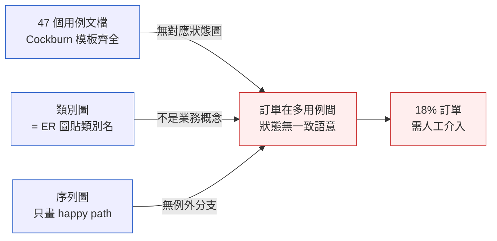
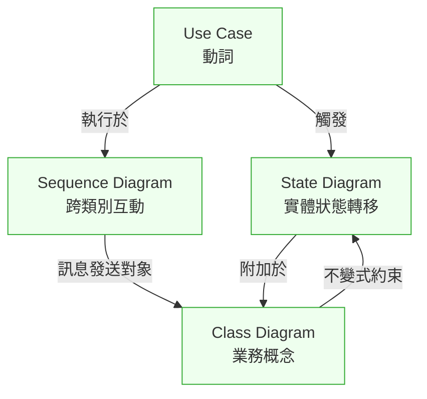
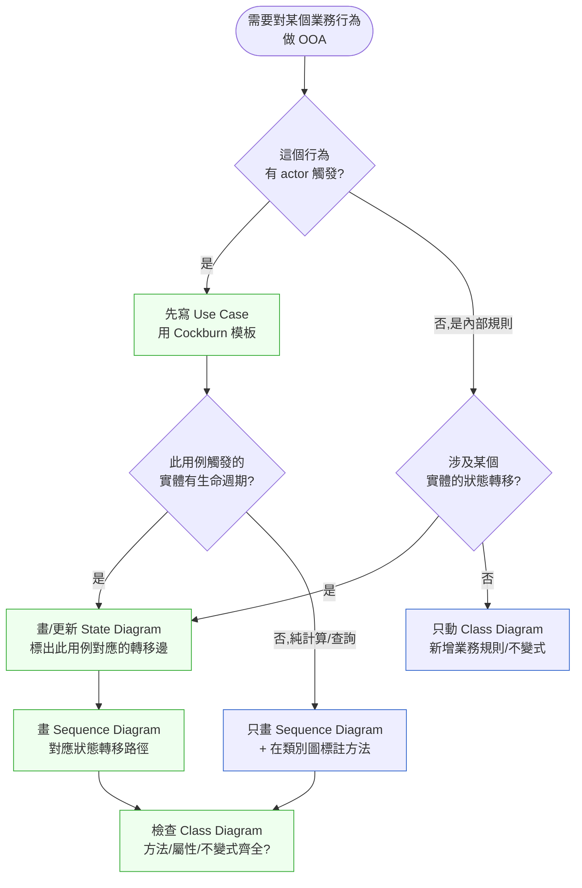

# 第 7 章|物件導向分析
## ⸺ 從用例到狀態,讓四張圖一起活著

> **前置閱讀**:[Ch 5 UML 模型語言全景](../part-01-foundations/ch-05-uml-overview.md)、[Ch 6 需求工程](./ch-06-dfd-structured-analysis.md)
> **下游章節**:[Ch 8 資料建模](./ch-08-data-modeling-normalization.md)、[Ch 10 系統規格與 SRS](./ch-10-spec-documents.md)、[Ch 18 DDD 戰術設計](../part-04-architecture/ch-18-ddd-strategic-tactical.md)
> **延伸補章**:無

---

## 7.1 冷觀察 ⸺ 47 個用例,3 條流程,18% 出包率

我在 2025 年 11 月看過一個案例。

虛構訂閱型快時尚電商 **DripCycle**(`CASE-ECM-003`),做月費制女裝租穿(每月寄四件、可換可留,留下扣抵會員點數),會員約 11 萬人。技術棧 Next.js 15 + Spring Boot 3.3 + PostgreSQL 17 + Stripe。他們在 Q3 上線一輪「冷靜期 7 天退款 + 換貨 + 部分退款」三條流程,給合規團隊看的用例清單寫了 **47 個**,Confluence 頁數 200 頁起跳,審查那場會議大家都點頭。

上線後第 14 天,客服主管傳了一條訊息到工程頻道:「今天第一次有人打電話問換貨退款,但我搞不清楚系統做了什麼。」接下來七天,同類工單快速堆疊 ⸺ 第 21 天結算時,客服統計每 100 張單就有 18 張要人工介入。

SA 把 PostgreSQL 的 event log 和訂單狀態機紀錄拉出來比對。問題馬上浮出來:日誌裡的狀態轉移序列,跟 Confluence 上的用例描述根本對不上。不是程式寫錯,是程式依照序列圖寫對了,但序列圖跟狀態機之間從來沒有人對過。

其中最常見的三種出包長這樣:

> 「我換貨之後又申請冷靜期退款,系統收了我的退款,但我換來的新衣服沒退還,還在我家。」
>
> 「我留下兩件、退兩件,部分退款做完了,但會員點數扣了四件的份。」
>
> 「我退貨包裹進了倉,系統說『已退款』,可是我的卡帳沒看到退款。」

那場事故覆盤,SA 把 47 個用例攤開來,**每一個用例單獨看都對**。用例文檔有 actor、有 trigger、有 main flow、有 exception flow,Cockburn 樣板填得齊齊整整[^CIT-070]。但會議室裡有人講了一句話:

> 「我們把每個用例都寫對了,但沒人寫『這些用例之間訂單是什麼狀態』。」

我把 SA 畫的東西調出來看,結構大概是這樣:



退款用例不知道換貨已經把訂單從 `Shipped` 改成 `ExchangeShipped`;部分退款用例的會員點數扣減邏輯,在序列圖上是一條箭頭寫「扣點」,但點數狀態機根本沒畫;退款 webhook 在序列圖上是 happy path 一條,例外路徑(Stripe 回 `pending` → 24 小時後 `failed`)沒人想過。

47 個用例都寫對了,但這四張圖沒有一起活著。

---

## 7.2 真問題 ⸺ OOA 的價值不在「畫類別圖」

物件導向分析(Object-Oriented Analysis, OOA)在台灣的 SA 教育裡,常被簡化成「畫類別圖、寫用例」。Jacobson 1992 年[^CIT-070]、Larman 2004 年[^CIT-072]都不是這樣定義它的。把這件事拆開來看,OOA 真正在做的事情有一個更精確的描述:**發現業務概念與業務動作的對應**。

業務概念 = 名詞,業務動作 = 動詞。OOA 的核心不是「列出所有名詞」(那是 1980 年代的 noun-extraction 練習,Larman 在第三版已經明確說那是入門練習,不是設計手段),而是把名詞與動詞**綁進四張會互相說話的圖**:

| 視角 | UML 圖 | 回答的問題 | 主要產出 |
|---|---|---|---|
| **誰要做什麼** | Use Case Diagram + Use Case 描述 | 系統對外可被觸發的動作有哪些 | 用例清單 + 用例描述 |
| **業務世界長什麼樣** | Class Diagram(概念層) | 業務概念之間的關係與不變式 | 領域模型 |
| **一次動作怎麼跑** | Sequence Diagram | 執行某用例時誰呼叫誰、訊息順序 | 互動流程 |
| **某個東西的生命** | State Diagram | 一個實體在生命週期中的狀態轉移 | 狀態機 |

這四張圖在現場常見的問題不是「沒畫」,而是**各畫各的**。用例團隊寫用例,DBA 畫類別圖(實際上是 ER 圖貼類別名),架構師畫序列圖,測試畫狀態圖 ⸺ 然後沒人對齊。

換句話說,OOA 真正的單位不是「圖」,是**「圖與圖之間的對應關係」**。把這層對應關係抽出來,大概是下面這張:



讀法是這樣:**一個用例對應一個(或一組)狀態機,一個狀態機附加在一個類別上,一組類別之間有互動,互動跑在序列圖上**。任何一張圖獨立更新,其他三張就會說謊。DripCycle 的 47 個用例之所以全部寫對卻整體出錯,就是這層對應關係從來沒被建立。

把這個視角放回現場,可以看到 OOA 真正在處理的是三件事。

### 7.2.1 用例是動詞的清單,不是需求清單

Cockburn 在 *Writing Effective Use Cases*[^CIT-071]裡反覆強調一件事:用例是「行為的合約」(behavioral contract),不是需求列表。這兩者最大的差別是:**需求清單彼此獨立,用例彼此會在同一個實體的狀態機上競爭**。

DripCycle 的「冷靜期退款」「換貨」「部分退款」三個用例獨立看都合理,但它們三個都會更動 `Order` 這個聚合根的狀態。沒有狀態機把這三個動作在 `Order` 上的合法轉移畫清楚,用例就是三條彼此不認識的需求。

### 7.2.2 類別圖是業務概念,不是資料庫 schema

Larman[^CIT-072]在 *Applying UML and Patterns* 第三版花了一整章區分 **Conceptual Class Diagram**(概念層)與 **Design Class Diagram**(設計層)。前者是業務世界的詞彙,後者是程式碼的結構。**OOA 階段該畫的是前者**。

現場常見的失誤是 DBA 主導 OOA 階段,類別圖直接從 ER 圖反推 ⸺ `User`、`Order`、`OrderItem`、`Payment` 全部來自既有資料表。這樣畫出來的東西不是業務概念,是資料庫結構的同義反覆。OOA 的價值在於**逼一次「業務上這個東西到底是什麼」的對話**,跳過這層,後面的設計就只是把舊 schema 重新包裝一次。

### 7.2.3 狀態圖不是 review 才拿出來,是用例的孿生兄弟

Booch 在 *UML User Guide*[^CIT-074]裡有一句話常被引用:**有狀態的實體,沒有狀態圖就等於沒被理解**。

DripCycle 的 `Order` 在三條流程跑下來,實際上要經歷至少 11 個狀態;但他們的狀態圖只在合規 review 時被拿出來看一次,review 完進了 Confluence,沒人再回頭比對用例。結果是用例寫的轉移和狀態機畫的轉移有 30% 對不上 ⸺ 例如「冷靜期退款」用例在描述裡能從 `ExchangeShipped` 直接走到 `Refunded`,但狀態圖上根本沒有這條邊。

這就是「四張圖必須一起活著」的硬指標:**任一張圖被改動,其他三張至少有一張要被檢查**。

---

## 7.3 決策框架 ⸺ 用例顆粒度、四圖協同、該畫哪張

下面這幾張表跟流程圖,在現場相當好用。它們的共同前提是:**讀者比工具重要,對應關係比單張完整重要**。

### 7.3.1 用例顆粒度判準表

Cockburn[^CIT-071]提出三層用例顆粒度,以海拔(altitude)做隱喻:**雲端(摘要,summary)/ 海面(用戶目標,user goal)/ 海底(子功能,subfunction)**。OOA 階段應集中在「海面」層 ⸺ 也就是「一個 actor 在一次坐下時要完成的一件事」。

| 顆粒度 | 海拔 | 例(DripCycle) | OOA 該不該畫 | 原因 |
|---|---|---|---|---|
| 摘要 | 雲端 | 「會員管理會員生命週期」 | 否 | 太大,涵蓋多次 session |
| **用戶目標** | **海面** | **「會員申請冷靜期退款」** | **是** | **一次坐下完成,對應一個狀態轉移** |
| 用戶目標 | 海面 | 「會員申請部分退款」 | 是 | 同上 |
| 用戶目標 | 海面 | 「會員啟動換貨」 | 是 | 同上 |
| 子功能 | 海底 | 「驗證信用卡 token」 | 否 | 步驟,不是用例 |
| 子功能 | 海底 | 「計算會員點數扣減」 | 否 | 業務規則,寫進類別不變式 |

**判準的實用版**:一個用例若不能對應到「某個聚合根上的一個狀態轉移」(或一組緊密相關的轉移),它的顆粒度多半錯了。寫太大就拆,寫太小就併進其他用例的步驟。

### 7.3.2 四圖協同表(誰更新誰)

這張表是「四張圖一起活著」的具體操作規則,在 PR review 時直接套用。

| 觸發改動 | 必檢查 | 連帶可能要改 | 不檢查的代價 |
|---|---|---|---|
| 新增/修改用例 | 對應狀態機是否有該轉移 | 序列圖、類別不變式 | 用例描述與實際行為不一致 |
| 新增/修改狀態 | 哪些用例觸發此狀態 | 類別屬性、序列圖分支 | 狀態爆炸,部分狀態無人負責 |
| 新增/修改類別屬性 | 屬性是否進入狀態決策 | 狀態機條件、用例後置條件 | 業務規則散在程式碼各處 |
| 新增/修改序列圖訊息 | 訊息對應的方法是否存在 | 類別職責、狀態機觸發條件 | 序列圖變成幻想 |
| 新增/修改類別關聯 | 是否破壞既有用例的不變式 | 狀態機初始化路徑 | 有效狀態變成不可達 |

**這張表的實際使用方式**:把它印成 PR 模板的 checklist。任何一個 PR 改動了上述其中一項,checklist 上對應那行的所有「必檢查」欄位都要打勾,並在 PR 描述附上對應圖的 diff(`.mmd` 檔)。沒附 diff 的 PR 不過。

### 7.3.3 決策樹:這次該畫哪張?



**這張圖的關鍵不是分支多,是預設順序:Use Case → State → Sequence → Class**。從動詞出發、經過狀態、落到互動、收斂到結構。反過來走(從類別出發推用例)是 1990 年代 noun-extraction 的老路,在 2026 年的迭代節奏下會走得很慢,而且容易把資料庫結構誤認為業務概念。

### 7.3.4 4+1 視圖的 2026 縮減版

Kruchten 1995 年提出 4+1 View Model[^CIT-073]:Logical / Process / Development / Physical + Use Case(Scenarios)。三十年後的工程現場,這五個視圖大幅收斂。

| Kruchten 1995 原視圖 | 1990s 對應產出 | 2026 對應產出 | 是否 OOA 階段交付 |
|---|---|---|---|
| **Logical View** | UML Class Diagram | Class Diagram(概念層) + DDD Aggregate | **是** |
| **Process View** | UML Activity / Sequence | Sequence Diagram + Event Storming | **是**(Sequence) |
| Development View | UML Component / Package | repo 結構、模組邊界、ArchUnit | 否(SD 階段) |
| Physical View | UML Deployment | C4 Deployment、K8s manifest | 否(SD 階段) |
| **+1 Scenarios** | UML Use Case | Use Case(Cockburn)+ State Diagram | **是** |

OOA 階段的有效範圍是 **Logical + Process + Scenarios** 三個視圖,**State Diagram 在 Kruchten 原版裡塞在 Logical 與 Scenarios 之間,2026 的實用做法是把它獨立成第四張**。Development 與 Physical 留給設計階段(Ch 11 之後)。

### 7.3.5 OOA 與 DDD Bounded Context 的關係

OOA 的概念類別圖,跟 DDD 的領域模型是同一件事的兩個發音 ⸺ Larman[^CIT-072]在 2004 年寫第三版時 DDD 才剛出版一年,他用的詞是 Conceptual Class Diagram;Evans[^CIT-005]在 *Domain-Driven Design* 用的詞是 Domain Model。兩者在「**業務概念建模、不是 schema**」這個核心訴求上完全一致。

差別在尺度。OOA 預設處理的是一個系統內的領域模型;DDD 多了一層 **Bounded Context**(限界上下文),處理「同一個詞在不同子領域含義不同」的問題 ⸺ DripCycle 的 `Order` 在「訂單管理」context 是租賃合約,在「物流」context 是包裹,在「會計」context 是應收帳款。三者用同一張類別圖會打架。

換句話說,OOA 是 DDD 在單一 context 內的工作方法,DDD 是把多個 OOA 模型黏起來的方法。Ch 18 會把這層關係完整展開,本章先把單一 context 內的 OOA 做扎實。

---

## 7.4 踩坑清單

下面這四個常見地雷,在訂閱、訂單、退款、會員點數這種具有狀態的業務,反覆出現。共同點是「四張圖各畫各的,沒有人對齊」。

### 反模式 1:用例變成需求清單

DripCycle 的 47 個用例文檔,每份都符合 Cockburn 模板,但攤開來看會發現:同一個 actor(會員)在同一個 session 能做的動作被切成了七八個用例,而每個用例都從「會員登入」開始寫起,後置條件也都是「會員登出」。看起來齊整,實際上是把需求拆成了用例的格式,沒有用「用戶目標」這個顆粒度去重新切過。

> ✅ **修正方向**:每寫完一個用例,問一次:「這個用例的後置條件,是不是某個聚合根的狀態變了?」是的話保留,不是的話多半是子功能被誤升等。47 個用例在 DripCycle 重新切過之後剩 **19 個**,每個都對應 `Order` / `Subscription` / `Refund` / `MemberPoint` 四個聚合根上的明確狀態轉移。

### 反模式 2:類別圖直接抄 schema

DripCycle 第一版類別圖有 38 個類別,跟資料庫的 38 張表一一對應。`order_items` 表變成 `OrderItem` 類別,`payment_transactions` 表變成 `PaymentTransaction` 類別 ⸺ 這不是領域模型,這是 ORM 反向工程。

問題在於業務語言裡根本沒有「OrderItem」這個東西。客服跟會員講話的時候,講的是「這次寄出的四件衣服」「你留下的兩件」「你要退的兩件」,**這三組概念在 schema 裡長得一樣,在業務上是三個東西**。一個資料表打三個業務概念,程式碼就要在每個用例裡重做一次過濾,bug 就從這裡長出來。

> ✅ **修正方向**:OOA 階段先封住資料庫,類別圖從業務對話裡找名詞。具體做法是在訪談錄音逐字稿裡用顏色標出每個名詞,**頻率高、跨多個用例出現的名詞**才是聚合根候選。DripCycle 重做之後類別圖剩 12 個概念類別,其中 `Shipment`(這次寄出的東西)、`KeptItems`(留下的)、`ReturnedItems`(退的)是新出現的、原 schema 沒有的概念 ⸺ 後續設計階段才把它們對應到資料表(可能是 view、可能是新表),那是 SD 的事。

### 反模式 3:序列圖只畫 happy path

DripCycle 退款用例的序列圖,從「會員按退款」到「Stripe 回傳成功」一條線到底,9 條訊息,看起來很乾淨。但 Stripe 的 refund webhook 實際上有四種狀態:`pending` / `succeeded` / `failed` / `canceled`,而且 `pending` 可能停留 24 小時以上才轉 `failed`。

序列圖沒畫例外,工程師寫程式時就會把例外路徑當「之後再補」處理,結果上線那天「之後」就到了。Larman 在第三版 SSD(System Sequence Diagram)章節[^CIT-072]強調過:**例外是 SSD 的一等公民,不是 happy path 的附錄**。

> ✅ **修正方向**:每張序列圖寫完,強迫列出至少三條例外路徑(timeout、外部服務拒絕、業務規則衝突),用 `alt` / `opt` 框畫進同一張圖,或拆成獨立的「例外序列圖」並在主圖標註指引。Mermaid 的 `alt` 區塊在這個場景特別好用。

### 反模式 4:狀態圖只在 review 時拿出來

最隱蔽的反模式。狀態圖在 OOA 文件包裡看起來都有,但它跟其他三張圖的關係是「兄弟姊妹住在不同房間,過年才見面」。DripCycle 的狀態圖在合規 review 時被打開過一次,後續三個月用例改了五輪、序列圖改了三輪、狀態圖一次都沒改。

這個反模式特別難察覺,因為 artifact 都在,QA 點名也都點得到,**但「圖之間的對應關係」這個東西不在 artifact 清單上**,沒人負責檢查。

> ✅ **修正方向**:把 §7.3.2 的「四圖協同表」變成 PR 模板強制欄位。任何 PR 觸發其中一行,對應的「必檢查」欄都要勾,並把對應圖檔(`.mmd`)的 diff 附在 PR 描述。沒附就退 ⸺ 不是因為形式,是因為這是「四張圖一起活著」唯一可被機械化的執行點。

---

## 7.5 交付清單 ⸺ 一頁式 Use Case Atom 模板

每個用戶目標層的用例,**第一份要產出的不是 Cockburn 全套模板,是 Use Case Atom**。它是一張卡片(一頁 Markdown),寫不滿欄位代表用例顆粒度有問題,寫超過一頁代表用例太大要拆。

把它存在 `docs/usecases/UC-{NN}-{slug}.md`,跟 repo 同 version,跟對應的 `.mmd` 圖檔放在同層。

````markdown
# Use Case Atom — UC-{NN} {用例名}

> 版本:v0.1 | 撰寫日期:YYYY-MM-DD | 擁有人:{名字}

> 對應檔:docs/usecases/UC-{NN}-{slug}.md
> 對應圖:docs/diagrams/state-{aggregate}.mmd、docs/diagrams/seq-uc-{NN}.mmd

| 欄位 | 內容 |
|---|---|
| **Trigger** | 是什麼觸發了這個用例?(會員按按鈕 / 排程 / 外部 webhook) |
| **Actor** | 主要 actor + 次要 actor(若有) |
| **Pre-state** | 在哪些聚合根、哪些狀態下,這個用例才合法?(例:`Order in {Shipped, ExchangeShipped}` 且 `now - shipped_at < 7d`) |
| **Post-state** | 用例成功後,哪些聚合根變成什麼狀態?(例:`Order → Refunding`、`MemberPoint → Adjusted`) |
| **Linked Class** | 這個用例會碰到哪些業務概念?(列聚合根 + 重要 value object) |
| **Linked State Diagram** | 對應的狀態機圖檔路徑 + 此用例對應的「邊」標號 |
| **Linked Sequence** | 對應的序列圖檔路徑 + happy path 與例外路徑各列一條 |
| **Variants** | 這個用例的合法變體有哪些?(部分退款 vs 全額退款 / 換貨後退款 vs 直接退款) |
| **Out of Scope** | 此用例明確不涵蓋的相關行為(避免被誤合併) |
| **Last Verified** | YYYY-MM-DD,由誰對程式碼驗證 |
````

**為什麼叫 Atom?** 因為它是 OOA 中最小、不可再分的協同單位 ⸺ 一個用例 + 對應狀態邊 + 對應序列 + 對應類別,四件一組同進同出。任何一份 Atom 缺其中一項都不算完成。

**為什麼要有 Pre-state 與 Post-state?** Cockburn[^CIT-071]原版用例模板的「pre-condition / post-condition」常被當成 prose 寫成「會員必須已登入」這種廢話。**Pre-state / Post-state 強制把條件寫成「聚合根 + 狀態」的二元組**,這個格式直接對應狀態圖的邊,圖一旦變了,Atom 卡上看得出來。

**為什麼要有 Variants?** DripCycle 的退款用例之所以失控,是因為「冷靜期退款」「換貨後退款」「部分退款」被當成三個用例。其實它們是一個用例的三個變體,共享同一組 Pre-state / Post-state 與聚合根,只在執行路徑上分支。寫成一個用例 + 三個 variants,協同表上的「必檢查」欄位才會自動覆蓋三條路徑。

### 7.5.1 範例:DripCycle 把 47 用例收斂為 19 後,為「冷靜期退款」重寫的 Atom

第 18% 出包率的覆盤會結束後,DripCycle 的 SA 從 47 份 Cockburn 模板裡挑出最痛的「冷靜期退款」重寫成 Atom。下面就是當時放進 `docs/usecases/UC-07-cooling-off-refund.md` 的版本 ⸺ 把過去散落在三份用例文檔裡的退款行為合成一個用例 + 三個變體,Pre/Post-state 直接掛到 `Order` 狀態機的邊上:

````markdown
# Use Case Atom — UC-07 冷靜期退款 (Cooling-off Refund)

> 版本:v0.1 | 撰寫日期:2026-01-15 | 擁有人:Wei (SA)

> 對應檔:docs/usecases/UC-07-cooling-off-refund.md
> 對應圖:docs/diagrams/state-order.mmd、docs/diagrams/seq-uc-07.mmd

| 欄位 | 內容 |
|---|---|
| **Trigger** | 會員於會員後台按下「申請冷靜期退款」按鈕 |
| **Actor** | 主:會員;次:Stripe(refund webhook)、倉儲系統(回收 SLA) |
| **Pre-state** | <!-- 為什麼這欄:過去 prose 寫「會員必須已登入」是廢話; 二元組逼出真正合法的狀態,圖一變 Atom 立刻看得出。 --> `Order ∈ {Shipped, ExchangeShipped, PartiallyKept}` 且 `now − shipped_at ≤ 7d` 且 `Subscription.status = Active` |
| **Post-state** | <!-- 為什麼這欄:沒寫成「聚合根→狀態」, 點數扣四件、退兩件那種 bug 就會在用例之間漏接。 --> 成功:`Order → Refunding`、`Refund → Pending`、`MemberPoint → Adjusted(−n,n=已寄件數)`;Stripe webhook `succeeded` 後:`Order → Refunded`、`Refund → Completed` |
| **Linked Class** | 聚合根:`Order`、`Refund`、`MemberPoint`;VO:`Money`、`ShippedItems`、`KeptItems`、`ReturnedItems` |
| **Linked State Diagram** | <!-- 為什麼這欄:沒寫對應的「邊標號」, 狀態圖每次改完就跟用例走散,DripCycle 那 30% 對不上正是這欄缺。 --> `state-order.mmd` 邊 `e07a`(Shipped→Refunding)、`e07b`(ExchangeShipped→Refunding)、`e07c`(PartiallyKept→Refunding) |
| **Linked Sequence** | `seq-uc-07.mmd` happy path:`e07a` → Stripe `succeeded`;例外路徑 1:Stripe `pending` 24hr → `failed`(回滾至 Pre-state);例外路徑 2:倉儲 SLA 逾期 → 進人工審查 |
| **Variants** | <!-- 為什麼這欄:把過去 3 個獨立用例壓成一個+三變體, 協同表的「必檢查」自動覆蓋三條路徑,bug 不再從變體間漏接。 --> V1 全額退款(來自 `Shipped`);V2 換貨後退款(來自 `ExchangeShipped`,需先回收新貨);V3 部分退款(來自 `PartiallyKept`,點數按已寄件數而非已留件數扣) |
| **Out of Scope** | 不涵蓋:逾 7 天爭議退款(走 UC-09 客服仲裁)、年度會員費退款(走 UC-12)、訂閱取消(走 UC-03) |
| **Last Verified** | 2025-12-03,由 Wei(SA)對 `OrderService.refund()` 與 `state-order.mmd` 雙向驗證 |
````

把這張卡掛上 PR 模板之後,下一個改動 `Order` 狀態機的 PR 會自動被擋下來檢查 ⸺ **Atom 不是文件,是讓四張圖在每次 PR 都被點名一次的機械化提醒**。

---

## 7.6 本章交付清單 Recap

讀完本章,你應該已經能做到:

- [ ] 講清楚 OOA 的價值不在「畫類別圖」,而在「發現業務概念與業務動作的對應」⸺ 用例 / 類別 / 互動 / 狀態四張圖必須一起活著
- [ ] 用 Cockburn 三層海拔(雲端 / 海面 / 海底)幫當前用例清單抓出顆粒度錯位的部分
- [ ] 在 PR review 用「四圖協同表」逐欄檢查,不再讓任一張圖獨自更新
- [ ] 為手上每個用戶目標層用例寫一份 Use Case Atom,放進 repo

如果四項中先挑一項做完就好,建議是最後那一項 ⸺ 把目前 Confluence 上的用例文檔挑五個出來,**用 Atom 模板重寫一次**。寫不滿 Pre-state / Post-state / Linked State Diagram 三欄的,代表用例與狀態機從未對齊過,那五個就是先要回去談的對象。本書 Ch 8 會把這層概念類別圖往資料模型方向收斂,Ch 18 會把它往 DDD Bounded Context 方向展開。

---

## Cross-References

- **回顧**:[Ch 5 UML 模型語言全景](../part-01-foundations/ch-05-uml-overview.md)、[Ch 6 需求工程](./ch-06-dfd-structured-analysis.md)
- **下一章**:[Ch 8 資料建模](./ch-08-data-modeling-normalization.md) ⸺ 把概念類別圖收斂到 ER / 邏輯資料模型
- **規格收束**:[Ch 10 系統規格與 SRS](./ch-10-spec-documents.md)
- **DDD 戰術**:[Ch 18 DDD 戰術設計](../part-04-architecture/ch-18-ddd-strategic-tactical.md) ⸺ 把單一 context 的 OOA 擴張到 Bounded Context

## 引用

[^CIT-005]: Eric Evans, *Domain-Driven Design: Tackling Complexity in the Heart of Software* (Addison-Wesley, 2003)。同 Ch 22。本章在 OOA 概念類別圖與 DDD 領域模型對照處再引。
[^CIT-070]: Ivar Jacobson, *Object-Oriented Software Engineering: A Use Case Driven Approach* (Addison-Wesley, 1992)。Use Case 方法學原典,首次提出 use case driven 開發流程。
[^CIT-071]: Alistair Cockburn, *Writing Effective Use Cases* (Addison-Wesley, 2000)。三層海拔顆粒度模型(summary / user-goal / subfunction)出處。
[^CIT-072]: Craig Larman, *Applying UML and Patterns: An Introduction to Object-Oriented Analysis and Design and Iterative Development*, 3rd Edition (Prentice Hall, 2004)。Conceptual / Design Class Diagram 區分;System Sequence Diagram 在 OOA 中的角色。
[^CIT-073]: Philippe Kruchten, "The 4+1 View Model of Architecture", *IEEE Software*, 12(6):42–50 (1995)。
[^CIT-074]: Grady Booch, James Rumbaugh, Ivar Jacobson, *The Unified Modeling Language User Guide*, 2nd Edition (Addison-Wesley, 2005)。UML 三主筆者合著,狀態機在 UML 行為建模中的定位。
