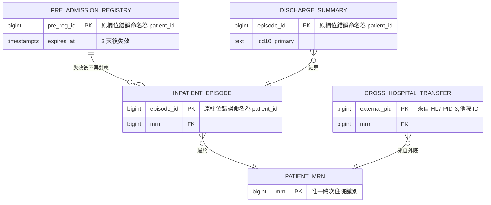
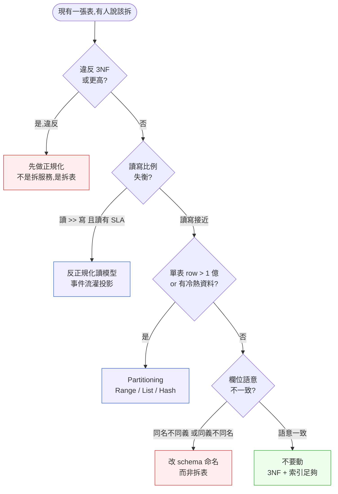

# 第 8 章|資料模型與正規化
## ⸺ 從 ERD 到 Schema,3NF 通過不等於 schema 是好的

> **前置閱讀**:[Ch 6 需求工程](./ch-06-dfd-structured-analysis.md)、[Ch 7 領域建模](./ch-07-object-oriented-analysis.md)
> **下游章節**:[Ch 9 資料流與整合](./ch-09-process-modeling.md)、[Ch 15 資料庫選型](../part-03-design/ch-15-data-storage.md)、[Ch 23 事件驅動架構](../part-04-architecture/ch-23-event-driven-cqrs-es.md)、[Ch 31 資料治理與合規](../part-05-quality/ch-31-data-architecture.md)
> **延伸補章**:無

---

## 8.1 冷觀察 ⸺ 同一個 `patient_id`,四種人生

我在 2025 年第二季,陪一家虛構的住院資訊系統廠商 **MedCanvas Inpatient**(`CASE-HCR-002`)做 schema 健康度檢查。他們前一年靠 HL7 v2.5 ADT 訊息接通了三家區域醫院的 HIS(Hospital Information System),拿到了第四家、也是規模最大的合約 ⸺ 一家 1,800 床的醫學中心。導入第 11 週,他們的住院帳務模組開始出問題:出院結算單上的 ICD-10-CM 主診斷碼,有 6.4% 對不上實際病房紀錄。

我把他們的 schema 拉出來看,事情很快清楚。在他們的核心 PostgreSQL 17 資料庫裡,**「patient_id」這個欄位名字出現了四次,在四張不同的表上,語意完全不同**:

| 表名 | 欄位 | 真實語意 |
|---|---|---|
| `pre_admission_registry` | `patient_id` | 預掛號臨時編號(門診端產出,3 天後失效) |
| `inpatient_episode` | `patient_id` | 入院後產出的 episode-level 院內 ID(這次住院專屬) |
| `discharge_summary` | `patient_id` | 出院摘要上的 MRN(Medical Record Number,跨次住院) |
| `cross_hospital_transfer` | `patient_id` | 跨院轉診時對端醫院給的外部 ID(來自 HL7 PID-3) |

四個欄位都叫 `patient_id`,而且**型別都是 `bigint`**,於是寫 SQL 的工程師理所當然地拿來 join。第 11 週出事的那段查詢長這樣:

```sql
-- 出帳服務的某段查詢(已簡化)
SELECT d.icd10_primary, e.bed_id, e.admit_at
FROM discharge_summary d
JOIN inpatient_episode e ON d.patient_id = e.patient_id  -- ← 這裡爆了
WHERE d.discharge_at::date = CURRENT_DATE - INTERVAL '1 day';
```

兩邊的 `patient_id` 在「同一個人這次住院」的 99.x% 比例下湊巧相等(因為某個半年前的 ETL 為了「方便」做過對齊),但對於有過跨院轉診、或在預掛號階段就改過名字的病人,這個 join 會把 A 病人的診斷碼接到 B 病人的病床上。

事故覆盤會議上,他們的資深工程師翻著 schema docs,問了一句被全場記下來的話:

> 「這四個東西真的應該叫同一個名字嗎?」



四張表,一個名字,四種人生。Schema 通過了 3NF 檢查 ⸺ MedCanvas 的 DBA 半年前還做過正規化稽核報告,結論是「全表都是 3NF 以上,部分達 BCNF」。檢查表上每個欄位都依賴主鍵、不依賴其他非鍵欄位、沒有遞移依賴。**這份稽核報告完全正確,而系統依然出事**。

事故的根因不在正規化,在**命名讓兩個本來不該相等的事實看起來可以相等**。3NF 沒有任何條目要求你「同名欄位語意一致」,所以 3NF 通過,只證明 schema 不爛,不證明它好。

---

## 8.2 真問題 ⸺ 正規化是「拆耦合」,不是「為了正規化而正規化」

正規化(Normalization)從 1970 年 Codd 的原始論文 [^CIT-080] 起,做的事情其實只有一件:**把多個事實的耦合拆開**。每往下走一個正規型(1NF → 2NF → 3NF → BCNF → 4NF → 5NF),就拆開一種耦合形式。把它拆開來看會比較清楚。

| 正規型 | 拆開的耦合 | 一句話判準 | 違反時會出現的事故型態 |
|---|---|---|---|
| **1NF** | 一個欄位塞多個值 | 每個欄位都是原子值(atomic) | 「A、B、C 三個診斷碼塞同一格,要查 B 必須 LIKE」 |
| **2NF** | 部分鍵依賴 | 非鍵欄位完全依賴主鍵 | 「複合主鍵,但某欄位只跟其中一個分量有關」 |
| **3NF** | 遞移依賴 | 非鍵欄位不依賴其他非鍵欄位 | 「病房號決定病房樓層,改樓層要改一萬筆住院紀錄」 |
| **BCNF** | 候選鍵依賴 | 每個決定子(determinant)都是候選鍵 | 「主治醫師決定科別,但科別也決定主治醫師子集」 |
| **4NF** | 多值依賴 | 一個鍵不對應兩組獨立的多值 | 「醫師 × 看診時段 × 看診地點,三方獨立卻擠同一張表」 |
| **5NF** | 連接依賴 | 無損分解後可重組 | 罕見,通常只在排班、藥品交互作用矩陣才會卡到 |

換句話說,正規化的真正目的不是「把表拆得越多越好」,而是**讓每個事實只在系統裡出現一次**(One Fact in One Place)。一個事實出現兩次,改它就要兩個動作;兩個動作在分散式環境下幾乎一定會脫鉤;脫鉤的瞬間,你就在用兩個版本的真相同時做生意。

但 3NF 通過為何不夠?把 MedCanvas 的事故再拆一層就清楚了。

### 8.2.1 命名是模型約束,不是 Schema 裝飾

這是 MedCanvas 事故最容易被誤讀的地方。表面上看像是「Model 與 Schema 脫節」,但真正的問題更早發生:在建模階段,四個不同的業務概念從來沒有被強制給出四個不同的名字。

把 MedCanvas 那四個 `patient_id` 拆回模型層看,真正的業務概念有四個:**Pre-Registration Token**(預掛號臨時權證)、**Episode**(這次住院)、**Medical Record Number / MRN**(病人在本院的終身識別)、**External Patient ID**(他院的對應)。這四個概念在業務上的生命週期、發證單位、信任邊界都不同。如果建模時就把命名約束做對 ⸺ `pre_reg_id`、`episode_id`、`mrn`、`external_pid` ⸺ 工程師在寫 schema 時自然就無法把四張表的識別碼對齊成同一型別、同一名稱。命名紀律不是風格偏好,它是模型約束的第一道閘門:迫使建模者在 schema 成形之前,先把「這四件事到底是不是同一件事」這個問題答清楚。

> 四個概念應該用四個不同的識別碼名稱 ⸺ 這樣 schema 才會自動把它們保持在四個獨立的語意空間。Schema 沒有出賣 Model;是 Model 本身從未被足夠明確地表達成「四個不同實體」,Schema 只是忠實地繼承了這個模糊。

### 8.2.2 3NF 檢查的盲點

3NF 檢查的是「欄位之間的函數依賴(Functional Dependency)」。它不檢查:

- **語意一致性**:兩張表的同名欄位是不是同一個東西
- **時間性**:這個事實在什麼時間軸上有效(預掛號 token 3 天失效,MRN 終身有效)
- **信任邊界**:這個值是本院產的,還是他院塞進來的(PID-3 from HL7)
- **可演進性**:三年後新增一種識別碼會不會炸掉現有 join

這些都是 schema 健康度的真正內容,而 3NF 一個都管不到。Chris Date 在 *Database Design and Relational Theory*[^CIT-082] 講得很直白:正規化是工具,不是目標,**「資料庫設計的目標是模型正確,正規化只是達成模型正確的其中一條路徑」**。

### 8.2.3 一個健康 schema 的三個能力

把這件事壓成可操作的標準,一個健康的 schema 在 2026 年要能做到三件事:

1. **支撐當前查詢**:現在的關鍵查詢能在可接受的延遲下完成,不需要先重構 schema
2. **能演進**:三年後業務新增、欄位拆分、識別碼擴展時,不需要 big-bang migration
3. **能被未來的人讀懂**:六個月後的新人(或 AI Agent)看 schema 名稱、欄位型別、註解,能還原出業務模型

3NF 通過 + 上述三點全綠 = schema 是好的。3NF 通過但任何一點不綠,你就站在 MedCanvas 那種事故的入口。

---

## 8.3 決策框架 ⸺ 何時拆、何時併、用什麼鍵、怎麼分割

下面這幾張表跟流程圖,在現場相當好用。它們的共同前提是:**正規化是手段,模型正確才是目的**。

### 8.3.1 1NF~5NF 判準速查表(Crow's Foot 心智版)

ERD 的兩種主流標記法 ⸺ Chen 1976 [^CIT-081] 的菱形/橢圓符號,以及後來 Crow's Foot(Bachman / IDEF1X 衍生)的「鳥腳」基數表示 ⸺ 在 2026 年的工具鏈幾乎都採 Crow's Foot,因為它能直接對應 SQL 外鍵約束。Mermaid 的 `erDiagram` 預設語法就是 Crow's Foot。

判準表如下,每一列都附「現場聞到味道就該動手」的訊號:

| 正規型 | 通過判準 | 違反訊號(日常聞得到) | 修正動作 |
|---|---|---|---|
| **1NF** | 欄位原子化、無重複群組 | 用 `,` 分隔的字串、JSON 陣列當主資料 | 拆子表或改 array 型別並加索引 |
| **2NF** | 1NF + 無部分鍵依賴 | 複合 PK 表,某欄位 update 只跟一半 PK 有關 | 拆出該欄位的獨立表 |
| **3NF** | 2NF + 無遞移依賴 | 「改 A 表的城市名,B 表也得跟著改」 | 把可被遞移推導的欄位獨立成表 |
| **BCNF** | 3NF + 每個 determinant 都是候選鍵 | 罕見,通常出現在多對多+屬性的場景 | 進一步拆分,但要評估 join 成本 |
| **4NF** | BCNF + 無多值依賴 | 排班表、產品變體表常見 | 拆成兩張獨立的多對多 |
| **5NF** | 4NF + 無連接依賴 | 工程現場極少卡到,通常是合規/醫療法規場景 | 教科書練習,實務需逐 case 評估 |

**現場節奏建議**:大部分 OLTP 系統做到 **3NF**,個別熱點桌做到 **BCNF** 已經夠用。4NF/5NF 是教科書必備、實務罕用 ⸺ Chris Date 自己在第 2 版書 [^CIT-082] 也明說「商業系統卡到 4NF 以上的真實案例,通常是模型沒切乾淨,而不是正規化做不夠」。

### 8.3.2 反正規化(Denormalization)時機表

正規化拆耦合,反正規化把耦合裝回來換性能。**裝回來這件事本身不是壞事,但要在正確的位置裝**。下面這張時機表,是現場常用的判斷:

| 場景 | 是否反正規化 | 反正規化形式 | 風險與護欄 |
|---|---|---|---|
| 讀寫分離,讀模型有 SLA | **建議** | CQRS 讀側物化視圖 | 必須有事件流(CDC / outbox)持續灌讀模型,不能定時批 |
| 報表 / BI 預計算 | **建議** | Materialized View、ETL 寬表 | 預計算延遲需明確標示(例:T+1) |
| 熱資料快取(Top 1% 病房狀態) | **建議** | Redis / 應用層快取 | TTL + 失效事件,別讓快取變主資料 |
| 跨服務 join 太多 | **小心** | API Composition / 邊界調整 | 通常是 bounded context 切錯,不是 schema 問題 |
| 為了「省一個 join」 | **不建議** | (避免) | 省的是毫秒,付的是模型耦合 |
| 為了「歷史快照」 | **建議** | 事件溯源(Event Sourcing)+ 投影 | 事件 schema 本身要做版本控管 |
| 為了「報表跑不動」 | **先看索引** | 索引、partition、分析型副本 | 反正規化是最後手段,不是第一手段 |

**核心原則**:反正規化的對象是**讀路徑**,不是**寫路徑**。寫路徑保持高度正規化(One Fact in One Place),讀路徑按查詢需求做投影,中間用事件流(CDC / outbox / Kafka / Debezium(Red Hat))把兩邊接起來。這也是為什麼 CQRS 在 2026 年仍然是主流模式 [^CIT-085]。

### 8.3.3 主鍵策略取捨表(2026 版)

主鍵的選擇,在 2026 年比五年前複雜,因為 UUIDv7(RFC 9562:2024 [^CIT-083])正式進入工程主流,把過去「UUID 不索引友好」這個老問題解掉一大半。下面這張對照表,涵蓋現場真的會被選的四種:

| 維度 | Auto-increment(serial / identity) | UUIDv4 | **UUIDv7** | ULID |
|---|---|---|---|---|
| **長度** | 8 bytes | 16 bytes | 16 bytes | 16 bytes(26 字元 base32) |
| **可預測性** | 高(可枚舉) | 無 | 時間有序、亂數不可枚舉 | 同 UUIDv7 |
| **插入索引友好** | ★★★★★ | ★★(B-tree 隨機點插入) | ★★★★(時間遞增) | ★★★★ |
| **跨服務生成** | ✗(需中央) | ✓ | ✓ | ✓ |
| **資安/隱私** | 差(可推 N+1) | 好 | 好(時間外洩可接受) | 好 |
| **可讀性** | 數字直觀 | 醜 | 醜 | 較友好(crockford base32) |
| **RFC 規範** | 各 DB 廠商方言 | RFC 4122 | **RFC 9562 (2024)** | 社群規範,無 IETF RFC |
| **2026 適用場景** | 小團隊內部表、查詢日誌 | 需要強隨機性的合規場景 | **多數新系統的預設值** | 偏好可讀 ID 的場景 |

**現場常用的拇指法則**:

- 新系統的預設主鍵建議走 **UUIDv7**:時間有序解掉了 UUIDv4 的索引碎片化問題,跨服務生成又不用中央發號
- 對外暴露的 ID(對外 API、URL、檔名)再多包一層 hashids / sqids,不要直接把 UUIDv7 露出去 ⸺ 它的時間部分會洩漏建立時刻
- 純內部高頻表(audit log、metric snapshot)還是 auto-increment 最便宜
- ULID 跟 UUIDv7 在功能上幾乎重疊,選有 IETF RFC 撐腰的版本(UUIDv7)在合規對話上比較省事

PostgreSQL 17 還沒原生 `uuidv7()` 函式(目前社群 patch 在 18 的 roadmap [^CIT-086]),現場常見做法是裝 `pg_uuidv7` extension,或在應用層生成。範例:

```sql
-- PostgreSQL 17 + pg_uuidv7 extension
CREATE EXTENSION IF NOT EXISTS pg_uuidv7;

CREATE TABLE inpatient_episode (
    episode_id    uuid        PRIMARY KEY DEFAULT uuid_generate_v7(),
    mrn           bigint      NOT NULL REFERENCES patient_mrn(mrn),
    admit_at      timestamptz NOT NULL,
    discharge_at  timestamptz,
    drg_code      text,
    -- 注意:不再叫 patient_id
    CONSTRAINT chk_discharge_after_admit
        CHECK (discharge_at IS NULL OR discharge_at >= admit_at)
);

-- UUIDv7 時間有序 → B-tree 插入接近順序寫
CREATE INDEX idx_episode_admit_at ON inpatient_episode (admit_at);
```

### 8.3.4 分割(Partitioning)vs Sharding

分割與 Sharding 在現場常被混用,實際上是兩件事:

| 維度 | Partitioning(分割) | Sharding(分片) |
|---|---|---|
| **發生位置** | 單一資料庫實例內 | 跨多個資料庫實例 |
| **目的** | 改善單表掃描、過期資料下架、索引大小 | 突破單實例容量/吞吐上限 |
| **跨片 join** | 同庫,DB 引擎處理 | 應用層或 query router(Vitess(PlanetScale) / Citus(Microsoft)) |
| **PostgreSQL 17 原生** | ✓ Range / List / Hash | ✗(靠 Citus(Microsoft) / 自建) |
| **何時使用** | 單表 > 1 億 row、有時間維度 | 單實例已撐不住寫入或容量 |

```sql
-- PostgreSQL 17 Range Partitioning,按月切住院紀錄
CREATE TABLE inpatient_episode (
    episode_id   uuid,
    mrn          bigint NOT NULL,
    admit_at     timestamptz NOT NULL,
    discharge_at timestamptz,
    drg_code     text,
    PRIMARY KEY (episode_id, admit_at)
) PARTITION BY RANGE (admit_at);

CREATE TABLE inpatient_episode_2026q1
    PARTITION OF inpatient_episode
    FOR VALUES FROM ('2026-01-01') TO ('2026-04-01');

CREATE TABLE inpatient_episode_2026q2
    PARTITION OF inpatient_episode
    FOR VALUES FROM ('2026-04-01') TO ('2026-07-01');
```

**現場節奏**:先做 Partitioning,做不夠才考慮 Sharding。Sharding 是把 schema 問題升級成分散式系統問題,不是免費的午餐。需要原生時序壓縮的話,TimescaleDB(Timescale, PostgreSQL extension)[^CIT-087]在 hypertable 上自動處理 chunk 分割,在住院監測、ICU 生命徵象這類時序場景比手切 partition 省事。

### 8.3.5 決策樹:這張表現在該不該拆?



**這張圖的關鍵不是分支,是綠色那個出口 `Stay`**。多數時候「該不該拆」這個問題的最佳答案是「不該」。3NF 加上對的索引,可以撐到資料量比你想像的大得多;真正逼你動 schema 的,通常是業務模型出現新事實(如 MedCanvas 的跨院轉診),不是性能。

---

## 8.4 踩坑清單

下面這四個常見地雷,在 healthcare、fintech、ecommerce 各種領域都常見。它們的共同點是「正規化的形式做對了,但模型被形式背叛了」。

### 反模式 1:為了正規化把每個 enum 拆表

新進工程師讀完 Codd 原典,熱情很高,把每一個 enum 都拆出 lookup 表:`gender_lookup`、`marital_status_lookup`、`blood_type_lookup`、`admit_source_lookup`。一張病人主資料表配了 12 張 lookup,任何一個查詢都要 join 到天荒地老。

問題在於:**enum 拆表的目的是「值會新增/變動」**,不是「為了 3NF 看起來漂亮」。`blood_type` 的合法值是 A/B/AB/O × ±,五十年沒變過,拆表只是把 1 byte 換成一次 join。

> ✅ **修正方向**:lookup 表只用在「值會由業務動態新增」的情境(如保險方案、科別代碼)。靜態 enum 直接用 PostgreSQL 的 `CREATE TYPE ... AS ENUM`,或用 `text + CHECK constraint`,把合法值寫進 schema 而非另一張表。閱讀成本低、JOIN 成本零、語意還更清楚。

### 反模式 2:過度反正規化(6 個 join 換成 1 張寬表)

報表跑不動,DBA 把 6 個正規化的表預先 join 成一張 280 欄的寬表 `inpatient_report_wide`,並寫了一個每小時的 ETL 同步。半年後業務新增一個欄位 `drg_severity_score`,要進寬表就得改 ETL、改報表、回填歷史 ⸺ 寬表反過來鎖死了模型演進。

> ✅ **修正方向**:報表類反正規化用 **Materialized View** 或 **CQRS 讀模型**,不要做成「寫端要主動維護」的寬表。Materialized View 至少有 `REFRESH MATERIALIZED VIEW CONCURRENTLY` 一鍵重建;CQRS 讀模型透過事件流增量更新,新增欄位時只要重播事件。寬表 + ETL 是「省了今天的查詢時間,押了三年的演進空間」。

### 反模式 3:用 string 存日期(沒有時區)

`admit_at varchar(20)`、值像 `'2026-04-28 14:30:00'`。日班護士在台北輸入,夜班接班從新加坡分院遠端開單,跨年那天的「12 月 31 日 23:50 入院」對方系統認為是 1 月 1 日 ⸺ 全年最後一天的住院統計差了一筆,DRG 結算跨健保年度。

> ✅ **修正方向**:日期時間一律 `timestamptz`(PostgreSQL 17 的 `timestamp with time zone`),儲存統一 UTC。**禁止**用 `varchar`、`timestamp without time zone`、`date + time` 兩欄分開存。應用層顯示時再做時區轉換。HL7 v2.5 的 TS 欄位、FHIR R4 的 `instant` 型別本來就要求 ISO 8601 帶時區,schema 跟外部標準對齊比自己發明便宜。

### 反模式 4:JSON 欄位濫用(把 schema 演進當成不必要)

「需求一直變、欄位一直加,乾脆全塞 JSON」。一張 `clinical_notes` 表只有 `id`、`mrn`、`payload jsonb`,所有臨床細節都在 payload 裡。半年後要查「過去 30 天 ICD-10 主診斷為 J18.9 的住院」,得寫 `payload->>'diagnoses'->0->>'code' = 'J18.9'`,沒索引、查 6 秒;加了 GIN 索引、寫起來像古文。

JSONB 是好工具,但**它是「結構化資料的逃生口」,不是「拒絕 schema 設計」的藉口**。

> ✅ **修正方向**:把已經穩定的事實(主診斷碼、入院時間、病房號)拆成欄位,JSONB 只留給「真正異質、真正一個 case 一個樣」的部分(自由文字註記、跨院送來的原始 HL7 segment)。一個好用的判準:這個欄位**會不會被 WHERE / ORDER BY / JOIN 用到**?會的話,拆出來。不會的話,JSONB 沒問題。PostgreSQL 17 的 `jsonb_path_ops` GIN index 與 SQL/JSON path 語法 [^CIT-086] 在「真的需要 JSONB」的場景已經夠強,別把它當倉庫。

---

## 8.5 交付清單 ⸺ 一頁式 Schema Decision Card

每張要進 production 的表,**第一份要產出的不是 DDL,是 Schema Decision Card**。它是一張卡片,寫不滿就是還沒想清楚。

把它存在 `docs/schema/{table_name}.md`,跟 migration 檔同 PR、跟 ERD 同步更新。

````markdown
# Schema Decision Card — {table_name}

> 對應 migration:`db/migrations/{timestamp}_{table_name}.sql`
> 對應 ERD:`docs/diagrams/erd-{bounded_context}.mmd`

## 1. 業務概念(Model Layer)
- 這張表代表的業務概念是:{一句話,用業務語言}
- 不代表的概念:{避免被誤用的近義概念}
- Bounded Context:{對應 Ch 18 的哪個 BC}

## 2. 欄位 / 型別 / 來源

| 欄位 | 型別 | 來源 | 不可變性 | 備註 |
|---|---|---|---|---|
| episode_id | uuid (v7) | 本系統生成 | 不可變 | 主鍵 |
| mrn | bigint | 本院掛號模組 | 不可變 | 跨次住院識別 |
| external_pid | text | HL7 PID-3(他院) | 不可變 | 來源外部系統 |
| admit_at | timestamptz | ADT-A01 訊息 | 不可變 | UTC 儲存 |
| discharge_at | timestamptz | ADT-A03 訊息 | 可變(回填) | NULL 表未出院 |
| drg_code | text | 出院編碼員 | 可變(覆核可改) | CHECK 對 DRG 字典 |

## 3. 索引策略
- 主鍵:episode_id(B-tree,UUIDv7 時間有序)
- 查詢索引:admit_at(timeseries 用)、(mrn, admit_at DESC)
- 不建立的索引:{列出曾被討論但決定不建的,附理由}

## 4. 演進策略
- Schema 變更節奏:Expand-Contract(先加欄位、再雙寫、後切換、最後刪舊)
- 反正規化的位置:讀模型 `inpatient_summary_view`(由事件流投影)
- 不在這張表做的事:報表寬表、跨院統計(走 BI 副本)

## 5. 不可變性聲明
- 一旦寫入後**不應**被 UPDATE 的欄位:episode_id、mrn、admit_at、external_pid
- 允許 UPDATE 的欄位附觸發器記錄歷史:discharge_at、drg_code → `inpatient_episode_history`
- 軟刪除策略:`deleted_at timestamptz NULL`,RLS 過濾,而非 hard delete

## 6. Out of Scope
- 這張表**不**處理門診事件(走 `outpatient_visit`)
- 這張表**不**處理跨院轉診(走 `cross_hospital_transfer`)
- 這張表**不**做 ICD-10 字典維護(走 `icd10_dictionary`)
````

**為什麼是一頁?** 一頁的篇幅會逼出「這張表要不要存在」這個問題。Bounded Context 寫不出名字、不可變性聲明列不出三條 → 這張表多半是「另一張表的延伸」,不是獨立概念。

**為什麼要有「不可變性聲明」?** 在 2026 年的 healthcare、fintech 系統,審計需求愈來愈強。把哪些欄位「寫了就不該動」事先聲明,等於把未來合規對話的證據預先做好。

**為什麼要有「Out of Scope」?** 跟 Ch 1 System Charter、Ch 5 Diagram Card 同樣的道理 ⸺ 沒寫下來的範圍,半年後一定會被誤用。MedCanvas 的事故根源,就是四張表的「Out of Scope 沒被任何一張卡片寫下來」。

### 8.5.1 範例:MedCanvas 把四個 patient_id 拆完後,為 inpatient_episode 補的那張卡

第 11 週那場 6.4% 對不上的事故覆盤後,MedCanvas 的 DBA 做的第一件事不是寫新 migration,而是把已經存在的 `inpatient_episode` 補一張卡 ⸺ 把「這張表代表什麼、不代表什麼」用業務語言寫清楚,後面三張表才有比較的基準。下面就是那張卡:

````markdown
# Schema Decision Card — inpatient_episode

> 對應 migration:`db/migrations/20251015_rename_patient_id_to_episode_id.sql`
> 對應 ERD:`docs/diagrams/erd-inpatient-bc.mmd`

## 1. 業務概念(Model Layer)
<!-- 為什麼這欄:寫不出業務語言代表這張表沒被獨立理解過;
     四個 patient_id 共用一個名字的事故根因就在這層。 -->
- 這張表代表的業務概念是:**一次住院事件(Episode)**,從 ADT-A01 進入到 ADT-A03 出院為止
- 不代表的概念:病人本身(走 `patient_mrn`)、預掛號(走 `pre_admission_registry`)、跨院轉診紀錄(走 `cross_hospital_transfer`)
- Bounded Context:Inpatient(對應 Ch 18 `inpatient` BC,與 Outpatient、Billing 為對等 BC)

## 2. 欄位 / 型別 / 來源

| 欄位 | 型別 | 來源 | 不可變性 | 備註 |
|---|---|---|---|---|
| episode_id | uuid (v7) | 本系統 ADT-A01 觸發 | 不可變 | **原本誤名為 patient_id** |
| mrn | bigint | 病人主檔 | 不可變 | FK → patient_mrn(mrn) |
| admit_at | timestamptz | ADT-A01 PV1-44 | 不可變 | UTC 儲存 |
| discharge_at | timestamptz | ADT-A03 PV1-45 | 可變(回填) | NULL = 未出院 |
| bed_id | text | ADT-A02 PV1-3 | 可變(換床) | 跨院區帶院區前綴 |
| drg_code | text | 出院編碼員 | 可變(覆核可改) | CHECK 對 ICD-10/DRG 字典 |

## 3. 索引策略
- 主鍵:`episode_id`(B-tree,UUIDv7 時間有序)
- 查詢索引:`(mrn, admit_at DESC)`(查病人歷次住院)、`admit_at`(每日報表)
- 不建立的索引:`bed_id` 單獨索引(換床頻繁,索引維護成本高)

## 4. 演進策略
- Schema 變更節奏:Expand-Contract,本次 `patient_id → episode_id` 走 4 週雙寫期
- 反正規化的位置:讀模型 `inpatient_summary_view`(由 outbox 事件投影,T+0)
- 不在這張表做的事:出院帳務細項(走 `discharge_summary`)、跨院統計(走 BI 副本)

## 5. 不可變性聲明
<!-- 為什麼這欄:HIPAA-like 與健保稽核越來越嚴,
     寫了就不該動的欄位事先聲明,等於把未來合規證據先準備好。 -->
- 一旦寫入後**不應**被 UPDATE 的欄位:`episode_id`、`mrn`、`admit_at`
- 允許 UPDATE 但需歷史化:`discharge_at`、`drg_code`、`bed_id` → 進 `inpatient_episode_history`(by trigger)
- 軟刪除策略:`deleted_at timestamptz NULL`,RLS 過濾,**禁止** hard delete(7 年保留)

## 6. Out of Scope
<!-- 為什麼這欄:四個 patient_id 共用一名的事故,
     就是因為沒一張卡寫清楚「我不是另外那三張表」;這欄是把誤用點先標出來。 -->
- 不處理門診事件(走 `outpatient_visit`)
- 不處理預掛號 token(走 `pre_admission_registry`,3 天失效)
- 不處理跨院轉診來源(走 `cross_hospital_transfer`,external_pid 不入此表)
- 不做 ICD-10 字典維護(走 `icd10_dictionary`)
````

第 13 週這張卡填完後,DBA 做的第二件事就是把另外三張表也各補一張同樣格式的卡 ⸺ **真正擋下下一次事故的不是 migration,是這四張卡放在一起時,「Out of Scope」那欄互相對得起來**。

---

## 8.6 本章交付清單 Recap

讀完本章,你應該已經能做到:

- [ ] 講清楚「3NF 通過不等於 schema 是好的」⸺ 正規化檢查的是函數依賴,不檢查語意一致性、時間性、信任邊界、可演進性
- [ ] 用「該不該拆表」決策樹判斷當前場景的真正動作:正規化拆表 / CQRS 反正規化 / Partitioning / 改命名 / 不動
- [ ] 在主鍵選擇上,知道 UUIDv7 在 2026 年作為新系統預設值的理由,以及它跟 ULID、UUIDv4、auto-increment 的取捨
- [ ] 為手上每一張關鍵表寫好一份 Schema Decision Card,並把不可變性與 Out of Scope 明確聲明

如果四項中先挑一項做完就好,建議從最後那一項 ⸺ 把目前 production 的 top 5 熱門表拉出來,分別填一份 Schema Decision Card,**填不出 Bounded Context 或不可變性聲明的那幾張**,就是下一輪該重整的對象。本書 Ch 9 會接著談「資料如何在多個 schema 之間流動」,Ch 15 會展開選型(關聯、文件、時序、向量)。

---

## Cross-References

- **回顧**:[Ch 6 需求工程](./ch-06-dfd-structured-analysis.md)、[Ch 7 領域建模](./ch-07-object-oriented-analysis.md)
- **下一章**:[Ch 9 資料流與整合](./ch-09-process-modeling.md) ⸺ 資料如何在多個系統之間流動
- **資料庫選型**:[Ch 15 資料庫選型](../part-03-design/ch-15-data-storage.md) ⸺ 關聯/文件/時序/向量在 2026 的取捨
- **事件驅動**:[Ch 23 事件驅動架構](../part-04-architecture/ch-23-event-driven-cqrs-es.md) ⸺ CQRS 與事件流如何接住反正規化的讀模型
- **資料治理**:[Ch 31 資料治理與合規](../part-05-quality/ch-31-data-architecture.md) ⸺ 不可變性聲明與審計

## 引用

[^CIT-080]: Edgar F. Codd, "A Relational Model of Data for Large Shared Data Banks" (Communications of the ACM, Vol. 13, No. 6, 1970)。關聯模型與正規化的源頭論文。
[^CIT-081]: Peter Pin-Shan Chen, "The Entity-Relationship Model — Toward a Unified View of Data" (ACM Transactions on Database Systems, Vol. 1, No. 1, 1976)。ERD 與 Chen 標記法原典。
[^CIT-082]: C. J. Date, "Database Design and Relational Theory: Normal Forms and All That Jazz", 2nd Edition (Apress, 2019,初版 O'Reilly 2012)。
[^CIT-083]: IETF RFC 9562, "Universally Unique IDentifiers (UUIDs)" (May 2024)。正式定義 UUIDv6 / v7 / v8,取代 RFC 4122。datatracker.ietf.org/doc/rfc9562。
[^CIT-084]: PostgreSQL 17 Documentation — Partitioning, Indexes, Constraints。postgresql.org/docs/17/。
[^CIT-085]: Greg Young, "CQRS Documents" (2010) 與後續講義。CQRS / Event Sourcing 概念集合。
[^CIT-086]: PostgreSQL 18 Roadmap — `uuidv7()` 內建函式提案,commitfest.postgresql.org;`pg_uuidv7` extension(GitHub: fboulnois/pg_uuidv7)為 17 版常用替代方案。
[^CIT-087]: Timescale, "TimescaleDB Documentation — Hypertables and Continuous Aggregates"。docs.timescale.com,PostgreSQL extension 形式提供時序壓縮與自動 chunk 切分。
[^CIT-088]: HL7 International, "HL7 Version 2.5.1" 與 "FHIR R4 Specification"。hl7.org;ADT(Admission, Discharge, Transfer)訊息族與 FHIR `Patient` / `Encounter` 資源定義。
[^CIT-089]: WHO / CDC, "ICD-10-CM Official Guidelines for Coding and Reporting" (2025–2026 版)。住院 DRG 分組依據之一。
