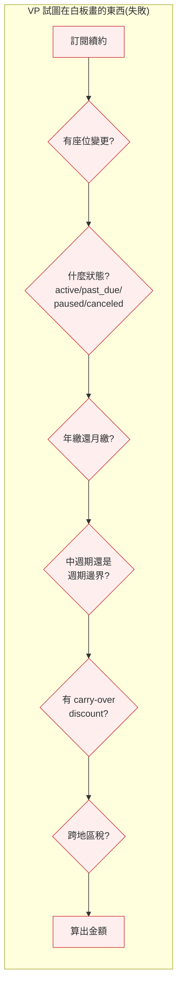
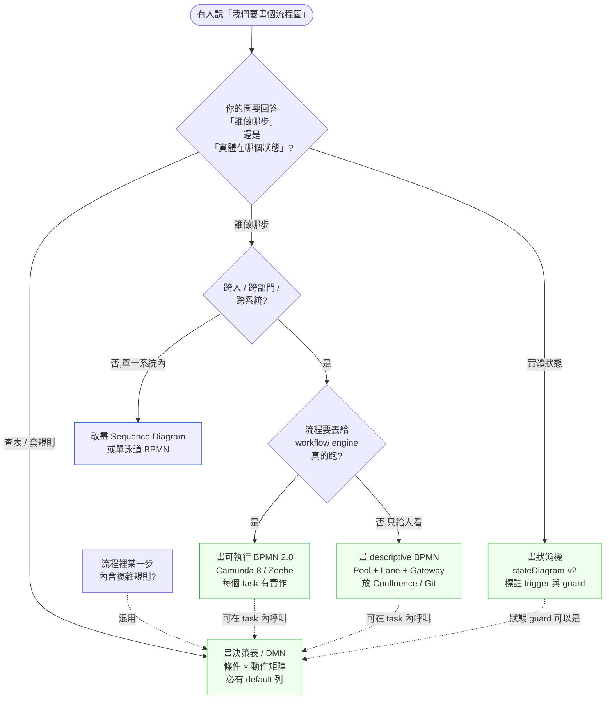
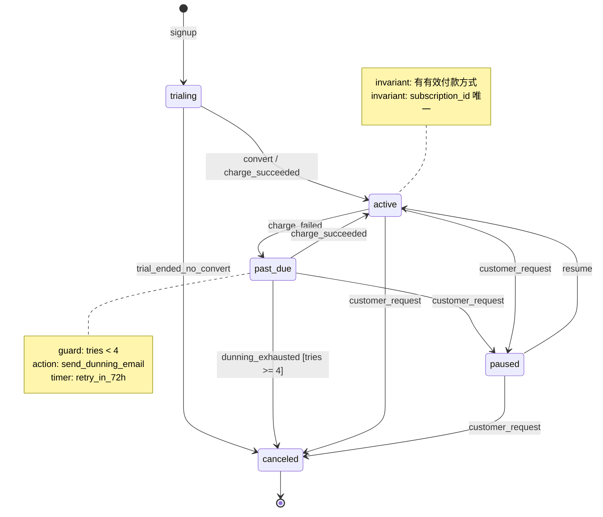

# 第 9 章|流程模型
## ⸺ BPMN、狀態機、決策表三層分工

> **前置閱讀**:[Ch 7 用例與業務流程](./ch-07-object-oriented-analysis.md)、[Ch 8 資料模型](./ch-08-data-modeling-normalization.md)
> **下游章節**:[Ch 10 NFR 與品質情境](./ch-10-spec-documents.md)、[Ch 23 Event-Driven 與事件溯源](../part-04-architecture/ch-23-event-driven-cqrs-es.md)、[Ch 39 Multi-Agent 系統設計](../part-07-ai-era/ch-40-multi-agent.md)
> **延伸補章**:[Ch 40 共識/狀態/衝突](../part-07-ai-era/ch-41-multi-agent-consensus.md)

---

## 9.1 冷觀察 ⸺ 一通客服電話、三小時、七個 service 的計費迷宮

我在 2026 年第一季看過一個案例。

虛構 B2B 訂閱與計費 SaaS **LedgerPilot**(`CASE-SAS-002`),為中型 SaaS 廠商提供白標化的訂閱、計費、發票與營收確認服務。客戶數約 4,200,MRR 大約 940 萬美元,工程團隊 38 人。產品上線三年,累積到「跨 7 個 service 處理一筆續約」的拓樸 ⸺ Subscription、Pricing、Proration、Invoice、Tax、Dunning、Webhook 各一個 service,中間以事件相連。

那天禮拜二早上,客服收到一通電話。客戶的計費月結單上多了 42.13 美元。

> 「我這個月明明只升級了一個座位,為什麼多算 $42?」

客服打開後台,看到一筆 line item 寫著 `Proration adjustment for plan change`。她要回答客戶這 $42 怎麼算出來的,於是去問計費團隊。計費團隊的工程師打開 Pricing service 的 log,看到計算發生在 Proration service。Proration service 的 log 顯示套用了一條規則叫 `mid-cycle-tier-upgrade-with-discount-carryover`。這條規則寫在 Subscription service 的一個 JSON config 裡 ⸺ 但只有一半,另一半在 Tax service 的程式碼裡硬寫死。

三個小時後,他們找到了答案:客戶的訂閱在第 14 天從 Pro 升級到 Business,系統按照「年繳折扣 carry-over + 中週期 proration + 第二地區稅率重算」三條規則疊加,算出 $42.13。三個小時不是查資料的時間,**是「規則散在 7 個地方,沒人能一次說清楚整個流程」的時間**。

那天的事故覆盤上,VP Engineering 在白板寫了一張圖 ⸺ 想把整個續約流程畫出來,卻在第 25 分鐘把整張白板擦掉重來。



這張圖混了三件事:**跨服務的工作流**(誰呼叫誰、誰發事件給誰)、**訂閱實體的狀態轉移**(active 怎麼變 past_due)、**計費規則矩陣**(哪些條件組合套哪條費率)。三件事疊在同一張流程圖,結果就是沒有一件事被講清楚。

CTO 在會議結尾說了一句被原樣記下來的話:

> 「我們有規則,但我們沒有圖。或者我們有圖,但圖把所有東西畫成同一層,結果跟沒有差不多。」

客戶那 $42.13 後來退了。但 LedgerPilot 那一季因為「規則查無可查」拖出來的客服 escalation 共 71 件,吃掉客服工時 318 小時,還丟了兩個續約合約。

---

## 9.2 真問題 ⸺ 流程不是一張圖,是三個層次的圖

把 LedgerPilot 的事拆開來看,VP 那張白板畫不出來不是技藝的問題,是**他在嘗試用一張圖回答三個本質不同的問題**。流程模型在現場常被當成單一工具(畫個流程圖就好),但 2026 年的系統流程其實活在三個不同的層次,各自要不同的表達語言。

### 9.2.1 三層流程的概念

把流程切成三層之後,每一層的表達工具就會自己浮出來:

| 層次 | 描述什麼 | 主要讀者 | 推薦工具 |
|---|---|---|---|
| **編排層(Orchestration)** | 跨人 / 跨系統的工作流;誰做哪步、誰把訊息傳給誰 | 業務 PM、客服、營運、外部稽核 | **BPMN 2.0** |
| **生命週期層(Lifecycle)** | 單一實體(訂閱、工單、退款)的狀態如何隨事件轉移 | 工程師、QA、客服訓練 | **狀態機(State Machine)** |
| **規則層(Rules)** | 局部的 if-then 矩陣;條件組合對應動作 | 計費分析師、產品、合規 | **決策表(Decision Table)/ DMN** |

LedgerPilot 那筆 $42.13 的旅程,其實同時穿過三層:

- **編排層**:Subscription 收到 plan-change 事件 → 通知 Proration → Proration 算完通知 Invoice → Invoice 通知 Tax → Tax 回算後 Invoice 出單。
- **生命週期層**:訂閱本身從 `active` 沒變(只是 plan tier 升級),但當期 invoice 從 `draft` → `pending` → `posted`。
- **規則層**:`mid-cycle-tier-upgrade-with-discount-carryover` 這條,是「升級時間 × 計費週期 × 折扣是否 carry-over × 是否跨稅區」四維條件矩陣的其中一格。

VP 在白板畫的圖之所以會失敗,是因為他想把這三層**疊在同一張**上。而在現場常見到的另一種失敗,長相不一樣但根因同一個 ⸺ 把規則層用 BPMN gateway 的「菱形」一格一格畫,結果一個續約流程要 60 個菱形,沒人讀得完。

### 9.2.2 為什麼把三層畫在同一張會讓所有人都看不懂

三層的「時間性」不一樣,這件事一旦混合,讀者的腦袋就會打結。

| 層次 | 時間關係 | 線性 / 週期 | 範例 |
|---|---|---|---|
| 編排層 | **事件時序**:誰先誰後、順序不可顛倒 | 通常線性、有分支 | 「Subscription 必須先 emit 事件,Proration 才能算」 |
| 生命週期層 | **狀態遷移**:取決於事件,不一定線性 | 可循環、可回溯 | `active` → `past_due` → `active`(補繳後) |
| 規則層 | **無時間順序性**,但可含時間謂詞(temporal predicates) | 純條件對應 | 如果 `billing_cycle = '年繳'` AND `upgrade_day` 在週期邊界 ± 30 天內,則 skip proration → 純條件評估,不涉及誰先誰後的編排 |

三者的核心差異在於:**編排層**管的是「事件之間的先後順序」(誰觸發誰);**規則層**管的是「給定一組條件時套哪條邏輯」。這兩件事常被混淆,是因為規則裡確實可以包含時間謂詞 ⸺ `upgrade_day` 落在中週期、帳期距今 < 30 天、年繳週期邊界 ± 7 天,這些**都是規則層的合法輸入條件**。規則層「無時間順序性」的意思是:它不編排「先做 A 再做 B」的事件序列,而是在**當下這一瞬間**用一組快照條件查表得出答案。

換句話說,把規則層塞進編排層,讀者會以為「規則是流程的一個步驟,要等上一步做完才能跑」⸺ 但規則其實是編排層的某一步**呼叫的查表**,查表本身不在乎它被呼叫的前後有哪些事件。把循環性的狀態機畫進線性的 BPMN,讀者會以為「狀態回到 active 是個 bug」⸺ 但其實是業務正常路徑。

換句話說,BPMN / 狀態機 / 決策表**不是替代關係,是三個不同層次的圖**。混用三者是會用三者;三者各自的力量在於精準描述自己擅長的層次。

### 9.2.3 那 Event Storming 在哪一層?

Alberto Brandolini 在 2013 年提出的 Event Storming [^CIT-093],常被拿來跟 BPMN 比較,但兩者其實在不同階段:

- **Event Storming**:**從大圖到工作流的橋樑**。一群人(業務 + 工程 + 設計)貼便利貼,把領域內的「事件(過去式動詞)」全部攤開,再找出聚合根、命令、政策。它是**探索期**的工具。
- **BPMN**:當你已經知道哪些事件、哪些參與者、哪些步驟之後,把它**正式表達**給後續維運、合規、稽核看的工具。它是**沉澱期**的工具。

Event Storming → BPMN / 狀態機 / 決策表,是一條從「我們對問題有共識」到「我們對表達有共識」的路。前者用便利貼,後者用版本控制。

---

## 9.3 決策框架 ⸺ 這次該畫哪一層?

### 9.3.1 三層工具的適用情境對照

下面這張表在會議桌上很好用 ⸺ 當有人說「我們要畫流程」,先問一句「你想回答哪個問題」,再對照下面這張表決定畫哪層。

| 當你想回答的問題 | 該畫的層 | 推薦工具 | 不該用什麼 |
|---|---|---|---|
| 一筆訂單 / 一張發票從 A 部門走到 B 部門,中間誰負責什麼? | 編排層 | BPMN(Pool / Lane / Task / Gateway) | 不該用狀態機(沒有泳道) |
| 一個訂閱 / 工單 / 退款,生命週期裡會經過哪些狀態? | 生命週期層 | 狀態機(stateDiagram-v2) | 不該用 BPMN(線性圖會藏掉循環) |
| 給定一組條件,系統該套哪一條規則? | 規則層 | 決策表 / DMN | 不該用 BPMN gateway 串菱形 |
| 我們對這個領域到底有沒有共識? | 探索期 | Event Storming | 不該直接跳 BPMN |
| 流程跨系統,要丟給 Camunda / Zeebe 真的執行 | 編排層 + 規則層 | BPMN 2.0(可執行子集) + DMN | 不該畫成圖片貼 PPT |

LedgerPilot 那塊白板犯的錯,**不是工具選錯,是沒先問「我要回答哪個問題」就開始畫**。

### 9.3.2 一張決策樹:這次該畫哪層



這張圖的關鍵不是分支,**是「混用而非疊圖」**。BPMN 的某個 Task 可以「呼叫」一張決策表,狀態機的某個 transition guard 可以是一組決策表規則 ⸺ 但它們仍然是三張獨立的圖,版本各自獨立、讀者各自獨立。

### 9.3.3 BPMN 2.0 ⸺ 編排層的事實標準

BPMN 2.0 由 OMG 在 2011 年正式發佈,目前廣泛採用 [^CIT-090]。它的核心元素少而精,現場用熟下面六樣已經夠覆蓋八成場景:

| 元素 | 視覺 | 在 LedgerPilot 案例對應 |
|---|---|---|
| **Pool / Lane(泳道)** | 矩形容器,內含並列 lane | Pool = LedgerPilot;Lane = Subscription / Proration / Invoice / Tax |
| **Task** | 圓角矩形(可標 user / service / send / receive) | 「計算 proration」「發 invoice」「呼叫 Stripe」 |
| **Gateway(閘道)** | 菱形(Exclusive / Parallel / Inclusive) | 「是否中週期變更」、「是否跨稅區」 |
| **Event** | 圓圈(Start / Intermediate / End;Timer / Message / Error) | 「收到 plan-change 訊息」、「14 天 dunning timer」 |
| **Sequence Flow** | 實線箭頭(同 pool 內) | 「Proration → Invoice」 |
| **Message Flow** | 虛線箭頭(跨 pool) | 「LedgerPilot → Stripe」 |

> **要注意的是 sequence vs message flow 的差別**:同一個 pool 內(同一個組織 / 同一個系統的內部編排)用實線;跨 pool(跨組織 / 跨系統的訊息)用虛線。把這兩條線畫錯,會讓讀者誤判邊界。

BPMN 2.0 還有一個常被忽略的好處:它有**可執行子集**。Camunda 8 / Zeebe [^CIT-094] 直接吃 BPMN XML 當作工作流定義,讓「畫的圖」與「跑的圖」是同一份。SAP Signavio、Bonita、bpmn-js(開源 BPMN 編輯器)各家工具的 XML 互通。**圖即是執行**這件事是 BPMN 跟一般流程圖最大的差別。

### 9.3.4 狀態機 ⸺ Mealy vs Moore 的差別

狀態機的兩種主流形式,在 1955 年就被定義了,但很多工程師沒分清楚:

| 維度 | **Mealy 機** | **Moore 機** |
|---|---|---|
| **輸出來自** | 狀態 + 輸入(transition 上) | 純狀態(state 上) |
| **典型表達** | UML state diagram、XState | 古典電路設計、簡單生命週期 |
| **狀態數** | 較少(同一狀態可有多種輸出) | 較多(每種輸出要有自己的狀態) |
| **適合** | 業務系統(訂閱、工單、退款) | 硬體、協定握手 |
| **比喻** | 「進門時走哪扇,看你拿什麼鑰匙」 | 「進門後要做什麼,看你站在哪個房間」 |

David Harel 1987 年提出的 **Statecharts** [^CIT-095] 在 Mealy 的基礎上加了階層、並行、歷史(history),被 UML 採納為 state diagram 的底,也是 XState [^CIT-096] 的理論基礎。

LedgerPilot 的訂閱狀態機,寫成 Mealy + Statechart 風格大概像這樣:



這張圖回答的是「訂閱實體本身的生命週期」,**不關心**誰呼叫誰、不關心稅率怎麼算 ⸺ 它只關心「在 `past_due` 狀態下,收到 `charge_succeeded` 事件時,我要轉到哪、做什麼動作」。BPMN 不擅長畫這個(它的 sequence flow 不該回頭),狀態機才是合適工具。

### 9.3.5 決策表 ⸺ 規則層的精準語言

決策表(Decision Table)是把「條件 × 動作」攤平的二維矩陣,DMN(Decision Model and Notation)[^CIT-091] 是 OMG 在 2014 年發佈的標準化版本,可以跟 BPMN 在同一張流程裡呼叫。

LedgerPilot 那條惹禍的「中週期 tier 升級」規則,寫成決策表會變成這樣 ⸺ **這也是本章硬規要求的「決策表本身」範例**:

| 規則編號 | 計費週期 | 變更時間點 | 折扣是否 carry-over | 跨稅區? | → | 動作 |
|---|---|---|---|---|---|---|
| R-01 | 月繳 | 週期邊界 | 不適用 | 否 | → | 套新方案 full price,不 prorate |
| R-02 | 月繳 | 週期邊界 | 不適用 | 是 | → | 套新方案 full price + 重算稅 |
| R-03 | 月繳 | 中週期 | 否 | 否 | → | Proration:剩餘天數 × 差額 |
| R-04 | 月繳 | 中週期 | 否 | 是 | → | Proration + 第二稅區重算 |
| R-05 | 年繳 | 週期邊界 | 是 | 否 | → | 套新方案 + 折扣 carry-over |
| R-06 | 年繳 | 中週期 | 是 | 否 | → | Proration 年度差額 + 折扣 carry-over |
| R-07 | 年繳 | 中週期 | 是 | 是 | → | Proration 年度差額 + 折扣 carry-over + 重算稅(LedgerPilot 那 $42.13 套的就是這條) |
| R-08 | 年繳 | 中週期 | 否 | 任意 | → | 升級從下個年度才生效(避開 carry-over 爭議) |
| **DEFAULT** | * | * | * | * | → | **拒絕變更,丟到人工審核佇列** |

這張表的關鍵不是它有多少行,**是最後那一行 DEFAULT**。沒有 default 的決策表,等於沒有把矩陣畫完整 ⸺ 一旦條件組合落到表外,系統會走未定義行為。LedgerPilot 那一季 71 件 escalation,有 12 件就是因為條件組合沒被決策表涵蓋,走到「沒人寫過的那一格」。

決策表跟規則引擎(Drools、Camunda DMN runtime、open-policy-agent)接得起來,讓表本身是 source of truth,不在工程師的腦子裡、也不在 PR 的 review comment 裡。

### 9.3.6 與 RPA 的對話

RPA(Robotic Process Automation)在 2015–2020 年熱潮中,常被當成 BPMN 的替代品 ⸺「不用畫圖,直接錄製滑鼠就能跑」。但 2026 年回頭看,RPA 解決的是**沒有 API 的舊系統的整合**,而不是流程本身的設計。

把 RPA 當 BPMN 用的後果現場常見:錄了 200 個流程,每個都依賴某個 UI 的座標。前端改版一次,200 個流程全壞。這跟「BPMN 寫對了就能換 runtime」是兩個世界。**RPA 是 BPMN 的最末端 task 層的執行手段之一,不是它的替代品**。

---

## 9.4 踩坑清單

下面四個反模式在做流程建模的團隊裡反覆出現。它們的共同點是**外觀像在做流程圖,實質上沒有把任一層畫清楚**。每一個都附修正方向。

### 反模式 1:BPMN 畫得像流程圖(沒有 swimlane / 沒有 gateway)

「我們有 BPMN 啊」,打開一看是一條從上到下的箭頭,中間都是矩形 task,沒有 pool、沒有 lane、沒有菱形 gateway。這其實只是個 flowchart 套了 BPMN 的圖示而已 ⸺ **它沒有回答 BPMN 唯一擅長的那件事:誰負責哪步**。

> ✅ **修正方向**:每張 BPMN 至少有 1 個 Pool、≥ 2 個 Lane,以及 ≥ 1 個 Gateway。如果整個流程畫出來只有一條直線、沒有分支、沒有跨角色,那它根本不需要用 BPMN ⸺ 改用 sequence diagram 或一條 prose 描述就夠了。BPMN 的價值在 swimlane 與 gateway,沒有用到這兩樣等於穿了西裝去跑馬拉松。

### 反模式 2:狀態機只畫 happy path(忽略錯誤、超時、外部事件)

訂閱狀態機畫了 `trialing → active → canceled`,看起來很乾淨。等到生產環境第一個禮拜,出現了三十種圖上沒有的轉換:`active → past_due`(信用卡過期)、`past_due → paused`(客戶申請暫停催收)、`canceled → active`(客服手動恢復)、`active → trialing`(客戶從 paid 退回 trial 來重新評估)⸺ 每一個都沒畫,每一個都有人寫了 if 在 code 裡偷偷實作。

> ✅ **修正方向**:畫狀態機時,逐個狀態問三個問題:**(a)**這個狀態下會接收哪些外部事件?**(b)**這個狀態會不會超時?超時做什麼?**(c)**這個狀態下系統會主動做什麼動作?三個問題不答完,圖不算畫完。LedgerPilot 那張 `past_due` 狀態的 timer + dunning_email + tries 計數,就是這三個問題逼出來的。

### 反模式 3:決策表沒寫 default(矩陣不完整)

寫了一張漂亮的決策表,12 條規則,涵蓋了 PM 想得到的所有情境。三個月後發現有 7 條客訴,落在 PM 沒想到的條件組合裡 ⸺ 系統當時走的是「沒有 match 任一條」的隱式行為,可能是丟 exception、可能是走預設值,反正沒人寫過那一格。

> ✅ **修正方向**:每張決策表強制最後一列是 **DEFAULT**(條件全部 wildcard,動作明確寫「拒絕 / 走人工審核 / 套保守值」)。決策表沒 default 不算寫完,跟 try 沒 catch 一樣 ⸺ 例外不會消失,只會在你看不到的地方爆炸。DMN 標準有 hit policy(`UNIQUE` / `FIRST` / `PRIORITY` / `ANY` / `COLLECT`),選一個明確標出來,讓 reviewer 知道規則重複時系統會挑哪條。

### 反模式 4:引入 Camunda 卻只用來做工作流可視化(沒接 BPMN runtime)

買了 Camunda 8 的 license,工程主管在董事會 demo 投影片秀了一張 BPMN 圖,獲得「我們導入了 BPM 平台」的肯定。實際上 BPMN 圖只是 Camunda Modeler 畫出來的 PNG,真實流程仍然散在 7 個 service 的 if-else 裡,Zeebe 沒裝、workflow engine 沒接、決策表沒 deploy。圖是一回事,系統是另一回事 ⸺ LedgerPilot 第一季就是這個狀態。

> ✅ **修正方向**:導入 BPMN 平台時,先選**一個**最痛的流程(LedgerPilot 選的是「續約 + plan-change」),把它從圖一路接到 runtime:BPMN XML deploy 到 Zeebe、每個 service task 有對應的 worker、決策表 deploy 到 DMN engine、執行紀錄能在 Operate / Tasklist 看到。一個流程跑通,其他流程才有複製範本可用。「畫得很漂亮但沒接 runtime」是最常見、也是最浪費 license 費用的反模式。

---

## 9.5 交付清單 ⸺ 一頁式 Process Model Triage Card

每次有人在會議桌上提「我們要畫個流程」,**第一份要產出的不是圖,是 Process Model Triage Card**。它是一頁 Markdown,逼出三個答案:這個流程屬於哪一層 / 該畫哪張圖 / 圖怎麼版本控制。

把它存在 `docs/process-models/triage-{slug}.md`,跟程式碼同 repo,每張圖都有對應一張 triage card。

````markdown
# Process Model Triage Card — {流程名稱}

> 版本:v0.2 | 最近更新:YYYY-MM-DD | 擁有人:{PM / SA 名字}
> 對齊:System Charter v0.x、ADR-XXXX

## 1. 我們要回答的問題(一句話)

{範例:「客戶從 Pro 升級到 Business 時,系統如何算出當期應補金額?」}

## 2. 這個流程屬於哪一層?(勾一個或多個)

- [ ] 編排層(跨人 / 跨系統)→ 畫 BPMN
- [ ] 生命週期層(實體狀態轉移)→ 畫 State Machine
- [ ] 規則層(條件 → 動作矩陣)→ 畫 Decision Table / DMN
- [ ] 探索期(對問題還沒共識)→ 先做 Event Storming,本卡延後

> 多選時,每一層獨立畫一張圖,不要疊在一起。

## 3. 該畫哪張圖

| 層 | 圖檔位置 | 工具 | 是否接 runtime |
|---|---|---|---|
| 編排 | `docs/process-models/bpmn/{slug}.bpmn` | bpmn-js / Camunda Modeler | 是 / 否 |
| 生命週期 | `docs/process-models/state/{slug}.mmd` | Mermaid stateDiagram-v2 / XState | 是 / 否 |
| 規則 | `docs/process-models/dmn/{slug}.dmn` | DMN Modeler | 是 / 否 |

## 4. 圖的版本控制與更新責任

- **存放位置**:`docs/process-models/{layer}/{slug}.*`(跟 repo 同步)
- **更新頻率**:跟程式碼同 commit;跨 service 流程變更必須同 PR 更新
- **PR 強制檢查**:當 `services/{subscription,proration,invoice}/**` 有變更時,本圖必須一起更新或在 PR 描述聲明「本次變更不影響流程」
- **過期偵測**:每季一次 walkthrough,逐張 triage card 重讀,過期者標記 `status: stale`

## 5. 由誰更新

| 角色 | 負責的層 | 副手 |
|---|---|---|
| PM | 編排層(寫業務語意) | SA |
| SA | 編排層的可執行子集 + 生命週期層 | RD |
| RD | 生命週期層實作對應 + DMN engine 接線 | SA |
| 計費分析師 / 合規 | 規則層(決策表內容) | PM |

## 6. 出口條件(Definition of Done)

- [ ] 三層的圖至少在「需要的層」上各有一張,沒有把三層疊在同一張
- [ ] 狀態機每個狀態都答過「外部事件 / 超時 / 主動動作」三題
- [ ] 決策表有 DEFAULT 列、有明確 hit policy
- [ ] BPMN 至少有 Pool、Lane、Gateway,不是把 flowchart 套 BPMN 圖示
- [ ] 圖檔放進 repo、PR template 要求同步更新
````

**為什麼是一頁?** 一頁的篇幅會逼出選擇 ⸺ 你不可能把三層全勾還能寫得下。寫得下,就代表你已經做了「這次該畫哪層」的決定。

**為什麼要寫「圖檔位置」與「PR 強制檢查」?** 沒有 PR 鉤子的圖,跟沒有的圖差不多。LedgerPilot 那張 7 個 service 的迷宮,**不是沒有人畫過,是那張圖 14 個月沒被更新過**。圖檔進 repo、PR 強制檢查更新、季度 walkthrough 標記 stale ⸺ 三件小事讓圖活著。

**為什麼要分清「由誰更新」?** 三層各有專屬讀者:編排層給業務看、生命週期給工程看、規則層給計費分析師與合規看。寫進 triage card 之前,常見的失敗是「全部都是 PM 的責任」⸺ 結果 PM 寫不動規則層的數字、SA 寫不動編排層的業務語意,圖年久失修。

### 9.5.1 範例:LedgerPilot $42.13 客訴後第一張 triage card

那場 3 小時跨 7 個 service 的查找之後,VP Engineering 把白板擦掉的那張圖,第三週重新畫成下面這張 ⸺ 不是試圖一次畫完,而是先承認「升級 proration」這件事屬於哪一層、由誰維護。

````markdown
# Process Model Triage Card — mid-cycle plan upgrade proration

> 版本:v0.2 | 最近更新:2026-02-19 | 擁有人:Yuan(SA),副:Hsin(PM)
> 對齊:System Charter v0.4、ADR-0031(proration 規則層獨立)

## 1. 我們要回答的問題(一句話)

「客戶從 Pro 升級到 Business 時,系統如何算出當期應補金額?」
⸺ Q1 客服 escalation 71 件,318 工時都在回答這題。

## 2. 這個流程屬於哪一層?(勾一個或多個)
<!-- 為什麼這欄:VP 第一次畫白板把三層疊在一起就是這欄沒勾過;
     一張卡多選代表後面要交三張圖,而不是一張更大的圖。 -->
- [x] 編排層(Subscription → Proration → Invoice → Tax)→ BPMN
- [x] 生命週期層(invoice: draft → pending → posted)→ State Machine
- [x] 規則層(`mid-cycle-tier-upgrade-with-discount-carryover`)→ DMN
- [ ] 探索期 ⸺ 已經有共識,只是散在七個 service

## 3. 該畫哪張圖

| 層 | 圖檔位置 | 工具 | 接 runtime |
|---|---|---|---|
| 編排 | `docs/process-models/bpmn/proration-orchestration.bpmn` | Camunda Modeler | 否(只描述) |
| 生命週期 | `docs/process-models/state/invoice-lifecycle.mmd` | Mermaid + XState | 是(XState 守) |
| 規則 | `docs/process-models/dmn/proration-rules.dmn` | DMN Modeler | **是**(DMN engine) |

## 4. 圖的版本控制與更新責任
<!-- 為什麼這欄:沒 PR 鉤子的圖跟沒有差不多;
     LedgerPilot 那張 7-service 圖 14 個月沒被更新過,就是這欄沒寫。 -->
- 存放位置:`docs/process-models/{layer}/proration*.{bpmn,mmd,dmn}`
- 更新觸發:`services/{subscription,proration,invoice,tax}/**` 變更
- PR 強制檢查:CODEOWNERS + danger.js 規則,未更新圖 PR block

## 5. 由誰更新
<!-- 為什麼這欄:過去這條規則散在 7 個 service,因為沒人為「規則層」具名負責;
     寫名字進來,規則就有家。 -->
| 角色 | 負責的層 | 副手 |
|---|---|---|
| Hsin(PM) | 編排層業務語意 | Yuan(SA) |
| Yuan(SA) | 編排層可執行子集 + invoice 生命週期 | Lin(RD) |
| Lin(RD) | 生命週期實作 + DMN engine 接線 | Yuan |
| **Mei(計費分析師)** | **規則層 DMN 表內容** | Hsin |

## 6. 出口條件
- [x] 三層獨立各一張圖,不疊在 BPMN gateway 裡
- [x] invoice 狀態機每個狀態答完「外部事件 / 超時 / 主動」
- [x] DMN 表有 DEFAULT 列、hit policy = UNIQUE
- [x] PR template 強制同步更新
````

寫完這張卡之後,Mei 第一次以「規則層 owner」身份出現在 PR reviewer 名單上 ⸺ **規則散在七個 service 的代價,從來不是技術債,是沒人為那一層具名。**

---

## 9.6 本章交付清單 Recap

讀完本章,你應該已經能做到:

- [ ] 在會議桌上分得出「編排 / 生命週期 / 規則」三層的差別,並能在五分鐘內判斷一個流程該用哪張圖
- [ ] 用 BPMN 2.0 的核心元素(Pool / Lane / Task / Gateway / Event / Sequence vs Message Flow)畫出一個跨服務的工作流,不退化成 flowchart
- [ ] 認得出 Mealy vs Moore 的差別,並能用 statechart 加層級 / guard / timer 把「happy path 以外」的轉移補完
- [ ] 為手上正在畫的流程寫一份 Process Model Triage Card(放 `docs/process-models/triage-{slug}.md`)

四項中先挑一項做完就好,建議是最後那一項 ⸺ 把手上最痛的流程開一張 triage card,逼自己先回答「該畫哪層」,再往下讀 [Ch 10 NFR](./ch-10-spec-documents.md)。本章留給你的就是那三層的分工。

---

## Cross-References

- **下一章**:[Ch 10 NFR 與品質情境](./ch-10-spec-documents.md) ⸺ 把流程模型的 NFR(吞吐、延遲、可用性)分離出來
- **事件驅動架構**:[Ch 23 Event-Driven 與事件溯源](../part-04-architecture/ch-23-event-driven-cqrs-es.md) ⸺ 編排層落到事件總線時的設計
- **多 Agent 協作流程**:[Ch 39 Multi-Agent 系統設計](../part-07-ai-era/ch-40-multi-agent.md)
- **Multi-Agent 共識與衝突**:[Ch 40](../part-07-ai-era/ch-41-multi-agent-consensus.md) ⸺ Agent 之間的流程編排與狀態同步

## 引用

[^CIT-090]: OMG, *Business Process Model and Notation (BPMN) Version 2.0.2* (2014–2024 維護版本)。omg.org/spec/BPMN。BPMN 2.0 核心元素與可執行子集規範來源。
[^CIT-091]: OMG, *Decision Model and Notation (DMN) Version 1.4* (2022)。omg.org/spec/DMN。決策表 hit policy 與 FEEL 表達式。
[^CIT-092]: 預留(本章未引用,留作下游章節擴充用)。
[^CIT-093]: Alberto Brandolini, *Introducing EventStorming* (Leanpub, 2021,持續更新)。Event Storming 方法學原典。
[^CIT-094]: Camunda, *BPMN 2.0 Symbols Reference* 與 *Zeebe Workflow Engine Documentation*。docs.camunda.io。
[^CIT-095]: David Harel, "Statecharts: A Visual Formalism for Complex Systems" (*Science of Computer Programming*, Vol. 8, Issue 3, 1987)。Statechart 加入階層、並行、歷史的原始論文。
[^CIT-096]: Statelyai, *XState Documentation*。stately.ai/docs。在 JavaScript / TypeScript 生態落實 statechart 的代表工具。

---
