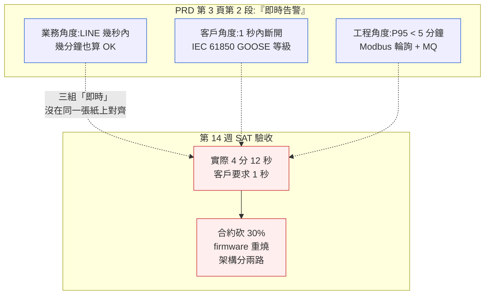
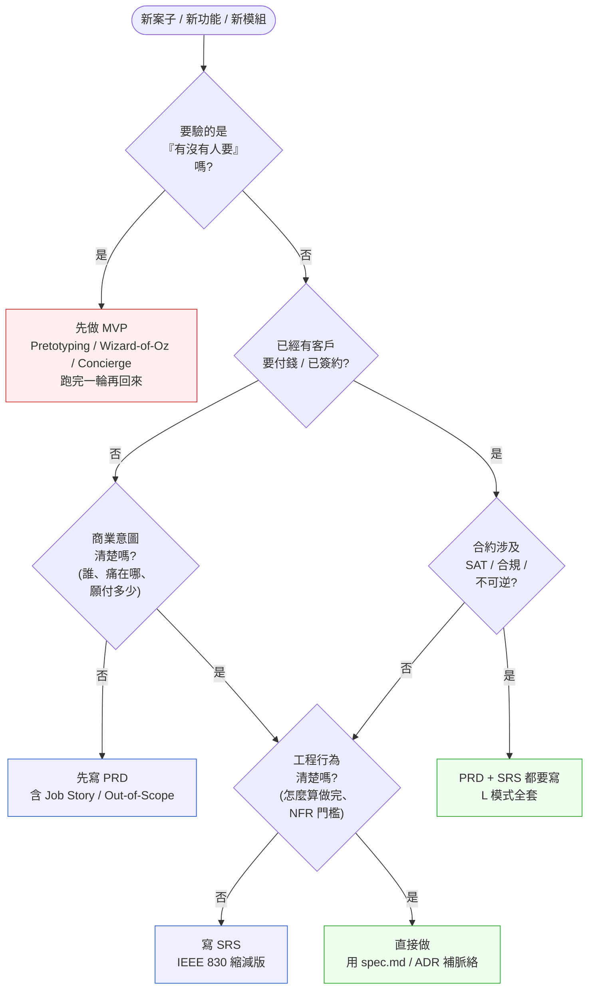
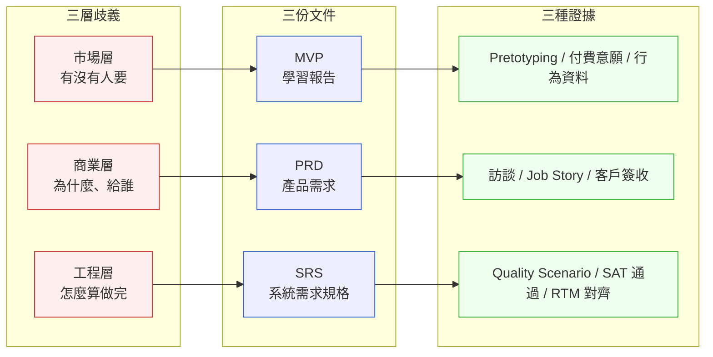

# 第 10 章|規格文件
## ⸺ PRD、SRS、MVP 三者壓縮不同層次的歧義

> **前置閱讀**:[Ch 4 需求工程基礎](../part-01-foundations/ch-04-requirements-engineering.md)、[Ch 9 用例與業務流程](./ch-09-process-modeling.md)
> **下游章節**:[Ch 11 設計起手](../part-03-design/ch-11-architecture-principles.md)、[Ch 17 DDD 戰術設計](../part-04-architecture/ch-17-ddd-strategic-tactical.md)、[Ch 34 Context-Driven Engineering](../part-07-ai-era/ch-34-context-driven-engineering.md)
> **延伸補章**:[補章 A 邊緣 / OT-IT 整合](../part-04-architecture/chA-edge-ot-it.md)

---

## 10.1 冷觀察 ⸺ 「即時」這兩個字,差了 30% 預算

我在 2025 年下半年看過一個案例。

虛構工商儲能新創 **VoltMesh Energy**(`CASE-ENR-002`),做 1MW/2MWh 等級的工商儲能櫃 + 自家 EMS(Energy Management System)。團隊 23 人:6 個硬體、9 個軟體、2 個電力工程師、3 個業務、3 個 PM 兼營運。客戶是中部一家紡織印染廠,合約金額約新台幣 4,800 萬,EMS 軟體佔 480 萬。PRD 第 3 頁第 2 段寫了一行字:

> 「系統需提供異常事件的即時告警(Real-time Alert),包含電池過溫、PCS 故障、SOC 異常、契約容量超限。」

PM 寫這句話時,腦袋裡的「即時」是「客戶 LINE 群幾秒鐘內收到通知」。客戶讀這句話時,腦袋裡的「即時」是「過溫的當下立刻斷開,不能讓電池燒起來」⸺ 也就是 **1 秒以內、走 IEC 61850 GOOSE 等級的反應**。工程團隊讀這句話時,腦袋裡的「即時」是「Modbus TCP 輪詢 + 訊息佇列 + 推播服務,**P95 < 5 分鐘**」⸺ 因為內部架構是 EMS 雲端側做聚合,5 分鐘是排程粒度。

這三個「即時」沒有一個是錯的。錯的是它們從來沒有在同一張紙上對齊過。

第 14 週工廠驗收(SAT, Site Acceptance Test),客戶帶了一支 OTDR 等級的紅外線溫度槍,故意把模組 2 號電池堆貼一塊暖暖包讓它升到 48°C。LINE 群 4 分 12 秒後跳出告警。客戶問了一句話,當時被現場業務原樣記下來:

> 「四分鐘?如果這四分鐘是熱失控的開始呢?保險公司會問我這四分鐘你們做了什麼。」

合約被砍 30%,PCS 同步邏輯整批 firmware 重燒,EMS 雲端那層被改成 **本地 PLC 邊緣告警 + 雲端聚合分離兩條路徑**。重做的工時比第一次做還多 1.4 倍。內部覆盤會,CTO 在白板上寫了一句話:

> 「我們以為在寫產品文件,實際上把工程細節塞進去;以為在寫工程文件,實際上把模糊願景塞進去。中間沒有一份文件回答『到底有沒有人要這個東西在 1 秒內反應』。」



VoltMesh 這場仗,最便宜的修法是在 PRD 寫完那天多花 30 分鐘,把「即時」三個字換成 Quality Scenario 寫死:Source 是哪個信號、Stimulus 是什麼閾值、Response Measure 是「告警送達 < N 秒、@P95、本地 vs 雲端」。30 分鐘的釐清,擋掉的是 14 週後的合約砍 30%。但這 30 分鐘永遠不會發生,**因為團隊不知道這 30 分鐘該寫進哪份文件**。

---

## 10.2 真問題 ⸺ 規格文件不是「描述要做什麼」,是「壓縮歧義」

把 VoltMesh 的事拆開來看,規格文件在現場常被誤解成兩件事:一件是「把要做的事寫下來」,一件是「上線前要交的合約附件」。聽起來像在做事,但兩件事都漏掉了文件真正在處理的工作 ⸺ **在多方理解之間做出可被追溯的收斂**。

### 10.2.1 三層歧義,不是同一種歧義

「即時告警」這四個字之所以會炸出三種理解,是因為它涉及的不是一種模糊,而是**三種模糊疊在一起**。把這三層分開看,文件就會自然分流:

| 歧義層 | 在問什麼 | 不收斂的代價 | 對應文件 |
|---|---|---|---|
| **商業層歧義** | 這個東西為什麼要做、做給誰、解什麼痛、不解的代價是什麼 | 做出來沒人要、做出來客戶不買單、做出來業務說不出價 | **PRD** |
| **工程層歧義** | 怎麼算做完、邊界在哪、效能門檻是什麼、失敗時長什麼樣 | SAT 過不了、合約被砍、運維出事沒人負責 | **SRS** |
| **市場層歧義** | 到底有沒有人要、願不願意付、付多少、用什麼節奏付 | 做了一年才發現市場不存在、PoC 不會變單 | **MVP** |

VoltMesh 的「即時告警」同時踩到三層:商業層沒人想清楚這個告警對印染廠老闆的價值是什麼(熱失控險?電費省下來?保險折扣?),工程層沒寫死秒數與路徑,市場層沒驗證印染廠願不願意為「1 秒級告警」多付 15% 預算 ⸺ 這個多付的意願如果先驗了,工程才有動力把架構分成本地 + 雲端兩條路。

換句話說,**三份文件不是寫給不同讀者看的同一件事,是處理三種不同的歧義**。把它們混在一起,就是 VoltMesh 那種結局。

### 10.2.2 PRD 與 SRS 的分界:意圖 vs 行為

PRD(Product Requirements Document)與 SRS(Software Requirements Specification)在很多公司的範本是同一份檔案改個標題。實際上它們在處理兩件不同的事:

- **PRD 的對象是市場與業務**:它要讓 sales 知道怎麼賣、讓設計知道為誰設計、讓財務知道商業模型、讓 CEO 知道為什麼這個季要做這個。它的核心是**意圖(intent)**。
- **SRS 的對象是工程與驗收**:它要讓工程知道做完長什麼樣、讓 QA 知道怎麼驗、讓硬體知道介面是什麼、讓客戶知道驗收門檻在哪。它的核心是**行為(behavior)**。

把意圖寫進 SRS,SRS 會無法被 QA 拿來打勾;把行為寫進 PRD,PRD 會在工程改架構的當週就過期。VoltMesh 的「即時告警」原本應該在 PRD 寫成「印染廠擔心熱失控,願意為 < 1 秒級告警多付 15%」,在 SRS 寫成「電池模組過溫(>= 45°C)時,本地 PLC 在 < 1 秒內觸發 GOOSE 訊號斷開接觸器,雲端 EMS 在 < 30 秒內補登事件」。兩件事分開,就不會再有人爭辯「即時是幾秒」。

### 10.2.3 MVP 不是「最小的產品」,是「最小的學習單元」

MVP(Minimum Viable Product)在現場常被翻譯成「先做最小的版本」,於是工程聽到的是「砍功能」,業務聽到的是「先賣一點」,結果做出來的東西「最小但不可用」⸺ 也就是 Eric Ries [^CIT-100] 一再強調 MVP **不是**的那種東西。

MVP 真正要處理的不是「砍規模」,而是**驗證一個假設**。這個假設通常不是「我們做得出來嗎」(那是 PoC 該回答的),而是「**有沒有人真的要**」。所以 MVP 的核心提問叫 RAT(Riskiest Assumption Test):這個產品最可能死掉的假設是哪一個?先驗那個。

VoltMesh 的最危險假設不是「我們做不做得出 1 秒級告警」⸺ 那是工程問題,給夠錢就能做。最危險假設是「印染廠老闆**真的會為了 1 秒級告警多掏錢**」。這個假設如果用一個 Pretotyping 等級的實驗(Alberto Savoia [^CIT-104])就能驗 ⸺ 拿一張紙寫兩個 SKU(基本版、熱失控險版),問三家印染廠願意買哪一個、多花多少 ⸺ 一週可以跑完。但 VoltMesh 沒有這道工序,他們直接把「1 秒級」寫進(模糊的)PRD,然後讓工程吃下整個風險。

### 10.2.4 規格文件的真正產物

把這三件事合起來,規格文件在 2026 年的真正產物,不是「我們要做什麼」的描述,而是**「我們把哪幾種歧義壓縮掉了、用什麼證據壓縮、壓不住的歧義誰簽收」**。它可以是一份 PRD + 一份 SRS + 一份 MVP 學習報告;也可以在 S 模式下退化成一份 spec.md 帶三個 section ⸺ 形式不重要,但必須能回答三個問題:

1. 這次要壓縮的是**哪一層**歧義?(商業 / 工程 / 市場)
2. 壓縮的**證據**是什麼?(訪談、Pretotyping、Quality Scenario、合約條款)
3. 壓不住的歧義由**誰簽收**?(Owner、簽核日期、重新評估時點)

少了第一個問題,就會發生 VoltMesh 那種「PRD 寫工程細節、SRS 寫商業願景」的混淆;少了第二個問題,規格寫到上線都還是「我覺得」;少了第三個問題,SAT 出事時沒人扛責,工程被砍 30%。

---

## 10.3 決策框架 ⸺ PRD vs SRS vs MVP × 該寫哪一份

### 10.3.1 三份文件對照表

下面這張表把 PRD / SRS / MVP 的差異壓在一起,實務上開新案時可以照著挑:

| 維度 | **PRD**(產品需求) | **SRS**(系統需求規格) | **MVP**(最小可行產品) |
|---|---|---|---|
| **要壓縮的歧義** | 商業層(為什麼、給誰) | 工程層(怎麼算做完) | 市場層(有沒有人要) |
| **主要讀者** | sales、設計、CEO、投資人 | 工程、QA、硬體、客戶驗收 | 創辦人、PM、早期客戶 |
| **核心格式** | User Story / Job Story / Use Case / Out-of-Scope | IEEE 830 / ISO/IEC/IEEE 29148 五大段[^CIT-101] | RAT 假設清單 + 驗證方法 |
| **驗證方式** | sales 能不能講出來、設計能不能畫出來 | QA 能不能寫測試、合約能不能驗收 | 客戶有沒有付錢 / 沒有用腳投票 |
| **失敗代價** | 做出來沒人要 | SAT 過不了、合約被砍 | 燒掉一年才發現市場不存在 |
| **生命週期** | 季度 / 年度更新 | 與 PR 同 commit、with version | 一個假設一份、跑完就歸檔 |
| **典型篇幅** | 8–20 頁 | 30–80 頁(L 模式) / 5–10 頁(M 模式) | 1 頁假設 + 1 頁實驗結果 |
| **2026 形態** | Markdown + frontmatter,可被 AI Agent 讀 | OpenAPI / AsyncAPI / Markdown SRS,機讀優先 | Pretotyping / Wizard-of-Oz / Concierge 紀錄 |

VoltMesh 那年的問題不是某一份文件做得不好,**是三份文件壓成一份在做**。23 人的團隊,只有一份 47 頁的「需求文件」,封面寫 PRD,中間是 SRS 該寫的東西,結尾是 MVP 該驗的假設,但每一段都做得不到位。

### 10.3.2 IEEE 830 / ISO/IEC/IEEE 29148 結構縮減版

SRS 的標準格式可以追到 IEEE 830-1998 [^CIT-101],2011 年由 ISO/IEC/IEEE 29148 取代,2018 改版至今。完整版有 30 個 section,現場很少團隊會全寫。下面這張表是現場可用的縮減版,從 30 個壓到 9 個:

| Section | 內容 | M 模式 | L 模式(能源 / 醫療 / 金融) |
|---|---|---|---|
| **1. Introduction** | 目的、範圍、術語、引用 | 半頁 | 完整,含合規對照 |
| **2. Overall Description** | 系統脈絡、使用者類型、運作環境、限制 | 1–2 頁 | 含 OT-IT 邊界、現場拓樸 |
| **3. External Interface Requirements** | UI / 硬體 / 軟體 / 通訊介面 | OpenAPI + AsyncAPI 連結 | + IEC 61850 / Modbus / DNP3 對照 |
| **4. Functional Requirements** | 系統做什麼,以 Use Case 或 Given/When/Then 描述 | 主流程 + 主要例外 | 全部 alternative flows |
| **5. Non-Functional Requirements** | 效能 / 可用性 / 安全 / 合規 / 可維護 | Quality Scenario × 5–10 | × 30+,含合規條款引用 |
| **6. Other Requirements** | 法遵、在地化、環境 | 通常省略 | 必填 |
| **A. Acceptance Criteria** | SAT / FAT 通過條件 | 簡表 | 完整測試矩陣 |
| **B. Traceability** | 需求 ↔ 設計 ↔ 測試對照 | RTM 連結 | 完整 RTM(嵌 git) |
| **C. Glossary & References** | 術語、外部標準引用 | 1 頁 | 完整 |

VoltMesh 應該在 M 模式縮減版 §3 把 IEC 61850 GOOSE 列入,§5 把「告警延遲 P95」拆成本地 / 雲端兩列 Quality Scenario。SRS 不是越厚越好,是**該寫的 section 不能漏**。

### 10.3.3 MVP 工具選擇 × 適用情境矩陣

MVP 在現場有四個常用工具,各自服務不同的假設類型。挑選時值得先問:**你現在要驗的假設是哪一種?**

| 工具 | 解的是什麼歧義 | 操作 | 最強場景 | 最弱場景 |
|---|---|---|---|---|
| **Pretotyping**[^CIT-104] | 「有沒有人要」(意圖層) | 不做產品,做廣告 / 假落地頁 / 假 SKU | 早期假設、低成本驗 | 已知有人要、要驗執行細節 |
| **Wizard-of-Oz** | 「自動化值不值得」 | 前台看起來自動,後台人工跑 | AI / 演算法 / 推薦類 | 高頻交易、即時控制 |
| **Concierge MVP** | 「服務流程合不合理」 | 完全人工服務早期客戶,記下流程 | B2B 客製、顧問型服務 | 大規模消費品 |
| **Build-Measure-Learn**[^CIT-100] | 「方向對不對」(方向層) | 真的做、真的賣、收行為資料 | 已過 RAT、要找 PMF | 0–1 階段、燒錢風險高 |

VoltMesh 那年該做的是**Pretotyping + Concierge 組合**:Pretotyping 驗「印染廠願不願意多付 15% 換 1 秒級告警」(三家紡織業 sales meeting,給兩張 SKU 單問願付意願),Concierge 驗「服務流程是不是這樣」(找一家先用人工 24/7 監控告警,再決定要不要寫成軟體)。兩個加起來不到三週,可以擋掉後面 14 週的工程黑洞。

### 10.3.4 一張決策樹:這次該寫哪份文件?

把上面這些壓在一起,做成一張開案會議桌上可以走完的圖:



這張圖的關鍵不是分支邏輯,**是第一個分岔**:Q1 是否在驗「有沒有人要」。VoltMesh 跳過了 Q1,直接從 Q2 進來(「客戶都簽約了」),於是把市場層歧義打包進 SRS,讓工程吃下整個風險。**Q1 跳不過,後面寫多少文件都壓不住歧義**。

### 10.3.5 三層歧義 ↔ 三份文件 ↔ 三種證據

把整章的視角壓在一張圖裡:



「歧義層 → 文件類型 → 證據類型」這三段對應,**錯位一格,後面全部歪掉**。VoltMesh 的錯位是把市場層歧義丟給 SRS 處理(Q4 之後直接 Build),於是 SRS 沒有對應的證據可以收斂。

### 10.3.6 2026 視角 ⸺ Spec-as-Prompt-Context

寫規格文件的時候,2026 年的讀者多了一位:會寫程式的 AI Agent。這對 PRD / SRS / MVP 的形態都有影響:

- **PRD 要結構化**。Front-Matter Markdown 開頭寫 `business_goal`、`target_persona`、`out_of_scope`、`success_metrics`,讓 AI Agent 拉脈絡時能拿到語義錨點,而不是靠斷句猜。
- **SRS 要機讀**。External Interface 段落用 OpenAPI 3.1(REST)、AsyncAPI 2.6(MQTT / Kafka)、Protobuf(gRPC)直接寫,**spec 檔即是 SRS 的 §3**。Functional 段落用 Given/When/Then 寫,可被 AI 直接生成測試骨架。
- **MVP 學習報告要有結論欄位**。`hypothesis`、`falsifier`、`outcome`、`decision`,讓接下來的 PRD 改版能引用「這個 RAT 已經驗過,結論是 X」。

Anthropic 從 2024 起把這個方向稱為「spec-as-context」[^CIT-105]:同一份 Markdown,人類讀為規格,AI Agent 讀為 prompt context。它在 2026 年的工具鏈裡(Claude Code、Cursor、agents.md 規範)已經是預設假設。完整論述會在 [Ch 34](../part-07-ai-era/ch-34-context-driven-engineering.md) 展開,本章先把它當成下游伏筆。

---

## 10.4 踩坑清單

下面四個反模式,在做規格文件的團隊裡反覆出現。它們的共同點是**外觀像在寫規格,實質上沒有壓縮歧義,只是把歧義從一份文件搬到另一份文件**。每一個都附修正方向。

### 反模式 1:PRD 寫成 SRS(把實作細節塞進產品文件)

PRD 寫了 60 頁,從第 4 頁開始就是「按鈕長什麼樣、欄位幾個 px、API 路徑叫什麼、資料表 schema 長怎樣」。CEO 讀不下去、sales 讀不懂、設計覺得空間被綁死、工程覺得 PRD 在搶 SRS 的工作。VoltMesh 那份 47 頁「需求文件」就是這種:第 12 頁寫「Modbus TCP 暫存器位址 40001 ~ 40016 為電池組電壓」,但前面從來沒有寫清楚「這個產品要解決印染廠的什麼問題」。

> ✅ **修正方向**:PRD 的每一節以「Why → What(行為的形狀,不是實作)→ Who(誰簽收)」三層結構寫。**Why 與 Who 是 PM 的責任,What 的『行為形狀』可以寫,但實作細節留給 SRS**。一個現場可用的篩子是:把 PRD 拿給沒參與討論的 sales 看,**他能不能用三句話講給客戶聽**。能,代表 PRD 寫對了;不能、要翻到第 12 頁的 Modbus 暫存器位址才講得清楚,代表 PRD 已經被 SRS 化。

### 反模式 2:SRS 寫成 PRD(把模糊願景寫進具體規格)

SRS 第 5 章 Functional Requirements 寫「系統應提供良好的使用者體驗」「告警機制應即時且穩定」「儀表板應直觀易用」。這幾句話不能被測試、不能被 SAT 驗收、不能被 QA 寫測試案例。等到驗收日,客戶說「這就是不直觀」,工程沒辦法回擊,因為文件這樣寫的。VoltMesh 的「即時告警」就是被這樣埋進 SRS 的。

> ✅ **修正方向**:SRS 的每一條 requirement,**強制寫成可被否證的 Quality Scenario 或 Given/When/Then**。任何包含「良好」「即時」「穩定」「直觀」「合理」「適當」的句子,在 SRS review 時直接打回。一條規則:**讀完這句話,QA 能不能寫出測試案例?寫不出來就還沒到 SRS 等級**。
>
> 例:把「告警應即時」改寫為「電池模組溫度 ≥ 45°C 時,本地 PLC 在 1 秒內(P99)觸發 IEC 61850 GOOSE 訊號至接觸器;雲端 EMS 在 30 秒內(P95)補登事件至 PostgreSQL `events` 表並推播至 LINE Notify。」⸺ 這句話 QA 拿到當天就能寫五個測試案例。

### 反模式 3:MVP 變成「最小但不可用」(誤把「最小」當「殘廢」)

「我們做 MVP」變成「我們先做一個閹割版」。用戶第一週試用就說「太爛了用不下去」,然後團隊回去做兩個月再上線,結論是「MVP 行不通」。但他們做的根本不是 MVP,是「未完成的產品」。Eric Ries 在 *The Lean Startup* 寫的 Viable 是「**能驗證一個假設**」,不是「能跑就好」[^CIT-100]。

> ✅ **修正方向**:做 MVP 之前先寫一句話:「**這次我們要驗的假設是 X,如果結果是 Y,我們就放棄/修正方向**。」這句話寫不出來,就還沒到做 MVP 的時間。Pretotyping、Wizard-of-Oz、Concierge 這些工具的存在,**就是讓你不需要做出殘廢產品也能驗假設**。VoltMesh 那一份「印染廠願不願意為 1 秒級告警多付 15%」的假設,用一張紙跑兩週就能驗,根本不用做殘廢版的告警系統去丟臉。

### 反模式 4:「最小」由工程定,不由商業定

工程說:「MVP 我們三週能做完。」於是 MVP 的範圍變成「三週能做完的功能子集」。但這個子集是不是真的能驗到市場層假設?沒人問。結果做出來的東西**做了一個沒人在乎的子集**,而真正能驗假設的功能反而被砍掉了 ⸺ 因為它「太難在三週做完」。

> ✅ **修正方向**:MVP 的範圍由「**能否驗到 RAT**」決定,不由「能否在 N 週做完」決定。如果能驗到 RAT 的最小範圍工程做不完,**修的不是範圍,是工具**:換成 Wizard-of-Oz(後台人工)、Concierge(直接人工服務)、Pretotyping(連產品都不做)。VoltMesh 那一年,如果先用 Concierge MVP(人工 24/7 監控三家試點工廠的告警)跑兩個月,他們會在還沒寫 firmware 之前就知道「客戶其實只在乎熱失控險,不在乎一般告警」⸺ 整個產品形狀會不一樣,工程量也會少一半。

---

## 10.5 交付清單 ⸺ 一頁式 Spec Triage One-Pager

每個新案 / 新功能 / 新模組開工前,在寫 PRD 或 SRS 之前,**第一份要產出的是 Spec Triage One-Pager**。它是一頁 Markdown,寫不滿一頁就是寫得不對。

它的目的不是規格本身,是回答四個問題,讓接下來該寫哪份規格自然浮出來。把它存在 `docs/specs/{feature}/triage.md`,跟程式碼同 repo,作為後續 PRD / SRS / MVP 報告的引子。

````markdown
# Spec Triage One-Pager — {案子名稱}

> 版本:v0.1 | 撰寫日期:YYYY-MM-DD | 擁有人:{PM 名字}
> 對齊:System Charter v0.1、Requirements Decision Log REQ-NNNN

## 1. 這次要壓縮的是哪一層歧義?

> 勾選一個或多個。**多個就要分別交付對應文件**,不能合成一份。

- [ ] 市場層 — 有沒有人要 / 願不願意付 → 交付 **MVP 學習報告**
- [ ] 商業層 — 為什麼做 / 給誰 / 解什麼痛 → 交付 **PRD**
- [ ] 工程層 — 怎麼算做完 / NFR 門檻 / 邊界 → 交付 **SRS**(IEEE 830 縮減版)

理由(一句話寫清楚為什麼勾這幾個):
> 例:勾市場層 + 工程層 ⸺ 客戶已簽約(商業層已收斂),但「即時告警」對客戶與工程是不同意思(工程層沒收斂),且「願多付 15% 換 1 秒級」這個假設沒驗過(市場層沒收斂)。

## 2. 待壓縮的歧義具體是什麼?

| 歧義點 | 目前的不同理解 | 不收斂的代價 |
|---|---|---|
| {例:「即時」幾秒} | 業務:幾秒 / 客戶:1 秒 / 工程:5 分鐘 | SAT 過不了、合約被砍 30% |
| | | |

## 3. 由誰簽收 / 誰簽核?

| 歧義點 | Owner | 簽核日期 | 重新評估時點 |
|---|---|---|---|
| {例:1 秒級告警的延遲門檻} | 客戶 PM(吳小姐) | YYYY-MM-DD | SAT 前一週 |
| | | | |

## 4. 如何驗收 / 證據是什麼?

| 歧義層 | 證據型態 | 具體做法 |
|---|---|---|
| 市場層 | Pretotyping 結果 / 付費意願 | 三家紡織廠 sales meeting,兩張 SKU 單問願付差距 |
| 商業層 | Job Story 客戶簽收 / Out-of-Scope 條款 | 與客戶 PM 在 PRD §2 跑 walkthrough,逐條 sign-off |
| 工程層 | Quality Scenario × N / SAT 通過矩陣 | 列 P95 / P99 數值,SAT 測試清單嵌 git |

## 5. 下一份要交付的文件 / 下一個 Gate

- [ ] 下一份交付:{PRD v0.1 / SRS v0.1 / MVP 假設清單 v0.1}
- [ ] 下一個 Gate:{日期},通過條件:{條件}
- [ ] 跳過 Gate 的代價:{代價}

## 6. 變更紀錄

- YYYY-MM-DD:新增「即時告警」歧義點,Owner = 客戶 PM。
````

**為什麼是一頁?** 一頁的篇幅會逼出選擇。十頁不會逼,三十頁反而會讓人誤以為自己在做選擇,實際上只是在描述。Triage 的工作是分流,**分流文件本身越薄越能完成它的任務**。

**為什麼是「歧義點」而不是「需求點」?** 把問題寫成「需求」會自然進到「我要做什麼」的腦子裡;寫成「歧義」會逼出「我要先收斂什麼」的腦子。同一張表,語意換一下,會議的方向就會不一樣。

**為什麼第 5 段要寫「跳過 Gate 的代價」?** 因為 PM 與工程都會有「先做再說」的衝動。把代價寫下來不是悲觀,是讓「先做再說」變成一個有價碼的決定 ⸺ 這個價碼如果有人願意付,那就先做;如果沒人願意簽名說「我願意付這個代價」,那就先收斂歧義。VoltMesh 那年,如果有人在 triage 表上寫「跳過 1 秒級驗證的代價:合約砍 30% + firmware 重燒一輪」,然後問「誰簽名同意?」⸺ 大概率沒人會簽。

---

## 10.6 本章交付清單 Recap

讀完本章,你應該已經能做到:

- [ ] 把 PRD / SRS / MVP 對應的三層歧義(商業 / 工程 / 市場)講清楚,並能在團隊會議上指出當前的混淆點是哪一層錯位
- [ ] 用 §10.3.4 的決策樹在開案會議桌上現場走完一個新案子,得出「這次該寫哪份文件」的結論
- [ ] 在會議上認得出四個反模式(PRD 寫成 SRS / SRS 寫成 PRD / MVP 變殘廢 / 最小由工程定),並有一句話的修正方向可以接著說
- [ ] 為手上的案子寫好一份 Spec Triage One-Pager(一頁,放 `docs/specs/{feature}/triage.md`)

四項中先挑一項做完就好,建議是最後那一項 ⸺ 先把 Triage 開起來,把目前手邊「需求文件」分到三層歧義,接著往下讀 [Ch 11 設計起手](../part-03-design/ch-11-architecture-principles.md)。本章留給你的就是那一頁 triage,以及一個提醒:**規格文件不是描述要做什麼,是壓縮歧義**。能源 / 硬體 / 合規場域對歧義特別敏感,因為一條規格寫錯,整批機台要重做 ⸺ 但這個敏感度,在所有產業遲早都會回來。

---

## Cross-References

- **前置 — 需求工程基礎**:[Ch 4 需求工程](../part-01-foundations/ch-04-requirements-engineering.md) ⸺ 拒絕清單與 Decision Log
- **前置 — 用例與流程**:[Ch 9 Use Case 與業務流程](./ch-09-process-modeling.md) ⸺ Functional Requirement 的敘事格式
- **下一章**:[Ch 11 設計起手](../part-03-design/ch-11-architecture-principles.md) ⸺ 從 SRS 走進設計階段
- **DDD 戰術設計**:[Ch 17 DDD Tactical](../part-04-architecture/ch-17-ddd-strategic-tactical.md) ⸺ SRS Functional 段落如何對齊到聚合根與限界脈絡
- **AI 友善 spec 完整論述**:[Ch 34 Context-Driven Engineering](../part-07-ai-era/ch-34-context-driven-engineering.md)
- **OT-IT 邊界對 SRS External Interface 的影響**:[補章 A 邊緣 / OT-IT 整合](../part-04-architecture/chA-edge-ot-it.md)

## 引用

[^CIT-100]: Eric Ries, *The Lean Startup: How Today's Entrepreneurs Use Continuous Innovation to Create Radically Successful Businesses* (Crown Business, 2011)。MVP / Build-Measure-Learn 概念原典,強調 Viable = 能驗證假設,非「能跑就好」。
[^CIT-101]: IEEE Std 830-1998, *IEEE Recommended Practice for Software Requirements Specifications*;後續被 ISO/IEC/IEEE 29148-2018 *Systems and software engineering — Life cycle processes — Requirements engineering* 取代。SRS 的 30-section 標準格式來源,本書於 Ch 4 也曾於 FR/NFR 分類脈絡引用,本章引用其於 SRS 文件結構脈絡。
[^CIT-102]: Steve Blank, *The Four Steps to the Epiphany* (K&S Ranch, 2005 / 2013 reprint)。Customer Development 方法論原典,RAT 與「先驗市場再做產品」的思想源頭。
[^CIT-103]: Marty Cagan, *Inspired: How to Create Tech Products Customers Love*, 2nd Edition (Wiley, 2017)。對 PRD 角色與「產品需求文件不是規格文件」的論述。
[^CIT-104]: Alberto Savoia, *The Right It: Why So Many Ideas Fail and How to Make Sure Yours Succeed* (HarperOne, 2019)。Pretotyping 方法論原典,強調「先驗 Right It,再驗 Build It Right」。
[^CIT-105]: Anthropic, "Building Effective Agents" (2024) 與 agents.md 規範系列脈絡(2025–2026)。spec-as-context 概念依據,將規格文件視為人類規格 + AI Agent prompt context 雙重身分。
