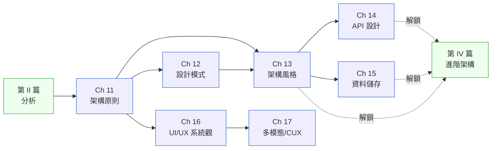

# 第 III 篇|設計基礎

> **你不是在學 SOLID 原則,你是在學怎麼估計改一條規則要動多少個檔案。**

---

AxisPay 的 Tech Lead 在白板上列出了 14 個檔案。風控分析師沒反駁,但她問了一句被截圖丟上 architecture review 頻道的話:「我寫一條規則要動十四個檔案,那 AI Agent 寫一百條規則要動多少個檔案?」

第 III 篇的六章加一個補章,教的是在**你還沒有複雜度問題之前**先把設計地基打對。SOLID 是改動半徑的成本函數。GoF 是已知問題的命名系統。架構風格是對哪種變動課稅的宣告。API 是信任邊界契約。資料儲存是 Workload Profile 的結果。UI/UX 是錯誤狀態下的決策設計。Ch 17 是當介面從螢幕變成對話時,系統分析要多回答哪些問題。

---

## 篇內章節依存圖

---

## 各章核心問句

| 章 | 標題簡稱 | 這章回答的真正問題 |
|---|---|---|
| Ch 11 | 架構原則 | SOLID / 12-Factor / Clean Architecture——是工程美學還是改動成本計算器? |
| Ch 12 | 設計模式 | GoF 23 個 + EIP,為什麼叫「模式」而不是「解法」? |
| Ch 13 | 架構風格 | 每種風格對哪種變動課稅?你在替哪種稅買單? |
| Ch 14 | API 設計 | REST / GraphQL / gRPC / WebSocket——信任邊界不同,API 也不同 |
| Ch 15 | 資料儲存 | 先看 Workload Profile,再選引擎——為什麼順序不能反? |
| Ch 16 | UI/UX 系統觀 | UX 是「好不好看」的問題,還是「錯誤狀態下的決策設計」? |
| Ch 17 | 多模態 / CUX | 介面從螢幕變成對話之後,SA/SD 需要多回答哪些新問題? |

---

## 不同讀者的建議入口

- **Junior 工程師**:Ch 11 → Ch 12 → Ch 13。這三章建立你和資深工程師討論「為什麼這樣設計」的共同詞彙。
- **後端工程師**:Ch 14(API)+ Ch 15(儲存)是你的直接工作語言;Ch 11 幫你看清楚你目前的技術債從哪裡來。
- **全端 / 產品工程師**:Ch 16 + Ch 17 打通「UI 設計」和「系統設計」的邊界思維。
- **AI 應用開發者**:Ch 17 是必讀——Conversational UX 的 state machine 設計和一般 UI 是不同問題。

---

## 前後篇連結

- **前置**:[第 II 篇 分析](../part-02-analysis/00-overview.md)
- **這篇解鎖**:[第 IV 篇 進階架構](../part-04-architecture/00-overview.md) — 風格選定、API 契約與儲存決策是進入 DDD / 微服務之前的必要基礎
- **長距離影響**:[Ch 34 Fitness Functions](../part-06-engineering/ch-34-fitness-functions.md)(Ch 11 的架構原則變成可執行測試)、[Ch 38 CDE](../part-07-ai-era/ch-38-context-driven-engineering.md)(Ch 17 的 CUX 設計在 AI 工程時代的延伸)
