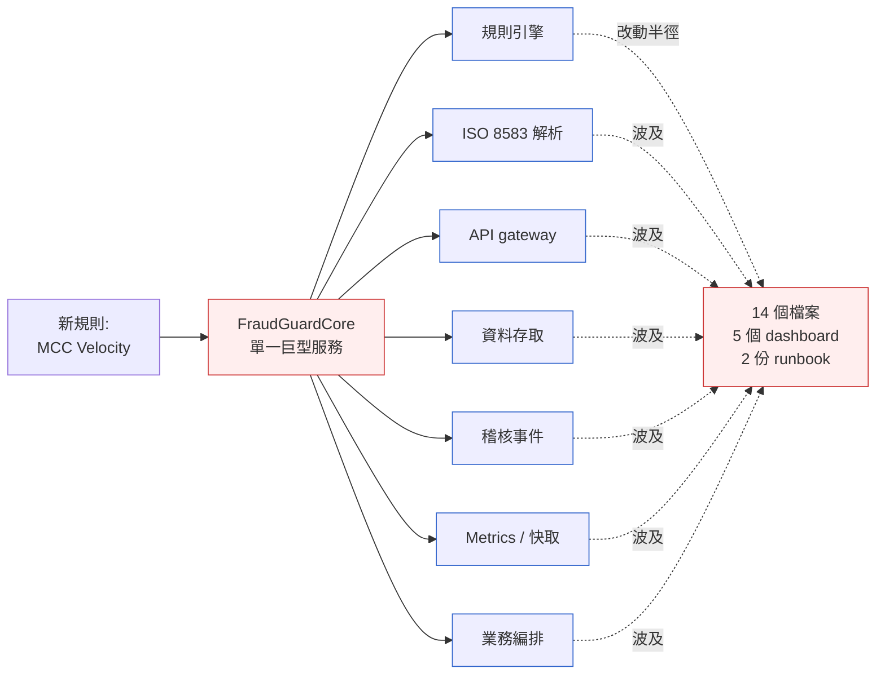
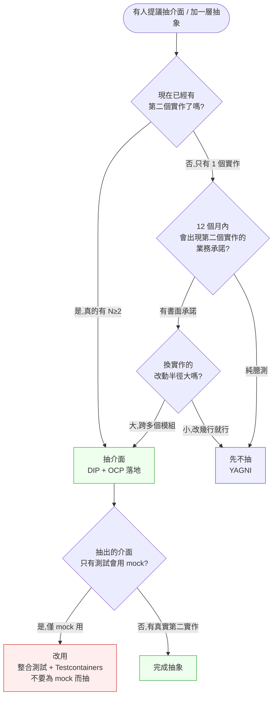

# 第 11 章|軟體架構原則
## ⸺ SOLID、12-Factor、Clean Architecture 不是檢查清單,是成本估算工具

> **前置閱讀**:[Ch 1 為什麼 SA/SD](../part-01-foundations/ch-01-why-sa-sd.md)、[Ch 7 物件導向分析](../part-02-analysis/ch-07-object-oriented-analysis.md)
> **下游章節**:[Ch 12 設計模式](./ch-12-design-patterns.md)、[Ch 13 API 與介面設計](./ch-13-architecture-styles.md)、[Ch 18 DDD 戰術](../part-04-architecture/ch-18-ddd-strategic-tactical.md)、[Ch 21 模組化單體](../part-04-architecture/ch-21-modular-monolith.md)
> **延伸補章**:無

---

## 11.1 冷觀察 ⸺ 一條規則,十四個檔案

我在 2026 年初看過一個案例。

虛構支付公司 **AxisPay**(`CASE-FIN-003`),做東南亞跨境收單,撐起新加坡、馬來西亞、印尼三個市場的即時授權(Real-time Authorization)與風控(Fraud Detection)。團隊 26 人,Spring Boot 3.3 + PostgreSQL 17 + Kafka 3.7,跑 ISO 8583 1100 / 1110 授權報文與 0220 沖正流。風控團隊在 2025 Q4 把規則引擎做成了一個叫 `FraudGuardCore` 的服務,內建 47 條規則 ⸺ 從 BIN 黑名單、地理跳變、單卡日上限、到 24 小時滑動窗口的速度檢查。

第 14 週,印尼端要上一條新規則:**「同一張卡在不同 MCC(Merchant Category Code)之間,2 分鐘內第三次授權需強制 3DS」**。風控分析師寫好 SQL、產品經理做完 spec、法遵簽完字。工程估點時,Tech Lead 在白板上開始列要動的檔案:

```
1.  rules/MccVelocityRule.java                     (新增)
2.  rules/RuleRegistry.java                        (註冊)
3.  api/RuleController.java                        (對外列表 +1)
4.  api/dto/RuleDescriptor.java                    (DTO 增欄)
5.  persistence/RuleConfigRepository.java          (持久化)
6.  persistence/migration/V47__mcc_velocity.sql    (DDL)
7.  cache/RuleCacheLoader.java                     (Redis 快取 key)
8.  metrics/RuleMetricsCollector.java              (Prometheus 指標)
9.  audit/AuditEventEmitter.java                   (Kafka audit topic)
10. config/RulePropertiesBinder.java               (yaml binding)
11. authorization/AuthorizationOrchestrator.java   (主流程串入)
12. gateway/IsoMessageInterceptor.java             (8583 報文層判斷)
13. test/RuleEngineIntegrationTest.java            (整合測試)
14. test/AuthorizationFlowE2ETest.java             (端到端測試)
```

十四個檔案。他停了一下,又補了一句:

> 「真的上 production 還要動五個 dashboard 跟兩份 runbook,這還沒算。」

風控分析師當下沒反駁,但她在事後的 Slack 私訊裡問了一句被 Tech Lead 截圖丟到 architecture review 頻道的話:

> 「我寫一條規則要動十四個檔案,那 AI Agent 寫一百條規則要動多少個檔案?」

這個問題沒有人答上來。`FraudGuardCore` 在第一天設計時被當成「一個服務管所有風控相關的事」,規則引擎、ISO 8583 解析、API gateway 入口、資料存取、稽核事件、metrics 全綁在同一個服務。表面上這叫做「複用」,實際上是**把所有跟風控有關的耦合都集中到了同一坨程式碼**。每多一條規則,要付出 14 個檔案的修改半徑;當 AI Agent 開始參與寫程式,這個半徑會直接決定它的 PR 通過率與回歸成本。



事故覆盤會議上(這次不是真的事故,是月度架構檢討),CTO 把那句話寫在白板上,在底下加了一行註解:**「這不是規則引擎的問題,是邊界沒劃對的問題。」**

---

## 11.2 真問題 ⸺ 原則度量的不是品味,是耦合與改動成本

軟體架構原則(SOLID、12-Factor、Clean Architecture、DRY、KISS、YAGNI)在大多數教材裡的呈現方式,是一張「五大原則表」或一個圖 ⸺ 像道德戒律,讀完打個勾,然後繼續用同樣的方式寫程式。這個讀法在 1995 年 Robert Martin 提出 SOLID 時 [^CIT-110]、在 2011 年 Heroku 發表 12-Factor App 時 [^CIT-112]、在 2017 年 *Clean Architecture* 出版時 [^CIT-111],就已經被誤讀過一次。到 2026 年它仍然是主流誤讀。

把這件事拆開來看,這些原則真正在度量的是同一件事:**這次改動會牽動多少其他模組**。換句話說,它們是一套**改動成本的早期估算工具**,而成本的單位不是行數,是「未來六個月的修改半徑」。AxisPay 的案例剛好把這件事暴露在可量化的層面:

| 原則 | 表面說的事 | 真正在度量的事 |
|---|---|---|
| **SRP**(單一職責) | 一個類別只做一件事 | 「這個類別有幾個會獨立變更的理由?」 |
| **OCP**(開放封閉) | 對擴展開放、對修改關閉 | 「加新行為需不需要動老程式碼?」 |
| **LSP**(里氏替換) | 子類可替換父類 | 「子型別有沒有偷偷違反父型別的契約?」 |
| **ISP**(介面隔離) | 介面要小要專 | 「呼叫端被迫依賴它根本不用的方法嗎?」 |
| **DIP**(依賴反轉) | 依賴抽象不依賴實作 | 「換掉底層實作要動多少上層?」 |
| **12-Factor** | 雲原生最佳實踐 | 「這個服務能不能被當成黑盒子複製、橫向擴展、無痛重啟?」 |
| **Clean Architecture** | 4 個同心圓 | 「業務邏輯有沒有被框架/資料庫綁架?」 |

這些原則的祖師爺其實不是 Robert Martin。**內聚與耦合(Cohesion & Coupling)** 這對概念來自 Larry Constantine 1974 年的論文 [^CIT-114];**資訊隱藏(Information Hiding)** 來自 David Parnas 1972 年的經典 *On the Criteria to Be Used in Decomposing Systems into Modules* [^CIT-113]。Parnas 那篇論文的核心觀點到今天仍然適用:**模組邊界要劃在「會獨立變化的決定」周圍**,不是劃在「程式長什麼樣」周圍。

把這個視角放回現場,可以看到三件事 ⸺ 它們是 AxisPay 那種改動半徑事故每次都繞不開的:

### 11.2.1 原則的真正讀者是六個月後的維護者

寫程式當下的人有完整脈絡,所有原則對他來說都是「多餘的麻煩」。但**程式碼一旦寫完就進入「被讀」的階段**,而讀的時間總長通常是寫的時間的 5 到 10 倍。SOLID 的價值不在寫的當下,在讀的當下 ⸺ 它讓六個月後的維護者(或 AI Agent)能夠**只看局部就敢動手**。

換句話說:寫程式時違反 SOLID 通常省 10 分鐘,讀程式時違反 SOLID 通常賠 2 小時。這個不對稱,就是為什麼資深工程師願意花時間做看似「過度設計」的事。

### 11.2.2 AI Agent 寫程式,讓耦合度量比過去更值錢

維護者的這個需求,在 AI 寫程式的時代反而變得更關鍵 ⸺ AI 對模組邊界清晰度的依賴甚至比人類更強。

2026 年的事實是:在大多數中型服務裡,Cursor / Claude Code / GitHub Copilot Workspaces 寫的程式碼比例已經穩定在 40~70% 之間。這帶來兩個結構性變化:

- **AI 寫得快,但要驗證「我的改動有沒有破壞別處」時讀得慢**。快速出碼的代價是必須驗證邊界,而高耦合會讓驗證變得困難:耦合度高 = AI 要讀的範圍大 = context window 被佔滿 = 出錯率上升。
- **人類已經跟不上 AI 的產出速度**,人不再是耦合度的第一線發現者。**得讓「耦合是否被控制好」變成一個可機器查驗的指標**,AI 自己才能在寫的當下就驗證。

這正是 SOLID / Clean Architecture / 12-Factor 在 AI 時代反而更值錢的原因:它們是**可以被 fitness function 與 linter 自動量測的指標**(`Ch 34` 會展開)。同個方向的人有 Mark Richards / Neal Ford 在 *Building Evolutionary Architectures*[^CIT-118] 寫的 ⸺ 架構特性必須能被自動量測,否則無法防止退化。

### 11.2.3 這些原則之間有重疊,不需要全部都做滿

SOLID 的 5 條 + 12-Factor 的 12 條 + Clean Architecture 的 4 環 + DRY/KISS/YAGNI 的 3 條,湊起來 24 條原則,沒有一個專案真的做得到全綠。**它們之間多數是重疊的**。舉幾個具體的對應:DIP 跟 Clean Architecture 的「依賴指向圓心」是同一件事換個層次講;12-Factor 的「Config」跟 SRP 的「組態與邏輯分離」是同一件事換個視角講;OCP 跟 Clean Architecture 的「Use Case 擴展靠新增、不靠修改舊 Entity」也是同一訴求;12-Factor 的「Backing Services 當資源」跟 DIP 的「核心不認得基礎設施」指向同一個邊界劃法;SRP 的「獨立變更理由」跟 12-Factor 的「Processes 無狀態、橫向擴展」都在逼你把狀態管理的職責移出核心。

把這件事壓成可操作的標準:**原則的目的是幫你判斷「這次改動的成本」,不是讓你打勾**。同一個改動半徑問題,SOLID 算一次、Clean Arch 算一次、12-Factor 算一次,最後選最便宜的那條原則來說服 reviewer 就夠了。

這三個觀察指向同一個問題:**耦合無法只用「高/低」二元描述** ⸺ 你需要知道它在哪個維度讓你付出代價。11.2.1 說維護者要能「只看局部就敢動手」,這是對**理解成本**的訴求;11.2.2 說 AI Agent 需要可機器查驗的指標,是因為**改動半徑**大到無法靠人工發現;11.2.3 說原則之間 60% 重疊,意味著它們全都在圍剿同一批耦合症狀 ⸺ 只是分別從不同角度度量。把這些症狀收攏到統一語言,就必須把「耦合有多貴」轉譯成幾個獨立的成本維度。為什麼是這四個,不是別的?因為它們對應**四種不同的改動情境**:加功能、改依賴、換基礎設施、理解遺留程式 ⸺ 任何一次架構決策都至少觸及其中兩種。

### 11.2.4 「成本估算」這四個字到底在估什麼

把抽象口號落到具體的成本維度,值得估算的是下面四項:

- **改動半徑**(Change Radius):新增一條同類功能要動的檔案數、要重新部署的服務數、要更新的文件數
- **回歸風險**(Regression Risk):這次改動會觸碰多少條既有測試案例、多少個跨服務契約、多少個下游消費者
- **理解成本**(Comprehension Cost):新人(包含 AI Agent)要理解這個改動,得先讀懂多少程式
- **替換成本**(Replacement Cost):底層基礎設施(資料庫、訊息中介、雲端廠商)若被換掉,業務邏輯需要動的比例

四項中任何一項拉高,都是在「未來六個月的成本」上預先簽帳。SOLID / Clean Architecture / 12-Factor 各自是針對某幾項的早期警報器:SRP / OCP 主要瞄準改動半徑與回歸風險;DIP / Clean Architecture 主要瞄準替換成本;12-Factor 的 Config / Dev-Prod Parity 主要瞄準理解成本與部署回歸。**選哪個原則,看你最怕付哪一項帳**。

---

## 11.3 決策框架 ⸺ 用原則做哪些決定

下面這幾張表跟流程圖,在現場相當好用。它們的共同前提是:**原則是估算工具,不是檢查清單**。

### 11.3.1 SOLID 五原則用途對照表

每一條原則對應一個具體決定。當這個決定要做時,翻出對應的原則來算成本;不做這個決定時,不需要把原則套上去。

| 原則 | 對應的決定 | 算成本的問句 | 違反時的味道 |
|---|---|---|---|
| **SRP** | 一個類別/服務該不該再拆 | 「這個類別有幾個會在不同節奏下變的需求?」 | 一個 PR 改了 OrderService,業務、稽核、metrics 三個 owner 都被 tag |
| **OCP** | 該不該抽介面、該不該用策略模式 | 「下次同類需求來,要改舊程式還是加新檔案?」 | 每加一條風控規則就改一次 switch / if-else 鏈,導致每次 PR 都要動核心授權流程 |
| **LSP** | 該不該繼承、要不要改用組合 | 「子類在父類契約下行為一致嗎?能無痛替換嗎?」 | `if (instance instanceof X)` 這種味道出現在多處;或 `CreditCardPayment` 繼承 `Payment` 後 `pay()` 的行為與父類契約不一致,呼叫端被迫加條件判斷 |
| **ISP** | 該不該把大介面拆小 | 「實作這個介面的類別,被迫實作多少自己用不到的方法?」 | 實作 `PaymentProcessor` 介面的類別被迫實作 `refund()`,但它是純付款通道不支援退款 ⸺ 只好丟 `UnsupportedOperationException` |
| **DIP** | 該不該抽抽象、依賴指向哪邊 | 「核心業務邏輯認得 PostgreSQL / Kafka / Redis 嗎?」 | 領域層 import 了 `org.springframework.*`、`io.confluent.kafka.*`;換個資料庫就得動業務邏輯程式 |

**SRP 是最常被誤用的一條**。新手讀完會把每個方法都拆成獨立類別(反模式 1 會講),但 Robert Martin 在 *Clean Architecture*[^CIT-111] 重新定義 SRP 時用的詞是 "*A module should have one, and only one, reason to change*",關鍵是 **reason**(變更理由)⸺ 變更理由由「**誰會來要求改它**」決定,不是由「程式做幾件事」決定。

把這件事壓回 AxisPay 的場景:`FraudGuardCore` 的變更理由有多少?風控分析師會來要求改規則、SRE 會來要求改 metrics、稽核會來要求改 audit、ISO 8583 訊息結構升級會來要求改 parser、業務會來要求改 API。**五個變更理由 = 五個獨立模組的訊號**,這條服務早該拆。

### 11.3.2 Clean Architecture 4 環適用情境表

Clean Architecture 的 4 個同心圓(Entities / Use Cases / Interface Adapters / Frameworks & Drivers)不是必修,而是**依「業務邏輯壽命」與「框架更換頻率」的比值決定要不要做**。下面這張表是現場常用的判斷:

| 場景特徵 | 建議的 Clean Arch 強度 | 理由 |
|---|---|---|
| 業務邏輯壽命 > 5 年(金融、醫療、能源) | **全 4 環,嚴格依賴方向** | 框架會換、雲端廠商會換、領域邏輯不會換 |
| 業務邏輯壽命 1–5 年(多數 SaaS / 電商) | **3 環**(合併 Use Case + Interface Adapter) | 完整四環過度,但要保住 Entity 純粹 |
| PoC / 一次性活動 / < 6 個月專案 | **1 環**(MVC 直球) | 過度抽象換不到任何實際價值 |
| AI Agent 為主撰寫者的服務 | **3 環 + Fitness Function 守護** | 環的存在是為了讓 AI 可驗證依賴方向 |
| 規則密集的系統(風控、保險、合規) | **4 環,但 Use Case 改用決策表/規則引擎** | 規則本身的演化速度遠高於外殼 |

**核心原則**:Clean Architecture 的 4 環不是「越多越好」,是「保護**會獨立演化**的部分」。AxisPay 的 `FraudGuardCore` 該做的不是「把 4 環全做出來」,是把「規則」這層獨立成 Entity + Use Case 兩環,跟 Kafka / 8583 / Redis 那些 Frameworks 切開。

### 11.3.3 12-Factor 優先順序排序

12-Factor App 原典 [^CIT-112] 把 12 條並列,但現場其實有強烈的**價值密度差異**。在 2026 年的雲原生環境(Kubernetes 1.31、容器、Serverless),有些已經變成預設值,有些反而成為被忽視的最大坑。

| 優先級 | 條目 | 為什麼這個優先級 |
|---|---|---|
| **P0(每天會痛)** | III. Config / X. Dev/Prod Parity / XI. Logs | 環境差異炸最常見;組態錯誤事故率最高;沒結構化日誌等於沒 SRE |
| **P1(每月會痛)** | IV. Backing Services / VI. Processes / IX. Disposability | 後端服務當資源(可換綁)、無狀態程序、優雅啟停,直接決定 K8s 是否能正常 rollout |
| **P2(每季會痛)** | V. Build/Release/Run / VII. Port Binding / VIII. Concurrency | CI/CD 與 Service Mesh 一旦成熟就「自動做完」 |
| **P3(年度健檢)** | I. Codebase / II. Dependencies / XII. Admin Processes | 容器化已經把它們變成預設值,反而最容易被遺忘 |

**最常被忽視的是 X. Dev/Prod Parity**(反模式 4 會展開)。AxisPay 的開發環境用 H2 in-memory、production 用 PostgreSQL 17,測試通過 → production 第一個 cron 觸發 `ON CONFLICT DO UPDATE` 語法不相容 ⸺ 這個錯誤每年都還在發生,每年都被當作「個案」。

### 11.3.4 決策樹:這次該不該抽介面

抽介面是「DIP 與 OCP 落地的物理動作」,但**過度抽象比沒抽象更貴**(反模式 2 會講)。下面這張決策樹,給你在 PR review 與 design review 時用:



**這張圖的關鍵不是「該抽就抽」,是預設值在 `Wait`**。多數時候,「要不要抽介面」這個問題的答案是「先別抽,等真的有第二實作再說」。Refactoring 的成本是線性的,過度抽象的維護成本卻是長期的 ⸺ Kent Beck 那句 *"Make it work, make it right, make it fast"* 在 2026 年依舊管用,**要在 "right" 之前先到 "work"**。

### 11.3.5 對照範例:違反 vs 遵守 SOLID

把 AxisPay 的規則引擎抽出兩段對照,讓尺度具體一點。違反 SRP + OCP + DIP 的版本:

```java
// Java 21 + Spring Boot 3.3 ⸺ 反例:全部塞在一個服務
@Service
public class FraudGuardCore {

    @Autowired private JdbcTemplate jdbc;
    @Autowired private KafkaTemplate<String, byte[]> kafka;
    @Autowired private RedisTemplate<String, Object> redis;

    public AuthDecision evaluate(Iso8583Message msg) {
        // 1. 解析 8583 ── ISO 報文細節綁進業務邏輯
        String pan = msg.getField(2);
        String mcc = msg.getField(18);
        BigDecimal amount = new BigDecimal(msg.getField(4));

        // 2. 每加一條規則,就在這個 if-else 鏈再加一段(違反 OCP)
        if (jdbc.queryForObject("SELECT COUNT(*) FROM bin_blacklist WHERE bin=?",
                Integer.class, pan.substring(0, 6)) > 0) {
            kafka.send("fraud.audit", auditPayload("BIN_BLACKLIST", msg));
            return AuthDecision.deny("BIN_BLACKLIST");
        }
        if (recentVelocityFromRedis(pan) > 5) {
            kafka.send("fraud.audit", auditPayload("VELOCITY", msg));
            return AuthDecision.deny("VELOCITY");
        }
        // ... 再 45 條 if-else ...

        return AuthDecision.approve();
    }
}
```

問題不在「程式碼長」,在 **變更理由有 5 個** ⸺ ISO 8583 規格升級、規則新增、Kafka topic 重整、Redis 換 cluster、稽核欄位變更,**任何一個發生都會逼著修改這個類別**。對應到 AxisPay 那 14 個檔案改動半徑。

遵守 SRP + OCP + DIP 的版本:

```java
// 1. Domain 層:純業務,不認得 Spring / Kafka / JDBC
public interface FraudRule {
    String code();
    RuleVerdict evaluate(AuthorizationContext ctx);
}

public record AuthorizationContext(
    String pan, String mcc, BigDecimal amount,
    Instant occurredAt, VelocityWindow recent
) {}

public sealed interface RuleVerdict {
    record Pass() implements RuleVerdict {}
    record Block(String reason) implements RuleVerdict {}
    record Challenge(String mode) implements RuleVerdict {}  // 3DS
}

// 2. Use Case 層:編排規則,不認得 8583 / 持久化細節
public class EvaluateAuthorization {
    private final List<FraudRule> rules;
    public EvaluateAuthorization(List<FraudRule> rules) { this.rules = rules; }

    public RuleVerdict run(AuthorizationContext ctx) {
        return rules.stream()
            .map(r -> r.evaluate(ctx))
            .filter(v -> !(v instanceof RuleVerdict.Pass))
            .findFirst()
            .orElse(new RuleVerdict.Pass());
    }
}

// 3. 新規則 = 新檔案,不動老程式(OCP 達標)
public class McсVelocityRule implements FraudRule {
    public String code() { return "MCC_VELOCITY"; }
    public RuleVerdict evaluate(AuthorizationContext ctx) {
        long recentCrossMcc = ctx.recent().distinctMccCountWithin(Duration.ofMinutes(2));
        return recentCrossMcc >= 3
            ? new RuleVerdict.Challenge("3DS")
            : new RuleVerdict.Pass();
    }
}

// 4. Adapter 層才認得 8583 / Kafka / JDBC
@Service
public class IsoAuthorizationAdapter {
    private final EvaluateAuthorization useCase;
    private final VelocityRepository velocityRepo;
    private final AuditEmitter audit;

    public AuthDecision handle(Iso8583Message msg) {
        var ctx = toContext(msg, velocityRepo.recentFor(msg.getField(2)));
        var verdict = useCase.run(ctx);
        audit.emit(msg, verdict);
        return toDecision(verdict);
    }
}
```

新增 MCC 速度規則,真實改動半徑:**新增 1 個檔案 + 在 Spring 配置註冊 1 個 Bean**,從 14 個檔案掉到 2 個。這不是因為程式碼變短了,是**邊界劃對了**。

---

## 11.4 踩坑清單

下面這四個常見地雷對應 11.3 的四個決策點,請邊讀邊對照:反模式 1 對應 11.3.1 的 SRP 決策;反模式 2 對應 11.3.4 的「該不該抽介面」決策樹;反模式 3 對應 11.3.2 的 Clean Architecture 適用情境;反模式 4 對應 11.3.3 的 12-Factor 優先順序。它們在不同公司反覆出現,共同點是:**外觀上長得像在做架構原則,但實質上是把原則當成檢查清單在打勾**。每一個都附上修正方向,下次遇到可以這樣處理。

### 反模式 1:SRP 變成微類別(Micro-Class Hell)

新進工程師讀完 *Clean Code* 之後熱情很高,把每個方法都拆成獨立類別:`OrderValidator`、`OrderPriceCalculator`、`OrderDiscountApplier`、`OrderTaxResolver`、`OrderShippingResolver`、`OrderTotalAssembler` ⸺ 為了一筆訂單,動到 6 個類別、4 層 wiring,看完整流程要在 IDE 跳 8 次。

問題在於:**SRP 的 "S" 是 Single Responsibility,不是 Single Method**。Robert Martin 在 *Clean Architecture* 講得很清楚 ⸺ 變更理由(reason to change)由「業務 stakeholder」決定,不是由「程式碼乾淨度」決定。當「計算訂單總價」這件事是由同一個業務 owner(財務 / pricing 團隊)負責時,把它切成 6 個類別不會讓變更更容易,只會讓追蹤更難。

> ✅ **修正方向**:用「**這個類別會被誰要求改**?」來判斷拆分。同一個 stakeholder 要的東西,放一個類別;不同 stakeholder(財務 / 法遵 / 風控)要的東西,才拆出獨立類別。判斷尺度是業務變更的**頻率與來源**,不是程式行數。Sandi Metz 的 9LOC / 5 method 拇指法則 [^CIT-115] 是給 Ruby OO 設計用的啟發,不是放諸四海的硬規。

### 反模式 2:DIP 為了 Mock 而抽象(只有測試用)

每個 Service 都 extract 一個介面 `XxxService` + 實作 `XxxServiceImpl`,理由是「為了測試方便 mock」。半年後 codebase 裡有 80 個介面,每個都只有一個實作,而**測試的 mock 全是 happy path**,production 真實行為從來沒被驗證。

這是「為了 mock 而 DIP」 ⸺ 抽象的目的是「未來會有第二實作」,不是「測試時要假裝有第二實作」。Jonas Sundberg 那篇被廣泛引用的文章 *"DI is not the solution to your testing problem"* 講的就是這件事 [^CIT-116]。

> ✅ **修正方向**:介面只在「真的有 N ≥ 2 實作」或「跨進程邊界(資料庫、外部 API、訊息中介)」時抽。其他情境改用 **Testcontainers**(真實 PostgreSQL / Kafka / Redis)+ **WireMock**(外部 HTTP),把整合測試當主要驗證手段。Spring Boot 3.3 的 `@ServiceConnection` + Testcontainers 已經把這條路鋪平,沒理由還在用 mock 假裝測過。

### 反模式 3:Clean Architecture 4 環只做 1 環(其他環沒拆)

宣稱「我們做 Clean Architecture」,但實際上只在 controller 跟 service 之間多放了一層 `domain/` 資料夾,裡面是 anemic 的 DTO,沒有業務行為,業務邏輯仍然散在 service 與 repository 裡。**圈是畫了,依賴方向沒守。**

更糟的版本:domain 層的 entity 直接 `import javax.persistence.Entity` 與 `@ManyToOne` ⸺ JPA 註解把 ORM 框架綁進了「最內圈」,這跟 Clean Architecture 的核心訴求(依賴指向圓心、業務不認得框架)完全相反。

> ✅ **修正方向**:用 fitness function 自動驗證依賴方向(`Ch 34` 展開)。**ArchUnit** [^CIT-117] 在 Java 圈是事實標準:
>
> ```java
> @ArchTest
> static final ArchRule domain_should_not_depend_on_spring =
>     classes().that().resideInAPackage("..domain..")
>         .should().onlyDependOnClassesThat()
>         .resideInAnyPackage("..domain..", "java..", "jakarta..");
> ```
>
> 把這條規則放進 CI,它過了你才能宣稱「做 Clean Architecture」。沒有自動驗證的圈圈,半年內必然被穿透。

### 反模式 4:12-Factor 只做 11 條(常缺 Dev/Prod Parity)

雲原生團隊大多會做到 11 條:codebase、dependencies、config、processes、port binding、disposability、logs、admin processes、build/release/run、port、concurrency。**漏的那一條幾乎都是 X. Dev/Prod Parity**。常見的版本是:

- 開發用 H2 / SQLite,production 用 PostgreSQL ⸺ 第一個 `RETURNING` 語法不相容
- 開發用 in-memory queue,production 用 Kafka ⸺ 第一個 partition rebalance 暴露順序假設
- 開發 OS 是 macOS,CI 是 Ubuntu,production 是 Alpine ⸺ glibc / musl 差異導致同一個 binary 行為不同
- 時區:開發機是 Asia/Taipei,production container 是 UTC ⸺ 報表跨日

> ✅ **修正方向**:三件事擇一就會大幅止血:
>
> 1. **本地用 Testcontainers + Docker Compose** 直接拉 production 同版本後端服務,別用「方便的」替代品
> 2. **CI 與 production 同個 base image**(distroless 或 alpine,鎖版本)
> 3. **時區一律 UTC**,顯示層才轉(同 Ch 8 反模式 3)
>
> 這條原則的代價最低、價值最高,但因為它「不像 SRP 那麼性感」,反而最常被跳過。

---

## 11.5 交付清單 ⸺ 一頁式 Coupling Audit Card

11.2.4 說的四項成本維度 ⸺ 改動半徑、回歸風險、理解成本、替換成本 ⸺ 需要在每次架構決策時量化記錄下來,才能讓「原則有沒有守到」成為可查的數字而不是記憶。下面這張卡就是把這些量化維度從抽象落到具體的模板:六個欄位分別對應「這個模組的職責邊界(SRP)」、「出去的依賴有多脆弱(替換成本)」、「進來的依賴有多穩定(回歸風險)」、「新增一條規則要動幾個檔案(改動半徑)」、「原則與 fitness function 宣告(可機器驗證)」、「哪些事情明確不做(Out of Scope,防止邊界蠕變)」。一頁的邊界不是美觀考量:**寫不滿一頁就是設計沒拆乾淨**。

每個關鍵模組都應該有一張卡,這張卡是「給六個月後維護者(包含 AI Agent)的耦合說明書」。

把它存在 `docs/coupling/{module_name}.md`,跟程式碼同 repo,跟模組目錄同層。

````markdown
# Coupling Audit Card — {module_name}

> 版本:v0.1 | 撰寫日期:YYYY-MM-DD | 擁有人:{名字 / team handle}
> 對應目錄:`src/main/{lang}/{path}/`
> 對應 ADR:`docs/adr/00NN-*.md`

## 1. 模組職責(SRP 視角)
- 一句話業務責任:{誰在什麼情況下會來要求改這個模組}
- 變更來源(Stakeholder):
  - [ ] 業務 / 產品
  - [ ] 法遵 / 風控
  - [ ] SRE / Platform
  - [ ] 資料 / BI
- 變更節奏(每月幾次預期):

## 2. 對外依賴(Outgoing Coupling)
| 依賴對象 | 種類 | 抽象等級 | 替換成本 |
|---|---|---|---|
| {模組 A} | 同進程呼叫 | 介面 / 直連 | 低 / 中 / 高 |
| PostgreSQL | 跨進程 | Repository 抽象 | 中 |
| Kafka topic `xxx` | 跨進程 | Outbox + Adapter | 中 |
| 外部 API `xxx` | 跨進程 | Anti-Corruption Layer | 高 |

## 3. 對外被依賴(Incoming Coupling)
| 被誰依賴 | 介面類型 | 公開穩定性 |
|---|---|---|
| {模組 B} | REST API v1 | Stable / Beta / Internal |
| {模組 C} | Domain Event `OrderPlaced.v2` | Stable |

## 4. 改動半徑估算
- 新增一條同類規則的預估改動:**{N} 個檔案 + {M} 個測試**
- 修改主要實體欄位的預估改動:
- 換掉底層儲存(PG → MongoDB)的預估改動:
  - 應該只動 Adapter 層,Domain / Use Case 不動

## 5. 抽象等級聲明
- 遵守的原則:[ ] SRP [ ] OCP [ ] LSP [ ] ISP [ ] DIP
- Clean Architecture 環次:[ ] 1 環 [ ] 3 環 [ ] 4 環
- 12-Factor 例外:{若有不符合的條目,寫明為什麼}
- ArchUnit / fitness function 規則:`tests/architecture/{module}_rules.java`

## 6. Out of Scope
- 這個模組**不**處理 X(走 {另一模組})
- 這個模組**不**負責 Y(走 {另一服務})
- 這個模組**不**儲存 Z(以事件外送,由 BI 系統落盤)
````

**為什麼要量「改動半徑」?** 因為它是「未來六個月維護成本」最直接的代理指標(proxy)。當這個數字 > 7,你就站在 AxisPay 的 14 檔案事故的入口。

**為什麼要寫 Out of Scope?** 跟 Ch 1 System Charter、Ch 8 Schema Decision Card 同樣的道理 ⸺ 沒寫下來的範圍,半年後一定會被誤用,而每次誤用都會把不該綁的東西綁進來。AxisPay 的 `FraudGuardCore` 早期 PR review 沒有任何一份卡片寫過 Out of Scope,於是 ISO 8583 解析、API gateway、metrics 收集就都「順手」進了同一個服務。

**這張卡也是 AI Agent 的可查指標**。當 Cursor / Claude Code 寫程式時,把這張卡放進 context,它能驗證自己的改動有沒有破壞模組邊界 ⸺ 比起期待 AI 自己「理解架構」,直接給它檢查表更可靠。

### 11.5.1 範例:AxisPay 重構後 RuleEngine 的第一張 audit card

那條「同卡跨 MCC 2 分鐘第三次強制 3DS」改 14 個檔案的事故之後,AxisPay 把 `FraudGuardCore` 拆成 Clean Architecture 三環。下面這張是新生 `RuleEngine` 模組在 PR review 上跟著 ADR-0019 一起進 repo 的版本 ⸺ ArchUnit 規則直接綁在這張卡的第 5 欄。

````markdown
# Coupling Audit Card — RuleEngine

> 版本:v0.1 | 撰寫日期:2026-02-09 | 擁有人:@hwang(風控 Tech Lead)
> 對應目錄:`src/main/java/com/axispay/fraud/rules/`
> 對應 ADR:`docs/adr/0019-fraudguardcore-clean-arch-split.md`

## 1. 模組職責(SRP 視角)
<!-- 為什麼這欄:Tech Lead 那 14 個檔案的清單,
     就是這欄「會獨立變更的理由」當初有 7 條全擠在同一個服務的代價。 -->
- 一句話業務責任:風控分析師寫一條新規則時,**只**該動這個模組
- 變更來源:[x] 法遵 / 風控  [ ] 業務 / 產品  [ ] SRE  [ ] 資料 / BI
- 變更節奏:每月 4–8 條新規則(由風控分析師驅動)

## 2. 對外依賴(Outgoing Coupling)
| 依賴對象 | 種類 | 抽象等級 | 替換成本 |
|---|---|---|---|
| `RuleRepository`(port) | 介面 | 介面(實作在 adapter) | 低 |
| `AuditEventPublisher`(port) | 介面 | Outbox + Adapter | 低 |
| ⛔ ISO 8583 解析 | 跨模組 | 嚴禁直接依賴 | ⸺ |
| ⛔ Spring Web | 框架 | 嚴禁出現在本模組 | ⸺ |

## 3. 對外被依賴(Incoming Coupling)
| 被誰依賴 | 介面類型 | 公開穩定性 |
|---|---|---|
| `AuthorizationOrchestrator` | `RuleEngine.evaluate(ctx)` | Stable |
| `RuleConfigController`(adapter) | `RuleRegistry.register(rule)` | Internal |

## 4. 改動半徑估算
<!-- 為什麼這欄:14 個檔案是 AxisPay 的入口痛,
     寫進來等於把「下次有沒有再退步」變成可查的數字。 -->
- 新增一條同類規則:**2 個檔案 + 1 個測試**(目標,基線 14)
- 修改主要實體欄位:RuleContext 1 檔 + 受影響 rule N 檔
- 換掉底層儲存(PG → Mongo):動 `RuleRepository` adapter 1 檔,Domain 不動

## 5. 抽象等級聲明
<!-- 為什麼這欄:沒 fitness function 守的原則是希望;
     ArchUnit 規則直接寫在這格,半年後反向依賴會在 CI 紅燈跳出來。 -->
- 遵守:[x] SRP [x] OCP [x] LSP [x] ISP [x] DIP
- Clean Architecture 環次:[x] 內環(Domain + Use Case)
- 12-Factor 例外:無
- ArchUnit 規則:`tests/architecture/RuleEngineRules.java`
  - `noClasses().that().resideIn("..rules..").should().dependOn("..web..")`
  - `noClasses().that().resideIn("..rules..").should().dependOn("..iso8583..")`

## 6. Out of Scope
- 這個模組**不**處理 ISO 8583 解析(走 `iso8583-parser` 模組)
- 這個模組**不**負責規則持久化(走 `RuleRepository` 的 adapter 實作)
- 這個模組**不**發 Kafka audit event(走 `AuditEventPublisher` 的 outbox)
- 這個模組**不**碰 metrics / dashboard / runbook(SRE 模組各自處理)
````

那條 MCC velocity 規則第二次補上線時,改動半徑 2 個檔案 + 1 個測試 ⸺ 風控分析師私訊裡那句「AI Agent 寫一百條規則要動多少個檔案」,終於有了答案。**邊界劃對的那一刻,寫程式這件事的單位重量會輕很多。**

---

## 11.6 本章交付清單 Recap

讀完本章,你應該已經能做到:

- [ ] 把 SOLID / Clean Architecture / 12-Factor 重新定位為「改動成本估算工具」,不是道德戒律或檢查清單
- [ ] 用「這次該不該抽介面」決策樹,在 PR review 與 design review 時做出快速判斷,避開過度抽象與不足抽象兩個極端
- [ ] 認得四個反模式(微類別、為 mock 抽象、4 環只做 1 環、缺 Dev/Prod Parity)並有對應修正方向
- [ ] 為手上每個關鍵模組產出一份 Coupling Audit Card,把改動半徑與 Out of Scope 量化下來

如果四項中先挑一項做完就好,建議從最後那一項 ⸺ 把目前 production 的 top 3 改動最頻繁的模組拉出來,各填一份 Coupling Audit Card,**改動半徑寫不出小於 5 的那幾個**,就是下一輪該重整的對象。本書 Ch 12 會接著談「設計模式」如何落地這些原則,Ch 13 會展開 API/介面設計,Ch 18 會在 DDD 戰術層把模組邊界推到更細的粒度。

---

## Cross-References

- **回顧**:[Ch 1 為什麼 SA/SD](../part-01-foundations/ch-01-why-sa-sd.md) ⸺ 製造可被傳遞的理解
- **下一章**:[Ch 12 設計模式](./ch-12-design-patterns.md) ⸺ GoF / 企業整合模式如何落地 SOLID
- **介面設計**:[Ch 13 API 與介面設計](./ch-13-architecture-styles.md)
- **戰術 DDD**:[Ch 18 DDD 戰術設計](../part-04-architecture/ch-18-ddd-strategic-tactical.md)
- **模組化單體**:[Ch 21 Modular Monolith](../part-04-architecture/ch-21-modular-monolith.md)
- **演化式架構**:[Ch 34 Fitness Functions](../part-06-engineering/ch-34-fitness-functions.md)

## 引用

[^CIT-110]: Robert C. Martin, "Design Principles and Design Patterns" (2000) 與 SOLID 原則系列論文(1995–2003)。SRP / OCP / LSP / ISP / DIP 五字母縮寫由 Michael Feathers 集合命名。
[^CIT-111]: Robert C. Martin, *Clean Architecture: A Craftsman's Guide to Software Structure and Design* (Prentice Hall, 2017)。4 同心圓與依賴方向。
[^CIT-112]: Adam Wiggins, "The Twelve-Factor App" (Heroku, 2011;2017 修訂)。12factor.net。
[^CIT-113]: David L. Parnas, "On the Criteria to Be Used in Decomposing Systems into Modules" (Communications of the ACM, Vol. 15, No. 12, 1972)。資訊隱藏與模組分解原則。
[^CIT-114]: Larry L. Constantine, Glenford J. Myers, Wayne P. Stevens, "Structured Design" (IBM Systems Journal, Vol. 13, No. 2, 1974)。內聚與耦合的原始定義。
[^CIT-115]: Sandi Metz, *Practical Object-Oriented Design in Ruby (POODR)* (Addison-Wesley, 2012;第 2 版 2018)。OO 設計的 9 行/5 方法拇指法則。
[^CIT-116]: Jonas Sundberg, "Mocks Aren't Stubs" 與相關討論,以及 Martin Fowler 的 *Mocks Aren't Stubs* (martinfowler.com, 2007)。Mock 與 Stub 的混淆與測試策略偏差。
[^CIT-117]: ArchUnit Project, archunit.org。Java 架構規則的 fitness function 函式庫。
[^CIT-118]: Neal Ford, Rebecca Parsons, Patrick Kua, *Building Evolutionary Architectures* (O'Reilly, 2017;第 2 版 2023)。Fitness Function 概念。
[^CIT-119]: ISO 8583:2003 *Financial transaction card originated messages — Interchange message specifications*。即時授權報文格式與 MTI(Message Type Indicator)定義,1100/1110/0220 等報文族與 MCC(Merchant Category Code)欄位語意。

---
