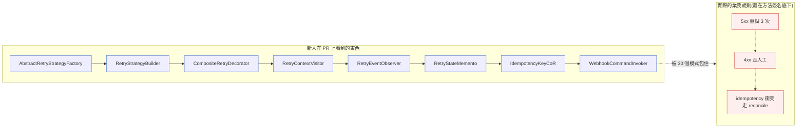
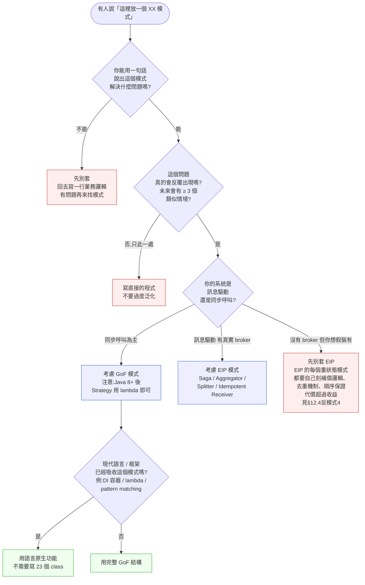
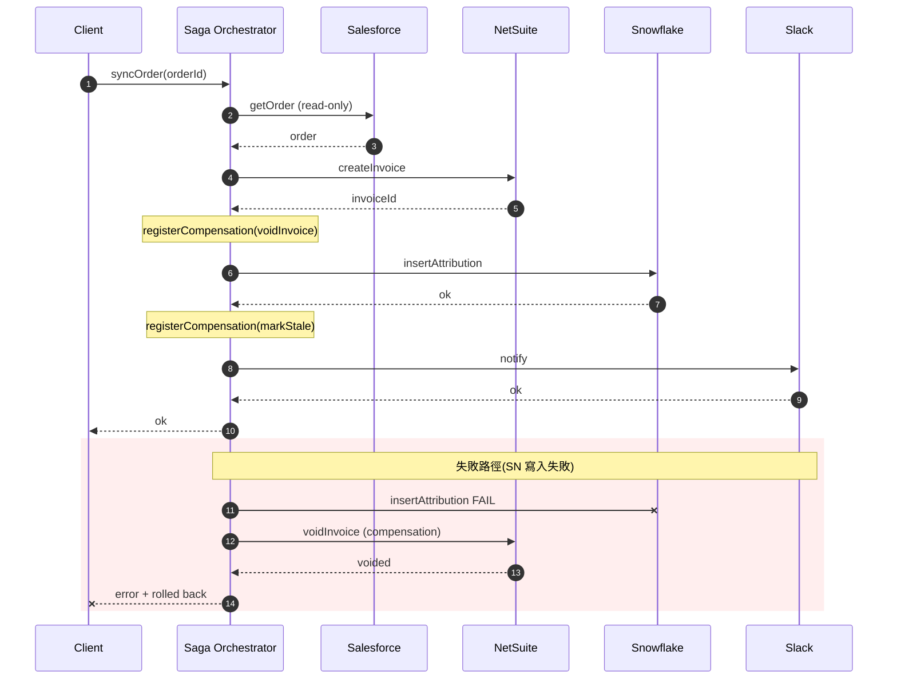
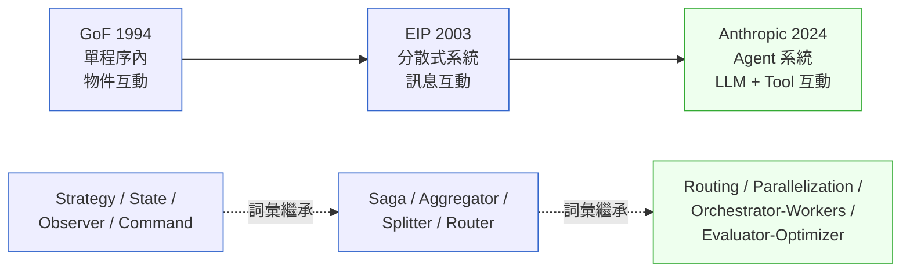

# 第 12 章|設計模式
## ⸺ GoF 與整合模式 (EIP),為已知問題命名的工具

> **前置閱讀**:[Ch 7 物件導向分析](../part-02-analysis/ch-07-object-oriented-analysis.md)、[Ch 11 軟體架構原則](./ch-11-architecture-principles.md)
> **下游章節**:[Ch 13 架構風格實戰](./ch-13-architecture-styles.md)、[Ch 19 Event Storming](../part-04-architecture/ch-19-event-storming-modeling.md)、[Ch 23 Event-Driven 與事件溯源](../part-04-architecture/ch-23-event-driven-cqrs-es.md)、[Ch 40 Multi-Agent 系統設計](../part-07-ai-era/ch-40-multi-agent.md)
> **延伸閱讀**:[Ch 41 共識/狀態/衝突](../part-07-ai-era/ch-41-multi-agent-consensus.md)

---

## 12.1 冷觀察 ⸺ 30 個 GoF 包著 100 行業務邏輯

我在 2025 年第四季看過一個案例。

虛構 B2B 整合平台公司 **MeshConduit**(`CASE-SAS-003`),做的是「把客戶的 SaaS A、SaaS B、SaaS C 串起來」這門生意 ⸺ 客戶在 Salesforce 開單,要求自動同步到 NetSuite,失敗時走 Slack 告警、再依規則寫進 Snowflake 做財報歸因。客戶 1,800 家,日均 webhook 量 6,200 萬筆,工程團隊 24 人。

那個 Q4,他們在加一個新功能:「條件式重試」⸺ 對 NetSuite 5xx 錯誤重試 3 次、對 4xx 直接拋給人工、對 idempotency 衝突走 reconcile。一個資深 RD 接手,兩週做完 PR。Code review 那天,新人工程師打開 PR,在 Slack 上發了一句話,後來被原樣記下來:

> 「我看了兩個小時,這個功能的核心邏輯到底寫在哪裡?」

PR 的檔案結構長這樣:`AbstractRetryStrategyFactory`、`RetryStrategyBuilder`、`CompositeRetryDecorator`、`RetryContextVisitor`、`RetryEventObserver`、`RetryStateMemento`、`IdempotencyKeyChainOfResponsibility`、`WebhookCommandInvoker` ⸺ 八個檔案、3,400 行。實際的業務邏輯(「5xx 重試 3 次、4xx 走人工、idempotency 衝突走 reconcile」)散在七個類別的方法簽名底下,沒有任何一個地方能讓你一眼看完。

新人花了兩小時讀,讀懂了**模式名稱**,沒讀懂**業務規則**。

Code review 之後,有人私下問那位資深 RD:「這八個模式,你能各用一句話說出它解決什麼問題嗎?」RD 回答了兩個 ⸺ Strategy 與 Chain of Responsibility,因為這兩個在重試分流邏輯裡確實有對應問題。其餘六個,RD 想了很久,最後說:「這些是我從一篇講『advanced error handling』的技術部落格裡改過來的,原作者有用,我就跟著用了。」這句話後來被 CTO 在 Q4 回顧上稱為「MeshConduit 最誠實的工程告白」。問題不是那位 RD 的技術能力,而是模式被當成**參照物(reference artifact)**而非**問題的解法**來使用 ⸺ 有沒有對應的問題,沒人在動手前問過。



兩週後,客戶報了一個 bug:某條 4xx 路徑沒走人工,被當成 5xx 重試三次,結果同一筆訂單在 NetSuite 開了三張發票。要修這個 bug,工程師動了五個檔案的五個方法,改完之後新人在 PR 描述裡寫了一句:「我不確定我有沒有改對地方,但測試過了。」

這句話在 MeshConduit 的工程資料庫裡,後來成為了 Q4 工程回顧時被引用最多的一句。

CTO 在那次回顧上問了一句被原樣記下來的話:

> 「我們有 30 個 GoF 模式,但我們有沒有一句話能講清楚這個服務在做什麼?」

沒人答上來。

---

## 12.2 真問題 ⸺ 模式不是結構,是命名

把 MeshConduit 的事拆開來看,RD 寫了 30 個 GoF 模式不是技藝失準,**真正在處理的是錯把「結構」當成「目的」**。Erich Gamma、Richard Helm、Ralph Johnson、John Vlissides 四位作者(俗稱 Gang of Four,GoF)在 1994 年寫《Design Patterns: Elements of Reusable Object-Oriented Software》[^CIT-120]時,書名第一個單字是 *Design*,第二個是 *Patterns* ⸺ 但很多讀者把它當成 *Pattern Catalog* 在讀,以為「模式越多越專業」。

把這個視角拉開來看,模式真正在做的事其實是三件:

### 12.2.1 模式是「給已知問題的命名」,不是「先用模式再找問題」

Christopher Alexander 1977 年寫《A Pattern Language》[^CIT-121]時,寫的是建築:「窗戶座位」「光從兩側來」「臥室面東」⸺ 每一個 pattern 都先描述一個**已知的問題情境**,再給出**一個被驗證可行的解法**,最後給它一個**好記的名字**。

GoF 1994 把這個方法搬進物件導向設計,做的是同一件事:**為一個已知會反覆出現的設計問題,給一個團隊都認得的名字**。Singleton 不是「結構是私有 constructor + 靜態 instance」,而是「我需要保證這個資源全程序唯一」這個**問題**有個共通名字。Observer 不是「定義 attach/detach 介面」,而是「狀態變了要通知不確定數量的旁觀者」這個問題有個共通名字。

換句話說,模式真正的價值在**詞彙(vocabulary)**,不在**程式碼結構**。當你在白板上對另一位工程師說「這裡放一個 Strategy」,對方立刻知道你想處理的問題是「行為要在 runtime 切換,且呼叫端不該知道是哪一個」⸺ 這 30 秒省下的溝通成本,才是模式真正的回報。

MeshConduit 那段 PR 反過來:**先選了模式,再硬塞進業務邏輯**。三千行 code 描述的不是業務問題,是「我用了哪些模式」⸺ 結果模式的命名價值消失,因為新人根本不知道模式對應的問題是什麼。

### 12.2.2 GoF 23 個模式不是平等的:三類有三種命運

既然模式的價值在詞彙,那麼**實作這些詞彙的程式碼形式**會怎麼變?這個問題在 2026 年特別重要,因為現代語言和框架正在悄悄吸收一部分 GoF 模式的結構,讓它的「程式碼長相」和 1994 年的原版愈來愈不像。

GoF 把 23 個模式分成三類:創建型 5、結構型 7、行為型 11。三類在 2026 年的命運很不一樣。

| 類別 | 模式名稱 | 2026 現場頻次 | 為什麼 |
|---|---|---|---|
| **創建型(Creational)** | Singleton / Factory Method / Abstract Factory / Builder / Prototype | Singleton 普遍誤用、Builder 仍常用、Factory Method 多被 DI 容器取代 | DI / IoC 框架(Spring、NestJS、Guice)把「物件如何被建立」這層抽走 |
| **結構型(Structural)** | Adapter / Bridge / Composite / Decorator / Facade / Flyweight / Proxy | Adapter / Facade / Decorator / Proxy 仍是日常詞彙;Bridge / Flyweight 多餘 | 結構問題在分散式時代部分上移到「整合模式」 |
| **行為型(Behavioral)** | Chain of Responsibility / Command / Interpreter / Iterator / Mediator / Memento / Observer / State / Strategy / Template Method / Visitor | Strategy / State / Observer / Command 高頻;Visitor / Interpreter 教學秀為主 | 行為問題在現代語言中部分被 first-class function、pattern matching、event bus 吸收 |

這張表的關鍵不是「哪些該記」,**是哪些已經被現代語言或框架吸收**。Java 1.0 沒有 lambda,所以 Strategy 必須用一個 interface + 一堆實作類別來表達;Java 8 之後 Strategy 常常就是一個 `Function<T, R>`,模式還在,結構不見了。換句話說,**模式不會死,但模式的「程式碼長相」會跟著語言演化**。

把 GoF 當成「23 個必背的 class 圖」會讓人錯位。把它當成「23 個會反覆出現的設計問題的名字」就剛好。

GoF 的 23 個模式都活在**單一程序的邊界裡**:物件呼叫物件、介面依賴介面、runtime 切換行為。但當系統從單程序擴展到跨服務、跨組織、跨網路,設計問題的形狀就變了:不是「這個物件怎麼通知那個物件」,而是「這條訊息怎麼確保到達、怎麼避免重複、怎麼在失敗時補償」。問題的層次不同,需要的詞彙也不同 ⸺ 這就是 EIP 出現的原因。

### 12.2.3 EIP 是分散式時代的 GoF,但入場券是「你的系統是不是訊息驅動」

Gregor Hohpe 與 Bobby Woolf 2003 年寫《Enterprise Integration Patterns》[^CIT-122],延續了 GoF 的「給已知問題命名」傳統,但場景換了:不是單一程序內的物件互動,而是**跨系統、跨網路、跨組織的訊息互動**。EIP 列了 65+ 個模式,分成四大類:

- **Messaging Channels(訊息通道)**:Point-to-Point、Publish-Subscribe、Dead Letter Channel、Guaranteed Delivery
- **Message Endpoints(訊息端點)**:Polling Consumer、Event-Driven Consumer、Idempotent Receiver、Transactional Client
- **Message Routing(訊息路由)**:Content-Based Router、Filter、Splitter、Aggregator、Routing Slip、Process Manager
- **Message Transformation(訊息轉換)**:Envelope Wrapper、Content Enricher、Content Filter、Claim Check、Normalizer

EIP 在 2026 年很容易被誤用,**因為它看起來很美**。Saga、Process Manager、Aggregator 這些名字一上 PPT 就會有架構感。但 EIP 的入場券其實只有一張:**你的系統是不是訊息驅動的**。

為什麼 Saga、Aggregator、Splitter 這些模式特別依賴真實的 broker?原因在於它們的正確性假設是建立在 broker 提供的**底層保證**上的。以 Saga 為例:Saga 的補償邏輯要確保「第一步成功之後,第二步才能執行;第二步失敗時,第一步的副作用能被可靠地撤銷」。這件事需要兩個保證:**at-least-once delivery**(訊息一定會被處理,即使 consumer 重啟)與 **durability**(broker 掛掉重啟後訊息還在)。如果沒有這兩個保證,Saga 的補償步驟就可能因為消費者崩潰而「沒跑到」⸺ 結果是 NetSuite 發票開了、補償沒執行,帳不平。Aggregator 也是一樣:它需要 broker 的訊息持久化來記住「已經收到哪幾個分片」,一旦 consumer 重啟這個狀態就不能丟。換句話說,**EIP 每個重狀態模式都把最難的那部分外包給了 broker**;沒有 broker,每個模式都要自己刻這些保證。

換句話說,如果你的系統的真實互動還是 HTTP 同步呼叫,沒有 Kafka / RabbitMQ / SQS / Pub/Sub 之類的訊息中介,EIP 看起來能用、實際上每一個模式都得自己捏一個假 broker 才能用 ⸺ 這時用 EIP 反而把單純的同步問題變成假的非同步問題。MeshConduit 那條同步重試,真的需要 Saga 嗎?如果 NetSuite 的呼叫本來就是同步的,Saga 帶來的補償邏輯只是把「3 行 if-else」改寫成「7 個 step + 7 個 compensation handler」,代價是分散式狀態管理。

這件事其實是 GoF 的鏡像 ⸺ GoF 被誤用是「把模式當必填欄位」,EIP 被誤用是「把模式當架構優越感」。兩者的修正方向都是回到一個問題:**這個模式對應的問題,我這個系統真的有嗎**?

---

## 12.3 決策框架 ⸺ 這個問題該不該套模式

### 12.3.1 一張決策樹:這個問題該不該套模式

決策的起點不是「我該選哪個模式」,而是「我應不應該套模式」。先走完這棵決策樹,再查對照表。



這張圖的關鍵不在分支,**在第一個問題**:你能用一句話說出這個模式解決什麼問題嗎?如果不能,套模式只會把問題包得更難找。MeshConduit 那位資深 RD 如果在動手之前回答這一題,八個模式至少有六個會被刪掉。

### 12.3.2 三類模式的適用情境對照

走完決策樹確認「值得套模式」之後,下面這張表幫你決定「套哪個」。當有人說「這裡放一個 XX 模式」,先對照「你想解決的問題是什麼」,再決定對不對。

| 你想解決的問題 | 推薦模式 | 類別 | 不該用什麼 |
|---|---|---|---|
| 行為要在 runtime 切換,呼叫端不該知道是哪一個 | **Strategy** | GoF 行為型 | 不該用 Visitor(雙重分派太重)、不該用 Template Method(編譯期才能換) |
| 物件本身會經歷狀態,且不同狀態下行為不同 | **State** | GoF 行為型 | 不該用一堆 if-else 散在各處 |
| 狀態變了要通知不確定數量、不確定種類的旁觀者 | **Observer / Pub-Sub** | GoF 行為型 / EIP | 不該用直接呼叫(會綁死) |
| 把一個已存在的舊介面包成新介面用 | **Adapter** | GoF 結構型 | 不該改舊系統(可能不能改) |
| 在一個物件外面動態加職責(壓縮 / 加密 / 計時) | **Decorator** | GoF 結構型 | 不該用繼承爆炸 |
| 一連串處理器依序處理,直到有一個能處理為止 | **Chain of Responsibility** | GoF 行為型 / EIP Routing Slip | 不該用一個大 switch |
| 把一個動作打包成可記錄、可撤銷、可排隊的物件 | **Command** | GoF 行為型 | 不該直接呼叫(會無法 undo / replay) |
| 多個輸入要彙整成一個輸出(訊息合併) | **Aggregator** | EIP Routing | 不該手刻 join 邏輯 |
| 一個訊息要拆成多個下游(扇出) | **Splitter** | EIP Routing | 不該在 producer 端做迴圈 |
| 跨多個服務的長交易,失敗要補償 | **Saga / Process Manager** | EIP Routing | 不該用分散式 2PC |
| 同一筆訊息可能重複,接收端要去重 | **Idempotent Receiver** | EIP Endpoint | 不該假設「不會重複」 |

這張表的關鍵不是「模式名」,**是最右邊那一欄「不該用什麼」**。模式的價值常常是**指出哪些做法不該用**,而不是「必須用哪個」。

### 12.3.3 EIP 常用模式精選 ⸺ Saga 與 Aggregator

決策樹的 Q3「訊息驅動、有真實 broker」分支引向 EIP 模式。EIP 65+ 個模式不可能全記,下面這張表把 2026 年現場最常用的六個挑出來,標註「這個模式真正在解什麼問題」與「不適用情境」。表後以 Saga 為例,展示「一個 EIP 模式真實長什麼樣」:

| EIP 模式 | 解決的問題 | 經典實作 | 不適用情境 |
|---|---|---|---|
| **Saga** | 跨多服務的長交易、失敗時要逐步補償 | Camunda 8 / Temporal / AWS Step Functions | 單服務內部的交易(用 DB transaction 就好) |
| **Process Manager** | 流程有狀態、需要記住「現在走到哪步」 | Camunda BPMN runtime / Netflix Conductor | 無狀態的單次轉換 |
| **Aggregator** | 多個訊息要彙整成一個輸出(N 個 → 1 個) | Apache Camel `<aggregate>` / Kafka Streams `groupBy.windowedBy.aggregate` | 不需要等待多訊息的場景 |
| **Splitter** | 一個訊息要拆成多個下游(1 個 → N 個) | Apache Camel `<split>` / Kafka Streams `flatMap` | producer 已經能直接發 N 個訊息的場景 |
| **Content-Based Router** | 訊息內容決定路由 | Apache Camel `<choice>` / Kafka Streams `branch` | 路由規則簡單、用 topic 分流就夠 |
| **Idempotent Receiver** | 訊息可能重複,接收端要去重 | Redis / Postgres unique key + idempotency_key header | 訊息保證 exactly-once 的封閉系統(實務上幾乎不存在) |

下面是一段 Saga 的概念片段(以 Temporal 風格的偽碼示意,展示 MeshConduit 那條跨 Salesforce → NetSuite → Slack → Snowflake 的同步流程,但其中只有兩步真的需要 Saga):

```typescript
// Temporal-style Saga pseudo-code for MeshConduit's cross-system sync
// 注意:這個流程裡只有 NetSuite 寫入與 Snowflake 寫入需要補償
// Salesforce 讀取與 Slack 通知不需要 Saga,因為它們沒有「需要回滾的副作用」

async function syncOrderSaga(orderId: string) {
  const compensations: Array<() => Promise<void>> = [];

  try {
    // Step 1: read-only,不入 Saga
    const sfOrder = await salesforce.getOrder(orderId);

    // Step 2: 真實副作用,入 Saga
    const nsInvoice = await netsuite.createInvoice(sfOrder);
    compensations.push(() => netsuite.voidInvoice(nsInvoice.id));

    // Step 3: 真實副作用,入 Saga
    await snowflake.insertAttribution({ orderId, nsInvoiceId: nsInvoice.id });
    compensations.push(() =>
      snowflake.markAttributionStale({ orderId })
    );

    // Step 4: notification,不入 Saga(失敗不需要「補償」,只需要重發)
    await slack.notify(`Order ${orderId} synced`);

    return { ok: true, nsInvoiceId: nsInvoice.id };
  } catch (e) {
    // 反向執行所有已登記的補償
    for (const c of compensations.reverse()) {
      await c().catch((err) => log.error("compensation failed", err));
    }
    throw e;
  }
}
```

這段程式碼的關鍵不是 Saga 結構,**是 Step 1 與 Step 4 不在 Saga 裡面**。新手看到 Saga 會想把整個流程都套進去,結果一個讀操作也要寫補償;一個通知也要寫補償。Saga 模式精準對應的問題是:**有真實副作用、且失敗時必須回退**。沒有這兩個條件,Saga 就是過度設計。

下面是 Saga 的時序圖,把「正常路徑」與「補償路徑」畫成兩種顏色:



這張圖把 Saga 的本質露出來:**它不是流程圖,是「副作用 + 補償」的成對清單**。

### 12.3.4 2026 視角:AI Agent 系統中的模式語言

Anthropic 2024 年 12 月發佈的《Building Effective Agents》[^CIT-123]做了一件 GoF 風格的事 ⸺ **為 AI Agent 系統的反覆出現的設計問題,給名字**。它列了幾個關鍵模式:

- **Augmented LLM**:LLM + Tool Use + Memory + Retrieval。所有 Agent 系統的最小單元。
- **Prompt Chaining**:把任務拆成多個 LLM 呼叫,後一個吃前一個的輸出。對應 EIP 的 Pipes and Filters。
- **Routing**:依輸入分類路由到不同的 LLM / 不同的 prompt。對應 EIP 的 Content-Based Router。
- **Parallelization**:同一輸入並行多個 LLM,結果由 Aggregator 合併(投票或彙總)。對應 EIP 的 Scatter-Gather + Aggregator。
- **Orchestrator-Workers**:中央 LLM 拆任務給多個 Worker LLM,結果回收。對應 EIP 的 Process Manager。
- **Evaluator-Optimizer**:一個 LLM 產生輸出,另一個 LLM 評估,迴圈優化。對應 GoF 的 Strategy + Observer 組合。

把這個視角放回 GoF / EIP 的傳統,可以看到一條清楚的演化線:



這條線的訊息很單純:**問題的形狀變了,命名的價值沒變**。一個團隊裡如果沒有共同詞彙,「我們做一個 Orchestrator-Workers」這句話就要花 20 分鐘解釋;有共同詞彙,30 秒之內白板就畫完了。這就是模式語言三十年來真正在做的事。

要注意的是:Anthropic 那篇文章的副標叫 *"When and how to build them"* ⸺ 它強調的是「先別套」。文中明確寫:「For many applications, optimizing single LLM calls with retrieval and in-context examples is usually enough.」這句話跟 GoF 1994 那本書序言裡 Erich Gamma 寫的「先寫直接的程式,有反覆出現的問題再考慮模式」是同一句。三十年了,訊息一致。

---

## 12.4 踩坑清單

下面四個反模式在用 GoF / EIP 的團隊裡反覆出現。它們的共同點是**外觀像在做架構,實質上沒有對應到任何一個真實問題**。每一個都附修正方向。

### 反模式 1:先用模式再找問題(Pattern-First Coding)

工程師讀完《Design Patterns》一週,進公司第一個 PR 就用了 5 個模式。看起來很專業 ⸺ 但兩個月後維護的人發現,這些模式對應的「會反覆出現的問題」根本沒出現過,模式只是「我在練習」的副產品。MeshConduit 那段 30 個 GoF 包 100 行業務的 PR 就是這個反模式的典型。

> ✅ **修正方向**:套模式之前先回答兩題:**(a)** 我能用一句話說出這個模式解決什麼問題嗎?**(b)** 這個問題在我這個系統裡會反覆出現,未來會有 ≥ 3 個類似情境嗎?兩題都答 yes 才套;有一題答不出,先寫直接的程式,等問題真的反覆出現再回來重構。模式是「後見之明的命名」,不是「先見之明的結構」。

### 反模式 2:Singleton 萬用(單例濫用)

「這個東西全程序只能有一個」⸺ 於是把 Logger、ConfigManager、CacheManager、UserSession、DatabaseConnection、FeatureFlagClient、MetricsRegistry 都寫成 Singleton。三個月後做單元測試發現,每個測試都會污染下一個測試的狀態,因為 Singleton 是全域可變狀態的另一個名字。

一個典型現場:某個 SaaS 後端的測試套件跑到第三個測試案例時開始報奇怪的錯 ⸺ 日誌輸出的 `request_id` 對不上,最後查出是 `Logger` 的 Singleton 裡面有一個 `MDC`(Mapped Diagnostic Context)記錄,第二個測試改寫了它,第三個測試讀到的是第二個測試留下的值。工程師花了兩週才把根因鎖定:因為所有測試跑在同一個 JVM 程序裡,而那個 Logger Singleton 從來沒有在每個測試開始時被重置。問題不是「Logger 不能唯一」,而是 Singleton 讓這個「唯一」帶著可變狀態,成了測試之間隱形的共享記憶體。Singleton 在多執行緒、在依賴注入、在熱重載、在測試替身上,全部會出狀況。

> ✅ **修正方向**:90% 的 Singleton 真正想要的是「**這個依賴在這個 scope 裡只建立一次**」⸺ 這件事是 DI 容器的 *singleton scope* 在做的(Spring 的 `@Bean`、NestJS 的 `@Injectable`、Guice 的 `@Singleton`),不是 GoF 那個「私有 constructor + 靜態 instance」的 Singleton。把它交給 DI 容器,該唯一還是唯一,但測試時可以替換、生產時可以多實例(每個 tenant 一個)。如果不用 DI 容器,改用 module-level 變數 + 工廠函式也比 GoF Singleton 安全。Singleton 在 Joshua Bloch 的《Effective Java》第 3 條裡就標註過「*may make it difficult to test its clients*」,30 年沒變。

### 反模式 3:Visitor 雙重分派被當教學秀

某個檔案是 `XxxVisitor` 的瞬間,維護者通常會嘆一口氣。Visitor 解決的問題是「**對一個穩定的物件結構,新增多種互不相關的操作**」⸺ 但現代語言裡這個問題大多被 pattern matching(Scala / Rust / Kotlin sealed class / TypeScript discriminated union)直接吸收了。Java 引入 sealed interface + pattern matching for switch(JEP 441 GA in Java 21)後,Visitor 的場景進一步收窄。

為什麼 Visitor 難維護?具體原因在於「物件結構穩定」這個前提極難保持。一個典型故事:某個電商的訂單系統用 `OrderVisitor` 處理五種訂單型別(普通訂單、退款訂單、換貨訂單、拆單、合單),當時寫了五個 Visitor 實作(序列化、稅率計算、庫存核減、報表統計、審計日誌)。半年後,產品要加「預購訂單」這個新型別。工程師打開 `OrderVisitor` 介面 ⸺ 要加一個 `visit(PreorderOrder)` 方法 ⸺ 然後發現所有五個 Visitor 實作都要同時改,每一個都要補一個對預購訂單的處理邏輯。這五個 Visitor 分散在不同模組,有兩個已經有其他 RD 在修改,光是 merge conflict + 確保每個 Visitor 的新分支語意正確,就花了三天。Visitor 的雙重分派帶來的代價,在「物件型別增加」那一刻全部到期。

> ✅ **修正方向**:看到 Visitor 想用之前先問:**我的物件結構真的穩定嗎?**(意思是「五年內不會新增子型別」)如果不穩定,Visitor 反而是雙重分派的爆炸源(每加一個子型別,所有 Visitor 都要改)。如果語言支援 pattern matching,優先用 pattern matching;真的有穩定結構 + 多種互不相關操作的場景,才用 Visitor。教科書喜歡 Visitor 是因為它能秀「雙重分派」,現場很少需要這個秀。

### 反模式 4:EIP 用在不是訊息驅動的系統(假裝有 message broker)

一個微服務系統,服務之間都是 HTTP REST 同步呼叫,沒有 Kafka、沒有 RabbitMQ。架構師看完 Hohpe & Woolf 後想導入 Saga / Aggregator / Process Manager,於是在 PostgreSQL 上建了一張 `outbox` 表、寫一個輪詢 worker、自己刻一個 retry loop ⸺ 然後把它叫做「我們的 message broker」。半年後這個假 broker 變成系統最不穩的元件:沒有持久化保證、沒有 consumer group、沒有 dead letter queue,所有 EIP 模式的「broker 提供的保證」全部要自己刻,每一個模式都帶著 30% 的隱性成本。

真實的代價往往以兩種方式出現。第一種是**資料膨脹**:某個電商用 PostgreSQL `outbox` 表承載訂單同步的 Saga 訊息流,早期日均 5,000 筆,兩年後日均 40 萬筆。`outbox` 表沒有設計 partition,三個月後表膨脹到 800GB,輪詢 worker 的查詢從 3ms 退化到 12 秒,整個訂單同步流程開始卡住。加 partition 需要停機視窗,但業務不允許 ⸺ 最後花了六週做線上資料遷移。第二種是**補償邏輯洞**:某個 SaaS 系統的 Saga 靠 retry loop 做補償,loop 的狀態存在 Redis。某次 Redis 主節點在凌晨 3 點 failover,有 12 筆正在補償中的訊息的狀態消失了(Redis Sentinel 的 failover gap),這 12 筆訂單卡在「第一步已執行、補償沒跑完」的中間狀態,直到隔天早上被 on-call 工程師手動修資料才解決。兩個故事的根本原因相同:補償的可靠性、訊息的持久化,都是自己刻的 ⸺ 而這正是 broker 存在的理由。

> ✅ **修正方向**:EIP 的入場券是**真實 broker 提供的保證**(at-least-once delivery、durability、ordering、consumer group)。如果你的系統沒有這些保證,EIP 模式可以借鑑思考(例如 Idempotent Receiver 的概念在 HTTP 同步系統裡也適用),但不要原樣套用 Saga / Aggregator / Process Manager 這類重狀態模式 ⸺ 它們會把同步問題改寫成「假的非同步問題」。需要 EIP 完整能力時,先導入真的 broker(Kafka、NATS JetStream、RabbitMQ、cloud-native 的 SNS+SQS / Pub/Sub / Service Bus),broker 在,模式才有意義。

---

## 12.5 交付清單 ⸺ 一頁式 Pattern Adoption Card

每次有人在 design review 上提「這裡放一個 XX 模式」,**第一份要產出的不是程式碼,是 Pattern Adoption Card**。它是一頁 Markdown,逼出五個答案:這個模式解什麼問題 / 採用代價是什麼 / 不採用代價是什麼 / 有沒有替代方案 / 退場策略。

把它存在 `docs/patterns/{pattern-name}.md`,跟程式碼同 repo,跟對應的 ADR 互相連結。

````markdown
# Pattern Adoption Card — {模式名稱}

> 版本:v0.1 | 撰寫日期:YYYY-MM-DD | 擁有人:{名字}
> 對應 ADR:`docs/adr/00XX-{slug}.md`
> 適用範圍:`services/{service}/src/{module}` 或全系統

## 1. 模式名稱(Pattern Name)
- 名稱:{Strategy / Saga / Aggregator / ...}
- 來源:{GoF 1994 / EIP 2003 / Anthropic 2024 / 自訂}
- 一句話定義:{用本團隊聽得懂的話寫,不要抄書}

## 2. 解決的問題(Problem)
- 在我們系統裡反覆出現的問題情境:
- 這個問題目前出現過幾次:{數量}(< 3 次請回頭重新評估)
- 不解決會發生什麼:{以小時 / 美金 / 客訴量化}

## 3. 採用代價(Cost of Adoption)
- 新增的概念數:{讀者要記住幾個新名字}
- 影響的測試成本:{要新增 mock / fixture / contract test}
- 對效能 / 延遲的影響:{若有}
- 對新人 onboarding 的影響:{多花幾小時讀懂}

## 4. 不採用代價(Cost of NOT Adopting)
- 維持現狀的痛點:{用具體現場語言寫,不要抽象}
- 三個月 / 一年後痛點放大的軌跡:
- 不採用會被誰罵:{誰實際承擔代價}

## 5. 替代方案(Alternatives)
| 方案 | 採用代價 | 不採用代價 | 結論 |
|---|---|---|---|
| 方案 A:{XX 模式} | | | |
| 方案 B:{語言原生功能 / lambda / pattern matching} | | | |
| 方案 C:{什麼都不做,寫直接的程式} | | | |
| 方案 D:{換一個架構決策,例如導入 broker} | | | |

## 6. 退場策略(Exit Strategy)
- 如果三個月後發現不適合,要怎麼移除?
- 哪些檔案 / 介面會被影響?
- 預估退場成本:{人天}

## 7. 採用後的驗收信號(Acceptance Signal)
- [ ] 新人能在 30 分鐘內讀懂這個模組做什麼(模式的命名價值)
- [ ] 重複出現的問題情境是否真的減少?(模式的實效驗證)
- [ ] 測試覆蓋率有無下降?(模式不應犧牲可測性)
- [ ] 模式對應的 ADR 是否寫完?
````

**為什麼是一頁?** 一頁的篇幅會逼出取捨。寫得下,代表你做過「這個模式真的解我的問題」的判斷;寫不下,代表你還在抄書。

**為什麼要有「替代方案」與「退場策略」?** 模式採用最大的隱性成本是**回不去**。一個系統一旦套了 Process Manager,要拿掉它的成本通常是「重寫」。把替代方案寫進 card,等於把「我有沒有更便宜的選擇」逼到桌面上;把退場策略寫進 card,等於提前承認「這次可能選錯」是合理結果,讓未來的人有依據可以撤退,不必扛這個決定一輩子。

**為什麼要有「採用後的驗收信號」?** 模式採用之後,團隊很少回頭驗證「它真的解決問題了嗎」⸺ 結果模式變成既定事實,沒人敢動。把驗收信號寫進 card,讓「這次採用是對的」變成可被檢驗的命題,不是信仰。

### 12.5.1 範例:MeshConduit 收掉 6 個 GoF 模式時的這張卡

MeshConduit(`CASE-SAS-003`)那次 Q4 回顧後,新人花兩小時讀不懂的「條件式重試」被打開重看。下面是其中一張卡 ⸺ 拿來決定 `IdempotencyKeyChainOfResponsibility` 該不該活下去。寫完之後,這個 CoR 變成兩行 if-else;業務邏輯 3,400 行收斂到 220 行。

````markdown
# Pattern Adoption Card — Chain of Responsibility for Idempotency

> 版本:v0.1 | 撰寫日期:2025-12-08 | 擁有人:@yu(資深 RD)
> 對應 ADR:`docs/adr/0024-retire-cor-idempotency.md`
> 適用範圍:`services/webhook-retry/src/idempotency/`

## 1. 模式名稱(Pattern Name)
- 名稱:Chain of Responsibility(GoF 行為型)
- 來源:GoF 1994
- 一句話定義:把一連串處理者串起來,事件沿著鏈走,誰能處理誰就接

## 2. 解決的問題(Problem)
<!-- 為什麼這欄:「< 3 次回頭重評估」是 MeshConduit 的入口痛;
     模式是給「重複出現」的問題的命名,不是給單一情境的裝飾。 -->
- 系統內反覆出現的問題情境:**只有一個** ⸺ idempotency key 衝突分流
- 過去 12 個月出現次數:**1 次**(< 3 次門檻)
- 不解決會發生什麼:重試三次開三張發票(已發生 1 次)

## 3. 採用代價(Cost of Adoption)
- 新增的概念數:CoR / Handler / NextHandler ⸺ 新人要記 3 個名字
- 影響的測試成本:每個 Handler 一份 contract test + chain 整合測試
- 對效能的影響:鏈深度 7 → 平均額外 0.3ms(可忽略)
- 對 onboarding 影響:新人讀「業務在哪裡」要多花 ~90 分鐘

## 4. 不採用代價(Cost of NOT Adopting)
<!-- 為什麼這欄:模式採用最大的隱性成本是回不去;
     寫不採用代價,等於檢查「我們是真的需要它,還是只是不想刪 code」。 -->
- 維持現狀:`if conflict → reconcile; else → retry` ⸺ 兩行 if-else
- 三個月後:沒有放大軌跡,因為這個分流就是兩條
- 不採用會被誰罵:沒人。連 audit log 都不會少

## 5. 替代方案(Alternatives)

| 方案 | 採用代價 | 不採用代價 | 結論 |
|---|---|---|---|
| 維持 CoR | 220 行 → 3,400 行膨脹係數 15× | 已知無膨脹 | ⛔ |
| 兩行 if-else | 0 | 業務邏輯一眼可讀 | ✅ 採用 |
| Strategy + DI 注入 | 額外 1 個 enum + 1 個 bean | 比 CoR 輕,但仍超殺 | 過度 |

## 6. 退場策略(Exit Strategy)
- 移除方式:刪除 7 個 Handler 類別 + chain builder + 配置
- 影響檔案:`idempotency/` 目錄整個刪,改寫 `WebhookRetryService` 兩行
- 預估退場成本:**1.5 人天**(含測試補寫)

## 7. 採用後的驗收信號
<!-- 為什麼這欄:CoR 三個月前採用時這四格全空;
     現在打開來看,沒有一格通過 ⸺ 這就是該退場的訊號。 -->
- [ ] 新人 30 分鐘內讀懂這個模組做什麼 → ❌(實測 2 小時)
- [ ] 重複問題情境真的減少 → ❌(只有 1 次,沒有重複)
- [ ] 測試覆蓋率不下降 → ⚠️(維持但測的是模式不是業務)
- [ ] 對應 ADR 寫完 → ❌(當初沒寫 ADR)

**結論:退場。**改用兩行 if-else,寫 ADR-0024 紀錄退場理由。
````

MeshConduit 用同樣這張卡格式,把 `AbstractRetryStrategyFactory`、`CompositeRetryDecorator`、`RetryContextVisitor` 等六個模式逐一過篩,六張卡寫完 ⸺ 六個都退場。**模式不是寫越多越專業;能講清楚為什麼不需要某個模式,通常比講清楚為什麼需要它更值錢。**

---

## 12.6 本章交付清單 Recap

讀完本章,你應該已經能做到:

- [ ] 在 design review 上分得出「模式是命名」與「模式是結構」的差別,並能對 30 個 GoF 包 100 行業務的 PR 說出一句具體的修正建議
- [ ] 對 GoF 23 個模式分得出「現代語言 / 框架已經吸收的」與「仍需自己寫的」,並知道為什麼 Strategy 在 Java 8 後常常就是一個 lambda
- [ ] 對 EIP 的常用六模式(Saga / Process Manager / Aggregator / Splitter / Content-Based Router / Idempotent Receiver)說得出「我的系統有沒有真實 broker」這個入場券
- [ ] 為手上正在考慮的模式寫一份 Pattern Adoption Card(放 `docs/patterns/{pattern}.md`)

四項中先挑一項做完就好,建議是最後那一項 ⸺ 把手上最想用、最有衝動套下去的那個模式,先開一張 Pattern Adoption Card,逼自己回答「解什麼問題」「替代方案」「退場策略」三題,再往下讀 [Ch 13 架構風格實戰](./ch-13-architecture-styles.md)。本章留給你的,就是那一頁卡片。

---

## Cross-References

- **下一章**:[Ch 13 架構風格實戰](./ch-13-architecture-styles.md) ⸺ 從模式語言往上一層,進到架構風格
- **領域探索**:[Ch 19 Event Storming](../part-04-architecture/ch-19-event-storming-modeling.md) ⸺ 在事件層次找到 EIP 模式的問題情境
- **事件驅動**:[Ch 23 Event-Driven 與事件溯源](../part-04-architecture/ch-23-event-driven-cqrs-es.md) ⸺ EIP 模式真的能落地的前提
- **Multi-Agent 模式語言**:[Ch 40 Multi-Agent 系統設計](../part-07-ai-era/ch-40-multi-agent.md) ⸺ Anthropic 五個 Agent 模式的展開
- **Multi-Agent 共識**:[Ch 41 Multi-Agent 共識、狀態與衝突解決](../part-07-ai-era/ch-41-multi-agent-consensus.md) ⸺ Agent 之間的衝突解決也走 EIP 模式語言

## 引用

[^CIT-120]: Erich Gamma, Richard Helm, Ralph Johnson & John Vlissides, *Design Patterns: Elements of Reusable Object-Oriented Software* (Addison-Wesley, 1994)。GoF 23 個模式原典。
[^CIT-121]: Christopher Alexander, Sara Ishikawa & Murray Silverstein, *A Pattern Language: Towns, Buildings, Construction* (Oxford University Press, 1977)。GoF 引以為靈感的 pattern language 概念原典。
[^CIT-122]: Gregor Hohpe & Bobby Woolf, *Enterprise Integration Patterns: Designing, Building, and Deploying Messaging Solutions* (Addison-Wesley, 2003)。EIP 65+ 模式原典。enterpriseintegrationpatterns.com 持續維護。
[^CIT-123]: Anthropic, *Building Effective Agents* (December 2024)。anthropic.com/research/building-effective-agents。Routing / Parallelization / Orchestrator-Workers / Evaluator-Optimizer 模式語言來源。
[^CIT-124]: Camunda, *Saga Pattern in Distributed Systems* — camunda.com/blog/saga-pattern。Saga 在 BPMN runtime 落地的參考實作。
[^CIT-125]: Joshua Bloch, *Effective Java*, 3rd Edition (Addison-Wesley, 2018) — Item 3: "Enforce the singleton property with a private constructor or an enum type"。Singleton 測試難題的早期警告。

---
