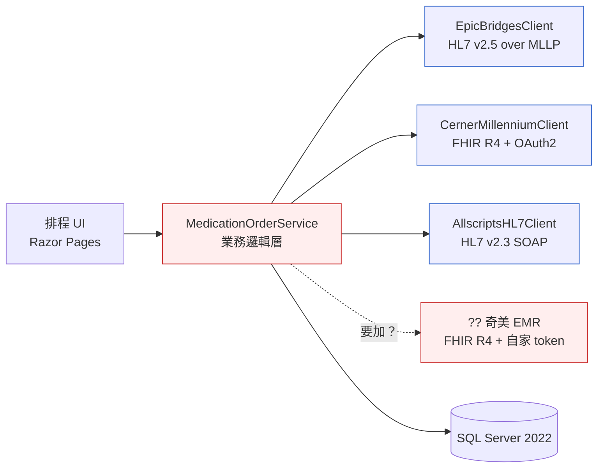
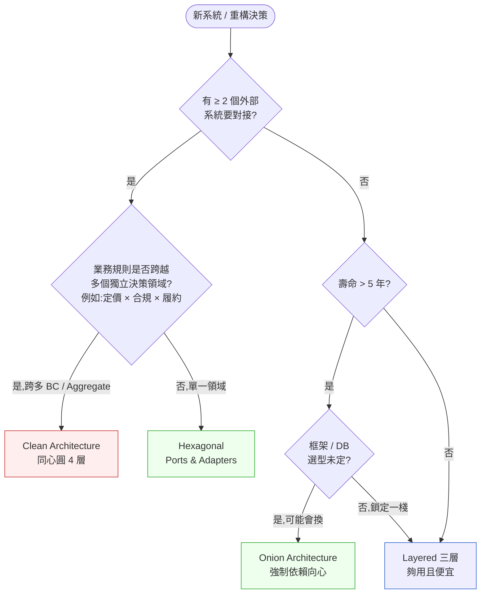
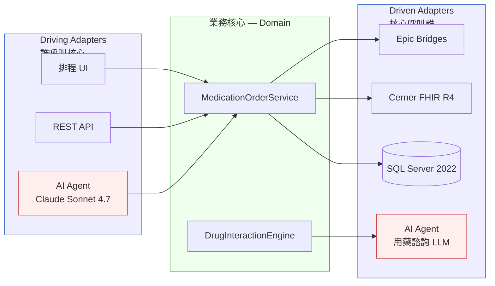

# 第 13 章|架構風格實戰
## ⸺ 分層、六角、洋蔥、Clean,各擋哪一種變動

> **前置閱讀**:[Ch 11 設計原則(SOLID / GRASP)](./ch-11-architecture-principles.md)、[Ch 12 元件與模組化](./ch-12-design-patterns.md)
> **下游章節**:[Ch 18 DDD 戰術設計](../part-04-architecture/ch-18-ddd-strategic-tactical.md)、[Ch 21 Modular Monolith](../part-04-architecture/ch-21-modular-monolith.md)、[Ch 37 AI-Native 架構](../part-07-ai-era/ch-37-ai-native-architecture.md)
> **延伸補章**:無

---

## 13.1 冷觀察 ⸺ 第 9 個 Adapter,讓人停下來重畫圖

我在 2025 年第四季,陪一家虛構的醫院資訊系統廠商 **CareLattice Health**(`CASE-HCR-003`)做架構檢視。他們的旗艦產品是一套門急診排程與用藥安全核對引擎,2018 年用 ASP.NET Core 寫成傳統三層(Presentation / Business / Data),撐了七年、撐到 18 個區域醫院、上千個診間。問題不是規模,是**對接**。

七年裡他們陸續對接過六家不同的院端 EMR:Epic Bridges 兩家、Cerner Millennium 四家、自家的輕量 EHR 三家、外加一家用 Allscripts 的舊客戶 ⸺ 加上一個剛簽下、用奇美自研 EMR 的中型醫學中心,總共第 9 個外部系統要進來。架構長把整套系統的依賴圖印出來釘在牆上,看了五分鐘,叫團隊把整面牆拆掉。

> 「我們的 `MedicationOrderService` 直接 `using` 了 `EpicBridgesClient`、`CernerMillenniumClient`、`AllscriptsHL7Client` 三個 namespace。要加奇美,我們要 `#if AHIS` 嗎?」

那張圖長這樣 ⸺ 業務邏輯被三個外部 API 吃進去半身:



事故不是當下發生的,事故已經發生過 14 次,只是每次都被當成小問題:某家醫院 Epic 升級了 Bridges 版本,他們的 `MedicationOrderService` 在另一家用 Cerner 的醫院跑出 NullReferenceException,因為一段「為了支援新欄位」的程式碼順手改了共用的 DTO。三層架構在他們手裡沒有錯,**錯的是這套三層架構從來沒有設計過「怎麼擋第三方 API 變動」這件事**。

技術主管在白板前畫了第二張圖,把外部 API 全部推到圓圈外面 ⸺ 那是六角架構(Hexagonal Architecture)在會議室裡的第一次出現:

> 「我們不是要重寫一切。我們是要讓**第 10 個 Adapter**進來的時候,沒有人需要動 `MedicationOrderService` 一行。」

那場會議結束後,團隊花了七個月,把 `MedicationOrderService` 周圍的依賴方向**反轉**過來。寫程式的人沒有變,程式碼也沒有減少多少,但七個月後加入的第 11 個外部系統(一家用 InterSystems IRIS 的長照機構),從簽約到 UAT 通過用了 19 天。對比之前 Allscripts 那家用了 14 週。

差別不在語言、不在框架、不在 AI。差別在**哪一個方向被擋住了**。

---

## 13.2 真問題 ⸺ 四種風格不是好壞,是抗哪一種變動

「分層、六角、洋蔥、Clean,哪一個最好?」這是新人在面試常問、資深架構師在 staff meeting 也常問的問題。把它拆開來看會比較清楚:這四種架構不是同一個維度上的競爭品,**它們處理的是「四種不同方向的變動」**。選錯架構,通常不是選了一個爛架構,是搞錯這次最怕誰變。

### 13.2.1 變動的四個方向

一個系統會被什麼戳穿?把現場常見的事故型態壓進四個維度,大致長這樣:

| 變動方向 | 來源 | 典型事故 | 該擋的架構 |
|---|---|---|---|
| **業務邏輯變動** | 內部商業規則改、新功能加 | 同一個函式 800 行,改一行影響三個地方 | **分層架構(Layered)** |
| **邊界系統變動** | 第三方 API 升版、廠商被併購、協議切換 | 第 9 個外部系統進來,業務邏輯被綁架 | **六角架構(Hexagonal)** |
| **依賴方向錯置** | 領域模型反過來依賴框架 / DB | ORM 換版、ASP.NET → Minimal API,核心模型也要改 | **洋蔥架構(Onion)** |
| **跨層次同時變動** | 規則、整合、儲存全在動 | 拆服務 / 換 DB / 換認證,所有層一起重寫 | **Clean Architecture** |

換句話說,選擇架構風格的第一個問題不是「哪個最好」,而是**這次最怕誰變**。CareLattice 的故事是個好範例,但要仔細讀。

他們 2025 年的問題,嚴格來說不是「分層架構天生不擋邊界變動」,而是**分層架構下的「業務邏輯層」從來沒有設計抽象邊界**。分層 ≠ 沒有介面;一個在 Business Layer 內正確建立 Adapter 介面與實作的分層系統,同樣能換掉外部 API。理論上,CareLattice 可以不換架構風格,只在三層架構裡補一組 `IPatientChartGateway` + 各家實作,把三個直接引用封裝掉,問題就解決了一半。

那為什麼還要換六角?**差別在「哪種風格讓這件事更顯眼、更難偷懶」**。分層架構的概念中心是「責任垂直分群」(Presentation / Business / Data),它沒有一個名詞叫「Port」或「Adapter」,也沒有明確的結構要求強迫你在業務邏輯與外部之間劃介面。所以當業務快速成長、工程師輪替的時候,分層系統裡最容易被省略的正好是這層隔離 ⸺ `MedicationOrderService` 直接 `using EpicBridgesClient` 在分層的命名空間裡「感覺沒那麼違規」。六角架構的結構語言就是 Port + Adapter,少了 Port,架構圖本身就少了一塊,Code review 時立刻顯眼。**選擇架構風格,同時也在選擇你想讓哪一類問題最難被忽視。**

CareLattice 在 2018 年選分層是對的,因為當時最怕業務邏輯混亂。到了 2025 年,邊界變動成為主威脅,分層的命名結構對這類問題沒有視覺約束力 ⸺ 那是他們該升級風格的時刻。

### 13.2.2 四種風格的本質

把四種風格用一句話講完,而不是用一頁:

- **分層架構(Layered / N-Tier)**:用「責任分組」擋業務複雜度。Presentation 不直接讀 DB,Business 不直接渲染 UI。這是 1990 年代企業 Java / .NET 系統的預設值,Microsoft Patterns & Practices 在 2009 的 *Application Architecture Guide v2* [^CIT-130] 裡把它畫成了標準圖。它的有效範圍是「業務變,但邊界不變」⸺ 一旦邊界開始變,Business Layer 會被 Data Layer 跟外部 Client 同時拉扯。

- **六角架構(Hexagonal,又名 Ports & Adapters)**:Alistair Cockburn 在 2005 年提出 [^CIT-131],核心主張只有一句:**業務邏輯不應該知道誰在跟它講話、它在跟誰講話**。所有外部互動(UI、DB、第三方 API、訊息佇列)都透過「Port(介面)+ Adapter(實作)」進入,業務邏輯只認得 Port。把這件事畫成圖,就是一個六邊形,業務在中央,Adapter 圍在外面。它擋的是**邊界變動** ⸺ 換 Adapter 不影響核心。

- **洋蔥架構(Onion)**:Jeffrey Palermo 在 2008 年提出 [^CIT-132],針對的是傳統三層裡常見的「依賴方向錯置」⸺ Domain Model 反過來 `using` 了 Entity Framework、`using` 了 ASP.NET 的 `HttpContext`。Palermo 的洋蔥圖把依賴強制推向中心:外圈可以依賴內圈,內圈絕對不能反向。Domain Model 在最內層,Repository 介面也在內層,實作放外層。它擋的是**依賴方向錯置** ⸺ 框架升版、ORM 換版、IoC container 換廠牌,核心模型不動。

- **Clean Architecture**:Robert C. Martin 2017 年在同名書籍 [^CIT-133] 集大成,把 Hexagonal、Onion、DCI、Screaming Architecture 等先前風格的共同精神壓成一張同心圓圖:Entities → Use Cases → Interface Adapters → Frameworks & Drivers。它的核心規則是**依賴規則(Dependency Rule)**:「source code dependency 永遠指向中心」。它擋的是**全方位變動** ⸺ 業務、邊界、依賴方向、跨層次同時動,Clean 都能撐住,代價是抽象層數最深、入場成本最高。

### 13.2.3 為什麼分層在 2026 年依然不死

把上面那段讀完,容易得到一個錯誤結論:「Clean 既然全部擋,就用 Clean 就好」。這在現場通常是災難。

- 一個 8 人團隊、3 個內部工具、一年壽命、沒有第三方整合的 SaaS 後台,用 Clean 寫,每個 Use Case 要動 4 ~ 6 個檔案、跨 4 圈同心圓,大部分時間在維護抽象介面而不是寫業務。
- 一個 200 人團隊、20 年壽命、要對接 12 個外部支付閘道與 5 個合規系統的 fintech 主交易系統,用分層寫,六個月後業務邏輯會被外部 SDK 倒灌成義大利麵。

換句話說,**架構風格的成本是真實的**:抽象層越多,讀懂越慢、改動越貴、新人上手越久。Clean 的代價在 8 人 SaaS 後台收不回來;分層的代價在 200 人 fintech 系統會以另一種形式付出。下一段給你一張對照表來判斷。

---

## 13.3 決策框架 ⸺ 這次該選哪一種

下面這幾張表跟一張決策樹,在現場相當好用。前提是先回答一個問題:**這次要擋的變動方向,是哪一種**。

### 13.3.1 風格 vs 抗變動類型對照表

| 變動類型 | 分層(Layered) | 六角(Hexagonal) | 洋蔥(Onion) | Clean |
|---|---|---|---|---|
| **業務邏輯變動** | ★★★ 直接擋 | ★★★ 業務在核心 | ★★★ Domain 在最內 | ★★★ Use Cases 圈擋 |
| **邊界系統變動** | ★ 容易被綁架 | ★★★ Adapter 換掉就好 | ★★ 透過 Repo 介面 | ★★★ Interface Adapter 圈 |
| **依賴方向錯置** | ✗ 三層常雙向耦合 | ★★ Port 強制方向 | ★★★ 同心圓硬規 | ★★★ Dependency Rule |
| **跨層次同時變動** | ✗ 一起爛 | ★★ 邊界穩、其他靠團隊紀律 | ★★ 內外穩、跨圈靠紀律 | ★★★ 全部隔離 |
| **可測試性(無 mock 框架)** | ★ 須整合測 | ★★★ Adapter 全 mock | ★★★ 從外往內 mock | ★★★ 完整 Test Pyramid |
| **新人上手** | ★★★ 一週懂 | ★★ 兩三週懂 Port/Adapter | ★★ 兩三週懂依賴規則 | ★ 一個月以上 |

**這張表的關鍵不是行,是列**:從「最怕誰變」那一欄往下看,在你最怕的那一行找最高分,通常就是這次該選的風格。CareLattice 在 2018 年最怕「業務邏輯變動」,分層 ★★★ 對;2025 年最怕變成「邊界系統變動」,六角 ★★★ ⸺ 那是他們該換的時刻。

這裡要補充一個細節:「邊界變動」那一行,六角(★★★)和 Clean(★★★)分數相同。那 CareLattice 為什麼選六角而不選 Clean?答案不在這張表的行,而在下一張表的成本列。他們是 7 人團隊、只有一個 Web UI、系統壽命預估 5–7 年 ⸺ 對照 §13.3.2 入場成本表,Clean 的同心圓在這個規模上 ROI 收不回來。六角已經足夠。**抗變動對照表選出候選人,成本表做最終決定。**

### 13.3.2 入場成本對照表

抗變動能力是收益面,但成本面也得攤開來看 ⸺ 否則容易看到「Clean 全 ★★★」就直接選 Clean。

| 維度 | 分層 | 六角 | 洋蔥 | Clean |
|---|---|---|---|---|
| **檔案數(同一個 Use Case)** | 3(Controller / Service / Repo) | 5(+ Port、Adapter) | 5(+ Domain、Repo Interface) | 7+(Entity / UC / Boundary / Adapter / Presenter / ...) |
| **學習曲線** | 1 週 | 2~3 週 | 2~3 週 | 4~8 週 |
| **典型專案規模** | 5~20 人 | 10~40 人 | 10~40 人 | 20+ 人或長壽命系統 |
| **適合壽命** | 3 年內 | 5~10 年 | 5~10 年 | 10 年+ |
| **典型過度設計訊號** | (低) | 沒有第二個 Adapter 卻先做了介面 | 三層都擠在一個 module | 滿屋抽象只跑單一資料庫 |
| **典型代表** | 內部工具、後台、報表系統 | 多 Adapter 整合系統(EMR、支付) | DDD 樣板專案、企業 .NET | 銀行核心、電信計費、合規重的系統 |

**現場節奏建議**:預設值走**六角**。它對邊界變動的擋法是「投資前移」⸺ 你預先寫了介面,即使第二個 Adapter 從來沒進來,程式碼結構也不算過度設計(因為 mock 測試本來就需要)。分層在新建系統 3 年內是夠的,但要先問自己:「3 年內會不會出現第二個外部整合?」會的話,直接從六角開始,不要先分層、後補介面 ⸺ 後補的成本是預先寫的 3 倍以上。

### 13.3.3 決策樹:這次該選哪一種



這張圖有一個關鍵設計選擇值得說明:**Q1(外部系統數)和 Q2(業務規則跨 BC)是兩個獨立維度**。一個對接 20 個外部系統但業務邏輯只是資料搬運的同步工具,Q2 回答「否」⸺ 走 Hexagonal 就夠,不需要 Clean。Clean 的 Use Case 圈成本是真實的,它的 ROI 只在「業務規則本身要跨越多個獨立決策領域(各自有 Aggregate、各自有不變量)」時才收得回來。跨 BC 的例子:用藥安全規則同時依賴「藥局庫存 Aggregate」「患者病史 Aggregate」「保險給付規則 Aggregate」,任何一個改都會影響核心流程。這種才算 Q2 = 是。

這張圖的關鍵是綠色那兩個出口 ⸺ **多數現場走 Hexagonal 或 Onion 就夠**。Clean 留給「業務規則確實橫跨多個獨立決策領域」的場景(銀行核心、保險理賠、健保 DRG 結算引擎)。Layered 留給「邊界穩定 + 短壽命」⸺ 這個組合在 2026 年比想像中常見:內部 BI 後台、行政流程系統、一次性遷移工具。

### 13.3.4 程式碼長相:Port + Adapter 的最小骨架

把 CareLattice 的 `MedicationOrderService` 拉回來看,六角風格下它應該長這樣(C# 13 / .NET 9,2026 主流 LTS):

```csharp
// ===== 領域層(Core) — 不依賴任何外部 =====

namespace CareLattice.Core.Medication;

// Port:核心定義它「需要什麼」,不關心由誰提供
public interface IPatientChartGateway
{
    Task<PatientChart> FetchAsync(Mrn mrn, CancellationToken ct);
}

public interface IDrugInteractionEngine
{
    Task<IReadOnlyList<Interaction>> CheckAsync(Order order, CancellationToken ct);
}

// 業務邏輯:只認 Port
public sealed class MedicationOrderService(
    IPatientChartGateway charts,
    IDrugInteractionEngine interactions)
{
    public async Task<OrderResult> PlaceAsync(Order order, CancellationToken ct)
    {
        var chart = await charts.FetchAsync(order.Mrn, ct);
        var conflicts = await interactions.CheckAsync(order, ct);
        // 業務邏輯:沒看過 Epic、Cerner、SQL Server、Razor Pages
        return chart.IsSafeFor(order, conflicts)
            ? OrderResult.Accepted(order)
            : OrderResult.Rejected(conflicts);
    }
}
```

```csharp
// ===== Adapter 層 — 各自實作 Port,可獨立替換 =====

namespace CareLattice.Adapters.Epic;

// 對接 Epic Bridges(HL7 v2.5 over MLLP)
public sealed class EpicBridgesChartAdapter(MllpClient mllp) : IPatientChartGateway
{
    public async Task<PatientChart> FetchAsync(Mrn mrn, CancellationToken ct)
    {
        var qry = Hl7V25.BuildQryA19(mrn);
        var adr = await mllp.SendAsync(qry, ct);
        return Hl7V25.ParseAdrA19(adr);
    }
}

namespace CareLattice.Adapters.Cerner;

// 對接 Cerner Millennium(FHIR R4 + OAuth2)
public sealed class CernerFhirChartAdapter(IFhirClient fhir) : IPatientChartGateway
{
    public async Task<PatientChart> FetchAsync(Mrn mrn, CancellationToken ct)
    {
        var bundle = await fhir.SearchAsync<Patient>(
            new[] { ("identifier", $"MRN|{mrn.Value}") }, ct);
        return FhirR4.ToPatientChart(bundle);
    }
}
```

加入第 9 家奇美自研 EMR,新增的程式碼只是一個 `AhisFhirChartAdapter` 類別,和一行 DI 註冊。`MedicationOrderService` 一個字都不用動 ⸺ 這就是抗邊界變動具體長什麼樣。

### 13.3.5 2026 視角:AI Agent 充當 Adapter

AWS 在 2026 Q1 的 *Hexagonal Architecture for AI-Augmented Systems* [^CIT-134] 把六角架構的觀念延伸了一步:**AI Agent(LLM-driven adapter)在架構上就是另一種 Adapter**。如果你的系統需要呼叫 Claude Opus / Sonnet 做臨床摘要、需要呼叫 Bedrock Agent 做用藥諮詢,從架構視角看,它們跟 Epic、Cerner 沒有差 ⸺ 都是「外部、不可控、會升版、會幻覺」的系統。



這個視角的好處是:**LLM 的不可控性,被 Adapter 邊界吃掉了**。Hallucination 在 Adapter 內部處理(retry、refusal、guardrail);business invariant(用藥安全規則)留在 Core,不被模型輸出污染。Anthropic 的 *Building Effective Agents* [^CIT-135] 強調 Agent 應該被視為「能自主決策的 component」,而六角架構提供的正是這個 component 該在的位置。

換個角度:如果你 2026 年要把 LLM 塞進一個既有的「分層架構」系統,通常要重畫架構。如果是「六角架構」,只是新增一個 Adapter,連介面都不用改。這也是為什麼 AWS 那篇 blog 直接把 Hexagonal 訂為「AI-Augmented Systems」的預設參考架構。

---

## 13.4 踩坑清單

下面這四個常見地雷,在 healthcare、fintech、ecommerce 都看得到。它們的共同點是「形式上採用了某種架構風格,但實質上沒有產生抗變動能力」。每一個都附修正方向,下次遇到可以這樣處理。

### 反模式 1:分層架構但業務邏輯散在 Controller

宣稱用三層架構,但 `OrderController` 裡面 250 行,直接 `_dbContext.Orders.Where(...)`、直接呼叫 Stripe SDK、直接 `_emailSender.Send(...)`。Service 層只是個薄薄的轉接,什麼業務都沒做。半年後同樣的下單邏輯出現在 `AdminOrderController`、`MobileOrderController`、`B2BOrderController` 裡 ⸺ 一份業務規則,四份散在不同 Controller 的副本。

> ✅ **修正方向**:把判準訂在「Controller 不能 `await` 任何 DbContext / SDK / EmailSender」⸺ 它只能 `await _service.DoSomething(...)`。寫不出對應 Service 方法的 Controller 行為,通常是業務概念還沒被命名。先補命名,再寫程式碼。Fitness Function 在 CI 加一條:Controller 引用 DbContext 直接擋 PR。三層架構的價值在「責任分組真的被執行」,不在於它的圖好看。

### 反模式 2:Hexagonal 只做 Port 沒做真正的 Adapter

這個地雷在「為了擋 mock 而做六角」的團隊最常見:寫了 `IPaymentGateway` 介面、寫了一個 `StripePaymentGateway` 實作,然後 ⸺ 沒有第二個 Adapter,測試裡也只有 Stripe 的整合測試,沒有用 mock 換掉 Stripe 的單元測試。Port 變成裝飾,Adapter 變成單身,結構像六角、行為像分層。

> ✅ **修正方向**:六角的價值不在介面,在「介面能換進至少兩個實作 + 測試」。最低劑量是兩個:**真正的 Adapter + 測試用的 Fake/Stub Adapter**。如果只有真實 Adapter,就還沒進入六角架構,只是寫了個多餘介面。判準:能不能在 5 秒內把整個系統切成「全 Fake 模式」跑完整 happy path?能的話才是真的 Hexagonal。CareLattice 七個月遷移裡,真正花時間的不是寫介面,是補 in-memory Fake Adapter 把測試速度從 14 分鐘壓到 22 秒。

### 反模式 3:Onion 三層全擠在一個 module

宣稱用洋蔥架構,但整個 solution 只有一個 `MyApp.csproj`,Domain / Application / Infrastructure 用 namespace 區隔,沒有用 project 區隔。結果是 Domain class 可以隨便 `using Microsoft.EntityFrameworkCore` ⸺ compiler 不擋,reviewer 也常常漏掉。半年後 Domain 內部已經混了 EF Core、Serilog、AutoMapper 三個外部相依,洋蔥的同心圓在 IDE 裡完全看不出來。

> ✅ **修正方向**:洋蔥的依賴規則必須**被編譯器強制**,不能只靠 reviewer。把至少三個 project 拆出來:`Domain`(零外部 NuGet,連 Microsoft.Extensions.* 都不裝)、`Application`(只引 Domain)、`Infrastructure`(引 Application + 外部框架)。Project reference 自然形成單向箭頭,違反者連編譯都過不了。NetArchTest [^CIT-136] 或 ArchUnitNET 在 CI 跑「Domain 不依賴 Microsoft.EntityFrameworkCore」這條規則,擋掉所有想偷懶的 PR。同心圓如果不在 .csproj 裡,它就不在系統裡。

### 反模式 4:Clean Architecture 寫了滿屋抽象但只跑單一資料庫

最容易在「讀完 Uncle Bob 的書、團隊年輕、還沒被現實打過」的場景出現:每個 Use Case 都拆 `IRequest` / `IRequestHandler` / `IPresenter` / `IBoundary`,Entity 跟 Use Case 之間還插一層 `IUseCaseInputBoundary`。整個系統其實只跑一個 PostgreSQL、只給一個 Web UI 用、只有 4 個工程師、24 個月 roadmap。Clean 的同心圓在這個規模上,只是把寫一個 CRUD 從 3 個檔案膨脹到 9 個檔案。

> ✅ **修正方向**:Clean 的 4 圈不是免費的 ⸺ 每多一圈,讀懂時間就 +50%。判準很實際:**有沒有第二個 UI、第二個 DB、第二種交付形式(CLI / batch job / webhook)在 roadmap 上**?三項都沒有,Clean 的 ROI 收不回來,降成 Hexagonal 或 Onion 就好。如果一年內會冒出第二種交付形式(例如要從 Web 加 mobile + CLI),Clean 的投資才會開始回本。架構風格的成本是真實的,不要為了書上的圖付這個錢。

---

## 13.5 交付清單 ⸺ 一頁式 Architecture Style Selection Card

每一個新專案、每一個重大重構,**第一份要產出的不是 ADR,是 Architecture Style Selection Card**。它是一張卡片,寫不滿就是還沒想清楚這次到底在擋什麼。

把它存在 `docs/architecture/style-selection.md`,跟 ADR 同層、跟 C4 圖同 PR 更新。

````markdown
# Architecture Style Selection Card — {專案名稱}

> 版本:v0.1 | 撰寫日期:YYYY-MM-DD | 擁有人:{名字}
> 對應 ADR:`docs/adr/00NN-architecture-style.md`

## 1. 這次最怕誰變?(主威脅)
- [ ] 業務邏輯變動 — 規則複雜、會頻繁改
- [ ] 邊界系統變動 — 多個外部 API、廠商可能升版
- [ ] 依賴方向錯置 — 框架/DB 可能換、長壽命系統
- [ ] 跨層次同時變動 — 業務、邊界、儲存都在動
- 主威脅(擇一):________
- 次威脅(可選):________
- 證據:{過去 12 個月發生過的事故 / roadmap 上已知的風險}

## 2. 風格選擇與依據
- 選擇:☐ Layered  ☐ Hexagonal  ☐ Onion  ☐ Clean
- 依據(對應 §13.3.1 對照表):
  - 主威脅那一行,所選風格得分:______
  - 入場成本是否負擔得起(對照 §13.3.2):是 / 否
- 不選擇 Clean 的理由(若沒選 Clean):
  - 第二個 UI / 第二種交付形式在 roadmap 上嗎?是 / 否
  - 系統壽命預估:______ 年

## 3. 入場成本承諾
- 預估第一個 Use Case 從 0 到上線的工期:______ 人天
- 新人 onboarding 到能獨立交付一個 Use Case:______ 週
- 額外抽象帶來的「每個 Use Case 多寫的檔案數」:______
- 我們願意付這個成本,因為:______

## 4. 半年後驗證指標(不通過則重評估)
- [ ] 加入第 N+1 個外部整合,核心業務模組變更行數 ≤ ______ 行
- [ ] 單元測試平均跑完時間 ≤ ______ 秒(全 Fake Adapter 模式)
- [ ] Domain 模組未引入任何框架 NuGet / package(由 NetArchTest 強制)
- [ ] 新人從 onboard 到第一個 PR merged ≤ ______ 天
- [ ] 重大架構升版(框架 / DB / Cloud)不需動 Domain 模組

## 5. Out of Scope(本次不做)
- 我們**不**為了「以後可能換 X」而預先抽象 ⸺ 真的要換時再做
- 我們**不**強迫所有模組用同一個風格(可有 monolith + 1 個微服務 + 1 個 batch)
- 我們**不**把 Clean 當預設 ⸺ Hexagonal 是預設,Clean 是升級

## 6. Owners(誰要為哪部分負責)
| 區塊 | Owner | 副手 |
|---|---|---|
| Domain 邊界守護(NetArchTest 規則) | | |
| Adapter 介面契約 | | |
| 測試骨架(Fake Adapter 維護) | | |
| Onboarding 文件 | | |
````

**為什麼是一頁?** 一頁的篇幅會逼出「這次最怕誰變」這個答案。如果寫不出主威脅,通常意思是還沒問過利害關係人「過去 12 個月你們最常處理的事故是什麼」⸺ 那是選風格之前要先做的事。

**為什麼有「半年後驗證指標」?** 架構選擇的代價,半年內看不出來,12 個月後才會浮現。把指標預先寫死,半年後拿出來對 ⸺ 沒對上,就是該重新評估的訊號,而不是繼續硬撐。

**為什麼有「Out of Scope」?** 沒寫下來的範圍,半年後一定會冒出「我們是不是該全面導入 Clean」這種會議。把它預先擋掉,團隊省下的時間用來寫程式比較划算。

### 13.5.1 範例:CareLattice 在第 9 個 EMR 簽約那週寫的這張卡

那場「我們不是要重寫一切,我們是要讓第 10 個 Adapter 進來時沒人需要動 `MedicationOrderService`」的會議散會後,架構長把下面這張卡釘在 `docs/architecture/` 第一份 commit。七個月後遷移結束,第 11 個外部系統(InterSystems IRIS 長照機構)從簽約到 UAT 通過用了 19 天 ⸺ 對比 Allscripts 那家當年的 14 週。

````markdown
# Architecture Style Selection Card — CareLattice MedicationOrderService

> 版本:v0.1 | 撰寫日期:2025-10-21 | 擁有人:@chen(架構長)
> 對應 ADR:`docs/adr/0007-hexagonal-medication-order.md`

## 1. 這次最怕誰變?(主威脅)
<!-- 為什麼這欄:沒寫主威脅,風格選擇就會變成「哪個聽起來潮」;
     CareLattice 2018 選 Layered 沒錯,2025 主威脅換了卻沒換風格,代價就是 14 次小事故。 -->

- [ ] 業務邏輯變動  [x] **邊界系統變動(主)**
- [x] 依賴方向錯置(次)  [ ] 跨層次同時變動
- 證據:過去 7 年對接 6 家 EMR(Epic / Cerner ×2、Allscripts、自家 EHR ×3)
  + 第 9 家(奇美自研 FHIR)簽約;`MedicationOrderService` 直接 `using`
  三家 client namespace,過去 12 個月為此產生 14 次小事故

## 2. 風格選擇與依據

- 選擇:☐ Layered  ☑ Hexagonal  ☐ Onion  ☐ Clean
- 依據(對照 §13.3.1):邊界變動列得分最高 = Hexagonal
- 入場成本是否負擔得起:**是**(7 人團隊已熟悉 DI,新增 Port 介面 + Fake Adapter 模式)
- 不選擇 Clean 的理由:
  - 第二個 UI / 第二種交付形式在 roadmap 上嗎?**否**(只有 Razor Pages)
  - 系統壽命預估:5–7 年(可接受 Hexagonal,Clean 多付的抽象沒收益)

## 3. 入場成本承諾
<!-- 為什麼這欄:架構選擇不寫成本,半年後沒人記得當初承諾;
     寫了成本,未來爭議會在數字上,而不是在「我覺得」「你覺得」。 -->
- 預估第一個 Use Case(下一條藥囑核對規則)0 → 上線:**14 人天**
- 新人 onboarding 到第一個 PR merged:**3 週**
- 額外抽象:每個 Use Case 多寫 ~3 個檔案(Port + InMemoryAdapter + Test)
- 我們願意付,因為:第 10 個 Adapter 進來時要動 0 行業務 code

## 4. 半年後驗證指標
<!-- 為什麼這欄:架構代價半年內看不出來;
     沒事先寫死指標,半年後爭議會變成「感覺好像有變好」。 -->
- [ ] 第 10 個外部 EMR 進來,核心模組變更行數 ≤ **20** 行
- [ ] Domain 單元測試跑完 ≤ **8** 秒(全 Fake Adapter 模式)
- [ ] `MedicationOrder.Domain` 不引入任何 NuGet(NetArchTest 強制)
- [ ] 新人從 onboard 到第一個 PR merged ≤ **15** 天
- [ ] 升 .NET / EF / SQL Server 不需動 Domain 模組

## 5. Out of Scope(本次不做)
- 我們**不**為「以後可能換 SQL Server → PostgreSQL」預先抽象 ⸺ 真要換時做
- 我們**不**強迫 Razor UI 層也走 Hexagonal(只 `MedicationOrderService` 邊界)
- 我們**不**把 Clean 當預設 ⸺ Hexagonal 才是,Clean 是七年後可能的升級

## 6. Owners
| 區塊 | Owner | 副手 |
|---|---|---|
| Domain 邊界守護(NetArchTest 規則) | @chen | @lin |
| Port / Adapter 介面契約 | @lin | @yu |
| Fake Adapter 維護 | @yu | @lin |
| Onboarding 文件 | @hwang | @chen |
````

第 7 個月,新加入的 InterSystems IRIS 長照機構接過 UAT。架構長把當初寫進第 4 段的指標逐欄打勾 ⸺ 五項全綠。**架構選擇真正的工作不是「畫圖那天」,而是把六個月後的爭議,提前壓進一張可以重看的卡。**

---

## 13.6 本章交付清單 Recap

讀完本章,你應該已經能做到:

- [ ] 講清楚四種架構風格各擋哪一種變動:分層擋業務、六角擋邊界、洋蔥擋依賴方向、Clean 全擋但代價最高
- [ ] 在面對新專案 / 重大重構時,先用 §13.3.1 的對照表回答「這次最怕誰變」,再選風格 ⸺ 而不是反過來
- [ ] 在會議上認得出四個反模式(Controller 肥、Port 沒 Adapter、Onion 同 module、Clean 過度抽象),並有一句話的修正方向
- [ ] 為手上的專案寫好一份 Architecture Style Selection Card,並把半年後驗證指標寫死

如果四項中先挑一項做完就好,建議從最後那一項 ⸺ 把目前主系統的 style selection card 補出來,**寫不出主威脅或寫不出半年驗證指標**的那個系統,就是下一輪該做架構檢視的對象。本書 Ch 18 會接著談 DDD 戰術設計,Ch 21 會展開 Modular Monolith 的內部風格組合,Ch 37 會把 AI-Native 架構接到本章六角的延伸視角上。

---

## Cross-References

- **回顧**:[Ch 11 設計原則(SOLID / GRASP)](./ch-11-architecture-principles.md)、[Ch 12 元件與模組化](./ch-12-design-patterns.md)
- **下一章**:[Ch 14 設計模式(GoF + 現代延伸)](./ch-12-design-patterns.md)
- **DDD 戰術設計**:[Ch 18](../part-04-architecture/ch-18-ddd-strategic-tactical.md) ⸺ Aggregate / Repository / Domain Service 在 Hexagonal/Onion 裡的位置
- **模組化單體**:[Ch 21](../part-04-architecture/ch-21-modular-monolith.md) ⸺ 多模組系統內部如何混用不同風格
- **AI-Native 架構**:[Ch 37](../part-07-ai-era/ch-37-ai-native-architecture.md) ⸺ AI Agent 作為 Adapter 的進階實踐

## 引用

[^CIT-130]: Microsoft Patterns & Practices Team, *Microsoft Application Architecture Guide, 2nd Edition* (Microsoft Press, 2009)。N-Tier / Layered Architecture 在企業 .NET 的標準參考。
[^CIT-131]: Alistair Cockburn, "Hexagonal Architecture" (alistair.cockburn.us, 2005)。Ports & Adapters 原始提案。
[^CIT-132]: Jeffrey Palermo, "The Onion Architecture: part 1" (jeffreypalermo.com, 2008-07-29) 系列四篇。
[^CIT-133]: Robert C. Martin, *Clean Architecture: A Craftsman's Guide to Software Structure and Design* (Prentice Hall, 2017)。
[^CIT-134]: AWS Architecture Blog, "Hexagonal Architecture for AI-Augmented Systems" (aws.amazon.com/blogs/architecture, 2026 Q1)。把 LLM / Agent 視為 Adapter 的參考架構。
[^CIT-135]: Anthropic, "Building Effective Agents" (anthropic.com/research/building-effective-agents, 2024 起持續更新)。同 CIT-009。
[^CIT-136]: NetArchTest / ArchUnitNET — .NET 生態的架構規則靜態檢查工具。github.com/BenMorris/NetArchTest;github.com/TNG/ArchUnitNET。
[^CIT-137]: HL7 International, "HL7 Version 2.5 Standard" 與 "FHIR R4 Specification" (hl7.org)。本章 Adapter 範例引用 HL7 v2.5 ADT/QRY 訊息族與 FHIR R4 `Patient` / `MedicationRequest` 資源。同 CIT-088。
[^CIT-138]: Epic Systems, "Epic Bridges Integration Guide" 與 Oracle Cerner, "Cerner Millennium Open Developer Experience (code.cerner.com)"。本章 Adapter 對接細節參考公開廠商整合文件。

---
