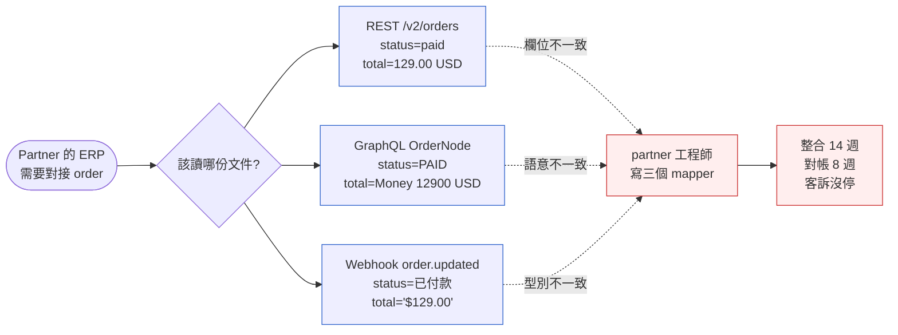
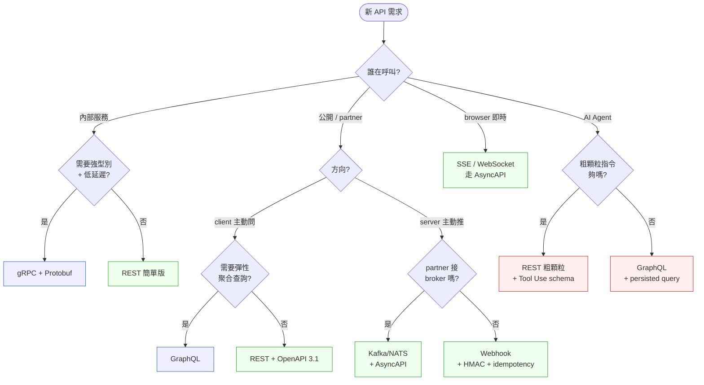

# 第 14 章|API 設計
## ⸺ REST、GraphQL、gRPC、Webhook、AsyncAPI 各自定義不同的信任邊界

> **前置閱讀**:[Ch 11 架構風格與選型](../part-03-design/ch-11-architecture-principles.md)、[Ch 13 介面與整合設計](../part-03-design/ch-13-architecture-styles.md)
> **下游章節**:[Ch 22 微服務拆分](../part-04-architecture/ch-22-microservices.md)、[Ch 23 Event-Driven 架構](../part-04-architecture/ch-23-event-driven-cqrs-es.md)、[Ch 36 AI Agent 友善架構](../part-07-ai-era/ch-36-ai-native-architecture.md)
> **延伸補章**:無

---

## 14.1 冷觀察 ⸺ 同樣是 order,三套 schema 對不起來

我在 2026 年第一季,進到一家虛構電商開放平台 **HarborGate**(`CASE-ECM-004`)做四週的 API 治理體檢。

HarborGate 不算小。GMV 一年大約 12 億美元,200 多家 partner 透過它的開放平台串接 ⸺ 物流商、行銷工具、ERP 廠商、跨境清關代理。技術棧蠻典型的:Node.js 22 + Spring Boot 3.3 + PostgreSQL 17,加上 Kafka 3.7 與一條跑了五年的 Webhook 推送管線。Stripe 接金流、Algolia 接搜尋、CloudFront 接 CDN。從外面看,看不出這家公司會出什麼問題。

那四週的引子是一封 partner 發出的抱怨信,標題我把它原樣記下來:

> 「同樣是一張 order,你們給我三本不同的書 ⸺ REST 文件叫它 `order`,GraphQL Schema 叫它 `OrderNode`,Webhook payload 又叫它 `purchase_event`。三個欄位數量不一樣,三個 timestamp 格式不一樣,三個 ID 規則不一樣。我寫一個對接,要學三套術語。」

partner 的工程師補了一句:

> 「你們是在賣 API,還是在賣三家不同公司的 API?」

事故會議室白板上貼了三張截圖。第一張是 REST `/v2/orders/{id}` 的 OpenAPI 文件,`status` 是 enum string(`paid` / `shipped` / `delivered`),`total` 是浮點數美元。第二張是 GraphQL Schema,`OrderNode.status` 是 enum,但值是 `PAID` / `SHIPPED` / `FULFILLED`(注意,fulfilled 不是 delivered),`total` 是 `Money` 型別(`{ amount: Int, currency: String }`,以最小貨幣單位儲存)。第三張是 Webhook 推 partner 的 `order.updated` payload,`status` 直接是中文字串「已付款」「已出貨」,`total` 是字串 "$129.00"。

三個 team 各做各的。REST 是 2019 年第一版開放平台的時候做的;GraphQL 是 2022 年某個前端工程師為了減少 mobile app 的請求次數加上的;Webhook 是 2024 年支付組為了 partner 對帳趕著上的。**沒有人是這三套 schema 的 owner**,也沒有人是「order 這個概念在開放平台上長什麼樣」的 owner。



更尷尬的是 Webhook 重試。partner 抱怨「同一筆 order.paid 收到三次,我們重複出貨」⸺ HarborGate 的 Webhook 重試機制有 exponential backoff,但**沒有 idempotency key**。partner 自己也沒做去重(因為他們以為 HarborGate 會去重)。三萬塊新台幣的貨重出兩次,事故賠款 partner 認列十二萬。

四週的調研到第二週,平台 VP 在會議上問了一句話:

> 「我以為 API 治理是寫 OpenAPI 文件這件事。為什麼我們有 OpenAPI 文件,還是會出這種事?」

這個問題本身就是答案。OpenAPI 文件是**結果**,不是治理。真正的治理在更前面的位置,在「我們為什麼要開放這個介面」「對方是誰」「對方拿這個介面做什麼」「我們對他的承諾到哪裡為止」。HarborGate 的 REST、GraphQL、Webhook 三套文件都寫了,但**這三個問題從來沒有被一起回答過**。

---

## 14.2 真問題 ⸺ API 不是「選協定」,是「定義信任邊界」

「該選 REST 還是 GraphQL?」這個問題在 2026 年的會議上還是會聽到。把它拆開來看,會發現它通常是錯的問題。

REST、GraphQL、gRPC、Webhook、AsyncAPI ⸺ 這五種協定不是同一個維度的選項,它們各自處理不同的信任模型。在會議上爭論「該選哪一種」之前,先問「對方是誰、要做什麼、信任邊界在哪裡」會省很多時間。

### 14.2.1 五種協定各自的信任邊界

REST(Roy Fielding 2000 年博士論文 *Architectural Styles and the Design of Network-based Software Architectures* 提出 [^CIT-140])在 web 規模證明的事情是:**讓 client 不需要知道 server 的內部結構**。HATEOAS(Hypermedia as the Engine of Application State)讓 client 跟著回應裡的連結走,而不是把 URL 結構寫死在自己這邊。這個信任邊界很寬:server 可以在不通知 client 的情況下重構自己的網址結構,只要連結還在,client 不會壞掉。

但 REST 預設是**陌生人之間的契約**。client 是誰、會問什麼、頻率多少、版本多舊,server 都不知道。這也是為什麼 REST 配 cache、配 ETag、配 OAuth 2.0、配 rate limit ⸺ 全套基礎設施都在處理「我不認識你,但我要服務你」這個前提。

GraphQL(Lee Byron 等人在 Facebook 提出,2015 年公開 spec [^CIT-141])處理的是另一個問題:**client 知道自己要什麼,但 server 不知道**。一個 mobile app 一頁可能要 7 個 REST endpoint(over-fetch 各自的多餘欄位 + under-fetch 還要再打一次),GraphQL 讓 client 一次描述完整需求。它假設的信任邊界比 REST 窄一些 ⸺ client 能下任意 query,意味著你必須相信 client 不會故意打爆你(深度限制、複雜度評分、persisted query 都在處理這件事)。

gRPC(Google 2015 年開源,基於 HTTP/2 + Protocol Buffers [^CIT-142])是**強型別的內部 RPC**。它假設兩端都是你自己控制的 ⸺ 同公司、同 monorepo、同部署管線。`.proto` 檔是雙方的契約,改了 proto 兩端就一起改。這個信任邊界最窄:你信任對方在你升級 schema 之前會跟著你升級。

Webhook 則是一個方向相反的信任問題:**你要主動推訊息給陌生人**。陌生人的 endpoint 可能掛、可能慢、可能在重啟、可能換了網址。所以 Webhook 的設計重心不在「協定」(它就是 HTTP POST),而在 idempotency key、HMAC 簽章、重試策略、棄用通知這些「對方不在線時你怎麼辦」的問題。

AsyncAPI(2017 年起,3.0 在 2024 年發布 [^CIT-143])則是把訊息式 API(MQTT、AMQP、Kafka、SSE、WebSocket)的契約格式化。它跟 OpenAPI 是姊妹規範,但處理的是**訂閱關係**而不是請求-回應關係。信任邊界的形狀完全不同 ⸺ 對方可能晚 30 秒才收到、可能斷線重連、可能要 replay 過去 24 小時的事件。

把這五個放在一張表上看會比較清楚:

| 協定 | 主問題 | 信任前提 | 互動模型 | 顆粒度 |
|---|---|---|---|---|
| **REST** | 陌生 client 服務 | 我不認識你,但要長期服務你 | 同步問答 | 資源 |
| **GraphQL** | client 主導查詢 | 你會自我節制(否則我會限制) | 同步聚合查詢 | 圖節點 |
| **gRPC** | 內部強型別 RPC | 我們同步升級 | 同步呼叫 | 方法 |
| **Webhook** | 主動推給陌生人 | 你可能不在線 | 非同步單發推送 | 事件 |
| **AsyncAPI** | 訂閱式串流 | 你可能斷線重連 | 非同步串流 | 訊息流 |

換句話說,在 HarborGate 的會議上爭論「該選哪一種」會繞不出來,因為**partner 拿一張 order 做的事不只一種**。partner 的 ERP 同步 order 細節 ⸺ 是 REST 的工作。partner 的 BI dashboard 一次拉 50 張 order 的彙總 ⸺ 是 GraphQL 的工作。partner 想被即時通知 order 狀態變化 ⸺ 是 Webhook 的工作。partner 內部訂閱平台 fulfillment 事件做即時補貨 ⸺ 是 AsyncAPI 的工作。

問題不在「選哪一種」,在「**這三套 schema 為什麼沒有共同的 order 模型**」。

### 14.2.2 顆粒度才是真正的議題:Wijesekare 2026 的觀察

Natasha Wijesekare 在 *Designing APIs for Agentic Consumers*(2026)[^CIT-144]裡提出一個很值得記下來的觀察:**API 顆粒度的選擇,過去是 server 為了內部清楚而設計,現在要為 consumer 的認知負擔而設計**。

她舉了一個對照組。一個訂單建立流程,在傳統 RPC 風格下會被拆成:

```
POST /v2/cart/items         ← 加入購物車
POST /v2/orders/draft       ← 建立草稿訂單
POST /v2/inventory/reserve  ← 預扣庫存
POST /v2/payments/authorize ← 授權支付
POST /v2/orders/confirm     ← 確認訂單
POST /v2/shipments/create   ← 建立出貨單
```

六個呼叫,六個錯誤處理,六個交易補償。對人類工程師,這個顆粒度勉強可接受(看一眼程式碼就懂)。但對 AI Agent,這個顆粒度是災難 ⸺ Agent 必須學會整個業務流程才能下單,任何中間一步失敗,Agent 必須知道怎麼補償。

Wijesekare 的建議是**粗顆粒指令**:

```
POST /v2/orders   ← create order(裡面包含 items + payment + shipping)
```

server 內部該怎麼編排是 server 的事。Agent 看到的是一個**完整意圖**:「我要下這張訂單」。失敗時 server 自己負責補償,Agent 收到的是「成功 / 失敗 + 為什麼」。這個觀察跟 Anthropic 2024–2026 的 Tool Use 文件 [^CIT-145] 互相呼應 ⸺ 給 Agent 的工具應該描述「能做什麼」而不是「怎麼一步一步做」。

放在 HarborGate 的視角:partner 的整合工程師不抱怨「API 不夠細」,他們抱怨的是「我必須學會你的業務流程才能用你的 API」。Agent 不抱怨「沒有 list/create/update/delete」,Agent 抱怨的是「我不知道這 47 個 endpoint 哪幾個要照順序呼叫」。

API 設計的本質,從來不是「協定」,**是「我把多少業務流程暴露給對方」**。協定只是表達這個決定的工具。

---

## 14.3 決策框架 ⸺ 五協定何時用、Richardson 級別停在哪、Agent 友善設計怎麼做

決策不在「選哪一種」,在「對方是誰、要做什麼、信任邊界落在哪」。下面三張表加一張決策樹,在現場很好用。

### 14.3.1 五協定適用情境表

| 情境 | 建議協定 | 第二選擇 | 不建議 |
|---|---|---|---|
| 公開 API、第三方陌生 client、SEO/cacheable | REST | GraphQL(若 client 真的有彈性查詢需求) | gRPC(陌生人不會有 .proto) |
| Mobile App / SPA 聚合查詢、減少 round trip | GraphQL | REST + BFF(Backend for Frontend) | Webhook(方向不對) |
| 同公司內部、強型別、低延遲、雙向 stream | gRPC | REST(簡單路徑) | GraphQL(內部 over-engineering) |
| 通知 partner「事情發生了」 | Webhook | AsyncAPI/Kafka(若 partner 願意接 broker) | REST polling(浪費頻寬) |
| 即時推送(股價、聊天、通知) | SSE / WebSocket(走 AsyncAPI 規範) | Long polling(降級備案) | REST(輪詢成本高) |
| 高吞吐事件流、replay、訂閱 | Kafka / NATS(走 AsyncAPI) | Webhook(若 partner 不接 broker) | REST(無法 replay) |

**讀法**:大多數對外開放平台會同時用 REST + Webhook + 一份 AsyncAPI(訊息事件用),內部服務間用 gRPC。GraphQL 留給「client 真的需要彈性查詢」的場景 ⸺ 這個前提常常被誇大,實際上 90% 的 GraphQL 部署 client 只用其中一兩個固定 query。

### 14.3.2 同步 vs 非同步取捨

| 維度 | 同步(REST / GraphQL / gRPC) | 非同步(Webhook / AsyncAPI) |
|---|---|---|
| **延遲感知** | 客戶等 | 客戶不等(背景處理) |
| **錯誤處理** | 立即回 4xx/5xx | 重試 + DLQ + idempotency |
| **耦合度** | 時間耦合(雙方同時在線) | 時間解耦(可錯開時間) |
| **適合場景** | 查詢、立即性命令(下單、登入) | 通知、批次、長流程 |
| **失敗代價** | 客戶看到錯誤訊息 | 訊息丟失 / 重複處理 |
| **debug 難度** | 低(stack trace 完整) | 高(分散式 trace) |
| **吞吐上限** | 受 server 同時連線數限制 | 可橫向擴展(broker 緩衝) |

一個常見的誤判是「同步比較簡單」⸺ 在開發階段對,在生產階段不一定對。一個下單流程如果包含「扣庫存 + 授權支付 + 通知物流」,寫成同步 REST 鏈,任何一段慢都會卡住客戶;寫成「同步建單 + 非同步事件處理後續」,客戶 200ms 拿到訂單號,後面的事在背景跑。

### 14.3.3 Richardson 成熟度模型(0–3 級)

Leonard Richardson 在 2008 年提出的成熟度模型 [^CIT-146],把 REST 拆成四個階段。在 2026 年現場看到的多半停在 2 級,但停在 0 級的也比想像多。

| 級別 | 特徵 | 例 | 典型陷阱 |
|---|---|---|---|
| **0 級** | 一個 endpoint,POST 萬物 | `POST /api` body 裡帶 action 欄位 | 跟 RPC over HTTP 沒差別,白用了 HTTP 動詞 |
| **1 級** | 多 resource,一個動詞 | `POST /orders/create` `POST /orders/update` | 把動詞寫進 URL,失去 HTTP 動詞語意 |
| **2 級** | resource + HTTP 動詞 + 狀態碼 | `GET /orders/{id}` `PATCH /orders/{id}` 回 200/404/409 | **大多數「REST API」實際停在這裡** |
| **3 級** | + Hypermedia(HATEOAS) | 回應裡帶 `_links` 指向下一個可做的動作 | 開發成本高,client 普遍不照走 |

**現場常見的位置是 2 級**。3 級的 HATEOAS 在公開 API 上很少完整實作 ⸺ 多數 client 不會跟著 hypermedia 走,他們把 URL 寫死在 SDK 裡。但有一個例外值得注意:**對 AI Agent 開放的 API,3 級反而值得做**。Agent 看到 `_links` 知道下一步可以做什麼,不需要事先學會整個 API surface。Wijesekare 的論點背後就藏著這個:HATEOAS 在人類 client 上失敗的地方,在 Agent 身上反而是優勢。

### 14.3.4 一張決策樹:這次該選哪種協定



**這張圖的關鍵不是分支,是「對方是誰」這個第一問**。協定的選擇被「對方」決定,不是被「我們有什麼技術棧」決定。HarborGate 的問題是反過來:他們先有 REST(因為 2019 年大家都做 REST)、再有 GraphQL(因為 2022 年某工程師喜歡)、再有 Webhook(因為 2024 年支付組趕),三次都先選協定再回頭設計,而沒有先問「partner 是誰、partner 要做什麼」。

### 14.3.5 AI Agent 友善 API 的四個設計原則

放在 2026 年的脈絡下,API 不只給人類 SDK 用,也給 Agent 直接呼叫。Agent 友善 API 跟人類友善 API 有重疊但不完全相同。下面四個原則在現場很好用:

1. **粗顆粒指令優先(Coarse-grained intent)**:給 Agent 的 tool 應該對應「業務意圖」,不是「業務步驟」。`create_order(items, shipping, payment)` 比 `add_to_cart` + `reserve_inventory` + `authorize_payment` + `confirm_order` 好。
2. **錯誤訊息對 LLM 友善**:錯誤訊息要能讓 Agent 推理下一步。`409 Conflict: inventory_insufficient, sku=ABC, requested=10, available=3` 比 `409 Conflict` 好十倍。
3. **回應裡帶下一步可做的動作**(HATEOAS 在 Agent 場景的復活):回應 `order` 物件時帶 `_actions: { cancel: "/orders/123/cancel", track: "/orders/123/track" }`,Agent 不用學整個 API surface。
4. **冪等鍵(Idempotency Key)是必選不是選配**:Agent 重試是日常,不是例外。每個寫操作都要支援 `Idempotency-Key` header [^CIT-147]。

### 14.3.6 一段 OpenAPI 3.1 片段:HarborGate 改寫後的「create order」

下面這段是 HarborGate 重新設計開放平台 v3 之後的核心 endpoint(粗顆粒指令 + Idempotency-Key + 對 Agent 友善的錯誤訊息),節錄自 `openapi.yaml`:

```yaml
# openapi: 3.1.0
# HarborGate Open Platform v3 — partial
openapi: 3.1.0
info:
  title: HarborGate Open Platform
  version: "3.0.0"
  x-deprecation-policy: "minor versions support 12 months; major versions 24 months"

paths:
  /v3/orders:
    post:
      operationId: createOrder
      summary: Create an order (coarse-grained, Agent-friendly)
      description: |
        Creates an order including item reservation, payment authorization,
        and shipment scheduling in a single call. Server orchestrates the
        underlying steps; client sees a single intent.
      parameters:
        - name: Idempotency-Key
          in: header
          required: true
          schema: { type: string, format: uuid }
          description: Required. Server stores result for 24h.
      requestBody:
        required: true
        content:
          application/json:
            schema: { $ref: '#/components/schemas/CreateOrderRequest' }
      responses:
        '201':
          description: Order created
          content:
            application/json:
              schema: { $ref: '#/components/schemas/Order' }
        '409':
          description: Business conflict (insufficient stock, payment declined)
          content:
            application/json:
              schema: { $ref: '#/components/schemas/AgentFriendlyError' }

components:
  schemas:
    Money:
      type: object
      required: [amount_minor, currency]
      properties:
        amount_minor: { type: integer, format: int64, description: "ISO 4217 minor unit" }
        currency: { type: string, pattern: "^[A-Z]{3}$" }
    Order:
      type: object
      required: [id, status, total, _actions]
      properties:
        id: { type: string, format: uuid }
        status:
          type: string
          enum: [PENDING, PAID, FULFILLING, SHIPPED, DELIVERED, CANCELLED]
        total: { $ref: '#/components/schemas/Money' }
        _actions:
          type: object
          description: "HATEOAS — next available actions for this resource"
          properties:
            cancel: { type: string, format: uri }
            track:  { type: string, format: uri }
            refund: { type: string, format: uri }
    AgentFriendlyError:
      type: object
      required: [code, message, retryable]
      properties:
        code:    { type: string, example: "inventory_insufficient" }
        message: { type: string, example: "SKU ABC: requested 10, available 3" }
        retryable: { type: boolean }
        retry_after_seconds: { type: integer }
        details: { type: object, additionalProperties: true }
```

關鍵不在語法,在三個設計選擇:**單一 schema 名稱(Order,不是三套)、Money 用最小貨幣單位整數(避免浮點)、`_actions` 給 Agent 看的下一步**。同一份 schema 在 GraphQL 那邊重用 `OrderNode = Order`,在 Webhook payload 重用 `OrderEvent.order: Order`。**partner 從此只需要學一本書**。

---

## 14.4 踩坑清單

下面這四個反模式,在開放平台與 partner 整合的場景特別常見。共同特徵:**外觀上是 API 設計,實質上是把信任邊界的問題推給對方解決**。

### 反模式 1:REST 寫成 RPC over HTTP(Richardson 0 級)

`POST /api` body 裡帶 `{"action": "createOrder", ...}`,所有操作走同一個 endpoint。這個寫法本質上是 SOAP 換了 JSON 外殼,完全沒用到 HTTP 的動詞語意、狀態碼語意、cacheability。CDN 不能 cache、proxy 看不懂、API gateway 沒法做 rate limit、observability 工具看不到 method 分布。

> ✅ **修正方向**:目標停在 Richardson 2 級就好。`GET /v3/orders/{id}` 取資料、`POST /v3/orders` 建立、`PATCH /v3/orders/{id}` 局部更新、`DELETE /v3/orders/{id}` 刪除,搭配正確的狀態碼(200 / 201 / 204 / 400 / 401 / 403 / 404 / 409 / 422 / 429 / 503)。3 級 HATEOAS 留給有 Agent consumer 的場景。

### 反模式 2:GraphQL 沒做查詢深度限制(被攻擊向量)

GraphQL 預設讓 client 寫任意 query。如果你有一個 `User { posts { author { posts { author { ... } } } } }` 這種 schema,惡意 client 一個 query 就能讓你的資料庫跑出十萬筆 join。比 SQL injection 還省力 ⸺ SQL injection 還要繞過 prepared statement,GraphQL 攻擊只要寫合法 query。

> ✅ **修正方向**:**深度限制(max depth 8)+ 複雜度評分(每個 field 配 cost,單次 query 上限 1000)+ persisted query**(production 只接受預先註冊的 query hash,直接拒絕任意 query)+ DataLoader 處理 N+1。Apollo Server / Hot Chocolate / graphql-shield 都有現成插件。對外公開的 GraphQL 沒做這四件事,等於把 DB connection pool 當公共財。

### 反模式 3:Webhook 沒做 idempotency 與重試

partner 收到三次同一筆 `order.paid` 重複出貨。HarborGate 那條 12 萬賠款的事故就是這個。Webhook 重試是必然的(網路抖動、partner 那邊 502、partner 在重啟),不是例外。沒有 idempotency key,partner 必須自己處理去重 ⸺ 但 partner 不一定知道這件事是他們的責任。

> ✅ **修正方向**:每個 Webhook payload 帶**唯一 event_id(UUIDv7,時間排序)+ HMAC 簽章(`X-Signature: sha256=...` header,用 partner 端的 shared secret 算)+ 重試策略寫進文件**(例:1m / 5m / 25m / 2h / 12h,共 5 次,失敗進 DLQ,console 顯示)+ 提供 `/v3/webhooks/events?since=...` replay endpoint 讓 partner 可以對帳補單。partner 端的責任只剩「用 event_id 去重」這一件,而且這件事要寫在你的文件第一頁。

### 反模式 4:三種協定不寫 OpenAPI / AsyncAPI(沒治理)

REST 沒寫 OpenAPI、GraphQL Schema 不版本控制、Webhook 用一份 README 描述、AsyncAPI 完全不存在。每次 partner 問就答一次,答案還每次都不一樣。HarborGate 的三本書就是這樣長出來的 ⸺ 不是寫了三套不一致,是**三套都沒被當成契約管理**。

> ✅ **修正方向**:三件套同 repo 同 commit ⸺ `api/openapi.yaml`(REST)+ `api/schema.graphql`(GraphQL)+ `api/asyncapi.yaml`(訊息事件,含 Webhook)。CI 跑 **Spectral**(Stoplight 出的 OpenAPI/AsyncAPI linter [^CIT-148])檢查命名、版本、必要欄位;**Pact**(契約測試,consumer-driven [^CIT-149])跑 partner 端 mock 對照。任何 schema 變動觸發三件事:partner changelog 自動產出、SDK 自動重生、breaking change 觸發棄用節奏。三套協定共用一份 domain schema(本章 §14.3.6 的 `Order` / `Money`),三套各自是這份 schema 的不同視圖。

---

## 14.5 交付清單 ⸺ 一頁式 API Contract Card 模板

API 治理的入口不是 OpenAPI 文件(那是結果),是一頁紙的 **API Contract Card**。每一條 API(每個 endpoint group / 每條 webhook event / 每個 GraphQL root field)都應該有一張卡。HarborGate 第三週開始補卡,第四週發現他們真正的 API 不是 200 條,是 47 條 ⸺ 其餘 153 條都是重複、廢棄、或長得一樣只是路徑不同。

把它存在 `docs/api-contracts/{contract-id}.md`,跟 OpenAPI / AsyncAPI 同層。一頁,寫不滿就是寫得不對。

````markdown
# API Contract Card — {contract-id}

> 版本:v0.1 | 撰寫日期:YYYY-MM-DD | Owner:{team}
> 對應 schema:`api/openapi.yaml#/paths/{path}` 或 `api/asyncapi.yaml#/channels/{channel}`
> 對應 ADR:`docs/adr/00XX-*.md`

## 1. Trust Boundary(信任邊界)
- 對方是誰:{陌生公開 client / 已認證 partner / 內部服務 / AI Agent}
- 對方拿這個介面做什麼(business intent,一句話):
- 我們對對方的承諾範圍:{response 格式、SLA、棄用通知期}
- 我們不對對方承諾的事:{內部欄位變動、未文件化的行為}

## 2. Granularity(顆粒度層級)
- [ ] 粗顆粒(business intent,如 createOrder)
- [ ] 中顆粒(resource CRUD)
- [ ] 細顆粒(內部步驟,如 reserveInventory)← 對外開放需特別 justify
- 若對 AI Agent 開放:粗顆粒優先 + `_actions` HATEOAS

## 3. Protocol(協定)
- [ ] REST(Richardson 級別:__,2 級為預設)
- [ ] GraphQL(深度限制:__,複雜度上限:__,persisted only?)
- [ ] gRPC(.proto 路徑:__,內部限定?)
- [ ] Webhook(重試策略:__,簽章演算法:__)
- [ ] AsyncAPI(broker:__,replay 視窗:__)

## 4. Auth Model(認證模型)
- 認證方式:{OAuth 2.0 client_credentials / Authorization Code + PKCE / API Key / mTLS}
- Scope / Permission:{e.g. `orders:read`, `orders:write`}
- Token 壽命:{access __ min,refresh __ days}
- 速率限制:{e.g. 100 req/min/client,burst 200}

## 5. Retry & Idempotency(重試策略)
- Idempotency-Key:{required / optional / N/A}
- 客戶端可重試的狀態:{408, 429, 500, 502, 503, 504}
- 客戶端不可重試:{400, 401, 403, 404, 409, 422}
- Webhook 重試曲線:{e.g. 1m → 5m → 25m → 2h → 12h,共 5 次}
- DLQ 行為:{e.g. console 可見 + email 通知 + 7 天保留}

## 6. Deprecation Cadence(棄用節奏)
- Minor 版本:相容期 __ 月(預設 12)
- Major 版本:相容期 __ 月(預設 24)
- 棄用通知管道:{`Sunset` header + changelog + email + console banner}
- breaking change 定義(Spectral rule):{欄位移除 / 型別變更 / enum 縮窄 / 必填新增}

## 7. Observability(觀測)
- Trace context:{W3C Trace Context / B3}
- 必發 metrics:{`api_requests_total{endpoint,status}`, `api_latency_seconds`}
- Audit log 欄位:{actor / scope / resource_id / outcome}

## 8. Owner & Reviewers
| 階段 | Owner | 副 Owner |
|---|---|---|
| Schema 設計 | | |
| 實作 | | |
| Partner 文件 | | |
| 安全審查 | | |
````

**為什麼是一頁?** 跟前面章節同樣理由 ⸺ 一頁逼出選擇,十頁只會描述。寫不出 Trust Boundary 那一欄,代表這條 API 還沒準備好對外開放。

**為什麼把「Deprecation Cadence」寫進卡?** API 死掉的方式跟 API 出生的方式同樣重要,而且更難談。partner 抱怨「你們上週改了 schema 沒通知」幾乎都是因為棄用節奏沒寫在卡裡 ⸺ 沒寫,等於沒承諾,出事的時候就只能道歉。

HarborGate 第四週做了 47 張 contract card,第六週發出 v3 開放平台公告:統一一份 OpenAPI 3.1 + 一份 AsyncAPI 3.0、棄用 v1/v2 給 18 個月遷移期、所有 Webhook 補齊 idempotency-key 與 HMAC、提供 replay endpoint。第十二週,那家發抱怨信的 partner 工程師在 partner 論壇貼了一句:

> 「現在是一本書了。」

---

## 14.6 本章交付清單 Recap

讀完本章,你應該已經能做到:

- [ ] 把 API 設計的本質講清楚:REST、GraphQL、gRPC、Webhook、AsyncAPI 各自處理不同信任邊界,不是「選哪一種」是「對方是誰、要做什麼」
- [ ] 用 §14.3.4 決策樹判斷每條新 API 該選哪種協定(同步問答 / 聚合查詢 / 強型別 RPC / 事件通知 / 訂閱串流)
- [ ] 在會議上認得出四個反模式(0 級 REST、無深度限制 GraphQL、無 idempotency Webhook、無治理),並有一句話的修正方向可以接著說
- [ ] 為手上開放的每條 API 寫一張 API Contract Card(Trust Boundary / 顆粒度 / 協定 / 認證 / 重試 / 棄用節奏,一頁,放 `docs/api-contracts/`)

四項裡先做一件就好,建議是最後那一項 ⸺ 挑一條被 partner 抱怨最多的 API,寫一張卡,再往下讀 Ch 15。第 1 章留 System Charter、第 6 章留 Data Lineage Card,本章留給你的是 API Contract Card。

---

## Cross-References

- **上一章**:[Ch 13 介面與整合設計](./ch-13-architecture-styles.md) ⸺ API 設計的上游脈絡
- **下一章**:[Ch 15 資料庫與儲存設計](./ch-15-data-storage.md) ⸺ schema 設計的另一面
- **微服務拆分後的 API 邊界**:[Ch 22 微服務拆分](../part-04-architecture/ch-22-microservices.md)
- **Webhook 與 AsyncAPI 在事件架構的位置**:[Ch 23 Event-Driven 架構](../part-04-architecture/ch-23-event-driven-cqrs-es.md)
- **AI Agent 友善 API 在 AI-Native 架構的角色**:[Ch 36 AI Agent 友善架構](../part-07-ai-era/ch-36-ai-native-architecture.md)
- **架構決策紀錄**:[Ch 33 ADR](../part-06-engineering/ch-33-adr-architecture-knowledge.md)

## 引用

[^CIT-140]: Roy Thomas Fielding, *Architectural Styles and the Design of Network-based Software Architectures*, PhD Dissertation, UC Irvine, 2000。REST 概念原典,含 HATEOAS / Uniform Interface 約束。
[^CIT-141]: Lee Byron et al., *GraphQL Specification*, Facebook 2015 公開,當前由 GraphQL Foundation(Linux Foundation)維護;graphql.org/learn/。
[^CIT-142]: gRPC + Protocol Buffers 官方文件,Google 2015 開源,grpc.io / protobuf.dev。HTTP/2 binary framing + IDL-driven schema。
[^CIT-143]: AsyncAPI Specification v3.0,asyncapi.com,2024 發布;AsyncAPI Initiative / Linux Foundation 託管。涵蓋 Kafka、AMQP、MQTT、WebSocket、SSE 等訊息協定。
[^CIT-144]: Natasha Wijesekare, *Designing APIs for Agentic Consumers*, 2026。粗顆粒指令(coarse-grained intent)優於細顆粒步驟(fine-grained steps)在 Agent 場景的論證。
[^CIT-145]: Anthropic, *Tool Use Documentation* 2024–2026 系列;docs.anthropic.com/claude/docs/tool-use。Agent 工具設計原則。同 CIT-009 / CIT-025 同源。
[^CIT-146]: Leonard Richardson, *Richardson Maturity Model* (QCon 2008),Martin Fowler 2010 整理 martinfowler.com/articles/richardsonMaturityModel.html。REST 0–3 級成熟度。
[^CIT-147]: IETF draft-ietf-httpapi-idempotency-key-header,Idempotency-Key HTTP header 草案;Stripe / PayPal / Shopify 業界先行實作。
[^CIT-148]: Stoplight Spectral,OpenAPI / AsyncAPI linter,stoplight.io/open-source/spectral。CI 中執行的 schema 治理工具。
[^CIT-149]: Pact Foundation,*Pact: Consumer-Driven Contract Testing*,docs.pact.io。Pact Broker 為契約交換中樞。

---
