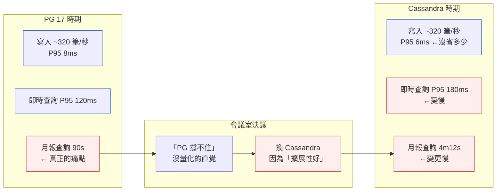
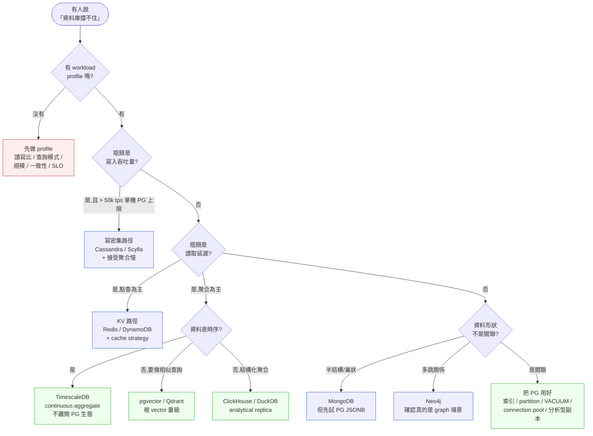

# 第 15 章|資料儲存設計
## ⸺ RDBMS、NoSQL、NewSQL、向量資料庫,先看 Workload 再選引擎

> **前置閱讀**:[Ch 8 資料模型與正規化](../part-02-analysis/ch-08-data-modeling-normalization.md)、[Ch 13 系統與架構選型](./ch-13-architecture-styles.md)
> **下游章節**:[Ch 23 事件驅動架構](../part-04-architecture/ch-23-event-driven-cqrs-es.md)、[Ch 31 資料治理與合規](../part-05-quality/ch-31-data-architecture.md)、[Ch 36 AI-Native 架構](../part-07-ai-era/ch-36-ai-native-architecture.md)
> **延伸補章**:[Ch 26 邊緣 / OT-IT 整合](../part-04-architecture/ch-26-edge-ot-it.md)

---

## 15.1 冷觀察 ⸺ 「PG 撐不住」之前,沒人量過

我在 2026 年第一季,看過一家虛構的太陽能電廠資料平台 **SunLedger Energy**(`CASE-ENR-003`)。他們做中型工商屋頂太陽能 EPC 後台,管 320 個案場、約 4,800 顆 inverter(以 SMA、Sungrow、Huawei 三家為主),走 Modbus TCP / SunSpec 規格輪詢,每 15 秒一筆 telemetry。電網側透過 IEC 61850 MMS 接到區域變電所兩個併網點,做電壓/頻率回報。

第 14 個月,他們的資料工程師在週會上拋了一句話:

> 「PostgreSQL 17 撐不住了,我們得換 Cassandra。」

那時候每天進的 telemetry 大約 2,760 萬筆(4,800 inverter × 5,760 筆/天),寫入沒問題,問題出在月報查詢 ⸺ 「過去 30 天每個案場每 15 分鐘的發電量,對齊氣象站日射量,算 PR(Performance Ratio,系統效能比)」這個查詢跑了 90 秒。會議裡沒人問「90 秒是因為什麼」,只問「Cassandra 是不是寫入比較快」。三週後決議書蓋章,六個月後遷移完成,7 億筆歷史 telemetry 從 PG 倒進 Cassandra cluster(3 nodes,RF=3)。

第 7 個月,同一份月報查詢從 90 秒變成 4 分 12 秒。

事故覆盤的時候,他們的資深工程師在白板上慢慢畫,把那段查詢拆給大家看:

> 「這個查詢有四個 join、兩個時間視窗、一個 PR 計算 ⸺ 這不是寫密集問題,是讀密集 + 二次聚合問題。Cassandra 的 partition key 設計逼我們把資料先撈回應用層再算,網路來回吃掉 70% 時間。」

那一刻他們才回頭去看,**從來沒有人把 SunLedger 的 workload profile 寫下來**。沒有讀寫比、沒有查詢模式分類、沒有 P95 延遲 SLO。「PG 撐不住」這句話是直覺,不是測量。



Cassandra 沒有失敗,**是 SunLedger 把「擔心 PG 撐不住」這個情緒,當成了「該換引擎」這個結論**。中間應該有的那一段 ⸺ workload profile、查詢分類、benchmark 對照 ⸺ 完全沒做。後來他們把 90 秒月報拆給我看的時候,我注意到一件事:那段查詢在 PG 上加一個 BRIN 索引、改用 TimescaleDB hypertable + continuous aggregate,能跑進 8 秒以內。沒人試過,因為「換引擎」比「把 PG 用好」聽起來更像在解決問題。

---

## 15.2 真問題 ⸺ Workload Profile 是選型的前置,不是後驗

選資料儲存引擎這件事,在 2026 年現場常被當成「選最好的」。Reddit / Hacker News / Twitter 上一篇講 Cassandra 在某家公司撐了 10PB 的文章,會在三個月內讓十家公司開始考慮 Cassandra ⸺ 即便他們的資料量是 100GB、且讀比寫多 50 倍。

把它拆開來看會比較清楚。**選型不是「選最好的」,是「對齊 workload profile」**。Workload profile 不是文件,是一張可量化的卡片,包含五個維度:讀寫比、查詢模式、規模、一致性需求、延遲 SLO。沒做這張卡片就換引擎,通常換來的不是性能,是另一組你還沒理解的限制。

### 15.2.1 模型(Model)、引擎(Engine)、Workload 三件不同的事

跟 Ch 8 區分「模型 vs schema」同一個道理,這裡也有三層需要分清楚:

| 層級 | 它在處理什麼 | 對應產出 | 錯位的代價 |
|---|---|---|---|
| **模型** | 業務世界的概念與關係 | ERD、Aggregate、Bounded Context | 模型不對,換引擎也救不了 |
| **Workload** | 系統怎麼被讀、怎麼被寫 | 五維 workload profile、查詢前 10 名 | 沒量化就換引擎 = 賭博 |
| **引擎** | 物理實作的取捨 | RDBMS / KV / Doc / Wide Column / Time-series / Vector | 選錯只是症狀,不是根因 |

SunLedger 的事故,根因在第二層 ⸺ 沒做 workload profile,直接從第三層下手。換句話說,**他們在沒有體溫計的情況下吃退燒藥**。

### 15.2.2 CAP / PACELC / BASE 不是教條,是分類軸

很多選型對話會引用 CAP 定理 [^CIT-150] 來合理化決定:「我們需要 AP 系統,所以選 Cassandra」。這句話在 2026 年聽起來怪 ⸺ Eric Brewer 自己 2012 年在 *CAP Twelve Years Later* [^CIT-151] 已經明說 CAP 是個「過於簡化的二選一」,真實系統做的是「在 partition 發生時做局部取捨」。

更可用的分類軸是 Daniel Abadi 2012 的 PACELC [^CIT-152]:**P**artition 時 **A** vs **C**,**E**lse(沒分區時)**L**atency vs **C**onsistency。它把 CAP 補上了「平時也要做的取捨」,因為大部分系統 99.x% 的時間是沒有 partition 的,你真正每天在付的代價是 latency vs consistency。

| 系統 | PACELC 分類 | 一句話翻譯 |
|---|---|---|
| PostgreSQL(單實例) | PC/EC | 一致性優先,平時也是 |
| Cassandra | PA/EL | 可用性優先,平時也吃延遲 |
| DynamoDB(預設) | PA/EL | 同上 |
| MongoDB(majority write concern) | PC/EC | 一致性優先 |
| Spanner | PC/EC | 用 TrueTime 換強一致 |
| CockroachDB | PC/EC | Raft + HLC 換強一致 |

PACELC 不告訴你選哪個,**它告訴你「你正在付什麼帳」**。BASE(Basically Available, Soft state, Eventual consistency)也是同樣的事 ⸺ 不是 ACID 的對立面,是另一條取捨軸線。把這幾個放回 SunLedger 的場景:電廠 telemetry 是讀多寫多但沒有交易語意,EC 一致性對它來說是「過度付費」,但 EL 延遲對月報查詢是「災難級降級」。

### 15.2.3 RDBMS 是預設值,不是「老派選擇」

Martin Kleppmann 在 *Designing Data-Intensive Applications* [^CIT-153] 裡有一段話我同意:**「關聯式資料庫之所以還活著,是因為它在大多數場景下『夠好』」**。2026 年回頭看,這個結論更明顯:

- PostgreSQL 17 [^CIT-154] 原生支援 JSONB(GIN index)、Range Partitioning、邏輯複製、外部資料封裝(FDW)、SQL/JSON path
- 加上 extension 生態:TimescaleDB(時序)[^CIT-155]、pgvector(向量)[^CIT-156]、PostGIS(地理空間)、pg_uuidv7、Citus(分散式)
- 一份 production schema 從 OLTP 開始,跑了三年仍然只用 PG,在現場相當常見

換句話說,**「RDBMS 撐不住」這句話,在 2026 年需要證據**。Pramod Sadalage 與 Martin Fowler 合著的 *NoSQL Distilled* [^CIT-157] 早在 2012 年就指出:NoSQL 不是「替代 RDBMS」,是「特定 workload 下的補充」。十四年過去,這句話沒過期。

換引擎的合理理由有四種,其他都需要再想想:

1. **寫密集且規模超出單機**:寫入吞吐量 > 單機 PG 上限(粗略 ~50k tps 寫入,視 schema 複雜度),且資料量 > 10TB
2. **資料形狀本身就不是關聯**:純 KV(session、cache)、document(草稿、CMS 內容)、graph(社交、推薦)、time-series(metrics、telemetry)、vector(embedding)
3. **查詢模式本身就不是 SQL**:full-text search、vector similarity、graph traversal
4. **地理分散一致性需求**:跨大洲低延遲讀寫(這時才考慮 NewSQL 的 CockroachDB / TiDB / Spanner)

SunLedger 屬於第 2 類(time-series)的邊緣案例,但他們的「資料形狀是時序」這件事可以在 PG 內部用 TimescaleDB hypertable 解決,**不需要離開 PG 生態**。

---

## 15.3 決策框架 ⸺ Workload 五維、五類儲存、向量 DB 對照、決策樹

下面這幾張表跟流程圖,在現場相當好用。它們的共同前提是:**先量化 workload,再選引擎**。

### 15.3.1 Workload Profile 五維(現場可量化)

每次選型對話前,值得先把這張卡填完。寫不滿就是還沒 ready 做選型決定。

| 維度 | 可量化指標 | SunLedger 的真實值 | 它告訴你的事 |
|---|---|---|---|
| **讀寫比** | reads/sec : writes/sec | 1,200 : 320(讀:寫 ≈ 4:1) | 讀密集還是寫密集 |
| **查詢模式** | 點查 / 範圍掃描 / 聚合 / 全文 / 向量 / 圖 占比 | 60% 範圍掃描、30% 聚合、10% 點查 | 引擎強項是否對齊 |
| **規模** | row 數、storage、年增量 | 7 億 row、1.4TB、年增 200% | 是否真的超出單機 |
| **一致性需求** | 強一致 / 讀己之寫 / 最終一致 | 讀己之寫即可(monitoring 場景) | PACELC 軸的 C 強度 |
| **延遲 SLO** | P50 / P95 / P99 by 查詢類別 | 即時 P95 200ms、月報 P95 10s | 引擎是否能達標 |

把這五維填完,選型對話會從「Cassandra 是不是比較快」變成「我們的 60% 範圍掃描在哪個引擎上 P95 能進 5 秒」。後者才是可被測試的問題。

### 15.3.2 五類儲存對照表(2026 版)

| 類別 | 代表引擎 | 強項 workload | 弱項 / 取捨 | 入場成本 |
|---|---|---|---|---|
| **RDBMS** | PostgreSQL 17、MySQL 8.4、Oracle 23ai、SQL Server 2025 | OLTP、複雜 join、ACID 交易、強 schema | 寫入單機上限、地理分散一致性 | ★ 低 |
| **KV** | Redis 7、DynamoDB、Memcached、Valkey | 點查、cache、session、leaderboard、rate limit | 範圍查詢弱、無 join、持久化需設計 | ★ 低 |
| **Document** | MongoDB 8、CouchDB、Firestore | 半結構化、巢狀資料、彈性 schema、CMS | 跨文件交易需設計、join 弱 | ★★ 中 |
| **Wide Column** | Cassandra 5、ScyllaDB、HBase、Bigtable | 寫密集、線性擴展、時序原始資料 | 查詢模式必須事先設計 partition key、聚合慢 | ★★★ 高 |
| **Time-series** | TimescaleDB、InfluxDB 3、QuestDB、ClickHouse(混合) | 時序壓縮、continuous aggregate、retention policy | 非時序場景不適用 | ★★ 中 |
| **Graph** | Neo4j 5、ArangoDB、Amazon Neptune | 多跳關係、社交、推薦、欺詐偵測 | 大量寫入弱、運維生態小 | ★★★ 高 |
| **Vector** | pgvector、Qdrant、Weaviate、Milvus、ChromaDB | 語意相似查詢、RAG、推薦 embedding | 不能取代結構化儲存 | ★★ 中 |
| **NewSQL** | CockroachDB、TiDB、Spanner、YugabyteDB | 跨地理 ACID、水平擴展 + SQL 介面 | 運維複雜、單實例延遲較 PG 高 | ★★★★ 最高 |

**入場成本**指的是「從零到 production-ready 需要付的學習與運維投入」,不只是授權費。Cassandra 的入場成本高在「partition key 設計錯了等於整個系統重做」⸺ Pramod Sadalage 在 *NoSQL Distilled* [^CIT-157] 把這件事歸在「query-first design」。

### 15.3.3 向量資料庫對照表(RAG / AI 場景)

2024 起的 LLM 與 RAG 浪潮,讓「embedding 第一公民」成為新一類 workload。下面這張對照針對的是「我有 embedding 要存、要做相似查詢」這個具體問題。

| 維度 | pgvector | Qdrant | Weaviate | Milvus | ChromaDB |
|---|---|---|---|---|---|
| **形態** | PostgreSQL extension | Standalone(Rust) | Standalone(Go) | Standalone(C++/Go) | Embedded / Standalone |
| **2026 年定位** | 已在 PG 中、< 1B vectors | 高效能、雲原生 | 內建混合查詢(向量 + 關鍵字 + filter) | 大規模(>10B)、GPU 友善 | 早期原型、嵌入式 |
| **索引演算法** | IVFFlat、HNSW | HNSW + 量化 | HNSW + 量化 | HNSW、IVF、DiskANN、SCANN | HNSW |
| **混合查詢** | ✓(SQL JOIN + vector) | ✓(filter + vector) | ✓(BM25 + vector + filter) | ✓ | 弱 |
| **資料一致性** | PG ACID | 最終 | 最終 | 最終 | 視部署 |
| **適合場景** | 既有 PG 系統加 RAG、< 100M vectors | 中等規模、低延遲 | 多模態 + 結構化混合 | 大規模、研究/生產 | PoC、Notebook |
| **不適合** | > 1B vectors、極端 QPS | 純粹 PoC | 簡單 KV-style 向量查 | 小規模、運維簡化 | 生產級高 QPS |

**現場常用的拇指法則**:
- 既有系統用 PostgreSQL → **先試 pgvector**,99% 場景夠用,還能跟業務資料 join
- 向量數量 > 100M、QPS 高、需要量化壓縮 → Qdrant 或 Weaviate
- 多模態 + 結構化混合查詢(影像 + 標籤 + 描述)→ Weaviate 內建 BM25 + vector 比較順
- 純研究 / Notebook PoC → ChromaDB,但別帶到 production

Databricks 在 2026 年發表的 Lakebase [^CIT-158] 把這件事推到下一層:**Lakehouse 的 AI Agent 友善版本**,把 transactional Postgres、analytical Delta、vector index 合在一個 unified storage layer。對於需要同時做 OLTP + OLAP + RAG 的新團隊,Lakebase 這類設計值得追蹤,但對既有系統而言,「pgvector + 既有 OLTP DB」仍是 2026 年最低風險的起手式。

### 15.3.4 PostgreSQL 17 + TimescaleDB hypertable 範例

把 SunLedger 的 telemetry 用 TimescaleDB 做一遍,展示「PG 系內部解決時序問題」的具體形狀:

```sql
-- PostgreSQL 17 + TimescaleDB extension
CREATE EXTENSION IF NOT EXISTS timescaledb;

-- inverter telemetry 表(SunSpec Model 103/160 對應的關鍵欄位)
CREATE TABLE inverter_telemetry (
    inverter_id   bigint       NOT NULL,
    site_id       bigint       NOT NULL,
    sampled_at    timestamptz  NOT NULL,
    ac_power_w    real,           -- 即時交流發電 W
    dc_voltage_v  real,           -- 直流端電壓
    dc_current_a  real,           -- 直流端電流
    temp_c        real,           -- 機殼溫度
    fault_code    int,            -- SunSpec event word
    PRIMARY KEY (inverter_id, sampled_at)
);

-- 轉成 hypertable,自動 chunk by 1 day
SELECT create_hypertable(
    'inverter_telemetry',
    'sampled_at',
    chunk_time_interval => INTERVAL '1 day'
);

-- 壓縮策略:7 天前自動壓縮,壓縮比通常 10–20×
ALTER TABLE inverter_telemetry SET (
    timescaledb.compress,
    timescaledb.compress_segmentby = 'site_id, inverter_id',
    timescaledb.compress_orderby   = 'sampled_at DESC'
);
SELECT add_compression_policy('inverter_telemetry', INTERVAL '7 days');

-- 連續聚合:每 15 分鐘的 site-level 發電量(continuous aggregate)
CREATE MATERIALIZED VIEW site_power_15min
WITH (timescaledb.continuous) AS
SELECT
    site_id,
    time_bucket('15 minutes', sampled_at) AS bucket,
    avg(ac_power_w)  AS avg_power_w,
    sum(ac_power_w) * (15.0 / 3600.0) AS energy_wh
FROM inverter_telemetry
GROUP BY site_id, bucket
WITH NO DATA;

-- 自動每 5 分鐘 refresh 最近 1 小時的 bucket
SELECT add_continuous_aggregate_policy('site_power_15min',
    start_offset      => INTERVAL '1 hour',
    end_offset        => INTERVAL '5 minutes',
    schedule_interval => INTERVAL '5 minutes');

-- 月報查詢:過去 30 天每案場每 15 分鐘發電,對齊氣象站日射
-- 直接查連續聚合表,不掃 raw telemetry
SELECT s.site_id, s.bucket, s.energy_wh, w.ghi_wh_m2,
       s.energy_wh / NULLIF(w.ghi_wh_m2 * sites.area_m2 * sites.module_eff, 0) AS pr
FROM site_power_15min s
JOIN site_weather_15min w
  ON s.site_id = w.site_id AND s.bucket = w.bucket
JOIN sites
  ON sites.site_id = s.site_id
WHERE s.bucket >= now() - INTERVAL '30 days'
ORDER BY s.site_id, s.bucket;
```

這份 schema 在 SunLedger 的真實量級(7 億 row,1.4TB)上跑同樣的月報查詢,P95 約 6–8 秒,壓縮後儲存 ~120GB ⸺ 跟 Cassandra 那條路相比,沒換引擎、沒新增運維、查詢甚至更快。

### 15.3.5 決策樹 ⸺ 這次該換引擎嗎?



**這張圖的關鍵不是分支,是兩個入口:Stop 與 Tune**。多數「該不該換」的對話,正確答案是「先做 profile,再把 PG 用好」。SunLedger 的事故,如果這張圖在他們那場會議桌上,會在 Q0 就停住。

---

## 15.4 踩坑清單

下面這四個常見地雷,在不同公司反覆出現。它們的共同點是:**選型對話跳過了 workload profile,直接從引擎特性開始**。每一個都附上修正方向。

### 反模式 1:沒做 Workload Profile 就換引擎

最常見的形狀是「我擔心 PG 撐不住」「Cassandra 寫入比較快」「MongoDB 比較彈性」⸺ 三句都是直覺,沒有一句是測量。SunLedger 走過這條路,六個月後同一個查詢慢了 3 倍。

> ✅ **修正方向**:在任何「換引擎」對話前,先填完 workload profile 五維卡(讀寫比 / 查詢模式 / 規模 / 一致性 / SLO)。沒填完不討論引擎。如果是既有系統,五個欄位都該從監控資料抓出來,不是估的。新系統可以估,但要寫清楚「這是估值,前 3 個月會驗證」。

### 反模式 2:為了「擴展性」用 Cassandra,但其實是讀密集

Cassandra 的設計重點是「線性寫入擴展」。在「讀比寫多 4:1、有聚合查詢」的場景下,它的 partition key 設計會逼你把資料先撈到應用層算,網路成本 + 應用層聚合常常比 PG 一條 SQL 慢。

> ✅ **修正方向**:讀寫比 > 1(讀多寫少)且查詢含聚合,Cassandra 通常不是答案。先看 PG 的 BRIN / partition / materialized view 能不能解,再看 ClickHouse / DuckDB 這類 analytical replica。Cassandra 真正適合的是「寫遠多於讀、查詢以 partition key 點查為主」的場景(典型如:訊息存放、event log、IoT 原始 telemetry 入口)。

### 反模式 3:用 MongoDB 存交易資料(沒事務保證)

MongoDB 4.0 起支援 multi-document transaction,但**它不是免費的** ⸺ replica set 內 OK,sharded cluster 上會明顯增加延遲與失敗率。常見踩坑形狀:把訂單、付款、庫存放 MongoDB,「因為 schema 比較彈性」,結果跨 collection 的金額對帳每月都對不上。

> ✅ **修正方向**:有「兩件事必須一起成功或一起失敗」的場景(訂單 + 付款、轉帳借貸、庫存扣減 + 訂單建立),預設選 RDBMS。MongoDB 的甜蜜點是「單 document 內聚合度高、跨 document 不需要強一致」⸺ 例如產品目錄、CMS 文章、使用者偏好設定。彈性 schema 在 PG 內可以用 JSONB 解,**「為了彈性 schema 換 MongoDB」這個理由,2026 年通常站不住腳**。

### 反模式 4:用 Redis 當 source of truth

「Redis 太快了,我們把 user profile 放 Redis 主存」⸺ 這句話在新創團隊週會上每個月都聽得到。Redis 7 雖然有 AOF + RDB 持久化,但它的設計核心仍是 in-memory cache;當記憶體用滿、AOF 重寫失敗、replica 切換時,**「最後一筆寫入有沒有持久化」這件事不是強保證**。

> ✅ **修正方向**:Redis 是 cache、是 session、是 leaderboard、是 rate limit ⸺ 它不是 source of truth。把 SoT 放 PG / MySQL,Redis 做讀加速層,並設計清晰的失效事件(invalidation event)。如果真的需要持久化 KV 並且 source of truth 等級,看 DynamoDB(雲端託管、可調整一致性)或 FoundationDB,不要把 Redis 當主資料庫用。

---

## 15.5 交付清單 ⸺ 一頁式 Storage Selection Card

每次要做資料儲存選型決定前,**第一份要產出的不是 POC,是 Storage Selection Card**。它是一頁 Markdown,寫不滿就是還沒 ready 做這個決定。

把它存在 `docs/storage/{decision_name}.md`,跟對應的 ADR 同 PR、跟 schema migration 一起 review。

````markdown
# Storage Selection Card — {決策名稱}

> 對應 ADR:`docs/adr/NNNN-{slug}.md`
> 撰寫日期:YYYY-MM-DD | 擁有人:{名字}
> 對齊章節:Ch 8 模型、Ch 15 引擎、Ch 23 事件流、Ch 31 治理

## 1. Workload Profile(五維量化)

| 維度 | 量化值 | 來源(監控/估值) |
|---|---|---|
| 讀寫比(QPS) | reads:writes = ? : ? | (e.g. Grafana 過去 30 天 P50) |
| 查詢模式占比 | 點查 ?% / 範圍 ?% / 聚合 ?% / 全文 ?% / 向量 ?% / 圖 ?% | |
| 規模 | row 數、storage、年增量 | |
| 一致性需求 | 強一致 / 讀己之寫 / 最終一致 | (PACELC 軸位置) |
| 延遲 SLO | P50 / P95 / P99 by 查詢類別 | |

## 2. 候選引擎(至少 3 個,含「不換」選項)

| 候選 | 強項 對應 workload 哪一格 | 弱項 / 取捨 | 入場成本 |
|---|---|---|---|
| 維持現狀(把現有引擎用好) | (索引、partition、replica、cache) | (改不掉的限制) | ★ 低 |
| 候選 A | | | |
| 候選 B | | | |

## 3. 決策(對齊 PACELC)

- 選擇:{引擎}
- PACELC 分類:{PA/EL or PC/EC ...}
- 主要理由(對應 workload profile 哪一維):
- 次要理由:
- 不選其他候選的理由(不是「比較差」,是「對我的 profile 不對齊」):

## 4. 入場成本(運維 + 學習 + 整合)

- 學習成本:{誰需要學什麼,工時估)
- 運維成本:{備份、HA、監控、容量規劃)
- 整合成本:{ETL、CDC、應用層 driver、ORM 支援)
- 退出成本:{真的不對的話,要花多少功夫退回來)

## 5. 半年後 Reassessment Trigger(觸發再評估的條件)

- [ ] 寫入 P95 > {ms} 連續 7 天 → 重新跑一次 selection card
- [ ] 月報查詢 P95 > {秒} → 看是否需要 analytical replica
- [ ] 資料量超過 {TB} 且年增 > {%} → 評估 partition / sharding / OLAP
- [ ] 業務新增 {某類查詢}(如 RAG、graph、地理空間)→ 看是否補新引擎
- [ ] 雲端帳單超過 {美金/月} → FinOps 對齊

## 6. Out of Scope(這個決定不解決什麼)

- 這個決定**不**處理 {analytics / search / graph / vector ...}(走 {另一條路})
- 這個決定**不**改變 {某個既有 schema / API / event 流}
- 這個決定**不**負責 {遷移、回填、雙寫策略}(由 {另一份文件} 處理)
````

**為什麼是一頁?** 一頁的篇幅會逼出選擇,十頁不會逼。SunLedger 那場會議桌上沒有這張卡,所以「換 Cassandra」變成可被通過的決定。如果有,會議會在第一個欄位(Workload Profile 五維)就卡住,然後整個決定會被推遲到資料填齊。

**為什麼要有「Reassessment Trigger」?** 引擎選對了會老,規模會變,業務會長新功能。把「什麼條件下要重看這個決定」事先寫好,等於把六個月後的會議時間預先省下來。

**為什麼候選清單裡要包含「維持現狀」?** 因為現場最常被忽略的選項,就是「把現有引擎用好」。SunLedger 如果在第二欄寫上「維持 PG 17、加 TimescaleDB extension」,後面整段故事不會發生。

---

## 15.6 本章交付清單 Recap

讀完本章,你應該已經能做到:

- [ ] 講清楚「沒做 workload profile 就換引擎」是 2026 年最常見的選型踩坑;選型對話從五維 profile 開始,不是從引擎特性開始
- [ ] 用五類儲存對照表(RDBMS / KV / Document / Wide Column / Time-series / Graph / Vector / NewSQL)+ PACELC 分類,把候選引擎跟自己的 workload 對齊
- [ ] 在向量資料庫場景下,知道 pgvector / Qdrant / Weaviate / Milvus / ChromaDB 各自的甜蜜點,**先試 pgvector** 是 2026 年最低風險的起手式
- [ ] 為手上的選型決定寫好一份 Storage Selection Card,把「維持現狀」也列入候選,並寫好半年後的 reassessment trigger

如果四項中先挑一項做完就好,建議是最後那一項 ⸺ 把目前團隊正在討論「是不是要換資料庫」的那個決定,寫成一張 Storage Selection Card。寫到第一欄就卡住的話,**那個決定本來就還沒到該做的時候**。下一章 Ch 16 會接著談 UI/UX 與人機互動;再往後 Ch 23 事件驅動與 Ch 31 資料治理會延伸本章的反正規化讀模型與不可變性主題。

---

## Cross-References

- **回顧**:[Ch 8 資料模型與正規化](../part-02-analysis/ch-08-data-modeling-normalization.md) ⸺ 模型 vs schema、正規化、UUIDv7、Partition vs Shard
- **回顧**:[Ch 13 系統與架構選型](./ch-13-architecture-styles.md) ⸺ 整體架構選型框架的一部分
- **下一章**:[Ch 16 UI/UX 與人機互動](./ch-16-uiux-system-view.md)
- **事件驅動**:[Ch 23 事件驅動架構](../part-04-architecture/ch-23-event-driven-cqrs-es.md) ⸺ CQRS 讀模型如何接住反正規化
- **資料治理**:[Ch 31 資料治理與合規](../part-05-quality/ch-31-data-architecture.md) ⸺ 不可變性、審計、retention
- **AI 時代**:[Ch 36 AI-Native 架構](../part-07-ai-era/ch-36-ai-native-architecture.md) ⸺ embedding 第一公民與向量索引在系統設計中的位置
- **延伸補章**:[Ch 26 邊緣 / OT-IT 整合](../part-04-architecture/ch-26-edge-ot-it.md) ⸺ 邊緣端時序資料的本地緩衝與雲端同步

## 引用

[^CIT-150]: Eric Brewer, "Towards Robust Distributed Systems" (PODC 2000 Keynote) — CAP 定理原始口頭發表;後由 Gilbert & Lynch 2002 形式化證明。
[^CIT-151]: Eric Brewer, "CAP Twelve Years Later: How the 'Rules' Have Changed" (IEEE Computer, Vol. 45, Issue 2, 2012) — 作者親自重訪 CAP,指出二選一是過度簡化。
[^CIT-152]: Daniel J. Abadi, "Consistency Tradeoffs in Modern Distributed Database System Design" (IEEE Computer, Vol. 45, Issue 2, 2012) — PACELC 模型原始論文。
[^CIT-153]: Martin Kleppmann, "Designing Data-Intensive Applications" (O'Reilly, 2017;第 2 版 2026 年陸續釋出章節) — 資料密集系統設計的當代必讀教材。
[^CIT-154]: PostgreSQL 17 Official Documentation — postgresql.org/docs/17/。Logical replication、incremental backup、JSON_TABLE、SQL/JSON、增強 partition pruning。
[^CIT-155]: Timescale, "TimescaleDB Documentation — Hypertables, Compression, Continuous Aggregates" — docs.timescale.com。PostgreSQL extension 形式提供時序壓縮、自動 chunk 切分、增量物化視圖。
[^CIT-156]: pgvector — github.com/pgvector/pgvector。PostgreSQL 向量相似搜尋 extension,支援 IVFFlat、HNSW 索引,2024–2026 為 PG 生態 RAG 主流選擇。
[^CIT-157]: Pramod J. Sadalage & Martin Fowler, "NoSQL Distilled: A Brief Guide to the Emerging World of Polyglot Persistence" (Addison-Wesley, 2012)。Polyglot persistence、aggregate-oriented databases、query-first design 概念來源。
[^CIT-158]: Databricks, "Lakebase: A Unified Storage Layer for AI Agents" (2026)。Lakehouse 架構在 AI Agent 場景下的演進形態,整合 OLTP Postgres、analytical Delta 與 vector index。databricks.com/blog/lakebase。
[^CIT-159]: Qdrant / Weaviate / Milvus / ChromaDB Documentation — qdrant.tech/documentation、weaviate.io/developers/weaviate、milvus.io/docs、docs.trychroma.com。2024–2026 主流向量資料庫官方文件。

---
