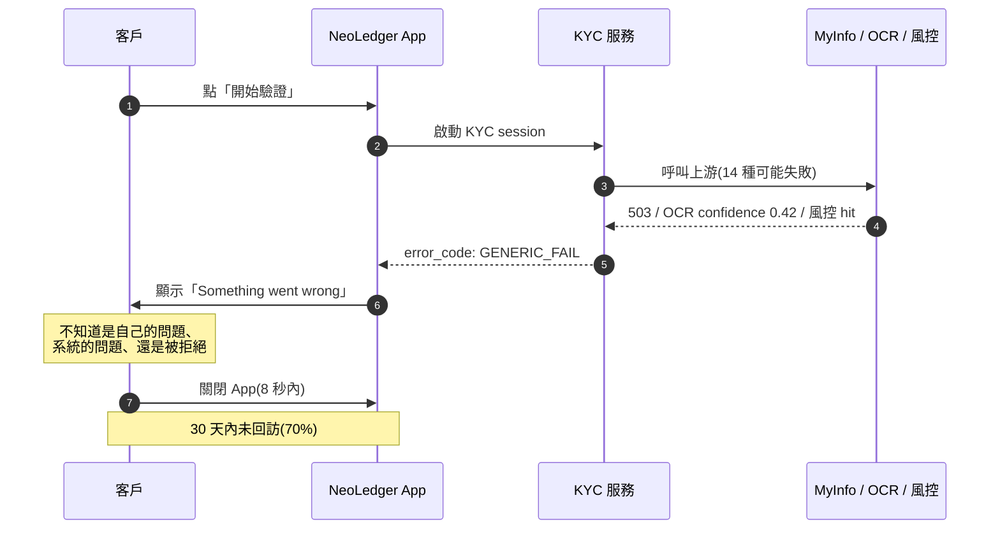
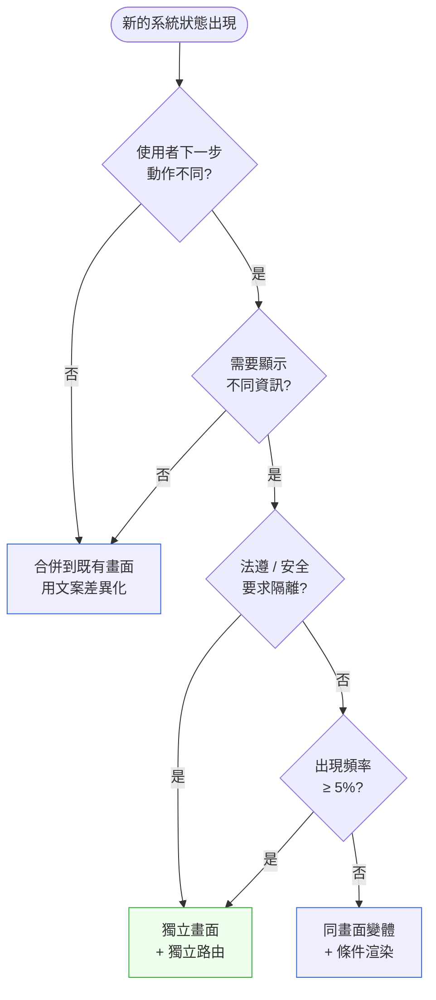

# 第 16 章|UI/UX 與人機互動的系統觀
## ⸺ UX 是錯誤狀態下的決策設計

> **前置閱讀**:[Ch 4 需求工程](../part-01-foundations/ch-04-requirements-engineering.md)、[Ch 7 用例與流程](../part-02-analysis/ch-07-object-oriented-analysis.md)、[Ch 9 流程與狀態機](../part-02-analysis/ch-09-process-modeling.md)
> **下游章節**:[Ch 18 DDD 戰術設計](../part-04-architecture/ch-18-ddd-strategic-tactical.md)、[Ch 27 Security by Design](../part-05-quality/ch-27-security-by-design.md)
> **延伸補章**:[Ch 17 對話式 UX 與多模態互動](./ch-17-cux.md)(緊接本章)

---

## 16.1 冷觀察 ⸺ 「Something went wrong」與 70% 的放棄率

我在 2025 年第四季看過一個案例。

虛構數位銀行 **NeoLedger Bank**(`CASE-FIN-004`),亞太地區三個市場(SG / HK / TW)同步營運,主打「90 秒開戶、AI 投資諮詢、全幣別錢包」。設計團隊 11 人、工程 60 人,App 的視覺被某設計獎評為「2025 年度 fintech UI 最佳作品」之一。在他們的 Figma 檔案裡,KYC(Know Your Customer,客戶身分驗證)流程的 Happy Path 共有 7 個畫面,每個畫面都有微互動,過場是淡入 240ms、按鈕點擊有觸覺回饋。

第二季的開戶轉換率報告出來,Happy Path 完成率 83%,看起來健康。但**從點擊「開始驗證」到完成的全段轉換率只有 41%**。中間蒸發掉了 42 個百分點。

產品分析團隊把每一個離開事件打上標籤、逐段歸因,把那 42pp 分解開來:

- **28pp** 流失在 11 個有錯誤頁的系統狀態 ⸺ 使用者進入錯誤頁後 8 秒內關閉 App,30 天內沒有回來
- **8pp** 流失在 KYC 前的身分預審等待(MyInfo 呼叫延遲超過 12 秒,沒有進度反饋)
- **6pp** 流失在其他摩擦:介面引導不清、表單欄位說明不足、銀行帳號格式驗證時機錯誤

換句話說,**28pp 的損失可以直接追蹤到那 11 個沒有設計過的錯誤狀態**。如果使用者在清楚的引導下選擇重試或切換路徑,這 28pp 有機會回來;另外 14pp 屬於其他問題,不會因為修好錯誤 UX 而消失。此後那句「中間蒸發掉的那 42 個百分點,沒有一個出現在 Figma 裡」,在覆盤會上被修正為更精準的版本:28pp 直接住在那些空格裡。

產品分析團隊把所有錯誤頁攤出來看,發現一件事:**整個 App 在 14 種不同的失敗情境下,只回了三句文案**。

> 「Something went wrong. Please try again later.」
> 「網路連線異常,請稍後再試。」
> 「驗證失敗,請重新驗證。」

身分證件 OCR 失敗、人臉比對置信度過低、新加坡 MyInfo 服務間歇性 500、後端風控規則命中、第三方徵信額度超限、跨境制裁名單命中 ⸺ 全部走進那三句話。一位 23 歲的客戶在客服工單裡留下這段話,這段話被 PM 截圖貼在團隊 Slack 上、後來被印出來貼在牆上:

> 「我不知道哪裡錯了。我不知道是不是我的問題。我不知道改一改可以再試,還是這輩子都不能在你們這裡開戶。所以我刪掉了。」

事故覆盤時,Head of Product 把 GA 與 Mixpanel 的數據拉成一張圖:**進入錯誤頁的客戶,70% 在 8 秒內關閉 App,之後 30 天內沒有再回來**。設計團隊的負責人那天說了一句話,被會議紀錄員原樣記下:

> 「我們把 Happy Path 設計到得獎,然後在 unhappy path 用了一句 placeholder。」



這不是設計師畫圖能力的問題。NeoLedger 的設計團隊有資深 IxD、有 Design Token 系統、有 Material 3 完整實作。問題是 ⸺ **錯誤狀態從來沒有被當成設計對象**。它在規格文件裡只佔了一行:「錯誤時顯示 toast」。

---

## 16.2 真問題 ⸺ UX 不是裝飾,是錯誤狀態下的決策設計

把 NeoLedger 的事拆開來看,UX 在 SA/SD 的角色經常被誤讀成兩件事:一件是「把畫面排漂亮」,一件是「讓互動順暢」。兩個敘述都不算錯,但它們都漏掉了 UX 真正吃功夫的那一段 ⸺ 當系統處於非預期狀態時,使用者該如何做下一步決策。

### 16.2.1 介面設計 vs 互動系統設計

把它再拆開一層,UI/UX 在 2026 年的工程現場其實是兩件事的疊加。第一件是**介面設計**(Interface Design)⸺ 處理視覺、版型、節奏、無障礙。第二件是**互動系統設計**(Interaction System Design)⸺ 處理使用者旅程、系統狀態、錯誤恢復、決策支援。

| 維度 | 介面設計 | 互動系統設計 |
|---|---|---|
| **產出** | Figma、Design Token、元件庫 | User Journey Map、Service Blueprint、State Machine 對齊矩陣 |
| **核心問題** | 看起來如何、用起來順不順 | 系統處於 X 狀態時,使用者下一步能做什麼 |
| **失敗代價** | 畫面醜、品牌不一致 | 客戶在錯誤頁放棄、客服爆量、合規風險 |
| **主要協作方** | 視覺設計師、品牌 | 系統分析師、後端工程師、合規 |
| **驗收方式** | 設計評審、A/B 測試 | 狀態覆蓋率、unhappy path 完成率、錯誤恢復率 |

NeoLedger 把資源全部投入第一件事,做到了得獎水準。第二件事整個被當成「上線前補一補就好」⸺ 那 70% 的放棄率就在那條被略過的縫裡冒出來。

### 16.2.2 User Journey 必須對齊 State Machine

換句話說,UX 在 SA/SD 真正在處理的是**兩個視角的對齊**:

- **使用者視角**(User Journey):客戶在這個情境下,試圖完成什麼?他現在感覺到什麼?他下一步可能做什麼?
- **系統視角**(State Machine):系統當前處於哪個狀態?這個狀態能轉移到哪些其他狀態?觸發條件是什麼?

這兩個視角各自有成熟工具:Journey Map 來自 Service Design,1984 年 Lynn Shostack 在 Harvard Business Review 提出 Service Blueprint[^CIT-160];State Machine 來自計算機科學,在 [Ch 9](../part-02-analysis/ch-09-process-modeling.md) 已經拆開過。但兩者很少被放在同一張紙上**機械化對齊**。

NeoLedger 的問題不是缺 Journey Map,也不是缺狀態機。設計團隊有 Journey Map(Figma 裡那 7 個 Happy Path 畫面)。後端有狀態機(KYC 服務的 Spring State Machine,14 個 state、30 多個 transition)。問題是這兩份產物**從來沒有對照過**。系統有 14 個失敗 state,Journey Map 上只畫了 1 個錯誤畫面。對齊矩陣裡有 13 格是空的,而那 13 格就是 70% 放棄率的住所。

> *"Service is performance, not product. The blueprint must show every step that contributes to the customer's experience, including the steps that fail."* ⸺ Lynn Shostack, 1984[^CIT-160]

### 16.2.3 三個 UX 真正的戰場

把它收束起來,UX 在 SA/SD 的真正戰場是這三個地方:

1. **錯誤狀態**(Error State):系統失敗時,使用者要決定「再試 / 換做法 / 放棄」。
2. **資訊不足狀態**(Insufficient Information State):系統還在處理、或結果尚未確定時,使用者要決定「等多久 / 取消 / 切走做別的」。
3. **狀態歧義**(State Ambiguity):同一個畫面可能對應多個系統狀態,使用者無法分辨自己當前在哪。

Happy Path 大家都會。會做得不一樣的,是這三個地方。Don Norman 在 *The Design of Everyday Things* 第二版加進的 *seven stages of action*[^CIT-161],其中後三個 stage 全在處理「系統反饋之後我該如何詮釋與下決定」 ⸺ 這正是錯誤與不確定狀態的核心。Jakob Nielsen 的十條啟發式評估[^CIT-162]裡,有四條(*Visibility of system status*、*Help users recognize, diagnose, and recover from errors*、*Error prevention*、*Help and documentation*)直接針對的就是 unhappy path。

---

## 16.3 決策框架 ⸺ Journey ↔ State 對齊與錯誤訊息四維

### 16.3.1 User Journey ↔ State Machine 對齊矩陣

第一個現場常用的工具,是把 Journey Map 與 State Machine 並排,逐格檢查覆蓋。NeoLedger 後續復盤時就是用這張表,把 14 個系統狀態與 Journey 的關鍵階段做交叉。

**使用本矩陣前,先確認「是否覆蓋」這一欄的判斷標準。** ✅ 的定義是四個條件同時成立,缺一則視為 ❌:

| 覆蓋條件 | 說明 |
|---|---|
| **UI 設計存在** | Figma 或元件庫中有對應畫面或變體,非 placeholder 文案 |
| **DACR 四維 ≥ 3 維可讀** | Diagnosis + Action 必有;Cause / Recoverability 至少一項完整填寫 |
| **QA 可測試** | 有 test case 或 Sentry alert rule 可觸發此狀態,非僅靠視覺判斷 |
| **無 placeholder 文案** | 文案已過 DACR review,不含「Something went wrong」等通用字串 |

只有視覺稿存在、但文案未過 DACR、或 QA 無法重現此狀態的,一律標 ❌。

| 系統狀態(State) | Journey 階段 | UI 對應狀態 | 使用者該下的決定 | 是否覆蓋 |
|---|---|---|---|---|
| `KYC_INIT` | 啟動 | 開始畫面 | 開始 / 取消 | ✅ |
| `OCR_PROCESSING` | 上傳證件 | 進度條 + 預估時間 | 等待 / 取消 | ✅ |
| `OCR_LOW_CONFIDENCE` | 上傳證件 | 「拍得不清楚」+ 重拍提示 + 範例圖 | 重拍 / 換證件 | ❌ → ✅ |
| `FACE_MATCH_FAIL` | 人臉比對 | 「臉部對不上,請靠近光源」+ 第二次嘗試 | 重試 / 換時間再來 | ❌ → ✅ |
| `MYINFO_TIMEOUT` | 政府 API | 「政府服務暫時繁忙」+ 預估恢復 + 預約通知 | 等待 / 留電話 / 改用上傳模式 | ❌ → ✅ |
| `RISK_HIT_REVIEWABLE` | 風控 | 「需人工審核,2 工作日內回覆」+ 工單號 | 留下聯絡方式 / 客服 | ❌ → ✅ |
| `RISK_HIT_FINAL` | 風控 | 「無法為您開戶」+ 申訴通道 | 申訴 / 結束 | ❌ → ✅ |
| `SANCTION_HIT` | 制裁名單 | 與 `RISK_HIT_FINAL` 同畫面(法遵不可揭露原因) | 申訴 / 結束 | ❌ → ✅ |
| `LIMIT_EXCEEDED` | 第三方額度 | 「今日驗證次數已達上限」+ 倒數時間 | 明日再試 / 客服 | ❌ → ✅ |
| `NETWORK_OFFLINE` | 任何階段 | 離線 banner + 已輸入內容保留 | 連網重試 | ❌ → ✅ |

**這張矩陣的關鍵不是欄位,是「是否覆蓋」這一欄**。每一個 ❌ 都是一個正在流血的位置;每個位置流血多少,可以從 GA / Mixpanel / Sentry 的事件統計裡讀出來。NeoLedger 後續把這張矩陣放進 PR checklist,任何新增系統狀態都要回答:Journey 上對應哪一格?UI 上長什麼樣?使用者下一步是什麼?

### 16.3.2 錯誤訊息四維(DACR 維度)

第二個現場常用的工具,是把錯誤訊息當成**四件事的合成**,而不是一句話。借用認知心理學在故障診斷的研究脈絡,可以歸納為四維:

```
Diagnosis    Action          Cause              Recoverability
─────────    ─────────       ─────────          ─────────
診斷         行動            原因               可恢復性

「發生了      「下一步可      「原因是什麼      「這件事
 什麼?」     以做什麼?」    (能說的話)」      能不能挽回?」
```

| 維度 | 該回答的問題 | 反例(Generic) | 正例(Specific) |
|---|---|---|---|
| **Diagnosis** | 發生了什麼? | 「Something went wrong」 | 「身分證背面照片過暗,系統讀不到出生日期」 |
| **Action** | 我下一步該做什麼? | 「請稍後再試」 | 「請在自然光下重拍,或改成手動輸入」 |
| **Cause** | 為什麼會這樣?(可揭露範圍內) | 不提 | 「自動辨識需要清楚的字元邊緣,反光會讓系統判錯」 |
| **Recoverability** | 我還救得回來嗎? | 不提 | 「這次嘗試不影響今日驗證次數;您還有 2 次。」 |

**為什麼 D 與 A 是強制的，C 與 R 是可選的？** 這個取捨有明確的邏輯依據。使用者在錯誤頁面上需要做一個即時決策：「我現在該做什麼？」沒有 Diagnosis，使用者無法判斷問題是否出在自己身上（「是我的問題還是系統的問題？」）；沒有 Action，使用者沒有下一步可走，只能選擇放棄。這兩維是**使用者完成決策的最低門檻**，缺任何一個，訊息就無法完成它的本質功能。Cause 與 Recoverability 是**商業加值**，不是決策基礎：C 讓使用者理解為何發生、降低焦慮、減少客服工單；R 讓使用者知道這件事還有沒有救、直接影響他們是否願意再試。兩者有 > 無，但沒有它們，訊息不會「沒有用」，只是沒達到最佳；而沒有 D + A，訊息就根本不是一條訊息，只是噪音。

四個維度不是每次都要全寫,但**至少要有 D 與 A**;有 C 會大幅降低客服工單;有 R 會大幅降低放棄率。NeoLedger 在錯誤頁加上 Recoverability 那一行(「這次嘗試不影響今日次數」),量化追蹤顯示同一個錯誤頁的「再試一次」點擊率從 18% 升到 47%——這說明了 R 在某些情境下不只是加值，而是讓使用者從「以為已被系統拒絕」轉為「知道還可以再試」的關鍵開關。

**完整四維示範：同一個錯誤狀態如何填寫** — 光看每一維的反例/正例,讀者容易誤以為 DACR 是「四個獨立的寫法選擇」。實際操作時,四維是對**同一個失敗情境**的完整描述。以 NeoLedger 的 `OCR_LOW_CONFIDENCE`（身分證 OCR 置信度不足）為例：

| 維度 | 填寫內容 | 說明 |
|---|---|---|
| **Diagnosis** | 「我們沒看清楚您的證件號碼」 | 點出問題是「讀不清楚」而非「您的證件無效」 |
| **Action** | 「重拍一次」（主按鈕）/「改用相片上傳」（次要連結） | 給出兩條路：首選路徑 + 備選路徑 |
| **Cause** | 「光線不足或反光會讓系統判讀失準」 | 說明物理原因，讓使用者知道換角度或補光就能解決 |
| **Recoverability** | 「這次嘗試不計入今日驗證次數；您還有 2 次機會。」 | 消除「已被封鎖」的恐懼，是促成再試點擊率從 18% 升到 47% 的關鍵那一行 |

組合成畫面上的實際文案：

> 🔍 **我們沒看清楚您的證件號碼**
> 光線不足或反光會讓系統判讀失準，換個角度或補光再拍一次通常能解決。
> **[重拍一次]**　　[改用相片上傳]
> *這次嘗試不計入今日驗證次數；您還有 2 次機會。*

這四維合在一起，才能回答使用者腦中的三個問題：「是我的問題嗎？我能做什麼？還有機會嗎？」

> 法遵限制下不能說明 Cause 的情境(制裁名單、反洗錢命中)非常常見。這時 D 與 A 仍要做到,並把 R 替換成「申訴管道」⸺ 讓使用者知道這條路雖然在這裡斷了,但旁邊還有一條。

### 16.3.3 資訊不足狀態的設計

錯誤訊息設計清楚之後,還剩下一個現場很容易被忽略的維度:**資訊不足狀態**。這指的不是「失敗」,而是「目前還回答不了」⸺ 後端在跑非同步任務、第三方在驗證、人工在審核。這類狀態如果用「Loading...」一筆帶過,使用者會做出錯誤決定(關掉 / 重複送、重複觸發 idempotency 漏洞)。

| 不足類型 | 系統狀態 | 反例 | 正例 |
|---|---|---|---|
| **時間未知** | 上游同步呼叫 | spinner | 進度條 + 預估秒數 + 取消按鈕 |
| **時間長尾** | 風控人工審核 | spinner | 「2 工作日內以 push 通知您;查詢工單 #ABC-123」 |
| **結果二元未知** | 跨行轉帳 | spinner | 「資金已扣款,對方銀行回覆中,通常 30 秒內」+ 進度狀態 + 失敗時退款政策連結 |
| **可信度未知** | OCR 中等置信 | 直接接受或拒絕 | 「我們讀到的姓名是『陳曉華』,對嗎?」(讓使用者確認) |
| **結果待確認** | 設定生效中 | 「儲存成功」 | 「設定已送出,5 分鐘內全裝置生效」 |

Material 3 對這類狀態提供了多個元件層級的參考[^CIT-163]:`LinearProgressIndicator`(已知時間)、`CircularProgressIndicator`(未知時間)、`Snackbar with action`(可恢復告知)。Ant Design 5 在 Modal、Result、Alert 三個元件上把錯誤、警告、資訊與成功分四個 severity[^CIT-164]。但元件不是答案,**訊息內容才是**;元件只是承載。

### 16.3.4 「這個 UI 狀態該不該獨立?」決策樹

NeoLedger 在重構時遇到一個常見問題:14 個系統狀態,要不要對應 14 個獨立 UI 畫面?還是合併?現場可以用這張決策樹判斷。



**這張圖的關鍵在於不是每個 state 都該獨立**。NeoLedger 第一輪復盤時設計師想做 14 個畫面,跑完這張樹後收斂為 6 個獨立畫面 + 4 個變體,維護成本下降但覆蓋率反而上升。

**決策樹走線示範** — 以 NeoLedger 的兩個狀態為例，展示如何用這張樹做實際判斷：

**狀態一：`OCR_LOW_CONFIDENCE`（OCR 置信度不足）**

1. Q1「使用者下一步動作不同？」— **是**。低置信度的動作是「重拍」；`KYC_INIT` 的動作是「開始」，兩者不同，繼續往下。
2. Q2「需要顯示不同資訊？」— **是**。需要顯示「原因是光線」與「重拍引導圖」，這些在開始畫面不存在。繼續往下。
3. Q3「法遵/安全要求隔離？」— **否**。OCR 失敗的原因可以完整揭露，沒有法遵限制。
4. Q4「出現頻率 ≥ 5%？」— **是**。NeoLedger 數據：`OCR_LOW_CONFIDENCE` 佔所有 KYC session 的 11%。

→ 結果：**獨立畫面 + 獨立路由**（`/kyc/ocr-retry`）

**狀態二：`OCR_GLARE_DETECTED`（OCR 偵測到反光）**

1. Q1「使用者下一步動作不同？」— **是**。與 `OCR_LOW_CONFIDENCE` 不同，這裡的動作是「換角度」而非「補光重拍」。繼續往下。
2. Q2「需要顯示不同資訊？」— **是**。需要顯示角度引導動畫，而非光線提示圖。繼續往下。
3. Q3「法遵/安全要求隔離？」— **否**。
4. Q4「出現頻率 ≥ 5%？」— **否**。NeoLedger 數據：`OCR_GLARE_DETECTED` 佔 2.3%，低於門檻。

→ 結果：**同畫面變體 + 條件渲染**（在 `/kyc/ocr-retry` 同畫面裡，根據 `glare=true` 切換引導動畫）

這兩個狀態走完之後，設計師不需要為 `OCR_GLARE_DETECTED` 另做一個路由，而是在已有的 `OCR_LOW_CONFIDENCE` 畫面裡加一個條件分支——這正是「6 個獨立畫面 + 4 個變體」結論的其中一條推導路徑。

### 16.3.5 Service Blueprint:把後台動作攤平

Journey Map 處理「使用者看到什麼」,Service Blueprint[^CIT-160] 多疊兩層:**前台動作**(Onstage)與**後台動作**(Backstage)。在 fintech 這種需要多個上游(KYC 服務、徵信、央行清算、合規系統)協作的場景,Blueprint 比 Journey Map 更能暴露 UX 與後台流程的縫隙。

NeoLedger 後續做的是這樣的精簡 Blueprint(以 KYC 為例,只看跨行轉帳前的最後一哩):

| Layer | 步驟 1 | 步驟 2 | 步驟 3 |
|---|---|---|---|
| **客戶動作** | 上傳證件 | 拍人臉 | 等候核准 |
| **前台 UI** | 拍照引導 + 範例 | 即時偵測框 | 進度狀態 + 工單號 |
| **後台動作** | OCR + 真偽檢測 | 活體 + 1:1 比對 | MyInfo + 風控 + 制裁掃描 |
| **支援系統** | OCR 服務、文件儲存 | 人臉服務、影片儲存(留證) | KYC 編排器、Sanction DB、Case Mgmt |
| **失敗點 / 等待點** | 反光 / 模糊 | 光線 / 角度 / 第二次失敗鎖 30 秒 | 上游 timeout / 人工審核佇列 |

這張表的價值在於最後兩列。前台 UI 可以漂亮,但每一個失敗點與等待點背後都有後台服務的真實限制 ⸺ 設計師看到這張表才有辦法在前台 UI 處設計出「真實能恢復」的訊息,而不是猜測式的安慰文案。

**從失敗點到 DACR 的推導鏈** — Blueprint 的作用不只是「看到問題在哪」，而是讓設計師理解失敗點的**性質**，再把這個性質轉譯成 DACR 的正確填法。以步驟 1 的「反光/模糊」為例：

設計師在 Blueprint 裡看到這個失敗點之後，會問一個關鍵問題：**這個失敗是物理限制（使用者可以改變的）還是系統限制（使用者無能為力的）？** Blueprint 告訴設計師：「反光」來自使用者手持角度，「模糊」來自拍攝距離或震動 — 兩者都是**物理限制，可再試**，使用者換個角度或補個光就能解決，不需要切換流程或等待系統恢復。

這個認識直接決定了 DACR 的填法：

- **Diagnosis**：「證件反光，系統讀不清楚邊緣」— 說的是物理原因，而非「系統錯誤」
- **Action**：「換個角度，讓光從側面打來」— 具體可操作的物理動作
- **Cause**：「強烈正面光源會讓 OCR 邊緣模糊」— 讓使用者理解是光線問題，而非自己的證件有問題
- **Recoverability**：「高（重拍）」— 使用者有能力解決，這條訊息應該傳達「你做得到」

如果設計師不看 Blueprint，只看「OCR 失敗」這個 error_code，他可能只會寫「驗證失敗，請稍後再試」— 這句話把一個可立即解決的物理問題，包裝成了需要等待的系統問題，使用者自然會選擇放棄。Blueprint 的那一格是 DACR 正確填寫的前提條件。

### 16.3.6 資訊架構與可訪問性的最小門檻

最後兩個維度是資訊架構(IA)與可訪問性(a11y)。這兩件事不是高深技術,而是**常被遺忘到上線前一週才發現要補**。

**IA 的現場拇指法則**:任何畫面回答三個問題 ⸺ 我在哪、我能去哪、我為什麼在這?Fintech App 特別常見的失分點是「KYC 中途離開後找不到回去的路」⸺ 因為 KYC 流程被當作 modal,沒有放進主導覽。建議做法是 KYC 既是 modal 也有主導覽入口,且狀態隨時可恢復。

**a11y 的最小門檻是 WCAG 2.2 AA**[^CIT-165]。WCAG 2.2 在 2023 年正式發布,新增 9 條成功準則,其中跟 fintech 高度相關的有三條:

| 準則 | 內容 | Fintech 易踩位置 |
|---|---|---|
| **2.4.11 Focus Not Obscured (AA)** | 鍵盤焦點不可被覆蓋元件遮住 | 滑動到底的金額確認鍵被 sticky bottom bar 蓋住 |
| **2.5.7 Dragging Movements (AA)** | 拖拉操作必須有非拖拉替代 | 滑動確認轉帳金額(沒有點擊替代) |
| **2.5.8 Target Size (Minimum) (AA)** | 互動目標 ≥ 24×24 CSS px | 「我已閱讀條款」勾選方塊 16×16 |

a11y 不只是合規。在 fintech,40 歲以上的高淨值客戶占 KPI 的比重通常很高,而這個族群對小目標、低對比、隱性手勢的容忍度很低 ⸺ a11y 在這裡同時是合規線、也是商業線。ISO 9241-210 *Human-centred design*[^CIT-166] 把這件事直接寫成原則:設計過程必須涵蓋整個使用者多樣性,而不只是設計師的鏡子。

### 16.3.7 Design System 的採用節奏

最後一個常見問題:該用 Material 3、Ant Design 5、還是自建 Design System?現場的判準不是「哪個比較好」,而是「在哪個階段該用哪個」。

| 階段 | 團隊規模 | 建議路線 | 原因 |
|---|---|---|---|
| **0–1**(PoC / 第一版) | 1–5 人 | 直接用 Material 3 或 Ant Design 5 完整套件 | 速度優先,不要重發明 |
| **1–10**(找 PMF / 早期擴張) | 5–20 人 | 在既有 Design System 上做 Token 覆蓋 + 少量自製元件 | 開始有品牌差異化需求,但成本要可控 |
| **10–N**(規模化) | 20+ 人,多平台 | 自建 Design System,但底層仍可繼承 Material / Antd 的可訪問性能力 | 多平台一致性、品牌資產、長期維護成本 |
| **N+ 受監管產業** | 大型銀行 / 醫療 | 自建 + 法遵 Token + 強制使用 Linter | 不可協商的合規與品牌一致性 |

NeoLedger 在 0–1 期用 Material 3,1–10 期改成 Token 覆蓋,在 60 人規模時開始自建 ⸺ 這個節奏在 fintech 是常見路徑。常見地雷是「色票用了元件沒用」(只引入 Material 3 的顏色,但元件全部自寫,結果可訪問性、互動細節都丟掉)⸺ 這在下一節再展開。

---

## 16.4 踩坑 ⸺ 四個 unhappy path 的反模式

下面這四個地雷在 NeoLedger 與其他 fintech 案例反覆出現。共同點是:**外觀上長得像在做 UX,但 unhappy path 沒有人負責**。每一個都附上修正方向。

### 反模式 1:錯誤訊息只說「失敗」不說怎麼辦

最常見的形態,就是 NeoLedger 開場那 14 種失敗共用三句話。錯誤訊息變成 placeholder,Diagnosis 缺、Action 缺、Recoverability 缺。客戶不知道是自己的問題還是系統的問題,於是直接退出。

> ✅ **修正方向**:每一個錯誤訊息至少要過 DACR 四維中的 D + A 兩格。在 PR checklist 加一條:新增 / 修改錯誤訊息時,文案需通過 D / A / R 三欄填寫表(C 視合規可選)。Sentry / 客服工單以 `error_code` 為 key 反查文案是否完整,這條檢查可以在 CI 用 lint 規則自動跑。

### 反模式 2:User Journey 寫了狀態機沒寫

設計師畫了完整的 Journey Map(7 個 happy 畫面),工程師寫了完整的狀態機(14 個 state)。兩份產物各自完整,各自存在不同工具(Figma / 程式碼),從來沒有對照過。

> ✅ **修正方向**:在規格文件層做一份 **Journey ↔ State 對齊矩陣**(§16.3.1 那張表),由 SA 維護、設計與工程共審。每新增一個系統狀態,必須回答:Journey 哪一格?UI 長什麼樣?使用者下一步?同樣可放進 PR checklist。

### 反模式 3:Design System 套件用了一半

引入了 Material 3 的色票、字級、間距 token,但元件全部自寫。結果可訪問性退化(自寫的 Button 沒做 focus state、touch target 太小)、互動一致性破碎(每個畫面的 Modal 動作節奏都不一樣)、a11y 全部要重補。

> ✅ **修正方向**:Design System 採用是「全餐 / 部分元件 / 純 Token」三選一,要在 ADR 裡寫清楚當前處於哪一級,以及計畫升級到哪一級。如果只用 Token,那麼必須有清單列出**哪些元件自寫了、有沒有對應 a11y 測試覆蓋**。元件自寫沒有問題,沒人負責 a11y 才是問題。

### 反模式 4:a11y 等到上線前才補

這個地雷在 fintech 特別貴。WCAG 2.2 AA 不過,在 EU(EAA 2025)、新加坡 IMDA、加拿大都已是合規必須項目;在台灣金融業同樣是金管會檢查項。臨上線才補,通常是改不動的 ⸺ Design Token 已經定型、互動已經寫死、測試覆蓋來不及加。

> ✅ **修正方向**:a11y 從第一個元件開始就放進設計系統的驗收條件。具體做法:Storybook 接 axe-core 自動掃描;PR checklist 加一條「a11y 影響的元件已通過 axe;新增手勢有非手勢替代」;Design Token 裡每個顏色組合預先標記對比度等級(AA / AAA / fail)。a11y 不是一個獨立 milestone,是每張卡都帶著走的隱性 DoD。

---

## 16.5 交付清單 ⸺ 一頁式 Interaction State Card

每個關鍵互動流程開工前,**第一份要產出的不是 Figma,是 Interaction State Card**。它是一頁 Markdown,跟 ADR 同層級,放在 `docs/interaction/` 下。

````markdown
# Interaction State Card — {流程名稱}

> 版本:v0.1 | 撰寫日期:YYYY-MM-DD | 擁有人:{設計 + SA 各一}
> 對應系統服務:{service_name} | 對應狀態機:{state_machine_id}

## 1. 流程目的(一句話)
- 使用者要完成的事:
- 商業價值(轉換率 / 留存 / 合規):

## 2. 系統狀態 ↔ UI 對應表
| 系統狀態 | Journey 階段 | UI 畫面 / 變體 | 使用者該下的決定 | 是否覆蓋 |
|---|---|---|---|---|
| | | | | ✅ / ❌ |

## 3. 錯誤狀態與 DACR
| error_code | Diagnosis | Action | Cause(可揭露) | Recoverability |
|---|---|---|---|---|
| | | | | |

## 4. 資訊不足狀態
| 不足類型 | 顯示策略 | 預估時間 | 取消 / 替代路徑 |
|---|---|---|---|

## 5. 復原路徑
- 從錯誤回到 Happy Path 的最短路徑:
- 中途離開後再進入時的狀態恢復策略:

## 6. a11y 檢核(WCAG 2.2 AA)
- [ ] 對比度 AA 通過(axe scan log: ...)
- [ ] 鍵盤可達(Tab / Esc / Enter 行為定義)
- [ ] Focus Not Obscured (2.4.11)
- [ ] 互動目標 ≥ 24×24 (2.5.8)
- [ ] 拖拉手勢有點擊替代 (2.5.7)
- [ ] 螢幕閱讀器標籤已標(主要動作 + 狀態變化)

## 7. 量化驗收
- 全段轉換率(含 unhappy path):≥ X%
- 錯誤頁「再試」點擊率:≥ Y%
- 進入錯誤頁後 30 天回訪率:≥ Z%
- 客服工單 / 1k 成功流程:≤ N

## 8. Out of Scope
- 暫不處理的 state 與其原因:
````

**為什麼是一頁?** 一頁的篇幅會自然逼出取捨。把 14 個系統狀態擠進一張表,你會被迫合併、刪除、或排優先;14 頁 Figma 不會逼你做這件事。

**為什麼放 a11y 檢核?** 因為 a11y 在絕大多數團隊裡沒有 owner。把它寫進這張卡,等於在每個流程開工時就先把 owner 認下來。

**為什麼放量化驗收?** UX 工作很容易被當成「主觀」,但只要把 unhappy path 完成率、再試點擊率、回訪率三個指標寫上去,後面就有數字可以回答「這個改版有沒有效」⸺ 這也是 UX 在董事會上被理解為「商業槓桿」而不是「美術費用」的方式。

### 16.5.1 範例:NeoLedger 把那 13 格空白填回去的第一張卡

那次事故覆盤之後,NeoLedger 的設計團隊把 KYC 流程從「7 個 Happy Path 畫面 + 1 個錯誤頁」重做,先挑 14 種失敗情境裡轉換率殺傷力最大的「身分證件 OCR 失敗」做第一張卡。下面是這張卡 v0.3 進 PR 那天的版本 ⸺ 三個月後同一個錯誤頁的「再試」點擊率從 18% 升到 47%,30 天回訪率從 30% 升到 58%。

````markdown
# Interaction State Card — KYC OCR Failure

> 版本:v0.3 | 撰寫日期:2026-01-19 | 擁有人:@hwang(IxD)+ @lin(SA)
> 對應系統服務:`kyc-service` | 對應狀態機:`KYCStateMachine.v2`

## 1. 流程目的
- 使用者要完成的事:90 秒內完成新加坡 KYC 開戶
- 商業價值:全段轉換率(從 41% 拉到 ≥ 65%);每多 1pp ≈ ARR USD 480K

## 2. 系統狀態 ↔ UI 對應表
<!-- 為什麼這欄:NeoLedger 13 格空白的位置就是這張表;
     沒對齊的 state,在生產上就是 70% 放棄率的住所。 -->
| 系統狀態 | Journey 階段 | UI 畫面 / 變體 | 使用者該下的決定 | 是否覆蓋 |
|---|---|---|---|---|
| `OCR_LOW_CONFIDENCE` | 拍 NRIC 後 | 引導重拍(光線提示圖) | 重拍 / 換證件 / 退出 | ✅ |
| `OCR_GLARE_DETECTED` | 拍 NRIC 後 | 反光偵測 + 角度動畫 | 換角度重拍 | ✅ |
| `OCR_DOC_TYPE_MISMATCH` | 拍 NRIC 後 | 證件類型選擇器 | 換證件類型 | ✅ |
| `OCR_TIMEOUT` | OCR 上游逾時 | 排隊提示 + 預估時間 | 等候 / 切換手動輸入 | ✅ |

## 3. 錯誤狀態與 DACR
<!-- 為什麼這欄:NeoLedger 14 種失敗用同一句「Something went wrong」,
     就是這欄沒填的代價;DACR 四欄逼出「客戶下一步該做什麼」。 -->
| error_code | Diagnosis | Action | Cause(可揭露) | Recoverability |
|---|---|---|---|---|
| `OCR_LOW_CONFIDENCE` | 「我們沒看清楚證件號碼」 | 「重拍一次」(主) / 「改用相片上傳」 | 光線不足 | 高(重拍) |
| `OCR_GLARE_DETECTED` | 「證件反光」 | 「換個角度」 | 強光 | 高(重拍) |
| `OCR_DOC_TYPE_MISMATCH` | 「這不是新加坡 NRIC」 | 「選擇正確證件」 | 證件類型錯 | 高(換證件) |
| `OCR_TIMEOUT` | 「比預期慢一點」 | 「再等 30 秒」/「手動輸入」 | 上游負載 | 中(切手動) |

## 4. 資訊不足狀態
| 不足類型 | 顯示策略 | 預估時間 | 取消 / 替代 |
|---|---|---|---|
| OCR 上游 503 | 排隊條 + 預估秒數 | 30s | 切手動輸入 |
| MyInfo 間歇 5xx | 漸進說明 + 不重啟流程 | 60s | 改用文件上傳 |

## 5. 復原路徑
- 從錯誤回 Happy Path 最短路徑:重拍 1 次(80% 一次成功)
- 中途離開後再進入:30 分鐘內回到上次斷點;> 30 分鐘從 step 2 重啟

## 6. a11y 檢核(WCAG 2.2 AA)
<!-- 為什麼這欄:a11y 在多數團隊沒 owner;
     寫進卡裡,等於每個流程開工就把 owner 認下來。 -->
- [x] 對比度 AA(axe scan: 0 violations)
- [x] 鍵盤可達(Tab / Esc / Enter)
- [x] Focus Not Obscured (2.4.11)
- [x] 互動目標 ≥ 24×24
- [x] 螢幕閱讀器標籤(主要動作 + 狀態變化)

## 7. 量化驗收
- 全段轉換率(含 unhappy path):**≥ 65%**(基線 41%)
- 錯誤頁「再試」點擊率:**≥ 40%**(基線 18%)
- 進入錯誤頁後 30 天回訪率:**≥ 50%**(基線 30%)
- 客服工單 / 1k 成功流程:**≤ 12**

## 8. Out of Scope
- 暫不處理 `KYC_SANCTION_HIT`(由合規團隊另立流程,法規要求模糊回應)
````

NeoLedger 後來把這張卡的格式套到剩下 13 種失敗情境,第二季開戶全段轉換率從 41% 升到 67%。**Happy Path 設計到得獎不會讓系統變好,把那 13 格空白一格一格填回去才會 ⸺ UX 真正的工作不在最漂亮那一頁,在最容易被略過的那一頁。**

---

## 16.6 本章交付清單 Recap

讀完本章,你應該已經能做到:

- [ ] 把 UX 在 SA/SD 的角色講清楚:它不是裝飾,是錯誤狀態下的決策設計;真正的戰場在錯誤、資訊不足、狀態歧義三個地方。
- [ ] 用 **Journey ↔ State Machine 對齊矩陣**檢查當前流程,把覆蓋率從「Happy Path only」拉到全狀態覆蓋。
- [ ] 用 **DACR 四維**改寫團隊的錯誤訊息,把「Something went wrong」拆成 Diagnosis + Action(+ Cause + Recoverability)。
- [ ] 為當前一個關鍵流程寫好一份 **Interaction State Card**(一頁,放 `docs/interaction/`),作為設計、工程、合規三方共用的契約。

如果四項中先挑一項做完就好,建議是最後那一項 ⸺ 先把一個流程的 Interaction State Card 寫出來,你會立刻看到 Journey 與 State 對齊矩陣裡空著的格子。那些格子就是當前產品在流血的位置。

下一站是Ch 17([對話式 UX 與多模態互動](./ch-17-cux.md))。傳統的 GUI 互動只是 UX 的一個 modality;在 2026 年,Conversational UX(CUX)、語音、視覺、AI Agent 主動介入正在成為 fintech App 的下一個前線。Ch 17 處理的是:**當使用者不再只是「點按鈕」而是「跟系統對話」時,Journey ↔ State 對齊這件事該怎麼重做**。本章建立的 DACR 四維與 Interaction State Card 在那裡會延伸成「意圖網絡的錯誤恢復」。Anthropic 在 2025–2026 年的 Conversational UX 系列研究[^CIT-169]提供了實作層的參考。

---

## Cross-References

- **下一章**:[Ch 18 DDD 戰術設計](../part-04-architecture/ch-18-ddd-strategic-tactical.md) ⸺ Bounded Context 邊界如何反過來限制 Journey 可達範圍
- **接續主題**:[Ch 17 對話式 UX 與多模態互動](./ch-17-cux.md) ⸺ CUX 與意圖網絡
- **品質側**:[Ch 27 Security by Design](../part-05-quality/ch-27-security-by-design.md) ⸺ 不可揭露 Cause 場景下的 UX 取捨
- **回看流程基礎**:[Ch 9 流程與狀態機](../part-02-analysis/ch-09-process-modeling.md) ⸺ State Machine 是 Journey 對齊的另一端
- **回看需求**:[Ch 4 需求工程](../part-01-foundations/ch-04-requirements-engineering.md) ⸺ Job Story 描述的情境正是 Journey 的種子

## 引用

[^CIT-160]: G. Lynn Shostack, "Designing Services That Deliver," *Harvard Business Review*, January 1984 ⸺ Service Blueprint 原始發表。
[^CIT-161]: Don Norman, *The Design of Everyday Things*, Revised and Expanded Edition (Basic Books, 2013) ⸺ Seven Stages of Action、Gulf of Execution / Evaluation。
[^CIT-162]: Jakob Nielsen, "10 Usability Heuristics for User Interface Design" (Nielsen Norman Group, 1994 / 持續更新版) ⸺ nngroup.com。
[^CIT-163]: Google, "Material Design 3 — Components & Patterns" (m3.material.io, 2024–2026)。
[^CIT-164]: Ant Group, "Ant Design 5.x Components Documentation" (ant.design, 2024–2026)。
[^CIT-165]: W3C, "Web Content Accessibility Guidelines (WCAG) 2.2" (W3C Recommendation, 5 October 2023)。
[^CIT-166]: ISO 9241-210:2019, *Ergonomics of human-system interaction — Part 210: Human-centred design for interactive systems*。
[^CIT-167]: Nielsen Norman Group, "Service Blueprints: Definition" (nngroup.com, 2017 / 持續更新)。
[^CIT-168]: David Travis & Philip Hodgson, *Think Like a UX Researcher* (CRC Press, 2nd ed., 2023) ⸺ Journey Map 與 unhappy path 章節。
[^CIT-169]: Anthropic, "Conversational UX & Intent Networks" 系列文章與內部設計準則(2025–2026)⸺ anthropic.com/research。

---
