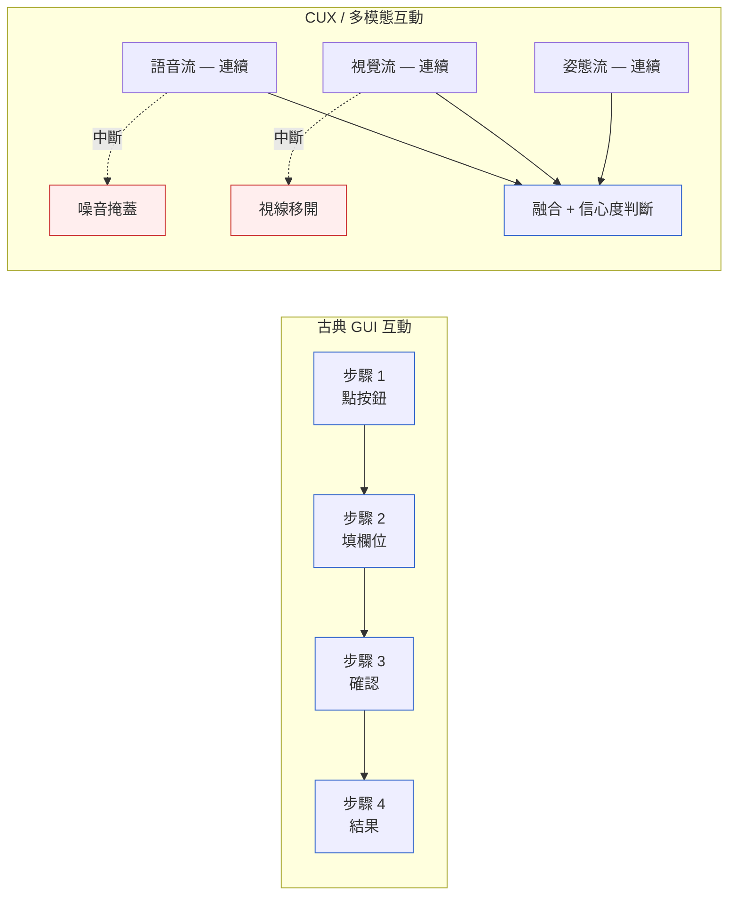
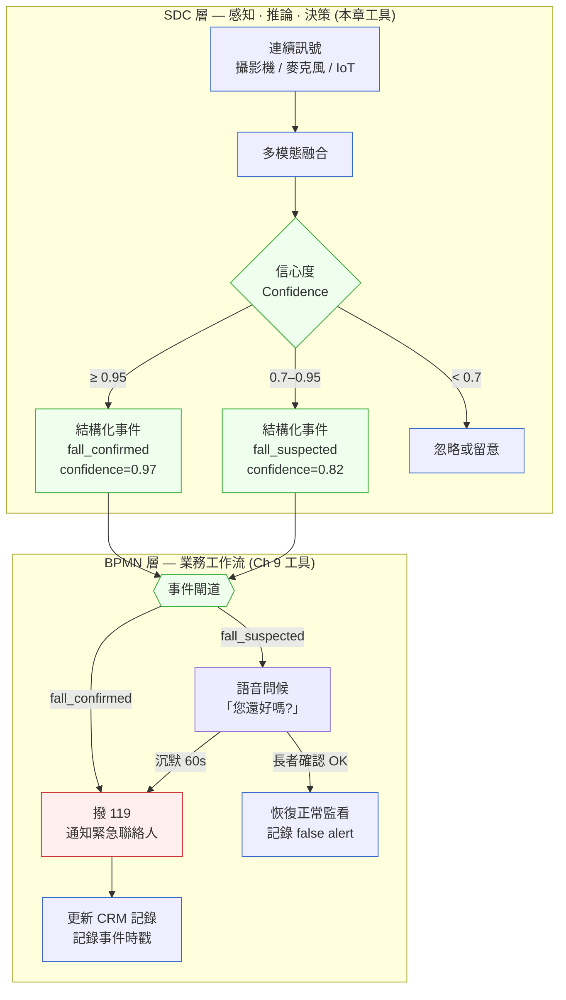
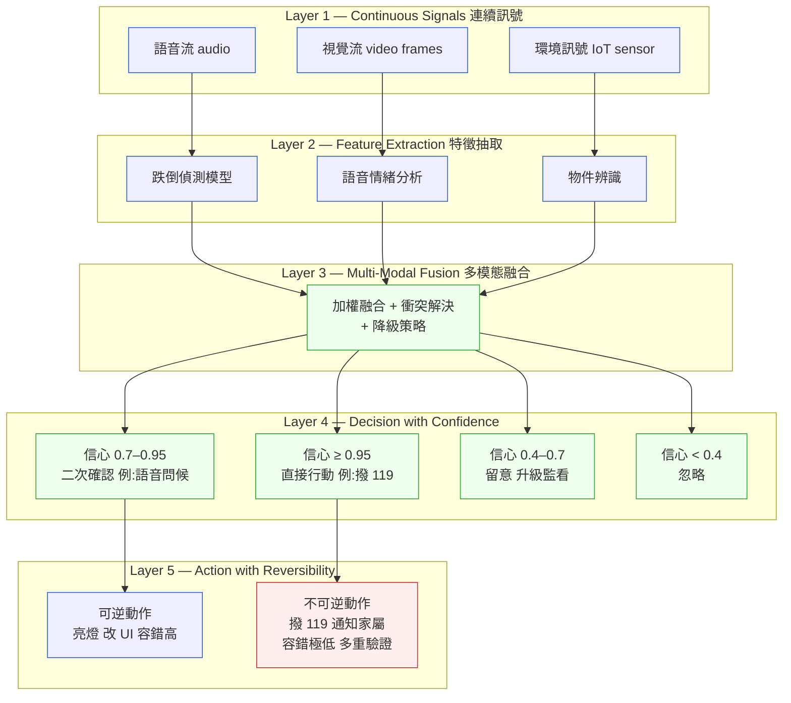
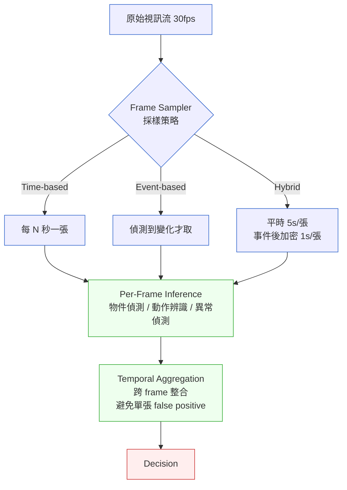

# 第 17 章|多模態與對話式互動的系統分析
## ⸺ Multimodal & Conversational UX (CUX) Systems Analysis

> **前置閱讀**:[Ch 9 流程模型](../part-02-analysis/ch-09-process-modeling.md)、[Ch 16](./ch-16-uiux-system-view.md)
> **下游章節**:[Ch 27 Security by Design](../part-05-quality/ch-27-security-by-design.md)
> **延伸補章**:[Ch 26 邊緣/OT-IT](../part-04-architecture/ch-26-edge-ot-it.md)、[Ch 28 Compliance](../part-05-quality/ch-28-compliance.md)

---

## 17.1 冷觀察 ⸺ 古典分析語彙的破口

2026 年 Q1,虛構消費級語音助理 SaaS **VoiceLoft**(`CASE-SAS-013`)⸺ 一家 42 人的台灣新創,主力產品是讓企業客服團隊在 LINE OA 和 WhatsApp 上架設 AI 語音機器人 ⸺ 在設計新一版的「語音點餐 + 即時視覺確認」功能時陷入了僵局。技術棧:Python 3.12 + FastAPI 0.110 + PostgreSQL 17 + Redis 7 + Whisper large-v3 語音辨識 + GPT-4o Vision,部署在 GCP Cloud Run;前端為 React 19 搭 WebRTC 1.0 即時音視訊串流。

功能需求看起來很直觀:使用者對著手機說「我要一個中杯抹茶拿鐵,不加糖」,系統即時語音辨識 + 顯示確認卡片;若拿起手機對著菜單拍一下,視覺模型自動填入項目。SA 林彥宗花了兩週畫出一份 BPMN 2.0 流程圖,加上 UML 活動圖:共 23 個活動框、7 個決策菱形、4 張狀態機。圖的確畫完了。工程師看圖後的反應是沉默。

「這張圖告訴我使用者說話之後系統會辨識,辨識完之後系統會確認」⸺ 資深後端工程師陳俊佑把圖推回桌上⸺「可是它完全沒告訴我:使用者說到一半環境噪音蓋掉了怎麼辦?視覺辨識信心度 0.61 要不要顯示確認卡?使用者同時說話又比手勢,我聽哪個?這張圖等於沒有。」

那場會議在 2026-02-17 下午四點散會。BPMN 圖被 pin 在 Confluence 頁面上,沒有人再打開它。三週後 Sprint Review 上,QA 發現語音打斷場景的處理邏輯出現在四個不同服務裡,各自的邏輯互相矛盾:ASR 模組等待 2 秒才重試,Intent Router 等待 0.5 秒就切斷,Vision 模組假設沒有超時情境。P99 端到端延遲 3.4 秒,測試場景中有 18% 的語音輸入在超過一人說話時被直接丟棄,沒有任何降級行為。

根本原因不是工程師寫錯了。是 SA 交付物從一開始就用錯了工具。

---

[Ch 16 UI/UX](./ch-16-uiux-system-view.md) 談的 Information Architecture、Atomic Design、Generative UI,以及 [Ch 9 流程模型](../part-02-analysis/ch-09-process-modeling.md) 提到的 BPMN、活動圖、狀態機 ⸺ 這些工具的共同假設是:**互動是離散的、有先後的、可編號的**。使用者點一個按鈕、跳到下一個畫面、輸入欄位、按確定。

但 2025–2026 的人機互動正在發生根本轉移:

- **語音優先(Voice-First)**:智慧音箱與車載助理已經是主介面。
- **聊天優先(Chat-First)**:絕大多數新世代企業 SaaS 加上 Copilot,Copilot 變成首要入口。
- **相機作為感應器(Camera-as-Sensor)**:即時視覺串流(直播零售、AR 維修、無人巡檢)變成持續輸入,而不是「拍一張照」。
- **空間運算(Spatial Computing)**:Apple Vision Pro、Meta Quest 把使用者放在三維空間中,目光、手勢、身體姿態成為互動向量。

這些互動有三個共同特徵,讓古典分析工具破功:

1. **連續而非離散**:沒有清晰的「步驟 1 → 步驟 2」界線。
2. **多軌平行**:使用者可以同時說話 + 比手勢 + 看著某個物件,三個訊號同時產生。
3. **充滿中斷**:語音被環境噪音打斷、攝影機被遮蔽、視線飄走 ⸺ 系統必須能在「資訊缺失」狀態下優雅運作。



## 17.2 真問題 ⸺ 為什麼 BPMN 在這裡破功

舉一個具體的虛構案例(`CASE-HCR-004`):一個「居家視訊看護」系統 ⸺ 長者在客廳,系統用攝影機 + 語音助理持續監看。場景:**長者跌倒了**。

用 BPMN 畫這個流程,會這樣寫:

```
攝影機捕捉到跌倒 → 系統告警 → 語音問「您還好嗎?」→ 長者回應 → 判斷是否報警
```

**這是錯的。** 真實情況是:

- 攝影機可能誤判(影子、坐姿改變、寵物穿過)
- 長者可能正在睡著沒回應
- 語音問問題的當下,長者可能已經昏迷
- 鄰居敲門的聲音可能被誤認為「跌倒撞擊聲」
- 長者可能說「我沒事」但實際語調顫抖

BPMN 的活動框與決策菱形,完全表達不出**「機率性訊號」「持續推論」「跨模態融合」「不確定下的決策」** 這四件事。語意太離散、太線性、太確定。

換句話說,CUX / 多模態系統需要一套新的分析語彙 ⸺ 不是要丟掉 BPMN(它在 [Ch 9](../part-02-analysis/ch-09-process-modeling.md) 仍然好用),是要承認 **BPMN 與 SDC 負責不同的層次,各自維護,並有明確的接合點**。

具體來說,這兩個工具形成垂直分工:

- **SDC 層(感知 → 推論 → 決策)**:接收攝影機、麥克風、IoT 的連續訊號,輸出一個帶信心度的結論 ⸺ 例如「跌倒信心 0.82,進二次確認」。這個輸出是一個**結構化事件**,不是一條線性步驟。
- **BPMN 層(業務工作流)**:以 SDC 輸出的結構化事件作為**觸發條件**,啟動業務邏輯 ⸺ 例如「收到『跌倒確認』事件 → 執行通報流程:通知家屬、更新 CRM 記錄、決定是否撥 119」。

用一個比喻:SDC 是感應器的「翻譯官」,把機率性的連續世界轉換成業務層能讀懂的離散事件;BPMN 則接管這個事件之後發生的跨人、跨系統協作。**兩張圖不能合一,但接合點必須明文定義**。



圖中可以清楚看到:**SDC 的輸出(`fall_confirmed` / `fall_suspected`)就是 BPMN 的輸入事件**。SA 階段需要明確定義這條接縫:事件名稱、schema、信心度欄位、時戳格式 ⸺ 這是兩個層次能獨立演進又不互相破壞的關鍵。

## 17.3 決策框架 ⸺ Signal-Decision-Confidence(SDC)模型

現場好用的分析框架,從訊號處理 + 決策論借過來:**SDC 模型**(Signal-Decision-Confidence)。



SDC 模型對應到 SA 階段的產出物,是新的:

| SDC 元素 | 對應分析產出物 | 內容 |
|---|---|---|
| Continuous Signals | **Signal Catalog**(訊號目錄) | 列出所有持續訊號的格式、頻率、品質、降級條件 |
| Feature Extraction | **Model Contracts**(模型契約) | 每個推論模型的輸入、輸出、信心度語意、版本 |
| Multi-Modal Fusion | **Fusion Rule Table**(融合規則表) | 多訊號的權重、衝突解決、降級策略 |
| Decision with Confidence | **Confidence Decision Tree** | 不同信心區間的行動邏輯 |
| Action with Reversibility | **Irreversible Action List** | 哪些動作必須極高信心 + 多重驗證(撥 119、扣款、發送通知給家屬) |

> **SDC 與 BPMN 的接合點**:SDC 的 Layer 4(Decision with Confidence)輸出的不是直接操作,而是帶信心度的**結構化事件**(例如 `{event: "fall_confirmed", confidence: 0.97, timestamp: …}`)。這個事件才是 BPMN 業務流程的起點 ⸺ 由 BPMN 負責接管之後的跨人/跨系統協作:通知誰、更新哪張表、走哪條審批鏈。**兩層各自版本控制,接縫處的事件 schema 就是兩層的契約**。詳見 §17.2 的垂直分工圖。

### 17.3.1 對話式介面(CUX)的特殊分析語彙

對話流不像表單,它沒有固定欄位順序。但它仍然有結構,只是這個結構是**意圖網絡(Intent Graph)** 而非流程圖。

**意圖網絡的三個層次**:

| 層 | 名稱 | 例 |
|---|---|---|
| Layer 1 | Intent(意圖) | 「我要訂位」「我要查詢」「我要取消」 |
| Layer 2 | Slots(槽位) | 訂位需要 [日期, 時間, 人數, 偏好] |
| Layer 3 | Confirmation(確認) | 覆述 / 部份覆述 / 預覽 / 直接確認 |

**對話流的五種典型路徑** ⸺ 不要試圖用單一流程圖捕捉對話,改用「五條典型路徑 + 邊角案例集」:

| 路徑 | 特徵 | 設計重點 |
|---|---|---|
| **Happy Path** | 使用者一次給齊資訊 | 只需確認,不要囉嗦 |
| **Slot Filling** | 一次給部份,系統逐步問 | 問題順序按重要性 |
| **Disambiguation** | 使用者意圖模糊 | 提供 2–3 個明確選項 |
| **Correction** | 使用者改主意 | 必須能無痛回退 |
| **Bailout** | 使用者放棄 / 升級到人 | 摩擦低、不羞辱使用者 |

每條路徑都應該有獨立的對話腳本與評估標準。

**邊界案例必修**:

- **沉默處理**:使用者說一半停下來,系統等多久才開口?(經驗值:語音場景 3–5 秒,文字場景無限等待)
- **打斷處理**(Barge-in):使用者在系統說話時直接打斷,系統必須立刻停。
- **錯誤恢復**:語音辨識(ASR)錯了,系統如何優雅修復?重複問可能讓使用者爆炸。
- **多人對話**(Cocktail Party):多人同時說話,系統聽誰?這在車載與會議場景每天遇到。
- **情緒升級**:使用者開始焦躁,系統必須能識別並降階(降速、改詞、轉人工)。

### 17.3.2 視覺即時串流(Camera-as-Sensor)的系統分析

當攝影機從「拍一張照」變成「持續輸入」,SA 工件也要對應改變。下面是好用的「採樣決策圖」:



**兩個踩坑**:

- **不要把 30fps 整段送進雲端做推論** ⸺ 頻寬與成本會爆炸。一定要在 Edge 做 Frame Sampler(回看 [Ch 26](../part-04-architecture/ch-26-edge-ot-it.md))。
- **不要相信單張 frame 的判斷** ⸺ 用 Temporal Aggregation。例如「連續 3 張都偵測到跌倒姿態才告警」。

**視覺即時串流的隱私問題**(跟 [Ch 28](../part-05-quality/ch-28-compliance.md) 緊密相關):**攝影機是個資災區**。

- **邊緣處理(Edge-Inference)**:只把判斷結果上傳,原始影像不上傳。
- **即時去識別化(Real-time Anonymization)**:上傳前打馬賽克 / 替換臉部。
- **同意管理**:被拍到的人是否同意被處理?(尤其是公共場域)
- **留存最小化**:推論完即刪,不要為了「以防萬一」留 30 天。

---

## 17.4 踩坑清單

下面四個常見地雷,在多模態 / CUX 系統反覆出現:

### 反模式 1:用 BPMN 畫「感知 → 推論 → 決策」這層

把連續訊號 + 機率性推論硬塞進活動框 + 決策菱形,結果是「程式碼跟 BPMN 圖完全對不起來」,圖變裝飾。

> ✅ **修正方向**:BPMN 留給跨人/跨系統的工作流(報警後通知誰、下一步流程);感知層用 SDC 模型 + Signal Catalog + Confidence Decision Tree。兩個層次的圖**分開維護**,各自版本控制。接縫處定義結構化事件 schema(事件名稱、信心度欄位、時戳)作為兩層的契約 ⸺ SDC 輸出這個事件,BPMN 以它為觸發條件,兩側可以獨立演進。

### 反模式 2:相信單張 frame / 單句語音

「攝影機看到跌倒姿態 → 立刻撥 119」聽起來合理,實際做下去 false positive 率會讓家屬把系統拔掉。

> ✅ **修正方向**:Temporal Aggregation 內建。連續 N 張一致才升級;不一致時多訊號融合(語音問候 + 加密器音訊驗證 + 二次視覺確認)。把「升級門檻」寫進 Confidence Decision Tree,不是寫死在程式碼。

### 反模式 3:把不可逆動作的信心門檻設成跟可逆動作一樣

「亮個提示燈」跟「自動撥 119」放在同一個信心區間裡,後者一旦誤觸,使用者體驗成本極高(警消白跑 + 家屬恐慌 + 信任崩塌)。

> ✅ **修正方向**:Action with Reversibility 是獨立分析步驟。不可逆動作必須:(a) 信心門檻提高;(b) 多重驗證(模型 + 規則 + 人工 confirm);(c) Cool-down 期(同一觸發 5 分鐘內不重複)。

### 反模式 4:把原始多模態資料整段送雲端

頻寬 + 成本 + 合規(個資)三方面都會出事。

> ✅ **修正方向**:Edge-first inference。原始流不離開現場,只把判斷結果(+ 必要證據片段)上傳。隱私設計與 [Ch 28](../part-05-quality/ch-28-compliance.md) 對齊:同意管理、去識別化、留存最小化、DPIA 在開工前做完。

---

## 17.5 交付清單 ⸺ 多模態 / CUX 系統設計 Checklist

每個多模態 / CUX 系統開工前,以下 artifact 應該齊備:

````markdown
# CUX/Multimodal Design Pack — {專案名稱}

## 1. Interaction Mode Catalog(互動模式分類)
- [ ] 列出本系統所有互動模式(GUI / Voice / Chat / Vision / Spatial 至少標一個)
- [ ] 標示每種模式的主場景與降級備案

## 2. Signal Catalog(訊號目錄)
| Signal ID | 來源 | 格式 | 頻率 | 品質指標 | 降級條件 |
|---|---|---|---|---|---|

## 3. Model Contracts(模型契約)
- [ ] 每個推論模型一張卡:輸入 / 輸出 / 信心度語意 / 版本 / SLO

## 4. Fusion Rule Table(融合規則表)
- [ ] 多訊號權重
- [ ] 衝突解決原則
- [ ] 降級策略(視覺斷線時退回語音 + IoT)

## 5. Confidence Decision Tree(信心度決策樹)
- [ ] ≥ 0.95 / 0.7–0.95 / 0.4–0.7 / < 0.4 各區間動作

## 6. Irreversible Action List(不可逆動作清單)
- [ ] 哪些動作必須極高信心 + 多重驗證
- [ ] Cool-down 規則

## 7. (僅 CUX)Conversation Path Pack(對話流五路徑包)
- [ ] Happy Path / Slot Filling / Disambiguation / Correction / Bailout 各一份腳本
- [ ] 邊角案例集(沉默 / 打斷 / 多人 / 情緒升級)

## 8. (僅 Vision)Sampling & Privacy Pack
- [ ] 採樣決策圖
- [ ] Edge-Inference 邊界
- [ ] 去識別化策略
- [ ] DPIA / 同意管理(對齊Ch 28)
````

把這份清單放在 `docs/cux-design-pack/`,跟程式碼同 repo,跟 README 同層。

### 17.5.1 範例:居家視訊看護「跌倒偵測」的 Design Pack 雛形

把 §17.2 那個「攝影機 + 語音助理持續監看長者」的虛構案例(`CASE-HCR-004`)展成可帶走的雛形。下面這份是工程開工前 PM + SA + 設計三方第一次坐下來時應該交出的版本 ⸺ 不是上線檔,是讓「我們真的把感知層拆成五層」這件事被擺到桌面的證據。

````markdown
# CUX/Multimodal Design Pack — 居家視訊看護:跌倒偵測

> 版本:v0.1 | 撰寫日期:2026-04-15 | 擁有人:@yu(SA)+ @hwang(IxD)
> 對應 ADR:`docs/adr/0008-fall-detect-sdc-five-layer.md`

## 1. Interaction Mode Catalog
- 主場景:Camera-as-Sensor(連續視覺串流,30fps)+ Voice(雙向)+ IoT(穿戴心率)
- 降級備案:視覺斷線時退回 Voice + IoT;Voice 噪音時退回 Visual + IoT

## 2. Signal Catalog
<!-- 為什麼這欄:三條訊號各有自己的「斷線長相」;
     沒寫降級條件,系統在訊號缺失時會做出有信心但錯的決定。 -->
| Signal ID | 來源 | 格式 | 頻率 | 品質指標 | 降級條件 |
|---|---|---|---|---|---|
| `VID-LIVE` | 客廳攝影機 | H.264 720p | 30fps | 亮度 / 遮蔽率 | 遮蔽 > 60% 連 5s → 視為斷線 |
| `AUD-AMB` | 智慧音箱麥克風 | 16kHz PCM | 連續 | SNR / VAD | SNR < 6dB → 不採信 |
| `IOT-HR` | 穿戴心率帶 | BLE 1Hz | 1Hz | 訊號強度 | 連 30s 無心跳 → 升級疑似昏迷 |

## 3. Model Contracts
- `fall-detector.v2`:輸入 1s 視訊片段(30 frame),輸出 `{posture, confidence}`,SLO P95 < 200ms
- `voice-emotion.v1`:輸入 3s 音訊,輸出 `{stress_level 0-1, confidence}`,SLO P95 < 400ms

## 4. Fusion Rule Table
| 組合 | 權重 | 結論 |
|---|---|---|
| 視覺(跌倒姿態, 0.92)+ 語音「我沒事」但顫抖 0.7 | 視覺 0.6 / 語音 0.4 | 不可信「我沒事」,進二次確認 |
| 視覺斷線 + 心率消失 30s | IoT 主導 | 升級疑似昏迷,撥緊急聯絡人 |
| 視覺(疑似跌倒, 0.55)+ 寵物辨識命中 | 視覺降權至 0.2 | 忽略 |

## 5. Confidence Decision Tree
<!-- 為什麼這欄:單張 frame 的 0.95 不等於連續 3 張的 0.95;
     不寫成階梯,Q/A 沒辦法分區間驗收。 -->
- ≥ 0.95(連續 3 frame)→ 撥 119(不可逆,需多重驗證)
- 0.7–0.95 → 語音問候「您還好嗎?」+ 啟動心率聚焦
- 0.4–0.7 → 留意 30 秒,加密採樣
- < 0.4 → 忽略,正常採樣

## 6. Irreversible Action List
<!-- 為什麼這欄:撥 119 跟亮提示燈設成同一信心區間,
     誤觸一次就會被家屬把系統拔掉。 -->
- 撥 119 / 通知緊急聯絡人:信心 ≥ 0.95 + 多訊號融合一致 + 5 分鐘 cool-down
- 解鎖門鎖讓救護員進屋:信心 ≥ 0.98 + 心率異常 + 緊急聯絡人遠端 confirm

## 7. Conversation Path Pack
- Happy Path:長者主動回應「我沒事」聲音穩 → 降回正常監看
- Slot Filling:「您能站起來嗎?」「能 / 不能 / 沒回應」
- Disambiguation:模糊「嗯…」→ 提供「按一次燈 = OK」物理按鈕
- Correction:長者說「剛才是寵物跳上來」→ 模型加入 false positive 訓練佇列
- Bailout:長者沉默 60 秒 → 直接撥緊急聯絡人(不等 119 流程)

## 8. Sampling & Privacy Pack
- 採樣:平時 5s/張,event-triggered 加密 1s/張
- Edge-Inference:`fall-detector` 在客廳 mini-PC 跑,雲端**只**收結果
- 去識別化:上傳片段前打馬賽克(臉 + 衣物 logo)
- 同意:DPIA 已完成;訪客模式啟動時暫停錄製
````

跟 BPMN 那條「攝影機告警 → 語音問候 → 判斷是否報警」線性流程比起來,這份 Pack 多寫了五個欄位 ⸺ 它們的價值不在文件變厚,在 false positive 把家屬逼到拔掉系統之前,有地方可以先回答「為什麼這次不撥 119」。**多模態系統的設計工作,是把「機率」變成可審查的決定。**

---

## 17.6 Recap

讀完本章,應該已經能做到:

- [ ] 認得出哪些系統需要 CUX/多模態分析語彙(Voice-First / Chat-First / Camera-as-Sensor / Spatial)
- [ ] 用 SDC 五層模型分析「感知 → 推論 → 決策」這一層,而不是強用 BPMN
- [ ] 對對話流寫五條路徑 + 邊角案例,而非單一流程圖
- [ ] 在不可逆動作上獨立設計信心門檻與多重驗證
- [ ] 把視覺串流的隱私設計提前到 SA 階段(對齊 [Ch 28](../part-05-quality/ch-28-compliance.md))

如果四項中先挑一項做,建議是第二項 ⸺ 把現有系統試著畫一張 SDC 五層圖,你大概會立刻發現 Fusion 與 Irreversible Action 兩格之前沒人寫過。

---

## Cross-References

- **前置**:[Ch 9 流程模型](../part-02-analysis/ch-09-process-modeling.md)、[Ch 16 UI/UX](./ch-16-uiux-system-view.md)
- **下游**:[Ch 27 Security by Design](../part-05-quality/ch-27-security-by-design.md)
- **延伸補章**:[Ch 26 邊緣/OT-IT](../part-04-architecture/ch-26-edge-ot-it.md)(Edge-Inference)、[Ch 28 Compliance](../part-05-quality/ch-28-compliance.md)(視覺隱私 / DPIA)

## 引用

本章無外部文獻引用。
