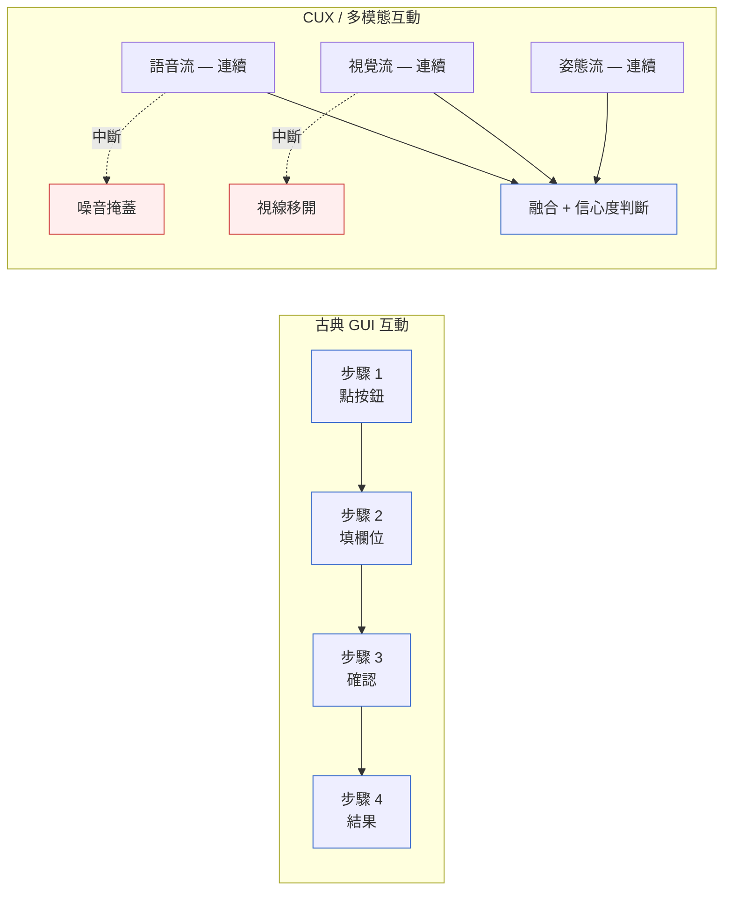
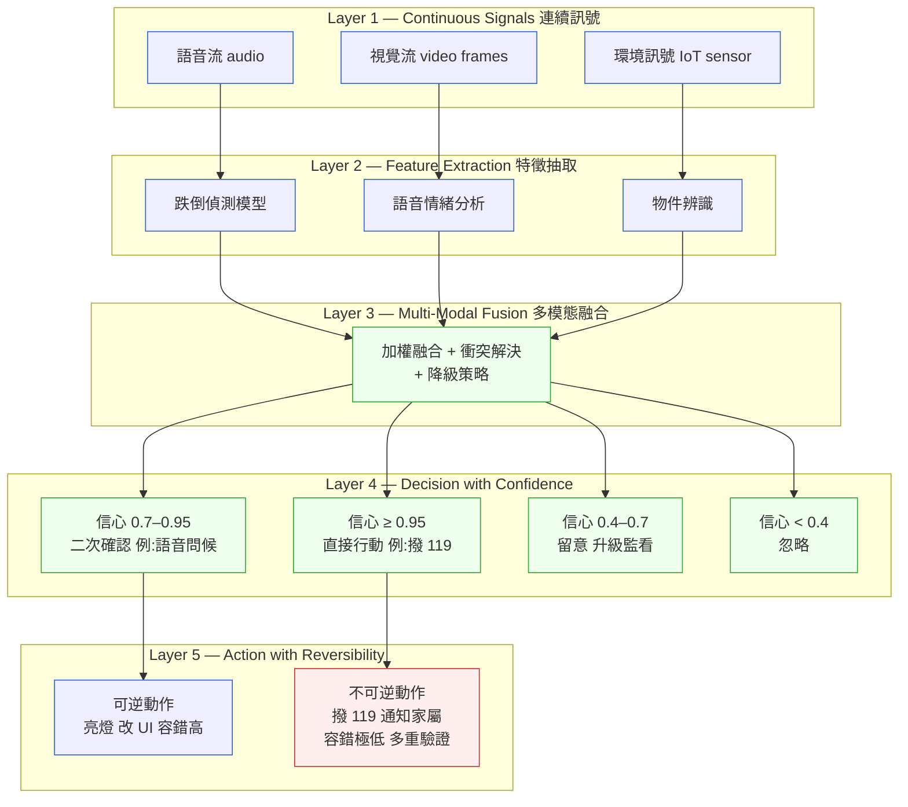
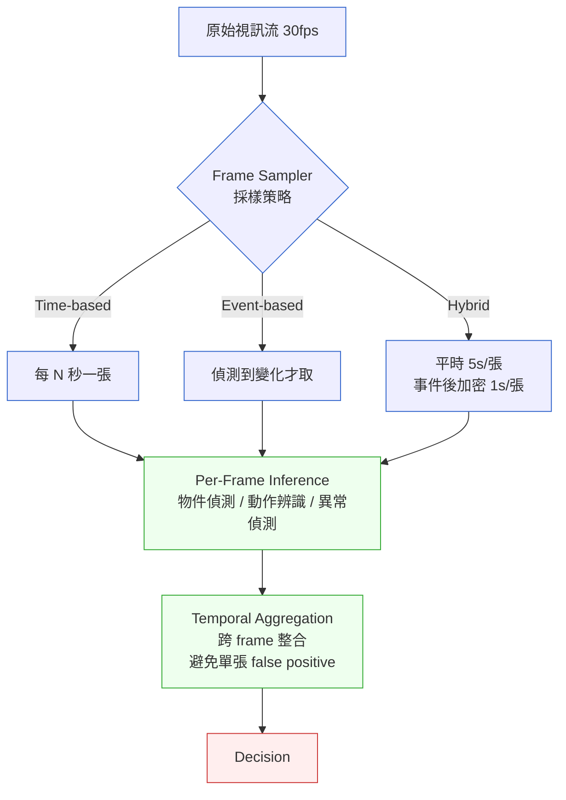

# 補章 F|多模態與對話式互動的系統分析
## ⸺ Multimodal & Conversational UX (CUX) Systems Analysis

> **插入位置**:緊接 [Ch 16 UI/UX 與人機互動的系統觀](./ch-16-uiux-system-view.md) 之後
> **前置閱讀**:[Ch 9 流程模型](../part-02-analysis/ch-09-process-modeling.md)、[Ch 16](./ch-16-uiux-system-view.md)
> **下游章節**:[Ch 25 Security by Design](../part-05-quality/ch-25-security-by-design.md)
> **延伸補章**:[補章 A 邊緣/OT-IT](../part-04-architecture/chA-edge-ot-it.md)、[補章 E Compliance](../part-05-quality/chE-compliance.md)

---

## F.1 冷觀察 ⸺ 古典分析語彙的破口

[Ch 16 UI/UX](./ch-16-uiux-system-view.md) 談的 Information Architecture、Atomic Design、Generative UI,以及 [Ch 9 流程模型](../part-02-analysis/ch-09-process-modeling.md) 提到的 BPMN、活動圖、狀態機 ⸺ 這些工具的共同假設是:**互動是離散的、有先後的、可編號的**。使用者點一個按鈕、跳到下一個畫面、輸入欄位、按確定。

但 2025–2026 的人機互動正在發生根本轉移:

- **語音優先(Voice-First)**:智慧音箱與車載助理已經是主介面。
- **聊天優先(Chat-First)**:絕大多數新世代企業 SaaS 加上 Copilot,Copilot 變成首要入口。
- **相機作為感應器(Camera-as-Sensor)**:即時視覺串流(直播零售、AR 維修、無人巡檢)變成持續輸入,而不是「拍一張照」。
- **空間運算(Spatial Computing)**:Apple Vision Pro、Meta Quest 把使用者放在三維空間中,目光、手勢、身體姿態成為互動向量。

這些互動有三個共同特徵,讓古典分析工具破功:

1. **連續而非離散**:沒有清晰的「步驟 1 → 步驟 2」界線。
2. **多軌平行**:使用者可以同時說話 + 比手勢 + 看著某個物件,三個訊號同時產生。
3. **充滿中斷**:語音被環境噪音打斷、攝影機被遮蔽、視線飄走 ⸺ 系統必須能在「資訊缺失」狀態下優雅運作。



## F.2 真問題 ⸺ 為什麼 BPMN 在這裡破功

舉一個具體的虛構案例(`CASE-HCR-004`):一個「居家視訊看護」系統 ⸺ 長者在客廳,系統用攝影機 + 語音助理持續監看。場景:**長者跌倒了**。

用 BPMN 畫這個流程,會這樣寫:

```
攝影機捕捉到跌倒 → 系統告警 → 語音問「您還好嗎?」→ 長者回應 → 判斷是否報警
```

**這是錯的。** 真實情況是:

- 攝影機可能誤判(影子、坐姿改變、寵物穿過)
- 長者可能正在睡著沒回應
- 語音問問題的當下,長者可能已經昏迷
- 鄰居敲門的聲音可能被誤認為「跌倒撞擊聲」
- 長者可能說「我沒事」但實際語調顫抖

BPMN 的活動框與決策菱形,完全表達不出**「機率性訊號」「持續推論」「跨模態融合」「不確定下的決策」** 這四件事。語意太離散、太線性、太確定。

換句話說,CUX / 多模態系統需要一套新的分析語彙 ⸺ 不是要丟掉 BPMN(它在 [Ch 9](../part-02-analysis/ch-09-process-modeling.md) 仍然好用),是要承認 BPMN 適合的層次到「業務工作流」為止,**「感知 → 推論 → 決策」這一層需要不同工具**。

## F.3 決策框架 ⸺ Signal-Decision-Confidence(SDC)模型

現場好用的分析框架,從訊號處理 + 決策論借過來:**SDC 模型**(Signal-Decision-Confidence)。



SDC 模型對應到 SA 階段的產出物,是新的:

| SDC 元素 | 對應分析產出物 | 內容 |
|---|---|---|
| Continuous Signals | **Signal Catalog**(訊號目錄) | 列出所有持續訊號的格式、頻率、品質、降級條件 |
| Feature Extraction | **Model Contracts**(模型契約) | 每個推論模型的輸入、輸出、信心度語意、版本 |
| Multi-Modal Fusion | **Fusion Rule Table**(融合規則表) | 多訊號的權重、衝突解決、降級策略 |
| Decision with Confidence | **Confidence Decision Tree** | 不同信心區間的行動邏輯 |
| Action with Reversibility | **Irreversible Action List** | 哪些動作必須極高信心 + 多重驗證(撥 119、扣款、發送通知給家屬) |

### F.3.1 對話式介面(CUX)的特殊分析語彙

對話流不像表單,它沒有固定欄位順序。但它仍然有結構,只是這個結構是**意圖網絡(Intent Graph)** 而非流程圖。

**意圖網絡的三個層次**:

| 層 | 名稱 | 例 |
|---|---|---|
| Layer 1 | Intent(意圖) | 「我要訂位」「我要查詢」「我要取消」 |
| Layer 2 | Slots(槽位) | 訂位需要 [日期, 時間, 人數, 偏好] |
| Layer 3 | Confirmation(確認) | 覆述 / 部份覆述 / 預覽 / 直接確認 |

**對話流的五種典型路徑** ⸺ 不要試圖用單一流程圖捕捉對話,改用「五條典型路徑 + 邊角案例集」:

| 路徑 | 特徵 | 設計重點 |
|---|---|---|
| **Happy Path** | 使用者一次給齊資訊 | 只需確認,不要囉嗦 |
| **Slot Filling** | 一次給部份,系統逐步問 | 問題順序按重要性 |
| **Disambiguation** | 使用者意圖模糊 | 提供 2–3 個明確選項 |
| **Correction** | 使用者改主意 | 必須能無痛回退 |
| **Bailout** | 使用者放棄 / 升級到人 | 摩擦低、不羞辱使用者 |

每條路徑都應該有獨立的對話腳本與評估標準。

**邊界案例必修**:

- **沉默處理**:使用者說一半停下來,系統等多久才開口?(經驗值:語音場景 3–5 秒,文字場景無限等待)
- **打斷處理**(Barge-in):使用者在系統說話時直接打斷,系統必須立刻停。
- **錯誤恢復**:語音辨識(ASR)錯了,系統如何優雅修復?重複問可能讓使用者爆炸。
- **多人對話**(Cocktail Party):多人同時說話,系統聽誰?這在車載與會議場景每天遇到。
- **情緒升級**:使用者開始焦躁,系統必須能識別並降階(降速、改詞、轉人工)。

### F.3.2 視覺即時串流(Camera-as-Sensor)的系統分析

當攝影機從「拍一張照」變成「持續輸入」,SA 工件也要對應改變。下面是好用的「採樣決策圖」:



**兩個踩坑**:

- **不要把 30fps 整段送進雲端做推論** ⸺ 頻寬與成本會爆炸。一定要在 Edge 做 Frame Sampler(回看 [補章 A](../part-04-architecture/chA-edge-ot-it.md))。
- **不要相信單張 frame 的判斷** ⸺ 用 Temporal Aggregation。例如「連續 3 張都偵測到跌倒姿態才告警」。

**視覺即時串流的隱私問題**(跟 [補章 E](../part-05-quality/chE-compliance.md) 緊密相關):**攝影機是個資災區**。

- **邊緣處理(Edge-Inference)**:只把判斷結果上傳,原始影像不上傳。
- **即時去識別化(Real-time Anonymization)**:上傳前打馬賽克 / 替換臉部。
- **同意管理**:被拍到的人是否同意被處理?(尤其是公共場域)
- **留存最小化**:推論完即刪,不要為了「以防萬一」留 30 天。

---

## F.4 踩坑清單

下面四個常見地雷,在多模態 / CUX 系統反覆出現:

### 反模式 1:用 BPMN 畫「感知 → 推論 → 決策」這層

把連續訊號 + 機率性推論硬塞進活動框 + 決策菱形,結果是「程式碼跟 BPMN 圖完全對不起來」,圖變裝飾。

> ✅ **修正方向**:BPMN 留給跨人/跨系統的工作流(報警後通知誰、下一步流程);感知層用 SDC 模型 + Signal Catalog + Confidence Decision Tree。兩個層次的圖**分開維護**,各自版本控制。

### 反模式 2:相信單張 frame / 單句語音

「攝影機看到跌倒姿態 → 立刻撥 119」聽起來合理,實際做下去 false positive 率會讓家屬把系統拔掉。

> ✅ **修正方向**:Temporal Aggregation 內建。連續 N 張一致才升級;不一致時多訊號融合(語音問候 + 加密器音訊驗證 + 二次視覺確認)。把「升級門檻」寫進 Confidence Decision Tree,不是寫死在程式碼。

### 反模式 3:把不可逆動作的信心門檻設成跟可逆動作一樣

「亮個提示燈」跟「自動撥 119」放在同一個信心區間裡,後者一旦誤觸,使用者體驗成本極高(警消白跑 + 家屬恐慌 + 信任崩塌)。

> ✅ **修正方向**:Action with Reversibility 是獨立分析步驟。不可逆動作必須:(a) 信心門檻提高;(b) 多重驗證(模型 + 規則 + 人工 confirm);(c) Cool-down 期(同一觸發 5 分鐘內不重複)。

### 反模式 4:把原始多模態資料整段送雲端

頻寬 + 成本 + 合規(個資)三方面都會出事。

> ✅ **修正方向**:Edge-first inference。原始流不離開現場,只把判斷結果(+ 必要證據片段)上傳。隱私設計與 [補章 E](../part-05-quality/chE-compliance.md) 對齊:同意管理、去識別化、留存最小化、DPIA 在開工前做完。

---

## F.5 交付清單 ⸺ 多模態 / CUX 系統設計 Checklist

每個多模態 / CUX 系統開工前,以下 artifact 應該齊備:

````markdown
# CUX/Multimodal Design Pack — {專案名稱}

## 1. Interaction Mode Catalog(互動模式分類)
- [ ] 列出本系統所有互動模式(GUI / Voice / Chat / Vision / Spatial 至少標一個)
- [ ] 標示每種模式的主場景與降級備案

## 2. Signal Catalog(訊號目錄)
| Signal ID | 來源 | 格式 | 頻率 | 品質指標 | 降級條件 |
|---|---|---|---|---|---|

## 3. Model Contracts(模型契約)
- [ ] 每個推論模型一張卡:輸入 / 輸出 / 信心度語意 / 版本 / SLO

## 4. Fusion Rule Table(融合規則表)
- [ ] 多訊號權重
- [ ] 衝突解決原則
- [ ] 降級策略(視覺斷線時退回語音 + IoT)

## 5. Confidence Decision Tree(信心度決策樹)
- [ ] ≥ 0.95 / 0.7–0.95 / 0.4–0.7 / < 0.4 各區間動作

## 6. Irreversible Action List(不可逆動作清單)
- [ ] 哪些動作必須極高信心 + 多重驗證
- [ ] Cool-down 規則

## 7. (僅 CUX)Conversation Path Pack(對話流五路徑包)
- [ ] Happy Path / Slot Filling / Disambiguation / Correction / Bailout 各一份腳本
- [ ] 邊角案例集(沉默 / 打斷 / 多人 / 情緒升級)

## 8. (僅 Vision)Sampling & Privacy Pack
- [ ] 採樣決策圖
- [ ] Edge-Inference 邊界
- [ ] 去識別化策略
- [ ] DPIA / 同意管理(對齊補章 E)
````

把這份清單放在 `docs/cux-design-pack/`,跟程式碼同 repo,跟 README 同層。

---

## F.6 Recap

讀完本章,應該已經能做到:

- [ ] 認得出哪些系統需要 CUX/多模態分析語彙(Voice-First / Chat-First / Camera-as-Sensor / Spatial)
- [ ] 用 SDC 五層模型分析「感知 → 推論 → 決策」這一層,而不是強用 BPMN
- [ ] 對對話流寫五條路徑 + 邊角案例,而非單一流程圖
- [ ] 在不可逆動作上獨立設計信心門檻與多重驗證
- [ ] 把視覺串流的隱私設計提前到 SA 階段(對齊 [補章 E](../part-05-quality/chE-compliance.md))

如果四項中先挑一項做,建議是第二項 ⸺ 把現有系統試著畫一張 SDC 五層圖,你大概會立刻發現 Fusion 與 Irreversible Action 兩格之前沒人寫過。

---

## Cross-References

- **前置**:[Ch 9 流程模型](../part-02-analysis/ch-09-process-modeling.md)、[Ch 16 UI/UX](./ch-16-uiux-system-view.md)
- **下游**:[Ch 25 Security by Design](../part-05-quality/ch-25-security-by-design.md)
- **延伸補章**:[補章 A 邊緣/OT-IT](../part-04-architecture/chA-edge-ot-it.md)(Edge-Inference)、[補章 E Compliance](../part-05-quality/chE-compliance.md)(視覺隱私 / DPIA)

## 引用

本章無外部文獻引用。
