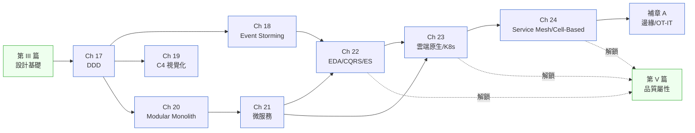

# 第 IV 篇|進階架構

> **這篇的密度最高。不是因為工具多,是因為每個工具都是為了處理一種你在小系統裡還沒遇到的稅。**

---

聖維禮醫療體系花了 11 個月把三個系統裡都叫 `patient_id` 的欄位的意思弄清楚。他們沒換任何一行 ORM,只新增了一份 Bounded Context 文件、五個 Anticorruption Layer、三套 Ubiquitous Language Glossary。出院結算對不上的事故,從月均 27 件降到 1.4 件。

這 11 個月做的事有一個名字:DDD。

第 IV 篇的八章加一個補章,從語言邊界(DDD)、工作坊建模(Event Storming)、多視角文件(C4)、單體到分散式的拆分決策(Modular Monolith → 微服務)、事件流架構(EDA / CQRS / Event Sourcing)、雲端原生(K8s)、流量治理(Service Mesh / Cell-Based),到 IT/OT 融合邊緣場景(補章 A)——按**複雜度增長的順序**展開。每一章都假設你已經知道:這個工具要收的稅,在你現在的規模下值不值得付。

---

## 篇內章節依存圖

---

## 各章核心問句

| 章 | 標題簡稱 | 這章回答的真正問題 |
|---|---|---|
| Ch 17 | DDD 戰略/戰術 | 同一個詞在三個系統裡有三個意思——誰該先承認這件事? |
| Ch 18 | Event Storming | 用便利貼建模和畫 UML 的最大差別在哪? |
| Ch 19 | C4 視覺化 | 一套架構圖怎麼同時讓 CTO 和 junior 工程師都看懂? |
| Ch 20 | Modular Monolith | 2026 微服務反思元年,單體是退步還是選擇? |
| Ch 21 | 微服務 | 什麼條件下分散式系統的稅金值得付? |
| Ch 22 | EDA / CQRS / ES | 三件不該綁在一起的工具,為什麼總是被一起談? |
| Ch 23 | 雲端原生 / K8s | 用了 K8s 就是「雲端原生」嗎? |
| Ch 24 | Service Mesh / Cell-Based | 三層流量治理各自管的是什麼流量? |
| 補章 A | 邊緣 / OT-IT | 當 PLC 和 Kafka 需要說話,OT 的時鐘和 IT 的時鐘誰說了算? |

---

## 不同讀者的建議入口

- **第一次接觸進階架構**:Ch 17 → Ch 20 → Ch 21。三章讀完你能回答「我們系統應不應該拆微服務」這個問題。
- **正在做微服務拆分**:Ch 17(語言邊界)+ Ch 18(Event Storming 建模)+ Ch 22(EDA 接線)是你的三張必讀地圖。
- **平台/基礎設施工程師**:Ch 23 → Ch 24 → 補章 A 是你的主線。
- **能源 / 製造 / 工業 IoT 背景**:補章 A 是全書少數直接對應 OT 現場的章節,值得優先讀。

---

## 前後篇連結

- **前置**:[第 III 篇 設計基礎](../part-03-design/00-overview.md)
- **這篇解鎖**:[第 V 篇 品質屬性](../part-05-quality/00-overview.md) — 架構定型之後,才能有效討論安全、可觀測性和可靠度的設計點
- **長距離影響**:[Ch 33 AI-Native 架構](../part-07-ai-era/ch-33-ai-native-architecture.md)(Ch 22 的 EDA 是 AI 時代事件流的前置)、[Ch 36 Multi-Agent](../part-07-ai-era/ch-36-multi-agent.md)(Ch 17 的 Bounded Context 直接對應 Agent 的邊界劃分)
