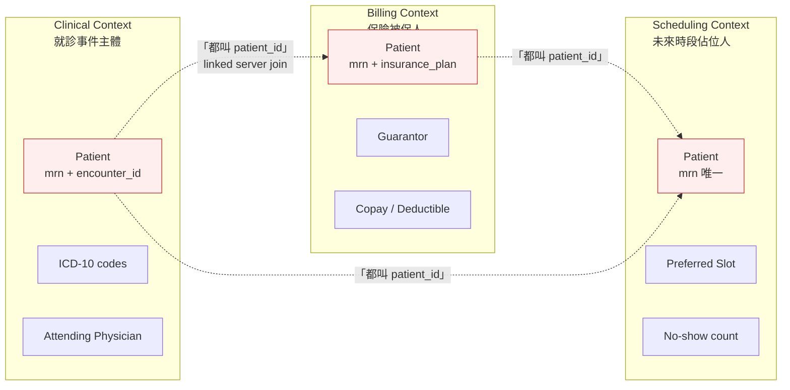
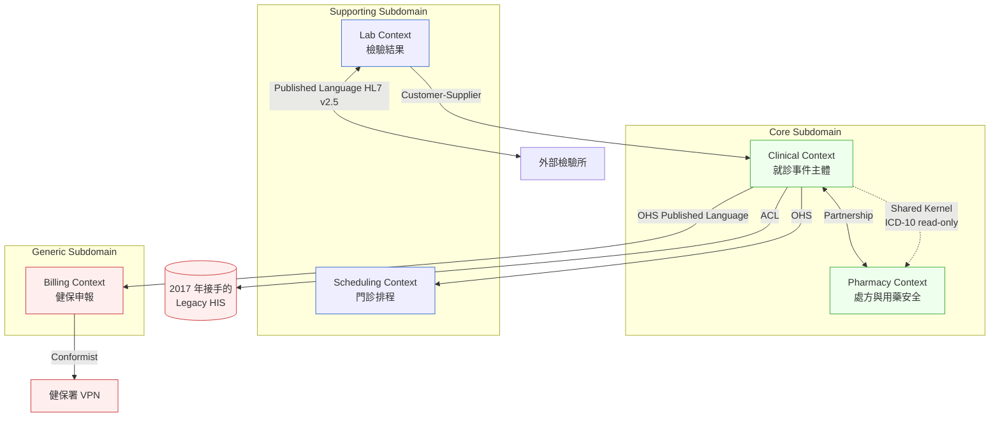
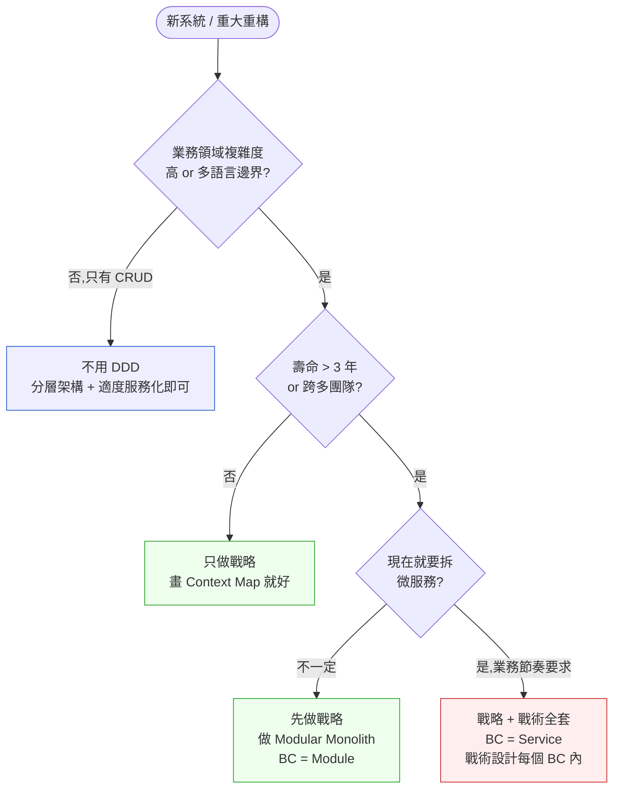

# 第 18 章|領域驅動設計(DDD)
## ⸺ 戰略 vs 戰術,真正的價值在語言邊界

> **前置閱讀**:[Ch 7 物件導向分析(OOA)](../part-02-analysis/ch-07-object-oriented-analysis.md)、[Ch 13 架構風格實戰](../part-03-design/ch-13-architecture-styles.md)
> **下游章節**:[Ch 19 Event Storming](./ch-19-event-storming-modeling.md)、[Ch 21 Modular Monolith](./ch-21-modular-monolith.md)、[Ch 22 微服務](./ch-22-microservices.md)、[Ch 23 Event-Driven Architecture](./ch-23-event-driven-cqrs-es.md)
> **延伸補章**:無

---

## 18.1 冷觀察 ⸺ 三個系統共用一個 `patient`,出院當天對不上

我在 2025 年第二季,看過一個虛構的多科別教學醫院 **聖維禮醫療體系**(`CASE-HCR-005`)。這家醫院 1,400 床,跨七個科別,資訊科 38 人,主系統 2017 年從一家被併購的廠商接手過來,核心是一套 .NET Framework 4.8 寫的 HIS(Hospital Information System),外掛 Clinical / Billing / Scheduling / Pharmacy / Lab 五個子系統,過去八年用 SQL Server linked server 跨系統查資料,大家都覺得這沒什麼問題,直到 2025 年三月那一週。

那一週發生過七次出院結算對不上臨床紀錄。每一次的事故樣態都類似:

> 病人 A,健保卡 MRN `H10234567`,週一 09:14 由急診轉入心臟內科,週四 16:30 出院。出院結算單顯示「總天數 4 天、住院費用 NT$48,210」,但臨床紀錄裡的 ICD-10 主診斷 `I21.4`(NSTEMI)只記到週三 23:59 ⸺ 因為臨床系統用的是「就診事件結束時點」,Billing 用的是「保險日曆日數」,差一天。**沒有人在事故當天能解釋為什麼是差一天,而不是差兩天**。

事故覆盤會上,資訊科主任把三個系統的 ER 圖印出來釘在白板上。三張圖各自都是漂亮的 3NF,每張圖都有一個叫 `Patient` 的實體,中央欄位都是 `patient_id`。但細看下去:

- **Clinical** 系統的 `Patient`:屬性是 `mrn / encounter_id / chief_complaint / icd10_codes[] / attending_physician_id`。它真正在處理的是「**就診事件主體**」⸺ 同一個人這次住院和上次住院是兩個不同的 `Patient` row,因為 ICD-10 編碼會不一樣。
- **Billing** 系統的 `Patient`:屬性是 `mrn / insurance_plan_id / copay_rate / deductible_balance / guarantor_id`。它在處理的是「**保險被保人 + 自費財務責任人**」⸺ 同一個人在不同保險方案會有不同的 `Patient` row,孩子的 `guarantor_id` 指向父親。
- **Scheduling** 系統的 `Patient`:屬性是 `mrn / preferred_slot / no_show_count / sms_consent / preferred_clinic_branch`。它在處理的是「**未來時段佔位人**」⸺ 一個 MRN 對應一個 row,從未住過院但預約過門診的人也在裡面。

三個系統的主鍵都叫 `patient_id`,linked server 的 join condition 都是 `Clinical.dbo.Patient.patient_id = Billing.dbo.Patient.patient_id`,**join 在 SQL 層面從來沒報錯**。但語意層面,Clinical 的「同一個人這次住院」對應 Billing 的「保險方案 A」、對應 Scheduling 的「MRN 主體」,三者根本不是同一個概念。出院當天 Billing 抓 Clinical 的最後一筆診斷,抓到的是「上一個 encounter 的最後一筆」,因為 Billing 認得的是 MRN,Clinical 寫的是 encounter,中間沒有任何系統說過這兩個東西的對應規則。



資訊科主任看了五分鐘,問了一句話,我把它原樣記下來:

> 「我們三個系統的 `Patient` 都通過 schema review,都通過 3NF 稽核,都有 ER 圖。**為什麼一個叫做 `patient_id` 的欄位,在這家醫院就是有四種意思?**」

那場會議結束後,他們花了 11 個月做一件事 ⸺ 不是重寫系統,不是拆微服務,而是**先把每個子系統內部的「同一個詞所有人理解一致」這件事做出來,再去談跨系統的 join**。這 11 個月他們沒換任何一行 ORM,只新增了一份 200 頁的 Bounded Context 文件、五個 Anticorruption Layer、三套 Ubiquitous Language Glossary。出院當天結算對不上的事故,從每月平均 27 件,降到第 12 個月的 1.4 件。

DDD 在這個故事裡的角色,不是「拆 Aggregate」,不是「換 Repository pattern」⸺ 是把**語言邊界**畫出來。差別不在語言、不在框架、不在 AI。差別在**有沒有先承認「同一個詞在不同情境下意思不一樣」**。

---

## 18.2 真問題 ⸺ DDD 的價值在語言邊界,不在 Aggregate 拆分

「DDD 是什麼?」是新人面試常問、senior 在每個導入工作坊也常被要求十秒答完的問題。把它拆開來看會比較清楚:Eric Evans 在 2003 年 *Domain-Driven Design* [^CIT-170] 裡寫的東西,後來在工業界**長成兩個截然不同的東西**,而多數失敗案例,是只做了其中一半。

### 18.2.1 戰略 vs 戰術:被誤解的兩件事

把 DDD 的兩個層次擺在一起對照:

| 層次 | 處理的問題 | 主要產出 | 失敗成本 |
|---|---|---|---|
| **戰略設計(Strategic)** | 「這個業務領域有幾個語言邊界?哪幾個是核心?跨界怎麼整合?」 | Subdomain 分類 / Bounded Context 圖 / Context Map / Ubiquitous Language | 拆錯 service / 同一個詞在每個 service 意思不同 / ACL 漏翻譯 |
| **戰術設計(Tactical)** | 「在一個 Bounded Context 內,程式碼怎麼長?」 | Aggregate / Entity / Value Object / Repository / Domain Event / Domain Service | Aggregate 拆太細 / Entity 變貧血 / Repository 變 DAO |

戰略處理的是「**語言**」,戰術處理的是「**程式碼結構**」。換句話說,戰略畫的是地圖,戰術畫的是房子。**地圖畫錯,房子蓋得再美也會在錯的地方**。

Vaughn Vernon 在 *Implementing Domain-Driven Design* [^CIT-171] 裡有一段話被引用最多:「如果只能做一件 DDD 的事,做戰略;戰術可以等」。這句話在 2026 年看起來更像是一個被驗證過的判斷,而不是個人偏好。

### 18.2.2 為什麼多數 DDD 導入失敗

把現場常見的事故模式壓進四種樣態,大致長這樣:

| 失敗模式 | 表面現象 | 根因 |
|---|---|---|
| **跳過戰略直接做戰術** | 每個 service 自己定義 `Order`,概念在公司裡有 7 種版本 | 沒做 Bounded Context 識別 |
| **Aggregate 拆得太細** | 一張表就是一個 Aggregate Root,Aggregate 之間 reference id | 把 Aggregate 當 entity,沒當 transactional consistency boundary |
| **Anticorruption Layer 只翻譯一半** | DTO 翻好了,但邊界事件沒翻譯,事件名仍用上游語言 | 沒把 ACL 視為「整層」,只當作 mapper |
| **Ubiquitous Language 寫成詞典** | 50 頁 glossary 沒人看,工程師仍用自己的命名 | 詞典不等於語言;沒進 code、沒進 PR review |

聖維禮的故事剛好就是第一型 ⸺ 三個系統各自做了戰術設計(每個都有 Repository、每個都有 Entity),但跨系統的戰略(`patient` 在三個 Bounded Context 內是三件不同的事)沒人做過。他們不是不知道 DDD,他們是**把 DDD 當成程式碼模式來學**,而不是當成領域分析方法。

### 18.2.3 Ubiquitous Language 不是字典,是契約

很多人讀完 *DDD Distilled* [^CIT-172] 之後做的第一件事,是建一份 Confluence 詞典。這通常是 Ubiquitous Language 變廢的起點。

Ubiquitous Language 的核心不是「我們列出所有詞的定義」,而是「**在這個 Bounded Context 內,所有人(PO、領域專家、工程師、測試)用同一個詞時,理解一致**」。它有三個比詞典定義更重要的特徵:

- **它活在程式碼裡**:`Patient` 在 Clinical 的 class 名就叫 `Encounter`(就診事件),不叫 `Patient`。命名本身就是語言契約。
- **它活在對話裡**:領域專家(主治醫師、會計、護理長)說「病人」時,工程師會反問「你說的是 Encounter、Insured、還是 ScheduledSubject」⸺ 這個反問本身就是語言邊界在運作。
- **它活在邊界事件裡**:跨 Bounded Context 的事件名(例如 `EncounterDischarged` vs `BillingPeriodClosed`)會用各自 context 的詞彙,不混用。

聖維禮第 11 個月做的事,具體是把每個 context 內部的概念**重新命名**:Clinical 裡不再叫 `Patient`,叫 `Encounter`(就診事件);Billing 裡叫 `Insured`(被保人)+ `Guarantor`(財務責任人);Scheduling 裡叫 `ScheduledSubject`(預約主體)。光是這個改名動作,就讓事故率掉了一半 ⸺ 因為新進工程師再也不會「順手」把 Clinical 的 `Patient` 拿到 Billing 用,compiler 直接擋。

這是 DDD 真正的價值。**它不是讓你寫出更漂亮的 OO 程式碼,而是讓你的業務概念在每個語言邊界內都有清晰的對應**。

---

## 18.3 決策框架 ⸺ 戰略三步走 + 戰術顆粒度判準

下面這幾張表跟兩張決策樹,在現場相當好用。前提是先回答兩個問題:**這次有幾個 Bounded Context?哪一個是 Core?**

### 18.3.1 戰略設計三步走

戰略設計不是「先讀 Evans 的書再開始」,在現場可以拆成三個動作:

**Step 1:Subdomain 分類** ⸺ 把業務域分成三類,決定投資強度。

| Subdomain 類型 | 定義 | 投資策略 | 聖維禮對應 |
|---|---|---|---|
| **Core(核心域)** | 公司的競爭差異所在,不可外包 | 自建、最強團隊、最深 DDD 戰術 | **Clinical**(臨床決策、用藥安全、病歷追蹤) |
| **Supporting(支援域)** | 業務必要但非差異點,可自建可買 | 自建用簡單實作,或選成熟套裝 | **Scheduling**(門診排程、診間管理) |
| **Generic(通用域)** | 任何公司都需要,不該自建 | 直接買 SaaS 或開源套件 | **Billing**(健保申報、發票)、**Lab/Pharmacy 通訊**(走 HL7 標準) |

聖維禮 2017 年接手系統時,把所有子系統都當 Core 投資,結果 Billing 自建了一套保險規則引擎,跑七年累積 4,200 條 if-else,健保署規則一年改三次,維護成本壓垮整個團隊。重做戰略時,Billing 降為 Generic,直接接外部健保申報服務,團隊把節省下來的人力投到 Clinical 的用藥安全引擎上 ⸺ 那才是這家醫院的 Core。

**Step 2:Bounded Context 識別** ⸺ 找出語言邊界。

判準很實際:**這個詞在不同人嘴裡意思不一樣的時候,就是邊界**。聖維禮的 `Patient` 在 Clinical / Billing / Scheduling 三個 context 內意思不同,這就是三個 Bounded Context。判準可以這樣定:

- 同一個業務概念,在兩個團隊的對話裡需要加形容詞(「臨床的 patient」vs「保險的 patient」)時,通常已經是兩個 Bounded Context 了。
- 同一份 schema migration 的 review,如果 Clinical RD 看不懂 Billing RD 加的欄位、要對方解釋 30 分鐘,通常已經是兩個 Bounded Context 了。
- 同一個 API endpoint 的請求,如果 request body 在不同呼叫方需要不同欄位組合,通常已經是兩個 Bounded Context 了。

**Step 3:Context Map 標註** ⸺ 畫出 context 之間的關係。

Context Map 不是 ER 圖,不是 service dependency 圖,它畫的是**團隊之間的權力關係**。Eric Evans 在原典 [^CIT-170] 裡列了八種模式,在現場使用頻率差異很大,下一節展開。

### 18.3.2 Context Map 八種模式對照表

把八種模式按「上下游權力結構」排成一張表,在 RFC 撰寫時特別好用:

| 模式 | 權力結構 | 適用場景 | 聖維禮對應 |
|---|---|---|---|
| **Partnership(夥伴)** | 平等協商,共同演進 | 兩個團隊共同負責一個業務目標 | Clinical ↔ Pharmacy(用藥安全核對共同負責) |
| **Customer-Supplier(客戶-供應商)** | 上游有 backlog 義務 | 上游服務多個下游,但下游有正式話語權 | Lab → Clinical(Lab 提供結果,Clinical 是付費客戶) |
| **Conformist(順從者)** | 下游被動接受上游 schema | 上游不在乎下游、下游沒籌碼 | Clinical → 健保署 VPN(只能照寫) |
| **Anticorruption Layer / ACL(防腐層)** | 下游建翻譯層隔離上游 | 上游 schema 不穩或語意不一致,下游不想被污染 | Clinical → Legacy 老 HIS(2017 年接手的舊系統) |
| **Open-Host Service / OHS(開放主機服務)** | 上游發布穩定 API 給多個下游 | 上游服務多個下游,需公開協議 | Clinical → Reporting / Billing / Audit 三下游 |
| **Published Language(公開語言)** | 跨 context 用標準語言 | 多方互通,需業界標準 | Lab ↔ External Lab(走 HL7 v2.5 ORU^R01) |
| **Shared Kernel(共享核心)** | 兩 context 共用一塊核心模型 | 高耦合的子領域,共同維護 | Clinical ↔ Pharmacy 共用 `ICD-10 code list`(只讀) |
| **Separate Ways(各走各路)** | 不整合 | 整合成本 > 整合價值 | Clinical 與 員工差勤 系統 |

**這張表的關鍵不是模式名稱,是「權力結構」那一欄**。從你跟對方團隊的實際關係出發:對方會不會配合改 schema?對方多久 release 一次?對方有沒有義務通知你?這些問題的答案,直接決定該用哪個模式。聖維禮在重做戰略時,第一張畫出來的 Context Map 是這樣:



這張圖在白板畫出來前,沒有人意識到 Clinical 和 Pharmacy 是 Partnership(共同對「用藥安全」負責),也沒有人意識到 Lab 對 Clinical 是 Customer-Supplier(Lab 工程團隊以前一直把 Clinical 當作下游,但事實上 Clinical 才是付費方,有正式發 backlog 給 Lab 的權力)。**畫圖本身就在重新分配話語權** ⸺ 這是 Context Map 比任何 service dependency 圖都更難取代的原因。

### 18.3.3 戰術設計:Aggregate 顆粒度判準

戰略畫完才輪到戰術。戰術設計的核心是 **Aggregate**,而 Aggregate 最常見的錯誤是「一張表一個 Aggregate Root」。Vaughn Vernon 在 *Effective Aggregate Design* [^CIT-173] 裡給了四條規則,在現場可以壓縮成下面這張判準表:

| 維度 | 太細(每張表一個 Aggregate) | 適中 | 太粗(一個 Aggregate 包整個 Bounded Context) |
|---|---|---|---|
| **單筆交易範圍** | 一張表 | 一個業務 invariant 邊界 | 整個 context |
| **Reference 方式** | 全 reference id | Aggregate 內部用 reference,跨 Aggregate 用 id | 全部直接 reference |
| **典型反例** | `Order` / `OrderItem` 拆成兩個 Aggregate Root | (略) | 整個 `Patient` 包就診、處方、檢驗 |
| **修正訊號** | 跨 Aggregate 需分散式交易 | (健康) | 一個 Aggregate 載入要 join 12 張表 |

**最重要的判準是 transactional consistency boundary**:一個 Aggregate 內的所有東西必須在「同一個交易」內保持一致。如果你的業務規則容許「處方 invariant 在 Pharmacy context 內保證一致,但和 Clinical 的就診紀錄之間最終一致即可」,那就該拆成兩個 Aggregate(甚至兩個 Bounded Context)。

聖維禮在 Clinical context 內最終的 Aggregate 設計是:

- `Encounter`(就診事件)是 Aggregate Root,內含 `DiagnosisList`、`AttendingPhysicianAssignment`、`DischargeSummary` 三個 Entity。
- `MedicationOrder`(處方)是另一個 Aggregate Root,跟 `Encounter` 用 `EncounterId` reference,不直接持有。
- `Patient`(在 Clinical 內叫 `EncounterSubject`)是 Value Object,不是 Aggregate Root ⸺ 因為 `Patient` 的生命週期是在 MRN 系統(另一個 Bounded Context)管理。

這個結構看起來簡單,但它把過去七年「一筆 update 同時改五張表」的痛點解掉了。下面是 `Encounter` 的實際長相(C# 13 / .NET 9,2026 .NET LTS):

```csharp
namespace Cloister.Clinical.Domain;

// Aggregate Root
public sealed class Encounter
{
    public EncounterId Id { get; }
    public Mrn PatientMrn { get; }            // Value Object,跨 BC 用 ID 引用
    private readonly List<Diagnosis> _diagnoses = new();
    public IReadOnlyList<Diagnosis> Diagnoses => _diagnoses;
    public AttendingPhysicianId AttendingPhysician { get; private set; }
    public EncounterStatus Status { get; private set; }

    private readonly List<IDomainEvent> _events = new();
    public IReadOnlyList<IDomainEvent> PullEvents() { var e = _events.ToList(); _events.Clear(); return e; }

    // Invariant 守護:出院前必須有主診斷
    public Result Discharge(DischargeSummary summary, IClock clock)
    {
        if (Status != EncounterStatus.Active) return Result.Fail("not-active");
        if (!_diagnoses.Any(d => d.IsPrimary)) return Result.Fail("no-primary-icd10");
        Status = EncounterStatus.Discharged;
        _events.Add(new EncounterDischarged(   // Domain Event:跨 BC 訊號
            Id, PatientMrn, _diagnoses.First(d => d.IsPrimary).Code, clock.UtcNow));
        return Result.Ok();
    }

    public Result AddDiagnosis(Icd10Code code, bool isPrimary)
    {
        if (Status == EncounterStatus.Discharged) return Result.Fail("already-discharged");
        if (isPrimary && _diagnoses.Any(d => d.IsPrimary)) return Result.Fail("primary-exists");
        _diagnoses.Add(new Diagnosis(code, isPrimary));
        return Result.Ok();
    }
}

// Domain Event:Billing / Audit / Reporting 的下游訊號
public sealed record EncounterDischarged(
    EncounterId EncounterId,
    Mrn PatientMrn,
    Icd10Code PrimaryDiagnosis,
    DateTimeOffset DischargedAt) : IDomainEvent;

// Value Object:不可變、靠值相等
public sealed record Icd10Code
{
    public string Value { get; }
    public Icd10Code(string value) => Value = Validate(value);
    private static string Validate(string v) =>
        System.Text.RegularExpressions.Regex.IsMatch(v, @"^[A-Z]\d{2}(\.\d{1,2})?$")
            ? v : throw new ArgumentException($"invalid icd10: {v}");
}
```

兩個重點:

1. `Encounter` 守護的 invariant 是「出院前必須有主診斷」⸺ 這正是當初每月 27 件事故的根因之一。把 invariant 寫進 Aggregate,compiler + unit test 直接擋,而不是事後 SQL trigger 再修。
2. `EncounterDischarged` 是 Domain Event,Billing context 訂閱這個事件來計算「保險日曆日數」,**不再透過 linked server 直接 join 表**。這個事件用的是 Clinical 的語言(`PrimaryDiagnosis`、`DischargedAt`),由 Billing 端的 ACL 翻譯成 Billing 的概念(`InvoicePeriodEnd`、`HealthInsuranceClaimCode`)。

### 18.3.4 決策樹:這次該不該套 DDD?

DDD 的入場成本不低 ⸺ 戰略要做工作坊、戰術要寫一堆 Aggregate / Repository / Domain Service,新人 onboarding 時間直接從一週拉到一個月。所以「這次該不該用 DDD」是個正當的問題。一張決策樹可以把多數場景判完:



這張圖的關鍵是綠色那兩個出口 ⸺ **多數現場走「只做戰略」或「戰略 + Modular Monolith」就夠**。Full DDD(戰略 + 戰術 + 微服務)留給「業務節奏真的要求每個 context 獨立部署」的場景(銀行核心、健保申報、保險理賠)。新建系統第一年走「Light」(只畫 Context Map),已經能避免 80% 的失敗模式,因為失敗的根因從來都在戰略,不在戰術。

---

## 18.4 踩坑清單

下面這四個常見地雷,在 healthcare、fintech、ecommerce 都看得到。它們的共同點是「形式上採用了 DDD,但實質上沒有產生語言邊界」。每一個都附修正方向,下次遇到可以這樣處理。

### 反模式 1:跳過戰略直接做戰術

最常見的 DDD 失敗:讀完 *Implementing DDD* 之後,團隊直接開始拆 Aggregate、寫 Repository、加 Domain Service。每個微服務內部都很漂亮,但跨服務的同一個業務概念(`Order`、`Patient`、`Account`)各自定義一套,語意不一致 ⸺ Order 在訂單服務指「結帳成功的訂單」,在出貨服務指「進入揀貨佇列的訂單」,在客服服務指「客戶看得到的歷史紀錄」,三個 service 各自的 `Order` schema 有 12 個欄位重複但語意不同。

> ✅ **修正方向**:戰術之前,先用兩週做 Event Storming 工作坊(Ch 19 詳述),把領域專家、PO、工程師、QA 拉進同一個房間,用便利貼把所有 Domain Event 貼在牆上,自然會浮現出語言邊界。判準:工作坊結束時,每個 Bounded Context 應該能用一句話說「在這裡,X 這個詞的意思是 Y」⸺ 寫不出這句話,就還沒做完戰略。聖維禮做了 11 個月才壓平事故,主要時間花在這件事上,不在改程式碼。

### 反模式 2:Aggregate 拆得太細(每張表一個 Aggregate Root)

常在「先做 ER 圖、再做 Aggregate」的團隊出現:工程師把每張表都當作 Aggregate Root,於是 `Order` 是 Aggregate、`OrderItem` 是 Aggregate、`OrderShippingAddress` 也是 Aggregate。結果新增一筆訂單需要協調三個 Aggregate 的交易,要嘛用分散式交易(2PC,慢且脆),要嘛用 saga(複雜且難 debug),要嘛實際上偷偷用一個 transaction 包住三個 Aggregate 的 save(等於沒拆)。

> ✅ **修正方向**:Aggregate 不是 entity 的同義詞,它是 **transactional consistency boundary**。判準很實際:**寫一段虛擬碼,把這個業務動作的「同一筆交易內必須一起成功或一起失敗」的東西列出來,那一群東西就是一個 Aggregate**。`OrderItem` 跟 `Order` 必須一起增刪改(否則訂單金額不對),那它們同屬一個 Aggregate;`OrderShippingAddress` 可以晚一秒最終一致(出貨前任何時點補上即可),那它就是另一個 Aggregate。寫完 Aggregate 設計後,跑一條 fitness function 在 CI 裡:**任何一個 application service 不能在同一個 transaction 內 save 兩個不同的 Aggregate Root** ⸺ 這條規則違反就 fail PR,半年下來 Aggregate 拆分會自然收斂。

### 反模式 3:Anticorruption Layer 做了但只翻譯一半(漏邊界事件)

ACL 是 Context Map 八種模式裡最常被「形式上做了、實質上沒做」的那個。常見樣態:下游 context 寫了一個 `LegacyHisAdapter` 把上游 Legacy HIS 的 DTO 翻成自己的 domain model,**但忘了翻譯邊界事件**。Legacy HIS 發出的事件名仍然是 `PATIENT_DISCHARGED`(老系統的詞),下游程式碼裡到處都在 `if event.type == "PATIENT_DISCHARGED"` ⸺ Legacy HIS 的語言已經滲進來了,ACL 等於只擋了一半。

> ✅ **修正方向**:ACL 是「整層」,不是「mapper」。它必須覆蓋三件事:**請求翻譯(DTO in)**、**回應翻譯(DTO out)**、**事件翻譯(Event in/out)**。判準:在下游的 domain code 裡 grep 上游的詞彙(如 `PATIENT_DISCHARGED`、`MRN_NUMBER`、`HIS_PATIENT_ID`),grep 出 0 行才算 ACL 做完。聖維禮的 ACL 拆成三個層次:Inbound HL7 v2.5 → Clinical Domain Event;Outbound Clinical Event → Legacy HIS HL7;以及 Inbound Legacy MRN format → `Mrn` Value Object 規範化。三層都做完,Legacy HIS 才真的被擋在邊界外。

### 反模式 4:Ubiquitous Language 寫成詞典但開發時沒人對齊

最容易在「導入 DDD 第一個月」出現:團隊熱血地寫了一份 80 條詞彙的 Confluence glossary,把「Patient = 病人 = 就診事件主體」、「Order = 訂單 = 結帳成功的交易」這類定義都寫進去。三個月後 glossary 沒被更新過,新人寫 PR 時用自己習慣的命名(`User` 代替 `Patient`、`Transaction` 代替 `Order`),review 時也沒人擋,語言邊界於是不存在於程式碼裡。

> ✅ **修正方向**:Ubiquitous Language 不是 Confluence 條目,是**程式碼層級的契約**。三個強制機制:**(1) Class / namespace / event 名稱必須使用 BC 內的詞彙**(Clinical 內叫 `Encounter`,不叫 `Patient`,namespace 是 `Cloister.Clinical.Domain`,不是 `Cloister.Common`);**(2) PR 模板強制問**:本 PR 是否引入新詞彙?如果是,glossary 是否同步更新?**(3) Architecture fitness function**:NetArchTest [^CIT-174] 寫一條規則,Clinical 的 namespace 內不允許出現 `Patient` 這個 type 名稱(因為 Clinical 內這個詞應該被替換)。三條都做完,Ubiquitous Language 才真的活在系統裡,而不是死在 Confluence 裡。

---

## 18.5 交付清單 ⸺ 一頁式 Bounded Context Card

每一個 Bounded Context,**第一份要產出的不是 Aggregate 設計圖,是 Bounded Context Card**。它是一張卡片,寫不滿就是還沒想清楚這個 context 的邊界。

把它存在 `docs/architecture/bounded-contexts/{context-name}.md`,跟 Context Map 同 PR 更新。每加一個 Bounded Context,就多一張卡。

````markdown
# Bounded Context Card — {Context 名稱}

> 版本:v0.1 | 撰寫日期:YYYY-MM-DD | Owner Team:{團隊名}
> 對應 ADR:`docs/adr/00NN-bounded-context-{slug}.md`

## 1. Context Name(本 context 在組織內的正式名稱)
- 名稱:______
- 一句話定義:這個 context 在處理 ______(對誰、做什麼、為何存在)

## 2. Subdomain Type(對應 §18.3.1)
- [ ] Core(競爭差異所在,自建 + 戰術 DDD)
- [ ] Supporting(必要但非差異,自建用簡單實作)
- [ ] Generic(直接買或外接,不自建)
- 證據:過去 12 個月,本 context 帶來的營收 / 風險規避 / 合規價值是 ______

## 3. Ubiquitous Language Top 10(本 context 內所有人理解一致的核心詞彙)
| # | 詞彙(本 context 用) | 定義(用本 context 的視角) | 在其他 context 對應的詞 |
|---|---|---|---|
| 1 | ______ | ______ | ______ |
| ... | (列至少 10 條) | | |

> 規則:本 context 的 class / namespace / event 名稱必須使用本欄詞彙。違反者 PR 退回。

## 4. Upstream(本 context 依賴誰)
| 上游 Context | 整合模式(§18.3.2 八選一) | 整合協議 | Owner Team |
|---|---|---|---|
| ______ | ☐ Partnership ☐ Customer-Supplier ☐ Conformist ☐ ACL ☐ OHS ☐ Published Language ☐ Shared Kernel ☐ Separate Ways | REST / Event / HL7 / DB / ... | ______ |

## 5. Downstream(誰依賴本 context)
| 下游 Context | 整合模式 | 我們承諾的 SLA / 棄用節奏 | 對方 Owner Team |
|---|---|---|---|
| ______ | ______ | ______ | ______ |

## 6. Integration Pattern(本 context 對外發布)
- 對外暴露:☐ 內部模組(同 process) ☐ 內部 API ☐ 公開 API ☐ Domain Event Topic
- Domain Event 列表(本 context 對外廣播的事件):
  - `______Event` — 觸發時機:______ / 訂閱者:______
- API 版本策略(若對外暴露):______
- ACL 範圍(若有上游需要隔離):覆蓋 ☐ DTO in ☐ DTO out ☐ Event in ☐ Event out

## 7. Out of Scope(本 context 明確不做的事)
- 本 context **不**負責 ______(由 ______ context 負責)
- 本 context **不**儲存 ______ 的 source of truth(在 ______ context)
- 本 context **不**接受外部直接 join 內部 schema(必須走 OHS / Event)

## 8. Owner Team & Validation
- Owner Team:______
- Domain Expert(必須能解釋本 context Ubiquitous Language):______
- 半年驗證指標:
  - [ ] 本 context 內 grep 不到其他 context 的詞彙(by fitness function)
  - [ ] 本 context 對外的 Domain Event 用本 context 的語言命名
  - [ ] 新人從 onboard 到能獨立完成本 context 內的 user story ≤ ______ 天
````

**為什麼是一頁?** 一頁的篇幅會逼出「這個 context 到底處理什麼」這個答案。寫不滿,通常是還沒做過 Event Storming,還沒跟領域專家對齊。那是寫卡片之前要先做的事。

**為什麼要列 Top 10 Ubiquitous Language?** 10 條是現場能維護的上限。寫到 30 條會沒人看,寫到 5 條又抓不到 context 的核心。10 條剛好能涵蓋一個 context 內最常被誤解的詞,寫完之後 PR review 就有具體依據。

**為什麼要寫「在其他 context 對應的詞」?** 這欄是跨 context 翻譯的 source of truth。聖維禮的 Clinical context 裡 `Encounter` 對應 Billing 的 `BillingPeriod`、對應 Scheduling 的 `Visit` ⸺ 這份對應寫在卡片上,ACL 開發時直接抄。

---

## 18.6 本章交付清單 Recap

讀完本章,你應該已經能做到:

- [ ] 講清楚 DDD 的真正價值在「語言邊界」而不在「拆 Aggregate」⸺ 戰略先於戰術,語言先於程式碼
- [ ] 在面對新系統 / 重大重構時,先用 Subdomain 三類分類 → Bounded Context 識別 → Context Map 八種模式對照,再決定戰術細節
- [ ] 在會議上認得出四個反模式(跳戰略做戰術、Aggregate 太細、ACL 漏一半、Glossary 變死字典),並有一句話的修正方向
- [ ] 為手上的關鍵 Bounded Context 寫好一份 Bounded Context Card,並把跨 context 詞彙對應寫進去

如果四項中先挑一項做完就好,建議從最後那一項 ⸺ 把目前主系統「最常被工程師誤解」的那個業務概念,當作起點寫一張 Bounded Context Card。**寫不出 Top 10 Ubiquitous Language**或**寫不出跨 context 對應詞**的那個 context,就是下一輪戰略檢視的對象。本書 Ch 19 會接著談 Event Storming 怎麼把這張卡的內容跑出來,Ch 21 會展開 Modular Monolith 內 BC 之間的程式碼組織,Ch 22 / Ch 23 會把 BC 升級成獨立微服務 + Event-Driven 整合的細節接上來。

---

## Cross-References

- **回顧**:[Ch 7 物件導向分析(OOA)](../part-02-analysis/ch-07-object-oriented-analysis.md) ⸺ OOA 是單一 BC 內的工作方法,DDD 處理跨 BC 的整合
- **回顧**:[Ch 13 架構風格實戰](../part-03-design/ch-13-architecture-styles.md) ⸺ Hexagonal 是 BC 內部的程式碼結構,DDD 是 BC 之間的關係
- **下一章**:[Ch 19 Event Storming](./ch-19-event-storming-modeling.md) ⸺ 把 Bounded Context 跑出來的工作坊方法
- **模組化單體**:[Ch 21 Modular Monolith](./ch-21-modular-monolith.md) ⸺ BC 對應 module 的實作風格
- **微服務**:[Ch 22 微服務](./ch-22-microservices.md) ⸺ BC 對應 service 的拆分判準
- **事件驅動**:[Ch 23 Event-Driven Architecture](./ch-23-event-driven-cqrs-es.md) ⸺ Domain Event 跨 BC 的整合協議

## 引用

[^CIT-170]: Eric Evans, *Domain-Driven Design: Tackling Complexity in the Heart of Software* (Addison-Wesley, 2003)。DDD 原典,Bounded Context / Ubiquitous Language / Aggregate 等概念源頭。同 CIT-005。
[^CIT-171]: Vaughn Vernon, *Implementing Domain-Driven Design* (Addison-Wesley, 2013)。把 Evans 的概念落地到實作的指南書,內含「戰略先於戰術」的核心主張。
[^CIT-172]: Vaughn Vernon, *Domain-Driven Design Distilled* (Addison-Wesley, 2016)。DDD 的精簡入門版,Ubiquitous Language 與 Context Map 八種模式的快速參照。
[^CIT-173]: Vaughn Vernon, "Effective Aggregate Design" 三部曲 (kalele.io, 2011)。Aggregate 顆粒度設計的四條判準。
[^CIT-174]: NetArchTest / ArchUnit — .NET / Java 生態的架構規則靜態檢查工具,用於強制執行 Bounded Context 內的 Ubiquitous Language 命名規則。github.com/BenMorris/NetArchTest;archunit.org。同 CIT-136。
[^CIT-175]: Alberto Brandolini, *Introducing EventStorming* (Leanpub, 2021)。Event Storming 工作坊方法,在 Ch 19 詳述,本章用於戰略設計起手式。
[^CIT-176]: Nick Tune & Scott Millett, *Patterns, Principles, and Practices of Domain-Driven Design* (Wrox, 2015) 與 Nick Tune 後續部落格系列 (medium.com/nick-tune-tech-strategy-blog)。Strategic DDD 在現代微服務架構中的應用實踐。

---
