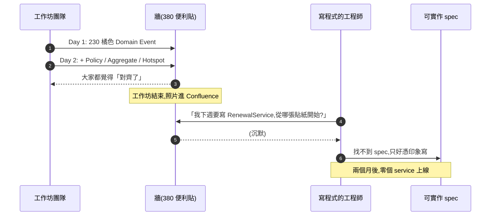
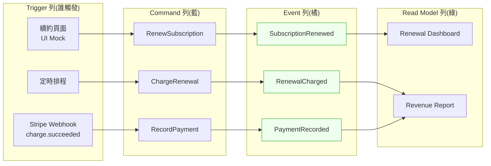
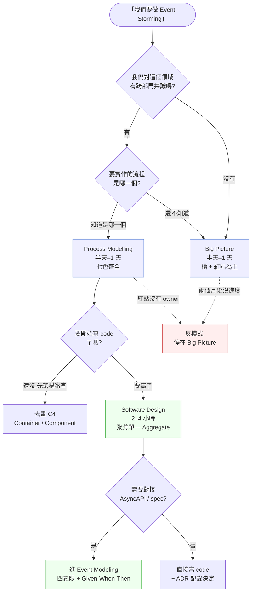

# 第 19 章|Event Storming 與 Event Modeling
## ⸺ 從便利貼到事件流的對齊工具

> **前置閱讀**:[Ch 9 流程模型](../part-02-analysis/ch-09-process-modeling.md)、[Ch 18 DDD 戰術設計](./ch-18-ddd-strategic-tactical.md)
> **下游章節**:[Ch 20 C4 模型](./ch-20-c4-model-visualization.md)、[Ch 23 Event-Driven 與事件溯源](./ch-23-event-driven-cqrs-es.md)、[Ch 39 Multi-Agent 系統設計](../part-07-ai-era/ch-40-multi-agent.md)
> **延伸補章**:[Ch 40 共識/狀態/衝突](../part-07-ai-era/ch-41-multi-agent-consensus.md)

---

## 19.1 冷觀察 ⸺ 380 張便利貼、兩個月、零個 service

我在 2026 年第一季看過一個案例。

虛構 B2B 訂閱與計費 SaaS **RenewLane**(`CASE-SAS-004`),做的是中大型企業客戶的訂閱續約、proration、dunning(催收)、churn 預警,客戶數約 1,400,ARR 約 4,200 萬美元,工程團隊 31 人。他們決定要重寫續約引擎 ⸺ 舊引擎用了 6 年,每次新版定價、新地區稅務、新合約條款都要動到核心 service,QA 退件率高、release 一次得跨 4 個團隊。

新團隊很認真,Lead Engineer 在 X(舊 Twitter)上看到 Alberto Brandolini 一場 talk,決定用 Event Storming 開場。他訂了一間有兩面長牆的會議室,印了七種顏色的便利貼,找來業務、客服、計費分析師、稽核合規、四個工程組長、兩個 PM、一個 SRE,排了**兩天工作坊**。

第一天結束時,牆上有 230 張橘色便利貼(Domain Event,過去式動詞),沿時間線排開,從 `TrialStarted`、`PlanSelected`、`SubscriptionActivated`、`InvoiceIssued`、`PaymentFailed`、`DunningEmailSent`、`PaymentRetrySucceeded` 一路排到 `RenewalCompleted`、`ChurnPredicted`、`WinbackOfferAccepted`。第二天結束時,加上紫色 Policy(政策)、藍色 Command(命令)、黃色 Aggregate(聚合)、粉色 External System、綠色 Read Model、紅色 Hotspot,總共 **380 張**。

照片拍下來,貼在 Confluence 上,標題寫「RenewLane Domain Big Picture v1」。所有人都覺得「我們對齊了」。

兩個月後,沒有任何一個 service 寫出第一行程式。

事故覆盤會上,Lead Engineer 把那張照片秀給 CTO 看。CTO 問了一句被原樣記下來的話:

> 「這張照片裡,哪一張橘色便利貼,對應到我下週要 deploy 的那個 endpoint?」

沒有人答得出來。便利貼是事件的描述,但便利貼沒有對應到任何一個檔名、一個 schema、一個 API endpoint。工作坊結束的那一刻,大家對「這是什麼系統」有共識;但「我寫程式時要從哪一張貼紙開始」這件事,牆沒有回答。



接下來的兩個月,大家以「Event Storming 已經做過了」為由,跳過了寫 spec、跳過了畫 sequence、跳過了定義 schema,直接開分支寫 code。寫到第三週,兩個工程組對「`SubscriptionRenewed` 這個事件由誰 emit」吵起來,Lead 才發現:**牆只描述了「有這件事」,沒有描述「誰負責、輸入什麼、輸出什麼、寫進哪張表」**。

那場 Event Storming 的牆很美。但它停在 Big Picture 那一層,沒有走到 Process Modelling、更沒有走到 Software Design。它變成「漂亮的牆,但沒人接得下去」。

---

## 19.2 真問題 ⸺ Event Storming 不是把 BPMN 換成便利貼

把 RenewLane 的事拆開來看,問題不是 Event Storming 用錯了,而是團隊把它當成「BPMN 的便利貼版本」⸺ 結果用了一個探索期工具去做沉澱期工作。

### 19.2.1 事件視角 vs 流程視角的差別

BPMN([Ch 9](../part-02-analysis/ch-09-process-modeling.md))回答的問題是「**下一步是什麼**」⸺ 流程從哪開始、誰做哪一 task、什麼條件下走哪個分支。Event Storming 回答的問題是「**上次發生了什麼**」⸺ 在這個領域裡,有哪些「過去式的事實」是值得記下來的。

兩種視角的差別,在邊界系統最明顯。BPMN 適合畫「客服收到電話 → 查詢工單 → 升級到 L2」這種有明確主角、明確順序的工作流。但訂閱續約這件事,沒有單一主角:有時候是 cron job 觸發、有時候是客戶手動續、有時候是因為信用卡更新而連動 retry、有時候是合約變更觸發 proration。**沒有「下一步」的問題,只有「這個事實發生時,誰在乎」的問題**。

| 維度 | BPMN(流程視角) | Event Storming(事件視角) |
|---|---|---|
| 中心問題 | 下一步是什麼?誰負責? | 上次發生了什麼?誰在乎? |
| 時間性 | 順序、分支、會合 | 事件流(可分叉、可重排) |
| 主要表達物 | Pool / Lane / Gateway / Task | 過去式動詞便利貼 |
| 適合領域 | 客服 SLA、訂單履約、稽核流程 | 訂閱、計費、IoT telemetry、社群行為 |
| 邏輯起點 | Start Event | 隨便一張橘色便利貼 |
| 失敗模式 | 把規則層塞進 gateway 菱形 | 停在 Big Picture 不走下去 |

換句話說,Event Storming 比較像「考古」⸺ 把整個領域裡會發生的事實先攤開,再問「誰因此要做動作」。BPMN 比較像「劇本」⸺ 已經知道誰演主角,把對白寫清楚。

### 19.2.2 三層工作坊不能跳

Brandolini 在 *Introducing EventStorming* [^CIT-180] 裡,把 Event Storming 分成三層,不是因為他想湊個三層架構,而是因為**每一層回答的問題不同、產出物不同、出口條件也不同**。

- **Big Picture(全景)**:把整個領域裡的事件先攤開,跨部門對齊「我們在做什麼」。產出是一面長牆 + 識別出的 Bounded Context。
- **Process Modelling(流程)**:在 Big Picture 上挑一個關鍵流程(例如「續約」),把 Command、Policy、Aggregate、Read Model、External System 補進去。產出是「這個流程實際運作的樣子」。
- **Software Design(軟體設計)**:聚焦到一個 Aggregate,把它的 Command / Event / Invariant 寫到可以開始寫 code 的程度。產出是 Aggregate Boundary、API 草稿、Schema 草稿。

RenewLane 的失敗,**不是貼錯便利貼,是停在第一層**。第一層的牆只有橘色 + 紅色 hotspot,缺了藍色 Command(誰觸發)、黃色 Aggregate(在誰身上發生)、紫色 Policy(觸發了什麼下一步)。沒有這四種顏色,牆只是「事實清單」,不是「可實作的領域」。

### 19.2.3 Event Modeling 補的是「便利貼到 spec」那段

Adam Dymitruk 在 2018 年起推廣的 Event Modeling [^CIT-181],就是看到這個斷層後提出的補丁。它跟 Event Storming 的關係不是替代,而是**接力**:

- **Event Storming 的工作牆**(便利貼)→ Event Modeling 的工作牆(swimlane + UI mock + Event + Command + Read Model)。
- Event Modeling 強制每一個事件流都對應到 **「Trigger / Command / Event / Read Model」** 四象限,而且每一格都可以直接寫成 Given-When-Then 測試。

換句話說,Event Modeling 是 Event Storming 的「沉澱版」:它逼你把 Big Picture 的橘色便利貼,**一個一個** 對應到「這個事件由哪個 Command 觸發、寫進哪個 Aggregate、餵給哪個 Read Model」。Given-When-Then 是它的天然測試格式,AsyncAPI 3.0 [^CIT-184] 是它的天然 schema 格式。

一張 Event Modeling 圖長這樣:



這張圖跟 BPMN 不一樣的地方:**橫軸是時間,縱軸是「我在哪一層 reasoning」**。它不畫 gateway,不畫菱形 ⸺ 因為條件分支屬於 Command 內部的決策,不是 Event Stream 的一部分。

### 19.2.4 與 BPMN(Ch 9)、DDD(Ch 18)、Event Sourcing(Ch 23)的關係

Event Storming / Event Modeling 在書內幾個鄰近章節間的位置,值得一次釐清:

| 章 | 工具 | 在這條軸上的角色 |
|---|---|---|
| [Ch 9](../part-02-analysis/ch-09-process-modeling.md) | BPMN / 狀態機 / 決策表 | 沉澱期、可執行,給工作流引擎吃 |
| **Ch 19** | **Event Storming / Event Modeling** | **探索期 → spec 對接,給 RD 吃** |
| [Ch 18](./ch-18-ddd-strategic-tactical.md) | Bounded Context / Aggregate | 戰術設計,Event Storming 的 output 之一 |
| [Ch 23](./ch-23-event-driven-cqrs-es.md) | Event Sourcing / CQRS | 落地實作,Event Modeling 的 runtime |

把這條軸看完就會發現,Event Storming 不是孤立的工作坊技藝,**它是從「業務直覺」到「事件流實作」這條軌道上的第一站**。停在 Big Picture 不走下去,就像火車進站後忘了開車。

---

## 19.3 決策框架 ⸺ 這次該開哪一層工作坊

### 19.3.1 七種便利貼的角色與顏色約定

Event Storming 的七種便利貼,顏色不是 Brandolini 隨便挑的,**是依照「上手順序」設計的**。橘色最大、最先貼,因為它最便宜(只是回憶事實);紫色 Policy 最晚貼,因為它需要把橘色與藍色之間的因果先攤開。

| 顏色 | 名稱 | 角色 | 上手順序 | 內容形式 |
|---|---|---|---|---|
| 🟧 橘 | Domain Event | 領域裡發生過的事實 | 1(最先) | 過去式動詞:`SubscriptionRenewed` |
| 🟥 紅 | Hotspot | 矛盾、不確定、卡住的點 | 2(隨時貼) | 問句或感嘆:「年繳客戶換月繳怎麼辦?」 |
| 🟦 藍 | Command | 觸發事件的指令 | 3 | 祈使句動詞:`RenewSubscription` |
| 🟪 紫 | Policy | 「當 X 發生時,自動做 Y」 | 4 | 條件句:「PaymentFailed → 啟動 dunning」 |
| 🟨 黃 | Aggregate | 事件發生在誰身上 | 5 | 名詞:`Subscription`、`Invoice` |
| 🟩 綠 | Read Model | 為了某個決策而生的查詢視圖 | 6 | UI / Report 名稱:「續約儀表板」 |
| 🟪🟫 粉 | External System | 領域外的相關系統 | 7 | 名詞:Stripe、HubSpot、SendGrid |

> **顏色對照表的真實版本**:Brandolini 原始建議與不同團隊的微調版本(EventCatalog [^CIT-185]、Miro 模板)會略有差異。例如有些團隊把 `User` / `Actor` 用淺黃,把 `Aggregate` 用深黃。**重點不是顏色,是七種角色都到齊**。

### 19.3.2 三層工作坊適用情境表

下面這張表在會議桌上很好用 ⸺ 當有人說「我們要做 Event Storming」,先問一句「你想回答哪個問題」,再決定要開哪一層:

| 你想回答的問題 | 該開的層 | 預期時長 | 必到角色 | 出口條件 |
|---|---|---|---|---|
| 「我們對這個領域到底有沒有共識?」 | Big Picture | 半天–1 天 | 跨部門、跨 BC、業務 + 工程 | 一面長牆 + 識別出 ≥ 2 個 Bounded Context |
| 「續約這個流程實際是怎麼跑的?」 | Process Modelling | 半天–1 天 | 流程主擁有者 + 上下游 + RD | 流程上每個橘色都有藍色 + 黃色配對 |
| 「`Subscription` 這個 Aggregate 該怎麼寫?」 | Software Design | 2–4 小時 | RD + SA + 測試 | Aggregate 的 invariant 寫得出 ≥ 5 條 |
| 「我們要把工作坊產出接到 spec 與 AsyncAPI」 | (跨到)Event Modeling | 1–2 天 | RD + SA + Tech Writer | 每個關鍵事件流都有 Trigger / Command / Event / Read Model 四象限 |
| 「我們要先驗證一個 idea」 | Big Picture(限時 2h) | 2 小時 | 3–5 人快速組 | 找出 3–5 個 hotspot 即收 |

RenewLane 那兩天工作坊,**問題不是時間不夠,是沒設定出口條件**。如果第一天結束時 Lead 問了「我們有 ≥ 2 個 Bounded Context 嗎?有的話,第二天我們挑一個進 Process Modelling」,後面的故事會不一樣。

### 19.3.3 Event Modeling 的四象限

當你準備把 Event Storming 的產出「接到 spec」,Event Modeling 的四象限就是接點:

| 象限 | 內容 | 對應到 spec 的什麼 | Given-When-Then 對應 |
|---|---|---|---|
| **Trigger** | UI、外部事件、時間 | UI mock、Webhook spec、Cron 定義 | (隱含於 Given) |
| **Command** | 祈使動詞 + Payload | API endpoint(POST)、Command Handler 簽章 | When `<Command>` |
| **Event** | 過去式動詞 + Payload | Event schema(AsyncAPI / JSON Schema) | Then `<Event>` emitted |
| **Read Model** | 查詢視圖 + 欄位 | API endpoint(GET)、Read DB schema | Then `<View>` shows ... |

把一個事件流寫成 Event Modeling 之後,Given-When-Then 幾乎可以**機械地產生**:

```gherkin
# 範例:RenewLane 的「續約成功扣款」事件流

Given Subscription "ACME-Annual-001" 處於 active 狀態
  And 信用卡有效期 > 今天
When Command RenewSubscription { subscriptionId: "ACME-Annual-001" } 被執行
Then Event SubscriptionRenewed { subscriptionId, renewedAt, nextBillAt } 被發出
  And Read Model "Renewal Dashboard" 顯示該筆狀態為 "Renewed"
```

這份 Given-When-Then 可以直接被 RD 拿去當 acceptance test、被 QA 拿去當迴歸基線、被 Tech Writer 拿去當 API doc。**這就是「便利貼到 spec」那一段補上的價值**。

### 19.3.4 一張決策樹:Event Storming 該停在哪一層



這張圖的關鍵不是分支,**是兩條虛線**。Big Picture 與 Process Modelling 都會掉進「停在這層不走下去」的陷阱 ⸺ 所以每一層離開時都要明確回答「下一層是什麼、何時開」。

### 19.3.5 線上 / 遠端 Event Storming 的工具

2020 年之後,Event Storming 大量轉到線上。這件事在工具側是好事(空間無限、自動存檔、便利貼可搜尋),但在認知側有代價:**人類對「空間記憶」的依賴比預期大**。實體牆上「左邊那一塊」、「天花板下方那一群」,這種空間 anchoring 在線上會被壓平成 Z-index。

2026 年現場常用三套工具:

| 工具 | 強項 | 弱項 | 適用 |
|---|---|---|---|
| **Miro** | 模板多、外掛豐富、Brandolini 官方模板 | 多人同時拖拉會卡 | 50 人以下、跨時區 |
| **FigJam**(Figma) | 與 UI mock 同檔案、整合 design 流 | Event Storming 模板較少 | 已有 Figma 流程的團隊 |
| **EventCatalog** [^CIT-185] | 事件 → spec → AsyncAPI 直接生成 | 不是工作坊本身,是工作坊的下游 | Event Modeling 階段、文件化 |

> **要注意的是**:Brandolini 自己在 [Brandolini 2013 原始貼文](https://ziobrando.blogspot.com/2013/11/introducing-event-storming.html) [^CIT-182] 強調「物理空間」的價值。線上工作坊適合 Big Picture 與 Process Modelling 的初稿,但**Software Design 層強烈建議實體**(或 hybrid:RD + SA 在同一個物理空間,其他人遠端)。

### 19.3.6 2026 視角:Event Modeling × AsyncAPI × AI Agent

Event Modeling 在 2024–2026 的成熟,有兩個外部催化劑值得記下來:

**(a)AsyncAPI 3.0(2024 年發布)成為事件式 API 的事實標準。**
Event Modeling 的「Event 列」可以**直接 export 成 AsyncAPI 文件**,進 Schema Registry(Confluent / Apicurio)。這條路徑讓「便利貼 → spec → runtime」變成可機讀的鏈,而不是靠人手抄。

**(b)AI Agent 在工作坊中的角色開始浮現。**
2026 年現場開始看到三種用法,各有界線:

- **共筆 Agent**:即時把白板上口頭討論轉成便利貼草稿,工作坊主持人 review 後貼上牆。降低「漏掉一個事件」的風險。
- **反問 Agent**:在 Process Modelling 階段,對每張橘色便利貼問「這事件會不會 race condition?」「這個 command 失敗時 emit 什麼事件?」⸺ 模擬一個經驗 SA 的反問。
- **矛盾偵測 Agent**:對整面牆做語義 diff,標出「`SubscriptionRenewed` 在第 12 張與第 47 張有不同的 payload 描述」這類矛盾。

這三種角色的共同前提是:**Agent 不主導工作坊,人主導**。Agent 是放大鏡,不是主持人。一旦 Agent 變成主持人,工作坊會退化成「對話介面」而失去 Event Storming 的核心價值 ⸺ 跨部門人類在同一個物理 / 視覺空間裡,被迫面對彼此的認知差距。

---

## 19.4 踩坑清單

下面這四個反模式,在做過 Event Storming 的團隊裡反覆出現。它們的共同點是:**外觀上長得像在做 Event Storming,但實質上沒有產出可被傳遞的事件流**。每一個都附修正方向。

### 反模式 1:停在 Big Picture 不走下去

像 RenewLane 那樣,Big Picture 的牆很美 ⸺ 380 張便利貼、跨部門、CTO 拍照轉發。然後就沒有然後了。Process Modelling 排不出時間、Software Design 沒人主動發起,牆變成 Confluence 上一張靜態的照片,半年後沒人還記得。

> ✅ **修正方向**:每一層工作坊結束時,在白板**寫下下一層的具體日期與主持人**。Big Picture 結束時,挑出 2–3 個關鍵流程,每個流程指定一位 Process Modelling 主持人,並把第一場 PM 工作坊預定在兩週內。沒有預定下一場,就把這場結論的可信度打 50%。

### 反模式 2:便利貼變成需求清單(失去事件視角)

工作坊半小時後,有人開始貼「客戶可以選方案」、「系統發送 email」這類**現在式 / 祈使句**。便利貼從 `PlanSelected` 退化成 `Select Plan`,從事實退化成 task。一旦混進來,整面牆會慢慢轉成 BPMN 風格的工作項清單,Event Storming 的事件視角就消失了。

> ✅ **修正方向**:主持人每 30 分鐘掃一次牆,把不是過去式的橘色便利貼**移到牆角的「待轉換」區**,然後跟原作者一起把它改寫。例如「客戶可以選方案」→ `PlanSelected`(事件)+ `SelectPlan`(藍色 command)。這個小動作維持事件視角的純度,讓後續 Process Modelling 的時候才接得上。

### 反模式 3:Hotspot 紅貼沒人 follow up

Hotspot(紅貼)是 Event Storming 最有價值的副產品 ⸺ 它代表「這個地方大家有矛盾」、「這條業務規則沒人知道」、「這裡可能藏 bug」。但工作坊結束後,紅貼經常被遺忘:照片拍下來、貼進 Confluence,沒有人被指定去拆解。

> ✅ **修正方向**:工作坊結束前最後 15 分鐘,**逐張紅貼指定 owner + due date**。每張紅貼至少一個 follow-up action(找誰問、查哪份文件、做哪個小實驗)。把這個清單貼在團隊每週站會的固定議程裡,直到所有紅貼變綠或變黃為止。沒有 owner 的 hotspot 不是 hotspot,是被忽略的炸彈。

### 反模式 4:遠端 Event Storming 用文字工具(失去空間記憶)

新團隊跨時區協作時,有人提議「用 Slack thread / Notion / GitHub Issue 來做 Event Storming」⸺ 反正都是貼便利貼,文字工具更方便搜尋。結果一週後產出 200 條 Slack 訊息,沒有一張圖可以 zoom out 看到全貌。團隊以為自己在做 Event Storming,實際上在做需求清單。

> ✅ **修正方向**:遠端工作坊**至少要在 Miro / FigJam 這類「空間化」工具上做**,不能退化成純文字。空間記憶是 Event Storming 認知效能的一部分:「這張貼紙在牆的哪一塊」對人類腦袋的 anchor 效果遠大於「這條訊息在 thread 第幾則」。如果跨時區只能 async,那把 async 做在「Miro 上的留言」而不是 Slack thread,讓空間結構保持在。

---

## 19.5 交付清單 ⸺ 一頁式 Event Storming Outcome Card

每次 Event Storming 工作坊結束,**第一份要產出的不是會議紀錄,是 Event Storming Outcome Card**。它是一頁 Markdown,逼出五個答案:範圍是什麼、識別出哪些 Bounded Context、識別出哪些 Aggregate、紅貼怎麼處理、什麼時候進 Event Modeling。

把它存在 `docs/event-storming/{slug}-outcome.md`,跟程式碼同 repo,工作坊照片放 `docs/event-storming/{slug}-photos/`。

````markdown
# Event Storming Outcome Card — {流程 / 領域名稱}

> 工作坊日期:YYYY-MM-DD ~ YYYY-MM-DD | 主持人:{名字}
> 層次:Big Picture | Process Modelling | Software Design  ←(勾一個)
> 對齊:System Charter v0.x、Bounded Context Canvas v0.x

## 1. 範圍(我們今天到底在看哪一塊)

- **領域邊界**:{範例:訂閱續約 + dunning,不含 trial onboarding}
- **時間範圍**:{範例:從客戶簽約那一刻 → 第一次續約成功 / 第一次 churn}
- **明確不在此次範圍**:{範例:proration 規則細節、稅務}

## 2. 識別出的 Bounded Context

| Context | 主要事件(3–5 個代表) | 主要 Aggregate | Owner Team |
|---|---|---|---|
| Subscription | SubscriptionActivated / Renewed / Canceled | Subscription | Renewal Squad |
| Billing | InvoiceIssued / PaymentFailed / Retried | Invoice | Billing Squad |
| Dunning | DunningEmailSent / RecoverySucceeded | DunningCase | Retention Squad |

> **若這格少於 2 個 Bounded Context,代表 Big Picture 還沒做完,不要進下一層**。

## 3. 識別出的 Aggregate(若進到 Process Modelling 以上)

| Aggregate | 關鍵 Invariant(≥ 3 條) | 對應的 Command | 對應的 Event |
|---|---|---|---|
| Subscription | (1) 一個客戶同時只能有一個 active sub<br/>(2) 不可從 canceled 直接回到 active<br/>(3) 續約日期不可早於原到期日 | RenewSubscription / CancelSubscription | SubscriptionRenewed / Canceled |
| Invoice | ... | ... | ... |

## 4. Hotspot(紅貼)follow-up 清單

| # | 紅貼內容 | Owner | Due Date | 拆解動作 | 狀態 |
|---|---|---|---|---|---|
| H-01 | 「年繳客戶中途換月繳,proration 怎麼算?」 | 計費分析師 A | YYYY-MM-DD | 找 finance team 對齊三個情境 | 🔴 待處理 |
| H-02 | 「churn 預測模型的事件流誰來 emit?」 | DS Lead B | YYYY-MM-DD | 跟 Renewal Squad 對齊 schema | 🟡 進行中 |

> **沒有 owner 的紅貼不准上 outcome card**。沒人接的就明確記「暫不處理,下次工作坊重評」。

## 5. 進入 Event Modeling 的時機

- [ ] 已有 ≥ 1 個 Process Modelling 完成的關鍵流程
- [ ] 已有 ≥ 1 個 Aggregate 寫出 ≥ 5 條 invariant
- [ ] 已有 RD + SA + Tech Writer 三角組合可投入
- [ ] 已有 AsyncAPI / Schema Registry 環境(或承諾兩週內備齊)

> 上述 4 項中 ≥ 3 項打勾,才開 Event Modeling 第一場。少於 3 項代表還在探索期,先補 Process Modelling。

## 6. Owner

| 角色 | 名字 | 負責 |
|---|---|---|
| 工作坊主持人 | | 整體進度與下一場排期 |
| 牆的維護者 | | Miro 板 / 物理牆的更新 |
| 紅貼追蹤 | | 每週 sync,標記狀態變化 |
| Event Modeling 召集人 | | 等出口條件達成後啟動 |
````

**為什麼是一頁?** 一頁的篇幅會逼出選擇。380 張便利貼如果整理成 30 頁 Confluence 紀錄,讀者會放棄;整理成一頁,你會被迫決定「哪些 Bounded Context 真的存在」。

**為什麼要寫「進入 Event Modeling 的時機」?** RenewLane 那兩個月的失敗,根因就是沒有明確的下一步觸發條件。把它寫進 outcome card,等於把未來的「下個月還是兩個月後」這場爭論現在先解決掉。

**為什麼紅貼必須有 owner?** Hotspot 是 Event Storming 唯一沒辦法被工具自動處理的產出 ⸺ 它代表「人類認知的不一致」,只有人類能拆。沒 owner 的紅貼會在 Confluence 上靜靜過期,等到出事的那天才被翻出來。

### 19.5.1 範例:RenewLane 補開的那場 outcome card

如果 RenewLane 第一天工作坊結束時就停下來填這頁,而不是等兩個月後 CTO 在會議室問那句話 ⸺ 後面 31 個工程師的兩個月就能換成 2 個 service 的第一版 endpoint。下面是他們**事後補寫**的 v1,範圍刻意只圈在「續約 + dunning」、把 trial onboarding 留給下一場:

````markdown
# Event Storming Outcome Card — 訂閱續約 + Dunning

> 工作坊日期:2026-01-13 ~ 2026-01-14 | 主持人:Lead Engineer 周
> 層次:☐ Big Picture ☒ Process Modelling ☐ Software Design
> 對齊:System Charter v0.3、Bounded Context Canvas v0.2

## 1. 範圍
<!-- 為什麼這欄:第一場兩天工作坊把 trial、proration 全混進來,
     才會貼出 380 張卻沒人接得下去;先把不在範圍的事情寫死。 -->
- 領域邊界:訂閱續約 + dunning(payment retry 含在內)
- 時間範圍:從合約 active 那一刻 → 第一次續約成功 / 第一次 churn
- 明確不在此次範圍:trial onboarding、proration 細則、稅務(留 H-01 / H-03)

## 2. 識別出的 Bounded Context

| Context | 主要事件(代表) | 主要 Aggregate | Owner Team |
|---|---|---|---|
| Subscription | Activated / Renewed / Canceled | Subscription | Renewal Squad(6 人) |
| Billing | InvoiceIssued / PaymentFailed / Retried | Invoice | Billing Squad(5 人) |
| Dunning | DunningEmailSent / RecoverySucceeded | DunningCase | Retention Squad(3 人) |

## 3. 識別出的 Aggregate
<!-- 為什麼這欄:Subscription 那 3 條 invariant,正是兩個工程組吵架的根源;
     寫進來才能拒絕「兩邊各自 emit SubscriptionRenewed」這個提案。 -->
| Aggregate | 關鍵 Invariant | Command | Event |
|---|---|---|---|
| Subscription | (1) 一個客戶同時只能有 1 個 active sub<br/>(2) canceled 不可直接回 active<br/>(3) 續約日不可早於原到期日 | RenewSubscription / CancelSubscription | SubscriptionRenewed / Canceled |
| Invoice | (1) issued 後金額不可改<br/>(2) 同一 sub 同期不可重複 issue | IssueInvoice / RetryCharge | InvoiceIssued / PaymentFailed |

## 4. Hotspot follow-up
<!-- 為什麼這欄:第一場 47 張紅貼當天沒指 owner,兩個月後沒人記得;
     現在每張都要有名字,沒人接的就標「下次工作坊重評」。 -->
| # | 紅貼 | Owner | Due | 拆解動作 | 狀態 |
|---|---|---|---|---|---|
| H-01 | 年繳客戶中途換月繳,proration? | 計費分析師 林 | 2026-01-28 | 找 finance 對齊 3 情境 | 🔴 |
| H-02 | churn 預測事件流誰 emit? | DS Lead 黃 | 2026-02-05 | 跟 Renewal Squad 對齊 | 🟡 |
| H-03 | 跨州稅務 SubscriptionRenewed 要不要分裂? | 合規 吳 | 2026-02-12 | 等法務 memo | 🔴 |

## 5. 進入 Event Modeling 的時機
- [x] 已有 ≥ 1 個 Process Modelling 完成的關鍵流程(續約)
- [x] Subscription Aggregate 寫出 ≥ 5 條 invariant(目前 6 條)
- [ ] RD + SA + Tech Writer 三角組合可投入(Tech Writer 待補)
- [x] AsyncAPI / Schema Registry 環境(Confluent Cloud 已開)
> 4 項打勾 3 項,2026-01-26 開 Event Modeling 第一場,先做 Subscription。

## 6. Owner
| 角色 | 名字 | 負責 |
|---|---|---|
| 主持人 | 周 | 下一場排期 |
| 牆的維護者 | 陳 | Miro 板更新 |
| 紅貼追蹤 | 林 | 每週四站會 sync |
| Event Modeling 召集人 | 周 | 1/26 第一場 |
````

兩個月零產出與一頁五個答案的差別,就在這張卡有沒有寫。**寫不出「下一場日期」的工作坊,通常就是兩個月後會被翻出來覆盤的那一場**。

---

## 19.6 本章交付清單 Recap

讀完本章,你應該已經能做到:

- [ ] 在會議桌上分得出「事件視角」與「流程視角」的差別,並能在五分鐘內判斷一個議題該用 Event Storming 還是 BPMN
- [ ] 認得出 Event Storming 三層工作坊(Big Picture / Process Modelling / Software Design)各自的入口、出口與必到角色
- [ ] 用 Event Modeling 的四象限(Trigger / Command / Event / Read Model)把一條關鍵事件流寫成可被測試的 Given-When-Then
- [ ] 為手上正在做的 Event Storming 寫一份 Outcome Card(放 `docs/event-storming/{slug}-outcome.md`),並把紅貼指定 owner

四項中先挑一項做完就好,建議是最後那一項 ⸺ 把上一場 Event Storming 的牆翻出來,補一張 outcome card,逼自己回答「下一層什麼時候開」,再往下讀 [Ch 20 C4 模型](./ch-20-c4-model-visualization.md)。本章留給你的就是「便利貼怎麼變 spec」那條鏈。

---

## Cross-References

- **下一章**:[Ch 20 C4 模型與架構視覺化](./ch-20-c4-model-visualization.md) ⸺ 從事件流到容器級拓樸
- **戰術 DDD**:[Ch 18 DDD 戰術設計](./ch-18-ddd-strategic-tactical.md) ⸺ Event Storming 的 Aggregate / Bounded Context 上接點
- **流程模型**:[Ch 9 BPMN / 狀態機 / 決策表](../part-02-analysis/ch-09-process-modeling.md) ⸺ 沉澱期的對照工具
- **事件溯源實作**:[Ch 23 Event-Driven 與事件溯源](./ch-23-event-driven-cqrs-es.md) ⸺ Event Modeling 的 runtime
- **Multi-Agent 系統**:[Ch 39 Multi-Agent 系統設計](../part-07-ai-era/ch-40-multi-agent.md) ⸺ 事件流在 Agent 協作中的角色
- **延伸補章**:[Ch 40 共識/狀態/衝突](../part-07-ai-era/ch-41-multi-agent-consensus.md)

## 引用

[^CIT-180]: Alberto Brandolini, *Introducing EventStorming: An Act of Deliberate Collective Learning* (Leanpub, 2021,持續更新)。Event Storming 三層工作坊方法學原典。
[^CIT-181]: Adam Dymitruk & Martin Dilger, *Event Modeling*(2018 起,eventmodeling.org)。Event Modeling 四象限與 Given-When-Then 對接方法。
[^CIT-182]: Alberto Brandolini, "Introducing Event Storming"(原始部落格貼文,2013 年 11 月,ziobrando.blogspot.com)。Event Storming 概念首發,強調物理空間的價值。
[^CIT-183]: Vaughn Vernon, *Implementing Domain-Driven Design*(Addison-Wesley, 2013)。Aggregate 與 Bounded Context 的戰術設計參考,Event Storming 的下游章節依賴。
[^CIT-184]: AsyncAPI Specification v3.0(asyncapi.com, 2024)。事件式 API 規範,Event Modeling 的天然 schema 出口。同 CIT-143。
[^CIT-185]: EventCatalog Open Source Project(eventcatalog.dev)。事件文件化平台,將 Event Modeling 產出轉為 AsyncAPI / Schema Registry 可消費的資料。
[^CIT-186]: Confluent Schema Registry Documentation(docs.confluent.io)。事件 schema 版本控制,Event Modeling → runtime 的關鍵 infrastructure。

---
