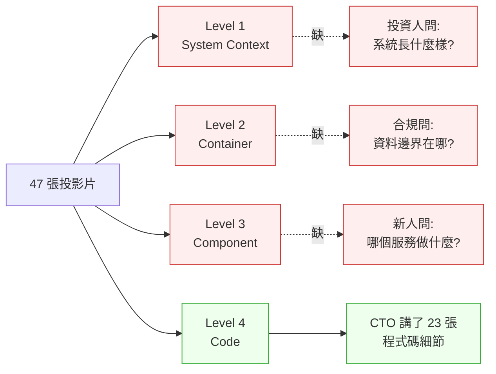
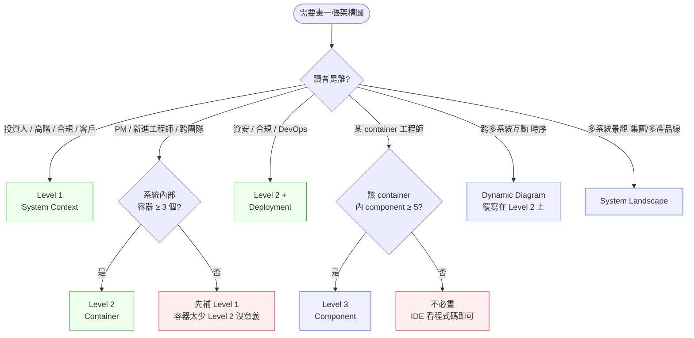

# 第 20 章|C4 Model 與架構視覺化
## ⸺ 給多種讀者看的同一份地圖

> **前置閱讀**:[Ch 5 UML 模型語言全景](../part-01-foundations/ch-05-uml-overview.md)、[Ch 13 架構風格](../part-03-design/ch-13-architecture-styles.md)、[Ch 18 DDD 戰術設計](./ch-18-ddd-strategic-tactical.md)
> **下游章節**:[Ch 21 模組化單體](./ch-21-modular-monolith.md)、[Ch 22 微服務拆分](./ch-22-microservices.md)、[Ch 33 ADR](../part-06-engineering/ch-33-adr-architecture-knowledge.md)
> **延伸補章**:無

---

## 20.1 冷觀察 ⸺ 47 張投影片,沒有一張能回答投資人那句話

我在 2026 年 1 月,陪一家虛構支付平台 **PaySpan**(`CASE-FIN-005`)做 B 輪募資前的架構審查。公司 84 人,工程 41 人,做東南亞 e-wallet 與 SME 收單,日均交易約 220 萬筆,跑 ISO 8583 1100/1110 授權 + 0220 沖正,搭一套自研風控引擎(規則 + 機器學習雙軌)。技術棧是 Spring Boot 3.3 + PostgreSQL 17 + Kafka 3.7 + Redis 7,17 個微服務,跑在 AWS ap-southeast-1 的 EKS 1.30 上。

那天審查會議室坐了三方:PaySpan CTO、引導 B 輪的兩位投資人(其中一位帶了他們合夥的技術顧問,Visa Asia 出身)、新加坡金融管理局(MAS)派來旁聽的合規顧問。CTO 開了 47 張投影片,標題是「PaySpan Architecture Review — Round B」。

第 1 到第 6 張是 logo 與市場概覽。第 7 張是技術棧 logo wall:Spring Boot、PostgreSQL、Kafka、Redis、Istio、ArgoCD、Datadog。第 8 張開始**直接是程式碼**:`AuthorizationService.java` 的截圖,標題寫「核心授權邏輯」。第 9 張是另一段 Java 程式碼,第 10 張是 `pom.xml` 依賴樹。

到第 23 張,CTO 已經在解釋 `AuthorizationService` 裡那段 `if (mcc == 6010 && amount > threshold && previousAttempts >= 2)` 的風控分支邏輯。Visa 那位顧問舉手:

> 「等一下。我想先看一張圖,告訴我:**錢從消費者刷卡那一刻起,在你們系統裡走了哪幾個盒子**?KYC 在哪一步驗?風控在哪一步擋?清算是同步還是非同步?」

CTO 翻回去找,翻了 6 分鐘,沒找到。**那 47 張投影片沒有一張是 System Context 圖,也沒有一張是 Container 圖**。最接近的一張在第 41 頁,是一張 Kubernetes namespace 截圖,但 Visa 顧問看不懂 namespace。

旁邊那位 MAS 合規顧問補了第二刀:

> 「跨境的部分,你們的資料離開新加坡了嗎?哪一個元件會把卡號送到馬來西亞?」

CTO 又翻了 4 分鐘,翻不到。**有的是程式碼層級的細節(等於 C4 Level 4),有的是技術棧 logo(連 C4 Level 1 都不算),中間 Level 1、Level 2、Level 3 全部空白**。

會議延長到第 90 分鐘的時候,投資人的合夥顧問講了那句後來在 PaySpan 內部被傳很久的話:

> 「我相信你們程式寫得很好,但我看不懂這家公司是什麼形狀。」



那次會議後 B 輪 term sheet 砍了一輪,估值修正幅度兩位數百分點。事後復盤,工程主管在內部信裡寫了一段話:

> 「我們不是不會畫圖,是**從來沒想過,給投資人看的圖跟給工程師看的圖,根本不該是同一張**。」

---

## 20.2 真問題 ⸺ C4 不是 UML 替代品,是縮放鏡

C4 Model 是 Simon Brown 在 2018 年整理的一套架構視覺化模型 [^CIT-190],核心主張一句話:**同一個系統,在不同 zoom level 給不同讀者看**。把它拆開來看會比較清楚。

PaySpan 那場審查的真問題,不是 47 張投影片畫得好不好,而是**他們把所有讀者都當成同一種讀者**。投資人想知道「這家公司是什麼形狀」,合規顧問想知道「資料邊界在哪」,新進工程師想知道「哪個服務做什麼」,DBA 想知道「哪些容器讀寫哪些 schema」⸺ 這四種問題對應四個不同的抽象層,要四張不同的圖才答得了。

C4 把這件事制度化:給你四個抽象層級(Level 1 到 Level 4),用同一套元素(Person / Software System / Container / Component / Code),在每一層只回答那一層該回答的問題。換句話說,**C4 不是新的圖種,是「同一份地圖縮放到不同倍率」的紀律**。

### 20.2.1 四個 Level 與它們的讀者

| Level | 名稱 | 主要讀者 | 一句話回答的問題 | 跨組織可分享性 |
|---|---|---|---|---|
| **Level 1** | System Context | 投資人 / 高階主管 / 客戶 / 合規 / 新進非工程師 | 「這個系統跟外界誰互動?」 | 高(可掛官網) |
| **Level 2** | Container | PM / 技術主管 / 新進工程師 / 跨團隊 | 「系統內部由哪幾個可獨立部署的東西組成?」 | 中(內部分享) |
| **Level 3** | Component | 該 Container 的工程師 | 「這個 Container 內有哪些主要的 component?」 | 低(團隊內) |
| **Level 4** | Code | 該 component 的工程師 | 「這個 component 的 class 怎麼組織?」 | 不分享(IDE 自動產出) |

這張表的關鍵不在分層數字,在**讀者欄**。Level 1 的讀者可能完全不懂技術,Level 4 的讀者只關心眼前那 200 行程式碼。**一張圖不能同時服務 Level 1 與 Level 4 的讀者**,這是 PaySpan 那場審查最根本的錯位。

### 20.2.2 為什麼 Level 2 是最常被跳過、卻最重要的

在實務現場最常看到的失敗模式不是「畫得不好」,而是「跳過 Level 2」。原因有三個。

第一,**Level 2 寫起來最尷尬**。Level 1 容易,畫個方塊代表整個系統就好;Level 4 容易,IDE 自動產出。Level 2 必須誠實面對「這個系統內部到底有哪幾個可獨立部署的東西、它們怎麼說話、各自存什麼」⸺ 而這件事在大部分團隊的腦袋裡是模糊的。

第二,**Level 2 是唯一同時被多種讀者引用的層**。新進工程師看 Level 2 做 onboarding;PM 看 Level 2 評估新功能影響哪些 container;DBA 看 Level 2 確認哪些 container 讀寫哪些 schema;DevOps 看 Level 2 做容量規劃。Level 2 缺席,這四種人各自憑想像補完,結論不會一致。

第三,**Level 2 是 ADR 的「定位地圖」**。一份 ADR 寫「我們把風控引擎拆成獨立 service」,讀的人需要先在 Container 圖上找到那個 service 才能理解 ADR 的影響範圍。沒有 Container 圖,ADR 就只是孤立的決定,後人讀起來像在看片段日記。

PaySpan 的 47 張投影片,直接從 Level 1 的市場概覽跳到 Level 4 的 `AuthorizationService.java`,中間 Level 2 與 Level 3 全空。Visa 顧問與 MAS 合規顧問問的問題,**全都是 Level 2 該回答的問題**。

### 20.2.3 C4 與 UML / 4+1 / ArchiMate 的關係

C4 不是 UML 的競爭者,定位在不同抽象層。Ch 5 已經把這四套語言放在同一張對照表上比較過,這裡只強調一個重點:**C4 的設計目的是「給非架構師看的架構圖」**,所以它故意只用五個元素(Person、Software System、Container、Component、Code Element),刻意拒絕 UML 那種「14 種圖」的豐富性。

換句話說,Simon Brown 的設計取捨是「**在表達力與被讀懂之間,選被讀懂**」。這個選擇在 2026 年看起來顯然成立 ⸺ Level 1 的圖能掛在公司官網,而 UML Component Diagram 永遠不可能掛在公司官網。

---

## 20.3 決策框架 ⸺ 這次該畫哪一層、用哪個工具

下面這幾張表跟一張 Mermaid 決策樹,在現場相當好用。它們的共同前提是:**畫圖前先問「誰會讀」**,而不是「我們要不要畫齊四層」。

### 20.3.1 四層讀者對照與「最小劑量」

| 場景 | 一定要畫 | 可選 | 不必畫 | 對應 ADR 範圍 |
|---|---|---|---|---|
| 募資 / 對外簡報 / 官網 | Level 1 | Level 2(部分遮罩) | Level 3、Level 4 | 「我們是什麼形狀」類 ADR |
| 新進工程師 onboarding | Level 1 + Level 2 | Level 3(該人首個任務涉及的 container) | Level 4 | 「這個 container 為何存在」類 ADR |
| 合規 / 資安審查 | Level 1 + Level 2 + Deployment | Level 3(資料流經過的 component) | Level 4 | 「資料邊界與信任邊界」類 ADR |
| 新功能影響評估 | Level 2 | Level 3(被改動的 container) | Level 1、Level 4 | 「拆 / 合 container」類 ADR |
| 跨團隊整合對齊 | Level 1 + System Landscape | Level 2(與對方的 container 對接點) | Level 3、Level 4 | 「整合契約」類 ADR |
| Day-to-day 開發 | (IDE 內) | Level 3(臨時) | Level 1、Level 2、Level 4 | (走一般 PR 流程,不必 ADR) |

**最小劑量法則**:大部分系統,**Level 1 一張、Level 2 一張**就已經能回答 80% 的外部問題。Level 3 只在「某個 container 大到三個人以上才看得懂」時才畫,Level 4 由 IDE / IntelliJ 系列 / VS Code 外掛自動產出即可。

### 20.3.2 Structurizr DSL vs Mermaid C4 plugin 取捨

本書其他章節一律用 Mermaid。Ch 20 是唯一例外 ⸺ **C4 主示範鎖定 Structurizr DSL**[^CIT-191],因為它是 Simon Brown 親自設計、為 C4 量身打造的 DSL。Mermaid 的 C4 plugin 仍可作為輕量替代,以下這張表是現場挑工具的判準。

| 維度 | Structurizr DSL | Mermaid C4 plugin |
|---|---|---|
| **設計者** | Simon Brown(C4 原作者) | Mermaid 社群,目前仍標 experimental |
| **單一 source 多視圖** | ✅ 一份 `workspace.dsl` 自動產出四層 | ❌ 每層各寫一份 |
| **Filtered View 支援** | ✅ 原生 | ❌ 手動拆 |
| **Dynamic / Deployment Diagram** | ✅ 原生 | ⚠️ 部分 |
| **GitHub / GitLab 原生渲染** | ❌(需 Structurizr Lite 或 Cloud) | ✅ |
| **Notion / Confluence 原生渲染** | ❌ | ✅ |
| **學習曲線** | 中(DSL 語法 + workspace 概念) | 低(若已會 Mermaid) |
| **適合場景** | 中大型系統、多 container、需要多視圖 | 小型系統、單張圖、文件內嵌 |
| **可程式碼化** | 完整(支援 import、變數、佈局指令) | 局部 |
| **2026 工具市占** | 中大型企業主流 | 開發者文件主流 |

**選法的順序**:架構文件以 Structurizr DSL 為主寫一份 `workspace.dsl` 進 repo;個別章節文件、PR 描述、Notion 頁面要嵌一張 C4 圖時,可以用 Mermaid C4 plugin 做輕量版本(視覺效果略差但隨處渲染)。**兩者並存,不必互斥**。

### 20.3.3 工具市場對照(2026)

純粹畫 C4 圖以外的選擇,在 2026 年也常被拿來討論。下面這張是現場速查。

| 工具 | 主要定位 | 優點 | 取捨 |
|---|---|---|---|
| **Structurizr DSL / Lite / Cloud** [^CIT-191] | C4 原生 | 一份 source 多視圖、ADR 整合、版本控制 | 渲染需要 server / Lite |
| **Mermaid C4 plugin** | 文件內嵌 | GitHub 原生渲染、零安裝 | experimental,佈局較弱 |
| **IcePanel** [^CIT-192] | 互動式 C4 | 點擊縮放、跨團隊協作、與 ADR 連動 | SaaS、有授權成本 |
| **Eraser.io** | 通用圖 + AI 輔助 | LLM 直接生圖、UX 好 | 不專為 C4、版本控制弱 |
| **Lucid / Lucidchart** | 通用 diagramming | 大眾熟悉、企業採購容易 | DaC 弱、易退化成投影片 |
| **Excalidraw** | 白板手繪感 | 概念溝通快、輕量 | 完全無結構、無法當地圖 |
| **PlantUML C4 macros** | 文字 + UML 風格 | 與既有 PlantUML 流程兼容 | 元素表達略偏 UML |

**判準**:長期維護的系統地圖選 Structurizr DSL;一次性溝通選 Excalidraw;跨團隊互動性選 IcePanel;文件內嵌選 Mermaid C4 plugin。**重點不是工具好壞,是「這張圖未來六個月會不會被回看」**。會被回看的圖才值得放進 DaC,不會被回看的圖就承認它是一次性產出。

### 20.3.4 決策樹:這次該畫哪一層?



**這張圖的關鍵是綠色那三個出口**(Level 1、Level 2、Level 2 + Deployment)。八成的對外與跨團隊溝通需求在這三個出口就解決了。Level 3 與 Dynamic / Landscape 屬於「進階補充」,真的需要才畫。

### 20.3.5 補充圖種:Deployment / Dynamic / System Landscape / Filtered

C4 的四個主層之外,Simon Brown 還定義了四種「補充圖」,用來覆蓋四層回答不了的特殊問題。

- **Deployment Diagram** ⸺ Container 跑在哪些節點(VM / Pod / Region)上。給 DevOps 與資安看,**金融與醫療場景幾乎必畫**(因為合規會問「資料離開過 region 嗎」)。
- **Dynamic Diagram** ⸺ 在 Container 圖上畫出某個 use case 的時序(編號箭頭 1, 2, 3...)。等同把 Sequence Diagram 縮回 Container 層。給跨團隊整合會議看。
- **System Landscape Diagram** ⸺ 集團 / 多產品線等級的「Level 0」,每個方塊是一個完整的 Software System(不是 Container)。給策略層看。
- **Filtered Diagram** ⸺ 同一份 `workspace.dsl` 套不同 filter 產出的子集。例如「只顯示與 PCI 相關的 container」、「只顯示新加坡 region 的 container」。Structurizr DSL 原生支援,Mermaid 必須手動拆。

### 20.3.6 ADR 與 C4 圖的整合節奏

ADR(見 [Ch 33](../part-06-engineering/ch-33-adr-architecture-knowledge.md))是「決定的化石」,C4 是「決定棲息的地形」。兩者整合的節奏可以這樣定:

1. **每個 Level 2 的 container 對應一份「為什麼存在」的 ADR**(`docs/adr/00XX-container-{name}.md`)。
2. **每張 C4 圖在 markdown 中以連結引用相關 ADR 編號**(例:「FraudEngine 容器存在的理由見 ADR-0017」)。
3. **每份 ADR 在「Context」段落引用對應的 C4 view 名稱**(例:「本決策影響 Container View `liveContainerView`」)。
4. **CI 中加一條 fitness function**:Container 圖中每個 container 都必須有對應 ADR;每份 ADR 引用的 view name 必須存在於 `workspace.dsl`。圖與 ADR 不對齊時 PR 直接擋。

這條 fitness function 的價值在 [Ch 34](../part-06-engineering/ch-34-fitness-functions.md) 會展開,這裡只指出**整合節奏不能靠人工巡檢**,必須機器把關。

---

## 20.4 踩坑清單

下面這四個反模式,在 fintech、ecommerce、healthcare 各種領域都常見。它們的共同點是「畫了 C4、但 C4 沒在做 C4 該做的事」。

### 反模式 1:只畫 Level 1 與 Level 4,跳過 Level 2

PaySpan 案例的核心病灶。簡報裡有 logo wall(類似 Level 1)、有程式碼截圖(等同 Level 4),中間沒有 Container 圖。讀者要嘛只看到外殼,要嘛被丟進原始碼,沒辦法形成「這家公司是什麼形狀」的認知。

這個反模式特別容易發生在「CTO 自己寫過大部分程式碼」的新創 ⸺ 因為 CTO 腦袋裡的 Level 2 太熟了,熟到他誤以為別人也看得到。

> ✅ **修正方向**:任何對外 / 跨團隊的架構簡報,**第二張投影片必須是 Level 2 Container 圖**。第一張可以是 Level 1,但不能直接從 Level 1 跳到程式碼。一個簡單的測試:把簡報拿給一個沒看過你系統的工程師,問他「能不能畫出系統內部的方塊圖」。畫不出來,就是 Level 2 缺席。

### 反模式 2:畫了 C4 但跟程式碼脫鉤

某 ecommerce 公司在 2024 年導入 C4,畫了一份漂亮的 Container 圖放在 Confluence 上。半年後 repo 裡多了 4 個新服務、刪了 2 個舊服務,Confluence 那張圖紋風不動。一年後新人看那張圖去找服務,找了三天找不到 ⸺ 因為其中三個方塊指向的服務早就不存在了。

C4 圖跟程式碼脫鉤,**比沒畫圖更糟糕**。沒畫圖的時候,大家會去看程式碼;畫了過期的圖,大家會相信那張圖,再撞牆。

> ✅ **修正方向**:Structurizr DSL 的 `workspace.dsl` 進 repo,跟程式碼同 PR review。CI 加一條 fitness function:用 ArchUnit / Dependency Cruiser / 自寫腳本掃 repo,比對「圖中宣告的 container 與實際存在的服務 / module」。差異時 PR 直接擋。**圖跟程式碼必須在同一個 commit 裡演化**,這個原則跟 [Ch 5](../part-01-foundations/ch-05-uml-overview.md) 的 Diagrams-as-Code 是同一條紀律。

### 反模式 3:Container 圖把所有微服務塞進一張

某 fintech 公司有 38 個微服務。他們的 C4 Container 圖把 38 個方塊全擠在一張 A3 上,加上 Kafka topic、Redis、Postgres、Elasticsearch、Vault,線交叉如蛛網。這張圖印出來貼在會議室牆上,但**沒有人能在那張圖上找到任何特定的東西**。

C4 的價值是 **zoom**,不是「全部塞進去」。當一個系統真的有 38 個容器,正確的做法不是把它們塞進一張,是用 **System Landscape + Filtered View** 拆。

> ✅ **修正方向**:單張 Container 圖的方塊數**控制在 7±2 個**(對應人類工作記憶上限)。超過時用三招:其一,把若干 container 包進更高層的 Software System(回到 Level 1 / System Landscape 處理);其二,用 Structurizr DSL 的 `view` + `include` / `exclude` 做 Filtered View(例:「只看支付授權路徑的 container」、「只看 KYC 路徑的 container」);其三,承認業務 bounded context 沒切清,先回到 [Ch 18 DDD](./ch-18-ddd-strategic-tactical.md)。

### 反模式 4:遠端團隊用 PowerPoint 畫 C4

某 healthcare SaaS 跨三個時區共 60 人,他們的「架構文件」是一份 .pptx,放在 SharePoint 上。每次有人改,先下載、改完、再上傳,檔名後綴 `_v3`、`_v3-final`、`_v3-final-final-RC2`。半年後 SharePoint 上同名檔案 14 份,沒人知道哪一份是最新的。

這個反模式不是 PowerPoint 的鍋,是**「沒有版本控制的架構圖」這個概念本身已經在 2026 年過時**。Visio、Lucidchart、draw.io 任何「圖形優先」工具的雲端版本,都會在某個時間點出現「兩個人同時改、誰的版本贏」的問題。

> ✅ **修正方向**:架構圖一律走 Diagrams-as-Code(本書其他章 Mermaid,Ch 20 主推 Structurizr DSL),`.dsl` / `.mmd` 進 Git,跟 README 同層,跟程式碼同 PR review。圖形編輯器只用於草圖階段,定稿後必須能匯出純文字進 Git ⸺ 這條紀律跟 Ch 5 的反模式 4(UML 工具鎖定)是同一條,在 C4 場景更嚴重,因為 C4 的讀者更廣。

---

## 20.5 交付清單 ⸺ 一頁式 C4 Diagram Card + workspace.dsl 樣板

每張要進 Git 的 C4 圖,**第一份要產出的不是圖本身,是 C4 Diagram Card**。它跟 Ch 5 的 Diagram Decision Card 同源,但欄位針對 C4 的 Level / Audience / Question 結構做了強化。

把它存在 `docs/architecture/c4/{view-name}.md`,跟 `workspace.dsl` 同一資料夾。

````markdown
# C4 Diagram Card — {view 名稱}

> 對應檔:docs/architecture/c4/workspace.dsl(view: `{viewKey}`)
> 對應 ADR:`docs/adr/00XX-*.md`(逗號分隔)

| 欄位 | 內容 |
|---|---|
| **Level** | Context (L1) / Container (L2) / Component (L3) / Code (L4) / Deployment / Dynamic / Landscape / Filtered |
| **Audience** | 誰會讀這張圖?(具體角色,例:「東南亞區合規顧問」「新進後端工程師 onboarding 第 3 天」) |
| **Question Answered** | 一句話回答的問題(例:「跨境授權交易在系統內走過哪幾個 container」) |
| **Last Update** | YYYY-MM-DD,由誰對 `workspace.dsl` 做了最後一次更新 |
| **Owner** | 該 view 的 owner(個人或 team,例:`@arch-team`) |
| **Verification** | 驗證機制(例:「CI fitness function `c4-container-vs-repo.sh` 每次 PR 自動跑」) |
| **Linked ADRs** | ADR-0017、ADR-0024、ADR-0031 |
| **Out of Scope** | 這張圖明確不回答的問題(例:「不顯示 read replica 與災備拓樸,見 Deployment View」) |
````

**為什麼這張卡片必須有 Verification 欄?** 沒有驗證機制的 C4 圖,半年後一定過期。Verification 寫不出具體 CI job,就承認這張圖是「一次性溝通用」,不該放進 DaC 倉庫;**寫得出來的圖,才值得長期維護**。

接著是 Structurizr DSL 的最小樣板,以 PaySpan(`CASE-FIN-005`)的 Level 1 + Level 2 為例。把它存在 `docs/architecture/c4/workspace.dsl`,可用 [Structurizr Lite](https://structurizr.com/help/lite)(本機 Docker 一行起)在 `localhost:8080` 預覽。

```dsl
workspace "PaySpan" "東南亞 e-wallet 與 SME 收單支付平台" {

    !identifiers hierarchical

    model {
        # ===== 外部使用者(Person)=====
        consumer = person "消費者" "刷卡 / 掃碼 / e-wallet 付款"
        merchant = person "商家" "接受 PaySpan 收單的零售商"
        compliance = person "合規 / MAS 稽核" "週期性審查資料邊界"

        # ===== 外部系統(External Software System)=====
        cardNetwork = softwareSystem "Card Network" "Visa / Mastercard 跨境授權與清算" "External"
        bankRails = softwareSystem "本地銀行 Rails" "FAST(SG) / DuitNow(MY)" "External"
        kycVendor = softwareSystem "KYC Vendor" "身分驗證 + AML 名單比對" "External"

        # ===== 本系統(Software System)=====
        paySpan = softwareSystem "PaySpan Platform" "支付授權 + 風控 + 清算" {
            # ===== Level 2 Containers =====
            apiGateway = container "API Gateway" "對外接收 e-wallet / 收單請求" "Spring Cloud Gateway 4.x"
            authSvc = container "Authorization Service" "ISO 8583 1100/1110 授權編排" "Spring Boot 3.3 / Java 21"
            fraudEngine = container "Fraud Engine" "規則 + ML 風控雙軌" "Spring Boot 3.3 + Python 3.12 微推論"
            kycSvc = container "KYC Service" "身分驗證編排與快取" "Spring Boot 3.3"
            settlement = container "Settlement Service" "T+1 清算與對帳" "Spring Boot 3.3"
            ledgerDb = container "Ledger DB" "雙寫帳本(append-only)" "PostgreSQL 17" "Database"
            eventBus = container "Event Bus" "授權 / 風控 / 清算事件" "Kafka 3.7" "MessageBus"
            cache = container "Hot Cache" "授權熱資料 / Idempotency-Key" "Redis 7" "Cache"
        }

        # ===== Level 1 關係 =====
        consumer -> paySpan "刷卡 / 掃碼"
        merchant -> paySpan "收單 API 呼叫"
        compliance -> paySpan "稽核 / 取證"
        paySpan -> cardNetwork "ISO 8583 授權 / 沖正"
        paySpan -> bankRails "本地清算"
        paySpan -> kycVendor "身分 / 名單比對"

        # ===== Level 2 關係 =====
        consumer -> paySpan.apiGateway "HTTPS / mTLS"
        merchant -> paySpan.apiGateway "HTTPS / OAuth2"
        paySpan.apiGateway -> paySpan.authSvc "授權請求 (REST)"
        paySpan.authSvc -> paySpan.fraudEngine "風控判決 (REST, P95 80ms)"
        paySpan.authSvc -> paySpan.kycSvc "身分驗證 (REST)"
        paySpan.kycSvc -> kycVendor "身分查詢 (HTTPS)"
        paySpan.authSvc -> paySpan.cache "Idempotency-Key 查 / 寫"
        paySpan.authSvc -> paySpan.ledgerDb "授權帳本寫入 (JDBC)"
        paySpan.authSvc -> paySpan.eventBus "發布 AuthorizationApproved (Kafka)"
        paySpan.fraudEngine -> paySpan.eventBus "發布 FraudDecisionMade (Kafka)"
        paySpan.settlement -> paySpan.eventBus "訂閱授權事件 (Kafka)"
        paySpan.settlement -> paySpan.ledgerDb "讀帳本(JDBC, read-only)"
        paySpan.settlement -> bankRails "本地清算下單"
        paySpan.authSvc -> cardNetwork "ISO 8583 授權"
    }

    views {
        # ===== Level 1 System Context =====
        systemContext paySpan "L1_Context" {
            include *
            autolayout lr
            description "PaySpan 與外界互動全景。讀者:投資人 / MAS / 客戶 / 新進非工程師。"
        }

        # ===== Level 2 Container =====
        container paySpan "L2_Container" {
            include *
            autolayout lr
            description "PaySpan 內部 8 個 container。讀者:PM / 新進工程師 / 跨團隊。"
        }

        # ===== Filtered View:只顯示授權熱路徑 =====
        container paySpan "L2_AuthHotPath" {
            include consumer merchant
            include paySpan.apiGateway paySpan.authSvc paySpan.fraudEngine paySpan.cache paySpan.ledgerDb paySpan.eventBus
            include cardNetwork
            autolayout lr
            description "只顯示授權熱路徑(P95 < 250ms)。讀者:SRE / DBA / 容量規劃。"
        }

        styles {
            element "Person" {
                shape Person
                background #08427b
                color #ffffff
            }
            element "External" {
                background #999999
                color #ffffff
            }
            element "Database" {
                shape Cylinder
            }
            element "MessageBus" {
                shape Pipe
            }
            element "Cache" {
                shape Hexagon
            }
        }
    }
}
```

**為什麼一份 `workspace.dsl` 同時放 L1 與 L2、還有一個 Filtered View?** 這正是 Structurizr DSL 對 Mermaid C4 plugin 的核心優勢:**單一 source、多視圖**。把這個檔案放進 PaySpan 的 repo,B 輪審查那場會議只要在 Structurizr Lite 上切換三個 view,就能分別回答 Visa 顧問與 MAS 合規顧問的問題,不需要 47 張投影片。

### 20.5.1 範例:PaySpan 為那場 B 輪審查補的 L2 Container Card

47 張投影片那場會議結束後,PaySpan 在三天內補了 `workspace.dsl`(就是上面那份),並為其中最關鍵的一張 view ⸺ `L2_Container` ⸺ 寫了下面這張 Card。如果這張卡片在募資前就掛在 GitHub 上,Visa 顧問那 6 分鐘的翻簡報根本不會發生:

````markdown
# C4 Diagram Card — L2_Container(PaySpan 內部 8 個 container)

> 對應檔:docs/architecture/c4/workspace.dsl(view: `L2_Container`)
> 對應 ADR:docs/adr/0017-fraud-engine-split.md, docs/adr/0024-ledger-pg17.md

| 欄位 | 內容 |
|---|---|
| **Level** | Container (L2) |
| **Audience** | <!-- 為什麼這欄:不寫具體角色,圖會被當「萬用」用,結果誰都看不懂。 --><br/>(1) B 輪投資人帶來的 Visa Asia 技術顧問<br/>(2) MAS 合規顧問週期性審查<br/>(3) 新進後端工程師 onboarding 第 3 天 |
| **Question Answered** | <!-- 為什麼這欄:沒這一句,讀者每次都得自己猜這張圖在答什麼;PaySpan 那場就是因為缺這個。 --><br/>「一筆消費者刷卡的授權請求,在 PaySpan 內部走過哪幾個 container,哪一步擋風控、哪一步寫帳本」 |
| **Last Update** | 2026-01-29(由 @arch-team 在 PR #482 隨 FraudEngine 拆分一起更新) |
| **Owner** | `@arch-team`(主 owner:Hsin;副:CTO 黎) |
| **Verification** | <!-- 為什麼這欄:沒 CI 把關,半年後這張圖會變成 SharePoint 上 _v3-final-final 的下場。 --><br/>CI job `c4-container-vs-repo.sh` 每次 PR 自動跑,比對 `workspace.dsl` 的 container 名與 `services/` 子資料夾;不一致 PR 直接擋 |
| **Linked ADRs** | ADR-0017(為何 FraudEngine 從 AuthSvc 拆出)、ADR-0024(Ledger 為何選 PG 17 不選 Cockroach)、ADR-0031(Settlement 為何走 Kafka 不走同步呼叫) |
| **Out of Scope** | <!-- 為什麼這欄:寫下不答的問題,下次有人問起才有依據指向別張圖,不會把這張塞爆。 --><br/>(1) 不顯示 read replica 與災備拓樸 → 見 `L2_Deployment`<br/>(2) 不顯示 KYC 內部規則細節 → 見 `L3_KYC_Component`<br/>(3) 不顯示跨境清算的 region 邊界 → 見 `Filtered_DataResidency` |
````

寫得出 Audience、Question Answered、Verification 三格的圖,半年後會被回看;寫不出來的,就承認它是當天會議的一次性產出,不必進 DaC。**圖的壽命由這張卡決定,不是由畫得多漂亮決定**。

---

## 20.6 本章交付清單 Recap

讀完本章,你應該已經能做到:

- [ ] 講清楚 C4 四層的讀者對應(Level 1 對外 / Level 2 跨團隊 / Level 3 團隊內 / Level 4 IDE 自動產出),並說明為什麼 Level 2 是最常被跳過、卻最重要的一層
- [ ] 用「該畫哪一層」決策樹幫當前場景挑出**正確的層**,而不是「我們都畫一遍」
- [ ] 在會議上認得出四個反模式(跳過 Level 2 / 圖跟程式碼脫鉤 / Container 圖塞太多 / PowerPoint 畫 C4),並有一句話的修正方向可以接著說
- [ ] 為手上的系統寫好一份 `workspace.dsl`(Level 1 + Level 2,加一個 Filtered View),配上 C4 Diagram Card,進 Git

如果四項中先挑一項做完就好,建議是最後那一項 ⸺ 把現有系統的 Level 1 + Level 2 寫進 Structurizr DSL,**用一張圖去回答下次募資 / 合規審查 / 新人 onboarding 的第一個問題**。本書 Ch 21 模組化單體與 Ch 22 微服務拆分,都會回到這份 Container 圖上做進一步決策;Ch 33 ADR 會教你怎麼把這些決策的「為什麼」寫下來,跟 C4 圖配對成完整的「決定的化石 + 棲息的地形」。

---

## Cross-References

- **回顧**:[Ch 5 UML 模型語言全景](../part-01-foundations/ch-05-uml-overview.md)、[Ch 13 架構風格](../part-03-design/ch-13-architecture-styles.md)、[Ch 18 DDD 戰術設計](./ch-18-ddd-strategic-tactical.md)
- **下一章**:[Ch 21 模組化單體](./ch-21-modular-monolith.md) ⸺ 在 Container 圖上看模組邊界
- **微服務拆分**:[Ch 22 微服務拆分](./ch-22-microservices.md) ⸺ Container 圖如何告訴你拆 / 不拆
- **決策紀錄**:[Ch 33 ADR](../part-06-engineering/ch-33-adr-architecture-knowledge.md) ⸺ 為每個 container 寫一份「為何存在」
- **Fitness Function**:[Ch 34 演進式架構](../part-06-engineering/ch-34-fitness-functions.md) ⸺ 讓 C4 圖跟 repo 自動對齊

## 引用

[^CIT-190]: Simon Brown, "The C4 model for visualising software architecture" — c4model.com,2018 起持續更新。同 CIT-052,本章在 C4 工具與整合節奏脈絡再引。
[^CIT-191]: Structurizr DSL Documentation — docs.structurizr.com/dsl。Simon Brown 親自設計、為 C4 量身打造的 DSL,支援單一 source 多視圖、Filtered View、Dynamic / Deployment 圖種。
[^CIT-192]: IcePanel — icepanel.io。互動式 C4 工具,支援點擊縮放、跨團隊協作、ADR 連動。
