# 第 20 章|Modular Monolith
## ⸺ 2026 微服務反思元年的主場

> **前置閱讀**:[Ch 1 為什麼 SA/SD](../part-01-foundations/ch-01-why-sa-sd.md)、[Ch 13 架構風格實戰](../part-03-design/ch-13-architecture-styles.md)、[Ch 17 DDD 戰術設計](./ch-17-ddd-strategic-tactical.md)、[Ch 18 Event Storming](./ch-18-event-storming-modeling.md)
> **下游章節**:[Ch 21 微服務拆分判準](./ch-21-microservices.md)、[Ch 22 Event-Driven 架構](./ch-22-event-driven-cqrs-es.md)
> **延伸補章**:無

---

## 20.1 冷觀察 ⸺ 47 個微服務變回 6 個

我在 2025 年 11 月,陪虛構電商 **MeshFirst**(`CASE-ECM-001`)做完一段架構回收。Ch 1 § 1.2.1 提過的那家公司 ⸺ 2022 年從單體拆成 47 個微服務的那家 ⸺ 三年後,他們把服務數收回到 **6 個 Modular Monolith + 3 個邊緣服務**。

這場回收沒有開記者會,也沒有寫成部落格文章。我在他們季度技術回顧的會議室裡,看到一張投在牆上的對照表,牆上的雷射筆停在最後一格停了大約十秒,沒有人講話:

| 指標 | 2022(47 微服務) | 2025(6 模組化單體) |
|---|---|---|
| 服務數 | 47 | 6 + 3 邊緣 |
| 跨服務 RPC 一日量 | 約 4.8 億次 | 約 1,200 萬次 |
| SRE / Platform 工時佔比 | 18% | 4% |
| 新人 onboarding 到第一個 PR merged | 12 週 | 3 週 |
| 每月正式環境 P0/P1 事件 | 14 件 | 2 件 |
| 跨服務分散式追蹤需要 hop 數中位數 | 9 | 2 |
| 月度雲端帳單(對照基準=100) | 100 | 38 |

這場回收最讓我意外的不是雲端帳單砍了 62%,是「**新人 onboarding 從 12 週降到 3 週**」這一條。MeshFirst 平台組組長在那場回顧裡講過一句話,我把它原樣記下來:

> 「我們以前迎新一個工程師,要他先看 47 個 repo、12 個 SDK、3 套 envoy 設定、2 套不同版本的 OpenAPI ⸺ 然後才能寫第一行業務邏輯。現在他 clone 一個 repo,第二天就在送 PR。」

技術主管接著補了一句:

> 「最尷尬的是,我們現在用 Cursor + Claude Code 寫程式,Agent 在這 6 個 modular monolith repo 裡的表現,比之前 47 個微服務時代好太多。Agent 看 1 個 repo 比看 47 個 repo 容易,這件事我們沒人想過。」

把那場回收的演化壓成一張圖,大概長這樣:

```mermaid
flowchart LR
    subgraph S2022[2022 — 微服務拆得太早]
      M1[Order]:::hot
      M2[Payment]:::hot
      M3[Inventory]:::hot
      M4[Catalog]:::hot
      M5[... 共 47 個服務]:::hot
    end

    subgraph S2024[2024 — 痛苦中段]
      X1[12 個 repo<br/>合併中]:::cold
      X2[Platform Eng<br/>20% 工時救火]:::cold
    end

    subgraph S2025[2025 — 回收後]
      G1[ecommerce-core<br/>Order + Cart + Pricing]:::goal
      G2[fulfillment-core<br/>Inventory + Shipping]:::goal
      G3[catalog-core<br/>Product + Search 索引]:::goal
      G4[identity-core<br/>Account + Auth]:::goal
      G5[finance-core<br/>Payment + Ledger]:::goal
      G6[ops-core<br/>Promotion + Marketing]:::goal
      E1{{"Edge: BFF for Web/Mobile"}}:::cold
      E2{{Edge: Search Vector Service}}:::cold
      E3{{Edge: Webhook Fanout}}:::cold
    end

    S2022 -->|18 個月內收回| S2024
    S2024 -->|6 個月模組邊界重建| S2025

    classDef hot fill:#fee,stroke:#c33
    classDef cold fill:#eef,stroke:#36c
    classDef goal fill:#efe,stroke:#3a3
```



從牆上那張表往回看,事情的問題從來不是「微服務不好」。問題是 MeshFirst 在 2022 年 ⸺ 32 個工程師、單一 Bounded Context 都還沒釐清、Platform Engineering 能力是零的時候 ⸺ 直接拆出 47 個服務。那不是架構選擇,是**用拓樸決策替代設計決策**。

這場戲不是 MeshFirst 一家公司在演。CNCF 2026 Q1 Microservices Regression Report [^CIT-001] 裡 42% 那個數字,大約就是 MeshFirst 這類組織在報表上的集合。

---

## 20.2 真問題 ⸺ Modular Monolith 是中間態,不是反義詞

「Monolith 還是 Microservices?」這個問題,從 2014 年問到 2026 年。把它拆開來看會比較清楚:**這個問題本身就是個誤導題目**。它預設了一個二元選擇,但中間其實有一層被忽略十年的選項 ⸺ Modular Monolith。

### 20.2.1 二元誤導從哪裡來

2014 年 James Lewis 與 Martin Fowler 那篇 *Microservices* [^CIT-200] 發表後,接下來幾年大量「Monolith vs Microservices」的對比簡報在會議上流通。那些簡報的左欄通常畫一隻巨大的怪獸標 *Monolith*,右欄畫一群小方塊標 *Microservices*。視覺上的對比很強,但**它隱含一件不是事實的事**:左欄的 Monolith 必然是「沒有內部結構的大泥球(Big Ball of Mud)」。

Martin Fowler 在 2015 年的 *MonolithFirst* [^CIT-201] 已經提醒過這件事:大部分微服務成功故事,**起點都是一個內部模組化做得不錯的單體**。Sam Newman 2019 年的 *Monolith to Microservices* [^CIT-202] 更直接寫:「先做 Modular Monolith,Bounded Context 穩定再拆」。但這兩個訊號在 2018–2022 那段「微服務 hype 高峰」被多數團隊忽略了。

到了 2024–2026,訊號變強。把幾個主要來源並排:

| 來源 | 年份 | 核心訊號 |
|---|---|---|
| ThoughtWorks Technology Radar Vol. 30 [^CIT-002b] | 2024 | Modular Monolith 升 Adopt;Microservices Envy 列 Hold |
| Shopify Engineering Blog [^CIT-003] | 2025 | 30TB/min 訊息流量,跑在一個模組化單體上 |
| Sam Newman GOTO 2024 重訪 [^CIT-002a] | 2024 | 「我寫了《Building Microservices》,但 9 成的團隊應該先做 Modular Monolith」 |
| CNCF Microservices Regression Report [^CIT-001] | 2026 Q1 | 42% 採用微服務的組織已將部分服務整併回模組化單體 |
| Gregor Hohpe, *The Software Architect Elevator* 二版 [^CIT-203] | 2025 | 「Distributed Big Ball of Mud」是過去十年最被低估的架構債 |

換句話說,2026 年不是「微服務退場」的元年,**是『微服務不是預設值』成為共識的元年**。預設值換成了 Modular Monolith ⸺ 一個你「先把模組邊界做對,再決定是否走分散式」的中間態。

### 20.2.2 Modular Monolith 不是「沒拆完的微服務」

把這件事拆開來看會清楚很多。Modular Monolith 跟 Microservices 比較,差的不是「架構成熟度」,差的是「拓樸選擇」。模組化的工作 ⸺ Bounded Context 切分、Public API 定義、Event 設計、依賴方向守護 ⸺ 兩種拓樸下都得做。Modular Monolith 是把這些工作做完之後,**不額外加一層分散式系統的稅**。

| 維度 | Big Ball of Mud | Modular Monolith | Microservices |
|---|---|---|---|
| **進程數** | 1 | 1 | N |
| **模組邊界** | 沒有 | 編譯期強制 | 網路強制 |
| **跨模組通訊** | 直接呼叫(any to any) | Public API + Events | RPC / Event Bus |
| **故障隔離** | 沒有 | 模組級(in-process) | 服務級(out-of-process) |
| **部署單位** | 1 | 1 | N |
| **資料庫** | 1 個共用 | 每模組 1 個 schema(同 DB instance) | 每服務 1 個 DB |
| **入場成本** | 低(短期) | 中 | 高 |
| **長期維運成本** | 高 | 低 | 中–高(需 Platform Engineering) |
| **適合的組織規模** | < 10 人(會慢慢爛掉) | 10–150 人 | > 150 人,有 Platform 團隊 |

這張表的關鍵不是行,是**第三欄那個「編譯期強制」**。Modular Monolith 跟 Big Ball of Mud 的差別,不在進程數,在「**模組之間的依賴是不是被工具強制守護**」。沒有強制守護,Modular Monolith 在 18 個月內會自然腐爛回 Big Ball of Mud ⸺ 這是 § 20.4 第一條反模式要處理的事。

### 20.2.3 為什麼 2026 年特別適合 Modular Monolith

把視角拉到 AI Agent 在寫程式這件事上,Modular Monolith 多出一個 2014 年沒有的好處:**Agent 在單一 repo 內推理比跨 repo 容易**。

Anthropic 的 *Building Effective Agents* [^CIT-009] 與後續的 Tool Use 文件 [^CIT-145] 都強調:Agent 的有效注意力範圍遠小於 context window,跨檔案推理的精度衰減比人類明顯。47 個 repo 對人類已經是負擔,對 Agent 是一場災難 ⸺ Agent 要先「找到」程式碼在哪個 repo,才能開始讀。MeshFirst 的迎新工程師從 12 週降到 3 週這件事,Agent 也享受到了同樣的紅利。

換句話說,**模組邊界做對,人跟 Agent 同時受益;分散式拓樸做錯,人跟 Agent 同時受罪**。這是 2026 年 Modular Monolith 比 2014 年更有理由的地方。

---

## 20.3 決策框架 ⸺ 邊界、Event、Public API 與何時拆

下面這幾張表跟一張決策樹,在現場相當好用。前提是先回答一件事:你現在要做的是「模組化」這件設計工作,還是「拆服務」這件拓樸工作。**這兩件事不是一件**。

### 20.3.1 Modular Monolith 三大核心特徵

把 Spring Modulith [^CIT-204]、Shopify Packwerk [^CIT-205]、jMolecules [^CIT-206]、ArchUnit [^CIT-117] 這幾個工具背後的設計哲學壓成三條,大致是:

| 核心 | 在做什麼 | 落地形式 |
|---|---|---|
| **模組邊界(Module Boundary)** | 把系統切成幾個高內聚、低耦合的模組,**邊界由編譯器或靜態分析強制守護** | Java package + Spring `@ApplicationModule` / Ruby `package.yml` / .NET project + ArchUnitNET / namespace + ArchUnit fitness function |
| **Event-First 通訊** | 模組之間「能用事件就不用直接呼叫」,降低編譯期耦合,為未來分服務鋪路 | Spring `ApplicationEventPublisher` / Rails `ActiveSupport::Notifications` / 自製 in-process event bus / Outbox + Kafka(若已外溢) |
| **Public API + 私有實作** | 每個模組只暴露一組 Public API,其餘類別屬於私有,跨模組 import 私有類別在編譯期被擋 | Spring Modulith `package-info.java` 標註 / Packwerk `public/` 子目錄 + `enforce_privacy: true` |

這三條一起做,Modular Monolith 才會在 18 個月後仍然像 Modular Monolith。**少做任一條,都會慢慢退化**:沒有強制邊界 → 退化成 Big Ball of Mud;沒有 Event-First → 退化成編譯期糾結的 monolith,將來拆不出服務;沒有 Public API → 模組重構等於整個 repo 重構,團隊會放棄重構。

### 20.3.2 工具棧對照表

不同語言生態圈的 Modular Monolith 工具,2026 年大致長這樣:

| 生態圈 | 模組宣告 | 邊界強制 | Event 框架 | 對應版本 |
|---|---|---|---|---|
| **Java / Spring** | `@ApplicationModule`(Spring Modulith)+ `package-info.java` | Spring Modulith Verifier + ArchUnit | `ApplicationEventPublisher` + `@ApplicationModuleListener` + Outbox(Modulith 1.4) | Spring Modulith 1.4 / Spring Boot 3.4 / Java 21 |
| **Java(無 Spring)** | jMolecules `@Module` 標註 | jMolecules + ArchUnit | 自選 | jMolecules 1.x / ArchUnit 1.3 |
| **Ruby / Rails** | `packs/<name>/package.yml` | Shopify Packwerk + RuboCop Packs | `ActiveSupport::Notifications` / 自製 dispatcher | Packwerk 3.x / Rails 8 / Ruby 3.4 |
| **.NET** | `.csproj` × 模組 + `InternalsVisibleTo` 嚴控 | ArchUnitNET / NetArchTest / NDepend | `MediatR` notifications / `Channel<T>` | .NET 9 / NDepend 2025 |
| **TypeScript / Node** | Nx workspace `libs/<module>` + `tags` | Nx `enforce-module-boundaries` ESLint rule | `EventEmitter` / 自製 bus | Nx 19+ / TS 5.5+ |
| **Go** | internal package + module path | go-arch-lint / 自寫 vet rule | channel + pub-sub library | Go 1.23+ |

選哪一個生態圈的工具不是這節的重點,**重點是「邊界強制要進 CI」**。Spring Modulith 跟 Packwerk 的設計都假設「驗證會在 CI 跑、違反就擋 PR」⸺ 這是 § 20.4 第三條反模式要處理的事。

### 20.3.3 「該不該從 Modular Monolith 拆出微服務」決策樹

下面這張圖在現場用過好幾次。它的關鍵不是分支,是**預設值**:預設不拆。要拆,得有具體訊號,不能只是「我想拆」。

```mermaid
flowchart TD
    Start([某個模組要不要拆出去?]) --> Q1{這個模組的<br/>部署節奏 ≠ 主系統?}
    Q1 -->|是,差距 > 5x| Q2{這個模組的<br/>SLA / 隔離需求<br/>明顯不同?}
    Q1 -->|否| Stay[繼續留在 Modulith<br/>不拆]:::goal

    Q2 -->|是| Q3{擁有此模組的團隊<br/>≥ 3 人,且穩定?}
    Q2 -->|否| Stay

    Q3 -->|是| Q4{已具備 Platform Eng<br/>能力(K8s + Mesh +<br/>Tracing + GitOps)?}
    Q3 -->|否| Stay

    Q4 -->|是| Q5{業務節奏會持續<br/>≥ 12 個月差異化?}
    Q4 -->|否,先補能力| Stay

    Q5 -->|是| Split[可以拆<br/>邊緣服務優先]:::cold
    Q5 -->|否,只是短期高峰| Stay

    classDef cold fill:#eef,stroke:#36c
    classDef goal fill:#efe,stroke:#3a3
    classDef hot fill:#fee,stroke:#c33
```

這張圖把五個維度疊在一起:**部署節奏、SLA 差異、團隊規模、Platform 能力、節奏持續度**。五個維度都通過,才值得拆;任一個不通過,留在 Modulith 比拆出去便宜。MeshFirst 在 2022 年拆 47 個服務的時候,五個維度大概有一個半通過 ⸺ 那是他們三年後要回收的代價。

把這五個維度跟現場常見的迷思並排:

| 拆服務的常見「理由」 | 真的是訊號嗎? | 現場觀察 |
|---|---|---|
| 「這樣可以獨立部署」 | ⚠ 看部署節奏差距 | 同節奏的兩個模組獨立部署只是多開兩條 pipeline |
| 「這樣比較容易擴展」 | ⚠ 看 workload 是否真的不同 | 多數模組的 workload 差距,加機器就解決了 |
| 「這樣團隊邊界比較清楚」 | ✓ 但前提團隊已穩定 | Conway's Law 反過來成立:組織在動,服務邊界跟著爛 |
| 「這樣技術選型可以多元」 | ⚠ 多數場景是錯的訊號 | 9 成情境用同一套 stack 反而更便宜 |
| 「微服務比較現代」 | ✗ 不是訊號 | 這是 Microservices Envy [^CIT-002b] |
| 「業界都在用」 | ✗ 看 § 20.2.1 的訊號表 | 業界正在反向走 |

### 20.3.4 Strangler Fig 漸進遷移五步

要從一個既存的 Big Ball of Mud(或者過度拆的微服務)變成 Modular Monolith,Martin Fowler 2004 年那篇 *StranglerFigApplication* [^CIT-207] 的精神到 2026 年仍然好用:**包住、攔截、慢慢替換、量化、收掉**。

具體可以拆成五步,MeshFirst 的回收就是按這個節奏走的:

1. **包住(Wrap)**:在現有系統外圍包一層 anti-corruption layer(ACL),把所有外部呼叫先導進 ACL。這一步沒有改業務邏輯,只是讓「替換點」變得明確。
2. **切模組(Carve)**:用 Bounded Context(Ch 17)+ Event Storming(Ch 18)的產出,把 monolith 內部切出第一個目標模組的邊界。**先用 namespace / package 切,不要先切 repo**。
3. **強制邊界(Enforce)**:加上 Spring Modulith / Packwerk / ArchUnit 的規則,把目標模組的 Public API 鎖住,違反者擋 PR。從這一步開始,模組邊界是真的。
4. **替換實作(Replace)**:模組內部慢慢替換實作。原本散在各處的同類業務邏輯,一次搬一塊進模組;搬完一塊,加一條 fitness function 防回流。
5. **量化收尾(Measure & Retire)**:每個模組搬完,量「跨模組呼叫減少了多少 / 平均改動半徑減少了多少 / 新人 onboarding 時間減少了多少」⸺ 沒有量化,Strangler 會在 80% 的時候被叫停,留下一個半成品,情況比一開始還差。

### 20.3.5 程式碼長相:Spring Modulith + ArchUnit 的最小骨架

把 MeshFirst 的 `ecommerce-core` 拉回來,用 Spring Modulith 1.4 / Spring Boot 3.4 / Java 21 寫,大概長這樣:

```java
// ===== src/main/java/com/meshfirst/ecommerce/order/package-info.java =====
@org.springframework.modulith.ApplicationModule(
    displayName = "Order",
    allowedDependencies = { "pricing", "inventory::events" }   // 只能依賴 pricing 全部 + inventory 的 events package
)
package com.meshfirst.ecommerce.order;
```

```java
// ===== Order 模組 Public API(放在 order package 根目錄) =====
package com.meshfirst.ecommerce.order;

public sealed interface OrderService permits OrderServiceImpl {
    OrderId place(PlaceOrderCommand cmd);
    Optional<OrderView> findBy(OrderId id);
}

// ===== Order 模組私有實作(放在 order.internal,跨模組 import 會被擋) =====
package com.meshfirst.ecommerce.order.internal;

import com.meshfirst.ecommerce.pricing.PricingService;
import com.meshfirst.ecommerce.inventory.events.StockReserved;   // 只准 import events 子 package

@Service
final class OrderServiceImpl implements OrderService {

    private final PricingService pricing;
    private final ApplicationEventPublisher events;

    public OrderId place(PlaceOrderCommand cmd) {
        var quote = pricing.quote(cmd.lines());
        var order = Order.create(cmd, quote);
        repository.save(order);
        events.publishEvent(new OrderPlaced(order.id(), order.total()));   // Event-First
        return order.id();
    }
}
```

```java
// ===== ArchUnit 守護:在 src/test/java 跑,CI 失敗就擋 PR =====
@AnalyzeClasses(packages = "com.meshfirst.ecommerce")
class ModuleBoundaryTest {

    @ArchTest
    static final ArchRule order_module_does_not_depend_on_internals_of_other_modules =
        noClasses().that().resideInAPackage("..order..")
            .should().dependOnClassesThat()
            .resideInAnyPackage("..inventory.internal..", "..pricing.internal..");

    @ArchTest
    static final ArchRule modulith_verifies_declared_dependencies =
        Modules.of("com.meshfirst.ecommerce").verify();   // Spring Modulith 1.4 內建驗證
}
```

對照組,如果是 Ruby / Rails 8 + Shopify Packwerk 3.x,大致長這樣:

```yaml
# packs/order/package.yml
enforce_dependencies: true
enforce_privacy: true
dependencies:
  - packs/pricing
  - packs/inventory   # 但只能 import 在 packs/inventory/app/public/ 下的類別
metadata:
  owner: team-ecommerce-core
```

```yaml
# packs/inventory/package.yml
enforce_dependencies: true
enforce_privacy: true
public_path: app/public/   # 跨 pack 只能 import 這個目錄下的東西
dependencies: []
metadata:
  owner: team-fulfillment-core
```

兩種寫法的精神是一致的:**Public API 是子目錄結構,違反邊界被工具擋,擋的時點是 CI**。

---

## 20.4 踩坑清單

下面這四個常見地雷,在 ecommerce、fintech、saas 都看得到。它們的共同點是「形式上採用了 Modular Monolith,但實質上沒有產生模組邊界」⸺ 也就是 § 20.2.2 講的那個「會在 18 個月內腐爛回 Big Ball of Mud」的退化路徑。每一個都附修正方向,下次遇到可以這樣處理。

### 反模式 1:Modular Monolith 但模組之間直接 import

宣稱用 Modular Monolith,目錄裡也分了 `order/`、`inventory/`、`payment/` 三個 package。但 `order` 裡的 service 直接 `import` 了 `inventory` 內部的 `StockEntity` 私有類別,跳過 Public API 直接讀 ORM。半年後,改一個 `StockEntity` 的欄位,連帶 14 個 order 的單元測試一起壞。「模組邊界」只在資料夾結構上,沒有在編譯器裡。

> ✅ **修正方向**:模組邊界要被**工具強制**,不能只靠口頭約定或 PR review。最低劑量:Spring Modulith 加 `@ApplicationModule(allowedDependencies = ...)`、或 Packwerk 加 `enforce_privacy: true`、或 ArchUnit / NetArchTest 在 CI 跑「`order` 不能依賴 `inventory.internal.*`」這條規則。判準:**新 commit 違反邊界,PR 直接紅燈,不能 merge**。沒到這個程度,就還沒進入 Modular Monolith,只是改了資料夾名字。

### 反模式 2:所有模組共享同一張資料表 + 互相 join

宣稱有 6 個模組,但 6 個模組都連同一個 `meshfirst_main` schema,`OrderRepository` 裡面 `JOIN inventory.stock`、`JOIN payment.transaction`、`JOIN catalog.product`。改 `inventory.stock` 加一個欄位,要協調 5 個模組同時改。資料層完全沒有邊界 ⸺ **資料層偷偷耦合,程式碼層所謂的模組邊界等於不存在**。

> ✅ **修正方向**:每個模組擁有自己的 schema,跨模組讀資料只能透過 Public API 或 Event,**禁止 SQL JOIN 跨模組**。實作上可以用 PG schema 隔離(`order_schema`、`inventory_schema`),不同模組的 ORM 設定不同 connection / search_path,跨 schema 的 query 在 CI 用 SQL lint 擋掉。Spring Modulith 1.4 已經內建 schema 隔離模板;Packwerk 雖不管 SQL 但社群有 `pack_db` gem。MeshFirst 回收最痛的一段就是這個 ⸺ 改了 6 個月,因為要把 47 個 cross-module JOIN 拆掉。下次新建系統,這件事一開始就要做。

### 反模式 3:沒有 fitness function 守護,架構腐爛靠肉眼看

模組邊界訂得很漂亮,Public API 也劃了線,寫進了 README 跟 onboarding 文件。但 CI 裡沒有任何 ArchUnit / Packwerk / NetArchTest 規則跑。半年後新人不熟,跨模組 import 私有類別 12 次,沒有人在 PR review 抓到。一年後,模組邊界只剩 README 的那張圖,程式碼已經不長那樣。Neal Ford 的 *Building Evolutionary Architectures* [^CIT-118] 講過這件事:「**沒有 fitness function 的架構決策,在 18 個月內會被熵吃掉**」。

> ✅ **修正方向**:架構規則要可執行、要進 CI、要會擋 PR。最低劑量:Java/Kotlin 用 ArchUnit、Ruby 用 Packwerk + RuboCop、.NET 用 ArchUnitNET / NetArchTest、TypeScript 用 Nx `enforce-module-boundaries`。一條規則只擋一件事,但要每天都跑。判準:任何架構規則寫進文件之後,**24 小時內要有對應的 fitness function 寫進 CI**;沒有的話,這條規則會在 6 個月內失效。架構腐爛不是道德問題,是工程實踐問題。

### 反模式 4:微服務拆得太早(< 50 人團隊就拆 30+ 服務)

最容易在「讀完《Building Microservices》、團隊年輕、還沒被分散式系統打過」的場景出現。32 人的團隊,拆出 47 個微服務,每個服務都自帶一份 deployment manifest、一份 envoy config、一份 OpenAPI、一份 service mesh 規則。Platform Engineering 沒人做,SRE 工時佔 18%。寫一個跨服務的功能要協調 4 個 repo、3 個 PR、2 場 sync。**業務節奏明明是月度,卻付出了週度級分散式系統的稅金**。MeshFirst 2022 年那場戲就是這個範本。

> ✅ **修正方向**:用 § 20.3.3 那張決策樹做判斷,**五個維度都通過才拆**。團隊規模 < 50 人、Platform Engineering 能力不齊、Bounded Context 還在浮動的階段,預設值就是 Modular Monolith。「先拆服務再說、之後再回收」聽起來很有彈性,實務上的回收成本是先做 Modulith 的 3–5 倍 ⸺ MeshFirst 那 6 個月就是價碼。判準:每要拆一個新服務,先過一遍決策樹,把答案寫進 ADR;答不出來的維度,就是這次不該拆的訊號。

---

## 20.5 交付清單 ⸺ 一頁式 Module Boundary Card

每一個 Modular Monolith,**每一個模組都該有一張一頁式的 Module Boundary Card**。它不是文件,是契約 ⸺ 跟 CI 裡的 fitness function 配套使用。寫不滿一頁就是還沒想清楚這個模組是什麼。

把它存在 `docs/modules/<module-name>.md`,跟 ADR 同層、跟 `package.yml` / `package-info.java` 同 PR 更新。

````markdown
# Module Boundary Card — {模組名稱}

> 版本:v0.1 | 撰寫日期:YYYY-MM-DD | Owner:{team / person}
> 對應 ADR:`docs/adr/00NN-<module>-boundary.md`
> 對應宣告檔:`packs/<name>/package.yml` 或 `<module>/package-info.java`

## 1. Module Identity(這個模組是什麼)
- 一句話 mission:{對誰、提供什麼能力、不做什麼}
- Bounded Context 對應:{Ch 17 中的哪個 BC}
- 領域語言關鍵詞(3–5 個):

## 2. Public API(對外暴露的契約)
| 操作 | 簽章 | 用途 | 變更政策 |
|---|---|---|---|
| `place(cmd)` | `OrderId place(PlaceOrderCommand)` | 建立訂單 | 破壞性變更需 ADR |
| `findBy(id)` | `Optional<OrderView> findBy(OrderId)` | 查單 | Read-only,可回溯 |

## 3. Events Published(對外發出的事件)
| 事件 | Payload | 觸發時機 | Schema 版本 |
|---|---|---|---|
| `OrderPlaced` | `{ orderId, customerId, total, lines[] }` | place() 成功 | v1 |
| `OrderCancelled` | `{ orderId, reason }` | cancel() 成功 | v1 |

## 4. Events Consumed(從別的模組接收的事件)
| 來源模組 | 事件 | 處理方式 | 失敗策略 |
|---|---|---|---|
| inventory | `StockReserved` | 進入 paid 狀態 | retry 3 / DLQ |
| payment | `PaymentCaptured` | 觸發 fulfillment | at-least-once |

## 5. Allowed Dependencies(允許依賴的其他模組)
- ✅ `pricing`(全部 Public API)
- ✅ `inventory.events`(只能 import events 子 package)
- ❌ `inventory.internal`(禁止)
- ❌ `payment.*`(禁止;走 event 通訊)

## 6. Boundary Enforcement(邊界強制機制)
- 工具:Spring Modulith 1.4 + ArchUnit 1.3
- CI job:`./gradlew archTest` 在 `pull_request` 觸發
- 違規行為:PR 自動紅燈,需 architecture owner 簽核才能 merge
- Fitness function 規則檔:`src/test/java/.../ModuleBoundaryTest.java`

## 7. Persistence Boundary(資料層邊界)
- 擁有的 schema:`order_schema`
- 不可被其他模組 SQL JOIN 的表:`order_schema.*`(全部)
- 對外提供查詢的方式:Public API / Read Model Event(不開放直連 DB)

## 8. Out of Scope(明確不做的事)
- 不做 ______(由 ______ 模組負責)
- 不做 ______(由 ______ 模組負責)

## 9. Splittability Score(將來拆服務的可行性)
- 部署節奏與主系統差距:☐ 同 / ☐ 2–5x / ☐ > 5x
- SLA 差異:☐ 同 / ☐ 不同
- 團隊規模 ≥ 3 人且穩定:☐ 是 / ☐ 否
- Platform Eng 能力齊備:☐ 是 / ☐ 否
- 已具備獨立 schema:☐ 是 / ☐ 否
- 結論:☐ 暫不拆 / ☐ 邊緣服務候選 / ☐ 已排程
````

**為什麼是一頁?** 一頁的篇幅會逼出「這個模組到底是什麼」這個答案。寫不出 Public API 那一節,通常意思是模組邊界還沒切對。寫不出 Allowed Dependencies 那一節,通常意思是模組之間還在偷耦合。

**為什麼 Splittability Score 放在最後?** 因為它的功用不是「告訴你現在要拆」,是「告訴你**現在還不該拆**」。每季拿 Module Boundary Card 出來看一次,五個維度都不通過就繼續留在 Modulith ⸺ 這比聽人說「我們應該拆」要可靠很多。

**為什麼有「Boundary Enforcement」那一節?** 沒有 fitness function 的 Module Boundary Card,18 個月後會變成歷史文件。把工具、CI job、規則檔的位置寫進 card,讓「邊界是真的」這件事可被驗證。

---

## 20.6 本章交付清單 Recap

讀完本章,你應該已經能做到:

- [ ] 講清楚 2026 年為什麼是「微服務反思元年」⸺ 不是微服務退場,是「微服務不再是預設值」成為共識,Modular Monolith 變成新預設
- [ ] 在會議上分得清「Big Ball of Mud / Modular Monolith / Microservices」三者差在哪 ⸺ 重點不在進程數,在「模組邊界是不是被工具強制守護」
- [ ] 用 § 20.3.3 的五維決策樹回答「這個模組要不要拆出去」⸺ 五個維度都通過才拆,任何一個不通過就留在 Modulith
- [ ] 為手上的系統寫好至少一張 Module Boundary Card,並把對應的 fitness function 寫進 CI

四項中先挑一項做完就好,建議從最後那一項 ⸺ 把目前主系統最大的那個模組先補一張 Module Boundary Card,**寫不出 Public API 或寫不出 Allowed Dependencies 的那個模組,就是下一輪該做架構檢視的對象**。本書 Ch 21 會接著談「真的要拆微服務時,該怎麼拆」,Ch 22 會把 Event-First 通訊延伸到分散式 Event-Driven 架構,在你決定走出 Modulith 的那一天再讀。

---

## Cross-References

- **回顧**:[Ch 1 § 1.2.1 防早期分解](../part-01-foundations/ch-01-why-sa-sd.md)、[Ch 13 架構風格實戰](../part-03-design/ch-13-architecture-styles.md)
- **前置決策工作**:[Ch 17 DDD 戰術設計](./ch-17-ddd-strategic-tactical.md) ⸺ Bounded Context 是模組邊界的來源;[Ch 18 Event Storming](./ch-18-event-storming-modeling.md) ⸺ Domain Event 是 Event-First 通訊的素材
- **下一章**:[Ch 21 微服務拆分判準](./ch-21-microservices.md) ⸺ 真的要拆的時候怎麼拆
- **Event-Driven 進階**:[Ch 22 Event-Driven 架構](./ch-22-event-driven-cqrs-es.md)
- **Fitness Function 詳述**:[Ch 31 演化式架構](../part-06-engineering/ch-31-fitness-functions.md)

## 引用

[^CIT-001]: CNCF 2026 Q1 Microservices Regression Report. 同 Ch 1。
[^CIT-002a]: Sam Newman, "When to Use Microservices (And When Not To!)", GOTO 2020 / 2024 重訪。同 Ch 1。
[^CIT-002b]: ThoughtWorks Technology Radar Vol. 30 (2024)。同 Ch 1。
[^CIT-003]: Shopify Engineering Blog, "How we scale our modular monolith to 30TB/min" (2025)。同 Ch 1。
[^CIT-009]: Anthropic, "Building Effective Agents" (2024+)。同 Ch 1。
[^CIT-117]: ArchUnit Project — archunit.org。同 Ch 11。
[^CIT-118]: Neal Ford, Rebecca Parsons, Patrick Kua, *Building Evolutionary Architectures* (O'Reilly, 2017;2nd ed. 2023)。同 Ch 11。
[^CIT-145]: Anthropic, "Tool Use Documentation" (2024–2026)。同 Ch 14。
[^CIT-200]: James Lewis & Martin Fowler, "Microservices" (martinfowler.com, 2014-03-25)。
[^CIT-201]: Martin Fowler, "MonolithFirst" (martinfowler.com, 2015-06-03)。
[^CIT-202]: Sam Newman, *Monolith to Microservices* (O'Reilly, 2019)。
[^CIT-203]: Gregor Hohpe, *The Software Architect Elevator*, 2nd Edition (O'Reilly, 2025)。
[^CIT-204]: Spring Modulith 1.4 Reference Documentation — docs.spring.io/spring-modulith/。Spring 團隊 2022 年起的 Modular Monolith 官方支援框架,1.4 版加入 schema 隔離與 Outbox 模板。
[^CIT-205]: Shopify Packwerk — github.com/Shopify/packwerk。Shopify 2020 年開源的 Ruby on Rails 模組邊界靜態分析工具,3.x 加入 `enforce_privacy` 與 `public_path`。
[^CIT-206]: jMolecules — github.com/xmolecules/jmolecules。DDD 與架構概念的 Java 標註庫,可與 ArchUnit 配合做架構規則。
[^CIT-207]: Martin Fowler, "StranglerFigApplication" (martinfowler.com, 2004-06-29)。漸進替換策略原典。
[^CIT-208]: Stephan Janssen et al., "Spring Modulith in Action" — Devoxx 2024 talk。Spring Modulith 1.x 完整實作示範。
[^CIT-209]: Shopify Engineering Blog, "Deconstructing the Monolith" (2019) 與 "Componentizing Our Monolith" (2024 update)。Packwerk 的設計脈絡與 Shopify 自家實踐。

---
