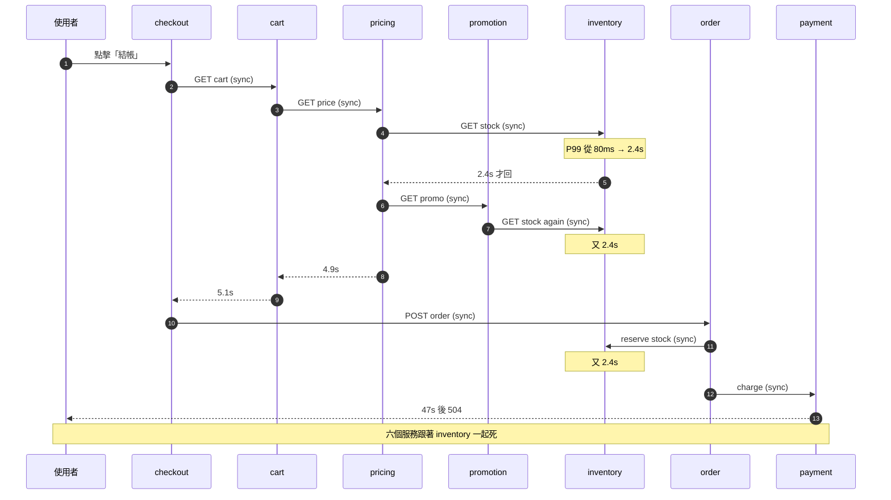
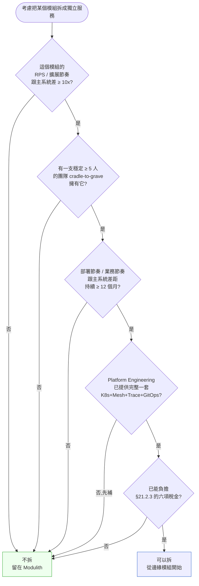

# 第 21 章|微服務架構
## ⸺ 分散式系統的稅金與其抵稅條件

> **前置閱讀**:[Ch 17 DDD 戰術設計](./ch-17-ddd-strategic-tactical.md)、[Ch 20 Modular Monolith](./ch-20-modular-monolith.md)
> **下游章節**:[Ch 22 Event-Driven 架構](./ch-22-event-driven-cqrs-es.md)、[Ch 23 Kubernetes 實戰](./ch-23-cloud-native-kubernetes.md)、[Ch 24 Service Mesh / Cell-Based](./ch-24-service-mesh-cell-based.md)、[Ch 27 可觀測性](../part-05-quality/ch-26-observability-otel.md)
> **延伸補章**:無

---

## 21.1 冷觀察 ⸺ 黑五當天 inventory 服務 latency 上升,六個服務一起掛

我在 2025 年 11 月 28 日,陪虛構電商 **TideCart**(`CASE-ECM-005`)在台北辦公室過了一整夜的黑色星期五。TideCart 是一家 GMV 約 4.8 億美元的東南亞快時尚平台,2023 年從一個 Rails monolith 一口氣拆出 32 個微服務,當時的決策理由寫在內部 wiki 上,只有一句:「為了 Black Friday 的擴展性」。

那天台北時間 22:11,他們的監控牆上開始閃紅。第一個閃的是 `inventory-service`,P99 latency 從 80ms 漲到 2.4s。22:13,`pricing-service` 也開始紅,因為它每次計價都同步呼叫 inventory 確認可售量。22:14,`cart-service` 紅,因為加入購物車要呼叫 pricing。22:15,`order-service`、`promotion-service`、`recommendation-service` 接連紅。22:18,checkout 整條路徑 P99 已經是 47 秒,前端開始大量出現 `504 Gateway Timeout`。

監控牆上六個紅燈從亮起到全亮,**只花了七分鐘**。SRE on-call 在 Slack 裡打了一句話,我把它原樣記下來:

> 「inventory 一個服務在喘,我有六個服務一起在死。請問我這拆成 32 個服務,擋了什麼?」

沒有人答得上來。事後從 Jaeger 把那七分鐘的 trace 抓出來,平均一筆下單請求要 hop 過 14 個服務、做 22 次跨服務同步呼叫,任何一個 hop 慢一點,整條鏈就斷。這不是「黑五流量大」的問題 ⸺ 流量比平日只高 3.8 倍,連他們的 K8s HPA 都還沒擴到上限。**問題是他們把 32 個服務串成了一條同步呼叫鏈**,inventory 一抖,整條鏈一起抖。

把那七分鐘的故障壓成一張序列圖,大概長這樣:



事故覆盤會議上,TideCart 的 VP Engineering 把白板擦乾淨,寫下三個字:「**分散式單體**」。然後在底下寫一行小字:「我們付了 32 份分散式系統的稅金,但是沒享受到任何分散式系統的好處」。那一句是這場事故真正的標題 ⸺ 也是這一章要拆的東西。

---

## 21.2 真問題 ⸺ 微服務不是「規模化的方法」,是「強制購買的稅金清單」

「微服務適合大規模系統嗎?」這個問題,從 2014 年問到 2026 年,大部分團隊把它問錯了方向。把它拆開來看會比較清楚:**微服務本身不是擴展的「方法」,擴展的方法是「把工作切成可以平行做的單位」。微服務只是其中一種拓樸選擇 ⸺ 而且是付了最高稅金的那一種**。

### 21.2.1 從 Lewis & Fowler 2014 那篇定義開始

James Lewis 與 Martin Fowler 2014 那篇 *Microservices*[^CIT-200] 留下了一份至今仍在被引用的定義清單。把核心精神壓成幾條:

- **獨立部署**(Independently Deployable):每個服務一條 pipeline,改動互不阻塞。
- **獨立資料儲存**(Decentralized Data Management):每個服務擁有自己的 DB,跨服務不 SQL JOIN。
- **業務能力切分**(Organized around Business Capabilities):服務邊界對應 Bounded Context,不是技術層。
- **去中心化治理**(Decentralized Governance):不同服務允許不同技術選型。
- **設計為失敗**(Design for Failure):假設網路不可靠,任何 RPC 都會掛。

這份定義到 2026 年仍然成立,但**它從頭到尾沒有一個字是「為了規模」**。Lewis 與 Fowler 在原文裡反覆提到的詞是「Bounded Context」「team autonomy」「deployment independence」⸺ 都是組織與設計的訴求,不是擴展的訴求。後來十年市場把它扭曲成「微服務 = 大規模系統的解法」,是這場誤會的開始。

### 21.2.2 與 SOA 的本質差異

很多人把微服務當成 SOA 換了名字。把兩者並排,差異其實很具體:

| 維度 | SOA(2000s) | 微服務(2014+) |
|---|---|---|
| **通訊媒介** | ESB(Enterprise Service Bus,中央化) | 直接點對點(REST / gRPC / Kafka) |
| **資料策略** | 共享企業資料模型(canonical data model) | 每服務獨立 DB,不共享 schema |
| **服務粒度** | 粗(以「企業功能」為單位) | 細(以 Bounded Context / Aggregate 為單位) |
| **治理風格** | 中央化(governance committee) | 去中央化(team autonomy) |
| **典型協議** | SOAP / WS-* / XML | HTTP+JSON / gRPC / AsyncAPI |
| **部署單位** | 服務多但常被 ESB 綁成一體 | 服務多且部署獨立 |

差異最致命的一條是**資料**。SOA 留了一個共享資料模型,所以後期常常退化成「分散式資料庫怪獸」;微服務刻意把這條切斷,要求每服務獨立 DB。但這條切斷的代價就是 §21.1 的故事 ⸺ 跨服務一致性,從一個 SQL transaction 的問題,變成一個分散式系統的問題。**微服務拿掉了 ESB 的單點瓶頸,但把交易一致性的責任推回給每一個團隊**。

### 21.2.3 微服務的稅金清單

把這條責任清單寫具體一點。每跨進一個微服務拓樸,**強制購買**的稅金大致長這樣:

| 稅項 | 在收什麼 | 不買的後果 |
|---|---|---|
| **平台稅** | K8s + GitOps + Service Mesh + 基底映像鏈 | 32 個服務沒有平台 = 32 份手工腳本 |
| **觀測稅** | 分散式 tracing + 結構化日誌 + 多服務 metrics | 一筆事故要肉眼追 14 個 hop |
| **一致性稅** | Saga / Outbox / 補償邏輯 / 冪等性 | 跨服務交易出錯後資料就分裂了 |
| **部署稅** | 32 條 pipeline、32 份 manifest、32 套版本協調 | 改一個跨服務功能要協調 4 個 PR |
| **認知稅** | 工程師要同時持有「分散式系統」+「業務領域」兩套心智模型 | 新人要 12 週才能寫第一個 PR |
| **網路稅** | 失敗會發生、重試會發生、亂序會發生、延遲會抖 | 等於 §21.1 那七分鐘 |

這份清單不是「努力做就可以省」⸺ 它是「你拆了服務,**就一定會收費**」。差別只在於你是「主動買單」還是「被動踩雷」。Pat Helland 在 *Life Beyond Distributed Transactions*[^CIT-211] 講過同一件事的另一種版本:「在分散式系統裡,你不是選擇要不要處理一致性,而是選擇要在哪一層處理」。

### 21.2.4 與 Modular Monolith 的決策延伸

Ch 20 已經把預設值定在 Modular Monolith。本章不是反過來推銷微服務,**是要回答 Ch 20 沒回答的那個問題:「什麼條件下,值得跨進微服務?」**

換句話說,本章要做的事是「把那份稅金清單對著抵稅條件看」。下一節的決策框架,就是把抵稅條件講清楚。

---

## 21.3 決策框架 ⸺ 拆分四維、Saga、同步非同步、八大謬誤

下面這幾張表跟一張決策樹,在現場用過很多次。前提是先回答一件事:你現在問的是「要不要拆」,還是「拆了之後要怎麼做」。**這兩件事不是一件**。

### 21.3.1 拆分判準四維

把 Sam Newman *Building Microservices* 2nd ed.[^CIT-210]、Team Topologies[^CIT-212]、Eric Evans 的 Bounded Context[^CIT-005] 與現場觀察壓成四個維度,大致是:

| 維度 | 在問什麼 | 通過的訊號 | 沒通過的訊號 |
|---|---|---|---|
| **規模(Scale)** | 這個業務的 workload 是不是真的需要獨立擴展? | 某模組 RPS 比其他模組高 10x 以上,且擴展節奏不同 | 「之後會多」;workload 差距加機器就解決 |
| **團隊(Team)** | 是不是已經有一支穩定 ≥ 5 人、可以 cradle-to-grave 擁有這個服務的團隊? | 團隊邊界穩定 12 個月、Conway's Law 已落地 | 團隊還在動、共用 on-call、跨團隊改 PR |
| **變動頻率(Change Cadence)** | 這個模組的部署節奏是不是跟主系統明顯不同? | 部署頻率差距 ≥ 5x、業務節奏差異 ≥ 12 個月 | 部署節奏其實一樣;只是「想要獨立」 |
| **平台能力(Platform Engineering)** | Platform 團隊是否已經提供 K8s + Mesh + Tracing + GitOps + DLQ + Schema Registry 一套? | 上線一個新服務不需要服務團隊自己寫 manifest | 每個服務團隊各自寫 Dockerfile、各自設 envoy |

四個維度全部通過,才有資格進「該不該拆」這一步。**任何一個沒通過,留在 Modular Monolith 比拆出去便宜**。TideCart 在 2023 年那一刀,四個維度過了零個半 ⸺ 規模沒到、團隊還在動、變動頻率其實都是月度、平台能力是零。32 份稅金準時開單,§21.1 是 23 個月後的帳單到期通知。

### 21.3.2 「這次該不該拆」決策樹



這張圖跟 Ch 20 §20.3.3 的決策樹精神一致,但這裡多了最後一格:**第五題是「能不能負擔稅金」**。前四題回答「邊界要不要切出去」;第五題回答「切出去之後,你願不願意付那六項稅」。沒到第五題那一格之前,任何拆分討論都太早。

### 21.3.3 八大謬誤對照表

Peter Deutsch 與 James Gosling 1994 年留下的「分散式系統八大謬誤」[^CIT-213],到 2026 年仍然是微服務團隊每一週都在踩的雷。把每條謬誤對應到 §21.1 的事故場景,大致長這樣:

| # | 謬誤 | 它預設你假設了什麼 | 微服務現場代價 |
|---|---|---|---|
| 1 | 網路是可靠的 | RPC 都會回傳 | inventory 抖一下,六個服務跟著掛 |
| 2 | 延遲為零 | sync call 不要錢 | 22 次同步呼叫疊起來變 47 秒 |
| 3 | 頻寬無限 | payload 隨便丟 | 黑五當天網路費飆三倍 |
| 4 | 網路是安全的 | 服務之間不需要驗證 | 忘了 mTLS,內網被測試帳號打穿 |
| 5 | 拓樸不變 | service discovery 不會錯 | 滾動更新時 50% 流量 routing 到舊版 |
| 6 | 只有一個管理員 | 所有服務同節奏 | 32 條 pipeline,32 種版本,沒人協調 |
| 7 | 傳輸成本為零 | 序列化不要錢 | JSON encode/decode 吃掉 30% CPU |
| 8 | 網路是同質的 | 跨 region 跟同 region 一樣 | 跨 AZ 的 RPC 比同 AZ 慢 8 倍 |

這張表的用法不是「背下來」,是**每次設計同步呼叫鏈時,把這八條讀一遍**。讀完還願意打 sync call,再打;不是的話,改 async。

### 21.3.4 跨服務交易:Saga Choreography vs Orchestration

Hector Garcia-Molina 與 Kenneth Salem 1987 年那篇 *Sagas*[^CIT-214] 把長交易拆成「一連串本地交易 + 對應的補償交易」這個概念留了下來。到 2026 年,Saga 在微服務拓樸下有兩種常見實作,差距很大:

| 維度 | Choreography(編舞) | Orchestration(編排) |
|---|---|---|
| **控制點** | 沒有中央協調者,服務之間透過事件互相觸發 | 有一個 Process Manager / Orchestrator 統籌每一步 |
| **耦合方向** | 服務只認識自己訂閱的事件 | 服務只認識 Orchestrator 的指令 |
| **狀態追蹤** | 沒有單一狀態機,要從事件流裡拼出來 | 狀態機集中在 Orchestrator |
| **適合場景** | 步驟少(≤ 3)、領域團隊強、事件契約穩 | 步驟多(≥ 4)、需要超時 / 補償 / 重試決策 |
| **失敗診斷** | 困難,要追多個服務的 log | 容易,看 Orchestrator 的狀態機 |
| **典型工具** | Kafka + 服務內部事件 handler | Temporal、Camunda、AWS Step Functions、自寫 PM |
| **常見地雷** | 跨服務狀態漂移、循環事件、無人擁有「整體流程」 | Orchestrator 變成新的單點、業務邏輯漂進 PM |

現場常用的拇指法則:**步驟 ≤ 3 用 Choreography,≥ 4 用 Orchestration**。Caitie McCaffrey 在 *There Is No Now*[^CIT-215] 講過原因:分散式系統裡的「現在」不存在,步驟越多,越需要一個狀態機把「現在做到哪一步」這件事顯式化。Choreography 的事件流可以拼出狀態,但拼出來的東西不會比一個 Orchestrator 便宜。

下面這段是 TideCart 把 checkout 從 Choreography 改成 Orchestration 之後的最小骨架(用 Temporal 4.x / Java 21 寫):

```java
// CheckoutSaga.java —— Process Manager(Orchestrator)
@WorkflowInterface
public interface CheckoutSaga {
    @WorkflowMethod
    OrderResult checkout(CheckoutCommand cmd);
}

public class CheckoutSagaImpl implements CheckoutSaga {

    private final InventoryActivities inventory =
        Workflow.newActivityStub(InventoryActivities.class, defaultOptions());
    private final PaymentActivities payment =
        Workflow.newActivityStub(PaymentActivities.class, defaultOptions());
    private final ShippingActivities shipping =
        Workflow.newActivityStub(ShippingActivities.class, defaultOptions());

    @Override
    public OrderResult checkout(CheckoutCommand cmd) {
        Saga saga = new Saga(new Saga.Options.Builder().build());
        try {
            ReservationId rid = inventory.reserve(cmd.lines());
            saga.addCompensation(() -> inventory.release(rid));

            ChargeId cid = payment.charge(cmd.customerId(), cmd.total());
            saga.addCompensation(() -> payment.refund(cid));

            shipping.schedule(cmd.shipTo(), rid);
            // 沒有第四步的補償,因為這已經是最後一步
            return OrderResult.confirmed(cmd.orderId());
        } catch (Exception e) {
            saga.compensate();           // 反向觸發每一步的補償
            return OrderResult.failed(cmd.orderId(), e.getMessage());
        }
    }
}
```

這段程式碼的精神不是 Temporal 多厲害,**是「整體流程在一個地方被擁有」**。出事的時候,SRE 看 Temporal Web UI 就知道 saga 卡在第幾步、補償有沒有跑完。Choreography 沒這個 UI,只有事件流,事故當下要在 Slack 裡拼湊「現在到底走到哪」。

### 21.3.5 同步 vs 非同步通訊取捨

把 §21.1 改成非同步,故事會變這樣:cart 不會直接呼叫 inventory,而是發 `CartItemAdded` 事件;pricing 訂閱事件異步算價;結帳時 order-service 從本地 read model 直接讀「目前可售量(可能略舊)」做樂觀預訂,真正的扣量在 saga 裡 reserve。inventory 抖,只會卡到 reserve 那一步,不會卡到 cart 跟 pricing。

| 維度 | 同步(REST / gRPC) | 非同步(Kafka / NATS / Pulsar) |
|---|---|---|
| **訴求** | 即時性、一次拿到結果 | 解耦、削峰、容忍延遲 |
| **耦合方向** | 時間耦合(對方必須在線) | 時間解耦(對方不在也沒關係) |
| **失敗模式** | 對方掛 → 我也掛 | 對方掛 → 我繼續,訊息堆積 |
| **資料保證** | 強一致(交易內) | 最終一致(透過 Outbox / 冪等消費) |
| **協議典型** | HTTP/JSON、gRPC、GraphQL | Kafka、NATS JetStream、Pulsar、AMQP |
| **適合場景** | 讀請求、必須立即回的查詢、跨組織 API | 寫請求的副作用、跨服務通知、長尾任務 |
| **常見地雷** | 同步呼叫鏈疊起來 = 分散式單體 | 沒做冪等 = 同訂單重出貨 |

現場常用的判準:**讀走同步,寫走非同步**。TideCart 後來把 checkout 路徑上 22 次同步呼叫砍到 4 次(都是讀),其餘的副作用全部走 Kafka + Outbox,黑五復盤後一個月,P99 從 47 秒降到 1.2 秒。

### 21.3.6 Outbox Pattern 最小骨架

非同步通訊最常見的問題是「DB 寫了,訊息沒發出去」或反過來。Outbox Pattern[^CIT-216] 把這件事用一張本地表解決:寫 DB 跟寫 outbox 在同一個 transaction,事件由獨立的 relay 程序從 outbox 讀出來丟到 broker。

```sql
-- order_schema.outbox
CREATE TABLE outbox (
    id           UUID PRIMARY KEY,
    aggregate    TEXT NOT NULL,          -- 'order'
    aggregate_id TEXT NOT NULL,          -- order_id
    event_type   TEXT NOT NULL,          -- 'OrderPlaced'
    payload      JSONB NOT NULL,
    created_at   TIMESTAMPTZ NOT NULL DEFAULT now(),
    published_at TIMESTAMPTZ
);
CREATE INDEX outbox_unpublished ON outbox (created_at) WHERE published_at IS NULL;
```

```java
// 在同一個 @Transactional 裡寫 order + 寫 outbox
@Transactional
public OrderId place(PlaceOrderCommand cmd) {
    Order order = Order.create(cmd);
    orderRepo.save(order);
    outboxRepo.save(OutboxRecord.of(
        "order", order.id().value(),
        "OrderPlaced", payload(order)
    ));
    return order.id();
}
```

「Relay」可以用 Debezium 監聽 PG WAL,也可以寫一個簡單的 polling worker 每 200ms 撈一次未發布的 outbox 紀錄丟到 Kafka,丟成功之後寫回 `published_at`。**這段程式碼的精神是「DB 跟訊息隊列之間,有一個只能用本地交易解決的原子問題」⸺ Outbox 把它解掉**。沒有 Outbox 的微服務團隊,90% 都會在某一天遇到「訂單建立成功但下游沒收到」這種事故。

### 21.3.7 契約測試與 API Versioning

最後一塊是契約。微服務團隊各自部署,意味著消費端跟提供端的 API schema 必須有「契約」⸺ 不然每次 provider 改 API 都會打爛 consumer。Pact[^CIT-217] 在這件事上的設計很簡單:**消費端先寫期望 → 自動產生 contract → provider 拿 contract 跑驗證**。Pact CI 跑紅,provider 就改不過去。

API 版本管理走 SemVer:major 是破壞性變更(必須跑棄用節奏),minor 是相容新增,patch 是內部修。配合 Pact contract,minor 不會打破契約測試,major 一定會 ⸺ 這就是「破壞性變更被工具強制曝光」的機制。沒有契約測試的微服務團隊,9 成的線上事故來自「provider 沒告訴 consumer 改了什麼」。

---

## 21.4 踩坑清單

下面這四個常見地雷,在 ecommerce、fintech、saas 都看得到。它們的共同點是:**形式上拆了微服務,但實質上沒有產生分散式系統的好處,只付了稅**。每個都附修正方向,下次遇到可以這樣處理。

### 反模式 1:分散式單體(Distributed Monolith)

服務拆了 32 個,但每個請求要 hop 過 14 個服務、做 22 次同步呼叫,任何一個服務抖一下整條鏈就斷。表面上是微服務,實質上是「拆過的 monolith」⸺ 失去了 monolith 的單一交易、也沒拿到分散式系統的隔離。§21.1 TideCart 那七分鐘就是這一條。

> ✅ **修正方向**:同步呼叫鏈深度 > 3 就是訊號。把寫操作的副作用一律改成事件(配 Outbox),只留讀操作走同步。每個 service 設一條 fitness function:「同步呼叫深度 ≤ 3」,違反者擋 PR。判準:checkout 路徑上的同步 hop 數,每月在 dashboard 上量一次,趨勢往上要回頭檢視。

### 反模式 2:沒做契約測試(Pact)就拆服務

服務拆了,API 也訂了,但 provider 改 API 沒人通知 consumer。Provider 部署完,consumer 在下一次發布時整批 500。事故覆盤的對話常常是:「我以為加一個 nullable 欄位是 backward compatible」⸺ 但 consumer 那邊已經寫了 strict deserialization。微服務團隊**沒契約測試,等於每次 provider 部署都是抽籤**。

> ✅ **修正方向**:任何 inter-service API 上線前先寫 Pact contract test,consumer 端發出期望、provider CI 跑驗證。Pact Broker 接到 webhook 自動觸發 provider verification,紅燈擋 deploy。配合 SemVer:minor / patch 不能打破現存 contract,major 走 18 個月棄用節奏(同 Ch 14)。判準:任何「provider 部署 → consumer 壞」的事故,事後檢查 Pact 是否覆蓋該 endpoint;沒覆蓋就立刻補。

### 反模式 3:Saga Choreography 但沒寫 Process Manager 追狀態

跨服務交易用 Choreography,事件四處飛,沒有任何一個地方持有「這筆訂單現在走到哪一步」的狀態。出事的時候,SRE 在 Slack 裡逐個服務查 log,把事件時序拼出來,半小時後才知道 saga 卡在 payment 後沒觸發 shipping。再過幾個月,團隊裡開始流傳「沒人懂 checkout 全流程」這句話。

> ✅ **修正方向**:Saga 步驟 ≤ 3 的可以 Choreography,但**狀態仍然要在某處顯式存著**(最簡單就是一張 `saga_state` 表,記錄每個 saga instance 走到哪)。步驟 ≥ 4 一律改 Orchestration,用 Temporal、Camunda 或自寫 Process Manager。判準:任何跨服務流程,要能在 5 分鐘內回答「這筆 saga 現在在哪一步、上一步什麼時候完成、下一步預計什麼時候開始」。回答不了就要做。

### 反模式 4:服務 < 50 人團隊就拆 30+ 個

最常見的版本。32 個工程師,拆出 32 個微服務,每個服務名義上有人擁有,實際上同一群人在五個服務之間切換。Platform Engineering 沒人做、SRE 工時佔 18%、新人 onboarding 12 週、跨服務改一個功能要協調 4 個 PR。**業務節奏是月度,卻付了週度級分散式系統的稅金**。TideCart 2023 年那一刀就是這個範本,Ch 20 的 MeshFirst 也是。

> ✅ **修正方向**:用 §21.3.1 四維 + §21.3.2 決策樹做判斷,**四維全部通過才考慮拆**。團隊規模 < 50 人的階段,預設值是 Modular Monolith(Ch 20),需要獨立部署的就拆出 1–3 個邊緣服務(BFF、Webhook fanout、Search index),不要一次拆 30+ 個。判準:每要拆一個新服務,先過一遍決策樹,把答案寫進 ADR;答不出來的維度,就是這次不該拆的訊號。

---

## 21.5 交付清單 ⸺ 一頁式 Microservice Tax Card

每一個要拆出去的微服務,**先寫一張 Microservice Tax Card 再開 repo**。它不是文件,是抵稅清單 ⸺ 把六項稅金寫具體,把抵稅條件寫具體,寫不滿一頁就是還沒想清楚這個服務該不該拆。

把它存在 `docs/services/<service-name>.md`,跟 ADR 同層、跟 service repo 的 `README.md` 雙向連結。

````markdown
# Microservice Tax Card — {服務名稱}

> 版本:v0.1 | 撰寫日期:YYYY-MM-DD | Owner team:{team}
> 對應 ADR:`docs/adr/00NN-extract-<service>.md`
> 對應 Bounded Context(Ch 17):

## 1. Service Identity(這個服務是什麼)
- 一句話 mission:{對誰、提供什麼能力、不做什麼}
- 為什麼是「服務」而不是「模組」(從 Modulith 拆出去的具體訊號):

## 2. 拆分四維檢核(§21.3.1)
| 維度 | 通過? | 訊號 |
|---|---|---|
| 規模(RPS / 擴展節奏 ≥ 10x) | ☐ | |
| 團隊(穩定 ≥ 5 人 cradle-to-grave) | ☐ | |
| 變動頻率(部署節奏差距 ≥ 5x、≥ 12 個月) | ☐ | |
| 平台能力(K8s+Mesh+Trace+GitOps 齊備) | ☐ | |
> 任何一格未勾,**回到 Modulith**。

## 3. 稅金清單(每項都要有負責人)
| 稅項 | 工具 / 機制 | Owner | 抵稅條件 |
|---|---|---|---|
| 平台稅 | K8s 1.31 + ArgoCD + Istio 1.23 | platform-team | 已用既有平台,無需自建 |
| 觀測稅 | OpenTelemetry 1.x + Tempo + Loki + Grafana | platform-team | trace 自動注入,無需服務團隊配置 |
| 一致性稅 | Outbox + Kafka 3.7 + Saga(Temporal) | service team | 每一步補償已寫,Process Manager 已上 |
| 部署稅 | GitOps + Helm chart 模板 | platform-team | 模板複用,無需自寫 manifest |
| 認知稅 | Backstage component 自動生成 + onboarding doc | service team | 新人 ≤ 3 週送出第一個 PR |
| 網路稅 | mTLS(Mesh)+ retry + circuit breaker + rate limit | platform-team | Sidecar 預設提供,服務只設策略 |

## 4. 通訊契約(對外暴露的 API)
- 同步:`gRPC` proto file 路徑、API version(SemVer)、Pact contract id
- 非同步:Kafka topic 名、AsyncAPI 3.0 schema 路徑、event version

## 5. 跨服務交易(本服務參與哪些 Saga)
| Saga 名 | 角色(發起 / 參與) | Choreography / Orchestration | 補償操作 |
|---|---|---|---|
| CheckoutSaga | 參與 | Orchestration(Temporal) | `release(reservationId)` |

## 6. 失敗策略
- 上游掛了的 fallback:
- 下游掛了的退避策略(retry / DLQ / circuit breaker thresholds):
- 冪等性實作:`Idempotency-Key` 在哪一層處理?
- 超時設定:每個 outbound call 的 timeout / overall budget

## 7. SLO / SLI(本服務承諾的服務水準)
- 可用性 SLO:99.9%(月度 error budget = 43 分鐘)
- P99 latency SLO:
- 對應 alerting rule 路徑:

## 8. Observability(觀測注入)
- Trace:OTel SDK / 已自動傳遞 traceparent
- Log:結構化 JSON / correlation id 欄位名
- Metrics:RED(Rate/Error/Duration)+ 業務指標清單

## 9. 退場條件(這個服務什麼時候該被收回 Modulith?)
- ☐ 規模差距持續 ≤ 3x 連續 6 個月 → 重新評估收回
- ☐ 擁有團隊解散 / 規模 < 3 人 → 立即評估收回
- ☐ 跨服務同步呼叫深度 > 3 → 重新檢視拓樸
````

**為什麼是一頁?** 一頁的篇幅會逼出選擇。寫不滿稅金清單那一節,通常意思是還沒搞清楚拆服務的真實成本。寫不出抵稅條件那一節,通常意思是這個服務還不該拆。

**為什麼有「退場條件」?** 因為微服務不是單向決策。Ch 20 的 MeshFirst 跟 §21.1 的 TideCart 都示範了「拆出來之後收回去」這條路徑。在 Tax Card 裡先寫好退場條件,等於把「我們有勇氣承認這個服務不該繼續存在」這件事先制度化 ⸺ 不然兩年後它會變成沒人敢動的歷史包袱。

**為什麼六項稅金每項都要有 Owner?** 沒寫 Owner 的稅金,長期會變成 service team 自己扛。平台稅、觀測稅、網路稅在成熟組織裡應該由 Platform team 提供,service team 只負責一致性、認知、部署這三項裡的業務面。Owner 寫清楚,後面的能力建設才有人推。

---

## 21.6 本章交付清單 Recap

讀完本章,你應該已經能做到:

- [ ] 講清楚「微服務不是擴展的方法,是強制購買的稅金清單」⸺ 六項稅金、四維抵稅條件,看到團隊在沒抵稅條件下硬拆,能在會議上指出風險
- [ ] 用 §21.3.1 四維 + §21.3.2 決策樹回答「這個模組要不要拆出去」⸺ 任何一維不通過就留在 Modulith,不要被「業界都在用」這種話帶走
- [ ] 看到一條超過 3 hop 的同步呼叫鏈會警覺,知道分散式單體是怎麼長出來的;能講清楚 Choreography 與 Orchestration 在「步驟數」這個維度的切換點
- [ ] 為手上的服務寫好一張 Microservice Tax Card,把六項稅金的 Owner 與抵稅條件寫具體;沒寫好的服務先不要拆

四項中先挑一項做完就好,建議從最後那一項 ⸺ 把「下一個準備拆出去的服務」先寫一張 Tax Card,**寫不滿稅金清單或寫不出退場條件的那個服務,就是這次不該拆的訊號**。Ch 22 會把 Event-Driven 架構講透,讓你在「同步呼叫鏈」之外還有第二種拓樸選擇;Ch 23 會接著 Kubernetes 跟 Platform Engineering 怎麼支撐這份稅金;Ch 24 會把 Service Mesh 跟 AWS Cell-Based 講清楚 ⸺ Cell-Based 是 2026 年「不要無腦拆 30+ 服務」的另一種答案。

---

## Cross-References

- **回顧**:[Ch 17 DDD 戰術設計](./ch-17-ddd-strategic-tactical.md) ⸺ Bounded Context 是服務邊界的來源;[Ch 20 Modular Monolith](./ch-20-modular-monolith.md) ⸺ 預設值在這裡,本章是它的延伸決策
- **下一章**:[Ch 22 Event-Driven 架構](./ch-22-event-driven-cqrs-es.md) ⸺ 把 §21.3.5 / §21.3.6 的非同步通訊延伸到完整的事件驅動拓樸
- **平台支撐**:[Ch 23 Kubernetes 實戰](./ch-23-cloud-native-kubernetes.md)、[Ch 24 Service Mesh / Cell-Based](./ch-24-service-mesh-cell-based.md)
- **觀測稅怎麼付**:[Ch 27 可觀測性](../part-05-quality/ch-26-observability-otel.md)

## 引用

[^CIT-005]: Eric Evans, *Domain-Driven Design* (Addison-Wesley, 2003)。同 Ch 1。
[^CIT-200]: James Lewis & Martin Fowler, "Microservices" (martinfowler.com, 2014-03-25)。同 Ch 20。
[^CIT-210]: Sam Newman, *Building Microservices*, 2nd Edition (O'Reilly, 2021)。微服務拆分判準與組織契合度的當代基準。
[^CIT-211]: Pat Helland, "Life Beyond Distributed Transactions: An Apostate's Opinion" (CIDR 2007;ACM Queue 2017 重刊)。分散式系統一致性的本質討論。
[^CIT-212]: Matthew Skelton & Manuel Pais, *Team Topologies* (IT Revolution, 2019)。Stream-aligned / Platform / Enabling / Complicated-Subsystem 四種團隊型態。
[^CIT-213]: L. Peter Deutsch & James Gosling, "The Eight Fallacies of Distributed Computing" (Sun Microsystems, 1994/1997)。
[^CIT-214]: Hector Garcia-Molina & Kenneth Salem, "Sagas" (ACM SIGMOD, 1987)。Saga 概念原典。
[^CIT-215]: Caitie McCaffrey, "There Is No Now: Problems with Simultaneity in Distributed Systems" (ACM Queue, 2015)。分散式系統「現在」的不存在性。
[^CIT-216]: Chris Richardson, "Pattern: Transactional Outbox" — microservices.io/patterns/data/transactional-outbox.html。Outbox Pattern 規範化敘述。
[^CIT-217]: Pact Foundation, "Pact: Contract Testing for HTTP and Message Integrations" — docs.pact.io。

---
