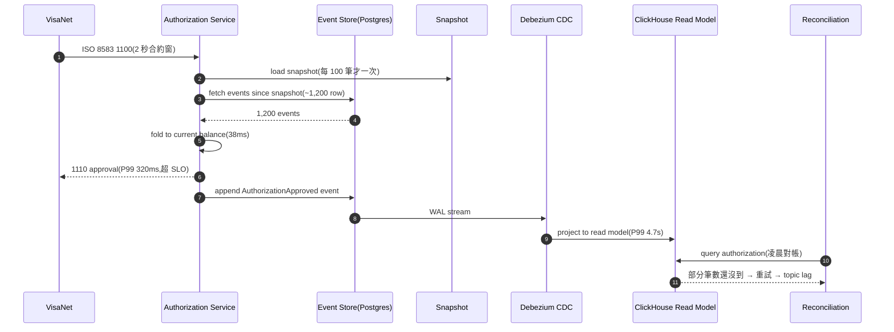
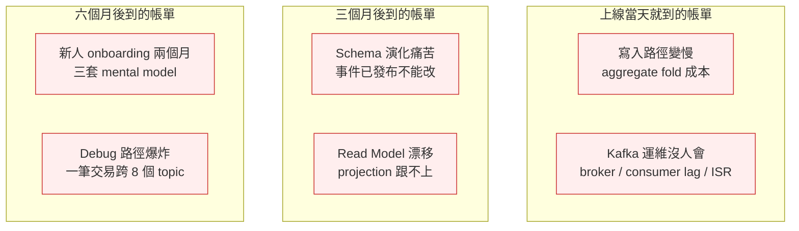
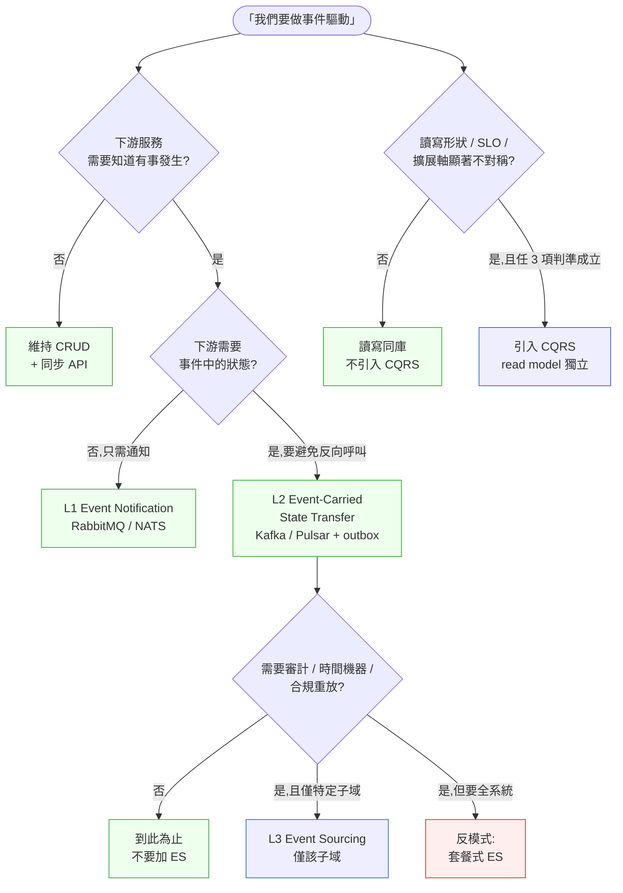

# 第 23 章|事件驅動架構、CQRS 與 Event Sourcing
## ⸺ 三件不該綁一起的工具

> **前置閱讀**:[Ch 18 DDD 戰略與戰術](./ch-18-ddd-strategic-tactical.md)、[Ch 19 Event Storming 與 Event Modeling](./ch-19-event-storming-modeling.md)、[Ch 22 微服務拆分判準](./ch-22-microservices.md)
> **下游章節**:[Ch 24 API Gateway 與 BFF](./ch-25-service-mesh-cell-based.md)、[Ch 31 可觀測性](../part-05-quality/ch-29-observability-otel.md)、[Ch 39 Multi-Agent 系統設計](../part-07-ai-era/ch-39-multi-agent.md)
> **延伸補章**:[Ch 40 共識/狀態/衝突](../part-07-ai-era/ch-40-multi-agent-consensus.md)

---

## 22.1 冷觀察 ⸺ 授權 P99 從 80ms 變 320ms

我在 2026 年第一季看過一個案例。

虛構支付平台 **CardPilot Asia**(`CASE-FIN-006`),做東南亞跨境收單與虛擬卡發行,日均授權交易 480 萬筆,工程團隊 56 人。技術棧:Spring Boot 3.3 + PostgreSQL 17 + Kafka 3.7 + Redis 7,跑在 AWS ap-southeast-1 EKS 1.31。授權服務(Authorization Service)的 SLO 是 P99 < 100ms,因為 ISO 8583 1100 訊息進來、出去 Visa / Mastercard 的合約窗是 2 秒,扣掉網路與下游清算,授權本身只能花 100ms 以內。

2025 年 Q4,新任架構長從一家紐約 fintech 跳槽過來,帶了一份「現代 fintech 架構藍圖」進公司。藍圖的核心是三件套:**EDA + CQRS + Event Sourcing 全棧採用**,並承諾「審計合規、時間機器回放、讀寫分離擴展」三大好處。Q4 啟動重構,Q1 第八週上線。

上線當天授權 P99 從 80ms 變 320ms,VisaNet 的 timeout 警報在凌晨三點打爆值班 SRE 的手機。事故覆盤會上,CTO 看著 Datadog 上的火焰圖,問了一句被原樣記下來的話:

> 「我們明明是為了審計才導入 Event Sourcing 的,為什麼現在連授權都跑不動?」

沒有人答得出來 ⸺ 因為團隊把 Event Sourcing 套用在熱路徑(authorization aggregate)上,每一筆授權要先 fold 過去 90 天的事件流(平均 1,200 筆事件/卡)才能算出當前餘額狀態,即使有 snapshot 也是每 100 筆才打一次。Postgres 的 `events` 表單表已經 47 億 row,單筆 fetch 從原本走 `cards.balance` 一行(0.8ms)變成 fetch 1,200 row + 應用層 fold(平均 38ms)。

更糟的是 CQRS 那一側:他們把 read model 做成 Kafka → Debezium CDC → ClickHouse 的鏈路,但寫入完成到 read model 可見的延遲是 P99 4.7 秒。對帳系統(reconciliation)在凌晨跑批,期望授權發生後 5 秒內可查 ⸺ 結果 4.7 秒的 P99 換算下來,每 1,000 筆就有 3 筆 read model 還沒到,對帳系統撞上「授權成功但查不到」就重試,Kafka topic 因此累積 lag。



那位架構長後來公開承認:**「我們把 Fowler 那篇〈What do you mean by Event-Driven?〉的三層次當成套餐了。」** [^CIT-220]

接下來四週,團隊做了一件原本應該在重構**之前**做的事:把 Event Sourcing 拆出來,只留在「對帳審計」與「合規重放」兩個冷路徑,熱路徑的 authorization aggregate 改回 CRUD + outbox + 事件通知(Event Notification),CQRS 也只保留在報表 / 風控 dashboard,授權本身讀寫同庫。授權 P99 回到 75ms,reconciliation 的 read model 延遲也降到 P99 280ms。

那位架構長離職前留了一句話在 Slack:**「這三件不是套餐,是三件不同層級的工具。」**

---

## 22.2 真問題 ⸺ EDA / CQRS / ES 是三層獨立工具

把 CardPilot Asia 的事拆開來看,問題不是「Event Sourcing 不好」、也不是「CQRS 不該用」⸺ 問題是團隊把三件本質不同的工具當成同一個架構決策。它們經常一起出現在同一份投影片、同一本書的同一章,所以容易被誤認為「採用其一就要採用其三」。

實際上,Martin Fowler 在 2017 年那篇〈What do you mean by "Event-Driven"?〉裡早已釐清:Event-Driven 至少有四種不同模式,Event Sourcing 是其中**最重的**一種,而 CQRS 是另一個獨立維度的決策 [^CIT-220]。把它們拆開來看會比較清楚。

### 22.2.1 EDA 的三層次(Fowler 分類)

Fowler 在那篇貼文把 Event-Driven 拆成四種模式,書內聚焦在最常被混淆的三種(Event Notification / Event-Carried State Transfer / Event Sourcing),加上 CQRS 共四種獨立決策:

| 層次 | 中文 | 一句話定義 | 訊息酬載 | 消費者怎麼用 |
|---|---|---|---|---|
| **L1 Event Notification** | 事件通知 | 「有事發生,你來查」 | 只含 ID + event type | 收到後自己回 source 撈詳情 |
| **L2 Event-Carried State Transfer** | 攜帶狀態事件 | 「有事發生,狀態在這裡」 | 完整或部分業務狀態 | 直接用,不需回問 source |
| **L3 Event Sourcing** | 事件溯源 | 「狀態 = 事件 fold,事件是真理」 | 不可變的領域事件流 | 重放(replay)+ 投影(projection) |
| **CQRS**(獨立軸) | 命令查詢分離 | 「讀模型與寫模型分家」 | 與 EDA 層次無關 | 寫走 command,讀走 view |

關鍵點:**這四個欄位可以獨立勾選**。可以做 L1 而不做 CQRS;可以做 L2 + CQRS 而不做 L3;可以做 L3 但只在審計子域,熱路徑保持 CRUD。CardPilot Asia 那位架構長犯的錯,是把這四格當成「全勾才現代」。

### 22.2.2 CQRS 的真相:讀寫不對稱才值得分家

Greg Young 在 2010 年那份〈CQRS Documents〉裡寫得很清楚:CQRS 的本質是「**承認讀取與寫入的需求形狀不同,因此用兩套模型**」[^CIT-221]。它不是一個架構模式,是一個**承認**:大部分系統的讀寫比是 100:1 甚至 1000:1,讀的查詢形狀(filter / aggregate / join)跟寫的 invariant 完全不同。

承認這件事之後,做法的劑量可以從「同一個 service 內部用兩個 class」一路加到「兩個 database + 兩個 service + 非同步同步」。CardPilot Asia 的問題是直接跳到最重的劑量,而沒有先問:**這個域的讀寫真的不對稱嗎?**

授權服務的讀寫比其實接近 1:1 ⸺ 每筆授權寫一次、查一次當前餘額(寫之前的 read-modify-write)。這種 workload 不需要 CQRS,讀寫同庫反而能用同一個 transaction 守住一致性。對帳服務的讀寫比是 1:50(寫一次授權結果、被 50 個下游報表查),這才是 CQRS 的甜蜜點。

### 22.2.3 Event Sourcing 的真相:三個正當理由,其他都該 CRUD

Fowler 在 2005 年那篇〈Event Sourcing〉與 Greg Young 後續的演講都強調:Event Sourcing 是一種**極端的工程選擇**[^CIT-222][^CIT-223]。它讓「狀態 = 事件 fold」成為唯一真理來源,代價是**寫入路徑變慢、查詢路徑必須重新設計、事件 schema 一旦發布就不能改、運維複雜度倍增**。

三個正當理由,其他不要做:

1. **法遵 / 審計需要不可變稽核軌跡**:金管會、MAS、HKMA、SEC 等監管要求「每一筆交易的決策過程可重建」⸺ 例如 ISO 20022 pacs.008 跨境匯款必須能回答「這筆款在哪一步被 sanction screening 標記」。
2. **業務需要時間機器(Temporal Query)**:「2024 年 6 月 30 日 23:59 那一刻,這個帳戶餘額是多少?」⸺ 保險理賠、稅務、跨年度結算這類需求,fold 事件流是最自然的。
3. **業務本身就是事件流**:DVR、版本控制、區塊鏈、CRDT ⸺ 領域裡「歷史本身就是價值」的場景。

支付授權**不在這三項裡**。授權需要的是「當下這一刻餘額是多少、是否足以授權」,稽核軌跡用 outbox + 不可變 audit log 就夠了,根本不需要把 aggregate 本身做成 ES。

### 22.2.4 套餐式採用的三個踩雷面

把這三件當成套餐,會在三個面向同時收到帳單,而且帳單會在不同時間到貨:



換句話說,**三件套全採用沒分層評估,代價會分成三批送達**,而你在做決策時通常只看到第一批。

---

## 22.3 決策框架 ⸺ 該採用哪一層、什麼時候採用

### 22.3.1 EDA 三層次適用情境表

下面這張表在架構審查會議上很好用 ⸺ 當有人說「我們要用事件驅動」,先問一句「你想解決哪個耦合問題」,再決定要走哪一層:

| 你想解決的問題 | 適用層次 | 訊息酬載大小 | 訊息傳輸建議 | 一致性語義 |
|---|---|---|---|---|
| 「下游服務需要知道有事發生,但不能直接呼叫」 | **L1 Event Notification** | 小(< 1KB,只含 ID + type) | RabbitMQ / NATS Core | At-least-once,消費者 idempotent |
| 「下游不想反向呼叫 source(避免循環、避免延遲)」 | **L2 Event-Carried State Transfer** | 中(1–50KB,含必要狀態) | Kafka / Pulsar / NATS JetStream | At-least-once + outbox |
| 「需要審計、時間機器、合規重放」 | **L3 Event Sourcing**(僅特定子域) | 中(完整 domain event) | Event Store DB / Kafka with compaction / Postgres `events` 表 | 強一致(寫入即真理) |
| 「讀的形狀跟寫差太多,想分開擴展」 | **CQRS**(獨立軸) | N/A(架構決策) | 視 read model 而定 | 寫強一致,讀最終一致 |

CardPilot Asia 應該怎麼做?授權熱路徑只需要 **L2 + outbox**(把授權結果作為攜帶狀態事件發到 Kafka,下游風控 / 對帳訂閱);對帳審計需要 **L3**(在 reconciliation 子域內做 Event Sourcing,熱路徑不碰);報表儀表板需要 **CQRS**(把 ClickHouse 當 read model,接受 P99 數秒延遲)。三件分別評估,而不是一鍋端。

### 22.3.2 CQRS 引入判準

CQRS 不是免費的。一旦引入,就要維護兩套 schema、兩套部署、一條同步管道、一份「read model 落後了該怎麼辦」的 runbook。下面這張判準表,只要任三項打勾才值得引入:

| 判準 | 打勾條件 |
|---|---|
| **讀寫比顯著不對稱** | 讀寫比 > 10:1,且讀的查詢形狀跟寫的 invariant 不同(例如多維 filter / 跨表聚合) |
| **讀寫的 SLO 不對稱** | 寫端要強一致(< 50ms P99),讀端可以接受最終一致(秒級延遲) |
| **讀寫的擴展軸不同** | 寫端擴展靠 sharding(如按 user_id),讀端需要全域聚合(無法 shard) |
| **業務允許 stale read** | 報表、儀表板、推薦清單等場景明確接受「資料晚幾秒」 |
| **多種讀視圖需求** | 同一份寫資料要餵給 ≥ 3 種不同形狀的讀模型(API / 報表 / 搜尋) |

> **判準不打勾就維持讀寫同庫**。讀寫同庫不是落後,是**承認你的 workload 不需要分家**。

### 22.3.3 Event Sourcing 引入判準(三個正當理由)

ES 比 CQRS 重得多。判準更嚴 ⸺ 三個理由中至少要有一個成立、且該子域的讀寫頻率允許 fold + snapshot 成本:

| 正當理由 | 範例場景 | 反例(不該用 ES) |
|---|---|---|
| **法遵 / 審計需求** | 跨境匯款 sanction screening 重建、KYC 決策過程稽核 | 內部工具的 audit log(用 outbox + immutable log 就夠) |
| **時間機器 / 溯及既往** | 保險理賠、稅務年度結算、版本控制系統 | 即時餘額查詢(用 read-after-write 即可) |
| **歷史本身就是價值** | DVR、git 物件、區塊鏈、CRDT、IoT telemetry | 訂單狀態機(state machine + history table 就夠) |

> **不在這三項裡的子域,維持 CRUD + 不可變 audit log 就夠**。Audit log 跟 Event Sourcing 的差別是:audit log 是「副產品」,CRUD 還是 source of truth;ES 是「事件本身就是 source of truth」⸺ 後者的代價是前者的 5–10 倍。

### 22.3.4 訊息傳輸選型表

選了 EDA 之後,下一個問題是「用什麼 broker」。2026 年現場主流五家,各有甜蜜點:

| Broker | 強項 | 弱項 | 甜蜜點 | 不建議 |
|---|---|---|---|---|
| **Apache Kafka 3.x** | 高吞吐、log 永續、ecosystem 完整(Connect / Streams / Schema Registry) | 運維重(ZK/KRaft、ISR、JVM 調優),小團隊吃不消 | 日均訊息 > 1 億、需要 replay、有 SRE | 團隊 < 10 人、訊息量小 |
| **NATS JetStream 2.10+** | 輕、Go 寫的單一 binary、subject 路由優雅 | ecosystem 比 Kafka 小、Schema 治理需自建 | 中等吞吐(< 100 萬/秒)、edge / 多租戶 | 已深度依賴 Kafka Connect 生態 |
| **Apache Pulsar 3.x** | 多租戶原生、計算儲存分離、地理複寫 | 運維 component(Bookie + Broker + ZK)更多 | 多租戶 SaaS、跨地域災備 | 單租戶、不需要計算儲存分離 |
| **RabbitMQ 4.x** | 路由語義豐富(exchange / binding)、AMQP 標準、運維熟成 | 不是 log-based,replay 弱;scale-out 比 Kafka 痛 | 任務佇列、複雜路由、傳統企業整合 | 需要事件重放、需要 TB 級 retention |
| **Redpanda 24.x** | Kafka API 相容、無 JVM、運維簡 | 商業授權限制(community 版功能有限) | 想要 Kafka 但不想養 Kafka 團隊 | 已有 Kafka 運維能力 |

CardPilot Asia 的場景(日均 480 萬授權 + 需要 replay 做對帳)選 Kafka 是合理的,問題在於**沒人會運維**。團隊內 SRE 都做過 Spring + Postgres,沒人帶過 Kafka cluster。上線後第三週遇到 ISR 抖動沒人會 debug,從 Confluent 找 contractor 救火。**選 Kafka 之前要先回答「誰在凌晨 4 點 broker GC pause 時接電話」**。

### 22.3.5 一張決策樹:這次該採用哪一層



這張圖的關鍵是:**EDA 那條主線跟 CQRS 那條獨立軸是兩條獨立的問句**。把它們混成一個問題,就會回到 CardPilot Asia 那種套餐式採用。

### 22.3.6 Outbox Pattern:讓 EDA 與資料庫一致的最小劑量

L2 與 L3 都會碰到同一個問題:**寫入資料庫的同時要發送事件到 broker,這兩件不能在同一個 transaction 裡**。Kafka 不參與資料庫 2PC、broker 也不該把交易語義揹在身上。

Pat Helland 在〈Immutability Changes Everything〉[^CIT-225] 與 Chris Richardson 的微服務模式書都推薦 Outbox Pattern:**事件先寫入同一個資料庫的 `outbox` 表,再由獨立 publisher 從表裡拉出來推到 broker**。一個寫操作,一個 transaction,broker 與資料庫的一致性問題收斂成「outbox 表的 publish lag」一個可觀測指標。

```sql
-- PostgreSQL 17 的 outbox table 範例
CREATE TABLE outbox (
    id          BIGSERIAL PRIMARY KEY,
    aggregate   TEXT NOT NULL,
    event_type  TEXT NOT NULL,
    payload     JSONB NOT NULL,
    headers     JSONB NOT NULL DEFAULT '{}',
    created_at  TIMESTAMPTZ NOT NULL DEFAULT NOW(),
    published_at TIMESTAMPTZ
);

CREATE INDEX idx_outbox_unpublished ON outbox (id)
    WHERE published_at IS NULL;
```

```java
// Spring Boot 3.3 + JPA 的寫入端
@Transactional
public void approveAuthorization(AuthCommand cmd) {
    Authorization auth = authRepo.findById(cmd.id()).orElseThrow();
    auth.approve(cmd.amount());
    authRepo.save(auth);

    // 同 transaction 寫 outbox
    outboxRepo.save(OutboxEvent.builder()
        .aggregate("Authorization")
        .eventType("AuthorizationApproved")
        .payload(toJson(new AuthApprovedV2(
            auth.getId(), auth.getCardId(),
            auth.getAmount(), auth.getApprovedAt())))
        .headers(Map.of(
            "schema-version", "v2",
            "idempotency-key", cmd.idempotencyKey()))
        .build());
}
```

獨立的 publisher(可以是 Debezium CDC、可以是自寫 polling loop)從 `outbox` 拉出未發布事件,推到 Kafka,成功後標記 `published_at`。這條鏈路的好處是:**broker 掛了,業務不受影響;業務 transaction 失敗,事件不會錯發**。

### 22.3.7 「Exactly-Once」的真相

Kafka 從 0.11 開始宣稱支援 exactly-once semantics,但這個詞在 2026 年仍然被誤解。實際上 Kafka 的 exactly-once 是**「idempotent producer + transactional consumer + 同一 Kafka cluster 內」**的組合 [^CIT-226],跨外部系統(資料庫、HTTP、第三方 API)時 exactly-once **無法成立**,只能靠 idempotent receiver 或 effectively-once 模式逼近。

換句話說:**真實世界沒有 exactly-once,只有 at-least-once + idempotency**。每個消費者都該預設「同一事件可能收到 2 次以上」,並用 idempotency key 去重。

### 22.3.8 Schema Registry 與事件演化

事件一旦發布,**就不能再改**(廣播給未知數量的消費者後,改 schema 等於對未知對象毀約)。所以一開始就要進 Schema Registry(Confluent / Apicurio),用 Avro / Protobuf / JSON Schema 強制約束,並在 CI 中檢查相容性 [^CIT-227]:

| 策略 | 規則 | 適用場景 |
|---|---|---|
| **BACKWARD** | 新版 reader 能讀舊版 data | 消費者先升級 |
| **FORWARD** | 舊版 reader 能讀新版 data | 生產者先升級 |
| **FULL** | 雙向相容 | 大多數內部事件 |
| **NONE** | 不檢查 | 只用於 legacy migration |

事件演化的常用手段是 **Upcasting**:消費者讀到舊版事件時,在進入領域邏輯前先升級到當前版本。這比「強迫所有消費者同時升級」務實得多。

### 22.3.9 2026 視角:AsyncAPI 3.0、AI Agent、OpenLineage

三個外部催化劑值得記下來:

**(a)AsyncAPI 3.0**(2024 發布)成為事件式 API 的事實標準 [^CIT-228]。把 Schema Registry 中的事件 schema export 成 AsyncAPI document,可以餵給 AI Agent 做事件流的「自動消費端骨架生成」、自動產生 contract test、自動產生消費者 SDK。

**(b)AI Agent 對事件流的友善設計**:Agent 比人類更需要「事件 schema 可機讀、語義清楚、版本明確」。設計事件時把 `event_id` / `event_version` / `causation_id` / `correlation_id` 四個 metadata 列為標配,Agent 在 debug 時才能反向追蹤一筆業務在事件流上走過哪幾步。

**(c)Lakebase / OpenLineage 整合**:事件流跨服務、跨資料庫、跨資料湖的 lineage 追蹤,2026 年靠 OpenLineage 標準把 producer / consumer / projection / read model 連成一張可查的 DAG。對帳、合規、debug 都會輕鬆很多。

---

## 22.4 踩坑清單

下面這四個反模式,在套用 EDA / CQRS / ES 的團隊裡反覆出現。每個都附修正方向,下次遇到可以這樣處理。

### 反模式 1:三件套全採用沒分層評估

像 CardPilot Asia 那樣,看到 fintech 同業在用 EDA + CQRS + ES,就把三件當成套餐一起導入。結果 ES 拖累寫入路徑、CQRS 維護兩套 schema、Kafka 沒人會運維,三批帳單在三個時間點到貨。

> ✅ **修正方向**:把三件當**三個獨立決策**評估。每個決策做一份 ADR,各自回答「為什麼引入這一個」、「如果不引入會怎樣」、「成本與收益估算」。三份 ADR 通過後才動手。CardPilot Asia 後續做的事就是這個 ⸺ 拆出三份 ADR,只有「對帳子域用 ES」與「報表用 CQRS」過關,熱路徑改回 L2 + outbox。

### 反模式 2:Event Sourcing 用在熱路徑(拖累 OLTP)

把交易主鏈、訂單主鏈、授權主鏈這類 OLTP 熱路徑做成 Event Sourcing,每筆寫入要 fold 過去事件流。即使有 snapshot,寫入路徑仍然比 CRUD 重 5–10 倍。SLO 緊的場景(支付授權、競價、即時計費)會直接撞上 SLO 牆。

> ✅ **修正方向**:把 ES 限定在「冷子域」⸺ 對帳、稽核、合規、時間機器查詢。熱路徑用 CRUD + outbox 把事件廣播出去,讓冷子域訂閱、自己 fold。一個常用拇指法則:**寫入 SLO < 100ms 的 aggregate 不做 ES**;> 1 秒、且讀少寫少的 aggregate 才考慮。

### 反模式 3:Kafka exactly-once 誤解(實際是 idempotent producer + transactional consumer)

工程師讀到 Kafka 文件中的「exactly-once semantics」,直接當成「跨資料庫、跨 HTTP、跨第三方都是 exactly-once」。上線後第一次遇到「同一事件被消費兩次,寫了兩筆 DB row」,團隊崩潰並懷疑 Kafka 騙人。

> ✅ **修正方向**:接受真實世界沒有 exactly-once。每個消費者預設 at-least-once + idempotency,在訊息 header 帶 `idempotency-key`,消費者用 `INSERT ... ON CONFLICT DO NOTHING`(Postgres)或 Redis SETNX 去重。對重複處理敏感的業務(扣款、發貨)額外加一層 outbox 的 deduplication 表。**永遠別把「exactly-once」寫進需求文件**,寫「at-least-once + idempotent」。

### 反模式 4:Schema Registry 沒接 CI(消費端崩潰才知道 producer 改 schema)

Producer 團隊在自己的服務裡改了 event schema(加了 required 欄位、改了 enum 值、改了 type),但沒進 Schema Registry、CI 也沒檢查 ⸺ 結果消費端訊息反序列化失敗,整批訊息跑進 DLQ(Dead Letter Queue),凌晨 SRE 才發現。

> ✅ **修正方向**:把 Schema Registry 變成 producer 的「強制依賴」⸺ 不能繞過。CI 中加一條 `schema-registry-compatibility-check`,新版 schema 對該 subject 的歷史版本做 BACKWARD / FULL 相容檢查,不過就 fail PR。Producer 團隊的 service 啟動時也要對 registry 註冊 schema,註冊失敗就拒絕啟動。把這條鏈做穩之後,「producer 改 schema 沒人知道」這件事會在 CI 階段被擋下,不是凌晨。

---

## 22.5 交付清單 ⸺ 一頁式 EDA Layer Card

每次評估「要不要採用 EDA / CQRS / ES」,**第一份要產出的不是技術投影片,是 EDA Layer Card**。它是一頁 Markdown,逼出七個答案:EDA 哪一層、CQRS 是否必要、ES 是否必要、訊息傳輸選哪家、Schema 治理、Idempotency 策略、Owner。

把它存在 `docs/architecture/eda-layer-{slug}.md`,跟 ADR 同 repo,跟程式碼同步演化。

````markdown
# EDA Layer Card — {子域 / 流程名稱}

> 撰寫日期:YYYY-MM-DD | 擁有人:{名字}
> 對齊:System Charter v0.x、Bounded Context = {名稱}
> 狀態:Draft | Reviewed | Approved

## 1. EDA 層次選擇(勾一個)

- [ ] **無事件**:維持 CRUD + 同步 API(下游不需要知道)
- [ ] **L1 Event Notification**:只發 ID + type,下游回問 source
- [ ] **L2 Event-Carried State Transfer**:事件含完整業務狀態
- [ ] **L3 Event Sourcing**:事件即真理,僅限該子域

**理由**(2–3 句):為什麼是這一層,不是上一層或下一層?

## 2. CQRS 是否必要(獨立軸)

判準(任 3 項打勾才引入):
- [ ] 讀寫比 > 10:1
- [ ] 讀寫 SLO 不對稱(寫強一致,讀可秒級延遲)
- [ ] 讀寫擴展軸不同
- [ ] 業務允許 stale read
- [ ] 多種讀視圖需求(≥ 3 種)

**結論**:不引入 / 引入 ⸺ 預估 read model 延遲 P99 = ___ ms

## 3. Event Sourcing 是否必要(三個正當理由,擇一)

- [ ] 法遵 / 審計需要不可變稽核軌跡(法規條文:___)
- [ ] 業務需要時間機器(具體 query:「____ 那一刻 ____ 是多少」)
- [ ] 業務本身就是事件流(範例:____)

**結論**:不引入 / 僅限子域「____」內引入

## 4. 訊息傳輸選型

| 候選 | 強項對齊 | 弱項風險 | 是否選用 |
|---|---|---|---|
| Kafka 3.x | | | |
| NATS JetStream | | | |
| Pulsar | | | |
| RabbitMQ | | | |
| Redpanda | | | |

**最終選擇**:____;**運維 Owner**:____(凌晨 4 點接電話的人)

## 5. Schema 治理

- [ ] Schema Registry:Confluent / Apicurio / 自建
- [ ] Format:Avro / Protobuf / JSON Schema
- [ ] 相容策略:BACKWARD / FORWARD / FULL
- [ ] CI 檢查條目名稱:____
- [ ] Upcasting 機制:有 / 無

## 6. Idempotency 與一致性

- [ ] Producer:idempotent producer 開啟 / 關閉
- [ ] Outbox Pattern:採用 / 不採用 ⸺ 表名 `outbox`
- [ ] Consumer 去重機制:idempotency-key + ____(Postgres ON CONFLICT / Redis SETNX / 業務唯一鍵)
- [ ] 接受 at-least-once,**不假設 exactly-once**

## 7. Owner

| 區塊 | Owner | 副手 |
|---|---|---|
| Producer 邏輯 | | |
| Schema 治理 | | |
| Broker 運維 | | |
| Consumer 邏輯 | | |
| Read Model(若有 CQRS) | | |
| Replay / Audit(若有 ES) | | |
````

**為什麼是一頁?** 一頁的篇幅會逼出選擇。三十頁的 RFC 會讓你誤以為自己在做選擇,實際上只是在描述。

**為什麼第 1、2、3 題分開?** 這就是本章的核心 ⸺ EDA 層次、CQRS、ES 是三個獨立決策。逼你一格一格回答,套餐式採用會在第二題就被擋下來。

**為什麼第 4 題要寫「凌晨 4 點接電話的人」?** broker 選 Kafka 不是技術問題,是運維問題。沒寫得出名字,就先別選 Kafka。

---

## 22.6 本章交付清單 Recap

讀完本章,你應該已經能做到:

- [ ] 在架構審查會議上分得出 Event Notification / Event-Carried State Transfer / Event Sourcing 三層,並用一句話說明各自的酬載與消費方式
- [ ] 用三項判準表(讀寫比 / SLO / 擴展軸 / stale read / 多視圖)判斷一個子域是否該引入 CQRS,而非把它當成「現代架構標配」
- [ ] 認得出 Event Sourcing 的三個正當理由(法遵 / 時間機器 / 歷史本身是價值),並能在會議上拒絕熱路徑套用 ES 的提議
- [ ] 為手上正在規劃的事件式系統寫一份 EDA Layer Card(放 `docs/architecture/eda-layer-{slug}.md`),逼自己分別回答 EDA / CQRS / ES 三格

四項中先挑一項做完就好,建議是最後那一項 ⸺ 把手上正在做的事件式設計拉出來,補一張 Layer Card,逼自己回答「這三格是不是真的都要勾」。本章留給你的就是「三件不該綁一起」這條判斷線。

---

## Cross-References

- **下一章**:[Ch 24 API Gateway 與 BFF](./ch-25-service-mesh-cell-based.md) ⸺ 同步邊界與事件邊界的協作
- **事件視角承接**:[Ch 19 Event Storming 與 Event Modeling](./ch-19-event-storming-modeling.md) ⸺ 從便利貼到事件流的對齊
- **戰術 DDD**:[Ch 18 DDD 戰略與戰術設計](./ch-18-ddd-strategic-tactical.md) ⸺ Aggregate / Bounded Context 是 EDA 的拆分基礎
- **微服務拆分**:[Ch 22 微服務拆分判準](./ch-22-microservices.md) ⸺ EDA 是拆分後的協作介面
- **可觀測性**:[Ch 31 可觀測性](../part-05-quality/ch-29-observability-otel.md) ⸺ 事件流的 trace / lineage / OpenLineage 整合
- **延伸補章**:[Ch 40 共識/狀態/衝突](../part-07-ai-era/ch-40-multi-agent-consensus.md) ⸺ Multi-Agent 場景的事件流挑戰

## 引用

[^CIT-220]: Martin Fowler, "What do you mean by 'Event-Driven'?" (2017). martinfowler.com/articles/201701-event-driven.html。EDA 四種模式分類原文,本章三層次分類依據。
[^CIT-221]: Greg Young, "CQRS Documents" (2010). cqrs.files.wordpress.com/2010/11/cqrs_documents.pdf。CQRS 概念原文與引入判準。
[^CIT-222]: Martin Fowler, "Event Sourcing" (2005). martinfowler.com/eaaDev/EventSourcing.html。Event Sourcing 概念奠基。
[^CIT-223]: Greg Young, "A Decade of DDD, CQRS, Event Sourcing" (DDD Europe 2016)。ES 反思與引入判準。
[^CIT-224]: Vaughn Vernon, *Implementing Domain-Driven Design*, Chapter 8 "Domain Events" (Addison-Wesley, 2013)。Domain Event 與 EDA 的戰術設計連結。
[^CIT-225]: Pat Helland, "Immutability Changes Everything" (CIDR 2015 / ACM Queue 2016)。不可變事件與 outbox pattern 哲學基礎。
[^CIT-226]: Apache Kafka Documentation, "Exactly-Once Semantics" (kafka.apache.org/documentation/#semantics)。Kafka 0.11+ EOS 真實邊界。
[^CIT-227]: Confluent Schema Registry Documentation (docs.confluent.io/platform/current/schema-registry/)。Schema 演化與相容策略。同 Ch 19 CIT-186。
[^CIT-228]: AsyncAPI Specification v3.0 (asyncapi.com, 2024)。事件式 API 規範,2026 年事實標準。同 Ch 19 CIT-184。
[^CIT-229]: OpenLineage Specification (openlineage.io)。跨系統 lineage 追蹤標準,事件流 DAG 整合基礎。

---
