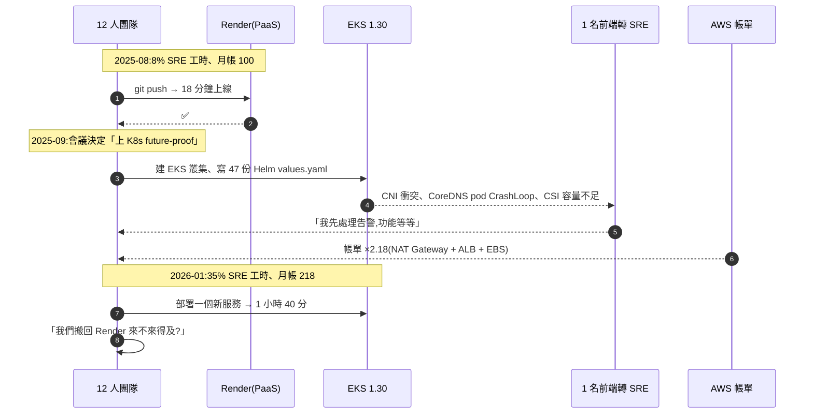
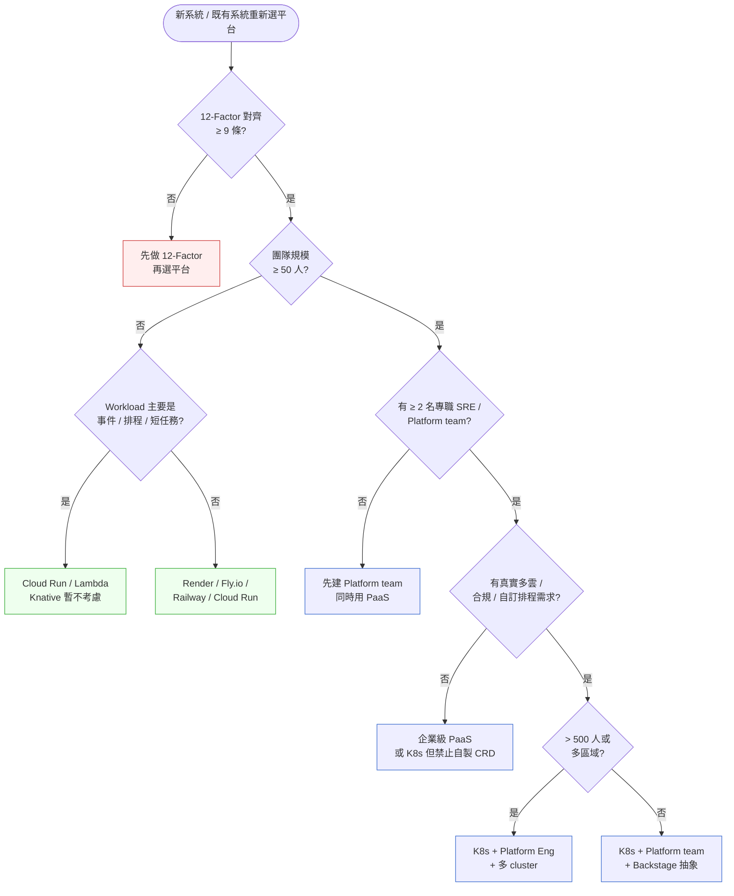
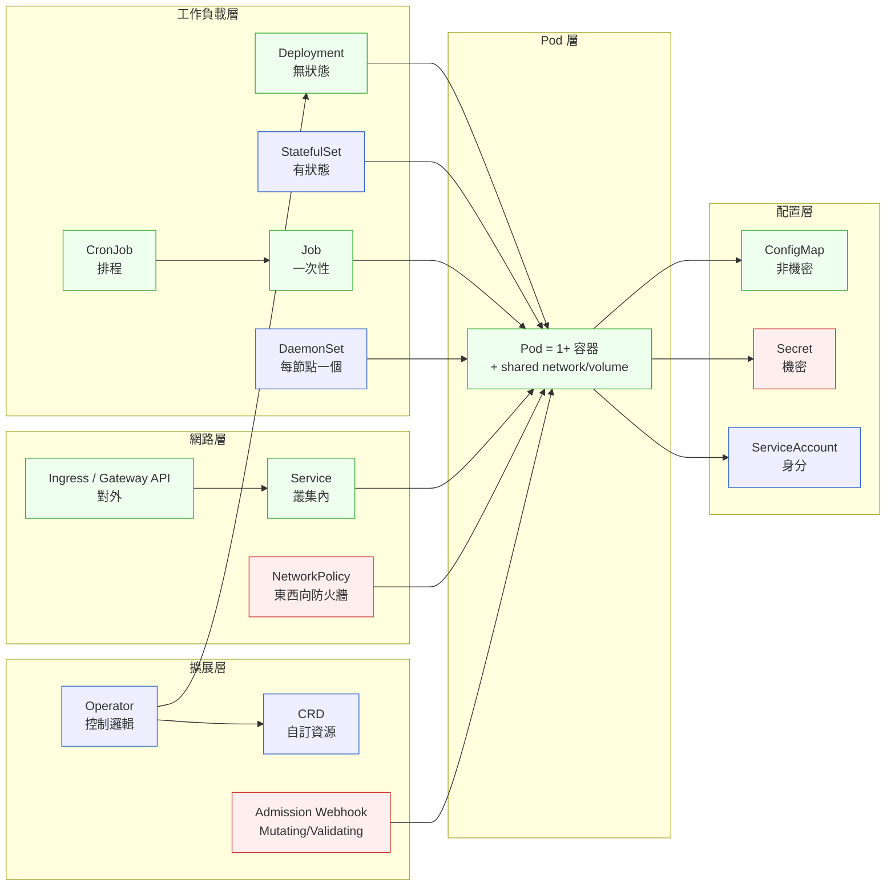

# 第 24 章|雲端原生架構與 Kubernetes
## ⸺ 不是用 K8s 就是雲端原生

> **前置閱讀**:[Ch 11 SOLID 與架構原則](../part-03-design/ch-11-architecture-principles.md)、[Ch 22 微服務拆分判準](./ch-22-microservices.md)
> **下游章節**:[Ch 25 Service Mesh / Cell-Based](./ch-25-service-mesh-cell-based.md)、[Ch 30 Observability](../part-05-quality/ch-29-observability-otel.md)、[Ch 32 Platform Engineering](../part-06-engineering/ch-32-platform-engineering-idp.md)
> **延伸補章**:無

---

## 24.1 冷觀察 ⸺ 12 個工程師、Kubernetes 1.30、SRE 工時 8% → 35%

我在 2026 年 1 月,陪一家虛構 B2B SaaS **TenantForge**(`CASE-SAS-005`)做技術回顧。產品是一套「給中小型 SaaS 公司用的多租戶權限與計費中台」,客戶 47 家、ARR 380 萬美元、工程團隊 12 人(含 1 位剛從前端轉後端的 SRE)。

2025 年 9 月,他們做了一個決定:把後端從 Render(他們已經跑了兩年的 PaaS)整批搬到自管 Kubernetes 1.30 on AWS EKS。理由寫在那次架構會議的紀錄上,我把它原樣記下來:

> 「我們要 future-proof。客戶在問我們有沒有跑在 K8s,我們不能說沒有。而且 Render 的免費 plan 取消了,既然要付錢,不如付給有未來性的東西。」

四個月後,他們的內部 dashboard 長這樣:

| 指標 | 2025-08(Render 時代) | 2026-01(K8s 1.30 時代) |
|---|---|---|
| 部署一個新服務從 PR 到 prod | 18 分鐘 | 1 小時 40 分(含 Helm chart review) |
| SRE 工時佔總工程工時 | 8% | 35% |
| 月度雲端帳單(基準=100) | 100 | 218 |
| 月度 P0/P1 事件 | 1.2 件 | 4.7 件(多為 K8s 自身議題:CNI / CSI / kubelet OOM) |
| Pod Security Standards 套用 | 不適用 | 「下個 sprint」(已連續四個 sprint) |
| 真正的「跨雲遷移」次數 | 0 | 0 |

雷射筆停在最後一格。沒有人講話。負責那次遷移決策的 CTO 在那場回顧裡講了一句話:

> 「我們花 35% 工時在維運一個我們從來沒有真正『跨雲』過的 K8s 叢集,只為了滿足 0 個現在問我們的客戶。」

把這四個月的演化壓成一張時序圖,大概長這樣:



事情的根本問題,從來不是 K8s 不好。問題是 TenantForge 在 12 個工程師、沒有 Platform team、沒有專職 SRE、沒有任何客戶要求「跨雲部署」的情況下,**用拓樸決策替代了商業判斷**。他們在解決一個未來可能會出現、但現在還沒出現的問題,代價是現在每個工程師每天少寫 1.5 小時的功能。

CNCF 自己 2024 年的 Annual Survey [^CIT-230] 就寫過一句被引用很多次的話:K8s 採用率達 89%,但「**完全自管 K8s 的組織中,有 47% 表示他們的 Platform team 規模不足以維運該叢集**」。TenantForge 落在那 47% 裡 ⸺ 而且他們連一個 Platform team 都還沒成立。

---

## 24.2 真問題 ⸺ 雲端原生 ≠ 用 K8s

「我們要不要上 K8s?」這個問題,從 2018 年問到 2026 年。把它拆開來看會比較清楚:**這個問題本身把兩件事偷偷綁在一起了**。一件是「要不要走雲端原生」,一件是「要不要用 K8s 當執行平台」。前者是架構選擇,後者是拓樸選擇。把它們一起問,答案就會被 K8s 這個工具拉著跑。

### 24.2.1 CNCF 對「雲端原生」的定義不是 K8s

回到原典。CNCF 在 *Cloud Native Definition v1.1* [^CIT-231] 寫的版本是:

> 「雲端原生技術讓組織能在現代化的、動態的環境中(公有雲、私有雲、混合雲)構建並執行可擴展的應用。容器、Service Mesh、Microservices、不可變基礎設施、宣告式 API 是這類方法的代表。」

這段話裡沒有一次出現 *Kubernetes*。Kubernetes 是這份定義的「實作之一」,不是定義本身。雲端原生的核心特徵被 12-Factor App [^CIT-232] 寫得更早:**配置外置、無狀態進程、宣告式啟動、Dev/Prod Parity、disposability**。一個服務只要這 12 條對齊到 9 條以上,跑在 Render、Fly.io、Cloud Run、AWS Lambda、Heroku、自管 K8s 上,**它都是雲端原生的**。

換句話說,雲端原生是一個「應用怎麼設計」的問題;K8s 是一個「應用怎麼執行」的問題。前者是 SA/SD 的工作,後者是 Platform Engineering 的工作。這兩件事被混在一起,是 TenantForge 那場戲的根。

### 24.2.2 K8s 是工具,不是目的

把幾個 2025–2026 的訊號並排:

| 來源 | 年份 | 核心訊號 |
|---|---|---|
| CNCF Annual Survey [^CIT-230] | 2024 | K8s 採用率 89%,但 47% 自管組織坦承 Platform team 不足 |
| Charity Majors, "K8s is not for everyone" [^CIT-233] | 2023+ 多次重訪 | 「< 50 人公司上 K8s 是繳給 CNCF 的智商稅」 |
| Render 公開定價變動 [^CIT-234] | 2025 | 取消免費 plan 但提供原生多租戶隔離與 Postgres High Availability |
| Fly.io Architecture Blog [^CIT-235] | 2024–2025 | 提供「在 Anycast 上跑 Docker 容器」+ Volumes,跳過 K8s 抽象 |
| Railway / Vercel / Cloud Run | 持續 | PaaS 復興,主打「12-Factor App 直接跑」而非「K8s 抽象」 |
| Sid Palas, "Why I Hate Kubernetes" / 多位 SRE 公開貼 | 2024–2026 | 一致的訊號:K8s 設計給「成千上萬個 workload」,不是給「47 個 workload」 |

訊號的方向不是「K8s 過時」,**是「K8s 的適用區間被重新校正」**。2018–2022 那波「不上 K8s 不專業」的迷思被新一代 PaaS 的成熟給逆轉:Render 跟 Fly.io 把 80% 的 K8s 好處用 20% 的複雜度實現了,而那 20% 的好處(自訂 CRD、自訂排程、跨雲同一份 manifest)只有少數團隊真的會用到。

把這件事拆開來看,K8s 提供的價值大致是七層:

1. 容器編排(排程、重啟、擴縮)
2. 服務發現與負載均衡
3. 宣告式狀態管理
4. 可移植性(理論上跨雲)
5. 自訂資源(CRD)+ Operator 模式
6. 完整生態系(Helm / ArgoCD / Istio / Knative)
7. 「履歷加分」的招募信號

PaaS(Render / Fly.io / Railway / Cloud Run)解決了 1、2、3,而且解得比 K8s 簡單。**4 是個迷思** ⸺ 真的跨雲遷移過的組織少於 5%,因為跨雲的成本不在 K8s manifest,在資料庫、IAM、network、監控管線。**5 跟 6 是 K8s 的真本事** ⸺ 但需要 Platform team 才用得起來。**7 不是技術理由**,但 2026 年仍在很多會議室裡決策。

TenantForge 真正需要的是 1、2、3,可能加一點點 4 的安心感。他們上了 K8s,實際只用到 1、2、3,卻付了 5、6、7 的成本。

### 24.2.3 團隊規模門檻:50 / 500 兩道線

把 2024–2026 觀察到的合理路線壓成一條光譜:

| 團隊規模 | 預設執行平台 | 為什麼 |
|---|---|---|
| **< 50 人 / 不可逆性低** | PaaS(Render / Fly.io / Railway / Cloud Run) | 12-Factor 直接跑,沒有 Platform 稅;K8s 帶來的好處用不到 5% |
| **50–500 人 / 多產品線** | 自管 K8s + Platform team(Backstage / 內部 PaaS 抽象) | 開始有「跨團隊基礎設施重複」問題,K8s 的 CRD + Operator 才有價值 |
| **> 500 人 / 多區域多雲** | K8s + 自建 control plane / 多 cluster federation | 此時 K8s 的可移植性才會被真正使用,且需要 30+ 人專職 Platform |

兩道線分別是 50 跟 500,但這不是拍腦袋的經驗法則 ⸺ 背後有兩條各自可以計算的拐點邏輯。

**50 人線:Platform team 的 ROI 拐點**

在 50 人以下,基礎設施的重複成本還沒高過 K8s 的學習與維運成本。一個典型的 30 人 SaaS 團隊可能有五支 feature team,每支 6 人;logging、secrets、metrics 的方案由各 team 自己搞定,加起來每人每週頂多浪費 1 小時 ⸺ 折算成 SRE 工時大概 2–4%,跟 PaaS 的「平台稅金」差不多,沒有明顯痛點。

規模到 50 人左右時,兩件事同時發生:

1. **基礎設施重複成本開始超線性增長**:五支以上的 feature team 各自維護一套 logging pipeline、secrets rotation、metrics exporter,複製貼上的設定差異開始釀成事故。這時共用一套 K8s 基礎並由 Platform team 維護成本已低於各自維護。
2. **Platform team 的 ROI 開始為正**:假設 50 人裡組一個 4 人 Platform team(佔 8% 工程人力)。這 4 人把 K8s 維運、Helm 抽象、GitOps 管線統一做好,讓其餘 46 人(8–10 支 feature team)的 SRE 工時從平均 15% 降到 5%。省下的 (15% − 5%) × 46 人 = 4.6 人工,恰好覆蓋那 4 人 Platform team 的成本。換句話說,**Platform team 讓整體 K8s 稅金從分散的 15% 收斂到集中的 8%,並且持續遞減**。對比 PaaS 的 3–5% 平台稅,差距縮到值得換取 K8s 帶來的靈活性。

相反地,在 12 人的 TenantForge,根本無法組出這個 4 人 Platform team ⸺ 養一個專職 Platform 工程師就是 8% 人力,換來的只是稍微整齊一點的 Helm chart,K8s ROI 是負的。這就是 35% SRE 工時的根源:把 Platform team 的成本(K8s 維運)壓在 feature team 上,卻沒有 Platform team 帶來的規模效益。

**500 人線:多叢集 federation 的必要性拐點**

500 人以上的組織通常已有多個獨立事業單位或多區域佈點,這時開始出現 K8s control plane 本身不夠用的場景:合規要求資料落地在特定區域、不同事業單位需要獨立的 audit log、同一叢集的 blast radius 太大。這才是多叢集 federation 與自建 control plane 的真實觸發條件 ⸺ 而不是「我們在多個雲上跑了一些 workload」。

**TenantForge 12 人,這條線清清楚楚**。50 以下,PaaS 預設;50–500,K8s + Platform Engineering(Ch 32 詳述);500 以上,才考慮自建 control plane。

「但客戶在問我們有沒有跑在 K8s」這句話 ⸺ 在 2026 年的 B2B SaaS 採購流程裡,實際被認真當合規條款的比例,落在 RFP 第 47 個欄位的「資安問卷」附近。被認真檢查的是 SOC 2、ISO 27001、資料駐留、加密金鑰管理。「是否跑在 K8s」幾乎只在新創 founder 之間互相詢問,客戶不在乎。這是 § 23.4 第一條反模式要處理的事。

---

## 24.3 決策框架 ⸺ 部署平台選擇、K8s 採用四維、GitOps 節奏

下面這幾張表跟一張決策樹,在現場相當好用。前提是先回答兩件事:**你的應用是不是雲端原生的(12-Factor 對齊度)**、**你的團隊有沒有 Platform 能力**。這兩件事不是同一件,但常被一起決定。

### 24.3.1 部署平台選擇表

把 2026 年常見的部署選項並排,差異不在「現代不現代」,在「平台稅金」與「上限」:

| 維度 | PaaS(Render/Fly.io/Railway) | Cloud Run / Lambda(Serverless) | 自管 K8s(EKS/GKE/AKS) | K8s + Knative | wasmCloud / SpinKube |
|---|---|---|---|---|---|
| **適合團隊規模** | < 50 人 | 任何規模(workload 受限) | 50–500 人,有 Platform | 50–500 人,事件密集 | 早期採用者 / 邊緣 |
| **首次上線時間** | 數小時 | 1–2 天 | 4–12 週 | 6–16 週 | 不確定 |
| **平台稅金(SRE 工時 %)** | 2–5% | 3–8% | 15–35% | 20–40% | 不確定 |
| **可移植性** | 中(支援 Docker = 可搬) | 低(供應商鎖定) | 高(理論) | 高(Knative 規範) | 高(WASI 規範) |
| **自訂排程 / CRD** | ❌ | ❌ | ✅ | ✅ | 部分 |
| **Stateful workload** | 中(有 Volumes) | ❌ | ✅(StatefulSet) | ❌ | ❌ |
| **冷啟動** | 無 | 100ms–1s | 無(常駐) | 100ms–500ms | < 10ms |
| **2026 真實適用** | 多數 SaaS、內部工具 | 排程任務、Webhook、AI 推論 | 大團隊、多產品線 | 事件驅動、訊號處理 | 邊緣計算 / 多租戶函式 |

選哪一個不是這節的重點,**重點是「不要把雲端原生跟 K8s 畫等號」**。一個跑在 Render 上、12-Factor 對齊到 11 條的 SaaS,比一個跑在 K8s 上、12-Factor 只對到 6 條的 SaaS 雲端原生得多。

### 24.3.2 K8s 採用四維判準

要不要採用自管 K8s,可以用四個維度疊起來看。四個維度都通過,才值得上;任一個不通過,留在 PaaS 比上 K8s 便宜:

| 維度 | 通過門檻 | 觀察方式 | TenantForge 當時 |
|---|---|---|---|
| **規模(Scale)** | ≥ 50 工程師 / 多產品線 | 看 Platform 能不能複用 | 12 人,單產品 ❌ |
| **SRE 能力(Capability)** | ≥ 2 名專職 SRE 或 Platform team | 看是不是有人能凌晨三點接告警 | 1 名前端轉 SRE ❌ |
| **多雲需求(Portability)** | 客戶合約有跨雲條款 / 監管要求 | 看 RFP / 合規文件 | 0 客戶要求 ❌ |
| **合規(Compliance)** | 需要 air-gapped / 自管 control plane | 看是否服務政府 / 金融 / 醫療 | SOC 2 即可,Cloud Run 也能過 ❌ |

四個都通過才值得上。TenantForge 當時四個都沒過 ⸺ 那是他們 35% SRE 工時的代價。

### 24.3.3 部署平台選擇決策樹

下面這張圖在現場用過好幾次。它的關鍵不是分支,是**預設值**:預設不上 K8s。要上,得四個維度都過,不能只是「客戶會問」。



這張圖把六個維度疊在一起。關鍵是:**前兩格(12-Factor + 50 人)沒過,根本不該進到 K8s 那條路徑**。TenantForge 在第二格就該轉去 PaaS,但他們直接跳到了 K8sLight。

### 24.3.4 K8s 物件依賴的最小心智模型

如果決策樹走到要上 K8s,最低限度要熟的物件,壓成一張依賴圖大概長這樣。**用 K8s 不只是「會寫 YAML」,是「知道這些物件之間的責任邊界」**:



這張圖的關鍵不是節點,是**顏色**。綠色(`Deployment` / `Service` / `Ingress` / `ConfigMap` / `Job` / `CronJob`)是 80% workload 都會用到的;藍色(`StatefulSet` / `DaemonSet` / `CRD` / `Operator`)是進階用法,沒有 Platform team 不該碰;紅色(`Secret` / `NetworkPolicy` / `Admission Webhook`)是不做就會出資安事件的。Pod Security Standards 也屬於紅色那層 ⸺ § 23.4 第四條反模式會回來談。

### 24.3.5 GitOps 工具對照表

決策樹走到 K8s 那條路徑後,GitOps 是接下來會問的事。把 ArgoCD / Flux / Helm / Kustomize 並排,差異在「抽象層次」與「組織模型」:

| 工具 | 角色 | 適合場景 | 2026 版本 |
|---|---|---|---|
| **Helm** | 模板 + 套件 | 第三方軟體安裝(Postgres / Kafka / Prometheus) | Helm 3.16 |
| **Kustomize** | 純 YAML overlay | 自家應用、不想學模板語法 | kubectl 1.30 內建 |
| **ArgoCD**(CNCF / Intuit) | 拉模式 GitOps + UI | 多 cluster、視覺化、應用組合複雜 | ArgoCD 2.13 |
| **Flux**(CNCF / Weaveworks) | 拉模式 GitOps + 自動 image 更新 | 自動化導向、不需要 UI | Flux 2.4 |
| **Crossplane**(CNCF) | 用 K8s 管雲端資源 | 整合 IaC + GitOps | Crossplane 1.18 |

GitOps 的採用節奏建議:**先 Kustomize 寫自家應用,再 Helm 裝第三方,再 ArgoCD 統一觀察與部署**。一次到位學三套會吃掉 SRE 兩個月工時。

### 24.3.6 程式碼長相:一份 12-Factor 對齊的 Deployment + Service

把 TenantForge 一個典型服務拉回來,寫成 K8s 1.30 + Pod Security Standards `restricted` + Service 的最小骨架,大概長這樣。**這份 YAML 故意寫得保守 ⸺ 沒有自訂 CRD、沒有 Operator,12-Factor 對齊的事都做了**:

```yaml
# tenant-billing-api/deployment.yaml
apiVersion: apps/v1
kind: Deployment
metadata:
  name: tenant-billing-api
  labels:
    app.kubernetes.io/name: tenant-billing-api
    app.kubernetes.io/version: "1.4.7"
spec:
  replicas: 3
  selector:
    matchLabels:
      app.kubernetes.io/name: tenant-billing-api
  strategy:
    type: RollingUpdate
    rollingUpdate:
      maxSurge: 1
      maxUnavailable: 0
  template:
    metadata:
      labels:
        app.kubernetes.io/name: tenant-billing-api
        app.kubernetes.io/version: "1.4.7"
    spec:
      # Pod Security Standards: restricted
      securityContext:
        runAsNonRoot: true
        runAsUser: 10001
        fsGroup: 10001
        seccompProfile:
          type: RuntimeDefault
      containers:
        - name: api
          image: ghcr.io/tenantforge/billing-api:1.4.7
          imagePullPolicy: IfNotPresent
          ports:
            - name: http
              containerPort: 8080
          # 12-Factor: III. Config — 全部從環境變數注入
          envFrom:
            - configMapRef:
                name: tenant-billing-config
            - secretRef:
                name: tenant-billing-secrets
          # 12-Factor: IX. Disposability
          lifecycle:
            preStop:
              exec:
                command: ["/bin/sh", "-c", "sleep 15"]   # 給 LB 移除時間
          # 健康檢查
          startupProbe:
            httpGet: { path: /healthz/start, port: http }
            failureThreshold: 30
            periodSeconds: 2
          readinessProbe:
            httpGet: { path: /healthz/ready, port: http }
            periodSeconds: 5
          livenessProbe:
            httpGet: { path: /healthz/live, port: http }
            periodSeconds: 10
          resources:
            requests: { cpu: "100m", memory: "256Mi" }
            limits:   { cpu: "500m", memory: "512Mi" }
          securityContext:
            allowPrivilegeEscalation: false
            readOnlyRootFilesystem: true
            capabilities:
              drop: ["ALL"]
---
apiVersion: v1
kind: Service
metadata:
  name: tenant-billing-api
spec:
  selector:
    app.kubernetes.io/name: tenant-billing-api
  ports:
    - name: http
      port: 80
      targetPort: http
```

對照組,一份 ArgoCD `Application` 把上面這個 Deployment 從 Git 拉到叢集,大致長這樣:

```yaml
# argocd/applications/tenant-billing-api.yaml
apiVersion: argoproj.io/v1alpha1
kind: Application
metadata:
  name: tenant-billing-api
  namespace: argocd
spec:
  project: tenantforge
  source:
    repoURL: https://github.com/tenantforge/k8s-manifests
    targetRevision: main
    path: apps/tenant-billing-api
  destination:
    server: https://kubernetes.default.svc
    namespace: billing
  syncPolicy:
    automated:
      prune: true
      selfHeal: true
    syncOptions:
      - CreateNamespace=true
      - PruneLast=true
```

兩段配合,GitOps 的精神就到位了:**Git 是 source of truth、ArgoCD 負責對齊、K8s 只是執行單位**。但要強調一件事:**寫得出這兩段不代表你準備好上 K8s ⸺ 準備好的訊號是 § 23.3.2 那四個維度都通過**。

---

## 24.4 踩坑清單

下面這四個常見地雷,在 SaaS、fintech、ecommerce 都看得到。它們的共同點是「形式上採用了雲端原生 / K8s,但實質上沒有對齊 12-Factor 或團隊能力」。每一個都附修正方向,下次遇到可以這樣處理。

### 反模式 1:小團隊跳 K8s(沒有專職 SRE 也沒有 Platform team)

12 人的團隊,沒有專職 SRE,沒有 Platform team,只因為「客戶會問」或「履歷加分」就上自管 K8s。三個月後,SRE 工時佔比從 8% 飆到 35%,新功能交付速度砍半,雲端帳單翻倍(NAT Gateway、ALB、EBS、跨 AZ 流量)。CNCF Annual Survey [^CIT-230] 那 47% 的數字裡,絕大多數是這類組織。

> ✅ **修正方向**:用 § 23.3.2 那張四維表先做自我體檢,**四個維度任一個沒通過就不該上 K8s**。預設留在 PaaS(Render / Fly.io / Railway / Cloud Run),把節省下來的 30% 工時拿去做 12-Factor 對齊與 Observability 基礎。如果未來真的長到 50 人、有真實多雲合規需求,再上 K8s 也只是 4–8 週的搬遷工作。**先停損,再評估** ⸺ TenantForge 後來的選擇是把無狀態 API 搬回 Cloud Run、有狀態服務留在 K8s,SRE 工時降回 12%。

### 反模式 2:Helm chart 寫成 K8s YAML 巨型樣板(沒有抽象)

宣稱用 Helm 做模板化,但每個服務的 chart 是「把所有 K8s 物件原樣複製一份,只把 image tag 變數化」。47 個服務有 47 份幾乎一模一樣的 Helm chart,每份 800–1200 行 YAML。改一條最佳實踐(例如加一個 `securityContext` 欄位),要改 47 個地方。Helm 的價值 ⸺ 抽象、復用、社群套件 ⸺ 完全沒有發揮。

> ✅ **修正方向**:**Helm chart 應該是「應用的形狀」,不是「YAML 檔的搬運工」**。最低劑量:寫一個內部 base chart(或用 [helm-charts/common](https://github.com/bitnami/charts) 之類的社群基底)定義公司的部署模式,個別服務用 `values.yaml` 只覆寫差異(image、resources、env)。判準:**個別服務的 Helm chart 應該 < 100 行**;若每個服務都超過 300 行,通常是抽象沒做。或者乾脆別用 Helm,改用 Kustomize overlay,寫起來更直觀。

### 反模式 3:StatefulSet 跑生產 DB(忽略運維複雜度)

「K8s 也能跑資料庫!」於是把 PostgreSQL 17、MongoDB、Kafka 全用 StatefulSet 自管在 K8s 叢集裡,理由是「跨雲一致」。實際上,自管 PG StatefulSet 需要做的事包括:備份策略(pgBackRest)、PITR、Failover(Patroni / Stolon / CloudNativePG operator)、connection pooling(PgBouncer)、版本升級節奏、儲存類別(EBS gp3 vs io2)、跨 AZ 複製。三個月後資料丟了一次,原因是 PVC 配置 `reclaimPolicy: Delete`,叢集重建時 EBS 一起被刪。

> ✅ **修正方向**:**有狀態 workload 留在雲端託管服務**(RDS / Aurora / Cloud SQL / MongoDB Atlas / Confluent Cloud),除非有 Platform team 加上專職 DBA。這不是「不夠雲端原生」,是「把運維複雜度交給有規模做這件事的單位」。判準:除非團隊有人能在凌晨三點手動處理 Patroni split-brain,否則生產 DB 不該跑在自管 K8s 上。CloudNativePG / Strimzi 這類 Operator 在 50–500 人的組織開始有意義;在 12 人團隊是純粹的負債。

### 反模式 4:沒做 Pod Security Standards 就上線(2024+ 棄用 PSP 後仍套舊習慣)

K8s 1.25(2022)正式移除 PodSecurityPolicy(PSP),改用 Pod Security Standards [^CIT-236] 三檔(`privileged` / `baseline` / `restricted`)+ Pod Security Admission(PSA)做 namespace 級別強制。但很多 2024–2026 才上 K8s 的團隊,要嘛把 namespace 留在預設(等同 `privileged`),要嘛還在套 PSP 的舊心智模型,結果生產環境跑著一堆 `runAsRoot: true`、`allowPrivilegeEscalation: true`、有 `CAP_SYS_ADMIN` 的容器,SOC 2 稽核員一看 namespace label 就知道沒做。TenantForge 那連續四個 sprint 的「下個 sprint 處理」就是這個。

> ✅ **修正方向**:**新建 namespace 一律加上 PSA label**,production 用 `restricted`,開發環境最低 `baseline`。範例:`kubectl label namespace billing pod-security.kubernetes.io/enforce=restricted pod-security.kubernetes.io/enforce-version=v1.30`。對應的 Pod 規格(`runAsNonRoot`、`readOnlyRootFilesystem`、`allowPrivilegeEscalation: false`、`drop: [ALL]`)寫進 base Helm chart,違規由 PSA 在 admission 時擋下。判準:**沒有 PSA enforce 的 namespace 不能上 production**;這條規則寫進 ArgoCD 的 sync hook 或 OPA Gatekeeper / Kyverno 的 policy。Kyverno 2026 內建 `restricted` 模板,套用成本是一個下午。

---

## 24.5 交付清單 ⸺ 一頁式 Cloud-Native Choice Card

每一個服務 / 每一條產品線,**在選定部署平台之前都該過一次 Cloud-Native Choice Card**。它不是文件,是決策的化石 ⸺ 跟 ADR 配套使用,寫不滿一頁就是還沒想清楚。

把它存在 `docs/platform/<service>-cloud-native-choice.md`,跟 ADR 同層、跟服務 repo 同 PR 更新。

````markdown
# Cloud-Native Choice Card — {服務 / 產品線名稱}

> 版本:v0.1 | 撰寫日期:YYYY-MM-DD | Owner:{team / person}
> 對應 ADR:`docs/adr/00NN-platform-choice.md`

## 1. Team Profile(團隊體檢)
- 工程師人數:____(< 50 / 50–500 / > 500)
- 專職 SRE / Platform 人數:____
- 是否能處理凌晨三點告警:☐ 是 / ☐ 否
- 是否服務金融 / 醫療 / 政府 / 軍工:☐ 是 / ☐ 否

## 2. Workload Profile(工作負載體檢)
- 主要型態:☐ 長駐 API / ☐ 事件驅動 / ☐ 排程任務 / ☐ Stateful
- 高峰 QPS / 平常 QPS:____ / ____
- 主要瓶頸:☐ CPU / ☐ Memory / ☐ I/O / ☐ Network
- 是否需要自訂排程 / CRD:☐ 是(具體用途:____) / ☐ 否

## 3. Platform Tax Estimate(平台稅金估算)
| 平台選項 | 預估 SRE 工時 % | 預估月帳(基準=100) | 上線前置時間 |
|---|---|---|---|
| Render / Fly.io | | | |
| Cloud Run / Lambda | | | |
| 自管 K8s | | | |

## 4. 12-Factor Alignment(對齊狀態)
| # | 因子 | 對齊 | 備註 |
|---|---|---|---|
| I | Codebase(一份原始碼,多份部署) | ☐ | |
| II | Dependencies(顯式宣告) | ☐ | |
| III | Config(從環境變數讀) | ☐ | |
| IV | Backing Services(可替換) | ☐ | |
| V | Build, Release, Run(嚴格分離) | ☐ | |
| VI | Processes(無狀態) | ☐ | |
| VII | Port Binding | ☐ | |
| VIII | Concurrency(水平擴展) | ☐ | |
| IX | Disposability(快啟快停) | ☐ | |
| X | Dev/Prod Parity | ☐ | |
| XI | Logs(stdout/stderr 串流) | ☐ | |
| XII | Admin Processes | ☐ | |
- 對齊條數:____ / 12(< 9 條時不應上 K8s,先補對齊)

## 5. K8s 採用四維(若選 K8s 才填)
| 維度 | 通過 | 證據 |
|---|---|---|
| 規模 ≥ 50 人 / 多產品線 | ☐ | |
| ≥ 2 名專職 SRE / Platform | ☐ | |
| 真實多雲 / 合規需求 | ☐ | |
| 自訂 CRD / 排程需求 | ☐ | |
- 結論:☐ 四維皆過(可上 K8s) / ☐ 有未通過(留在 PaaS / Serverless)

## 6. Decision(本次選擇)
- 平台:____________
- 主要理由(三點):
  1. 
  2. 
  3. 
- 退場策略:若 ____ 條件成立,將遷移至 ____,預估遷移成本 ____ 工時

## 7. Owner & Review Cadence
- Owner:____(也是出事時的第一接收人)
- 每 ____ 個月檢視一次此 card 是否仍然成立
- 觸發重評估的訊號(任一即觸發):
  - [ ] 團隊 ≥ 50 人
  - [ ] SRE 工時 > 20%
  - [ ] 出現真實多雲合規需求
  - [ ] 平台供應商重大價格變動
````

**為什麼是一頁?** 一頁的篇幅會逼出「這個服務到底為什麼選這個平台」。寫不出 § 6 的三點理由,通常意思是「客戶會問」或「履歷加分」是真實理由,但這兩者不是工程理由。

**為什麼有「退場策略」那一格?** 平台選擇不是婚姻,是租賃。每個選擇都該有退場路徑寫在當下,半年後才不會「我們騎虎難下」。TenantForge 後來把無狀態 API 搬回 Cloud Run,就是因為當初沒寫退場策略,所以發生事故時花了三週才決定要怎麼搬。

**為什麼把 12-Factor Alignment 跟 K8s 採用四維分開?** 因為 12-Factor 是應用設計問題,K8s 是執行平台問題。前者沒對齊就上 K8s,等於把一個有結構性問題的應用丟到一個複雜的環境裡 ⸺ 兩個問題會互相放大。先做應用,再選平台,順序不能反。

### 24.5.1 範例:TenantForge 把無狀態 API 搬回 Cloud Run 那張卡

35% SRE 工時的事故覆盤後,TenantForge 沒有立刻全砍,而是先把每個服務拆出一張 Choice Card。下面這張是他們第一個被搬回 Cloud Run 的服務 ⸺ `tenant-billing-api`。當時上 K8s 的決定是「客戶會問」,這張卡逼他們把那句話拆成三點理由,結果寫不出第二點:

````markdown
# Cloud-Native Choice Card — tenant-billing-api(無狀態計費 API)

> 版本:v0.1 | 撰寫日期:2026-02-04 | Owner:Backend Lead 周
> 對應 ADR:`docs/adr/0089-billing-api-back-to-cloud-run.md`

## 1. Team Profile
<!-- 為什麼這欄:寫不出「凌晨三點接電話的人」,就是 K8s 採用四維過不了的訊號;
     2025-09 那次決策刻意跳過這欄,代價是 35% 工時。 -->
- 工程師人數:12(< 50)
- 專職 SRE / Platform 人數:1(前端轉任,半年資歷)
- 是否能處理凌晨三點告警:☐ 是 ☒ 否(目前由 Backend Lead 兼)
- 是否服務金融 / 醫療 / 政府 / 軍工:☐ 是 ☒ 否(SOC 2 Type II,Cloud Run 已合規)

## 2. Workload Profile
- 主要型態:☒ 長駐 API ☐ 事件 ☐ 排程 ☐ Stateful
- 高峰 / 平常 QPS:280 / 95
- 主要瓶頸:☒ Memory(Spring Boot 啟動約 380MB) ☐ 其他
- 自訂排程 / CRD:☐ 是 ☒ 否

## 3. Platform Tax Estimate
| 平台 | SRE 工時 % | 月帳(基準=100) | 上線前置 |
|---|---|---|---|
| Cloud Run | 3% | 42 | 1 天 |
| Render | 4% | 38 | 半天 |
| 自管 EKS(現況) | 35% | 218 | 已上線 |

## 4. 12-Factor Alignment
<!-- 為什麼這欄:對齊到 11/12 才有資格上 K8s;TenantForge 之前對齊只 9 條,
     兩個問題互相放大才會在第三個月炸掉。 -->
- 對齊條數:11 / 12(Admin Processes 還沒外置,目前 ssh 進去手動跑)
- 結論:對齊度足夠,**問題在平台選錯,不在應用設計**

## 5. K8s 採用四維
| 維度 | 通過 | 證據 |
|---|---|---|
| 規模 ≥ 50 人 / 多產品線 | ☐ | 12 人,單產品線 |
| ≥ 2 名專職 SRE / Platform | ☐ | 0.5 名(兼任) |
| 真實多雲 / 合規需求 | ☐ | 0 客戶要求 |
| 自訂 CRD / 排程需求 | ☐ | 無 |
- 結論:☐ 四維皆過 ☒ 有未通過 → **遷回 Cloud Run**

## 6. Decision
<!-- 為什麼這欄:逼自己寫三點工程理由,不是「客戶會問」或「履歷加分」;
     寫不出第二點時就該回頭。 -->
- 平台:Google Cloud Run(Gen2,自動 scale to 0)
- 主要理由:
  1. 12 人團隊養不起 K8s control plane,SRE 工時 35% 是不可持續的稅
  2. workload 是長駐 API + 偶發排程,Cloud Run 的 cold start 200ms 在 SLO 內
  3. 退場成本低 ⸺ 容器映像不變,只是換 runtime
- 退場策略:若客戶數 ≥ 200 且簽約要求多雲,評估 Cloud Run + 區域備援;
  ≥ 50 工程師且簽下首個合規多雲合約,才回頭評估 K8s

## 7. Owner & Review Cadence
<!-- 為什麼這欄:每季拉出來看,觸發訊號出現就重評估,不會被「以前的決定」拖著走。 -->
- Owner:Backend Lead 周
- 每 3 個月檢視一次
- 觸發重評估訊號:
  - [ ] 團隊 ≥ 50 人
  - [ ] SRE 工時 > 20%(三個月內)
  - [ ] 真實多雲合規需求
  - [ ] Cloud Run 重大價格變動
````

把這張卡填到「四維皆未通過」那一格,**遷回 Cloud Run 的決定就不再需要說服任何人** ⸺ 證據已經自己列出來了。SRE 工時降回 12%、月帳降到 96 那一週,團隊把這張卡與 2025-09 的會議紀錄並列,釘在工程牆上提醒「下次有人說『客戶會問』,先把卡拿出來填」。

---

## 24.6 本章交付清單 Recap

讀完本章,你應該已經能做到:

- [ ] 講清楚「雲端原生 ≠ K8s」⸺ CNCF 定義裡 K8s 是實作之一,不是定義本身;12-Factor 對齊度才是雲端原生的核心訊號
- [ ] 用 § 23.3.2 的四維判準回答「我們團隊該不該上 K8s」⸺ 規模、SRE 能力、多雲需求、合規,四個都通過才上
- [ ] 在會議上分得清四個反模式的修正方向 ⸺ 特別是「小團隊上 K8s」與「StatefulSet 跑生產 DB」兩條最常見
- [ ] 為手上的服務寫一張 Cloud-Native Choice Card,把平台選擇與退場策略一起寫進去

四項中先挑一項做完就好,建議從最後那一項 ⸺ 把目前主系統的部署平台選擇拉出來填一張 Cloud-Native Choice Card,**填不出 § 6 三點理由的服務,就是下一輪該重新評估部署平台的對象**。本書 Ch 25 會接著談 Service Mesh / Cell-Based 架構(在你 K8s 確實該上、且需要更精細的東西向治理時再讀),Ch 30 會把 Observability 這層補齊,Ch 32 會把「50–500 人組織為什麼需要 Platform Engineering」展開,在 K8s 採用之後讀最有感。

---

## Cross-References

- **回顧**:[Ch 11 SOLID 與架構原則](../part-03-design/ch-11-architecture-principles.md) ⸺ 12-Factor 是雲端時代的 SOLID 延伸;[Ch 22 微服務拆分判準](./ch-22-microservices.md) ⸺ 拆服務的判準與選平台的判準是兩件事
- **下一章**:[Ch 25 Service Mesh / Cell-Based](./ch-25-service-mesh-cell-based.md) ⸺ K8s 之上的東西向治理
- **Observability 完整版**:[Ch 30 Observability](../part-05-quality/ch-29-observability-otel.md)
- **Platform Engineering 詳述**:[Ch 32 Platform Engineering](../part-06-engineering/ch-32-platform-engineering-idp.md) ⸺ 50–500 人組織為什麼需要 Platform team

## 引用

[^CIT-230]: CNCF Annual Survey 2024 — cncf.io/reports/cncf-annual-survey-2024/。Kubernetes 採用率 89%;47% 自管組織坦承 Platform team 不足。
[^CIT-231]: CNCF Cloud Native Definition v1.1 — github.com/cncf/toc/blob/main/DEFINITION.md。容器、Service Mesh、Microservices、不可變基礎設施、宣告式 API。
[^CIT-232]: Adam Wiggins, "The Twelve-Factor App" (Heroku, 2011) — 12factor.net。雲端原生應用 12 條原則。
[^CIT-233]: Charity Majors, "Kubernetes Is Not For Everyone" — honeycomb.io / Twitter / 多次重訪 (2023+)。
[^CIT-234]: Render Pricing Update (2025) — render.com/pricing。免費 plan 政策變動;原生多租戶隔離與 Postgres HA。
[^CIT-235]: Fly.io Architecture Blog — fly.io/blog (2024–2025)。Anycast + Docker + Volumes 的 K8s 替代。
[^CIT-236]: Kubernetes Pod Security Standards — kubernetes.io/docs/concepts/security/pod-security-standards/。1.25 起取代 PodSecurityPolicy。
[^CIT-237]: Kubernetes 1.30 / 1.31 Release Notes — kubernetes.io/releases/。
[^CIT-238]: Argo CD Documentation — argo-cd.readthedocs.io (v2.13, 2026)。
[^CIT-239]: Knative Documentation — knative.dev/docs。Serverless on K8s 規範;wasmCloud / SpinKube 為 2026 邊緣替代方案。

---
