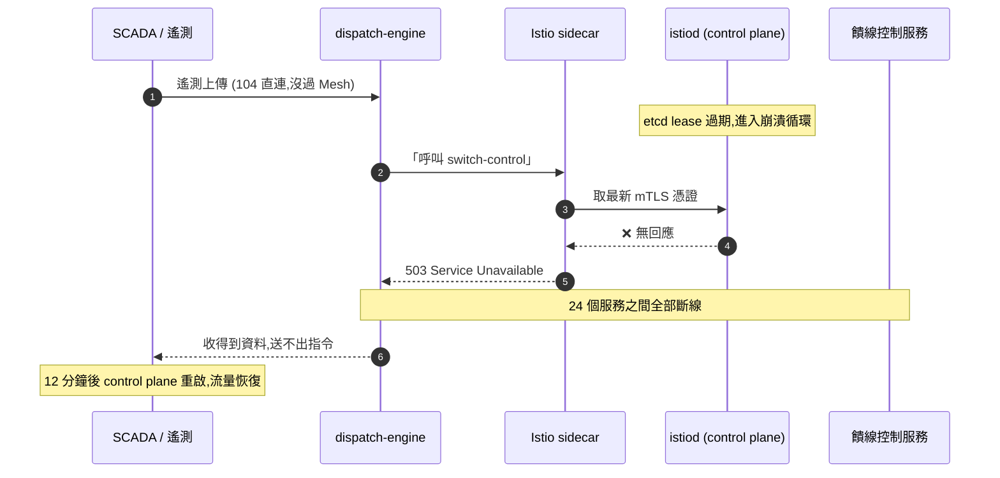
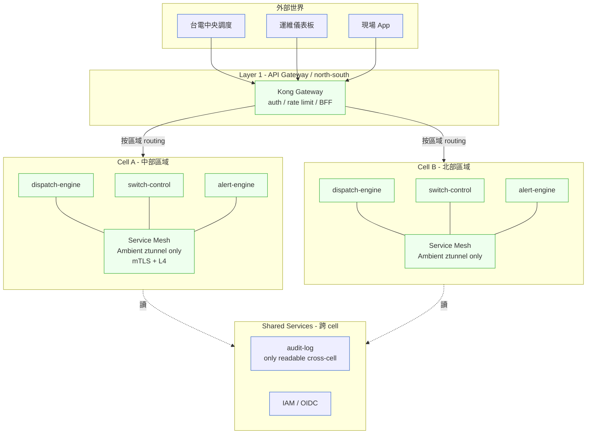
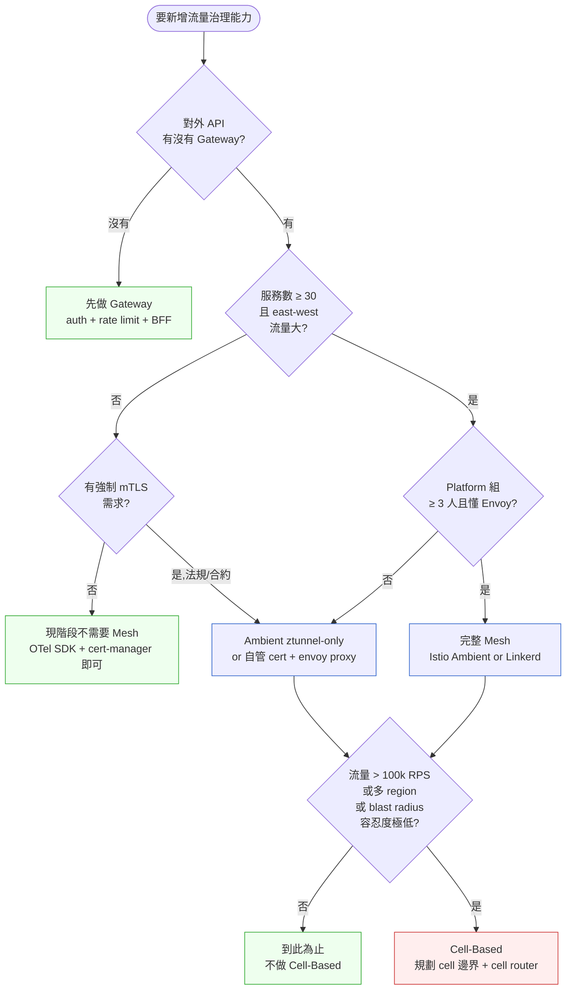

# 第 25 章|Service Mesh、API Gateway、Cell-Based
## ⸺ 三層流量治理該怎麼分

> **前置閱讀**:[Ch 22 微服務拆分判準](./ch-22-microservices.md)、[Ch 24 Kubernetes 與容器調度](./ch-24-cloud-native-kubernetes.md)
> **下游章節**:[Ch 27 Security by Design](../part-05-quality/ch-27-security-by-design.md)、[Ch 29 可觀測性](../part-05-quality/ch-29-observability-otel.md)
> **延伸補章**:[Ch 26 邊緣計算與 OT/IT 融合](./ch-26-edge-ot-it.md)(緊接本章後)

---

## 25.1 冷觀察 ⸺ 12 分鐘讓整個調度卡死的那次

我在 2025 年第四季,跟過虛構電網調度公司 **GridPulse Energy**(`CASE-ENR-004`)一場事故覆盤。他們做的是台灣中部六個變電所、四十二個饋線開關、十一座工商儲能站的二級調度系統,介於台電中央調度與場域 RTU(Remote Terminal Unit)之間,跑 IEC 61850 MMS 上傳遙測、IEC 60870-5-104 下傳開關指令,SCADA 那一層之上再疊一個 EMS(Energy Management System)做 dispatch 排程。

事故發生在 03:14。一通 PagerDuty 把 SRE 從床上叫起來:整個 EMS 的 24 個內部服務,**沒有一個能呼叫到另一個**。所有 east-west 流量瞬間歸零。dispatch 引擎收得到 SCADA 的遙測,但發不出指令到饋線控制服務;備援切換引擎收到「主站失聯」的訊號,但呼叫不到狀態查詢服務確認真假;告警引擎自己也呼叫不到通知服務,所以 PagerDuty 那通電話是工程師親眼看到 Grafana 紅了才打的,不是系統打的。

這場戲持續了 12 分鐘。台電中央調度線打進來問「你們那邊怎麼一動都不動」的時候,GridPulse 的工程主管才在白板上寫下事故的真正原因 ⸺ Istio 的 `istiod`(control plane)那個 Pod 因為 etcd 的一個 lease 過期沒續上,進入崩潰循環。Istio 1.20 的 sidecar 在 control plane 失聯後會 fail-closed,所有 mTLS 握手停掉,於是 24 個服務之間斷成 24 個孤島。

事故覆盤會議室那塊白板,工程主管最後寫了一句話,我把它原樣記下來:

> 「我們上 Mesh 是為了『服務之間要 mTLS』⸺ 結果 mTLS 真的關起來了,把整個調度也關起來了。」

後來他們翻 audit log,發現一個更難堪的細節:那個 lease 過期不是第一次,是過去六個月第三次。前兩次發生在凌晨,sidecar cache 還沒過期、流量低、沒人發現。第三次因為剛好夜班 dispatch 引擎正在跑「夜間電價套利調度」,工商儲能站的充放電指令需要在 60 秒內送出,卡住的代價就立刻顯影。

把這場事故壓成一張時序圖,大概長這樣:



把這場事故拆開看,問題的形狀就比較清楚了。GridPulse 不是「不該上 Mesh」⸺ 24 個服務之間 mTLS 是合理需求,IEC 62443 工控資安規範也確實要求服務間身份驗證。問題是他們**把 Mesh 放進了 critical path**,而 Mesh 的 control plane 不該是 critical path。Istio 的設計者(包括 Lyft 那篇 Envoy 原始 paper [^CIT-244])反覆強調過 data plane / control plane 分離的設計意圖,但「上 Mesh」這個動作在多數團隊的實務中,等於「control plane 一掛、整個系統一起掛」。

更深一層的問題是:GridPulse 在 2024 年上 Istio 的時候,團隊只有 24 個服務、9 個工程師、1 個 SRE。決策的會議紀錄寫著「為了未來擴張到 80+ 服務做準備」⸺ 但「未來」直到事故當下都還沒來,他們在一個還不需要 Mesh 的規模上,提早承擔了 Mesh 的 control plane 風險。這是 § 25.4 第二條反模式要處理的事。

---

## 25.2 真問題 ⸺ Gateway / Mesh / Cell 是三層不同尺度的流量治理

「我們要不要上 Service Mesh?」這個問題,從 2018 年問到 2026 年。把它拆開來看會比較清楚:**這個問題本身的形狀就不對**。它預設了 Mesh 是一個獨立的「要 / 不要」決策,但實務上 Mesh 只是流量治理三層裡的中間一層。三層各有各的尺度,互相不能取代。

### 25.2.1 三層流量治理的尺度差異

把三層並排看一次:

| 層 | 處理的邊界 | 處理的尺度 | 失效時影響範圍 |
|---|---|---|---|
| **API Gateway** | 外部 ↔ 內部 | 「進來與出去」的流量 | 外部呼叫不進來,但內部可能還能跑 |
| **Service Mesh** | 服務 ↔ 服務 | east-west 流量、mTLS、retry、tracing | 內部服務互呼斷掉 |
| **Cell-Based** | 故障域 ↔ 故障域 | 把 blast radius 限在一個 cell | 一個 cell 掛,其餘 cell 還活 |

這張表的關鍵是最後一欄。三層處理的不是同一件事:Gateway 處理的是「邊界」、Mesh 處理的是「網狀互呼」、Cell 處理的是「故障域隔離」。**在尺度上,Cell > Mesh > Gateway**,但在採用順序上,通常是 Gateway → Mesh → Cell ⸺ 因為前者的入場成本最低、後者的規模門檻最高。

換句話說,大多數系統需要 Gateway,中型以上系統可能需要 Mesh,只有真正超大規模(或對 blast radius 容忍度極低)的系統才需要 Cell-Based。在不對的尺度上引入工具,得到的不是治理,是負擔。GridPulse 在 24 服務規模上引入 Mesh,就是這個尺度錯位的範例。

### 25.2.2 Service Mesh 真正在處理什麼

把 Mesh 拆開來看,它其實在做四件事:

1. **mTLS 自動化**:服務之間自動互信,不用每個服務各自寫 cert 管理。
2. **可觀測性自動化**:每個 hop 自動產 RED metrics(Rate/Error/Duration)、tracing、access log。
3. **流量規則**:retry、timeout、circuit breaker、canary、traffic shifting。
4. **政策強制**:authz policy、rate limit、quota,寫成 CRD 不寫進業務程式。

四件事裡,前兩件是「平台側收益」⸺ 不寫業務碼就有的能力;後兩件是「平台側風險」⸺ 寫錯一條 VirtualService 規則,整個服務鏈卡死。

2024–2025 一個重要訊號是 **Istio Ambient Mode**[^CIT-240] 的 GA。Ambient 把原本的 sidecar 拆成兩層:**ztunnel**(處理 L4 + mTLS,共用 node 級)+ **waypoint proxy**(處理 L7 規則,選用)。對於只想要 mTLS、不想要 L7 規則複雜度的團隊,ztunnel-only 模式可以把入場成本砍掉一大半 ⸺ 沒有 sidecar 注入、沒有 pod 啟動延遲。

**但最關鍵的差異是控制面失效時的行為**。這裡需要把機制說清楚,否則「影響範圍比較小」只是一句含糊的保證。

舊的 sidecar 模式裡,每個 pod 有自己的 Envoy sidecar,每個 sidecar 都必須定期連回 istiod 取得最新的 mTLS 憑證與 xDS 設定。Istio 1.20 的 sidecar 在 control plane 失聯後會 **fail-closed**:一旦本地快取的憑證過期、或 xDS stream 斷線超過設定的 grace period,握手停止。GridPulse 的 24 個 sidecar 因此在同一個 istiod 崩潰事件中**全部同時**進入 fail-closed。

ztunnel-only 模式的行為不同,差異來自兩個機制:

1. **憑證快取在 node 層級**:ztunnel 是跑在 DaemonSet 的 node 級 proxy,而不是每個 pod 一個。ztunnel 向 istiod 取得的 SVID(SPIFFE Verifiable Identity Document)憑證會快取在本地;Istio Ambient 1.22+ 預設 SVID 有效期 24 小時,快取存活與 control plane 連線狀態解耦[^CIT-240]。control plane 失聯時,**ztunnel 繼續用快取憑證維持 mTLS**,直到憑證真正到期為止。GridPulse 2026-03 的演練印證這個行為:istiod 關掉 30 分鐘,east-west mTLS 未中斷。

2. **故障域限縮在 node**:如果某個 node 上的 ztunnel 本身故障(例如 ztunnel pod crash),影響範圍是那個 node 上的 pod,而不是整個 cluster。sidecar 模式的 blast radius 是「istiod 一掛,cluster 所有 sidecar 全掉」;ztunnel-only 的 blast radius 是「一個 node 的 ztunnel 掛,那個 node 的 pod 受影響」。

這個機制澄清了一件重要的事:**ztunnel-only 並不是「sidecar 的輕量版但問題一樣」**,而是在 control plane 失效這個具體場景上,提供了明確更好的降級行為。它沒有消除 control plane 的依賴(ztunnel 仍然需要 istiod 來更新 SPIFFE 身份與 AuthorizationPolicy),但它把「control plane 短暫失聯」的代價從「全 cluster 斷線」降到「快取憑證過期前自動 failover」。

ztunnel-only 仍然有侷限:它只處理 L4 + mTLS,L7 規則(canary、retry 策略、細粒度 authz policy)必須加 waypoint proxy 才能做到。如果系統已需要 L7 規則,ztunnel-only 就不夠,必須評估是否加 waypoint(成本接近完整 sidecar)或改用其他方案。

換句話說,2026 年「要不要上 Mesh」這個問題,答案不再是二元的。可能是「上 ztunnel-only」、「上 ztunnel + 部分 waypoint」、「上完整 sidecar」⸺ 三種劑量,對應三種規模與需求。選劑量的核心問題不是「功能清單」,而是「control plane 失效時,我能接受哪個 blast radius」。

### 25.2.3 Cell-Based 真正在處理什麼

Cell-Based Architecture 不是新概念。WSO2 在 2018 年公開過 Cell-Based Reference Architecture[^CIT-245];Slack 在 2023 年公開過從單一大集群遷到 cell 的工程歷程[^CIT-246];AWS 在 2026 年的 Well-Architected 更新[^CIT-247]裡,直接把 Cell-Based 列為「超大規模系統」(他們的定義是「跨多個 region、單一 region 內服務數 > 200、流量 > 100k RPS」)的預設模式。

Cell 在做的事情其實很簡單:**把整個系統複製成 N 份各自獨立的副本(cell),每個 cell 內部服務齊全,cell 與 cell 之間只透過 cell router 與 shared services 通訊**。這樣做的核心收益是 blast radius 限縮 ⸺ 一個 cell 出事,其他 cell 還在跑;軟體 bug 也能透過 staged rollout per cell 逐步部署,不用一次推到全部使用者。

但 Cell-Based 的成本也是真的:

- 系統複雜度大致 ×N(N 個 cell 各自監控、部署、佈線)。
- Cell Router 是新的單點(§ 25.4 第三條反模式要處理的事)。
- 跨 cell 的事務(例如使用者從 cell-A 搬到 cell-B)變成新的設計題。
- 工程組織要從「一個系統」的心智模型切換到「N 個系統」的心智模型。

把這些成本放回 GridPulse 那種規模:24 服務、500 RPS 等級,完全還沒到 Cell-Based 該登場的尺度。但同樣的概念在更小的尺度上仍然有用 ⸺ GridPulse 後來把調度系統按「區域」(中部六個變電所一個 cell、其他區域各一個 cell)做了輕量 Cell 化,blast radius 從「全系統」縮到「單一區域」。這不是教科書定義的 AWS-scale Cell,但精神是一樣的:**讓故障域有明確邊界**。

---

## 25.3 決策框架 ⸺ 三層分工、採用判準與 Mesh 劑量

下面這幾張表跟兩張圖,在現場用過好幾次。前提是先回答一件事:**你現在要解決的是「外部進來的流量」、「服務之間的互呼」、還是「故障域要不要隔離」**。這三件事的解法不能互換。

### 25.3.1 Gateway / Mesh / Cell 三層分工表

| 維度 | API Gateway | Service Mesh | Cell-Based |
|---|---|---|---|
| **流量方向** | north-south | east-west | cross-cell |
| **主要職責** | 認證、限流、版本、聚合(BFF) | mTLS、retry、tracing、流量規則 | blast radius 隔離、staged rollout |
| **資料平面** | Kong / APISIX / Gloo / Cloudflare / AWS API GW | Envoy sidecar / Istio Ambient ztunnel / Cilium eBPF | Cell Router(常用 ALB / NLB / Cloudflare) |
| **失效模式** | fail-closed:外部進不來 | 看設定:fail-closed 會擴散,fail-open 失去保障 | fail-isolated:單 cell 影響不擴散 |
| **採用門檻** | 服務數 ≥ 1 | 服務數 ≥ 30(經驗值) | 流量 > 100k RPS / 跨 region 部署 / blast radius 容忍度極低 |
| **誰擁有** | API 平台組 / 後端組 | Platform 組 / SRE | Platform 組 + 跨組架構協議 |

這張表的關鍵是「採用門檻」那一列。Gateway 幾乎所有對外提供 API 的系統都需要一個;Mesh 在服務數大致 30 以上、且 Platform Engineering 能力齊備時才划算;Cell 是「弄錯會上新聞」級別的系統才該上。GridPulse 的錯位就在這 ⸺ 24 服務的尺度,Mesh 的收益還沒蓋過控制面風險,他們提早三年付了 Mesh 的稅。

### 25.3.2 Service Mesh 採用判準表

把「要不要上 Mesh」拆成五個維度,每個維度通過才加一分,五分滿分:

| 維度 | 通過條件 | GridPulse 2024 上 Mesh 時的分數 |
|---|---|---|
| **規模** | 服務數 ≥ 30 或 east-west 流量 > 5k RPS | ❌(24 服務,800 RPS) |
| **mTLS 強制需求** | 法規 / 客戶合約 / 工控資安規範要求服務間身份驗證 | ✅(IEC 62443) |
| **可觀測性需求** | 需要跨服務 RED + tracing,且不想每個服務各自接 OTel | ⚠(部分,還沒到全鏈追蹤需求) |
| **流量規則需求** | 需要 canary / circuit breaker / traffic shifting,且頻率 ≥ 月度 | ❌(每季一次) |
| **Platform Engineering 能力** | 有專責人懂 Envoy / Istio CRD / control plane 維運 | ❌(1 個 SRE,沒專責) |

GridPulse 那次 1.5 分(0.5 給「部分通過」的觀測需求)。經驗上 **3 分以下不要上、3–4 分上 Ambient ztunnel-only、4 分以上才考慮完整 sidecar mode**。3 分以下的真正解法,通常是「在每個服務裡接 OTel SDK + 用 cert-manager 自動發 cert」這種「不靠 Mesh 也能做到」的劑量,把 mTLS 與 tracing 兩個收益拿到,不付 control plane 的稅。

### 25.3.3 API Gateway 工具對照表

選 Gateway 工具時,常見的四個選項各有適合的場景:

| 工具 | 部署形態 | 強項 | 弱項 / 注意 |
|---|---|---|---|
| **Kong** | 自管 / Konnect SaaS | 插件生態最廣、OSS 與商業版分明 | 自管時 PostgreSQL 是依賴;DB-less 模式設定彈性受限 |
| **APISIX** | 自管 / API7 SaaS | 動態路由(無需 reload)、etcd 為設定後端、Apache 基金會托管 | 中文社群強、英文社群相對稀;雲商整合不如 Kong 廣 |
| **Gloo Edge / Gloo Mesh** | 自管 | 與 Envoy 親和、商業支援強 | 開源版功能與商業版差距大 |
| **AWS API Gateway** | 全託管 | 與 Lambda / IAM / WAF 整合無縫、無維運成本 | 廠商鎖定、複雜路由規則受限、單請求成本對高流量場景偏貴 |

選擇判準大致是這樣:**雲端原生且全棧 AWS,選 AWS API Gateway**;**多雲或混雲,Kong 或 APISIX**;**已經吃 Envoy 全家桶(Istio + Envoy + Gloo),選 Gloo Edge**。GridPulse 的選擇是 Kong 自管 + Konnect 控制面,因為他們有「資料不能離開台灣」的合規要求,雲廠商全託管不適用。

### 25.3.4 Cell-Based 採用判準表

Cell-Based 的門檻明顯高於 Mesh。把 AWS 2026 Well-Architected 與 Slack 的工程經驗壓成五個維度:

| 維度 | 通過條件 |
|---|---|
| **規模** | 流量 > 100k RPS,或服務數 > 200,或多 region 部署 |
| **Blast Radius 容忍度** | 單一故障導致全系統不可用,業務損失 > 單日營收 10% |
| **Staged Rollout 需求** | 需要把新版本逐步推到不同使用者群,不能一次全推 |
| **Multi-Tenant 隔離需求** | 不同租戶 / 區域 / 監管轄區之間需要硬隔離 |
| **Platform 組成熟度** | 已有專責 Platform 組(≥ 5 人),熟悉 multi-cluster K8s + GitOps |

五個維度通過 4 個以上才該考慮 Cell-Based。GridPulse 的情況是 0/5 通過,但他們仍然用了「按地理區域分 cell」的輕量版 ⸺ 這不是 AWS-scale 的 Cell,是「故障域隔離」這個概念的小尺度應用。**把 Cell-Based 的精神(故障域邊界)在小尺度套用,不等於把 AWS-scale 的 Cell-Based 拓樸搬過來**,這是 § 25.4 第二條反模式的反面。

### 25.3.5 三層架構視覺化

把 Gateway / Mesh / Cell 三層放在同一張圖上,GridPulse 後來收斂成的目標架構大致長這樣:



這張圖的關鍵不是節點,是**三層各司其職**:

- Gateway(Kong)在最外層,處理認證與 BFF 聚合,Web / App / 台電中央都從這裡進。
- Mesh(Ambient ztunnel)只在 cell 內部處理 east-west,且只用 L4 + mTLS,不用 L7 規則。Mesh 的 blast radius 被限在 cell 內。
- Cell 邊界是「按地理區域」分的,中部出事不影響北部。Shared services 是 read-mostly(audit-log、IAM),寫入只在 cell 內。

這是 GridPulse 在事故 6 個月後收斂出來的架構,不是教科書設計。它不漂亮,但它對應實際的故障域。

### 25.3.6 三層採用決策樹

「現在這個系統,要先動哪一層?」這張圖在現場用過好幾次:



這張圖的預設值是「**先做 Gateway,Mesh 與 Cell 都不做**」。要進入 Mesh,得有規模或合規訊號;要進入 Cell-Based,得有規模或 blast radius 訊號。任何一層,都有「這次就先停在這」的離場點 ⸺ 不是每個系統都該爬到最頂層。

### 25.3.7 BFF Pattern:Gateway 的合理用法 vs 越界用法

BFF(Backend for Frontend)是 Gateway 層的常見模式 ⸺ 為不同的前端(Web / Mobile / 第三方 partner)各做一個聚合層,把後端多個服務的回應聚合成前端要的形狀。GridPulse 的場景裡,Web 儀表板要顯示「整個變電所的當前狀態」,需要聚合 dispatch-engine、switch-control、telemetry-store、alert-engine 四個服務;Mobile 現場 App 只要顯示「我這台 RTU 的告警」,只需要 alert-engine + telemetry-store。

BFF 的合理用法是**為前端聚合與裁剪**:組合呼叫、欄位裁剪、單位換算、命名一致化。BFF 的越界用法是**把業務邏輯寫進 BFF** ⸺ 例如把「夜間電價套利的閾值計算」寫在 web-bff 裡,因為「反正前端要顯示這個」。這樣寫,半年後 dispatch-engine 重構時會發現業務邏輯已經散在三個 BFF 裡,搬不回來。這是 § 25.4 第四條反模式要處理的事。

判斷一段邏輯該不該進 BFF,有一個簡單的測試:**這段邏輯是否在 Web / Mobile / partner 三個前端都該得到一樣的結果?** 如果是,它是業務邏輯,該在後端服務;如果三個前端真的需要不同結果(例如「Web 要顯示完整 24 小時曲線、Mobile 只要顯示峰值」),它才屬於 BFF。

---

## 25.4 踩坑清單

下面這四個常見地雷,在採用 Gateway / Mesh / Cell-Based 的過程中反覆出現。它們的共同點是「**形式上採用了治理工具,但實質上把工具放在錯的層**」。每一個都附修正方向,下次遇到可以這樣處理。

### 反模式 1:Mesh 當 Gateway 用(直接讓外部流量進 Mesh)

宣稱「我們有 Service Mesh,所以不用 API Gateway」⸺ 把外部流量(瀏覽器、手機 App、partner webhook)直接打進 Istio ingress gateway,所有認證、限流、版本路由都用 Istio CRD 寫。半年後,業務想加一條「對某個 partner 限速 100 RPS、對 enterprise 客戶限速 5000 RPS」的規則,翻 Istio 文件三天寫不出來,因為 Istio 的 rate limit 設計是 service-level、不是 consumer-level。同時間,法務組來問「我們的 API key 管理介面在哪」⸺ 沒有,因為 Istio 不管 API key。

> ✅ **修正方向**:Gateway 與 Mesh 處理的不是同一件事。Gateway 處理「外部 ↔ 內部」(consumer-aware:每個 API key / OAuth client 是不同 consumer),Mesh 處理「服務 ↔ 服務」(service-aware:每個 ServiceAccount 是不同 service)。**外部流量進來必須先經過 Gateway,再進 Mesh**;Gateway 上做 API key、OAuth、consumer 級限流、版本路由、API 文件、SDK 產生這些「以 consumer 為中心」的能力。Mesh 只處理進到內部之後的 east-west 流量。最低劑量:即使只有一個 Kong / APISIX,也比把這些責任塞給 Mesh 好維護。

### 反模式 2:< 30 服務就上 Istio(複雜度 > 收益)

GridPulse 那場戲就是這個範本。團隊只有 24 服務、9 個工程師、1 個 SRE,為了「未來規模做準備」上了 Istio。事故當下才發現,「未來」還沒到、Mesh 的 control plane 風險已經到了。這類團隊的特徵很一致:有人讀完《Istio in Action》、團隊年輕、還沒被 control plane 失效打過、把「上 Mesh」當成「我們是個成熟的 Platform」的證明。

> ✅ **修正方向**:用 § 25.3.2 的五維表打分,**3 分以下不要上**。3 分以下的場景,真正的解法通常是這幾件:用 cert-manager + 自簽 CA 自動發服務憑證(拿到 mTLS 收益)、每個服務接 OpenTelemetry SDK(拿到 tracing 收益)、用 K8s NetworkPolicy 做服務間隔離(拿到部分 authz 收益)。這些「不靠 Mesh 也能做到」的劑量,加總起來大約能拿到 Mesh 70% 的收益、付 20% 的稅。等到服務真的長到 30+、Platform 組養出來,再上 Mesh ⸺ 那時上的 Mesh 是工具,而不是負擔。判準:**「我們上 Mesh 是為了未來」這句話出現在會議紀錄,就是不該上的訊號**。

### 反模式 3:Cell-Based 但 Cell Router 是單點(沒做 Cell Router 自身的 HA)

某虛構電商在流量達到 80k RPS 時上 Cell-Based,把訂單系統拆成 4 個 cell,各自獨立。但他們的 cell router 是單一 ALB 後面接一個自寫的 Lua 腳本決定「這個 user 該去哪個 cell」⸺ Lua 腳本跑在 4 個 EC2 instance 上,instance 掛了會被 ALB 摘掉。某次 Lua 腳本因為 user_id hash 函式 corner case bug 進入無窮迴圈,4 個 instance 在 90 秒內全部 CPU 100%,**4 個 cell 都還活著,但沒人能進得去**。這是典型的「Cell 隔離了應用,但 cell router 自己變成新的單點」⸺ blast radius 從「全系統」搬到「cell router」,沒有真的縮小。

> ✅ **修正方向**:Cell Router 的設計優先級**至少要等於每個 cell**。具體做法:Cell Router 自己也要跨 AZ / 跨 region;Cell Router 的邏輯要極其簡單(理想是純粹 hash function,不寫條件邏輯);任何 cell-aware 的判斷(例如「這個 user 該去哪個 cell」)該被預先計算成靜態映射(寫進 user record)而不是即時計算。AWS 2026 Well-Architected[^CIT-247] 直接建議「Cell Router 應該比 Cell 本身更接近 dumb」 ⸺ Router 越笨,失效模式越少。判準:**Cell Router 的程式碼長度超過 200 行,就是設計過度複雜的訊號**。

### 反模式 4:BFF 變成業務邏輯堆積處(不是「為前端聚合」變成「為前端寫業務」)

最容易在「前端工程師擁有 BFF」的組織出現。Web 工程師要做一個「夜間電價套利的設定畫面」,需要計算「目前電價曲線下,什麼閾值該觸發充電」⸺ 他覺得「反正前端要顯示這個值」,就把計算寫進 web-bff。Mobile 工程師之後也要做這個畫面,他複製貼上一份到 mobile-bff,但複製過程中閾值的單位換算寫錯了。半年後,Web 顯示的閾值和 Mobile 顯示的閾值差 1.07%(度量衡單位換算錯誤),客服收到客訴才發現。這時候 dispatch-engine 想重構閾值計算邏輯,發現它已經散在三個 BFF 裡,沒有一個是 source of truth。

> ✅ **修正方向**:用 § 25.3.7 那個簡單測試:**這段邏輯是否在所有前端都該得到一樣的結果?** 是的話它是業務邏輯,屬於後端 domain service;不是的話(真正只是 Web 與 Mobile 顯示差異),才屬於 BFF。BFF 的合理工作只有四件:**組合呼叫、欄位裁剪、單位/格式換算為展示用、命名一致化**。任何「閾值計算」、「業務規則判斷」、「狀態轉換」都不屬於 BFF。判準:BFF 的測試案例如果開始包含「業務邊界值」(例如「當電價 > X 且電量 < Y 時應該回傳 ...」),這就是邏輯越界的訊號。每季掃一次 BFF repo 的測試案例,看到業務邊界值出現,就要把那段邏輯搬回後端服務。

---

## 25.5 交付清單 ⸺ 一頁式 Traffic Governance Card

每個系統,**值得一張一頁式的 Traffic Governance Card**。它不是文件,是這個系統流量治理的契約 ⸺ Gateway / Mesh / Cell 各層的選型、規模門檻、邊界,寫在同一頁上,讓後續加入的工程師看得到「為什麼這層放這個工具、為什麼這層還沒放」。

把它存在 `docs/traffic-governance.md`,跟 ADR 同層、跟 K8s manifests 同 PR 更新。

````markdown
# Traffic Governance Card — {系統名稱}

> 版本:v0.1 | 撰寫日期:YYYY-MM-DD | Owner:{Platform team / SRE 名字}
> 對應 ADR:`docs/adr/00NN-traffic-governance.md`
> 對應 manifests:`infra/gateway/`、`infra/mesh/`、`infra/cells/`

## 1. 系統規模快照
- 服務數:{N}
- east-west 峰值流量:{N RPS / N Mbps}
- north-south 峰值流量:{N RPS / N Mbps}
- 部署 region 數:{N}
- 對外 consumer 種類:{Web / Mobile / partner / 內部 / ...}

## 2. Layer 1 — API Gateway(north-south)
- 工具:{Kong 3.x / APISIX 3.x / AWS API Gateway / Cloudflare / ...}
- 部署形態:{自管 K8s / 全託管 SaaS / 多 region active-active}
- 主要職責:☐ Auth ☐ Rate limit per consumer ☐ Version routing ☐ BFF ☐ API docs
- BFF 數量與擁有者:
  - {web-bff} → owner: {team}
  - {mobile-bff} → owner: {team}
- 失效行為:fail-closed(外部進不來,內部繼續跑)

## 3. Layer 2 — Service Mesh(east-west)
- 採用判準分數(§ 25.3.2 五維):{N / 5}
- 結論:☐ 不採用 ☐ ztunnel-only ☐ 完整 sidecar mode
- 工具:{N/A / Istio Ambient 1.24 / Linkerd 2.16 / Consul Connect / Cilium Service Mesh}
- 涵蓋範圍:{全部服務 / 只有 production namespace / 只有特定 service 子集}
- mTLS 模式:☐ STRICT ☐ PERMISSIVE
- Control plane HA:{單一 / 跨 AZ / 跨 region}
- Control plane 失效行為:☐ fail-closed(風險高) ☐ fail-open(失去保障) ☐ 已測試
- 不涵蓋的服務(白名單):{服務 X 因 ... 跳過 mesh}

## 4. Layer 3 — Cell-Based(故障域隔離)
- 採用判準分數(§ 25.3.4 五維):{N / 5}
- 結論:☐ 不採用 ☐ 輕量地理分 cell ☐ 完整 AWS-scale Cell-Based
- Cell 邊界依據:☐ 地理區域 ☐ 客戶租戶 ☐ 流量分片 ☐ 監管轄區
- Cell 數量:{N}
- Cell Router:
  - 工具:{ALB / NLB / Cloudflare / 自寫 ...}
  - 程式碼複雜度:{N 行,目標 < 200 行}
  - HA 配置:{跨 AZ / 跨 region / instance 數}
  - 路由邏輯:☐ 純 hash ☐ 預計算映射 ☐ 即時計算(風險高)
- Shared Services(跨 cell 共用):{audit-log, IAM, ...}
- Cross-cell 事務政策:{禁止 / 允許但需 saga / ...}

## 5. 何時要升一層 / 降一層
- 升到 Layer 2(Mesh)的訊號:{服務數突破 30 / 強制 mTLS 法規 / east-west 流量 > 5k RPS}
- 升到 Layer 3(Cell)的訊號:{流量突破 100k RPS / blast radius 容忍度降低 / 跨 region 部署}
- 降一層(收掉 Mesh / Cell)的訊號:{維運成本 > 收益 / 服務數收斂 / Platform 組縮編}

## 6. Owners
| 區塊 | 主 Owner | 副手 |
|---|---|---|
| Gateway 設定 | | |
| Mesh control plane | | |
| Cell Router | | |
| 跨層 SLO | | |

## 7. 演練紀錄(每季一次)
- {YYYY-MM-DD}:Gateway 切換到備援 region,驗證 RTO {N} 分鐘
- {YYYY-MM-DD}:Mesh control plane 故意關掉 {N} 分鐘,驗證資料平面降級行為
- {YYYY-MM-DD}:把一個 cell 整個關掉,驗證其餘 cell 的 SLO 不受影響
````

**為什麼是一頁?** 一頁的篇幅會逼出「這個系統到底在什麼尺度」這個答案。寫不出第 1 節「系統規模快照」的數字,通常意思是還沒度量過自己;寫不出第 4 節「採用判準分數」的數字,通常意思是「上 Cell-Based」是拍腦袋決定。

**為什麼有「何時要升一層 / 降一層」?** 因為流量治理是隨規模演化的,不是一次設定就一勞永逸。把升降的訊號寫下來,等於把未來「要不要動」的爭論先解決掉:訊號到了就動,沒到就別動。GridPulse 第二次規劃時,把這節寫得最仔細 ⸺ 因為他們知道第一次過早升一層的代價。

**為什麼有「演練紀錄」?** 因為流量治理的價值在「失效時是不是還活著」。沒演練過的 fail-closed / fail-isolated 設計,在事故當下會有 80% 的機率不如預期。每季一次,把每一層的失效演練一次,演練紀錄寫進這張卡 ⸺ 這比讀十篇 Mesh blog 都實用。

### 25.5.1 範例:GridPulse 12 分鐘事故 6 個月後的 v2 卡

那場 03:14 的事故覆盤之後,GridPulse 沒有立刻拆 Istio,而是先把治理結構寫進一張卡。下面這份是他們 6 個月後收斂的 v2 ⸺ Mesh 從完整 sidecar mode 收到 Ambient ztunnel-only,Cell 從「沒有」變成「按地理區域輕量分」,演練紀錄那一節是事故後立刻補上的:

````markdown
# Traffic Governance Card — GridPulse EMS v2

> 版本:v2.0 | 撰寫日期:2026-04-18 | Owner:Platform Lead 邱(SRE 兼)
> 對應 ADR:`docs/adr/0061-mesh-downgrade-to-ambient.md`、`docs/adr/0064-regional-cell-split.md`
> 對應 manifests:`infra/gateway/`、`infra/mesh-ambient/`、`infra/cells/`

## 1. 系統規模快照
- 服務數:24
- east-west 峰值流量:約 800 RPS / 12 Mbps
- north-south 峰值流量:台電 + Web + Mobile 合計約 350 RPS
- 部署 region 數:1(台灣中部 IDC + 北部 IDC 為 cell 邊界,非 region)
- 對外 consumer:台電中央調度 / 運維儀表板 Web / 現場 RTU App

## 2. Layer 1 — API Gateway
- 工具:Kong Gateway 3.7(自管 + Konnect 控制面,資料留台灣)
- 部署形態:每 cell 各一組 Kong DP,跨 cell active-active
- 主要職責:☒ Auth(OIDC) ☒ Rate limit per consumer ☒ Version routing ☒ BFF ☒ API docs
- BFF 數量與擁有者:
  - web-bff(運維儀表板)→ owner: Frontend team
  - rtu-bff(現場 App)→ owner: Mobile team
- 失效行為:fail-closed(外部進不來,cell 內 east-west 仍跑)

## 3. Layer 2 — Service Mesh
<!-- 為什麼這欄:1.5 分上完整 sidecar 是 12 分鐘事故的根因;
     寫進來是讓「升級成完整 sidecar」這個提案在會議上必須先反駁這個分數。 -->
- 採用判準分數:2.5 / 5(規模 ❌、mTLS ✅、觀測 ⚠、流量規則 ❌、Platform 能力 ❌)
- 結論:☐ 不採用 ☒ **ztunnel-only(Ambient)** ☐ 完整 sidecar
- 工具:Istio Ambient 1.24(ztunnel-only,不啟用 waypoint)
- 涵蓋範圍:全部 production namespace,dev / staging 不涵蓋
- mTLS 模式:☒ STRICT
- Control plane HA:跨兩 IDC,etcd 5 nodes,lease 時長從預設拉長為 6h
- Control plane 失效行為:☒ **已測試** ⸺ 2026-03 演練 ztunnel cache 模式可撐 30 分鐘 control plane 失聯
- 不涵蓋的服務:IEC 61850 GOOSE 直連的 5 個服務(走 L2 multicast,Mesh 管不到,見 Ch 26)

## 4. Layer 3 — Cell-Based
<!-- 為什麼這欄:0/5 分但仍然採用「輕量地理分 cell」⸺
     精神是「故障域邊界」,不是搬 AWS-scale 的拓樸。 -->
- 採用判準分數:0 / 5(規模、blast radius、staged rollout、multi-tenant、Platform 都未達)
- 結論:☐ 不採用 ☒ **輕量地理分 cell** ☐ 完整 AWS-scale
- Cell 邊界:☒ 地理區域(中部 6 變電所 / 北部 5 變電所)
- Cell 數量:2(中部 cell + 北部 cell)
- Cell Router:
  - 工具:Kong route by header `X-Region`(177 行 Lua,接近 200 行門檻已標記)
  - HA:每 cell 各 3 instance,跨機房
  - 路由邏輯:☒ 預計算映射(變電所 → cell 寫進 config,不即時計算)
- Shared Services:audit-log(read-only across cells)、IAM(OIDC)
- Cross-cell 事務政策:禁止 ⸺ 跨區調度走台電中央,不在 EMS 內部跨 cell

## 5. 何時要升一層 / 降一層
<!-- 為什麼這欄:寫下訊號,下次「我們也來升級」這句話必須先指出哪個訊號到了;
     沒到就別動。 -->
- 升 Mesh 到完整 sidecar:服務數 > 60 且需要 L7 流量規則(canary)月度 ≥ 1 次
- 升 Cell 到完整 AWS-scale:跨 region 部署 / 流量 > 10× 現況
- 降一層(Mesh 收掉):若 cert-manager + OTel 自動覆蓋率達 100% 且服務數 < 15

## 6. Owners
| 區塊 | 主 Owner | 副手 |
|---|---|---|
| Gateway 設定 | API Platform 組(2 人) | 邱 |
| Mesh control plane | 邱(專責) | platform-team 蘇 |
| Cell Router | API Platform 組 | 邱 |
| 跨層 SLO | 邱 | VP Engineering |

## 7. 演練紀錄
<!-- 為什麼這欄:沒演練過的 fail-closed 設計在事故當下 80% 不如預期;
     2026-03 那次故意關 control plane 是補考,不是進修。 -->
- 2026-02-08:Gateway 中部 IDC 強制下線,北部 IDC 接管,RTO 47 秒(目標 < 60s)✅
- 2026-03-14(事故同日後 5 個月):故意關閉 istiod 30 分鐘,ztunnel cache 維持 mTLS,east-west 未中斷 ✅
- 2026-03-29:中部 cell 整個關閉,北部 cell 仍可服務北部 5 變電所 ✅
- 下次演練:2026-05,跨 cell 認證 token 過期情境
````

從 1.5 分硬上完整 sidecar 到 2.5 分降到 ztunnel-only,**12 分鐘的事故是付給「規模沒到就上完整 Mesh」這句話的學費**。把這張卡釘在控制室外牆,下次有人問「我們要不要升級成完整 sidecar」,先把分數欄翻給他看。

---

## 25.6 本章交付清單 Recap

讀完本章,你應該已經能做到:

- [ ] 講清楚 Gateway / Mesh / Cell-Based 是三層不同尺度的流量治理 ⸺ 處理的邊界、失效模式、採用門檻都不同,不能互換
- [ ] 用 § 25.3.2 的五維表回答「現在這個系統要不要上 Service Mesh」⸺ 3 分以下不上、3–4 分上 ztunnel-only、4 分以上才考慮完整 sidecar
- [ ] 在會議上分得清「BFF 為前端聚合」與「BFF 為前端寫業務」的差別,並用 § 25.3.7 的測試擋掉後者
- [ ] 為手上的系統寫好一張 Traffic Governance Card(一頁,放 `docs/traffic-governance.md`),並安排第一次演練

四項中先挑一項做完就好,建議從最後那一項 ⸺ 把現在系統的三層各填上目前的工具與分數,**寫不出分數的那一層就是還沒想清楚的那一層**。本書 Ch 27 會把 Security by Design 接在這層治理之上(認證、加密、政策強制要落到哪一層);Ch 29 會把可觀測性的訊號流穿過這三層,告訴你哪些 metrics 該在 Gateway 收、哪些該在 Mesh 收、哪些該跨 cell 聚合。

接下來,**緊接本章的[Ch 26 邊緣計算與 OT/IT 融合](./ch-26-edge-ot-it.md)** 會把流量治理推到再下一層 ⸺ 當你的服務要跨「公有雲 ↔ 工廠 / 變電所 / 車間」這條 OT/IT 邊界時,Gateway 與 Mesh 的設計都會變形。GridPulse 的故事在Ch 26 還會繼續,因為 IEC 61850 的 GOOSE 訊息根本不走 TCP/IP,Mesh 想管也管不到 ⸺ 那層治理需要另一套思路。

---

## Cross-References

- **回顧**:[Ch 22 微服務拆分判準](./ch-22-microservices.md) ⸺ 服務數規模是 Mesh 採用門檻的核心訊號;[Ch 24 Kubernetes 與容器調度](./ch-24-cloud-native-kubernetes.md) ⸺ Mesh 與 Cell-Based 都跑在 K8s 上
- **下一章**:[Ch 27 Security by Design](../part-05-quality/ch-27-security-by-design.md) ⸺ mTLS / authz / API key 該落在三層的哪一層
- **可觀測性接續**:[Ch 29 可觀測性](../part-05-quality/ch-29-observability-otel.md) ⸺ Gateway / Mesh / Cell 三層的訊號該怎麼聚合
- **緊接補章**:[Ch 26 邊緣計算與 OT/IT 融合](./ch-26-edge-ot-it.md) ⸺ 當流量要跨 IT/OT 邊界,治理模型要再變形

## 引用

[^CIT-001]: CNCF 2026 Q1 Microservices Regression Report. 同 Ch 1。
[^CIT-240]: Istio Ambient Mesh 1.22+ GA Documentation — istio.io/latest/docs/ambient/。Sidecar-less 架構,ztunnel + waypoint 雙層設計。
[^CIT-241]: Linkerd 2.16+ Documentation — linkerd.io/2.16/。輕量級 service mesh,Rust 實作 micro-proxy。
[^CIT-242]: HashiCorp Consul Connect Documentation — developer.hashicorp.com/consul/docs/connect。
[^CIT-243]: Cilium Service Mesh Documentation — docs.cilium.io/en/stable/network/servicemesh/。基於 eBPF 的 sidecar-less mesh。
[^CIT-244]: Matt Klein, "Lyft's Envoy: From Monolith to Service Mesh" (Lyft Engineering, 2017);與 Envoy 1.x architecture overview。Envoy 原始 paper / 設計脈絡。
[^CIT-245]: Asanka Abeysinghe & Paul Fremantle (WSO2), "Cell-Based Reference Architecture" (wso2.com/whitepapers, 2018+)。Cell-Based 概念早期公開定義。
[^CIT-246]: Slack Engineering, "Slack's Migration to a Cellular Architecture" (slack.engineering, 2023)。從單一大集群遷到 cell 的工程歷程。
[^CIT-247]: AWS, "Cell-Based Architecture for High Availability" — AWS Well-Architected Framework Reliability Pillar 2026 update。把 Cell 列為超大規模系統預設模式。
[^CIT-248]: Kong Gateway 3.x / APISIX 3.x / Gloo Edge / AWS API Gateway 官方文件。docs.konghq.com / apisix.apache.org / docs.solo.io / docs.aws.amazon.com/apigateway。

---
