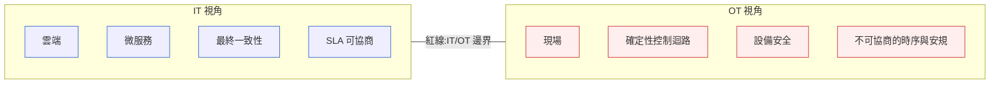
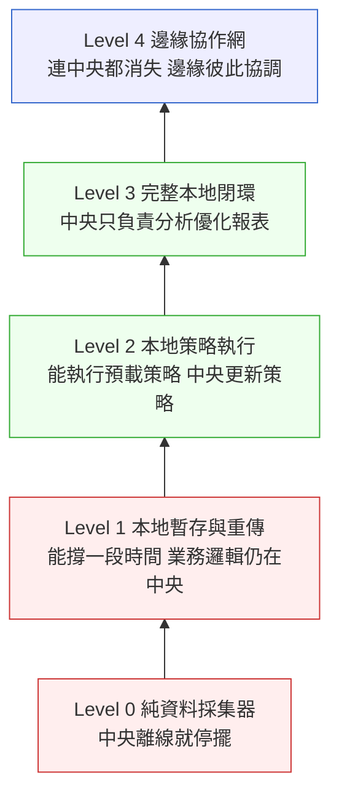
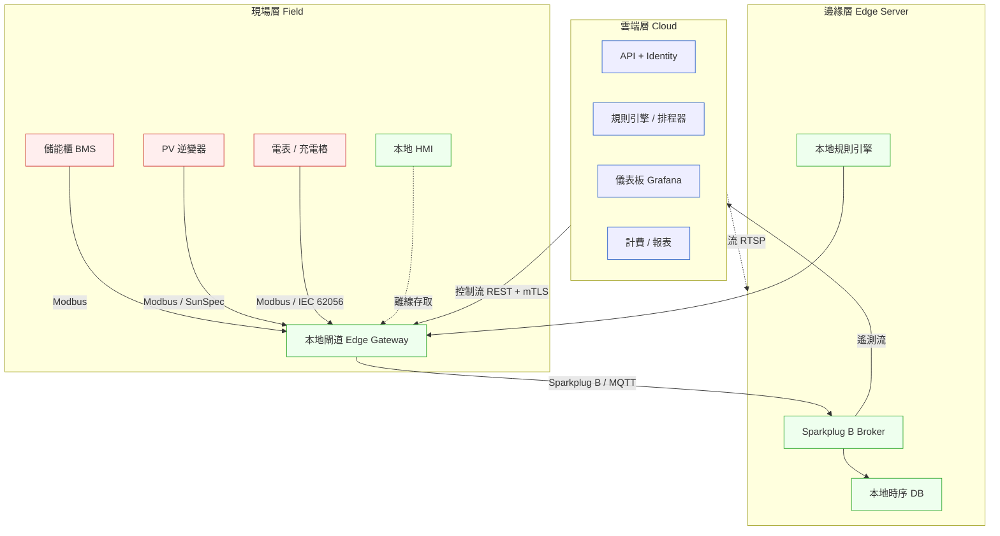

# 第 26 章|邊緣計算與 OT/IT 融合的系統架構
## ⸺ Edge Computing & OT/IT Convergence — 給有實體設備的系統

> **前置閱讀**:[Ch 22 微服務](./ch-22-microservices.md)、[Ch 24 雲端原生 K8s](./ch-24-cloud-native-kubernetes.md)、[Ch 25](./ch-25-service-mesh-cell-based.md)
> **下游章節**:[Ch 30 SRE / 可靠度](../part-05-quality/ch-30-sre-slo-chaos.md)、[Ch 31 資料架構](../part-05-quality/ch-31-data-architecture.md)
> **延伸補章**:[Ch 28 Compliance](../part-05-quality/ch-28-compliance.md)、[Ch 17 CUX 多模態](../part-03-design/ch-17-cux.md)

---

## 26.1 冷觀察 ⸺ 一個雲原生工程師遇到 200kW/400kWh 儲能櫃時會怎麼錯

2026 年 Q1，虛構能源科技公司**晟源智能**（`CASE-ENR-005`）正在替台灣中部一座 200kW／400kWh 工商業儲能案場做系統整合驗收。公司技術團隊共八人：三位雲端後端工程師（Spring Boot 3.2 / Go 1.22）、兩位資料工程師（Python 3.12 + Flink）、一位 DBA（PostgreSQL 16 + TimescaleDB 2.14）、一位 DevOps（GKE 1.29 + Helm 3.14），以及一位剛從金融科技轉過來的首席架構師陳彥廷。架構圖做得無懈可擊：Kafka 3.7 串流、PostgreSQL 主從熱備、Kubernetes 多副本、Grafana 儀表板即時呈現電量曲線。

驗收當天上午九點整，現場整合工程師把網路交換器的 uplink 拔掉，模擬 WAN 斷線——這是電力工程師的標準驗收程序。三十一秒後，儲能系統的 BMS 因為收不到雲端 EMS 的充放電指令，自動切換到本地保護模式：輸出電流降為零、儲能櫃進入待機。整棟廠房的 UPS 備援時間從設計值 4 小時縮短到 0，生產線跳電。

陳彥廷盯著 Grafana 上一條筆直跌落到底的功率曲線，打開 Kubernetes 事件日誌：REST API Pod 健康檢查失敗、Kafka consumer lag 從 0 衝到 47,000、PostgreSQL 連線集區全部 timeout。整個系統正在雲端完整地記錄它自己的崩潰。

站在設備櫃旁的 OT 整合工程師沒有走過來，只是隔著空氣說了一句：

> 「你們雲端架構師設計的系統，離線三十秒就死了——那這塊電池放在這裡，要保護什麼？」

[Ch 24](./ch-24-cloud-native-kubernetes.md) 與 [Ch 25](./ch-25-service-mesh-cell-based.md) 談雲原生與 K8s,前提是「網路是可靠的、計算資源是隨叫隨到的」。這個前提在 OT 世界**完全不成立**。



## 26.2 真問題 ⸺ OT 與 IT 的邊界,不要試圖把它消除

新手最常犯的錯,是把「OT/IT 融合」誤解成「把 OT 雲端化」。比較準確的理解是:**讓兩個世界在一個受控的邊界上對話,而不是把較弱的一方拖進另一方的假設裡**。

| 面向 | OT 世界 | IT 世界 |
|---|---|---|
| **時間尺度** | 毫秒(控制迴路)~ 秒(SCADA 巡檢) | 秒 ~ 分鐘 |
| **故障容忍** | 不能停;停了會傷人或違法 | 可降級、可重試、有 SLA |
| **生命週期** | 設備 10–20 年,韌體可能五年沒動 | 服務一年迭代多次,容器分鐘級更新 |
| **網路假設** | 工業以太網、Modbus、CAN、有時是 4G/5G,常斷線 | TCP/IP 永遠通、頻寬大致穩定 |
| **安全模型** | Air-gapped 或 IEC 62443 區段隔離 | Zero Trust + mTLS |
| **失敗代價** | 設備損壞、人身傷害、罰款 | 訂單流失、客戶抱怨 |
| **首要 KPI** | Availability(可用度,5 個 9 起跳) | Latency p99 / Throughput |

這張表的關鍵是**最後一列**。OT 工程師談 KPI 的單位是「年」;IT 工程師談 KPI 的單位是「分鐘」。兩個世界共用同一份系統規格,卻使用完全不同的詞彙談「可用」。

**邊界的設計原則**(可以寫進每一份合約):

1. **OT 永遠是 Source of Truth**。設備上的值是真實世界的反映,雲端是這個值的「最終一致性副本」。如果雲端與設備的值衝突,以設備為準。
2. **控制路徑必須能被切斷**。雲端可以發送建議性的調度,但 OT 端必須具備拒絕、覆寫、回退本地策略的能力。所有從 IT 往 OT 寫入的命令,必須通過一個本地閘道做安規檢查(例如 SOC、DOD、溫度上下限)。
3. **資料流(IT 讀)與控制流(IT 寫)走不同管道**。讀通常用 MQTT 或 Modbus-over-TCP,寫必須用受嚴格認證的另一條通道(常常是另一個物理 NIC + 另一套憑證)。

## 26.3 決策框架 ⸺ 邊緣節點的離線自治、數位孿生、MQTT 可靠性

### 26.3.1 離線自治的四個層次

雲端工程師常常忽略一件事:**邊緣節點不是一個小一點的雲端**,它是一個**自己就能完成業務閉環**的微縮系統。網路只是錦上添花。

判準很簡單:**如果中央被 DDoS 攻擊兩天,這個邊緣節點還能照常工作嗎?** 如果答案是「不行」,那就不是邊緣計算,只是「把計算放遠一點的雲端」。



絕大多數案場目標應設在 **Level 2**:預載一份「在合理範圍內可自行運轉」的策略,中央離線時邊緣繼續按舊策略走,並把所有事件記錄起來等中央回來補同步。

**達到 Level 2 在工程上要做的事**:

| 元件 | 推薦選型 | 用途 |
|---|---|---|
| 本地時序資料庫 | TimescaleDB / InfluxDB / SQLite + LSM | 至少七天本地保留 |
| 本地規則引擎 | Node-RED / 自寫 Go Rule Engine(避免 Drools 過重) | 把調度策略以「規則 + 表」下發 |
| 本地 Web UI(可選) | 嵌入式 React / Svelte | 沒有網路時直接到設備櫃旁邊操作 |
| 狀態同步協議 | Append-only log + monotonic clock + idempotent replay | 網路恢復時無痛重放 |

### 26.3.2 數位孿生:它不是 3D 模型,是「資料契約」

數位孿生這個詞被行銷化到失去意義。把它當成「設備的 3D 渲染」是嚴重誤解。在嚴肅的工程語境裡,數位孿生是一份**資料合約**,描述四件事:

1. 這台設備**現在的狀態**(實時遙測 — Telemetry)
2. 這台設備**應該的狀態**(設定點 — Setpoint / Desired State)
3. 這台設備**經歷過的歷程**(事件序列 — Event Log)
4. 這台設備**怎麼回應命令**(行為模型 — Behavioral Model)

這四項對應到 SA/SD 的語彙是:**讀模型、寫模型、事件溯源、領域模型**。完全不是新東西,只是被搬到一個有溫度、有電壓、有實體後果的領域。

### 26.3.3 MQTT 的可靠性設計:不要相信 QoS 1/2 的字面承諾

MQTT 是 OT/IT 邊界事實上的標準協定。但網路上絕大多數 MQTT 教學都停在 QoS 0/1/2 的差別,那是入門。**真正的可靠性要從以下幾個層面構築**:

**Broker 選擇是 25% 的問題**:

| Broker | 適用場景 | 踩坑紀錄 |
|---|---|---|
| **Mosquitto** | 小規模、教學、單一 Broker | 高負載下 retained message 會掉,工業場景不建議 |
| **HiveMQ** | 中大型、商業支援、Kubernetes 友善 | 商業版穩定,社群版功能受限 |
| **EMQX** | 大規模、多協議橋接 | 規模化好,要熟悉叢集模型 |
| **NATS JetStream** | 非嚴格 MQTT 但語意相近,適合混搭 IT 端 | 觀測性與重放能力比 MQTT 強 |
| **AWS IoT Core / Azure IoT Hub** | 雲端原生、設備影子 | 鎖定雲廠 + 帳單;設備離線時影子邏輯複雜 |

**真正讓 MQTT 「可靠」的不是 QoS,是 Sparkplug B**:

Sparkplug B(Eclipse 基金會規範)是把 MQTT 從「訊息協定」升級為「狀態協定」的關鍵。它強制:

- 每個邊緣節點(EoN)在連線時必須宣告完整狀態(NBIRTH);之後只發增量(NDATA)。
- 節點意外斷線時,Broker 透過 LWT(Last Will and Testament)發出 NDEATH;訂閱端立刻知道「這個節點死了」,而不是「這個節點剛好沒新資料」。
- 訊息序號(seq)強制 0–255 循環;接收端可立即偵測丟失,觸發重新請求。

沒有 Sparkplug B,會花掉大量時間自己重造這套機制,而且通常重造得不對。

**不要把雲端業務邏輯掛在「MQTT 訊息順序保證」上**:MQTT 不保證跨主題順序、不保證跨 Broker 節點順序、甚至同一 client 重連後的順序也不保證。**設計時假設 MQTT 訊息是 at-least-once + out-of-order**,把順序語意做在應用層(時間戳 + idempotency key + 訊息序號)。

### 26.3.4 OT/IT 系統 C4 結構



關鍵在標示三條**獨立的資料路徑**:遙測流(MQTT)、控制流(REST + mTLS)、影像流(RTSP / WebRTC)。三條走不同物理 NIC、不同憑證、不同認證鏈。

---

## 26.4 踩坑清單

### 反模式 1:把 OT 雲端化

把 BMS / PCS 的命令直接走 K8s 內微服務之間的 mTLS,假設「都是雲就一視同仁」。一旦 K8s control plane 異常,設備層收不到命令而硬體進入安全 fallback,業務瞬間斷流。

> ✅ **修正方向**:OT 端永遠保留**獨立、本地、可斷線運轉**的命令路徑。雲端只發建議,本地閘道做最終決策與安規覆寫。雲端故障 = 邊緣按本地策略繼續走。

### 反模式 2:離線自治停在 Level 0/1

「邊緣節點」其實只是把雲端應用搬到設備旁邊跑,中央 broker 一斷就停擺。

> ✅ **修正方向**:用 Level 2 作為最低標準。離線自治成熟度當作必查 SLA,合約寫進「中央離線 24h,業務應在預載策略下繼續」。每季做網路斷線演練。

### 反模式 3:相信 QoS 1/2 字面承諾

直接把業務邏輯掛在 MQTT 訊息順序與「最多一次 / 最少一次 / 剛好一次」的字面語意上。

> ✅ **修正方向**:在應用層處理順序與重複(時間戳 + idempotency key + 訊息序號)。導入 Sparkplug B 把「狀態語意」標準化,**狀態 = NBIRTH + 累積 NDATA**,LWT 觸發 NDEATH 通知斷線。

### 反模式 4:數位孿生混進業務 DB

把孿生即時遙測直接寫進業務交易資料庫,結果寫入量壓垮 OLTP,索引變慢、計費 query 走偏。

> ✅ **修正方向**:孿生資料庫(時序 / 物理世界當下)與業務資料庫(商業實體狀態)**獨立設計、獨立儲存、獨立合規範圍**。兩者透過事件 / projection 對齊,不直接 join。

---

## 26.5 交付清單 ⸺ 一頁式 OT/IT Edge Design Pack

完成本章後,讀者應產出:

````markdown
# OT/IT Edge Design Pack — {專案名稱}

## 1. OT/IT 邊界協定
| 訊息方向 | 協定 | 頻率 | 可靠性要求 | 認證 |
|---|---|---|---|---|

## 2. 離線自治成熟度評估
- 當前 Level / 目標 Level / 差距清單 / 季度演練腳本

## 3. 數位孿生資料模型
- 業務級資料點清單(15 個以內)
- 審計級資料點清單
- 通用標頭 schema
- 設備類型負載 schema

## 4. 網路斷線測試劇本
- 中央離線 1 分鐘 / 1 小時 / 1 天的預期行為
- 演練時間表 + 演練後復盤模板

## 5. 安規切斷清單
- 哪些值越過閾值時,本地必須立即覆寫雲端命令
- SOC / DOD / 溫度 / 電壓 上下限與覆寫優先序
````

放在 `docs/edge-design-pack/`,跟程式碼同 repo,跟 README 同層。

### 26.5.1 範例:200kW/400kWh 儲能櫃 PoC 補上的那份 Pack

§26.1 那位答不出「網路斷三十秒會不會把電池放掉」的雲端架構師,在 PoC 失敗後沒有重畫微服務拓樸,而是先補一份 Pack。下面這份是他 v0.1 ⸺ 數位孿生那塊故意只列 8 個資料點,因為設備工程師說「列超過 10 個你就是還沒搞清楚要量什麼」:

````markdown
# OT/IT Edge Design Pack — 200kW/400kWh 工商儲能 PoC

> 版本:v0.1 | 撰寫日期:2026-03-02 | Owner:雲端架構師 + 設備組組長(雙簽)
> 對應 ADR:`docs/adr/0011-ot-source-of-truth.md`

## 1. OT/IT 邊界協定
<!-- 為什麼這欄:遙測 / 控制 / 影像三條走同一條 NIC,事故當下無法切斷雲端命令;
     寫進三行就把「物理隔離」變成可被合約稽核的事。 -->
| 方向 | 協定 | 頻率 | 可靠性 | 認證 |
|---|---|---|---|---|
| BMS → 雲端(遙測)| Sparkplug B over MQTT | 1 Hz | at-least-once,LWT 必開 | mTLS A 憑證(NIC1)|
| 雲端 → PCS(控制)| REST + mTLS,本地閘道覆核 | 事件觸發 | 閘道安規檢查通過才下達 | mTLS B 憑證(NIC2)|
| 攝影機 → 邊緣(影像)| RTSP | 連續 | best-effort | RTSP 帳密 + VLAN3 |

## 2. 離線自治成熟度
<!-- 為什麼這欄:Level 0/1 在中央 DDoS 兩天時會放電到 0%;
     寫死「目標 Level 2」是讓合約有依據逼設備廠交本地策略表。 -->
- 當前 Level:0(雲端 Kafka 一斷,設備就不收命令)
- 目標 Level:2(預載「夜間電價套利策略表」+ 安規上下限,中央 24h 離線仍可運轉)
- 差距:本地時序 DB 未建、本地規則引擎未建、預載策略表合約未簽
- 演練腳本:每季一次,故意拔網路 1h、4h、24h,記錄 SOC 漂移與安規事件

## 3. 數位孿生資料模型(業務級,僅 8 點)
<!-- 為什麼這欄:超過 10 點通常代表還沒對齊「量這個是要做什麼決策」;
     設備組組長硬性要求列出每一點對應的決策。 -->
| 資料點 | 單位 | 對應決策 |
|---|---|---|
| SOC | % | 是否充 / 放電 |
| SOH | % | 維護排程觸發 |
| 模組溫度最高值 | °C | 安規切斷觸發(> 55°C 立即停)|
| PCS 直流電壓 | V | 併網 / 離網切換 |
| PCS 交流功率 | kW | 計費基礎 |
| 電網頻率 | Hz | dReg 0.25 秒併網測試 |
| 累計充入電量 | kWh | 月度結算 |
| 累計放出電量 | kWh | 月度結算 |

## 4. 網路斷線測試劇本
- 中央離線 1 分鐘:邊緣繼續按上一份策略走,訊息進本地 buffer
- 中央離線 1 小時:本地策略表執行,事件 append-only log 累積
- 中央離線 1 天:依預載「保守策略」運轉(SOC 維持 30–70%,不參與套利)
- 演練後復盤:checklist 五項(SOC 漂移、安規事件數、buffer 大小、回連後重放完整性、設備工程師主觀評分)

## 5. 安規切斷清單(本地必須覆寫雲端)
<!-- 為什麼這欄:雲端建議性命令越過任一安規,本地閘道直接拒絕並記事件;
     沒這份清單,「OT 是 Source of Truth」這句話就只是口號。 -->
- 模組溫度 > 55°C → 立即停止充放電(優先序 0,任何雲端指令無效)
- SOC < 10% → 拒絕放電指令(優先序 1)
- SOC > 95% → 拒絕充電指令(優先序 1)
- 電網頻率偏離 ±0.5 Hz → 立即離網(IEC 62116 / Taiwan dReg)
- PCS 直流側絕緣阻抗 < 100 Ω/V → 立即停機並通知運維
````

PoC 重啟那一週,雲端架構師把這份 Pack 印出來釘在儲能櫃旁的工程紀錄板上,設備組組長簽了字。**「網路斷三十秒會不會把電池放掉」這個問題現在有答案了 ⸺ 不是因為雲端變強,是因為邊界寫清楚了**。

---

## 26.6 Recap

讀完本章,應該已經能做到:

- [ ] 認得出 OT 與 IT 的根本假設差異(時序 / 故障容忍 / 生命週期 / 網路 / 安全 / 失敗代價 / KPI)
- [ ] 把離線自治成熟度評估到 Level 2 以上,並寫進合約
- [ ] 把數位孿生當資料契約看待,不混進業務 DB
- [ ] 用 Sparkplug B 取代裸 MQTT,並在應用層補順序語意
- [ ] 三條資料路徑(遙測 / 控制 / 影像)獨立物理通道與認證

如果五項中先挑一項做,建議是第一項 ⸺ 把 OT/IT 邊界畫清楚,後面四項的決定會自然跟著走。

---

## Cross-References

- **前置**:[Ch 22 微服務](./ch-22-microservices.md)、[Ch 24 K8s](./ch-24-cloud-native-kubernetes.md)、[Ch 25 Mesh / Cell](./ch-25-service-mesh-cell-based.md)
- **下游**:[Ch 30 SRE / 可靠度](../part-05-quality/ch-30-sre-slo-chaos.md)、[Ch 31 資料架構](../part-05-quality/ch-31-data-architecture.md)
- **延伸補章**:[Ch 28 Compliance](../part-05-quality/ch-28-compliance.md)、[Ch 17 CUX](../part-03-design/ch-17-cux.md)
