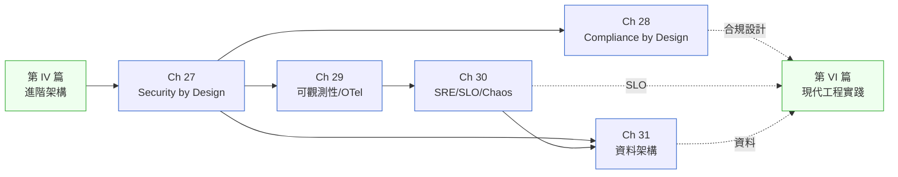

# 第 V 篇|品質屬性

> **安全不是 checklist、可觀測性不是 dashboard 牆、SLO 不是 SLA 的另一個名字。這四章加一個補章,每一章都在糾正一個常見的錯誤定義。**

---

PocketRail 的 14 個帳戶全部過了 KYC,全部通過了 OTP,風控規則一條都沒觸發——但 NT$280 萬從三個不同國家的虛擬幣兌換商消失。攻擊鏈用了三個失敗點:OAuth refresh token 沒綁 device fingerprint、客服降級流程只驗公開資料、跨境匯款限額被精準打在閾值內。**三個失敗點各自看起來都不嚴重,組合起來就是 NT$280 萬。**

這是 Security by Design 想處理的問題型別。不是「要不要加防火牆」,是「系統的預設值是不是安全的」。

第 V 篇的四章加一個補章,按**品質屬性的依存順序**排列:安全是基礎線(Ch 27 + Ch 28)、可觀測性是你知不知道哪裡壞掉(Ch 29)、SRE 是你有沒有辦法量化「多可靠」(Ch 30)、資料架構是你的 data lake 是資產還是負擔(Ch 31)。

---

## 篇內章節依存圖

---

## 各章核心問句

| 章 | 標題簡稱 | 這章回答的真正問題 |
|---|---|---|
| Ch 27 | Security by Design | 把安全做成「預設值」和「上線前加」,代價差多少? |
| Ch 28 | Compliance by Design | 法規遵循是合規部門的事,還是架構設計的事? |
| Ch 29 | 可觀測性 / OTel | 三根支柱(Metrics / Logs / Traces)各自回答哪種問題? |
| Ch 30 | SRE / SLO / Chaos | Error Budget 是技術概念還是與產品談判的籌碼? |
| Ch 31 | 資料架構 | Data Mesh / Lakehouse / Lakebase——為什麼這三個詞常被誤用? |

---

## 不同讀者的建議入口

- **想提升系統安全性**:Ch 27 → Ch 28。Ch 27 的 Threat Modeling 模板可以直接用在下一次 Sprint 0。
- **SRE / 平台工程師**:Ch 29 → Ch 30 是你的主線。SLO 的計算方式和 Error Budget 的談判框架是你和產品溝通的工具。
- **資料工程師 / 資料架構師**:Ch 31 是你的主章。搭配 [Ch 28](./ch-28-compliance.md) 的資料主權設計一起讀。
- **有合規要求的產業(金融/醫療/能源)**:Ch 28 是這篇最重要的章節,直接對應 GDPR / HIPAA / PCI-DSS / 台灣個資法的架構設計點。

---

## 前後篇連結

- **前置**:[第 IV 篇 進階架構](../part-04-architecture/00-overview.md)
- **這篇解鎖**:[第 VI 篇 現代工程實踐](../part-06-engineering/00-overview.md) — 品質屬性確立之後,平台工程才能把 SLO / 安全 / 合規自動化進 IDP
- **長距離影響**:[Ch 36 AI-Native 架構](../part-07-ai-era/ch-37-ai-native-architecture.md)(Ch 27 的安全設計原則在 AI 系統中擴大為 Human-in-the-loop 設計)、[Ch 44 AI Eval](../part-07-ai-era/ch-45-ai-eval-drift-redteam.md)(Ch 30 的 Chaos Engineering 思維延伸到 AI 系統的對抗性測試)
