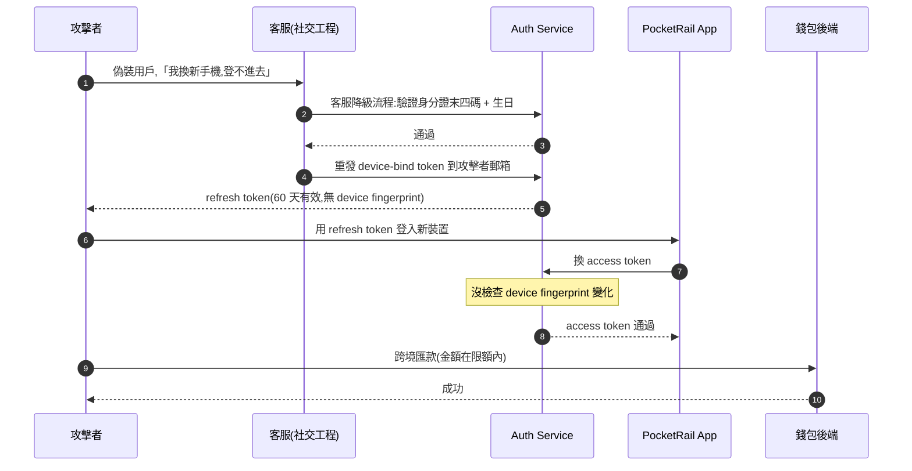
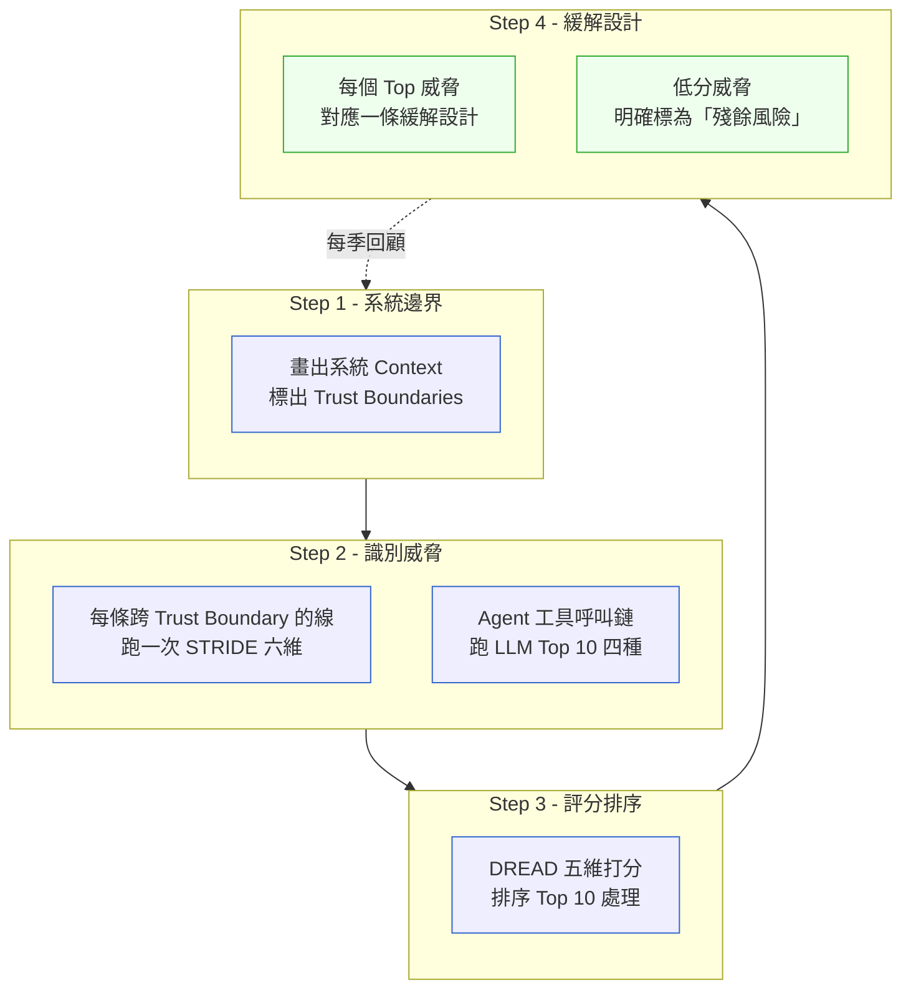
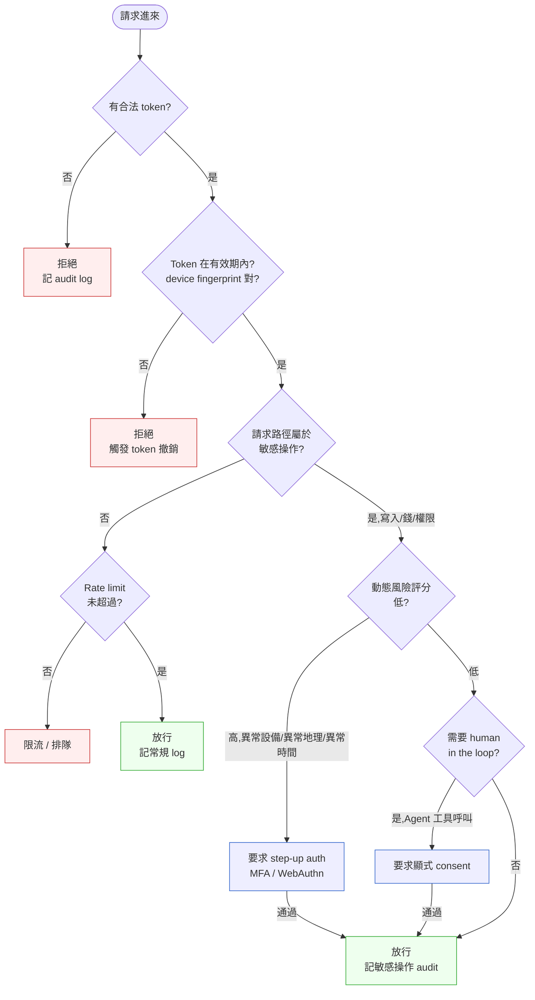

# 第 27 章|安全設計
## ⸺ Security by Design、Zero Trust、Threat Modeling 不是清單,是預設值

> **前置閱讀**:[Ch 13 架構風格](../part-03-design/ch-13-architecture-styles.md)、[Ch 22 微服務拆分判準](../part-04-architecture/ch-22-microservices.md)、[Ch 25 Service Mesh 與 Cell-Based](../part-04-architecture/ch-25-service-mesh-cell-based.md)
> **下游章節**:[Ch 29 可觀測性](./ch-29-observability-otel.md)、[Ch 30 可靠性](./ch-30-sre-slo-chaos.md)、[Ch 37 AI-Native 架構](../part-07-ai-era/ch-37-ai-native-architecture.md)
> **延伸補章**:[Ch 28 Compliance by Design](../part-05-quality/ch-28-compliance.md)(緊接本章後)

---

## 27.1 冷觀察 ⸺ KYC 通過,戶口被搬空 NT$280 萬

我在 2026 年第一季,跟過虛構數位錢包公司 **PocketRail**(`CASE-FIN-007`)一場事故覆盤。他們做的是台 / 港 / 星三地的數位錢包與跨境匯款,跑 OAuth 2.1 + OIDC、KYC 過 Sumsub 第三方、合規對 MAS / HKMA / 金管會三方,日均交易約 1.4 萬筆,後端 Spring Boot 3.3 + PostgreSQL 17,前端 React Native。團隊 32 人,上線 14 個月。

事故是這樣開始的。週四下午 16:48,一位香港用戶在 LINE 客服群裡丟訊息:「我戶口少了 28 萬港幣。」客服初判是釣魚連結受害,請用戶提供登入紀錄。半小時內,類似訊息進來第二筆、第三筆、第七筆。週五凌晨,風控組把過去 72 小時的可疑交易拉出來:**14 個帳戶、累計新台幣 280 萬、全部走「裝置綁定 + 跨境匯款」這條路徑**,匯到三個不同國家的虛擬幣兌換商。

> 「他們都過了我們的 KYC,他們都通過了 OTP,我們的風控規則一條都沒觸發。」

風控主管在白板上寫下這句話。當下沒人能接話。

繼續往下挖。受害的 14 個帳戶共同點是「兩週前剛換過手機」。攻擊者用的不是釣魚 ⸺ 是**社交工程加上 OAuth refresh token 設計缺陷**的組合拳。攻擊鏈大致長這樣:



把這個鏈拆開來,失敗點不只一個。**第一個是 OAuth 設計**:refresh token 60 天有效,但發出時沒綁 device fingerprint(IP / device ID / TLS fingerprint 任一個都沒綁),換一台手機不會被發現。**第二個是客服降級流程**:用戶說「換手機登不進去」,客服只驗證了身分證末四碼 + 生日 ⸺ 兩項都是公開資料,在台灣這兩項可以從外洩的物流資料、租屋平台、學校通訊錄拼出來。但真正讓這個流程致命的,不只是驗證欄位太弱 ⸺ 而是「重發 device-bind token」這個動作,系統**從未要求二次確認**,因為客服系統在公司內網、走 VPN、已過 SSO 登入,後端的設計假設是:「客服已經在受信任的環境裡,它提交的操作都可以直接信任。」這個「內網 = 受信任」的預設值,讓一個能偽造兩項公開資料的攻擊者,直接獲得了跟合法客服操作員相同的系統權限。**第三個是風控規則**:跨境匯款的限額是 USD 5,000 / 日 / 帳戶,攻擊者每筆控制在 USD 4,800,**沒一筆超過閾值**。三個失敗點各自看起來都不嚴重,組合起來就是 NT$280 萬。

事故覆盤會議進行到第三小時,CTO 把白板上的東西擦掉,寫下一行字:

> 「我們的安全清單上每一項都打勾了。我們的安全『預設值』是錯的。」

這句話是這一章的起點。**清單與預設值不是同一件事**。OWASP Top 10 的每一項他們都評估過、PCI DSS 的每一條都做過、滲透測試報告也是 clean ⸺ 但 OAuth refresh token 預設不綁 device、客服降級流程預設只驗 KYC 表面欄位、風控限額預設只看單筆 ⸺ 這三個「預設值」,沒有任何一張清單會勾起來。攻擊者不打你的 checklist,打的是你沒注意到的預設值。

---

## 27.2 真問題 ⸺ Security by Design 不是清單,是預設值的選擇

「我們安全嗎?」這個問題,從 OWASP Top 10 2003 第一版發布到現在,問了二十多年。把它拆開來看會比較清楚:**這個問題本身的形狀就不對**。它預設了「安全」是一個布林值 ⸺ 通過清單就安全、沒通過就不安全。但實務上,安全不是通過或不通過,**是無數個預設值累積出來的姿態**。

### 27.2.1 清單思維 vs 預設值思維

把兩種思維並排看一次:

| 維度 | 清單思維 | 預設值思維 |
|---|---|---|
| **觸發時機** | 上線前、合規稽核前 | 每個技術選型、每個 API 設計、每個流程設計 |
| **問題形狀** | 「我們做了 X 嗎?」 | 「X 的預設行為是什麼?攻擊者能不能利用?」 |
| **失敗模式** | 清單通過了,事故仍然發生 | 預設值錯了,後面所有規則都失效 |
| **產出物** | 一份報告 | 一組設計選擇 |
| **誰負責** | 資安組 | 整個工程團隊 |

PocketRail 的事故不是「沒做安全清單」,是「清單通過了,但 refresh token 不綁 device 是一個錯的預設值、客服只驗 KYC 表面欄位是一個錯的預設值」。**錯的不是知識,是預設值的選擇**。

換句話說,Security by Design 真正在做的事情是:**在設計階段就把預設值選對,讓後面即使忘了做某條規則,系統仍然有底**。OWASP 開頭就講過這句話:*"Insecure defaults are the most common cause of vulnerabilities"*[^CIT-250]。OWASP 2021 把「Insecure Design」獨立列為 A04,就是要把焦點從「程式碼漏洞」拉回「設計選擇」。

### 27.2.2 Zero Trust 不是流行詞,是工程姿態

「Zero Trust」這個詞被講爛了。某資安廠商說自己是 Zero Trust 解決方案,某 VPN 廠商說自己是 Zero Trust VPN ⸺ 但 NIST SP 800-207[^CIT-251] 寫得清清楚楚,Zero Trust **不是一個產品,是一組架構原則**。把它拆開來看,核心只有一句話:

> Never trust, always verify ⸺ 不要因為「在內網」、「過了登入」、「在防火牆後面」就賦予信任。每次存取都要驗證身份、設備、上下文。

這句話聽起來像廢話,但對應到工程選擇,影響很深。傳統「城堡護城河」(perimeter security)模型預設「內網 = 受信任」⸺ 一旦攻擊者進到內網(透過 VPN 帳號外洩、員工裝置受感染、供應鏈攻擊),就一路通行。Zero Trust 預設「沒有內網這件事」 ⸺ 服務之間互呼也要 mTLS、員工存取資料庫也要 IAP、API 之間通訊也要短期憑證。

PocketRail 的事故有一半是這個問題。客服系統在內網、用 SSO 登入,客服降級流程的「重發 device-bind token」這個動作,系統預設信任客服已經做完身分驗證 ⸺ 但客服的身分驗證做得有多嚴?系統不知道,因為它預設「客服在內網就是受信任」。Zero Trust 的姿態會逼這個流程多一層:即使客服已經登入、即使在內網,「重發 device-bind token」這個敏感操作仍然要拿動態風險評分(用戶最近一次成功登入時間 / 設備 / 地理位置 / 操作頻率)二次驗證。

### 27.2.3 Threat Modeling 不是檢核表,是設計階段的對話

第三件事是 Threat Modeling。多數組織把 Threat Modeling 當成「合規稽核項目」⸺ 每年做一次、產一份 PDF、放進稽核夾。這樣做的問題是:**Threat Modeling 在交付後做沒有用**,設計都已經拍板,改不動了。

把 Threat Modeling 真正用對的姿態是:**在設計會議上,跟團隊一起把「攻擊者視角」放進去**。畫架構圖的時候,旁邊一張紙寫 STRIDE 六個維度,每畫一條線就問一次「這條線可不可以被 Spoof / Tamper / Repudiate / Information Disclosure / DoS / Elevation」。它不是另一個會議,是同一個會議的另一個維度。

到了 2026,這件事多了一個新戰場:**AI 系統的 Threat Modeling**。當你的系統開始呼叫 LLM、開始有 Agent 自主決策、開始把工具(database / API / 檔案系統)交給 LLM 呼叫,Threat Model 的邊界就從「程式碼周邊」擴展到「Agent 的工具呼叫鏈」。

STRIDE 在這裡仍然是基礎 ⸺ Spoofing(身份偽造)、Tampering(資料竄改)、Repudiation(否認)、Information Disclosure(資訊洩漏)、DoS、Elevation of Privilege 這六個維度,對 LLM 的 API 端點、工具呼叫介面、輸出 pipeline 同樣適用。**但 LLM 的輸入/輸出特性引入了四類傳統 STRIDE 不覆蓋的 LLM 特有威脅維度**:攻擊者透過文字輸入改變 LLM 行為(Prompt Injection)、誘導 LLM 執行不該執行的工具(Tool Misuse)、探測 system prompt 或訓練資料(Model Exfiltration)、把 LLM 輸出當可信內容直接執行(Insecure Output Handling)。這四類不是要補充進傳統 STRIDE 六維的命名,而是 LLM 輸入/輸出管道特有的攻擊路徑,STRIDE 的六維框架本身並不覆蓋。OWASP LLM Top 10 2024[^CIT-256] 把這四類明確命名,讓它們能被識別、被討論、被緩解。

因此,AI 系統的 Threat Modeling 是**兩層疊加**:先跑 STRIDE(涵蓋所有跨 trust boundary 的線,包括 LLM API);再對每個 Agent 工具呼叫點,額外跑 LLM Top 10 四種威脅類型。這件事 § 27.3.5 會展開完整對照表。

---

## 27.3 決策框架 ⸺ STRIDE、Zero Trust、Threat Modeling 工作坊

下面這幾張表跟兩張圖,在現場用過好幾次。前提是先回答一件事:**你現在要保護的是什麼?資料?可用性?身份?還是 Agent 的決策完整性?** 不同保護目標,對應不同的威脅地圖。

### 27.3.1 STRIDE 六維對照表

STRIDE 是 Microsoft 1999 年提出的威脅分類法[^CIT-252],六個字母對應六種威脅類型。把它放成一張六維對照表,在設計會議上每畫一條線問一次:

| STRIDE | 中文 | 攻擊面舉例(PocketRail 場景) | 對應緩解 |
|---|---|---|---|
| **S**poofing | 身份偽造 | 攻擊者偽裝成用戶聯繫客服;偽造合法 device fingerprint | 強身份驗證(MFA / WebAuthn);device binding;客服降級流程的 step-up auth |
| **T**ampering | 資料竄改 | 中間人改 API request body;改交易金額 | mTLS;HMAC 簽章;Idempotency-Key;API request 全程 TLS 1.3 |
| **R**epudiation | 否認 | 用戶否認自己發起匯款;客服否認操作過降級流程 | append-only audit log;每筆敏感操作記錄 actor / timestamp / device / IP |
| **I**nformation Disclosure | 資訊洩漏 | 錯誤訊息洩漏內部欄位名;log 寫入信用卡明碼;memory dump 含 token | 統一 error envelope;PII / PCI 欄位遮蔽;secrets 不進 log |
| **D**enial of Service | 拒絕服務 | 攻擊者打 OTP 端點導致正常用戶 OTP 額度耗盡;單筆超大 query 把 DB 拖死 | per-IP / per-account rate limit;query timeout;circuit breaker |
| **E**levation of Privilege | 權限提升 | 一般用戶呼叫管理員 API;refresh token 被盜後權限不縮減 | RBAC + ABAC;最小權限;token 縮短有效期 + device binding |

這張表的關鍵不是「我們有沒有做這六項」,**是「設計階段的每條 API、每個介面、每個流程,六個欄位是不是都討論過」**。PocketRail 的事故覆盤後重做 STRIDE,在「客服降級流程」這條線上,六個維度跑一遍 ⸺ 結果發現 Spoofing(攻擊者偽裝用戶)、Repudiation(客服無法否認操作)、Elevation(降級流程權限過大)三項都沒對應緩解。一場會議解決三個維度的問題,比跑十次滲透測試實用。

### 27.3.2 DREAD 評分:威脅排序的最小劑量

威脅找出來之後,下一個問題是「先處理哪幾個」。DREAD 是 Microsoft 提出的威脅評分法[^CIT-252],五個維度各打 1–10 分,加總排序:

- **D**amage(損害程度):被利用會造成多大損失?
- **R**eproducibility(可重現性):攻擊有多容易重現?
- **E**xploitability(可利用性):需要多少技術 / 工具 / 權限?
- **A**ffected users(影響範圍):多少用戶 / 資料受影響?
- **D**iscoverability(可發現性):攻擊者要花多少力氣發現這個漏洞?

DREAD 的爭議是「打分主觀」⸺ 但這正是它的優點。**打分過程本身就是團隊對齊認知的對話**。把 PocketRail 那場事故的三個失敗點各自打分,「OAuth refresh token 沒綁 device」拿到 9/8/7/9/7 = 40 分,「客服降級流程社交工程」拿到 8/9/9/6/8 = 40 分,「風控限額只看單筆」拿到 7/9/8/7/9 = 40 分 ⸺ 三項並列最高,等於說「先動哪個都對」。這個結論本身就是有用的決策訊號。

進階版本是 **Attack Tree**(Bruce Schneier 1999 提出[^CIT-253]):把「達成攻擊目標」當作根節點,往下拆「實現這個攻擊需要哪些子目標」,葉節點是具體手段。Attack Tree 比 DREAD 更適合複雜攻擊鏈(像 PocketRail 這種「社交工程 + OAuth 缺陷 + 風控限額」的組合拳),DREAD 比 Attack Tree 更適合快速排序。兩者擇一就好,規模不大時用 DREAD 即可。

### 27.3.2.1 框架整合:STRIDE/DREAD 結果如何對應到 Zero Trust 工程選擇

STRIDE 告訴你「哪條線有什麼威脅」,DREAD 告訴你「先處理哪幾個」⸺ 但它們的輸出都是「威脅清單」,還沒變成「工程設計」。這裡需要一個橋接:把 STRIDE/DREAD 得到的高優先威脅,對應到 Zero Trust 五原則的具體工程選項,威脅才會變成可執行的設計決策。

對應邏輯大致如下:STRIDE 找出的 **Spoofing 威脅**(身份偽造)對應 Zero Trust 的「Identity-aware + Device-aware」原則,工程選擇是強身份驗證與 device fingerprint 綁定;**Tampering 威脅**(資料竄改)對應「Continuous Verification」,工程選擇是 mTLS + HMAC 簽章;**Elevation of Privilege 威脅**(權限提升)對應「Least Privilege」,工程選擇是 token 短效、RBAC 細粒度、預設拒絕。PocketRail 的 DREAD 三項並列 40 分後,這個對應讓三個威脅各自落到 Identity-aware、Least Privilege、Context-aware 三個 Zero Trust 原則上,每個原則有具體的工程措施可以執行。

換句話說,**STRIDE/DREAD 是威脅分析的工具;Zero Trust 是緩解設計的架構**。兩者之間的對應關係,就是 Threat Modeling 工作坊 Step 4「緩解設計」的核心動作。

### 27.3.3 Zero Trust 五原則(NIST SP 800-207)

NIST SP 800-207[^CIT-251] 把 Zero Trust 寫成七個 tenets,把它收斂到五個工程上可操作的原則:

| 原則 | 工程意涵 | PocketRail 的對應做法 |
|---|---|---|
| **1. Identity-aware**(身份意識) | 每次存取都驗身份,不靠網路位置授信 | 客服系統存取用戶資料,每次都要 OIDC 驗;不因「在內網」省略 |
| **2. Device-aware**(設備意識) | 每次存取附上設備指紋,異常設備觸發 step-up auth | OAuth refresh token 強制綁 device fingerprint;換裝置必須重做 KYC 級驗證 |
| **3. Context-aware**(脈絡意識) | 用時間 / 地理 / 行為 / 風險評分動態決策 | 客服降級流程跑動態風險評分;高風險操作即時要求多因子 |
| **4. Least Privilege**(最小權限) | token 短效;權限細粒度;預設拒絕 | access token 15 分鐘;client credentials 按 endpoint 細分 scope |
| **5. Continuous Verification**(持續驗證) | 不是「登入一次就放行」,是「每個請求都重新評估」 | 敏感操作即時重檢風險;session 異常自動撤銷;mTLS 憑證短期輪替 |

實務上,Zero Trust 落地的工程組合通常是:**SPIFFE / SPIRE**[^CIT-254] 做服務身份(每個服務一張短期 SVID 憑證,自動輪替)+ **Identity-Aware Proxy**(Google IAP、Cloudflare Access、Pomerium)做使用者身份 + **OPA / Cedar** 做政策決策 + **mTLS** 做傳輸層加密。這四件套不是必須一次全上,通常從「SPIFFE 給服務發 cert + IAP 在外層保護內部工具」這個劑量開始,逐步擴張。

### 27.3.4 Secrets 管理與供應鏈安全工具對照

Zero Trust 五原則在架構層說清楚了「要做什麼」⸺ Identity-aware、Device-aware、Least Privilege 等等 ⸺ 但落地到工程配置,繞不開兩個常被低估的領域:**Secrets 管理**與**供應鏈安全**。Secrets 管理的品質直接決定 Zero Trust 的「Least Privilege」原則能不能執行(token 短效、動態輪替、不存在程式碼裡);供應鏈安全則是 Zero Trust 的「Continuous Verification」在 build pipeline 層面的體現(你信任的 image 和依賴本身有沒有被篡改)。把現場常見工具對照一次:

| 領域 | 工具 | 強項 | 適用情境 |
|---|---|---|---|
| **Secrets 管理** | HashiCorp Vault[^CIT-255] | 動態 secret(短期 DB credential)、PKI、Transit 加密 | 多雲、混雲、需要動態 secret 輪替 |
| | AWS KMS / Secrets Manager | 與 IAM / Lambda 整合無縫、無維運 | 全棧 AWS、不要求多雲 |
| | SOPS(Mozilla) | Git-friendly、非對稱加密、與 KMS 整合 | GitOps 流程、Kubernetes ConfigMap 加密 |
| | Sealed Secrets(Bitnami) | K8s 原生、密文可進 Git | 純 K8s 環境、團隊不熟 Vault |
| **Supply Chain** | SBOM(SPDX / CycloneDX) | 列出每個依賴版本、可機讀 | 合規要求(EU CRA、US EO 14028)、漏洞追溯 |
| | SLSA(Google)[^CIT-257] | Build provenance、4 個 level 漸進採用 | 想證明「這份 binary 是從這份 source 編出來的」 |
| | Sigstore / cosign[^CIT-258] | container image 簽章、keyless OIDC | 公開 registry 上的 image 真偽驗證 |
| | Dependabot / Renovate | 自動偵測過期依賴 + PR | 任何 GitHub repo 的最低劑量 |

PocketRail 的選擇是 Vault(因為多雲)+ SBOM(CycloneDX,合規要求)+ Sigstore(因為容器 image 跨三地部署)。**判準大致這樣**:secrets 在純 AWS 用 Secrets Manager 就好;多雲或混雲才上 Vault;GitOps 流程選 SOPS。供應鏈安全的最低劑量是 SBOM + Dependabot,有餘力再加 SLSA Level 2 + Sigstore。

### 27.3.5 AI 系統威脅地圖(OWASP LLM Top 10 2024)

到了 2026,Threat Modeling 多了一個新層。當系統開始呼叫 LLM、開始把工具交給 Agent,STRIDE 仍然是第一層基礎 ⸺ 對 LLM 的 API 端點、工具呼叫介面、輸出 pipeline 跑 STRIDE 六維依然有效。但 LLM 的輸入 / 輸出 / 上下文都是動態文本,引入了傳統 Threat Model 未覆蓋的 LLM 特有威脅維度,需要在 STRIDE 之後額外跑一層 LLM Top 10。

這裡要強調一點:**下面這四類威脅不是 STRIDE 的替代或延伸命名,而是 STRIDE 之後獨立的第二層分析**。它們專門針對 LLM 的輸入/輸出管道,與 STRIDE 各自涵蓋不同的攻擊路徑,兩層分開跑、不要混在一起。

把 OWASP LLM Top 10 2024[^CIT-256] 收斂成四種對 SA/SD 影響最深的 LLM 特有威脅類型,作為 STRIDE 的第二層補充:

| 威脅類型 | 攻擊形狀 | 設計階段該做的事 |
|---|---|---|
| **Prompt Injection** | 攻擊者把惡意指令藏在用戶輸入 / 文件 / 網頁,讓 LLM 改變行為 | 區分 system prompt / user prompt / 外部資料三層;外部資料永不視為指令;output guardrail |
| **Tool Misuse** | LLM 被誘導呼叫不該呼叫的工具(刪資料、發郵件、轉帳) | 工具呼叫前的人類確認;敏感工具強制需要顯式 user consent;tool scope 細粒度 |
| **Model Exfiltration** | 攻擊者透過 prompt 探測模型權重 / 訓練資料 / system prompt | rate limit per user;output 不洩漏 system prompt;敏感資料不進訓練集 |
| **Insecure Output Handling** | LLM 輸出被當成可信內容直接執行(SQL / shell / HTML render) | 永遠把 LLM 輸出當作 untrusted user input;不直接 eval、不直接 render |

PocketRail 在 2026 Q1 開始接 LLM 客服 Agent,計劃讓 Agent 直接呼叫「凍結帳戶」、「重發 OTP」、「查詢餘額」三個工具。事故後做完 AI Threat Modeling,結論是:**「凍結帳戶」要走人類確認、「重發 OTP」要走 step-up auth、「查詢餘額」可以放給 Agent 但 rate limit 收緊**。這個分類不是憑感覺,是把每個工具按 Tool Misuse 的攻擊面評估後得到的結果。Anthropic 在 Tool Use Safety[^CIT-259] 的指引也建議:**任何寫入 / 不可逆的工具,都該預設加 human-in-the-loop**。

### 27.3.6 Threat Model 結構視覺化

把 Threat Modeling 工作坊的四個產出畫在同一張圖上,大致長這樣:



這張圖的關鍵是右下那個迴圈 ⸺ Threat Model 不是一次做完歸檔,**每季回顧一次**。每季新加的服務、新加的工具、新加的整合點都要重跑這四步。PocketRail 後來把這個迴圈跟季度架構審查綁在一起,每季最後一週固定花半天做。

### 27.3.7 Zero Trust 流量決策樹

「這個請求要不要放行」這個決策,在 Zero Trust 模型下不再是「有 token 就放行」,而是按多個維度動態決策。把現場常用的決策樹畫出來:



這張圖的預設值是「**沒有 token 就拒、有 token 但 fingerprint 不對也拒**」⸺ 預設拒絕,而不是預設放行。Q3 那個「敏感操作」的分支是 PocketRail 事故後新加的:跨境匯款、改密碼、改 device binding、改 KYC 資料這四類請求,即使 token 合法,也要再跑一次動態風險評分。Q6 那個「human-in-the-loop」是 AI 工具呼叫鏈才會走的分支,普通 API 不需要。

### 27.3.8 Threat Modeling 工作坊四步

把上述決策框架壓成一場 2 小時的工作坊,按下面四步跑:

1. **Step 1(20 分鐘)畫系統 Context**:用 C4 Level 1/2 的圖,標出每個 trust boundary(用戶 ↔ 系統、系統 ↔ 第三方、服務 ↔ 服務、人類 ↔ Agent)。
2. **Step 2(40 分鐘)跑 STRIDE,再對 Agent 工具呼叫疊加 LLM Top 10**:每條跨 trust boundary 的線,先跑 STRIDE 六個維度,一條線一次;系統中有 Agent 工具呼叫點的,再額外跑 OWASP LLM Top 10 四種威脅類型(Prompt Injection / Tool Misuse / Model Exfiltration / Insecure Output Handling)。兩層分開跑,不要混在一起 ⸺ STRIDE 管所有介面,LLM Top 10 只管 Agent 那段。寫在便利貼上貼到圖旁邊。
3. **Step 3(30 分鐘)DREAD 排序**:把所有便利貼按 DREAD 打分,排出 Top 10。
4. **Step 4(30 分鐘)緩解設計**:Top 10 每個指派 owner + 緩解措施,剩下的明確標為「殘餘風險」並寫進 Threat Model Card。

Adam Shostack 在《Threat Modeling: Designing for Security》[^CIT-252]裡反覆強調的四個問題,可以直接拿來對映上述四步:**What are we working on? What can go wrong? What are we going to do about it? Did we do a good job?** 第一個對應 Step 1、第二個對應 Step 2、第三個對應 Step 3 + Step 4、第四個是每季回顧那個迴圈。

---

## 27.4 踩坑清單

下面這四個常見地雷,在現場反覆出現。它們的共同點是「**形式上做了安全工作,但預設值仍然錯**」。每一個都附修正方向,下次遇到可以這樣處理。

### 反模式 1:預設信任(內部網路 = 受信任)

最古老也最常見。內部服務之間互呼不做 mTLS、員工存取資料庫不過 IAP、客服系統「在 VPN 後面」就視為受信任。一旦攻擊者突破任何一個邊界(VPN 帳號外洩、員工筆電被入侵、供應鏈攻擊),內部所有東西一路通行。PocketRail 那場事故的客服降級流程就是這個範本 ⸺ 系統預設「客服在內網就受信任」,所以「重發 device-bind token」這個動作不需要二次驗證。

> ✅ **修正方向**:把「內網」這個概念從信任假設裡拿掉。三件最低劑量的事:**(1)** 服務之間用 mTLS,工具用 cert-manager 或 SPIFFE/SPIRE 自動簽 cert,不要手動管。**(2)** 員工存取內部工具(資料庫管理介面、客服後台、運維 dashboard)走 Identity-Aware Proxy(Google IAP、Cloudflare Access、Pomerium 三者擇一),不要用 VPN。**(3)** 敏感操作(改密碼、降級驗證、解鎖帳戶)即使在內網,即使已登入,也要走動態風險評分 + 必要時 step-up auth。判準:**「在內網所以安全」這句話出現在會議紀錄,就是預設值錯了的訊號**。

### 反模式 2:Threat Modeling 只在合規稽核做一次

每年合規稽核前,資安顧問來幫忙做一次 Threat Model,產一份 80 頁 PDF,放進稽核夾,開發團隊沒人看過第二次。半年後系統加了新服務、新整合、新 API、新 Agent 工具呼叫鏈 ⸺ Threat Model 都沒更新,稽核時拿出來的是上一年的版本。攻擊者打的是新東西,你的 Threat Model 還在舊地圖上。

> ✅ **修正方向**:Threat Modeling 不是合規動作,是設計動作。**綁進設計流程,不是綁進稽核流程**。具體做法:**(1)** 每個新服務 / 新 API / 新整合的設計 PR,template 強制要附 Threat Model 段落(STRIDE 六維各列 ≥ 1 威脅 + 緩解)。寫不出來的 PR 不能 merge。**(2)** 季度架構審查最後一週,固定半天做 Threat Model 回顧 ⸺ 走過去三個月新增的所有服務,跑一次完整 § 27.3.8 的四步流程。**(3)** 重大事故覆盤後,把對應的 Threat Model 段落更新,標出「這個威脅當初有沒有想到」。判準:**Threat Model 文件的最後更新時間超過三個月,就是已經過期的訊號**。

### 反模式 3:Secrets 用環境變數加 base64

「我們有處理 secrets ⸺ 我們把它們 base64 編碼後放 .env 檔。」這句話聽過好幾次。Base64 不是加密,是編碼;`.env` 檔即使 gitignored,在 CI 環境變數、容器 image layer、運行時 process env、log 印出 stack trace 時都會洩漏。更糟的版本是「我們把 secret 加密後寫死在程式碼裡,只有我們知道金鑰」⸺ 金鑰跟密文一起進 git,等於沒加密。

> ✅ **修正方向**:Secrets 管理沒有「輕量版」這個選項。**最低劑量是真的 secrets manager**。三個常見正解:**(1)** 純 AWS 環境用 AWS Secrets Manager + IAM role,程式裡不存 secret,啟動時拉,定期輪替。**(2)** 多雲 / 混雲環境用 HashiCorp Vault,動態 secret(短期 DB credential)是 Vault 的核心優勢,密碼六小時自動輪替一次,連洩漏的視窗都很短。**(3)** GitOps 流程用 SOPS(密文可進 git,金鑰在 KMS),或 Sealed Secrets(K8s 原生)。任何情況下,**.env + base64 都不是選項**,即使是 PoC。判準:**「我們的 secret 有加 base64」這句話出現,就是該重做 secrets 架構的訊號**。

### 反模式 4:Supply Chain 沒做 SBOM 就上線

「我們依賴的開源套件都是大牌,應該沒事吧。」XZ Utils 後門事件(2024)[^CIT-258]之後,這句話沒人敢再說。但很多團隊還是沒做 SBOM、沒做依賴鎖版、沒做 image signing ⸺ 等到歐盟 CRA(Cyber Resilience Act)要求 SBOM、客戶合約要求 SLSA Level 2,才臨時補。臨時補的代價是:不知道過去三年用過哪些版本、不知道哪些 image 還在生產環境跑、不知道哪些依賴有未修補漏洞。

> ✅ **修正方向**:供應鏈安全的最低劑量比想像中低,沒理由不做。**(1)** SBOM:CI 加一條 `syft` 或 `cyclonedx-cli` 指令,build 時產 SBOM 跟 image 一起存。團隊 5 人也能做。**(2)** 依賴更新:Dependabot 或 Renovate 開起來,週度自動 PR。**(3)** Image signing:cosign + Sigstore keyless OIDC 簽章,registry 端 admission controller 拒絕未簽章 image。**(4)** 進階:SLSA Level 2(provenance 簽章),通常要等 build pipeline 穩定後再上。判準:**問團隊「現在生產環境跑的 image 是哪個 commit 編出來的」答不上來,就是供應鏈可追溯性還沒做的訊號**。

---

## 27.5 交付清單 ⸺ 一頁式 Threat Model Card

每個系統,**值得一張一頁式的 Threat Model Card**。它不是合規文件,是這個系統威脅地圖的活的契約 ⸺ 系統邊界、信任邊界、STRIDE 六維威脅、緩解措施、殘餘風險,寫在同一頁上,讓後續加入的工程師看得到「這個系統怕什麼、不怕什麼、為什麼這樣設計」。

把它存在 `docs/threat-model.md`,跟 ADR 同層、跟 K8s manifests 同 PR 更新。

````markdown
# Threat Model Card — {系統名稱}

> 版本:v0.1 | 撰寫日期:YYYY-MM-DD | Owner:{Security Champion / 工程主管}
> 對應 ADR:`docs/adr/00NN-security-architecture.md`
> 上次更新:YYYY-MM-DD(每季強制回顧)

## 1. 系統邊界(System Context)
- 系統名稱與業務目的:{一句話}
- 對外介面:{Web / Mobile / Public API / Webhook / Partner / ...}
- 對內依賴:{資料庫 / 訊息佇列 / 第三方服務 / 內部服務 / ...}
- 部署環境:{雲端 region / on-prem / 多區域}
- 處理資料分級:☐ PII ☐ PCI ☐ PHI ☐ 商業機密 ☐ 公開

## 2. Trust Boundaries(信任邊界)
列出每個跨邊界的「線」(連到 § 1 的對外 / 對內介面):
- [ ] 用戶 ↔ 系統(瀏覽器 / App)
- [ ] 系統 ↔ 第三方(支付 / KYC / SMS / Push)
- [ ] 服務 ↔ 服務(east-west,內部互呼)
- [ ] 員工 ↔ 系統(運維工具 / 客服後台)
- [ ] 人類 ↔ Agent(若有 LLM 工具呼叫鏈)

## 3. STRIDE 六維威脅(每維 ≥ 2 項)

### Spoofing(身份偽造)
- {威脅描述}|緩解:{措施}|Owner:{} | 殘餘風險:☐ 低 ☐ 中 ☐ 高
- {威脅描述}|緩解:{措施}|Owner:{} | 殘餘風險:☐ 低 ☐ 中 ☐ 高

### Tampering(資料竄改)
- {} | 緩解:{} | Owner:{} | 殘餘風險:{}
- {} | 緩解:{} | Owner:{} | 殘餘風險:{}

### Repudiation(否認)
- {} | 緩解:{} | Owner:{} | 殘餘風險:{}
- {} | 緩解:{} | Owner:{} | 殘餘風險:{}

### Information Disclosure(資訊洩漏)
- {} | 緩解:{} | Owner:{} | 殘餘風險:{}
- {} | 緩解:{} | Owner:{} | 殘餘風險:{}

### Denial of Service(拒絕服務)
- {} | 緩解:{} | Owner:{} | 殘餘風險:{}
- {} | 緩解:{} | Owner:{} | 殘餘風險:{}

### Elevation of Privilege(權限提升)
- {} | 緩解:{} | Owner:{} | 殘餘風險:{}
- {} | 緩解:{} | Owner:{} | 殘餘風險:{}

## 4. AI / Agent 威脅(若有 LLM 工具呼叫鏈)
- Prompt Injection 防線:{system prompt 隔離 / 外部資料標記 / output guardrail}
- Tool Misuse 防線:{工具 scope / human-in-the-loop / consent UI}
- Model Exfiltration 防線:{rate limit / output filter / 敏感資料不入訓練}
- Insecure Output Handling 防線:{output 視為 untrusted / 不 eval / 不直接 render}

## 5. Top 5 殘餘風險(明確接受的風險)
| # | 風險 | DREAD 分數 | 為何接受 | 何時重評估 |
|---|---|---|---|---|
| 1 | | | | |
| 2 | | | | |
| 3 | | | | |
| 4 | | | | |
| 5 | | | | |

## 6. Owners
| 區塊 | 主 Owner | 副手 |
|---|---|---|
| Identity & Auth | | |
| Secrets 管理 | | |
| Supply Chain | | |
| AI / Agent 安全 | | |
| 事故應變 | | |

## 7. 演練紀錄(每季一次)
- {YYYY-MM-DD}:模擬 OAuth refresh token 洩漏,驗證 device fingerprint 防線
- {YYYY-MM-DD}:模擬客服社交工程,驗證降級流程 step-up auth
- {YYYY-MM-DD}:模擬 prompt injection,驗證 Agent 工具不會被誘導誤呼叫
````

**為什麼是一頁?** 一頁的篇幅會逼出選擇。寫不出第 2 節「Trust Boundaries」,通常意思是還沒搞清楚系統邊界;寫不出第 3 節 STRIDE 每維 ≥ 2 項,通常意思是 Threat Model 還沒做完。

**為什麼要明寫「殘餘風險」?** 因為沒寫下來的風險,事故後會變成「為什麼當初沒處理」的爭論。寫進卡上的殘餘風險,等於現在就決定「這個風險我們知道、我們選擇接受、什麼時候重新評估」⸺ 這是 Threat Modeling 真正成熟的姿態,不是「我們想到的全處理了」(不可能),是「我們知道哪些沒處理、為什麼」。

**為什麼有「演練紀錄」?** 因為威脅模型的價值在「真的發生時是不是還活著」。沒演練過的緩解設計,在事故當下會有 80% 的機率不如預期。每季一次紅隊演練(Tabletop exercise 即可,不一定要全鏈攻擊),把每一條 STRIDE 緩解演練一次 ⸺ 這比讀十篇資安 blog 都實用。

### 27.5.1 範例:PocketRail 事故覆盤後補的那一頁

如果 PocketRail(`CASE-FIN-007`)在上線前就把這張卡寫完,那 14 個帳戶、NT$280 萬、三條失敗點疊加的事故,會至少在第 2 節或第 3 節 Spoofing 那兩格被擋下來。下面這份是事故覆盤後,他們補回去的版本:

````markdown
# Threat Model Card — PocketRail 數位錢包 + 跨境匯款

> 版本:v1.0(事故覆盤後重寫)| 撰寫日期:2026-02-14 | Owner:Mei(Security Champion)
> 對應 ADR:`docs/adr/0014-oauth-refresh-token-binding.md`
> 上次更新:2026-02-14(下次強制回顧:2026-05-14)

## 1. 系統邊界
- 業務目的:台/港/星三地數位錢包 + 跨境匯款,日均 1.4 萬筆
- 對外介面:React Native App / Public API / Webhook(商戶)
- 對內依賴:PostgreSQL 17 / Sumsub KYC / 三家匯款 partner / SMS gateway
- 處理資料分級:☑ PII ☑ PCI ☑ 商業機密

## 2. Trust Boundaries
<!-- 為什麼這欄:事故那條鏈跨了 4 條邊界,當初只標了 2 條;沒標的那兩條沒人守。 -->
- [x] 用戶 ↔ App(device fingerprint 必須綁 refresh token)
- [x] 員工 ↔ Auth Service(客服降級流程是這條的弱點)
- [x] 系統 ↔ 匯款 partner(三家 webhook 簽章驗證)
- [x] 服務 ↔ 服務(內部 mTLS,但歷史 service account 還沒收)

## 3. STRIDE(節錄事故相關兩維)

### Spoofing
<!-- 為什麼這欄:事故的根因在這格,當初寫得太籠統「OAuth + OTP」就帶過。 -->
- Refresh token 跨裝置使用|緩解:綁 device fingerprint(IP + device_id + TLS JA3),變更 → step-up auth|Owner:Auth team|殘餘風險:☑ 低
- 客服降級流程被社交工程|緩解:降級需 KYC 影片重錄 + 主管雙簽|Owner:CS + Security|殘餘風險:☑ 中

### Elevation of Privilege
- 跨境匯款限額單筆檢查被切片繞過|緩解:加上「日累計 + 7 天滑動視窗」雙閾值|Owner:風控 team|殘餘風險:☑ 中

## 5. Top 5 殘餘風險
<!-- 為什麼這欄:沒寫下來的風險事故後會變「為什麼當初沒處理」的爭論。 -->
| # | 風險 | DREAD | 為何接受 | 重評估 |
|---|---|---|---|---|
| 1 | 客服降級主管雙簽會增加 SLA 8 分鐘 | 6.2 | 業務可承受,比再次 280 萬代價低 | 2026-Q3 |
| 2 | TLS JA3 fingerprint 對 iOS 17 → 18 升級期會誤判 | 5.8 | 影響 < 0.3% 用戶,有 fallback | 2026-05-14 |
| 3 | 三家 partner 中 1 家 webhook 簽章還是 HMAC-SHA1 | 5.0 | 對方系統 2026-Q4 才升級 | 2026-Q4 |

## 7. 演練紀錄
- 2026-02-21:重演 refresh token 洩漏,新版 device binding 在第 3 步擋下
- 2026-03-15(計畫):模擬客服社交工程 + KYC 影片重錄繞過嘗試
````

PocketRail 把這張卡寫完的那一週,工程師發現第 2 節有兩條邊界從來沒人在守 ⸺ 卡片不解決事故,**它只是把「我們其實不知道哪些邊界沒人在守」這件事逼到檯面**。

---

## 27.6 本章交付清單 Recap

讀完本章,你應該已經能做到:

- [ ] 講清楚 Security by Design 不是清單而是預設值的選擇 ⸺ OAuth refresh token、客服降級流程、風控限額這些預設值定錯了,後面所有規則都失效
- [ ] 用 STRIDE 六維 + DREAD 五維(必要時 Attack Tree)在設計會議跑一次完整 Threat Modeling,並在每個跨 trust boundary 的線上至少列出 2 個威脅 + 緩解
- [ ] 把 Zero Trust 五原則(Identity / Device / Context / Least Privilege / Continuous Verification)落到工程選擇:服務間 mTLS(SPIFFE/SPIRE)、員工走 IAP、敏感操作 step-up auth、token 短效
- [ ] 為手上的系統寫好一張 Threat Model Card(一頁,放 `docs/threat-model.md`),並安排第一次紅隊演練

四項中先挑一項做完就好,建議從最後那一項 ⸺ 把現在系統的 STRIDE 六維各填上至少 2 項威脅與緩解,**填不滿的那一維就是還沒想清楚的那一維**。

接下來,**緊接本章的[Ch 28 Compliance by Design](../part-05-quality/ch-28-compliance.md)** 會把這套姿態推到下一層 ⸺ 當合規不只是 OWASP / STRIDE 這種「業界共識」,而是 PCI DSS 4.0、SOC 2、ISO 27001、GDPR、台灣個資法、新加坡 PDPA、香港 PDPO 這些「條文等級」要求時,Threat Model 與 Zero Trust 的設計選擇要怎麼對應到稽核項目、怎麼產出可被外部稽核員讀懂的證據。PocketRail 的故事在Ch 28 還會繼續,因為他們事故後做完安全重構,接著就要面對新加坡 MAS 的稽核 ⸺ 那是另一個層次的對話。

---

## Cross-References

- **回顧**:[Ch 13 架構風格](../part-03-design/ch-13-architecture-styles.md) ⸺ 安全的責任要落在哪一層架構;[Ch 22 微服務拆分判準](../part-04-architecture/ch-22-microservices.md) ⸺ 服務邊界即是 trust boundary;[Ch 25 Service Mesh](../part-04-architecture/ch-25-service-mesh-cell-based.md) ⸺ mTLS 與 authz policy 落在 Mesh 層
- **下一章**:[Ch 29 可觀測性](./ch-29-observability-otel.md) ⸺ audit log 與 anomaly detection 的訊號設計;[Ch 30 可靠性](./ch-30-sre-slo-chaos.md) ⸺ DoS 緩解與 SLO 的接續
- **AI 時代延伸**:[Ch 37 AI-Native 架構](../part-07-ai-era/ch-37-ai-native-architecture.md) ⸺ Agent 工具呼叫鏈的安全邊界
- **緊接補章**:[Ch 28 Compliance by Design](../part-05-quality/ch-28-compliance.md) ⸺ 從 Threat Model 到合規稽核證據

## 引用

[^CIT-250]: OWASP Top 10 (2021) + OWASP API Security Top 10 (2023)。owasp.org/Top10/、owasp.org/API-Security/。A04:2021 Insecure Design 將「設計階段缺陷」獨立列項。
[^CIT-251]: NIST SP 800-207, "Zero Trust Architecture" (2020)。csrc.nist.gov/publications/detail/sp/800-207/final。Zero Trust 七 tenets 的權威定義。
[^CIT-252]: Adam Shostack, "Threat Modeling: Designing for Security" (Wiley, 2014);Microsoft STRIDE / DREAD 原始來源 — Loren Kohnfelder & Praerit Garg, "The threats to our products" (Microsoft, 1999)。
[^CIT-253]: Bruce Schneier, "Attack Trees" (Dr. Dobb's Journal, 1999);"Secrets and Lies: Digital Security in a Networked World" (Wiley, 2000)。
[^CIT-254]: SPIFFE / SPIRE Documentation — spiffe.io / github.com/spiffe/spire。Workload identity framework,CNCF graduated project。
[^CIT-255]: HashiCorp Vault Documentation — developer.hashicorp.com/vault/docs。動態 secret、PKI、Transit 加密的權威工具。
[^CIT-256]: OWASP Top 10 for LLM Applications (2024) — genai.owasp.org。Prompt Injection / Insecure Output Handling / Training Data Poisoning / Model DoS / Supply Chain / Sensitive Information Disclosure / Insecure Plugin Design / Excessive Agency / Overreliance / Model Theft。
[^CIT-257]: SLSA (Supply-chain Levels for Software Artifacts) Framework — slsa.dev。Google 主導,4 個 level 漸進採用。
[^CIT-258]: Sigstore / cosign Documentation — sigstore.dev / docs.sigstore.dev。Keyless OIDC 簽章。XZ Utils 後門事件(CVE-2024-3094)後成為供應鏈安全的事實標準。
[^CIT-259]: Anthropic, "Building Effective Agents" (2024) + Tool Use Safety Best Practices — anthropic.com/research/building-effective-agents、docs.anthropic.com/en/docs/build-with-claude/tool-use。任何寫入 / 不可逆工具強制 human-in-the-loop。NIST PQC Standards (FIPS 203/204/205, 2024) — csrc.nist.gov/projects/post-quantum-cryptography 為 2030+ 加密遷移基線。

---
