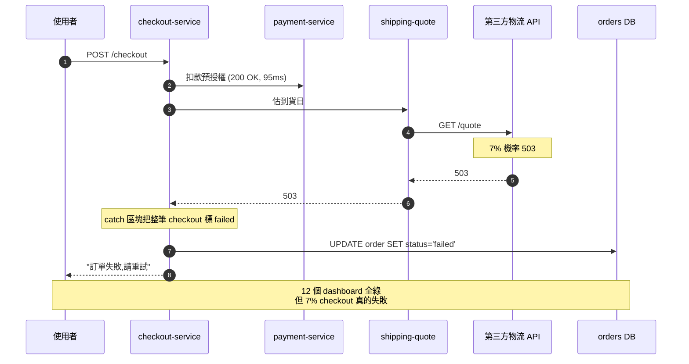
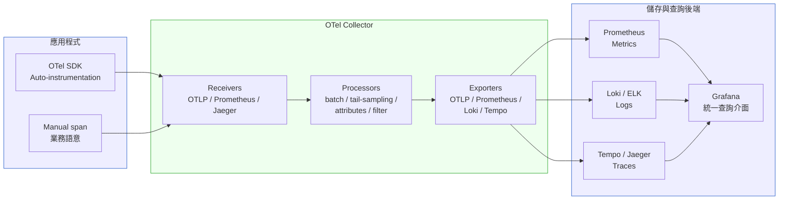
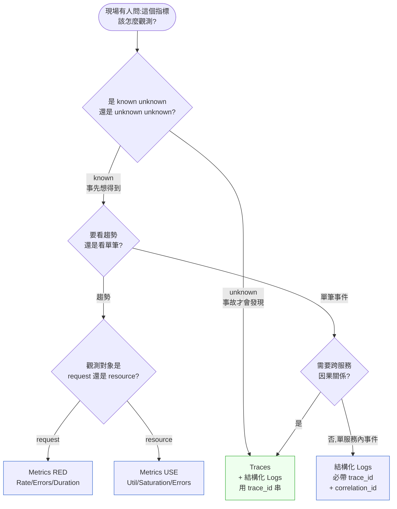

# 第 29 章|可觀測性
## ⸺ OpenTelemetry 與三大支柱不該只是 Dashboard 牆

> **前置閱讀**:[Ch 22 微服務架構](../part-04-architecture/ch-22-microservices.md)、[Ch 24 Kubernetes 實戰](../part-04-architecture/ch-24-cloud-native-kubernetes.md)
> **下游章節**:[Ch 30 SRE 與 SLO](./ch-30-sre-slo-chaos.md)、[Ch 33 ADR](../part-06-engineering/ch-33-adr-architecture-knowledge.md)、[Ch 40 Multi-Agent 系統設計](../part-07-ai-era/ch-40-multi-agent.md)
> **延伸補章**:無

---

## 29.1 冷觀察 ⸺ 12 個 dashboard 全綠,結帳成功率掉 12%

我在 2025 年黑五當天,陪虛構零售平台 **HarborPick**(`CASE-ECM-006`)在新加坡辦公室過了 18 個小時。HarborPick 是一家 GMV 約 6.2 億美元的東南亞綜合電商,42 個微服務跑在 EKS 1.30,觀測棧是 Datadog Pro plan + 自建 Prometheus + ELK,合計每月帳單 4.7 萬美元。SRE team lead 在週會上很驕傲地說:「我們有 12 個 dashboard、217 條 alert rule,全公司最齊。」

那天新加坡時間 21:14,結帳成功率從 96.4% 掉到 84%。SRE on-call 開了 incident channel,把 12 個 dashboard 一個一個點過去:checkout-service P99 80ms、payment-service P99 95ms、inventory-service P99 60ms、cart-service P99 70ms,**全部綠的**。Datadog 的 APM 看板沒有一條 alert,Prometheus 的 SLO burn rate 也沒燒。

事故拖了 2 小時 14 分。最後是有一位 customer success 把 18 通客訴 ticket 整理出來,發現裡面 11 通描述同一件事:「點下『立即結帳』後轉圈 30 秒,然後跳『訂單失敗,請重試』」。再把這 11 個 order_id 丟到 Kibana 撈 log,才發現有 7% 的 checkout 在「呼叫第三方物流 API 估算到貨日」這一步拿到 503,而前端在這個 503 的 catch 裡直接把整個 checkout 標成失敗。

問題的形狀大概是這樣:



事故覆盤會上,VP Engineering 把 Datadog 的截圖貼出來,問了一句話,我把它原樣記下來:

> 「我每個月付 4.7 萬美元給觀測,結果一通客訴比我整面牆還準。我到底買了什麼?」

沒有人答得上來。事後追根因,問題不在 Datadog ⸺ 是 SRE team 兩年前「為了省 cardinality」把 `downstream_partner` 這個 label 從 metrics 拿掉,改用 service name 聚合;Kibana 的 log 沒帶 `trace_id`,沒辦法跟 APM 串起來;APM 的 Trace 採樣率設 1%,7% 失敗率裡只有 0.07% 進得了 Datadog,被 P99 平均掉之後就消失了。**三大支柱都有,但三大支柱沒有 correlation**。

那場事故後,HarborPick 把整個觀測平面用 OpenTelemetry 重做了一次,八個月後再遇到類似事故,從 alert 進來到拿到事故故事,只花了 11 分鐘。這一章要拆的就是這件事:**為什麼 dashboard 多不等於可觀測,以及 OTel 解決的「資料相關性」這個老問題,到底長什麼樣子**。

---

## 29.2 真問題 ⸺ 監控是「事先預期」,可觀測是「事後重組故事」

「我們有監控,所以我們有可觀測性」這句話,在 2025 年之前還能講,2026 年講出來會被內部 SRE 直接糾正。把這件事拆開來看,差異的本質不在工具,在**問題形狀**。

### 29.2.1 Monitoring vs Observability:不是「更高級的監控」

Charity Majors 在 *Observability Engineering*[^CIT-260] 把這個區別講得最清楚:**監控是「我事先想得到的事壞了沒」,可觀測是「事後我能不能回答任意一個我從沒想過的問題」**。前者處理的是 known unknowns,後者處理的是 unknown unknowns。

把這兩個概念並排,差異很具體:

| 維度 | 監控(Monitoring) | 可觀測性(Observability) |
|---|---|---|
| **核心問句** | 「這個指標是不是超標了?」 | 「為什麼這筆請求慢了?」 |
| **設計時假設** | 我知道哪些東西會壞 | 我不知道哪些東西會壞 |
| **資料形態** | 預先聚合的 metrics + dashboard | 高基數原始事件 + 可任意切片 |
| **新問題成本** | 加一張 dashboard、加一條 alert(週級) | 直接下查詢(秒級) |
| **典型工具世代** | Nagios → Zabbix → Prometheus alert rule | Honeycomb / Tempo / SigNoz / Datadog APM |
| **失敗模式** | dashboard 牆但事故時派不上用場 | 資料量大但沒做 correlation,事故時拼不起來 |

這裡要澄清一件容易誤讀的事:**HarborPick 並非沒有監控,而是他們的監控優化得很好 ⸺ 針對的是他們已知的失敗模式**。每個服務的 P99 延遲、error rate、pod CPU,都有對應的 alert rule,而且那天全部正常。問題在於,黑五那天出現的是一種「他們從未在設計監控時想像過的失敗組合」:一個特定第三方 partner 的 503,在一個特定的 catch 區塊裡,以一個完全靜默的方式把 checkout 標成失敗。沒有一張 dashboard 的設計者曾經寫下「假設第三方物流回傳 503,checkout 成功率會怎樣」這個問題。

這才是監控與可觀測性的真正分野:**好的監控能快速發現你預期的故障;可觀測性讓你在意料之外的失敗組合出現時,能夠快速重組事故故事 ⸺ 而不是靠客訴還原現場**。HarborPick 若當初加了一條「downstream_partner_503_rate > 5%」的 alert,這次事故或許可以更早被發現 ⸺ 這說明他們的監控有盲點。但更深層的問題是:**下一次「意外組合」出現時,還是沒有人能在 2 小時內說清楚「為什麼結帳成功率掉了」**。可觀測性要解決的,正是這個重組故事的能力。

### 29.2.2 三大支柱不是「多三種資料」,是「同一個事件的三個切片」

Logs / Metrics / Traces 在 2018 年之前是三套獨立工具:ELK 看 log、Prometheus + Grafana 看 metrics、Jaeger / Zipkin 看 trace。三套各自儲存、各自查詢、事故當下要在三個 UI 之間切視窗手動拼湊。

到 2025 / 2026,業界的共識是:**三大支柱必須收斂為「同一個事件的三個切片」⸺ 用 trace_id 當作共同索引**。這不是「把三個工具放在同一個 UI」(那只是視覺收斂),是「同一筆 checkout 請求在 logs / metrics / traces 三邊都能用同一個 ID 查到」。

換句話說,**三大支柱真正的價值不是各自的內容,是它們之間的 correlation**。可觀測性的目標不是「dashboard 多」,是「事故當下能用一個 trace_id 把因果鏈組合起來」。

這裡要提前說清楚一個重要的邊界條件:**trace_id 作為 correlation 主鍵,只對「被採樣進儲存的 trace」有效**。如果一筆請求的 trace 被採樣規則丟棄,它就不會出現在任何 traces 後端裡 ⸺ 但它對應的 log 事件和 metrics 資料依然存在。這意味著「用 trace_id 重組完整故事」的前提是:事故相關的 trace 有被採樣到。§29.3.3 的 Sampling 策略就是在解決這個前提:**確保重要事件(錯誤、慢請求)的 trace 一定進得了儲存**,而非錯誤地假設「所有 trace 都在」。

| 支柱 | 回答什麼問題 | 強項 | 弱項 |
|---|---|---|---|
| **Metrics** | 「現在系統健康嗎?整體趨勢?」 | 便宜、長期、易聚合 | 沒有 per-request 細節、cardinality 受限 |
| **Logs** | 「這筆請求在 service A 裡發生了什麼事件?」 | 自由文字、無結構限制 | 跨服務難關聯、量大昂貴、無因果 |
| **Traces** | 「這筆請求跨服務走了哪幾步,各花多久?」 | 因果鏈完整、跨服務天然關聯 | 採樣下尾事件易丟、儲存貴 |

這三件事互補,不能互相取代。HarborPick 事故的關鍵就是:**logs 沒帶 trace_id**,metrics 拿掉了 partner 維度,traces 採樣 1% 把長尾事件吞了 ⸺ 三個支柱都在,但三個支柱沒有共同主鍵,事故當下拼不出故事。

### 29.2.3 為什麼會出現「Dashboard 牆但沒人看」這個現象

這件事其實是組織問題,不是技術問題。把它拆開來看,通常長這樣:

1. **指標是事先預期的**。第一張 dashboard 是工程師根據自己想得到的失敗模式畫的,但事故的 90% 是「我沒想到的問題」。
2. **新增 dashboard 比刪除 dashboard 容易**。每次出事就加一張,半年後 dashboard 數量翻倍,但平均看的人沒增加。
3. **Alert 噪音稀釋了 alert 訊號**。一條 alert 一天響三次而 90% 是 false positive,值班的人 30 天後就會把整個 channel 設靜音。
4. **Dashboard 是給人看的,事故是 AI / 自動化先看到的**。2026 年的事故響應越來越多走 SLO burn rate 自動觸發 → AI runbook 第一次診斷 → 人介入。Dashboard 在這個流程裡的角色被擠到很後面。

OpenTelemetry 沒有要解決「組織問題」,但它解決了**資料相關性這個技術前提** ⸺ 一旦資料能被 trace_id 串起來,後面要重組故事、要餵給 AI、要做 SLO 燃燒率,都才有底料。

---

## 29.3 決策框架 ⸺ 三大支柱、Sampling、OTel 拓樸、加哪個支柱

下面這幾張表跟兩張圖,在現場用過很多次。前提是先回答一件事:**你現在問的是「該加什麼支柱」,還是「現有支柱該怎麼讓它能 correlate」**。後者沒做之前,前者一律會浪費錢。

### 29.3.1 三大支柱適用情境表

| 你想回答的問題 | 主要支柱 | 輔助支柱 | 注意事項 |
|---|---|---|---|
| 系統整體健康嗎(可用性、延遲、錯誤率) | Metrics(RED / Golden Signals) | Traces 點開異常時段 | Cardinality 預算先設好 |
| 為什麼這筆 order #12345 失敗了? | Traces + Logs(用 trace_id 串) | Metrics 確認是不是長尾 | Logs 必須帶 trace_id |
| 第三方 partner X 最近表現怎樣? | Metrics(以 partner 為 label) | Traces filter by partner | partner 維度的 cardinality 要評估 |
| 機器資源用量(CPU / Memory / Disk) | Metrics(USE 模型) | Logs OS 層事件 | host / pod 級指標分開 |
| 一筆使用者操作從前端走到 DB 經過哪些 hop? | Traces(Distributed Tracing) | Logs 補事件細節 | Trace context 必須跨服務傳遞 |
| 業務 KPI(GMV、checkout success rate) | Metrics(業務面) | Logs 補事件、Traces 補 root cause | 業務指標獨立 dashboard,不混技術指標 |

這張表的用法不是「背下來」,是**每次有人說「我們需要加觀測」時,先問是哪個問題,再決定加哪個支柱**。三個支柱混著加是 HarborPick 那種帳單。

### 29.3.2 RED vs USE vs Golden Signals 對照

Metrics 模型不是只有一種。三種主流模型對應三種觀測對象,不是替代關係:

| 模型 | 提出者 | 觀測對象 | 三 / 四個指標 | 適用情境 |
|---|---|---|---|---|
| **RED** | Tom Wilkie(Weaveworks)[^CIT-261] | Request-driven 服務 | **R**ate(每秒請求數)、**E**rrors(錯誤率)、**D**uration(延遲分佈) | HTTP / gRPC 服務、API 層 |
| **USE** | Brendan Gregg(Netflix)[^CIT-262] | Resource(機器層) | **U**tilization(使用率)、**S**aturation(飽和度)、**E**rrors(錯誤) | CPU / Memory / Disk / Network |
| **Golden Signals** | Google SRE Book[^CIT-263] | 端到端服務 | **L**atency、**T**raffic、**E**rrors、**S**aturation | 複合視角、SLO 設計起點 |

現場常用的拇指法則:**API 服務先做 RED、機器層做 USE、跨服務 SLO 用 Golden Signals**。三個都做完才算 metrics 完整。HarborPick 黑五那天只有 RED 與 USE,Golden Signals 裡的 Saturation(第三方依賴)沒做 ⸺ 第三方物流 API 在 saturation 端的訊號一直沒被觀測到。

### 29.3.3 Sampling 策略對照(2026 視角)

Trace 採樣是觀測棧裡最容易出事的地方。「便宜地取得有用的 trace」這個問題,2026 年有三種主流策略,差距很大:

| 策略 | 何時決定 | 成本 | 適合場景 | 風險 |
|---|---|---|---|---|
| **Head-based**(頭採樣) | 在 trace 開始時就決定要不要採 | 低(SDK 端決策) | 流量穩定、長尾事件少的系統 | 採樣率低時尾事件徹底丟失 |
| **Tail-based**(尾採樣) | trace 完整收集後才決定要不要保留 | 高(Collector 要 buffer 整條 trace) | 需要保留錯誤、慢請求、特定條件 trace | Collector 記憶體與運維複雜度 |
| **Hybrid**(混合) | head 採大樣 + tail 補關鍵長尾 | 中 | 大規模、預算敏感、又要保留邊緣事件 | 兩套規則要協調 |

Honeycomb[^CIT-264] 在 2024 年的研究指出,**Tail-based Sampling 在大規模系統下是「能不能看到事故根因」的決定性差異**。HarborPick 用的是 head-based 1% 採樣,7% 失敗事件在採樣後幾乎全部丟失。改成 tail-based「100% 保留 status_code >= 500、duration > 2s、特定 partner 的 trace,其餘 baseline 1%」之後,事故定位時間從 2 小時 14 分降到 11 分鐘。

這裡有一個關鍵的架構問題必須直面:**剩下那 93% 的正常 trace 被丟棄之後,correlation 怎麼辦?** 答案是:被丟棄的 trace 確實無法用 trace_id 在 traces 後端查到,但這並不表示它們「消失了」⸺ 有三條機制確保 correlation 在 sampled-out trace 上仍然有意義:

1. **Metrics 是聚合資料,不依賴 trace 被採樣**。結帳成功率、partner 可用率這類 RED 指標,每筆請求都貢獻數值,與 trace 採樣無關。Metrics 告訴你「背景流量的整體健康狀況」。
2. **結構化 log 帶 trace_id,即使 trace 被丟棄,log 仍然存在**。如果你把 `trace_id` 寫進每一行結構化 log(反模式 1 的修正方向),事後可以用 `trace_id` 在 Loki/ELK 搜尋到對應的 log ⸺ 即使這條 trace 沒有進 Tempo。這是「部分 correlation」,拿不到跨服務的 span 鏈,但能看到事件序列。
3. **Baseline 採樣保留統計代表性**。`random-baseline: 1%` 的目的不是「保留所有正常請求的故事」,而是「讓 P50 / P95 基準線不會因為全部丟棄而失真」。事故當下你關心的不是 99% 的正常請求細節,而是異常請求的 trace。

結論是:**Tail-based sampling 是一種刻意的取捨:高保真重組事故故事(100% 保留錯誤 trace),換取對正常背景流量的統計代表性(1% baseline)加上 log 層的事件記錄**。如果你的場景需要對正常請求也做高保真 correlation(例如效能優化、A/B 分析),就需要提高 baseline 採樣率或改用 Hybrid 策略,成本會相應增加。

現場常用的判準:**日均 trace > 1 億條就該認真考慮 tail-based**。低於這個量級,head-based 高採樣率(5–10%)+ 把錯誤 / 慢請求設 always sample,通常就夠用。Tail-based 的運維成本不低(Collector 需要 buffer 整條 trace 才能決策,§29.3.6 的 `decision_wait: 10s` 代表記憶體裡暫存最多 10 秒的 trace),引入前要評估 Collector 的記憶體預算。

### 29.3.4 OpenTelemetry 架構

OpenTelemetry(OTel)2024 年達到 CNCF Graduated 等級[^CIT-265],到 2026 年已經是事實上的儀表化標準。它的架構大致長這樣:



OTel 設計的精神有三條:**API / SDK / Collector 解耦,後端可換,語意公約統一**。這意味著:

- 應用程式只認 OTel API,後端從 Datadog 換到 Grafana LGTM[^CIT-266] 不需要改一行業務碼。
- Collector 是中間層,所有 transformation(採樣、過濾、加 label、降基數)都在這裡做,不污染應用。
- Semantic Conventions 統一 attribute key 名(`http.method`、`db.system`、`messaging.system`),跨團隊跨服務不需要約定方言。

這三條是 OTel 解決「跨工具資料相關性」的核心設計。HarborPick 重做之後選的是 Grafana LGTM Stack(Loki + Grafana + Tempo + Mimir),APM 替換成 SigNoz[^CIT-267],月度帳單從 4.7 萬美元降到 1.8 萬,但 correlation 能力反而變強。

### 29.3.5 Distributed Tracing:Trace ID / Span ID / Baggage

OTel 的 trace 模型有三個核心概念:

- **Trace ID**:128-bit,代表一筆完整的「使用者請求」⸺ 從前端進來到所有下游處理完。
- **Span ID**:64-bit,代表「這筆請求在某一個服務裡的一段操作」(e.g. 一次 DB 查詢、一次外部 API 呼叫)。
- **Baggage**:key-value pairs,跟著 trace 沿著呼叫鏈傳遞,讓下游服務能拿到上游語意(e.g. `user.tier=premium`、`order.country=SG`)。

跨服務傳遞用 W3C Trace Context[^CIT-268] 標準的 `traceparent` header,所有 OTel SDK 預設處理。但 Baggage 要工程師主動 set ⸺ 這是讓下游服務能做「依語意採樣」「依語意路由」的關鍵。

實作上,Auto-instrumentation 已經能涵蓋 80% 的常見 framework(HTTP、gRPC、DB driver、message queue),剩下 20% 的業務語意需要 manual span:

```python
# Python 3.13 + opentelemetry-api 1.28
from opentelemetry import trace, baggage
from opentelemetry.context import attach, detach

tracer = trace.get_tracer(__name__)

def checkout(order_id: str, user: User):
    with tracer.start_as_current_span("checkout") as span:
        # 業務語意 attribute(進 trace,可被搜尋)
        span.set_attribute("order.id", order_id)
        span.set_attribute("user.tier", user.tier)
        span.set_attribute("order.total_usd", float(user.cart_total))

        # Baggage(會跟著 trace 傳到下游所有服務)
        ctx = baggage.set_baggage("user.tier", user.tier)
        token = attach(ctx)
        try:
            reservation = inventory.reserve(order_id)        # auto-instrumented
            charge_id = payment.charge(user.id, user.cart_total)  # auto-instrumented
            quote = shipping.estimate(order_id)              # auto-instrumented
            return OrderResult.confirmed(order_id)
        except ShippingQuoteError as e:
            # 語意明確的錯誤標記
            span.set_status(trace.Status(trace.StatusCode.ERROR))
            span.record_exception(e)
            span.set_attribute("error.kind", "third_party_shipping_503")
            raise
        finally:
            detach(token)
```

這段程式碼的精神不是「OTel SDK 多厲害」,**是「業務語意被顯式寫進 trace」**。`error.kind=third_party_shipping_503` 這個 attribute,事故當下可以用一條查詢撈出所有受影響的 trace、所有 user.tier 分佈、所有 order.country 分佈。沒有這個 attribute,黑五那次事故的根因要靠 customer success 整理客訴。

### 29.3.6 OTel Collector Pipeline 配置範例

Collector 是 OTel 拓樸的心臟。下面這段是 HarborPick 用的 tail-sampling 配置(`otel-collector-config.yaml`,OTel Collector 0.110+):

```yaml
receivers:
  otlp:
    protocols:
      grpc:
        endpoint: 0.0.0.0:4317
      http:
        endpoint: 0.0.0.0:4318

processors:
  batch:
    timeout: 5s
    send_batch_size: 1024

  # 降基數:把 user_id 從 attribute 拿掉,避免 cardinality 爆
  attributes/redact:
    actions:
      - key: user.id
        action: delete
      - key: session.id
        action: delete

  # Tail-based sampling:錯誤、慢請求、特定 partner 100% 保留
  tail_sampling:
    decision_wait: 10s
    num_traces: 100000
    policies:
      - name: errors-policy
        type: status_code
        status_code: { status_codes: [ERROR] }
      - name: slow-policy
        type: latency
        latency: { threshold_ms: 2000 }
      - name: shipping-partner-policy
        type: string_attribute
        string_attribute:
          key: shipping.partner
          values: [partner-a, partner-b, partner-c]
      - name: random-baseline
        type: probabilistic
        probabilistic: { sampling_percentage: 1 }

exporters:
  otlp/tempo:
    endpoint: tempo:4317
    tls: { insecure: true }
  prometheus:
    endpoint: 0.0.0.0:8889
  loki:
    endpoint: http://loki:3100/loki/api/v1/push

service:
  pipelines:
    traces:
      receivers: [otlp]
      processors: [attributes/redact, tail_sampling, batch]
      exporters: [otlp/tempo]
    metrics:
      receivers: [otlp]
      processors: [batch]
      exporters: [prometheus]
    logs:
      receivers: [otlp]
      processors: [batch]
      exporters: [loki]
```

這份配置的精神有三條:**降基數在 Collector 統一做、tail-sampling 規則寫進 yaml 而不是寫進 SDK、三大支柱進不同 pipeline 但共用 receivers**。降基數寫在這裡,而不是寫在每個 service 的 SDK,意味著「拿掉 user_id」是平台決策不是業務決策 ⸺ 這個分工很重要,§29.4 反模式 3 會講。

### 29.3.7 「這次該加哪一個支柱」決策樹



這張圖的關鍵是右上那條路徑:**unknown unknown 的問題只能用 traces + 結構化 logs 解**。Metrics 永遠回答不了「我從來沒想到的失敗模式」,因為 metrics 的 cardinality 預算迫使你必須事先選好維度。「事先選好」就已經排除了 unknown unknown。

### 29.3.8 SLI / SLO / SLA / Error Budget(下游 Ch 30 接續)

可觀測性是 SRE 文化的前提,不是 SRE 本身。把這四個概念釐清:

- **SLI**(Service Level Indicator):可量測的指標(e.g. 成功率、P99 延遲)。
- **SLO**(Service Level Objective):對 SLI 的目標(e.g. 99.9% 可用性)。
- **SLA**(Service Level Agreement):對外承諾,違反有合約後果。
- **Error Budget**:`100% - SLO`,是「允許犯錯的預算」(99.9% SLO ⇒ 月度 43 分鐘 error budget)。

可觀測性提供 SLI 的原始資料,SLO / Error Budget 是這份資料的政策層。Ch 30 會把這條接完,本章只把可觀測性與 SLI 的關係講清楚:**沒有可觀測性,SLO 沒有可信的 SLI;沒有 correlation,SLI 拿來算 SLO 也只是數字遊戲**。

---

## 29.4 踩坑清單

下面這四個常見地雷,在 ecommerce、fintech、saas 都看得到。它們的共同點是:**形式上做了三大支柱,但實質上沒有產生「事故當下能重組故事」的能力**。每個都附修正方向,下次遇到可以這樣處理。

### 反模式 1:Logs 沒做 correlation ID(事故時拼不起來)

每個 service 各自吐 log,JSON 結構也都對,但沒有任何一條 log 帶 `trace_id` 或 `correlation_id`。事故當下要找「order #12345 在 service B 那邊發生了什麼」,只能用時間範圍 + service 名 + 模糊字串搜,半小時撈不到。HarborPick 黑五那次,要靠人工把 18 通客訴的 order_id 對到 Kibana,就是這個反模式。

> ✅ **修正方向**:所有結構化 log 強制 `trace_id`、`span_id`、`correlation_id` 三個欄位(correlation_id 用於跨非同步邊界的事件鏈)。SDK 層用 OTel logging instrumentation 自動注入,業務碼不需要手動加。Fitness function 在 CI 跑「隨機抽 100 筆 log,trace_id 覆蓋率 < 99% 擋 PR」。判準:任何事故,5 分鐘內能用 trace_id 把 logs / metrics / traces 三邊串起來;串不起來就是這條沒做。

### 反模式 2:所有東西都採樣 1%(尾事件徹底丟失)

「我們流量大,所以 trace 採樣率設 1%」⸺ 這句話在工程會議上很常見。問題是:**事故 90% 是長尾事件**,尾事件在 1% head-based 採樣下保留比例可能只有 0.01%,等於沒有。HarborPick 7% 的 checkout 失敗,在 1% 採樣下只有 0.07% 進得了 APM,被 P99 平均之後完全消失。

> ✅ **修正方向**:採樣策略分三層:(1)錯誤、慢請求(> P99)、特定關鍵屬性 100% 保留;(2)正常請求 head-based 高採樣率(視成本訂 5–10%);(3)流量極大時用 tail-based 在 Collector 端決策。Tail-based 規則寫在 Collector yaml(§29.3.6 範例),不寫在 SDK。判準:每月做一次「事故 trace 是否被採到」回測,如果有事故的關鍵 trace 沒進儲存,sampling 規則就要加。

### 反模式 3:Metrics cardinality 爆炸(label 用 user_id)

Prometheus(或任何 TSDB)的成本與 cardinality 成超線性關係。把 `user_id`、`session_id`、`order_id` 設成 label,半年後資料庫炸掉,Prometheus 進入 OOM 重啟循環。常見的反向版本是「為了省 cardinality 把 partner 維度拿掉」⸺ HarborPick 兩年前就是這樣,結果黑五那天看不到第三方 partner 的飽和度。

> ✅ **修正方向**:cardinality 預算是平台級決策,不是業務級決策。原則:(1)高基數 ID(user_id / order_id / trace_id)走 logs / traces 不走 metrics;(2)中基數維度(country / partner / tier)上 metrics,但定期 review;(3)低基數維度(http_method / status_class)隨意。Collector 的 attributes processor 統一執行降基數規則(§29.3.6 範例),禁止應用層自己決定。判準:每季 audit 一次 metrics cardinality,top 10 高基數 metric 都要有人說明為什麼這樣設。

### 反模式 4:Dashboard 多但沒人看(警報疲乏)

Datadog / Grafana 上 47 張 dashboard,每天看的不到 3 張;217 條 alert 每天響 80 次,90% 是 false positive,值班 channel 早就被靜音。這個現象的根因不是 dashboard 太多,是**沒有刪除機制** ⸺ 每次出事就加,從來沒有人去 review 哪些可以下架。

> ✅ **修正方向**:dashboard / alert 同樣納入版本控制(`observability/` 資料夾,Grafana JSON / Prometheus rule yaml),每季做一次「Observability 體檢」:dashboard 過去 30 天打開次數 < 3 次的,提案下架(類似 ADR superseded 機制);alert 過去 30 天 false positive > 70% 的,要嘛改條件、要嘛刪除。SLO-based alert(燃燒率)優先於 threshold-based alert ⸺ Google SRE Workbook 的 multi-window multi-burn-rate 模型在 2026 年是預設值。判準:on-call 工程師每週能說出「這週 alert channel 響了幾次,有幾次是真事故」,答不出來就是疲乏到家了。

### 對 AI Agent observability 的補充

2026 年的觀測還多了一個對象:**AI Agent / LLM 應用本身**。LangSmith、Langfuse、Phoenix(Arize)[^CIT-269] 這幾個工具處理的是「prompt → response → tool call」這條鏈的可觀測性,本質上是 distributed tracing 在 AI 領域的特化版。Trace 模型一致(trace_id / span_id / 父子關係),但每個 span 的 attribute 多了 `llm.model`、`llm.tokens.input`、`llm.tokens.output`、`llm.cost.usd`、`tool.name`。OTel 在 2025 年發布 GenAI Semantic Conventions[^CIT-265],把這套 attribute 標準化,意味著 LangSmith / Langfuse / Phoenix 與既有的 APM 後端之間,2026 年開始可以用 OTel 統一資料平面。Ch 40 會把這條接完。

---

## 29.5 交付清單 ⸺ 一頁式 Observability Plane Card

每一個系統(單一服務或一整組微服務拓樸),**先寫一張 Observability Plane Card 再開新的 dashboard**。它不是文件,是觀測平面的設計規格 ⸺ 把三大支柱的投資配比、Sampling 策略、Cardinality 預算、SLI 列表寫具體,寫不滿一頁就是還沒想清楚這個系統該怎麼觀測。

把它存在 `docs/observability/<service-or-system>.md`,跟 ADR 同層、跟 SLO 文件雙向連結。

````markdown
# Observability Plane Card — {系統 / 服務名稱}

> 版本:v0.1 | 撰寫日期:YYYY-MM-DD | Owner:{platform-team / service-team}
> 對應 ADR:`docs/adr/00NN-observability-plane.md`

## 1. 系統邊界(這份 card 涵蓋什麼)
- 涵蓋服務:
- 不涵蓋(out of scope):
- 上下游依賴(對外觀測介面):

## 2. 三大支柱投資配比
| 支柱 | 工具 / 後端 | 月度預算(USD) | 主要回答的問題 |
|---|---|---|---|
| Metrics | Prometheus / Mimir | | RED / USE / Golden Signals |
| Logs | Loki / ELK | | 業務事件、錯誤上下文 |
| Traces | Tempo / Jaeger / SigNoz | | 跨服務因果鏈、unknown unknown |
| Collector | OTel Collector | | 中介層、降基數、tail-sampling |
> 配比原則:Traces 預算佔總體 30–50%(2026 視角)。Logs 不該超過 30%。

## 3. Sampling 策略
- **Head-based**(SDK 端):
  - 預設採樣率:____%
  - 例外規則:健康檢查 0%、debug header 100%
- **Tail-based**(Collector 端):
  - 100% 保留條件:status_code >= 500 / latency > {threshold} / 特定 attribute
  - Baseline:____%
- **AI Agent 鏈**(若適用):一律 100% trace,但 prompt 內容 redact PII

## 4. Cardinality 預算
| 指標類型 | 允許的 label 維度 | 禁止的 label 維度 | Owner |
|---|---|---|---|
| HTTP RED | service / route / status_class / method | user_id / session_id / order_id | platform |
| 業務 KPI | country / partner / tier | user_id 個案除外需審 | service |
| 資源 USE | host / pod / cluster | container instance id 短期 | platform |
> 高基數維度走 traces / logs,不上 metrics。每季 audit cardinality top 10。

## 5. SLI 列表(對應 SLO 在 Ch 30)
| SLI 名 | 定義(Good event / Total event) | 資料來源 |
|---|---|---|
| 結帳成功率 | 2xx checkout response / total checkout | Trace (filter by route=/checkout) |
| 結帳 P99 latency | percentile_99(checkout duration) | Metrics(RED) |
| 第三方 partner 可用率 | (total - 5xx) / total per partner | Metrics(以 partner 為 label) |

## 6. 警報原則
- ✅ SLO 燃燒率(multi-window: 1h fast burn + 6h slow burn)優先於閾值告警
- ✅ 每條 alert 必有對應的 runbook 連結
- ✅ False positive > 70%(過去 30 天)的 alert 強制 review
- ❌ 不接受「先加 alert,之後再調」這種承諾
- ❌ 不接受沒有 owner 的 alert

## 7. Correlation 強制檢查(CI Fitness Function)
- ☐ 所有結構化 log 帶 `trace_id` 覆蓋率 ≥ 99%
- ☐ 所有 outbound RPC 傳遞 W3C `traceparent` header
- ☐ 業務 attribute 使用 OTel Semantic Conventions(`http.*`、`db.*`、`messaging.*`)
- ☐ 高基數欄位不出現在 metrics label

## 8. Owner
| 區塊 | Owner |
|---|---|
| Collector 運維 | platform-team |
| SDK 升級節奏 | platform-team |
| Sampling 規則 | platform-team(諮詢 service-team) |
| 業務 attribute 設計 | service-team |
| SLI / SLO 定義 | service-team(諮詢 SRE) |
| Dashboard 整理(每季) | platform-team + service-team |
````

**為什麼是一頁?** 一頁的篇幅會逼出選擇。寫不滿三大支柱投資配比那一節,通常意思是預算其實沒人管,事故當下會用「直覺」買工具。寫不出 cardinality 預算那一節,通常意思是 metrics 已經在朝 OOM 走了。

**為什麼要 Correlation 強制檢查?** 因為三大支柱有沒有 correlation,事後是看不出來的 ⸺ 直到事故當下才會發現「對不起來」。把它寫成 CI fitness function,等於把「資料相關性」這件事從「事後檢討的依據」變成「PR 階段的擋板」。HarborPick 重做之後第一件加進 CI 的就是「trace_id 在 log 裡的覆蓋率」這條 check。

**為什麼 Owner 要分這麼細?** 因為觀測的失敗 90% 來自分工模糊:「降基數」沒人做、「SDK 升級」沒人做、「dashboard 整理」沒人做,各自以為是別人的事。把 Owner 寫進 card,後面的能力建設才有人推。

### 29.5.1 範例:HarborPick 黑五事故後重做的那一頁

HarborPick(`CASE-ECM-006`)那 18 個小時的事故覆盤之後,SRE team 把整個觀測平面用 OTel 重做。下面這份是他們重做完成、第二次黑五前一個月貼在 wiki 首頁的版本:

````markdown
# Observability Plane Card — checkout-flow(EKS, prod-sg)

> 版本:v1.2 | 撰寫日期:2026-09-04 | Owner:platform-team(主)+ checkout-team(諮詢)
> 對應 ADR:`docs/adr/0027-otel-tail-sampling.md`

## 1. 系統邊界
- 涵蓋:checkout-service / payment-service / shipping-quote / inventory-service / cart-service
- 不涵蓋:推薦、行銷、客服(各自獨立 card)
- 對外介面:三家物流 partner(Ninjavan / J&T / SingPost)、Stripe、PayPal SG

## 2. 三大支柱投資配比
<!-- 為什麼這欄:事故前每月 4.7 萬美元沒人管細項,traces 預算實質只有 6%。 -->
| 支柱 | 工具 | 月度預算 | 主要回答 |
|---|---|---|---|
| Metrics | Prometheus + Mimir | USD 9,000 | RED / Golden Signals |
| Logs | Loki(從 ELK 遷) | USD 8,000 | 業務事件、錯誤上下文 |
| Traces | Tempo + Datadog APM(雙寫過渡) | USD 14,000 | 跨服務因果鏈 |
| Collector | OTel Collector(self-host) | USD 1,200 | tail sampling、降基數 |

## 3. Sampling 策略
<!-- 為什麼這欄:事故那天 7% 的 5xx 在 1% head sampling 下只剩 0.07%,整個被平均掉。 -->
- Head-based:預設 5%(健康檢查 0%、debug header 100%)
- Tail-based:status_code >= 500 100%、checkout latency > 2s 100%、其餘 baseline 3%
- AI Agent:商品搜尋 LLM rerank 鏈 100% trace,prompt redact PII

## 4. Cardinality 預算
<!-- 為什麼這欄:事故後新加的 downstream_partner label 之前被砍了,要寫進預算才不會再被誰一刀砍掉。 -->
| 指標 | 允許 label | 禁止 label |
|---|---|---|
| HTTP RED | service / route / status_class / method / **downstream_partner** | user_id / order_id |
| 業務 KPI | country / partner_tier | user_id |

## 5. SLI 列表
| SLI | 定義 | 來源 |
|---|---|---|
| 結帳成功率 | 2xx / total checkout(per partner) | Trace filter |
| 結帳 P99 | percentile_99(checkout span duration) | Metrics |
| 物流 partner 可用率 | (total - 5xx) / total per partner | Metrics |

## 7. Correlation 強制檢查(CI)
<!-- 為什麼這欄:這條是 8 個月後 11 分鐘破案的關鍵,值得寫進 PR block。 -->
- [x] 結構化 log 帶 `trace_id` 覆蓋率 ≥ 99%(目前 99.7%)
- [x] 所有 outbound RPC 傳遞 W3C `traceparent` header
- [x] 高基數欄位不出現在 metrics label(每週 audit cardinality top 10)
````

HarborPick 第二次黑五那天又出了一次第三方物流的事 ⸺ 但這次從 alert 進來到拿到完整事故故事,11 分鐘。**一張卡治不好觀測,但寫不出這張卡的團隊,事故當下會在 12 個 dashboard 之間繼續找答案**。

---

## 29.6 本章交付清單 Recap

讀完本章,你應該已經能做到:

- [ ] 講清楚「監控是 known unknowns,可觀測是 unknown unknowns」⸺ 三大支柱的真正價值是 correlation,不是「擁有三種資料」。看到團隊在「dashboard 多 = 觀測強」這個誤解上,能在會議上指出差別
- [ ] 用 §29.3.1 三大支柱適用情境表 + §29.3.7 決策樹回答「這個觀測需求該加哪個支柱」⸺ unknown unknown 一律配 traces + 結構化 logs,known + 趨勢才上 metrics
- [ ] 看到 1% 全採樣、log 沒 trace_id、metrics label 用 user_id、dashboard 牆但沒人看 ⸺ 能對應到本章四個反模式的修正方向
- [ ] 為手上的服務寫好一張 Observability Plane Card,把三大支柱投資配比、Sampling 策略、Cardinality 預算、SLI 列表、警報原則、Correlation 強制檢查寫具體;沒寫好的 card 先不要再加 dashboard

四項中先挑一項做完就好,建議從最後那一項 ⸺ **把現有觀測棧的 Plane Card 補一張,寫不出 Cardinality 預算或寫不出 Correlation 檢查的那個區塊,就是這次該優先補的方向**。Ch 30 會把 SRE / SLO / Error Budget 接完,讓這份 SLI 變成可執行的政策;Ch 33 會講 ADR 怎麼把觀測決策制度化;Ch 40 會把 AI Agent observability 接到同一個 OTel 平面 ⸺ 三大支柱的故事在 2026 年又多了 LLM 這條鏈,但底層機制是一樣的。

---

## Cross-References

- **回顧**:[Ch 22 微服務架構](../part-04-architecture/ch-22-microservices.md) ⸺ 微服務的觀測稅金在這裡付;[Ch 24 Kubernetes 實戰](../part-04-architecture/ch-24-cloud-native-kubernetes.md) ⸺ K8s 拓樸下的觀測注入
- **下一章**:[Ch 30 SRE 與 SLO](./ch-30-sre-slo-chaos.md) ⸺ 把本章的 SLI 接成 SLO / Error Budget / 燃燒率告警
- **決策制度化**:[Ch 33 架構決策紀錄(ADR)](../part-06-engineering/ch-33-adr-architecture-knowledge.md) ⸺ 觀測棧選型、Sampling 策略寫成 ADR
- **AI Agent 觀測**:[Ch 40 Multi-Agent 系統設計](../part-07-ai-era/ch-40-multi-agent.md) ⸺ LLM trace 接到同一個 OTel 平面

## 引用

[^CIT-260]: Charity Majors, Liz Fong-Jones & George Miranda, *Observability Engineering* (O'Reilly, 2022)。可觀測性與監控的本質區分。
[^CIT-261]: Tom Wilkie, "The RED Method: How to Instrument Your Services" (Weaveworks Blog, 2018)。
[^CIT-262]: Brendan Gregg, "The USE Method" — brendangregg.com/usemethod.html(2012 起持續更新)。
[^CIT-263]: Betsy Beyer 等, *Site Reliability Engineering* (O'Reilly, 2016) Ch 6 "Monitoring Distributed Systems";Four Golden Signals 章節。
[^CIT-264]: Honeycomb Engineering, "Tail-Based Sampling: A Cost-Effective Way to Capture Important Traces" (2024)。
[^CIT-265]: CNCF OpenTelemetry Specification 1.x — opentelemetry.io/docs/specs/。2024 Graduated;2025 GenAI Semantic Conventions。
[^CIT-266]: Grafana Labs, "The LGTM Stack: Loki, Grafana, Tempo, Mimir" — grafana.com/oss/lgtm-stack。
[^CIT-267]: SigNoz, "OpenTelemetry-Native APM" — signoz.io;Dash0 替代方案 — dash0.com。
[^CIT-268]: W3C, "Trace Context Recommendation" — w3.org/TR/trace-context/(2020 W3C Recommendation)。
[^CIT-269]: LangSmith / Langfuse / Arize Phoenix — LLM 應用可觀測性。Langfuse 採 OTel-compatible 設計;OTel GenAI SemConv 為共同標準。

---
