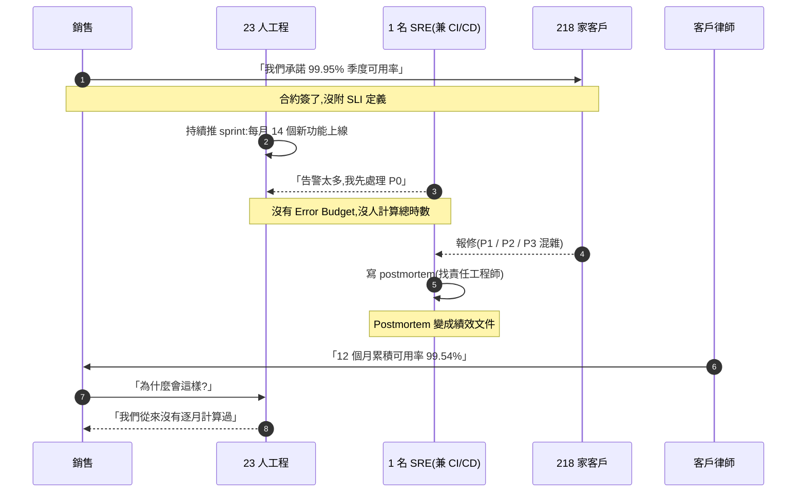
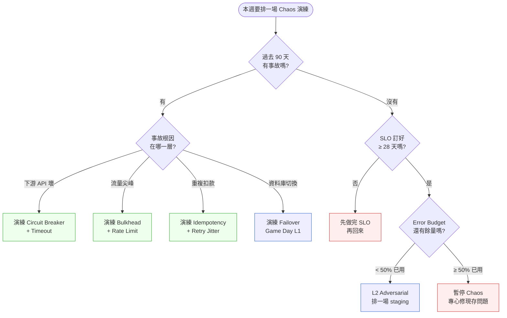
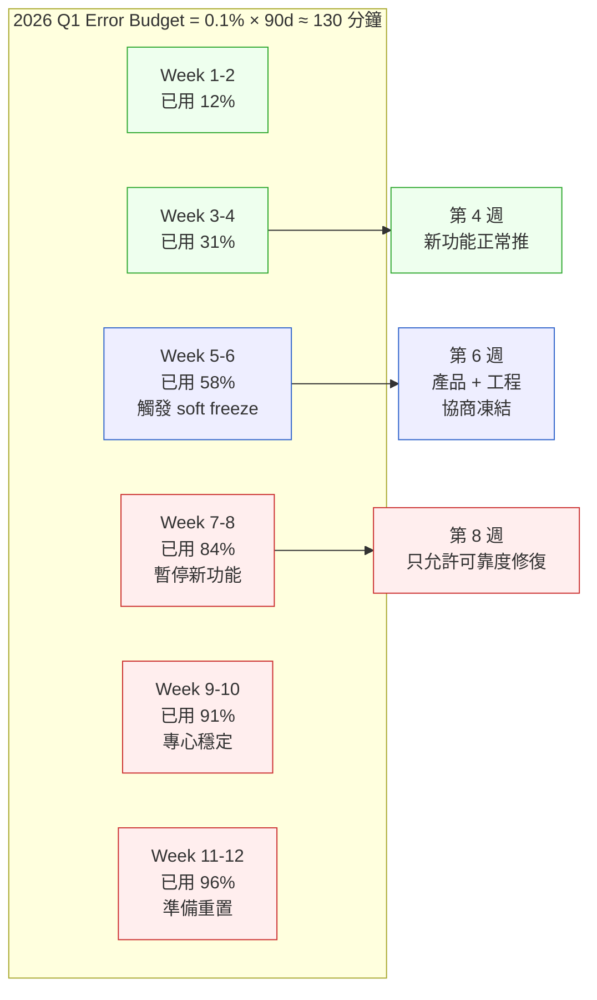

# 第 30 章|SRE、SLO、Chaos Engineering
## ⸺ 可靠度不是天上掉下來,是用 Error Budget 換來的

> **前置閱讀**:[Ch 22 微服務拆分判準](../part-04-architecture/ch-22-microservices.md)、[Ch 24 雲端原生與 Kubernetes](../part-04-architecture/ch-24-cloud-native-kubernetes.md)、[Ch 29 Observability](./ch-29-observability-otel.md)
> **下游章節**:[Ch 35 FinOps 與 ADR 整合](../part-06-engineering/ch-35-finops-green-software.md)、[Ch 44 AI 系統的測試與評估](../part-07-ai-era/ch-44-ai-eval-drift-redteam.md)
> **延伸補章**:[Ch 26 邊緣 / OT-IT](../part-04-architecture/ch-26-edge-ot-it.md)

---

## 27.1 冷觀察 ⸺ 99.95% 寫在合約上、99.62% 跑在現實裡

我在 2025 年第四季,陪一家虛構多租戶 B2B SaaS **PolicyPilot**(`CASE-SAS-006`)做事故覆盤。產品是一套「給保險經紀公司的核保與佣金中台」,客戶 218 家、其中 14 家是排名前 50 的大型經紀商、ARR 1,180 萬美元、工程團隊 23 人(含一位掛著 SRE 頭銜、實際同時管 CI/CD 與 on-call 的工程師)。

合約裡寫著一條被銷售反覆引用的條款:

> **Service Availability ≥ 99.95% per calendar quarter, measured at the API Gateway. Breach triggers credit equal to 10% of MRR per percentage point below 99.95%, capped at 30%.**

99.95% 一季,允許停機時間是 1 小時 5 分鐘。銷售在 RFP 階段把這條當競爭武器,工程在合約過期那一刻才看到。**這份合約沒有附 SLI 定義、沒有附量測方式、沒有任何 Error Budget 機制**。

然後是過去 12 個月的真實數字。把它壓成一張表,大概長這樣:

| 季度 | 合約 SLO | 實際可用率 | 差距(分鐘) | 大客戶賠款(USD) |
|---|---|---|---|---|
| 2024 Q4 | 99.95% | 99.71% | 31 | 0(沒人提) |
| 2025 Q1 | 99.95% | 99.58% | 47 | 0(沒人提) |
| 2025 Q2 | 99.95% | 99.43% | 73 | 18,400(2 家提了) |
| 2025 Q3 | 99.95% | 99.62% | 49 | 47,200(7 家提了)|
| 2025 Q4 | 99.95% | 99.36% | 84 | 102,800(11 家提了)|

12 個月加總可用率 99.54%,合約寫的是 99.95%。第四季最大一家客戶(年費 38 萬美元)發來律師函,引用合約第 11.3 條,要求 30% 上限的賠款 + 解約權。整年累計賠款 168,400 美元,**接近一個資深工程師的全年薪資**。

董事會在覆盤會上問了一句話,我把它原樣記下來:

> 「我們花了一整年的時間在『救火』,結果發現我們連火有多大都沒在量。我們是在拿什麼跟客戶承諾 99.95%?」

把這 12 個月壓成一張時序圖,大概長這樣:



這不是工程能力的問題。PolicyPilot 的工程師都是有經驗的人,寫得出 K8s YAML、跑得起 ArgoCD、會看 Grafana。**問題是「可靠度從來不是團隊的工作項目」**。它沒有預算、沒有 owner、沒有量測、沒有交易機制。它只是在每一場事故後出現幾個小時,然後消失到下一場事故。

Google SRE Book [^CIT-270] 在 2016 年寫過一句被引用很多次的話:

> *「Hope is not a strategy. The cost of reliability is not optional — you either pay it deliberately, or you pay it as outage and customer churn.」*

PolicyPilot 是後者。168,400 美元的賠款 + 一家大客戶解約,是他們**沒花的可靠度預算**的延後帳單。

---

## 27.2 真問題 ⸺ Error Budget 是上線速度與可靠度的可協商預算

「我們要不要做 SRE?」這個問題,在 218 家客戶這個規模的 SaaS 公司會被問,但通常被問錯了。把它拆開來看會比較清楚:**這個問題把三件事偷偷綁在一起**。一件是「要不要量化可靠度」,一件是「要不要把可靠度變成預算」,一件是「要不要設一個叫 SRE 的職位」。前兩件是工程文化問題,第三件是組織結構問題。把它們一起問,答案就會被「再招一個人」帶著跑。

### 27.2.1 SRE 的核心不是「值班」,是「可靠度被當成功能管理」

回到原典。Google SRE Book [^CIT-270] 與 SRE Workbook [^CIT-271] 的核心命題不是「找一群人來值班」,是**把可靠度當成一個可量化、可預算化、可交易的工程屬性**,跟功能、效能、安全並列為產品的非功能需求,然後用工程方法管理它。

Mikey Dickerson(前 Google SRE,US Digital Service 創辦人)畫過一張 SRE 金字塔 [^CIT-272],由下而上是:Monitoring → Incident Response → Postmortem & Root Cause → Testing & Release Procedures → Capacity Planning → Development → Product。這張圖的關鍵不是各層內容,是**順序**:

> 一個團隊如果還沒做好監控,就先做混沌工程;還沒做好事後檢討,就先做容量規劃 ⸺ 順序錯了,上面那層的努力都會被下面那層的破洞吃掉。

PolicyPilot 落在金字塔的第二層(他們有 incident response,但沒有 SLO、沒有 postmortem 文化)。在這個位置上做 Chaos Engineering 是浪費 ⸺ 沒有 SLO 的 Chaos 演練,演完只會多收到一堆無法分類的告警。

### 27.2.2 SLI / SLO / SLA / Error Budget 是同一條鏈的四個位置

這四個英文縮寫長得很像,在會議上常被混用。把它們攤平在同一條鏈上看會比較清楚:

| 縮寫 | 全名 | 是什麼 | 給誰看 | 違反代價 |
|---|---|---|---|---|
| **SLI** | Service Level Indicator | 量測訊號(P99 延遲、HTTP 200 比例) | 工程內部、儀表板 | 數字偏離 → 觸發告警 |
| **SLO** | Service Level Objective | 給工程的內部目標(P99 < 300ms 99.9%) | 工程內部 | 偏離 → 凍結新功能 |
| **SLA** | Service Level Agreement | 寫進合約的客戶承諾(99.95%) | 銷售、客戶、律師 | 違反 → 賠款 / 解約 |
| **Error Budget** | (SLO 的補集) | 1 - SLO,允許出錯的預算 | 工程 + 產品 | 燒完 → 凍結新功能直到補回 |

Google SRE Book 給的拇指法則是:**SLO 比 SLA 嚴格一個數量級**。如果 SLA 是 99.95%(允許 21.6 分鐘/月),SLO 就訂 99.9%(允許 43.2 分鐘/月)。這不是怕被罰,是**留一條工程緩衝線,在違反客戶承諾之前先觸發內部凍結**。PolicyPilot 把 SLA 跟 SLO 寫成同一個數字,等於把工程的內部紀律跟法律承諾畫等號 ⸺ 沒留任何安全餘量。

換句話說,**SLO 不是 SLA**。SLO 是給工程內部的紀律,SLA 是給法務的承諾。兩者方向相反:SLO 用來「自我約束」,SLA 用來「自我曝險」。把這兩個分開,是 Error Budget 機制能運作的前提。

### 27.2.3 Error Budget 是預算,不是道德

Charity Majors(Honeycomb 共同創辦人 / CTO)在 2023 年起多次貼文 [^CIT-273] 強調過一個觀點,把它原樣翻過來:

> 「Error Budget 把『工程嚴格度』與『產品速度』之間的張力,變成一張可以擺在會議桌上的預算表。沒有預算,張力會變成兩個部門的鬥爭;有了預算,變成一場可協商的交易。」

這句話的關鍵在「預算」兩個字。預算的特性是**可花、可省、可借、可還**。

- 上個月新功能多上幾個 → 多燒一些 budget,沒關係,還沒燒完
- Budget 燒到 80% → 觸發 *soft freeze*,這個 sprint 不再上新功能,只修可靠度問題
- Budget 燒到 100% → 觸發 *hard freeze*,直到下一個量測週期重置

這不是道德,是會計。**「我們應該更注重可靠度」這種句子打不贏 sprint 計畫的引力,但「我們已經燒掉 87% 的季度 Error Budget,規則是停下來」打得贏**。預算把模糊的責任感變成明確的觸發條件。

PolicyPilot 整年沒有 Error Budget。在 SRE 工程師最累的那幾週,他想阻止下一波新功能上線,他能說的只有「我覺得我們需要先穩定」⸺ 這在排期會議上輸給「客戶在等」幾乎是必然的。**他輸的不是論述,是規則** ⸺ 因為沒人事先把規則寫下來。

### 27.2.4 Chaos Engineering 不是「上 prod 搞壞東西」

Casey Rosenthal 在 *Chaos Engineering* O'Reilly 2020 [^CIT-274] 給的定義被廣泛引用:

> *「Chaos Engineering is the discipline of experimenting on a system in order to build confidence in the system's capability to withstand turbulent conditions in production.」*

這句話的核心兩個詞是 *experimenting* 跟 *building confidence*。它不是「在生產環境亂搞」,是「在受控範圍內模擬失敗,以驗證恢復假設」。Netflix 從 Chaos Monkey 開始 [^CIT-275]、AWS 推 Fault Injection Simulator [^CIT-276]、CNCF 收 LitmusChaos / Chaos Mesh [^CIT-277],方向都一樣:**把『系統失敗時的行為』從黑箱變成可重複實驗的對象**。

但這套方法論有一個**前置條件**經常被跳過:你必須先有 SLO,才有資格做 Chaos。Chaos 演練的判定是「演練期間 SLO 是否被違反」⸺ 沒有 SLO,演練結果只能用「感覺有沒有事」來判斷,等於沒做。

換句話說,SLO 是 Chaos 的判官。**沒有判官的審判,不是審判,是表演。**

把這三件事連起來:SRE 文化(把可靠度量化)→ Error Budget(把可靠度預算化)→ Chaos Engineering(把恢復假設可驗證化)。三層是同一棵樹,長在 Observability 的土壤上(已在 Ch 29 鋪好)。少一層,上面那層的價值都會打折。

---

## 27.3 決策框架 ⸺ SLI/SLO/EB 鏈條、容錯模式、Chaos 五階段

下面這幾張表跟兩張 Mermaid,在現場相當好用。前提是**先做完 Ch 29 Observability** ⸺ 沒有可靠的訊號管線,後面所有判準都是建立在沙上。

### 27.3.1 SLI / SLO / SLA / Error Budget 鏈條對照表

把四個縮寫寫成可填的格式,在白板上一張就夠了:

| 層 | 範例(API Latency) | 範例(Availability) | 量測週期 | Owner | 違反觸發 |
|---|---|---|---|---|---|
| **SLI** | P99 of `/api/quotes` HTTP 200 latency | success_rate of `/api/*` (5xx 不算) | 1 分鐘聚合 | RD | 告警 |
| **SLO** | P99 < 300ms,99.9% of 1-min windows / 28d | success_rate ≥ 99.9% / 28d rolling | 28 天滾動 | SRE + RD | Soft freeze @ 80% / Hard freeze @ 100% |
| **SLA** | (通常不寫到 latency) | ≥ 99.95% / 季度 | 季度 | 業務 + 法務 | 賠款 / 解約權 |
| **Error Budget** | 0.1% × 28d ≈ 40 分鐘失誤窗 | 同上 | 28 天滾動 | SRE | 燒完 → 凍結新功能 |

Google SRE Workbook [^CIT-271] 給的 28 天滾動視窗(rolling 28-day)比月曆月好用 ⸺ 月初不會「重置」,團隊不會月底前在預算邊緣賭一把。

### 27.3.2 容錯模式對照表(寫在 spec 裡的那張)

可靠度不是只在告警響起時才存在,它寫在每個服務的呼叫程式碼裡。下面這張表把 2026 年常見的容錯模式並排,**重點在哪些一起用、哪些互斥**:

| 模式 | 解決什麼問題 | 典型場景 | 常見地雷 | 一起用 / 互斥 |
|---|---|---|---|---|
| **Timeout** | 阻止無限等待 | 所有 HTTP / RPC 呼叫 | 預設值 30 秒太長 / 沒設 | 必配 Retry |
| **Retry with Jitter** | 暫時性失敗自我修復 | 5xx、connection reset | 沒 jitter → 雪崩 | 必配 Idempotency |
| **Circuit Breaker** | 上游壞了,停止打 | 下游服務 / 第三方 API | 半開狀態沒測 | 與 Bulkhead 互補 |
| **Bulkhead** | 隔離資源池 | 連線池 / 執行緒池 / Pod | 池太小 → 自我 DoS | 與 Circuit Breaker 互補 |
| **Idempotency Key** | 重試不重複扣款 | 寫操作、付款、訂單 | 沒 TTL → 永遠去重 | 與 Retry 必配 |
| **Backpressure** | 上游推太快,下游撐不住 | 訊息隊列、串流 | 用 buffer 假裝解決 | 與 Bulkhead 同源 |
| **Rate Limit** | 阻擋濫用、平滑流量 | 公開 API、登入端點 | 一刀切 → 大客戶被擋 | 配多租戶分桶 |

判準很單純:**寫操作必配 Idempotency Key,跨服務呼叫必配 Timeout + Retry with Jitter,有第三方依賴必配 Circuit Breaker**。Bulkhead 是 50 人以上組織的補強,Backpressure 是事件驅動架構(Ch 23)的必修。

### 27.3.3 Chaos 演練五階段(成熟度光譜)

「我們要不要做 Chaos Engineering?」這個問題,答案是「看你在哪一階」。下面這張光譜表把 2020–2026 年觀察到的成熟路徑壓成五階,**不能跳階**:

| 階段 | 名稱 | 範圍 | 工具 | 前置條件 | 典型事件 |
|---|---|---|---|---|---|
| **L1** | Game Day | Staging,人工演練 | Runbook、計時器 | 有 runbook | 「我們今天演練 DB failover」 |
| **L2** | Adversarial Testing | Staging,自動注入 | Chaos Mesh / LitmusChaos / Toxiproxy | L1 已熟、有 SLO | 隨機殺 Pod、注入網路延遲 |
| **L3** | Continuous Chaos | Staging,排程跑 | Chaos Mesh `Schedule` / GitHub Actions | L2 已熟、有 Error Budget | 每天 02:00 自動跑一輪 |
| **L4** | Production Chaos | Production,有護欄 | Gremlin / AWS FIS | L3 已熟、有 kill switch + 客戶分桶 | Netflix 模式:工作日白天演 |
| **L5** | AI-Augmented Chaos | Production,LLM 生成假設 | 客製 + AI Agent | L4 已熟、Eval framework 完整 | 「找出 P95 對 RPC 失敗最敏感的服務」自動探索 |

PolicyPilot 在 § 27.1 那個位置上,連 L1 都還沒到 ⸺ 他們連一份完整 runbook 都沒有。新創團隊常見的錯誤是聽完 Netflix Chaos Monkey 演講後想直接做 L4,結果第一週就把 production 弄壞,接下來半年再也不敢提這個詞。**Chaos 是培養出來的肌肉,不是買來的**。

### 27.3.4 「這次該演練哪個容錯模式」決策樹

下面這張圖在現場用過幾次。它的關鍵不是分支,是**起點** ⸺ 從「最近一次事故」回推,而不是「最帥的演練」起跳:



這張圖把「演練動機」綁回「事故根因」與「Error Budget 狀態」。**沒有事故、沒有 SLO,就沒有演練的理由**。Budget 已經燒掉一半,演練的優先序低於修現存問題 ⸺ 這時候做 Chaos 等於在預算赤字時繼續花錢。

### 27.3.5 自動擴展三選:HPA / VPA / KEDA

可靠度的另一面是「容量足夠」。K8s 1.30 提供三種擴展機制,差異不在「現代不現代」,在**訊號來源**:

| 機制 | 擴展軸 | 訊號來源 | 適合場景 | 不適合 |
|---|---|---|---|---|
| **HPA**(Horizontal Pod Autoscaler) | 水平(加 Pod) | CPU / Memory / Custom Metric | 長駐 API、CPU bound | 事件驅動、突發任務 |
| **VPA**(Vertical Pod Autoscaler) | 垂直(調 request/limit) | 歷史 Pod 用量 | Stateful、無法水平擴展 | 跟 HPA 同時用同一指標 |
| **KEDA**(Kubernetes Event-Driven Autoscaling) | 水平 + scale-to-zero | 60+ scaler(Kafka lag、SQS、Cron、Prometheus、Redis stream) | 事件驅動、排程任務、AI 推論 | 平穩流量 |

判準:**長駐 API 用 HPA、事件密集用 KEDA、Stateful 用 VPA,三者不互斥但別讓 HPA / VPA 同時看 CPU**(會抖動)。KEDA 在 2026 年逐漸取代 HPA 成為事件驅動架構的預設 ⸺ 它能 scale-to-zero,把成本壓到 0,而 HPA 最低 1 個 Pod。

### 27.3.6 程式碼長相:Prometheus SLO Recording Rule

把 § 27.3.1 那條 availability SLO(success_rate ≥ 99.9% / 28d rolling)寫成 Prometheus(2.55+)recording rule,大概長這樣:

```yaml
# slo/quotes-api-availability.yaml
groups:
  - name: quotes_api_slo
    interval: 30s
    rules:
      # SLI: 5xx 比例(分母排除 4xx,因為是客戶端錯)
      - record: sli:quotes_api:requests_total:rate5m
        expr: |
          sum by (cluster) (
            rate(http_requests_total{job="quotes-api", code!~"4.."}[5m])
          )
      - record: sli:quotes_api:requests_errors:rate5m
        expr: |
          sum by (cluster) (
            rate(http_requests_total{job="quotes-api", code=~"5.."}[5m])
          )
      # 5 分鐘 success_rate(SLI)
      - record: sli:quotes_api:success_rate:5m
        expr: |
          1 - (
            sli:quotes_api:requests_errors:rate5m
            /
            sli:quotes_api:requests_total:rate5m
          )
      # 28d rolling availability
      - record: slo:quotes_api:availability:28d
        expr: |
          avg_over_time(sli:quotes_api:success_rate:5m[28d])
      # Error Budget 已用比例(目標 99.9%,預算 0.1%)
      - record: slo:quotes_api:error_budget_burn:28d
        expr: |
          (1 - slo:quotes_api:availability:28d) / 0.001

  - name: quotes_api_slo_alerts
    rules:
      # 燃燒率告警:Google SRE Workbook 多視窗多燃燒率法
      # 短窗(1h)+ 長窗(5m)同時超 14.4 倍 → fast burn(2h 燒完一週預算)
      - alert: QuotesApiFastBurn
        expr: |
          (
            (1 - sli:quotes_api:success_rate:5m) > (14.4 * 0.001)
            and
            (1 - avg_over_time(sli:quotes_api:success_rate:5m[1h])) > (14.4 * 0.001)
          )
        for: 2m
        labels: { severity: page }
        annotations:
          summary: "Quotes API fast burn — 2h 內會燒掉一週預算"
      # 慢窗(6h)+ 中窗(30m)同時超 6 倍 → slow burn
      - alert: QuotesApiSlowBurn
        expr: |
          (
            (1 - avg_over_time(sli:quotes_api:success_rate:5m[30m])) > (6 * 0.001)
            and
            (1 - avg_over_time(sli:quotes_api:success_rate:5m[6h])) > (6 * 0.001)
          )
        for: 15m
        labels: { severity: ticket }
        annotations:
          summary: "Quotes API slow burn — 注意 Error Budget 消耗"
```

這份 YAML 故意寫得保守 ⸺ 用 Google SRE Workbook 的「多視窗多燃燒率」(multi-window multi-burn-rate)告警法 [^CIT-271],避免 PolicyPilot 那種「告警海」。**短窗快燒觸發 page、長窗慢燒觸發 ticket,中間留一條工程的呼吸空間**。

### 27.3.7 Error Budget 燃燒視覺化

把一個季度的 Error Budget 燃燒節奏壓成一張示意圖,大概長這樣 ⸺ 給工程跟產品在 sprint review 共看:



這張圖的關鍵是**兩條觸發線**:50% 觸發 soft freeze(產品 + 工程開協商會),80% 觸發 hard freeze(只修不加)。預先把這兩條線寫進 RFC,在燒到 50% 那天才不會變成情緒辯論。

---

## 27.4 踩坑清單

下面這四個常見地雷,在 SaaS、fintech、ecommerce 都看得到。它們的共同點是「形式上做了 SRE,但實質上沒有形成可預算化的紀律」。每一個都附修正方向,下次遇到可以這樣處理。

### 反模式 1:SLO 訂在 99.99% 但沒測量(寫好看的)

「我們的 SLO 是 99.99%」這句話,在採購會議上被當成競爭武器,但儀表板上顯示「24h 可用率」一條線連到 99.7% 沒人在看。99.99% 一年只允許停機 52 分鐘,而過去三個月已經因為部署、DB 維護、AWS AZ 抖動累積停了 6 小時 ⸺ 沒人知道,因為**沒有 SLI 量測管線、沒有 28 天滾動視窗、沒有燃燒率告警**。SLO 變成 PPT 上的數字。

> ✅ **修正方向**:**先有量測,再訂目標**。判準:能不能在 5 分鐘內回答「上一個 28 天滾動視窗的 success_rate 是多少」⸺ 答不出來就該回到 § 27.3.6 寫 recording rule,而不是繼續訂目標。SLO 訂得越漂亮、跟現實偏差越大,越容易被法務在合約上引用,埋 PolicyPilot 那種坑。一個好用的拇指法則是:**SLO 訂在「目前真實達成率 + 0.05%」**,有改善動力但不到天花板,每季回顧時上調。

### 反模式 2:Retry without Jitter(雪崩重試)

某個下游服務出現抖動,所有上游服務的 retry policy 都是「等 1 秒再試,試三次」。1 秒後所有 instance 同時對下游發出第二波請求,下游剛要恢復就被打回去,2 秒後同步發出第三波,**形成完美的同步雪崩**。AWS Architecture Blog [^CIT-278] 在 2015 年就寫過這個現象,叫 *thundering herd*,每年都還在不同公司重演。

> ✅ **修正方向**:**所有 retry 必加 jitter,而且必加上限**。AWS 推薦的 *exponential backoff with full jitter* 是業界基線:`sleep = random(0, min(cap, base * 2^attempt))`。再進一步,用 token bucket 限制 retry 在系統內的總量,避免 retry 本身成為流量放大器。寫進 spec 的那句話應該長這樣:**「每個 client 有獨立的 jitter 種子;單一請求 retry 上限 3 次;進程級 retry budget 不超過總請求 10%」**。Resilience4j、polly、tenacity 都有現成實作。

### 反模式 3:Chaos 沒做 staging 直接上 prod

聽完 Netflix Chaos Monkey 演講後,工程師覺得很帥,**直接在 production 跑 `kubectl delete pod --all -n core`**(誇飾,但類似行為真的發生過)。第一次演練就把客戶的工作階段全部斷掉,客服爆量、CEO 被叫去開會、之後一年沒人敢提 Chaos 這個字。**Netflix 能上 prod 是因為他們花了八年從 L1 走到 L4,不是因為他們勇敢**。

> ✅ **修正方向**:**嚴守 § 27.3.3 五階順序**。判準:沒做過 L1 Game Day(staging,有人在房間)、沒在 L2 連續跑兩個月看 SLO 沒被破壞,絕對不上 production。上 production 那天,必有三件事:**Kill switch(< 30 秒能停)、客戶分桶(只演練 5% 流量)、CEO / VP 知情(不是事後才知道)**。Chaos Mesh 跟 LitmusChaos 都支援 `manualSelector` + `mode: One` 限制爆破半徑,這是 staging 的最低劑量。

### 反模式 4:Postmortem 找戰犯(blameful)

事故發生後,Postmortem 會議第一句話是「誰寫的這段?」「為什麼沒測?」「下次不要再這樣」。寫出來的 postmortem 變成「責任歸屬文件」,被存在 HR 看得到的地方,影響當年 PR/績效。結果是**下一次事故,沒人主動上報** ⸺ 因為事故會變成個人風險。三個月後,小事故堆成大事故,大事故來臨時更沒人敢說真話。Google SRE Book 第 15 章 [^CIT-270] 早就把這寫成標準反模式。

> ✅ **修正方向**:**Blameless Postmortem 不是溫情,是工程紀律**。把焦點從「誰」改成「什麼條件導致一個合理的工程師會做出當時那個選擇」⸺ 這個提問本身會逼你看到系統性原因。範本:5 Whys、Action Items 必有 owner + due date、postmortem 文件公開全公司可讀(不是 HR 私存)、行動項追蹤到完成才結案。判準:**postmortem 結束後,寫的人願不願意把它公開貼在公司 wiki?** 不願意通常是因為它寫得 blameful。Etsy 的 *Just Culture* [^CIT-279] 與 John Allspaw 的 *blameless postmortem* 寫過這套機制的細節。

---

## 27.5 交付清單 ⸺ 一頁式 SLO Catalog + Error Budget Card

每一個對外服務 / 每一條核心使用者旅程,**在合約簽下去前都該過一次 SLO Catalog + Error Budget Card**。它不是文件,是可被銷售、產品、工程、法務同時讀的決策化石 ⸺ 寫不滿一頁就是還沒想清楚。

把它存在 `docs/slo/<service>-slo-card.md`,跟 service repo 同 PR 更新,跟 § 27.3.6 那份 Prometheus rule 互鎖。

````markdown
# SLO Catalog & Error Budget Card — {服務 / 使用者旅程}

> 版本:v0.1 | 撰寫日期:YYYY-MM-DD | Owner:{team / on-call rotation}
> 對應 SLA(若有):合約第 ____ 條,客戶層級 ____
> 對應 Prometheus rule:`slo/<service>.yaml`

## 1. SLI 定義(可量測訊號)
| SLI 名稱 | 定義 | 量測位置 | 排除條件 |
|---|---|---|---|
| Availability | (1 - 5xx_rate),不含 4xx | API Gateway / Service Mesh | 客戶端錯、計畫維護窗 |
| Latency | P99 of HTTP 200 latency | Server-side trace | < 1ms 視為快取命中,不計入 |
| Freshness | 從事件產生到 read model 可見的延遲 | DB binlog → projection | (若不適用,刪本列) |

## 2. SLO 目標(內部紀律)
| SLI | 目標 | 量測週期 | 計算方法 |
|---|---|---|---|
| Availability | ≥ 99.9% | 28 天滾動 | 5 分鐘 success_rate 的 28d 平均 |
| Latency | P99 < 300ms,99% of 1-min windows | 28 天滾動 | bucket histogram |
| Freshness | P95 < 30s | 28 天滾動 | trace span |

## 3. SLA 對齊(若合約有寫)
- 合約 SLA:____%(對應條款:____)
- SLO 緩衝:SLO 比 SLA 嚴格 ____ 個數量級(典型 1)
- 違反 SLA 賠款上限:____% MRR

## 4. Error Budget(本季)
- 公式:(1 - SLO) × 量測週期
- 本季預算:____ 分鐘 / ____ 次失敗
- 已用比例:____%(自動從 Prometheus 抓)
- 觸發規則:
  - [ ] 50% 已用 → soft freeze(產品 + 工程協商會)
  - [ ] 80% 已用 → hard freeze(僅修可靠度)
  - [ ] 100% 已用 → 全面停止新功能,直到下個視窗重置

## 5. 補預算機制(Earn-Back)
- 完成下列工程動作,可在當季「補」回預算:
  - [ ] 補 1 份 postmortem 到 wiki(public),補 ____ 分鐘
  - [ ] 完成 1 場 L2 Chaos 演練 + 通過,補 ____ 分鐘
  - [ ] 修掉 1 個 P95 latency outlier,補 ____ 分鐘
- 補預算上限:不超過原預算 ____%

## 6. Owner & On-Call
- 主 Owner:____(出事時的第一接收人)
- On-Call rotation:____(連結 PagerDuty / Opsgenie schedule)
- Escalation 路徑:On-Call → Tech Lead → Engineering Manager → CTO
- 升級時限:P0 < 15 min / P1 < 1h / P2 < 4h

## 7. Review Cadence
- 每季回顧一次 SLO 是否仍然合理(目標、視窗、量測)
- 觸發重評估的訊號(任一即觸發):
  - [ ] 連續 2 季 Error Budget 未用超過 30%(可能太鬆)
  - [ ] 連續 2 季超用(可能太嚴或服務真的有問題)
  - [ ] 服務拓樸大改(拆 / 合 / 換協定)
  - [ ] SLA 重新議約

## 8. Out of Scope(這份 SLO 不包含什麼)
- 不含 ____(例:批次任務、admin 介面、free tier)
- 不含計畫維護窗(每月第 1 個週日 02:00–04:00 UTC)
- 不含上游第三方服務故障(列出第三方:____)
````

**為什麼是一頁?** 一頁的篇幅會逼出「我們到底在量什麼」。寫不出 § 1 SLI 定義的服務,通常是因為它的可靠度從來沒被當成功能來設計 ⸺ 那份卡填不出來,就是 PolicyPilot 那場戲的開頭。

**為什麼有「補預算機制」?** 因為單純的「燒完凍結」會讓工程感覺被懲罰。Earn-Back 機制把可靠度工作轉化成可累積的資產 ⸺ 寫一份好 postmortem、跑一場 Chaos 演練,都能換回一些預算空間,讓「投資可靠度」變成有回報的選擇,而不是只有限制。

**為什麼把 SLA 跟 SLO 分開兩節?** 因為它們是給不同人看的。SLA 在 § 3 給法務看(合約條款),SLO 在 § 2 給工程看(內部紀律)。混在同一節,等於讓法務文書干擾工程決策 ⸺ PolicyPilot 整年的問題,根源就是兩者沒分開。

---

## 27.6 本章交付清單 Recap

讀完本章,你應該已經能做到:

- [ ] 講清楚 SLI / SLO / SLA / Error Budget 的鏈條關係 ⸺ 四個位置不同,Owner 不同,違反觸發不同;SLO 比 SLA 嚴格一個數量級是基線
- [ ] 回答「下一場 Chaos 演練該演哪個容錯模式」⸺ 從最近 90 天事故根因回推,而不是從最帥的演練起跳;沒到 § 27.3.3 對應階段絕不上 production
- [ ] 在會議上認得出四個反模式的修正方向 ⸺ 特別是「SLO 訂好看的」與「Postmortem 找戰犯」這兩條最常見的隱形殺手
- [ ] 為手上一個對外服務寫好一份 SLO Catalog + Error Budget Card,並把對應 Prometheus recording rule 寫進 repo

四項中先挑一項做完就好,建議從最後那一項 ⸺ 把目前最痛的服務拉出來填一張卡,**填不出 § 1 SLI 定義的服務,就是下個 sprint 該優先做 Observability 補強的對象**。本書 Ch 35 會把「Error Budget 與 FinOps 預算如何在 ADR 裡同時管理」展開(可靠度與成本是同一個取捨的兩面);Ch 44 會把這套 SLO 思維延伸到 AI Agent 系統 ⸺ 當服務的「行為」本身是非確定性的,SLI 的定義會多一層「品質 SLI」(LLM-as-Judge 的合格率),Error Budget 也會多一個維度。AI Agent 系統的可靠度問題,例如 LLM API rate limit、context window 故障、tool use 重試,本質上仍是這套 SLO + 容錯模式 + Chaos 的延伸,只是訊號更難量測、Chaos 假設更難窮舉 ⸺ 這也是與 Ch 29 OTel + Ch 44 Eval 必須串起來看的原因。

---

## Cross-References

- **回顧**:[Ch 22 微服務拆分判準](../part-04-architecture/ch-22-microservices.md) ⸺ 拆服務的代價之一是可靠度問題會分散,SLO 必須跟著拆;[Ch 24 雲端原生與 Kubernetes](../part-04-architecture/ch-24-cloud-native-kubernetes.md) ⸺ K8s 之上的 HPA/VPA/KEDA 是本章 § 27.3.5 的延伸;[Ch 29 Observability](./ch-29-observability-otel.md) ⸺ SLI 的訊號土壤
- **下一階段**:[Ch 35 FinOps 與 ADR 整合](../part-06-engineering/ch-35-finops-green-software.md) ⸺ Error Budget 與成本預算的雙軌管理
- **AI 時代延伸**:[Ch 44 AI 系統的測試與評估](../part-07-ai-era/ch-44-ai-eval-drift-redteam.md) ⸺ 非確定性系統的 SLO 與 Chaos
- **邊緣場景**:[Ch 26 邊緣 / OT-IT](../part-04-architecture/ch-26-edge-ot-it.md) ⸺ 離線自治成熟度與 SLO 的關係

## 引用

[^CIT-270]: Betsy Beyer et al., *Site Reliability Engineering* (O'Reilly, 2016) — sre.google/sre-book/。Google SRE Book,Chapter 4 (SLO)、Chapter 15 (Postmortem) 為本章主要參照。
[^CIT-271]: Betsy Beyer et al., *The Site Reliability Workbook* (O'Reilly, 2018) — sre.google/workbook/。Multi-window multi-burn-rate 告警法、28-day rolling window 出處。
[^CIT-272]: Mikey Dickerson, "SRE Hierarchy of Reliability" (2016+) — 多次重訪。SRE 金字塔七層由下而上的順序。
[^CIT-273]: Charity Majors / Liz Fong-Jones (Honeycomb), 多篇貼文 (2022–2026) — honeycomb.io/blog。Error Budget 作為「可協商預算」的論述。
[^CIT-274]: Casey Rosenthal & Nora Jones, *Chaos Engineering: System Resiliency in Practice* (O'Reilly, 2020) — 混沌工程定義原典。
[^CIT-275]: Netflix, "The Netflix Simian Army" — netflixtechblog.com (2011+)。Chaos Monkey / Latency Monkey / Chaos Gorilla / Chaos Kong。
[^CIT-276]: AWS Fault Injection Simulator (now AWS Fault Injection Service) — aws.amazon.com/fis/。2026 仍為 AWS 託管 Chaos 工具。
[^CIT-277]: LitmusChaos (CNCF Incubating) / Chaos Mesh (CNCF Incubating) — litmuschaos.io / chaos-mesh.org。K8s 原生 Chaos 工具,2024 起兩者並列 CNCF 主推。
[^CIT-278]: Marc Brooker, "Exponential Backoff and Jitter" — AWS Architecture Blog (2015)。Full jitter / decorrelated jitter 公式來源。
[^CIT-279]: John Allspaw, "Blameless PostMortems and a Just Culture" — Etsy Engineering Blog (2012)。Blameless postmortem 業界主要參照之一。

---
