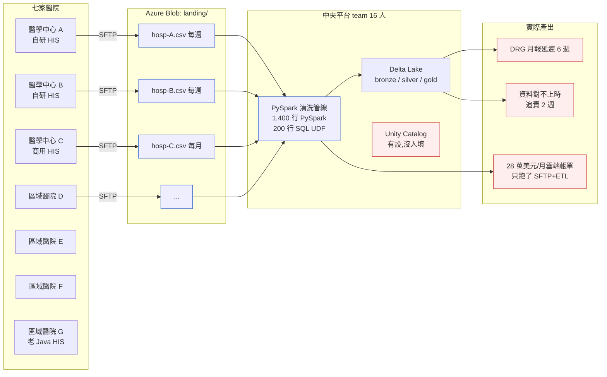
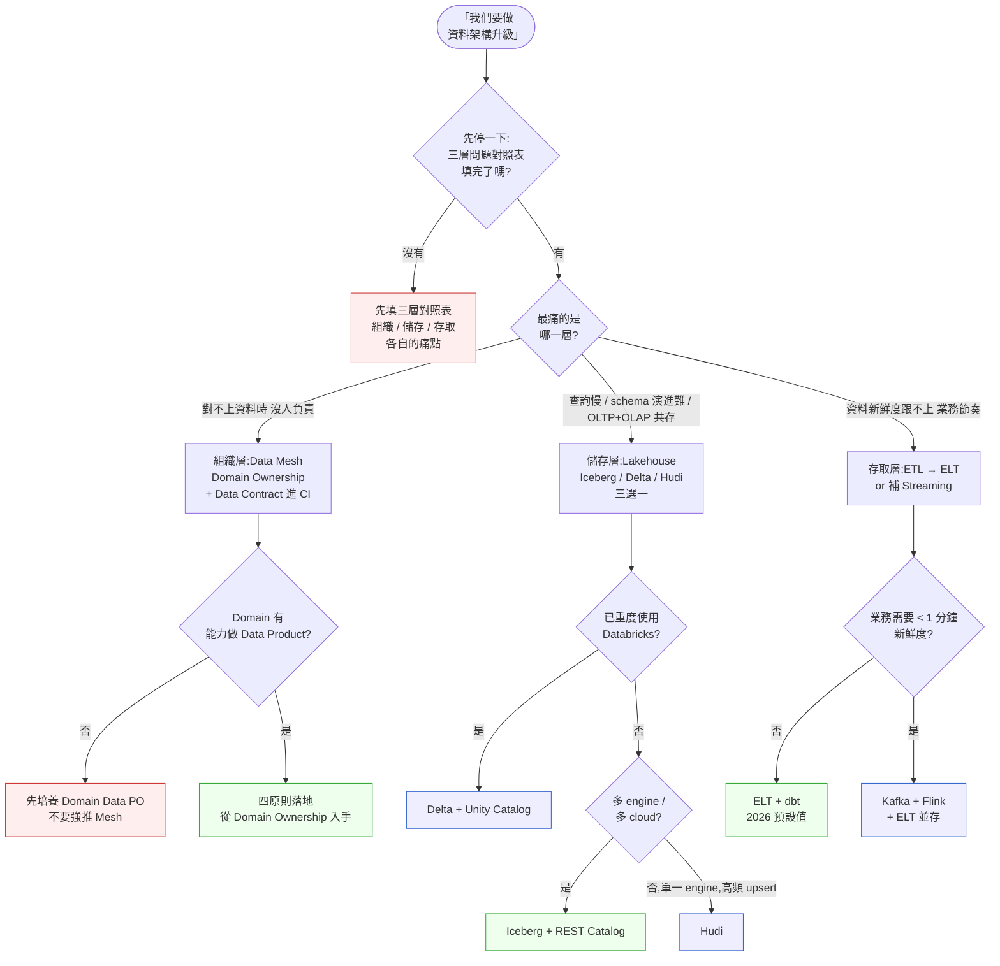

# 第 31 章|資料架構
## ⸺ Data Mesh、Lakehouse、Lakebase 是不同層級的問題,不要混為一談

> **前置閱讀**:[Ch 6 DFD 與資料血緣](../part-02-analysis/ch-06-dfd-structured-analysis.md)、[Ch 8 資料模型與正規化](../part-02-analysis/ch-08-data-modeling-normalization.md)、[Ch 15 資料儲存設計](../part-03-design/ch-15-data-storage.md)、[Ch 23 事件驅動架構](../part-04-architecture/ch-23-event-driven-cqrs-es.md)
> **下游章節**:[Ch 36 AI-Native 架構](../part-07-ai-era/ch-36-ai-native-architecture.md)
> **延伸補章**:[Ch 28 Compliance by Design](../part-05-quality/ch-28-compliance.md)

---

## 28.1 冷觀察 ⸺ 把 Lakehouse 用成「更貴的 SFTP」

我在 2026 年第一季,看過一個虛構的跨院醫療資料平台 **MedNexus Health Data Network**(`CASE-HCR-006`)。背景是區域醫療整合計畫:七家醫院(三家醫學中心、四家區域醫院)組成一個聯盟,要做跨院 EMR 共享、健保 DRG 分析、跨院疫情監測、以及一個共通的研究資料申請平台。聯盟出資新台幣 1.4 億,2023 年動工,基底選了 **Databricks Lakehouse + Delta Lake + Unity Catalog**,雲端是 Azure ap-east(Hong Kong),每月雲端帳單約 28 萬美元。

第三年回頭看,平台跑得起來,Delta 表也有,Unity Catalog 也設了 ⸺ 但七家醫院依然每週把 CSV 透過 SFTP 丟進一個 landing bucket,平台 team 用 PySpark 把 CSV 解析、清洗、轉成 Delta 表。這是事故的形狀:

> 「我們花了 1.4 億蓋的不是 Lakehouse,是一個**比 SFTP 貴 50 倍的 SFTP**。」

那場 retro 上,平台主管在白板上慢慢畫,把問題拆開來看:

- 七家醫院的 HIS 廠商不同(三家自研、兩家用某商用 HIS、兩家用一套老的 Java HIS),HL7 v2.5 的 PID-3 欄位有人填身分證、有人填 MRN、有人填院內 token,**同一個欄位三種語意**。
- 兩家醫院的 EMR 是健保署 Tw-DRG 編碼,另外五家是各院的 ICD-10-CM 在地版,主診斷碼粒度不一致。
- 沒有一家醫院的資料工程師會把「這份 CSV 我負責、有問題找我」這句話寫在 metadata 裡。每次資料對不上,平台 team 要追到「這欄位是哪個科室填的、收費科還是病歷室」常常需要兩週。
- Delta Lake 的 schema evolution 很強,但**沒人能告訴 Delta:這個欄位出問題會影響哪幾份 DRG 報表**。

事故覆盤的最後一句話是平台 PM 講的,我把它原樣記下來:

> 「我們以為買了 Databricks 就是 Data Mesh。三年後才發現,**Databricks 是 Lakehouse,Data Mesh 是另一件完全不同的事**。」



Databricks 沒有失敗,Delta Lake 也沒有失敗 ⸺ **MedNexus 把「擔心資料治理跟不上」這個情緒,當成了「該買 Lakehouse 工具」這個結論**。中間應該有的那一段 ⸺ 「誰擁有資料、誰對品質負責、消費者怎麼簽契約」⸺ 完全沒做。Lakehouse 工具不會幫你解決「業務團隊不願意對自己的資料負責」這件事。

---

## 28.2 真問題 ⸺ 三個層級的問題,被混成一個詞

把 MedNexus 的事故拆開來看會比較清楚。「資料架構」這個詞在 2026 年的會議室裡,通常一句話內混著三種完全不同層級的問題:

1. **組織層**:資料**誰擁有**?誰對品質負責?消費者怎麼跟生產者簽契約?
2. **儲存層**:資料**以什麼格式落地**?OLAP / OLTP 怎麼共存?schema 怎麼演進?
3. **存取層**:消費者(BI、報表、ML、AI Agent)**怎麼查**這份資料?怎麼確保查到的是新鮮的、可信的版本?

這三層在 2010 年代的中央資料倉儲時代,常常由同一個 team 處理,所以混在一起談沒事。但到 2026 年,當組織規模一大、資料來源一多、AI Agent 開始要自己撈資料的時候,**這三層的決定變成是三個不同團隊、三種不同節奏、三種不同失敗模式**。把它們綁在一個工具決定裡,通常會在某一層付高價的代價。

### 28.2.1 組織層 = Data Mesh

Data Mesh 是 Zhamak Dehghani 在 2019 年的部落格貼文 [^CIT-280] 提出、2022 年寫成 O'Reilly 書 *Data Mesh* [^CIT-281] 完整化的一套**組織與治理模式**。核心四原則:

- **Domain Ownership**:資料由業務領域(domain)擁有,不是中央 data team 擁有
- **Data as a Product**:每個 domain 把自己的資料當產品做,有 SLO、有版本、有文件、有 owner
- **Self-Serve Data Platform**:中央 team 不擁有資料,擁有「讓 domain 能自助生產資料產品」的平台能力
- **Federated Computational Governance**:治理規則(隱私、品質、契約)寫成可執行的規範,跨 domain 強制執行

ThoughtWorks 在 2022 起的 Technology Radar [^CIT-282] 把 Data Mesh 從 Trial 推到 Adopt,但同時提醒「**Data Mesh 是組織模式,不是技術選型**」。Dehghani 自己 2024 年回顧也說過一句話 [^CIT-281]:**「Data Mesh 失敗的案例,九成是把它當成 Lakehouse 的同義詞來推。」**

### 28.2.2 儲存層 = Warehouse / Lake / Lakehouse / Lakebase

這條線是物理層的演進,每一代解決上一代的痛點:

| 代 | 年代 | 代表 | 痛點解決 | 留下的痛點 |
|---|---|---|---|---|
| **Warehouse** | 1980s 起,Inmon / Kimball [^CIT-283] | Teradata、Oracle、SQL Server、Redshift、BigQuery、Snowflake | OLAP 強、SQL 友善、強 schema | 半結構化資料、ML 場景吃力、儲存與運算強耦合 |
| **Lake** | 2010s,Hadoop / S3 | HDFS + Parquet、S3 + Glue | 任意格式、廉價儲存、ML 友善 | schema-on-read 失控、資料沼澤、無 ACID |
| **Lakehouse** | 2020,Databricks Paper [^CIT-284] | Delta Lake、Apache Iceberg、Apache Hudi | Lake 上加 ACID、time travel、schema evolution | OLTP 仍弱、AI Agent 查詢 latency 不友善 |
| **Lakebase** | 2026,Databricks 提出 [^CIT-285] | Lakehouse + 內建 OLTP Postgres + vector 索引 | OLTP / OLAP / Vector 統一存取 | 還很新、生態未成熟、鎖定風險 |

Bill Inmon(top-down warehouse)與 Ralph Kimball(dimensional modeling)[^CIT-283] 的論辯在 1990s 主導了 warehouse 設計,但**他們論辯的是同一件事的兩種解法 ⸺ 都是中央化儲存層**。Lakehouse / Lakebase 也還是儲存層的演進,**它們處理的不是組織問題**。

### 28.2.3 存取層 = ETL / ELT / Reverse ETL / Streaming

存取層處理的是「資料怎麼從 A 移到 B、從生產者到消費者」。四種主流模式在 2026 年並存,不是替代關係:

- **ETL**:1990s 起,Extract → Transform → Load。轉換在中間 ETL 工具(Informatica、Talend),目標是 warehouse。2020s 後常被詬病「轉換邏輯黑盒、版本控制困難」。
- **ELT**:2010s 起,Extract → Load → Transform。先把 raw 資料丟進 warehouse / lake,在裡面用 SQL/dbt 轉換。dbt [^CIT-286] 把 ELT 的 transformation 層做成「SQL + Git + 測試」,2026 年是事實標準。
- **Reverse ETL**:2020s 起,從 warehouse 把分析結果**推回**業務系統(Salesforce、HubSpot、CRM)。代表工具 Hightouch、Census。「資料倉儲是 source of truth、業務系統是消費者」這個方向在 2026 年成形。
- **Streaming**:Kafka [^CIT-287] + Flink [^CIT-288],資料在事件流中即時處理。Ch 23 已詳論 Event-Driven,Streaming ETL 是它在資料層的延伸。

### 28.2.4 三層問題的混淆,是 MedNexus 事故的根因

回頭看 MedNexus,他們在三層上都有問題,但**只在儲存層花了錢**:

| 層 | MedNexus 真實狀況 | 他們做了什麼 | 結果 |
|---|---|---|---|
| 組織層 | 七家醫院沒人對自己的資料品質負責 | 沒做(以為 Unity Catalog 會自己長出 owner) | 對不上時追責兩週 |
| 儲存層 | 想要 ACID + schema evolution | 買了 Databricks + Delta Lake | 工具到位 |
| 存取層 | 應該即時或日級;實際是週級 SFTP | 沒人問為什麼還在用 SFTP | 月報延遲六週 |

換句話說,**他們在沒有解決組織層問題的情況下,以為儲存層的工具會自動解決它**。Iceberg / Delta / Hudi 不會幫你解決「業務團隊不願意對自己的資料負責」⸺ 這句話在 2026 年值得貼在每個資料平台 PM 的螢幕邊上。

---

## 28.3 決策框架 ⸺ 三層分開做、各自有判準

下面這幾張表跟流程圖,在現場相當好用。它們的共同前提是:**先把三層問題分開,再各自選工具**。

### 28.3.1 三層問題對照表(現場可量化)

每次「我們要不要做資料平台」對話前,值得先把這張卡填完。三欄沒填齊就不討論工具。

| 層 | 問題本質 | 主要決定 | 量化指標 | 失敗模式 |
|---|---|---|---|---|
| **組織層(Data Mesh)** | 誰擁有資料、誰對品質負責 | Domain 邊界、Data Product owner、Data Contract 機制 | 每份資料產品都有 named owner、SLO、版本 | 中央 team 撈不動所有資料,沒人負責品質 |
| **儲存層(Lakehouse / Lakebase)** | 資料以什麼格式落地、ACID 與 schema 演進 | Iceberg / Delta / Hudi 三選一、catalog 選型 | 寫入 throughput、查詢 P95、schema 變更頻率 | 多套同時用 → 治理一鍋粥 |
| **存取層(ETL/ELT/Streaming)** | 消費者怎麼查、資料新鮮度 | dbt / Streaming / Reverse ETL 路徑選擇 | 端到端延遲、資料新鮮度 SLO、查詢 P95 | 一律 Streaming → 過度工程;一律批次 → 跟不上業務 |

MedNexus 那場 retro 後,他們把這張表貼到牆上,第一個發現是:**組織層那一欄整欄是空的**。後來他們花了 14 個月做組織層(下文 §28.5 交付清單會還原他們的 Data Architecture Decision Card),儲存層幾乎沒動,反而問題就慢慢散開了。

### 28.3.2 Data Mesh 四原則 — 不是教條,是體檢清單

| 原則 | 它在處理什麼 | 落地檢核 | MedNexus 第三年體檢 |
|---|---|---|---|
| **Domain Ownership** | 中央 team 撈不動所有 domain 的資料專業 | 每個 domain 有指定 data PO、有獨立 backlog | ✗ 全部由中央平台 team(16 人)消化 |
| **Data as a Product** | Domain 不只丟 raw 資料,要把它做成「能被外部消費的產品」 | 每份 product 有名字、版本、SLO、文件、發現性 | ✗ 七家醫院只丟 CSV,沒人寫文件 |
| **Self-Serve Platform** | 中央 team 提供「讓 domain 能自助發布資料產品」的能力 | Domain team 不需要中央 team 的人力就能 publish | ✗ 任何資料變動都要中央 team 改 PySpark |
| **Federated Governance** | 跨 domain 的治理規則(隱私、品質、契約)機讀化、可執行 | Data Contract 進 CI、隱私規則自動稽核、Schema Registry | ✗ Unity Catalog 開了帳號沒人填 metadata |

**現場常用的拇指法則**:**這四項至少要有兩項真實落地,才能說「我們在做 Data Mesh」**。其中 Domain Ownership 是入口 ⸺ 沒有它,後面三項都沒地方扎根。

### 28.3.3 Lakehouse 三大開源格式對照(2026)

選 Lakehouse table format 在 2026 年是個真實的決定,因為三家都已經 production-ready,但取捨不同。

| 維度 | Apache Iceberg | Delta Lake | Apache Hudi |
|---|---|---|---|
| **發起者** | Netflix(2018)→ Apache TLP [^CIT-289a] | Databricks(2019)→ Linux Foundation [^CIT-289b] | Uber(2017)→ Apache TLP [^CIT-289c] |
| **2026 年定位** | 中立、catalog 生態最廣 | Databricks 內最強、Unity Catalog 整合深 | Streaming-first、upsert 強、生態相對窄 |
| **Catalog** | REST Catalog、Nessie、AWS Glue、Polaris、Snowflake | Unity Catalog、Hive Metastore | Hive Metastore、AWS Glue |
| **Engine 支援** | Spark、Trino、Flink、Snowflake、BigQuery、ClickHouse | Spark(原生)、Trino、Flink(較弱) | Spark、Flink、Presto |
| **Schema Evolution** | 強(欄位重命名、reorder、type promotion) | 強(2024+ 補上欄位重命名) | 中(以 upsert 為核心優化) |
| **Time Travel** | ✓(snapshot) | ✓(version) | ✓(commit timeline) |
| **Hidden Partitioning** | ✓(原生賣點) | △(透過 generated column) | △ |
| **Concurrent Write** | Optimistic concurrency,多 writer 友善 | OCC + log,單 writer 推薦 | MVCC + timeline |
| **適合場景** | 多 engine、多 cloud、要避免 vendor lock-in | 已在 Databricks、需要 Unity Catalog 深度整合 | 高頻 upsert、CDC、streaming first |
| **2026 年取捨** | 「中立的 default」 | 「Databricks 內最順」 | 「streaming + upsert 場景的專用」 |

**現場常用的拇指法則**(2026 版):

- 多 cloud / 多 engine / 想避免 vendor lock-in → **Iceberg**(這是 2026 年新建系統的最常見起手式)
- 已重度使用 Databricks,且 Unity Catalog 深度整合是業務需求 → **Delta**(在 Databricks 內仍是最順的)
- CDC + 高頻 upsert(訂單狀態、庫存變動)→ **Hudi**(但 Iceberg + 各種寫入工具也漸漸補上)
- **三家都用 = 災難**:三套 catalog、三套 schema 演進語意、三套 time travel 模型,治理會變一鍋粥

值得注意:Snowflake 在 2024 開源 Polaris(Iceberg REST Catalog),Databricks 在 2024 收購 Tabular(Iceberg 商業公司)並承諾 Delta + Iceberg 雙向相容。**到 2026 年,Iceberg 已經是「中立 default」,Delta 是 Databricks 生態內的最佳選擇**,這個分工值得寫進你的 ADR。

### 28.3.4 ETL / ELT / Reverse ETL / Streaming 四模式對照

| 模式 | 資料移動方向 | 轉換發生在 | 適合場景 | 不適合 | 2026 工具 |
|---|---|---|---|---|---|
| **ETL** | Source → Tool → Warehouse | 中間工具 | 法規鎖定、PII masking 必須在落地前 | 轉換邏輯需要快速演進 | Informatica、Talend、AWS Glue |
| **ELT** | Source → Warehouse → 內部轉換 | 倉儲內(SQL/dbt) | 95% 現代資料平台 | 落地前必須脫敏的場景 | dbt + Snowflake/BigQuery/Databricks |
| **Reverse ETL** | Warehouse → SaaS / 業務系統 | 倉儲內 → 推送 | 把分析結果回推給銷售、行銷、客服 | 即時操作型場景 | Hightouch、Census |
| **Streaming** | Source → 事件流 → Sink | 流上(Flink/ksqlDB) | 即時告警、即時推薦、低延遲 ML | 業務不需要即時、團隊沒有 streaming 能力 | Kafka + Flink、Confluent、Materialize |

**現場常用的拇指法則**:**ELT 是 2026 年的預設值**,Streaming 是「業務真的需要 < 1 分鐘新鮮度」才上的進階配置。MedNexus 第三年體檢時,平台主管畫的那張圖上,「把每週 SFTP 升級成 daily ELT」就把 80% 的痛點解掉了 ⸺ 沒有 streaming、沒有 reverse ETL、沒有跨領域改造,就是把 batch 從週級拉到日級。

### 28.3.5 決策樹 ⸺ 這次要往哪一層走



**這張圖的關鍵不是分支,是 Q0 跟 Q2**。多數「該不該做 Data Mesh / Lakehouse」的對話,正確答案是「先填三層對照表,再看 domain 有沒有能力」。MedNexus 那場決議會,如果這張圖在桌上,會在 Q0 停住,然後從組織層先走。

### 28.3.6 Iceberg + Postgres 跨表查詢示例(2026 起手式)

把 MedNexus 的場景縮成一個具體形狀:七家醫院的就診事件存 Iceberg(分析用),每家醫院的即時門診狀態存各院的 Postgres(OLTP),平台用 Trino / DuckDB / Spark 同時查 Iceberg + Postgres FDW。

```sql
-- 1. Iceberg 表:跨院就診事件(每家醫院作為一個 partition)
CREATE TABLE mednexus.silver.encounter (
    encounter_id     bigint        NOT NULL,
    hospital_id      string        NOT NULL,  -- 七家醫院編號
    patient_mrn      string        NOT NULL,  -- 各院 MRN(語意已對齊,見 Ch 8)
    encounter_type   string        NOT NULL,  -- inpatient / outpatient / emergency
    admit_at         timestamp     NOT NULL,
    discharge_at     timestamp,
    primary_dx_icd10 string,
    drg_code         string,                    -- Tw-DRG 編碼
    attending_npi    string,
    -- audit 欄位
    source_system    string        NOT NULL,
    ingested_at      timestamp     NOT NULL,
    schema_version   int           NOT NULL DEFAULT 3
)
USING iceberg
PARTITIONED BY (hospital_id, days(admit_at))
TBLPROPERTIES (
    'format-version' = '2',
    'write.parquet.compression-codec' = 'zstd',
    'write.target-file-size-bytes' = '134217728',  -- 128MB
    'history.expire.max-snapshot-age-ms' = '604800000'  -- 7 天 time travel
);

-- 2. Iceberg time travel:查詢三天前同一張表的快照(對帳用)
SELECT count(*) AS encounter_count_3d_ago
FROM mednexus.silver.encounter
FOR TIMESTAMP AS OF (current_timestamp - INTERVAL '3' DAY)
WHERE hospital_id = 'HOSP-A' AND encounter_type = 'inpatient';

-- 3. 跨表查詢:Iceberg(歷史就診)+ Postgres FDW(該院即時床位)
-- 在 Trino 上同一個 SQL 句跨 catalog
SELECT
    e.hospital_id,
    e.drg_code,
    count(*) AS discharged_30d,
    -- 從各院的 Postgres 即時抓床位數
    (SELECT current_occupancy
     FROM postgres_hosp_a.public.bed_status
     WHERE ward = e.ward) AS current_bed_occupancy
FROM iceberg.mednexus_silver.encounter e
WHERE e.discharge_at >= current_date - INTERVAL '30' DAY
  AND e.hospital_id = 'HOSP-A'
GROUP BY e.hospital_id, e.drg_code, e.ward;
```

這段 SQL 在 MedNexus 的真實量級(七家醫院,日均 12,000 筆 encounter)上,Trino 查 30 天聚合 P95 約 4–6 秒,加上 Postgres FDW 即時拉床位 +200ms。**沒有 Lakebase,沒有 Streaming,只是 Iceberg + Postgres FDW + dbt**,跑得起來。

### 28.3.7 Data Contract YAML 範例(進 CI)

`data-contracts/encounter-v3.yaml`:

```yaml
# Data Contract: encounter (跨院就診事件)
# Owner: 醫學中心 A 病歷資訊組
# Reviewers: [中央平台 team, 健保署對接組]
dataContractSpecification: "1.1.0"
id: mednexus.silver.encounter
info:
  title: "Cross-Hospital Encounter Event"
  version: "3.0.0"
  owner: "med-center-a/him-team"
  contact:
    email: "him-team@hosp-a.example"
    slack: "#data-encounter-v3"

terms:
  description: |
    由各院 HIS 產出的就診事件,送進 MedNexus silver 層。
    一筆 encounter 對應一次完整就診(門診一日 / 急診一次 / 住院一次)。
  usage: "DRG 月報、跨院疫情監測、研究資料申請"
  limitations: "不含詳細病歷文字、不含影像、不可外送研究資料"

models:
  encounter:
    type: table
    fields:
      encounter_id:
        type: bigint
        required: true
        unique: true
      hospital_id:
        type: string
        required: true
        enum: ["HOSP-A", "HOSP-B", "HOSP-C", "HOSP-D", "HOSP-E", "HOSP-F", "HOSP-G"]
      patient_mrn:
        type: string
        required: true
        description: "各院 MRN,語意對齊 Ch 8"
        pii: true
      primary_dx_icd10:
        type: string
        pattern: "^[A-Z][0-9]{2}(\\.[0-9A-Z]{1,4})?$"
      drg_code:
        type: string
        description: "Tw-DRG 編碼;非住院 encounter 為 null"

quality:
  - type: SqlAssertion
    description: "encounter_id 全域唯一"
    query: "SELECT count(*) FROM encounter GROUP BY encounter_id HAVING count(*) > 1"
    mustBeEmpty: true
  - type: Freshness
    description: "每日 02:00 前須有當日 - 1 的資料"
    sla: "P1D"

servicelevels:
  availability: "99.5%"
  retention: "10 years"
  latency: "T+1 day for batch load"

# CI 鉤子:這份 contract 任何變更都會跑下面這幾個檢查
checks:
  - on: pull_request
    runs:
      - "datacontract test data-contracts/encounter-v3.yaml"
      - "datacontract breaking-change --from main --to HEAD"
```

這份 YAML 跟 schema migration 同 PR、跟下游消費者(DRG 月報、研究平台)一起 review。**Data Contract 進 CI 的價值不在防止 schema 變動,在於讓 schema 變動「無法繞過消費者同意」**。

---

## 28.4 踩坑清單

下面這四個常見地雷,在不同醫療資料平台、跨銀行清算平台、跨產線製造平台反覆出現。它們的共同點是:**把組織層的問題交給工具解,或者把三層的決定綁在一個會議裡做完**。每一個都附上修正方向。

### 反模式 1:想用 Lakehouse 工具解 Data Mesh 組織問題

最常見的形狀是「我們要 Data Mesh,所以買 Databricks / Snowflake / Starburst」。Tooling 進來、catalog 開了、Domain owner 欄位空著 ⸺ 三個月後一切照舊,只是雲端帳單變大。MedNexus 走的就是這條路。

> ✅ **修正方向**:**先做組織層,再選工具**。Data Mesh 的入口是 Domain Ownership,具體可量化的判準是:每個 domain 有指定 data PO(不是中央 team 兼任)、有獨立 backlog、有 owner 簽過名的 Data Contract。這三件事**用 Confluence + GitHub + 30 分鐘月會就能做**,不需要任何 Lakehouse 工具。先把組織層走六個月,有 owner 願意簽 contract 之後,再來談要不要升級儲存層。

### 反模式 2:Domain 沒能力做 Data Product 就強推 Mesh

另一條相反的路:看了 Dehghani 的書,組織層 high-level commitment 也有了,然後把資料倉儲拆給每個 domain 自己做。半年後,有的 domain(技術強的)做得不錯,有的 domain(只有兩個 SQL 兼差人員的)資料品質崩潰,平台變成「七個小坑代替一個大坑」。

> ✅ **修正方向**:**Data Mesh 不是「拆給每個 domain 自己做」,是「平台支援 domain 自助發布」**。落地順序:第一步,中央 team 從「擁有資料」轉為「擁有 self-serve 平台能力」(scaffolding、CI/CD、schema registry、catalog、observability)。第二步,挑兩個技術成熟的 domain 當 pilot,把他們的資料產品做出來作為樣板。第三步,其他 domain 用 pilot 的工具與模式漸進加入。**Domain 還沒有 PO、還沒有人會寫 SQL 的,先別 Mesh,留在中央倉儲先給他們服務**。

### 反模式 3:Iceberg / Delta / Hudi 同時用(治理一鍋粥)

「我們的 streaming 用 Hudi、batch 用 Iceberg、Databricks 那邊用 Delta」⸺ 這句話聽起來像是依場景選最佳工具,半年後通常變成:三套 catalog 沒辦法統一查詢、schema evolution 語意三家不同、time travel 三套各自的 snapshot ID、跨格式查詢需要寫 PySpark glue code。**治理變成一鍋粥**。

> ✅ **修正方向**:**選一個 table format 作為「主」,另兩個只在 ROI 明確時引入**。2026 年的預設值是 Iceberg(中立、catalog 生態最廣),Databricks 重度使用者預設 Delta。Hudi 只在「streaming + 高頻 upsert」明確證明 ROI 時引入,且要寫進 ADR 說明為什麼不能用 Iceberg 達成。**多格式並存的代價,通常比換掉「不夠完美但統一」的單格式高一個量級**。

### 反模式 4:Data Contract 寫了沒進 CI(消費端崩潰才知道)

「我們有 Data Contract,寫在 Confluence」⸺ 這句話在 2026 年聽起來怪。Data Contract 的價值不在「文件存在」,在「破壞契約的 PR 進不去 main」。Confluence 上的 contract 跟程式碼脫鉤,半年後跟實際 schema 對不上,消費端在 production 才發現。

> ✅ **修正方向**:**Data Contract 要進 CI**。具體做法:把 contract 寫成 YAML(Open Data Contract Standard、datacontract.com 的 Data Contract Specification 都是可選格式)放進 git repo;CI 上跑兩種檢查 ⸺ (1) 實際資料是否符合 contract(quality checks)、(2) PR 是否引入 breaking change(schema diff)。Breaking change 必須由所有下游消費者 owner 簽核才能 merge。**這個動作把「contract = 紙本」變成「contract = 程式碼級的合約」**。

---

## 28.5 交付清單 ⸺ 一頁式 Data Architecture Decision Card

每次要做資料架構決定前,**第一份要產出的不是廠商評估表,是 Data Architecture Decision Card**。它是一頁 Markdown,寫不滿就是還沒 ready 做這個決定。

把它存在 `docs/data-architecture/{decision_name}.md`,跟對應的 ADR 同 PR、跟下游消費者一起 review。

````markdown
# Data Architecture Decision Card — {決策名稱}

> 對應 ADR:`docs/adr/NNNN-{slug}.md`
> 撰寫日期:YYYY-MM-DD | 擁有人:{名字}
> 對齊章節:Ch 6 資料血緣、Ch 8 模型、Ch 15 引擎、Ch 23 事件流、Ch 31 資料架構

## 1. 三層問題對照(這個決定處理哪一層?)

| 層 | 我們的痛點(量化) | 這個決定**處理** | 這個決定**不處理** |
|---|---|---|---|
| 組織層(Data Mesh) | (e.g. 對不上資料時追責 2 週) | (e.g. 引入 Domain Owner、Data Contract) | (e.g. 不改變現有儲存格式) |
| 儲存層(Lakehouse) | (e.g. schema evolution 困難) | (e.g. 從 Parquet+Hive 升 Iceberg) | (e.g. 不引入 streaming) |
| 存取層(ETL/ELT/Streaming) | (e.g. 月報延遲 6 週) | (e.g. weekly SFTP → daily ELT) | (e.g. 不做 Reverse ETL) |

## 2. 組織層決定(Data Mesh 四原則體檢)

- [ ] Domain Ownership:每個 domain 有指定 data PO,姓名:_____________
- [ ] Data as a Product:本決定範圍內的資料產品有名字、版本、SLO、owner、文件
- [ ] Self-Serve Platform:中央 team 提供哪些能力,讓 domain 自助 publish?
- [ ] Federated Governance:哪些治理規則進 CI?(Data Contract / 隱私 / 品質)

如果四項勾不到兩項,這個決定不該往儲存層走,應先補組織層。

## 3. 儲存層決定(Lakehouse / Lakebase)

- 選擇:{Iceberg / Delta / Hudi / 維持現狀}
- Catalog:{REST Catalog / Unity / Glue / Polaris / Hive Metastore}
- 主要理由(對應哪一層痛點):
- 不選其他候選的理由(不是「比較差」,是「對我的場景不對齊」):
- 多格式並存風險:{有 / 無;若有,寫明 ROI 與退場條件}

## 4. 存取層決定(ETL / ELT / Reverse ETL / Streaming)

- 主要模式:{ETL / ELT / Streaming / 混合}
- 工具:{dbt / Airflow / Flink / Kafka / Hightouch}
- 資料新鮮度 SLO:{每筆資料從產生到可被消費者查到的延遲 P95}
- 為什麼不做 Streaming(若不做):業務不需要 < 1 分鐘新鮮度,因為...
- 為什麼不做 Reverse ETL(若不做):分析結果不需要回推業務系統,因為...

## 5. Data Contract 治理機制

- Contract 格式:{Data Contract Spec / Open Data Contract Standard / 自定義 YAML}
- 存放位置:`data-contracts/{product}-v{N}.yaml`
- CI 檢查:(1) {quality assertion} (2) {breaking change detection}
- Breaking change 流程:由 _____ 通知所有下游 owner,_____ 工作日內必須簽核
- 違反 contract 的 PR 處理:_____

## 6. Owner(這個決定誰負責)

| 區塊 | Owner | 副手 |
|---|---|---|
| 組織層落地 | | |
| 儲存層遷移 | | |
| 存取層 pipeline | | |
| Data Contract CI | | |
| 半年後 reassessment | | |

## 7. 半年後 Reassessment Trigger(觸發再評估的條件)

- [ ] 任一 Domain Owner 離職且接手者未確認 → 重新體檢 Data Mesh 四原則
- [ ] Data Contract breaking change 在一季內 > 3 次 → 重看契約治理
- [ ] 雲端帳單超過 {美金/月} → FinOps 對齊
- [ ] 業務新增 {某類查詢}(e.g. 即時、跨 region、AI Agent 自助查詢)→ 看是否需升 Lakebase

## 8. Out of Scope(這個決定不解決什麼)

- 這個決定**不**處理 {法規隱私 / 跨境 / PII masking}(走Ch 28 合規路徑)
- 這個決定**不**改變 {某個既有 schema / 某個既有 Kafka topic}
- 這個決定**不**負責 {歷史資料回填、雙寫、舊系統下線}(由 {另一份文件} 處理)
````

**為什麼是一頁?** 一頁的篇幅會逼出選擇。MedNexus 那場決議會桌上沒有這張卡,所以「買 Databricks」變成可被通過的決定。如果有,會議會在第 1 節(三層問題對照)就停住,然後整個決定會被推遲到組織層先走。

**為什麼第 2 節要做 Data Mesh 四原則體檢?** 因為這四項是 Data Mesh 唯一可量化的入口。寫不出 Domain Owner 姓名,Mesh 就只是 PPT。

**為什麼候選清單裡要包含「維持現狀」?** 因為現場最常被忽略的選項,就是「組織層先走、儲存層不動」。MedNexus 第三年體檢後,他們做的就是這件事 ⸺ 把 14 個月花在組織層,Iceberg/Delta 沒換,但七家醫院終於有人對自己的資料負責。

---

## 28.6 本章交付清單 Recap

讀完本章,你應該已經能做到:

- [ ] 把資料架構拆成三層問題:**組織層(Data Mesh)/ 儲存層(Lakehouse / Lakebase)/ 存取層(ETL/ELT/Streaming)**,在會議上能把混在一句話裡的三層拆開來談
- [ ] 用 Data Mesh 四原則體檢清單(Domain Ownership / Data as a Product / Self-Serve Platform / Federated Governance)判斷自己的組織是不是真的在做 Mesh,還是只是買了 Lakehouse
- [ ] 在 Lakehouse 三大格式(Iceberg / Delta / Hudi)中,用「中立 vs Databricks 整合 vs streaming-first」三條取捨軸選一個主格式,**避免三家同時用**
- [ ] 為手上的資料平台決定寫好一份 Data Architecture Decision Card,並把 Data Contract 寫成 YAML 進 CI

如果四項中先挑一項做完就好,建議是最後那一項 ⸺ 把目前團隊正在討論「我們是不是要做 Data Mesh / 換 Lakehouse」的那個決定,寫成一張 Data Architecture Decision Card。寫到第 1 節「三層問題對照」就卡住的話,**那個決定本來就還沒到該做的時候**。下游 Ch 36 會接著談 AI-Native 架構,把這一章的 Lakebase 與 Data Contract 接到 AI Agent 自助查詢的場景。

---

## Cross-References

- **回顧**:[Ch 6 DFD 與資料血緣](../part-02-analysis/ch-06-dfd-structured-analysis.md) ⸺ Data Lineage Card 是 Data Contract 的前身
- **回顧**:[Ch 8 資料模型與正規化](../part-02-analysis/ch-08-data-modeling-normalization.md) ⸺ patient_id 語意對齊是跨院 encounter 表的前置
- **回顧**:[Ch 15 資料儲存設計](../part-03-design/ch-15-data-storage.md) ⸺ Workload Profile 與引擎選型,Lakebase 在那章已埋下伏筆
- **回顧**:[Ch 23 事件驅動架構](../part-04-architecture/ch-23-event-driven-cqrs-es.md) ⸺ Streaming ETL 是 EDA 在資料層的延伸
- **下游**:[Ch 36 AI-Native 架構](../part-07-ai-era/ch-36-ai-native-architecture.md) ⸺ AI Agent 自助查詢時,Lakebase / Data Contract / Vector Index 三件事如何整合
- **延伸補章**:[Ch 28 Compliance by Design](../part-05-quality/ch-28-compliance.md) ⸺ 跨院資料、PII、HIPAA / 個資法的合規路徑

## 引用

[^CIT-280]: Zhamak Dehghani, "How to Move Beyond a Monolithic Data Lake to a Distributed Data Mesh" (martinfowler.com, May 2019) — Data Mesh 概念原始公開貼文。
[^CIT-281]: Zhamak Dehghani, "Data Mesh: Delivering Data-Driven Value at Scale" (O'Reilly, March 2022) — Data Mesh 完整書本版本,涵蓋四原則與 self-serve platform 設計。
[^CIT-282]: ThoughtWorks Technology Radar — Data Mesh entries (Vol. 25–30, 2021–2024)。Data Mesh 在 Trial → Adopt 的演進與「Data Mesh ≠ Lakehouse」的提醒。thoughtworks.com/radar。
[^CIT-283]: Bill Inmon, "Building the Data Warehouse" (Wiley, 4th ed., 2005);Ralph Kimball & Margy Ross, "The Data Warehouse Toolkit" (Wiley, 3rd ed., 2013) — Top-down warehouse 與 dimensional modeling 兩派經典。
[^CIT-284]: Michael Armbrust, Ali Ghodsi, Reynold Xin, Matei Zaharia, "Lakehouse: A New Generation of Open Platforms that Unify Data Warehousing and Advanced Analytics" (CIDR 2021;Databricks Blog 2020) — Lakehouse 概念原始論文。databricks.com/blog/2020/01/30/what-is-a-data-lakehouse.html。
[^CIT-285]: Databricks, "Lakebase: A Unified Storage Layer for AI Agents" (2026) — Lakehouse 在 AI Agent 場景下的演進形態,整合 OLTP Postgres、analytical Delta 與 vector index。databricks.com/blog/lakebase。同 CIT-158。
[^CIT-286]: dbt Labs, "dbt Documentation" — docs.getdbt.com。SQL + Git + 測試三件套的 transformation 框架,2026 年 ELT 事實標準。
[^CIT-287]: Apache Kafka Documentation — kafka.apache.org。同 CIT-226。
[^CIT-288]: Apache Flink Documentation — nightlies.apache.org/flink。Streaming 處理引擎,Kafka 之外的 streaming 標準。
[^CIT-289a]: Apache Iceberg Specification — iceberg.apache.org。Netflix 2018 開源、Apache TLP,2026 年 table format 中立 default。
[^CIT-289b]: Delta Lake Documentation — delta.io。Databricks 2019 開源、Linux Foundation 託管,2024 起與 Iceberg 雙向相容路徑開展。
[^CIT-289c]: Apache Hudi Documentation — hudi.apache.org。Uber 2017 開源、Apache TLP,streaming + upsert 場景強項。

---
