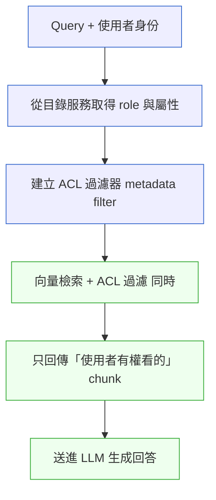

# 補章 E|Compliance by Design ⸺ AI 合規架構
## ⸺ Designing for Compliance from Day Zero

> **插入位置**:緊接 [Ch 25 Security by Design](./ch-25-security-by-design.md) 之後
> **前置閱讀**:[Ch 25](./ch-25-security-by-design.md)、[Ch 28 資料架構](./ch-28-data-architecture.md)
> **下游章節**:[Ch 33 AI-Native Architecture](../part-07-ai-era/ch-33-ai-native-architecture.md)
> **延伸補章**:[補章 A 邊緣/OT-IT](../part-04-architecture/chA-edge-ot-it.md)、[補章 B Agentic QA](../part-07-ai-era/chB-agentic-qa.md)

---

## E.1 冷觀察 ⸺ 2026 年 8 月 2 日

這個日期不是隨便挑的。**2026/8/2 是 EU AI Act 高風險 AI 系統合規的全面執行日**(Annex III 系統)。這意味著到那天為止,高風險 AI 系統必須:

- 完成符合性評估(Conformity Assessment)
- 完成技術文件(Technical Documentation)
- 取得 CE 標誌(CE Marking)
- 在歐盟資料庫註冊(EU Database Registration)
- 建立風險管理系統與品質管理系統(QMS)
- 具備事件回報機制(72 小時 / 15 日 雙時程)

罰則上限是 **3,500 萬歐元或全球年營收的 7%**(以較高者計)。GDPR 在 2025–2026 仍同時適用,違反個資相關義務可疊加處罰至 **2,000 萬歐元或全球年營收的 4%**。

[Ch 25](./ch-25-security-by-design.md) 把「對抗性安全」(Prompt Injection、Tool Misuse 等)作為主軸。**但合規(Compliance)不是安全(Security)**。安全防的是「壞人」,合規防的是「自己也可能犯的錯」。

```mermaid
flowchart LR
    subgraph Sec[Security 防壞人]
      S1[Prompt Injection]:::cold
      S2[Threat Modeling]:::cold
      S3[Zero Trust]:::cold
      S4[加密 / mTLS]:::cold
    end
    subgraph Both[交集]
      Bo1[存取控制]:::goal
      Bo2[稽核日誌]:::goal
      Bo3[事件回報]:::goal
    end
    subgraph Comp[Compliance 防自己犯錯]
      C1[資料最小化]:::cold
      C2[可解釋性]:::cold
      C3[人類監督]:::cold
      C4[權利保留]:::cold
      C5[FRIA / DPIA]:::cold
    end
    Sec -.--> Both
    Comp -.--> Both

    classDef hot fill:#fee,stroke:#c33
    classDef cold fill:#eef,stroke:#36c
    classDef goal fill:#efe,stroke:#3a3
```

多數團隊只做了交集,而忽略了兩側獨立的部分。

## E.2 真問題 ⸺ 三個必須在系統設計層面解決的合規挑戰

### E.2.1 挑戰一:RAG 系統的細粒度存取控制(RBAC × Row-Level)

典型場景:企業內部 RAG 知識庫。HR 文件、財務文件、研發文件、客戶資料都進去了。**問題:檢索器(Retriever)在語意搜尋時,根本不知道「這個提問者是誰、能看哪些文件」**。

最常見但**錯誤**的做法:在 LLM 的 prompt 裡加一句「請不要把 HR 文件給研發部門看」。**這是字面意義上的 prompt injection 自殺**。LLM 會被各種繞過技巧攻破。

正確的做法是:**把存取控制做在檢索層,讓 LLM 看不到不該看的內容**。



**關鍵是「同時」**。先檢索後過濾(Post-filter)會洩漏資訊(從結果數量推測存在哪些文件)。要前融合過濾(Pre-filter at index level)。

支援這個能力的向量資料庫:Qdrant(Payload Filter)、Weaviate(Where Filter)、Pinecone(Metadata Filter)、pgvector + 行級安全(RLS)。**pgvector + Postgres RLS 是合規場景的隱藏寶藏** — Postgres RLS 是 RBAC 細粒度控制的成熟方案,加上 pgvector 直接同時得到語意搜尋與行級權限。

### E.2.2 挑戰二:動態資料遮罩(Dynamic Data Masking)

不是所有有權看文件的人,都有權看文件**全部內容**。

例如:客服 Agent 可以看到客戶的訂單歷史(因為要服務),但**不該看到客戶的完整身分證號**(只能看後 4 碼)。傳統做法是在資料倉庫層做永久遮罩。但 RAG 系統的問題是:**遮罩必須在檢索時動態執行**,因為同一份原始文件,給不同使用者看的版本不一樣。

**動態遮罩的三層方案**:

| 層次 | 實作位置 | 適用 |
|---|---|---|
| **儲存層遮罩** | Postgres Row-Level Security + 視圖 | 結構化資料 |
| **索引層遮罩** | 在索引時對敏感欄位 hash / tokenize | 預知敏感欄位、不會變 |
| **檢索層遮罩** | 取出 chunk 後、進 LLM 前,用正則 / NER 把 PII 替換成 placeholder | 非結構化文件、規則複雜 |

實務上**通常三者並用**。儲存層擋大規模洩漏、檢索層擋語意搜尋洩漏、索引層做基礎處理。

### E.2.3 挑戰三:多租戶上下文隔離(Tenant Isolation)

如果 SaaS 服務多個客戶,**最致命的合規災難就是「A 客戶的問題,Agent 答出 B 客戶的資料」**(`CASE-SAS-007`)。這不只是 bug,是**合約違反 + 個資法違反 + 信任崩潰**的三重打擊。

四個層次都必須隔離:

| 層次 | 隔離手段 | 常見洩漏路徑 |
|---|---|---|
| **儲存隔離** | 不同租戶資料用不同的 schema / database / 索引,而不是共用一張表加 `tenant_id` 欄位 | 共用表一行 bug 全洩 |
| **計算隔離** | Agent 工作流的 context、cache、向量空間都按 tenant 分 | 共用 prompt cache、共用 vector index |
| **模型隔離** | 同一個 LLM 處理不同租戶請求時,不能跨請求保留上下文。Memory 元件必須帶 tenant_id 索引 | 跨請求 context 留存 |
| **遙測隔離** | OTel trace、logs、metrics 都帶 tenant_id 標籤;儀表板按租戶切 | 故障分析時把 A 資料當 B |

## E.3 決策框架 ⸺ EU AI Act 工程映射 + DPIA × FRIA 整合

### E.3.1 EU AI Act 合規的工程映射

很多人讀法規讀到頭痛,因為法律語言跟工程語言對不上。下面這張對映表現場好用:

| AI Act 條文 | 工程意義 | 應該做的事 |
|---|---|---|
| Art. 9 風險管理系統 | 系統性辨識、緩解、監控風險 | 建立 RMS 文件 + 季度更新流程 |
| Art. 10 資料治理 | 訓練 / 驗證 / 測試資料的代表性與品質 | 資料卡(Datasheet for Datasets);偏誤評估 |
| Art. 11 技術文件 | Annex IV 規定的 9 大類文件 | 用 ADR + Model Card + System Card 組合產出 |
| Art. 12 紀錄保存 | 自動紀錄系統行為 | 結構化日誌 + 不可篡改保存(WORM) |
| Art. 13 透明度與資訊提供 | 使用者知道在跟 AI 互動,且能理解輸出 | UI 上明示;提供解釋介面 |
| Art. 14 人類監督 | 高風險決策必須有人類介入點 | Human-in-the-Loop 設計;一鍵取消按鈕 |
| Art. 15 準確性、強健性、資安 | 量化的品質保證 | Eval Set + Drift Monitor + Red Team(見補章 B) |
| Art. 17 品質管理系統 | 全生命週期的品質流程 | ISO/IEC 42001 對齊 |
| Art. 26(4) 部署者監控 | 持續監測,72h 重大事件 / 15 日嚴重事件回報 | Incident Response Plan + 法務通報自動化 |
| Art. 27 基本權利影響評估(FRIA) | 高風險部署前的影響評估 | FRIA 模板;每個 high-risk use case 一份 |

### E.3.2 DPIA × FRIA:不是兩份,是一份

GDPR 要求 DPIA(資料保護影響評估),AI Act 要求 FRIA(基本權利影響評估)。實務上**寫成兩份是浪費**。

現場好用的整合範本(七節):

```
1. 系統描述(對應 DPIA Art.35.7(a) + FRIA Art.27(1)(a))
2. 必要性與比例性(DPIA Art.35.7(b))
3. 資料流與處理活動(DPIA 主要;FRIA 也需要)
4. 風險辨識
   ├─ 個資風險(DPIA)
   └─ 基本權利風險(FRIA)— 歧視、自主性、隱私之外的權利
5. 緩解措施(技術 + 組織)
6. 殘餘風險與接受度
7. 諮詢紀錄(資料保護長 / 利害關係人 / 影響族群代表)
```

這份文件**必須在系統上線前完成,且會被監管機關要求調閱**。

### E.3.3 不要等到法務找你才開始

合規最常見的失敗模式不是「做不到」,而是「太晚才開始做」。

**在 PoC 階段就應該做的事**:
- 在 PRD / SRS 加一節「合規分類」(這是不是 AI Act high-risk?是不是 GDPR high-risk processing?)
- 資料攝入流程從第一天就保留出處(Provenance)
- Eval Set 從第一天就包含「歧視 / 偏誤」維度
- ADR 範本加一欄「合規影響」

**在 MVP 階段就應該完成的事**:
- 第一版 DPIA × FRIA
- 第一版 Model Card / System Card
- 事件回報機制接到法務通報

**在 GA 之前必須完成的事**:
- 完整 Annex IV 技術文件
- CE Marking 流程啟動
- 第三方稽核(若適用)
- AI Office 註冊

---

## E.4 踩坑清單

### 反模式 1:把合規當作上線前的儀式

team 在最後一個月才打開 GDPR / AI Act 評估表,結果發現某個資料攝入流程從第一天起就是違法的。

> ✅ **修正方向**:合規分類進 PRD 第一頁、進 ADR 模板、進 Sprint 0 checklist。Provenance 從第一筆資料就保留。「太晚開始」的成本永遠遠超「太早開始」。

### 反模式 2:用 prompt 控制存取權限

「請不要回答 HR 相關問題」「請不要透露其他客戶的資料」 — 這在 LLM 面前是擺設。各種繞過(忽略前面的指令、扮演不同角色、用其他語言)都會打破它。

> ✅ **修正方向**:存取控制做在**檢索層**。LLM 看到的 chunk 必須已經過 ACL 過濾。pgvector + Postgres RLS 或 Qdrant payload filter 是兩條成熟路徑。Pre-filter 不是 post-filter。

### 反模式 3:多租戶共用一張表 + tenant_id 欄位

便宜但脆弱。任何一行 query 漏寫 `WHERE tenant_id = ?` 就是跨租戶洩漏。在 RAG 場景更嚴重,因為向量索引共用 = 語意搜尋會跨租戶推理。

> ✅ **修正方向**:儲存層 schema 隔離(per-tenant schema / database)、向量資料庫 collection 分租戶、Redis 分庫、OTel 帶 tenant_id 標籤。共用表只用於明確「跨租戶聚合分析」場景且強制 RLS。

### 反模式 4:DPIA 與 FRIA 寫成兩份

法務一份、工程一份、AI 倫理委員會一份,三份對不起來、各自過期。

> ✅ **修正方向**:用上面 §E.3.2 的七節整合範本。一份文件、多角色 review、版本控制、與 ADR 連動更新。一份 = 三方都看得懂的單一 source of truth。

---

## E.5 交付清單

完成本章後,讀者應產出:

````markdown
# Compliance Design Pack — {專案名稱}

## 1. 合規分類表
- [ ] AI Act 風險等級判定(Unacceptable / High-risk / Limited / Minimal)
- [ ] GDPR 處理類型(高風險 / 一般 / 不涉個資)
- [ ] 跨境傳輸需求(SCC / Adequacy / BCR)
- [ ] 領域特殊法規(醫療 HIPAA / 金融 PCI DSS / 兒少 / 投票等)

## 2. DPIA × FRIA 整合報告(七節範本)

## 3. AI 系統文件三件組
- [ ] Model Card
- [ ] System Card
- [ ] Datasheet for Datasets

## 4. 存取控制設計
- [ ] RBAC × Row-Level(pgvector + RLS / Qdrant Payload Filter / Weaviate Where)
- [ ] 動態遮罩規則庫(三層方案)

## 5. 多租戶隔離架構文件
- [ ] 儲存 / 計算 / 模型 / 遙測 四層隔離手段

## 6. 事件回報 SOP
- [ ] 72h 重大事件 / 15 日嚴重事件流程
- [ ] 法務通報自動化

## 7. ISO/IEC 42001 對齊評估
- [ ] AIMS(AI Management System)gap analysis

## 8. 技術文件(Annex IV 對應)
- [ ] 9 大類文件清單與 Owner
````

放在 `docs/compliance-pack/`,跟程式碼同 repo,跟 README 同層,**版本與 ADR 連動**。

---

## E.6 Recap

讀完本章,應該已經能做到:

- [ ] 區分 Security(防壞人)與 Compliance(防自己犯錯)的不同維度
- [ ] 在 RAG / Agent 系統設計階段把存取控制做在檢索層,而非 prompt 層
- [ ] 把 DPIA 與 FRIA 整合成一份七節文件
- [ ] 把 EU AI Act 條文映射到工程動作(Art. 9-15-26-27 對應 RMS / Eval / IRP / FRIA)
- [ ] 在 PoC 第一天就做合規分類,而非上線前一個月

如果四項中先挑一項做,建議是最後那一項 ⸺ 把合規分類表寫進 PRD 第一頁。後面的決定會自然跟著走。

---

## Cross-References

- **前置**:[Ch 25 Security by Design](./ch-25-security-by-design.md)、[Ch 28 資料架構](./ch-28-data-architecture.md)
- **下游**:[Ch 33 AI-Native Architecture](../part-07-ai-era/ch-33-ai-native-architecture.md)
- **延伸補章**:[補章 A 邊緣/OT-IT](../part-04-architecture/chA-edge-ot-it.md)(IEC 62443 / 工控合規)、[補章 B Agentic QA](../part-07-ai-era/chB-agentic-qa.md)(Eval Set / Red Team / Drift)

## 引用

本章無外部文獻引用。
