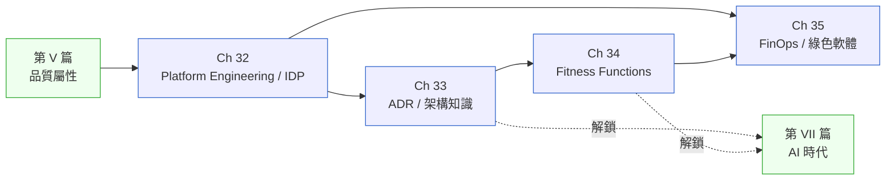

# 第 VI 篇|現代工程實踐

> **HarborPick Retail 花一整年做了 17 個內部工具,47 次 deploy 裡有 41 次繞過去。這篇四章,每章都在問同一個問題:你做的那個東西,有沒有把工程師當顧客?**

---

Platform Engineering 不是 DevOps 重命名。ADR 不是「上線前要交的文件」。Fitness Function 不是 Unit Test 的另一個說法。FinOps 不是帳單報告。

這四個誤解各自值得一章篇幅糾正。

第 VI 篇處理的是**工程文化基礎設施**——那些不直接產出 feature,但決定了一支團隊兩年後還能不能快速移動的東西。它的位置在品質屬性之後、AI 時代之前,因為這四章描述的實踐都是在你把 AI 工具接進工程流程之前,必須先存在的地基。

---

## 篇內章節依存圖

---

## 各章核心問句

| 章 | 標題簡稱 | 這章回答的真正問題 |
|---|---|---|
| Ch 32 | Platform Engineering / IDP | 你的內部開發者平台是工具庫,還是把工程師當顧客的產品? |
| Ch 33 | ADR / 架構知識管理 | 六個月後的接手人,怎麼知道當初為什麼這樣決定? |
| Ch 34 | Fitness Functions | 「不允許循環依賴」這條規則,怎麼寫成 CI 裡的一個測試? |
| Ch 35 | FinOps / 綠色軟體 | 帳單和碳排是同一個 Workload Profile 的兩個視角嗎? |

---

## 不同讀者的建議入口

- **平台工程師 / DevEx 團隊**:Ch 32 是你的主章。IDP 的 Golden Path 設計框架可以直接套用在你下一季的 OKR。
- **Tech Lead / 架構師**:Ch 33(ADR)+ Ch 34(Fitness Functions)是你最直接的工具。這兩章合起來回答「怎麼讓架構決策可以被追蹤且可以被自動驗證」。
- **工程主管 / CTO**:Ch 35 的 FinOps 框架是與 CFO 對話的共同語言;Fitness Function 是與 QA 對話的共同語言。
- **AI 工程師(讀 VII 篇前)**:Ch 33 的 ADR 格式直接對應 [Ch 37 CDE](../part-07-ai-era/ch-37-context-driven-engineering.md) 的 CLAUDE.md 設計;Ch 34 的 Fitness Function 是 [Ch 45 Agentic QA](../part-07-ai-era/ch-45-agentic-qa.md) 的前置概念。

---

## 前後篇連結

- **前置**:[第 V 篇 品質屬性](../part-05-quality/00-overview.md)
- **這篇解鎖**:[第 VII 篇 AI 時代](../part-07-ai-era/00-overview.md) — ADR 的決策文化和 Fitness Function 的自動化驗證,是把 AI Agent 接進工程流程的必要地基
- **長距離影響**:[Ch 37 CDE](../part-07-ai-era/ch-37-context-driven-engineering.md)(Ch 33 ADR 的格式直接演化成 AI 時代的 CLAUDE.md / agents.md)、[Ch 45 Agentic QA](../part-07-ai-era/ch-45-agentic-qa.md)(Ch 34 Fitness Functions 是 Agentic QA 的人工驗證替代品設計起點)
