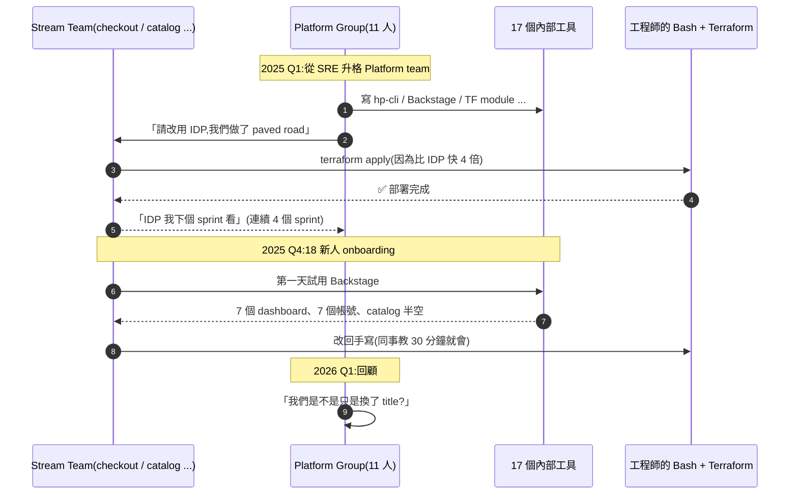
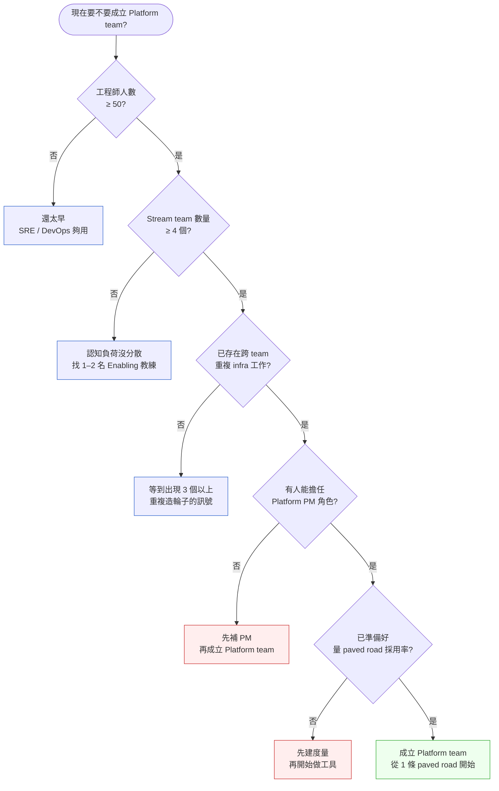

# 第 32 章|Platform Engineering 與 IDP
## ⸺ Platform-as-a-Product 不是 DevOps 重命名

> **前置閱讀**:[Ch 24 雲端原生與 Kubernetes](../part-04-architecture/ch-24-cloud-native-kubernetes.md)、[Ch 29 可觀測性](../part-05-quality/ch-29-observability-otel.md)、[Ch 30 SRE / SLO](../part-05-quality/ch-30-sre-slo-chaos.md)
> **下游章節**:[Ch 33 ADR 與技術決策紀錄](./ch-33-adr-architecture-knowledge.md)、[Ch 34 Fitness Functions](./ch-34-fitness-functions.md)
> **延伸補章**:無

---

## 32.1 冷觀察 ⸺ 17 個內部工具、0 人 onboarding、Bash 比 IDP 快

我在 2026 年 2 月,陪一家虛構大型零售平台 **HarborPick Retail**(`CASE-ECM-007`)做工程組織體檢。GMV 14 億美元、月活 220 萬、工程團隊 184 人,跨 6 個 stream-aligned team(checkout / catalog / fulfillment / promo / merchant / search),加上一個 11 人的 Platform team(2024 年從 SRE 升格而成,內部稱 *Platform Engineering Group*,簡寫 PEG)。

PEG 在 2025 整年的工作成果,寫在他們季度 OKR 文件裡的列表是這樣的:

> 「我們交付了:internal CLI(`hp-cli`)、Backstage portal、Terraform module 庫、ArgoCD 應用工廠、Vault Operator、Cost Explorer dashboard、CI 模板庫、自製的 K8s namespace provisioner、自製的 secrets rotation、自製的 service registry、自製的 schema registry、自製的 feature flag 服務、自製的 chaos runner、自製的 SLO calculator、自製的 on-call rotation 工具、自製的 access request portal、自製的 incident timeline 工具。」

17 個。每一個都用得很認真,Backstage 的 plugin 寫了 23 個。我把它們列在白板上,問了一句:

> 「這 17 個工具,checkout team 上週 deploy 了 47 次,他們有幾次走完了你們設計的 paved road?」

PEG lead 想了一下,打開 ArgoCD 後台的 audit log,過濾 `triggered-by != hp-cli`,跑出 41 筆。換句話說,**47 次 deploy 裡有 41 次繞過了 IDP**,工程師寧願自己 `terraform apply` + `kubectl apply -f`,也不走 PEG 寫的 paved road。

更刺一點的數字是 onboarding。HarborPick 在 2025 Q4 招了 18 個新工程師,Backstage 註冊使用者 18 人,**90 天後 Daily Active 4 人**。剩下 14 人的瀏覽器書籤裡是:GitHub、Slack、Datadog、AWS Console、CircleCI ⸺ 沒有 Backstage。

那場會議的 CTO 問了一句話,我把它原樣記下來:

> 「我們花了一整年把 PEG 從 SRE 升格成 Platform team,然後做了 17 個沒人用的工具。我們是不是只是把 DevOps 重新命名了?」

把這一年的演化壓成一張時序圖,大概長這樣:



事情的根本不是 PEG 的人不夠厲害 ⸺ 11 個人都是公司技術最強的工程師。問題是 **PEG 把自己當成「義務交付的內部單位」,而不是「對內部開發者賣產品的團隊」**。沒有 PM、沒有 roadmap 是社內公示、沒有 NPS、沒有 retention 指標、沒有「這個工具是為哪個 persona 設計」的 user research。所以他們做的不是 platform,是「能跑的工具集合」。

State of Platform Engineering Vol. 4 [^CIT-294] 那份報告把這現象量化過:**有 67% 的 platform team 自評交付頻率高,但只有 23% 的 stream team 表示 paved road 是他們的預設路徑**。HarborPick 那 41/47 的數字,落在那條落差曲線最深的那一段。

---

## 32.2 真問題 ⸺ Platform-as-a-Product,不是 DevOps 改名

「我們要不要成立 Platform team?」這個問題從 2022 問到 2026,在 50 人以上的工程組織幾乎每季都會冒出來。把它拆開來看會比較清楚:這個問題實際上把三件不同的事偷偷綁在一起了。

一件是**團隊拓樸**(Team Topologies)⸺ 我們的工程組織該分成幾類團隊、責任怎麼切。一件是**工作型態**(Platform-as-a-Product)⸺ 內部工具該用「義務交付」還是「產品經營」的方式做。一件是**度量**(DORA + SPACE)⸺ 我們怎麼知道 platform 真的有效。把它們攪在一起,通常的後果就是 HarborPick 那 17 個沒人用的工具。

### 32.2.1 Team Topologies 不是組織架構圖,是流動圖

Skelton & Pais 的 *Team Topologies*(2019)[^CIT-290] 提出四類團隊。在 2026 年看,這四類比當初寫的時候更穩 ⸺ 因為它解釋的是**團隊之間的「認知負荷流動」**,而不是「誰向誰報告」。換句話說,Team Topologies 不是 org chart,是 cognitive load chart。

| 團隊類型 | 主要職責 | 認知負荷方向 | 在 HarborPick 的對應 |
|---|---|---|---|
| **Stream-aligned**(產品流) | 對單一 value stream 端到端負責 | 業務面寬,平台面窄 | checkout / catalog / fulfillment 等 6 個 |
| **Platform**(平台) | 為 stream team 提供「自助式內部產品」 | 平台面深,業務面零 | PEG(11 人) |
| **Enabling**(賦能) | 短期駐點,提升 stream team 的某項能力 | 流動,跨 team 教練式 | 例:DDD 教練、SRE 駐點 6 週後撤 |
| **Complicated-Subsystem**(複雜子系統) | 維護需要深度專業的子系統 | 一個方向極深 | 例:支付對帳引擎、推薦模型 serving |

這張表的關鍵不是分類,**是流動**。Platform team 的存在理由是「降低 stream team 的認知負荷」⸺ 如果 platform 反而提高了 stream team 的認知負荷(7 個 dashboard、7 個帳號、3 套不同 CLI),它就在反向流動,做得越多傷害越大。HarborPick 的 PEG 落在這條反向曲線上。

### 32.2.2 Platform-as-a-Product:內部開發者是客戶

把 PEG 那場戲拆開:他們做了 17 個工具,但沒有一個工具有「目標客戶 persona」的 doc。「checkout team 的 staff engineer」、「catalog team 的 mid-level」、「剛加入的 grad」⸺ 這三類人對 IDP 的需求完全不同。沒有 persona,工具的設計就是「平台工程師覺得有用」,而不是「內部開發者覺得有用」。

Gregor Hohpe 在 *The Software Architect Elevator* [^CIT-299] 寫過一句話:「Platform 真正的考驗是你能不能 charge 內部 team 真實的 cost ⸺ 即使他們有選擇權,他們仍然選你。」這就是 Platform-as-a-Product 的核心。換句話說,把它拆成五件事:

| 產品要素 | 內部 platform 對應 | HarborPick PEG 當時 |
|---|---|---|
| **目標客戶**(persona) | 哪幾類 stream team 工程師 | 沒寫(預設「全公司」) |
| **產品策略 / Roadmap** | 公開、季度更新、可被質疑 | 在 PEG 內部 Notion,stream team 看不到 |
| **產品經理(PM)** | 至少 1 名,即使 50% 兼任 | 0(技術 lead 兼) |
| **採用度量**(adoption / retention / NPS) | DAU、paved road 命中率、NPS | 沒量(沒儀表板) |
| **退場策略**(deprecation) | 用不起來的功能會被砍 | 沒砍過(17 個都還在) |

PEG 五件事都缺。所以他們做的不是 product,是 *internal compliance tooling* ⸺ 形式上是工具、實質上是「平台組覺得 stream team 應該照著做的方式」。當 stream team 有選擇(自己寫 Bash 比走 IDP 快),選擇就會發生。**內部開發者跟外部客戶一樣,有選擇就有 churn**。

### 32.2.3 IDP 的組成不是工具清單,是「最少摩擦的服務目錄」

Internal Developer Platform(IDP)在 2024–2026 變成熱詞。把它拆開,核心是五個面:

1. **Service Catalog** ⸺ 公司有哪些服務、誰擁有、依賴誰、SLO 多少。Backstage(Spotify)的核心 [^CIT-295]、Port [^CIT-296]、Cortex [^CIT-297] 各自實作這層。
2. **CI/CD** ⸺ 從 commit 到 prod 的 pipeline,paved road 走在這上面。
3. **Provisioning** ⸺ namespace、資料庫、訊息佇列、secrets,自助式建立。
4. **Observability** ⸺ logs / metrics / traces / SLO,跟 service catalog 連動。
5. **Developer Portal** ⸺ 上面四件事的單一入口。

但 IDP 的價值不是「五個面都做出來」,**是「一個 stream team 工程師從『我要建一個新服務』到『prod 跑起來』的路徑摩擦」**。HarborPick 的 PEG 五個面都有,可是工程師量過,從 `git init` 到 prod 跑起來:

- 走 IDP:**4 小時 12 分**(寫 Backstage component descriptor、跑 catalog 註冊、申請 namespace 走 access portal、等 PEG approve、寫 ArgoCD application、跑 hp-cli)
- 走自己的 Bash + Terraform:**1 小時 5 分**(複製貼上同事的 module、改幾個變數、`terraform apply`)

四倍的差距。**Paved road 沒比土路快,paved road 就不是 paved road**。

### 32.2.4 2026 視角:Agent 進 IDP 之後,問題不是「介面換成對話」

2025 下半年起,有越來越多 platform team 在 IDP 上接 Agent,主打「自然語言操作 IDP」。實際看到的多數案例,把 Agent 當成「Backstage 的對話介面」,讓開發者用「幫我建一個 namespace」取代填表單。這在 demo 場景很漂亮,但在 HarborPick 那種「工具本身的設計就有問題」的場景,Agent 只是把摩擦從「填表」移到「描述」,總路徑還是 4 小時。

換句話說,**Agent 進 IDP 不是在解 IDP 的本質問題;Platform-as-a-Product 才是**。Agent 真正能加值的是兩件事:把 IDP 的服務目錄、文件、ADR、incident 過去紀錄變成 Agent 可查詢的記憶層,讓 stream team 工程師問「這個服務上次出 P1 的根因是什麼」、「我這個改動會不會影響 checkout」這類問題不用先學會用工具。**Agent 是 IDP 的問答前台,不是 IDP 的取代品**。Platform 仍然要先變成 product,Agent 才有意義。

---

## 32.3 決策框架 ⸺ Team Topologies、Platform-as-a-Product、DORA + SPACE、IDP 工具取捨

下面這幾張表跟兩張 Mermaid,在現場相當好用。前提是先回答一件事:**你的組織現在的 cognitive load 是不是真的需要 platform 收斂**。這個問題搞清楚,後面才有意義。

### 32.3.1 Team Topologies 四類團隊對照表

把四類團隊跟它們的「失敗模式」並排,差異會更清楚:

| 維度 | Stream-aligned | Platform | Enabling | Complicated-Subsystem |
|---|---|---|---|---|
| **存在理由** | 對 value stream 負責 | 降低其他 team 的認知負荷 | 短期提升某項能力 | 維護需要深度專業的子系統 |
| **典型規模** | 4–9 人 | 4–12 人(< 50 人公司不該設) | 2–4 人,流動 | 3–6 人 |
| **產出形態** | feature / 業務指標 | 自助式產品(API、CLI、portal) | 教練、PR review、走查 | 子系統 SLO、API 合約 |
| **互動模式** | 對外:user;對內:用 platform | X-as-a-Service | Facilitating(短期) | X-as-a-Service(同 Platform) |
| **最常見失敗** | 業務跑太快,quality 拋下 | 變成「義務交付」,沒 retention | 變常駐(失去流動性) | 知識斷層,人離職就重做 |
| **2026 補充** | Agent 接管部分 boilerplate | Agent 作為 IDP 問答前台 | 數位 enablement、AI pair coach | Agent 不該進入 |

四類團隊不是組織職位,是「**互動契約**」。一個 11 人的 PEG 同時做 platform + enabling + complicated-subsystem(他們在維護自製 schema registry),三個契約混在一起,結果就是 17 個工具沒一個做完。**先選你是哪一類,再做事**。

### 32.3.2 Platform-as-a-Product 五要素

把 § 29.2.2 那張表展開成可檢核的版本,在 platform team 季度 review 拿出來對:

| 要素 | 最小可用版本 | 進階版 | 失敗訊號 |
|---|---|---|---|
| **目標客戶 persona** | 寫 3 個 persona,每個 < 200 字 | 季度做一次 user research | 「我們服務全公司」 |
| **公開 roadmap** | Notion / Backstage 開放給全公司 | 季度 town hall + 開放 RFC | 只有 platform 內部知道 |
| **PM** | 0.5 FTE 兼職(可由 senior eng 兼) | 1 FTE 專職 PM | 沒有,「技術 lead 自己想」 |
| **採用度量** | paved road 命中率(每月) | + DAU、NPS、retention cohort | 「我們每季發布 5 個新功能」 |
| **退場機制** | 6 個月 DAU < 5% 觸發 review | 公開 deprecation policy | 工具只進不出,17 個累積 |

這張表的關鍵是**「最小可用版本」那一欄**。不是要每個 platform team 配一個 PM,是要有人**對採用度負責**。沒有人對 NPS 負責,NPS 就不會被量;沒有人對 retention 負責,17 個工具就不會被砍。

### 32.3.3 Golden Path / Paved Road 設計原則

Golden Path(Spotify 用語)或 Paved Road(Netflix 用語)是 Platform-as-a-Product 的核心交付物。它不是「你必須這樣做」,是「**走這條路能省你 80% 的事**」。設計原則大致四條:

1. **Default 而非 Mandate** ⸺ 走 paved road 是預設、是省時間,不是合規條款。一旦變成「不走就違規」,工程師會找辦法繞過去(HarborPick 那 41/47)。
2. **比土路快至少 3 倍** ⸺ paved road 不能只是「跟自己手寫一樣快」,要明顯快。3 倍是個拇指數字,真實案例裡 5–10 倍才會有 stream team 主動切換。
3. **可逃生** ⸺ paved road 必須允許「繞過去」的場景,否則會逼工程師永遠繞。Netflix 的做法是「我們提供 80% 的場景,剩下 20% 你自己處理,我們不擋」。
4. **可量測** ⸺ 每條 paved road 對應一個 adoption metric。HarborPick 那條 ArgoCD `triggered-by` 的 query 就是 metric ⸺ 沒這個數字,你不知道自己是 paved road 還是 unmaintained road。

### 32.3.4 DORA + SPACE 度量對照

DORA [^CIT-291] 跟 SPACE [^CIT-298] 不是替代關係,是**外部成果 vs 內部健康**。一個 platform team 只追 DORA 會落入「速度幻覺」⸺ deploy frequency 高、lead time 短,但工程師加班、士氣崩盤;只追 SPACE 會落入「氛圍幻覺」⸺ NPS 漂亮但業務沒前進。兩個一起看,才是 Platform-as-a-Product 的儀表板:

| 維度 | DORA(外部成果) | SPACE(內部健康) | 對 Platform team 的訊號 |
|---|---|---|---|
| **核心問題** | 我們交付得多快、多穩 | 工程師工作得好不好 | 兩個都要看 |
| **指標 1** | Deployment Frequency | **S**atisfaction & well-being | 高 DF + 低 S = 燃燒 |
| **指標 2** | Lead Time for Changes | **P**erformance(完成事項品質) | 低 LT + 低 P = 草率 |
| **指標 3** | MTTR(Mean Time to Restore) | **A**ctivity(實際工作量) | 低 MTTR + 高 A = 救火日常 |
| **指標 4** | Change Failure Rate | **C**ommunication & collaboration | 低 CFR + 低 C = 各做各的 |
| **指標 5** | (DORA 4 件套) | **E**fficiency & flow | (兩邊一起看 flow) |
| **2026 平台**特化 | + Paved road adoption % | + Platform NPS | Platform 的 KPI 必含這兩條 |

State of DevOps Report 系列 [^CIT-292] 從 2014 跑到 2024,核心結論一直是:**DORA 高 ≠ 工程師快樂**,兩件事必須分別量。HarborPick 的 PEG 在 2025 Q3 OKR 達標(deploy frequency +30%),但 stream team 內部問卷的 satisfaction 同期跌 14 分 ⸺ 那 30% 的 deploy 多數是 PEG 自己 deploy 自己的 17 個工具。

### 32.3.5 決策樹:現在該不該成立 Platform team

在 50 人以下的公司搞 Platform team 通常是浪費,在 500 人以上不搞通常是另一種浪費。中間那段(50–500 人)是真實的決策灰區:



這張圖的關鍵不是分支,**是 Q4 跟 Q5**。沒有 PM、沒有 paved road 採用率度量就成立 Platform team,結果幾乎一定是 HarborPick 那 17 個沒人用的工具。先把這兩件事補齊,Platform team 才有起跑線。

### 32.3.6 IDP 工具取捨:Backstage / Port / Cortex

Service Catalog 工具在 2024–2026 大致收斂到三家:Backstage(Spotify 開源 / CNCF Incubating)、Port(SaaS,以「無程式碼自定義」為賣點)、Cortex(SaaS,以「engineering excellence scorecard」為賣點)。差異不在功能多寡,在「**抽象層次**」與「**自託管成本**」:

| 維度 | Backstage(CNCF) | Port(SaaS) | Cortex(SaaS) |
|---|---|---|---|
| **形態** | 開源 / 自託管 | SaaS / 純 hosted | SaaS / 純 hosted |
| **核心抽象** | Plugin + Software Catalog YAML | Blueprint(自定義 entity 模型) | Service scorecard + 持續評分 |
| **設定成本** | 高(寫 plugin、自己接 SSO、自己維運) | 中(blueprint 拉一拉) | 低(連 GitHub 就跑) |
| **客製化上限** | 極高(就是個 React app) | 中高(blueprint 強但不是 code) | 中(scorecard 為主) |
| **適合場景** | > 200 人,有 platform eng 維護 | 50–500 人,要快上線 | 任何規模,治理導向 |
| **失敗模式** | Backstage 變成 platform team 的全職維護 | blueprint 設計沒做就上線,變空目錄 | scorecard 變稽核工具,工程師反感 |
| **2026 趨勢** | 加 Agent plugin、MCP 整合 | 加 AI workflow builder | 加 AI-driven scorecard |

選哪一個不是這節重點,**重點是「先想清楚你要解的是哪個問題」**:純粹要 service catalog → Cortex 最快;要做高度客製的 internal portal → Backstage;介於兩者之間且不想自託管 → Port。HarborPick 的 PEG 直接選了 Backstage,結果 11 人裡有 3 人變 Backstage 全職維護員 ⸺ 那是另一條沒走通的 paved road。

### 32.3.7 程式碼長相:Backstage Service Catalog YAML

把 HarborPick checkout 服務的最小骨架拉出來,寫成 Backstage `catalog-info.yaml`。這份故意寫得保守 ⸺ 不靠 plugin、不靠自定 entity,**先把「這個服務存在於 catalog」做好,再談更花俏的事**:

```yaml
# checkout-service/catalog-info.yaml
apiVersion: backstage.io/v1alpha1
kind: Component
metadata:
  name: checkout-service
  description: HarborPick 結帳主流程(cart → payment → order)
  annotations:
    github.com/project-slug: harborpick/checkout-service
    backstage.io/techdocs-ref: dir:.
    pagerduty.com/integration-key: ${PAGERDUTY_KEY}
    grafana/dashboard-selector: "service=checkout-service"
    sonarqube.org/project-key: harborpick_checkout-service
  tags:
    - golang
    - tier-1
    - paved-road-v2
  links:
    - url: https://runbook.harborpick.internal/checkout
      title: Runbook
    - url: https://grafana.harborpick.internal/d/checkout
      title: Grafana
spec:
  type: service
  lifecycle: production
  owner: team-checkout
  system: order-fulfillment
  providesApis:
    - checkout-rest-v3
  consumesApis:
    - payment-rest-v2
    - inventory-grpc-v1
  dependsOn:
    - resource:checkout-postgres
    - resource:checkout-kafka-topics
---
apiVersion: backstage.io/v1alpha1
kind: API
metadata:
  name: checkout-rest-v3
  description: Checkout REST v3(OpenAPI 3.1)
spec:
  type: openapi
  lifecycle: production
  owner: team-checkout
  definition:
    $text: ./openapi/checkout-v3.yaml
```

對照組,一份 paved road 的 Backstage Software Template,讓 stream team 用 Backstage UI 一鍵建新服務:

```yaml
# templates/paved-road-go-service/template.yaml
apiVersion: scaffolder.backstage.io/v1beta3
kind: Template
metadata:
  name: paved-road-go-service
  title: Paved Road — Go Service(Tier-1)
  description: 走 paved road v2 的 Go 服務模板。包含 12-Factor、OTel、SLO、ArgoCD。
spec:
  owner: platform-eng
  type: service
  parameters:
    - title: 基本資訊
      required: [name, owner, system]
      properties:
        name:
          title: 服務名稱
          type: string
          pattern: '^[a-z][a-z0-9-]{2,39}$'
        owner:
          title: 負責 team
          type: string
          ui:field: OwnerPicker
        system:
          title: 所屬 system
          type: string
          ui:field: EntityPicker
  steps:
    - id: fetch
      name: 從 base template 拉骨架
      action: fetch:template
      input:
        url: ./skeleton
        values:
          name: ${{ parameters.name }}
          owner: ${{ parameters.owner }}
    - id: publish
      name: 建立 GitHub repo + 套 branch protection
      action: publish:github
      input:
        repoUrl: github.com?owner=harborpick&repo=${{ parameters.name }}
        defaultBranch: main
        protectDefaultBranch: true
    - id: register
      name: 註冊到 Backstage catalog
      action: catalog:register
      input:
        repoContentsUrl: ${{ steps.publish.output.repoContentsUrl }}
        catalogInfoPath: /catalog-info.yaml
    - id: argocd
      name: 自動建立 ArgoCD Application
      action: argocd:create-resources
      input:
        appName: ${{ parameters.name }}
        argoInstance: prod
```

兩段配合,paved road 才有意義:**catalog 知道你存在、template 讓你出生**。但要強調一件事:寫得出這兩段不代表 platform team 完成了工作 ⸺ 完成的訊號是 § 29.3.4 那個 paved road adoption % 的數字真的會動。

---

## 32.4 踩坑清單

下面這四個常見地雷,在 ecommerce、SaaS、fintech 都看得到。它們的共同點是「形式上採用了 Platform Engineering,但實質上沒有把 platform 當 product 在經營」。每一個都附修正方向,下次遇到可以這樣處理。

### 反模式 1:Platform team 沒 PM(技術 lead 兼職想 roadmap)

11 人 platform team,roadmap 由技術 lead 寫。技術 lead 寫的 roadmap 通常是「我們可以用 Crossplane 重寫 provisioning 層」、「我們可以把 Backstage 升 1.30」⸺ 都是技術 item,沒有一條是「checkout team 反映 deploy 太慢,本季把 paved road v2 lead time 砍到 < 30 分」。然後 stream team 的痛點就一直沒被解。

> ✅ **修正方向**:**Platform team 必須有人對「採用度」負責**。最小可行版本:從 senior PM 借調 0.5 FTE,專職做 platform PM 工作 ⸺ 跑 user research、寫 persona、維護 public roadmap、季度做 NPS 問卷。如果借不到 PM,從 platform team 內部選一名 staff engineer 改成「engineering-flavored PM」,放掉 50% coding 時間。判準:**roadmap 上每個 item 都要寫「這條解的是哪個 stream team 的哪個痛點」**,寫不出來的 item 砍掉。HarborPick 後來借調一名電商 PM,三個月內 17 個工具縮成 9 個。

### 反模式 2:Golden Path 強制(沒 paved 的選項就違規)

「為了統一,所有 service 必須走 paved road」⸺ 一旦寫進工程規範,paved road 就死了。stream team 會發明各種繞路:在 paved road 上跑一個 wrapper、在 wrapper 裡塞自己的腳本、平台組看不到實際發生什麼。一年後 paved road 變成「形式上大家都走、實質上大家都繞」。

> ✅ **修正方向**:**Paved road 是 default,不是 mandate**。Netflix 的做法寫進兩條規則:(1)paved road 必須比土路快至少 3 倍,否則無權強制;(2)paved road 必須允許 escape hatch ⸺ stream team 提交一份 ADR 解釋為什麼這次不走,就放行。判準:**paved road adoption %(自然採用,不含合規強制)≥ 70% 才算成功**;低於這個數字,先檢討 paved road 設計,而不是寫合規條款逼採用。HarborPick 後來把 paved road 從「必須走」改成「default 走 + 提交 ADR 可繞」,三個月後自然 adoption 從 12% 上升到 64%。

### 反模式 3:只追 DORA 沒追 SPACE(忽略 Developer Experience)

Platform team 的 OKR 寫成「deploy frequency 提升 30%」、「lead time 砍半」⸺ 純 DORA 指標。三個月後 DORA 達標,但 stream team 在內部問卷講「我覺得每天都在跟工具搏鬥」、「以前 1 小時做完的事現在要 3 小時跑 7 個 dashboard」。**速度在表上、痛苦在心裡**,平台組看不到。

> ✅ **修正方向**:**DORA + SPACE 一起進 OKR**,缺一邊就缺一半。最小可行版本:DORA 4 件套用 ArgoCD / GitHub Actions / Datadog 自動量,SPACE 用每季 1 次的 Developer Experience 問卷量(20 題以下,5 分鐘做完)。Platform NPS 也算 SPACE 的一部分。判準:**DORA 進步但 SPACE 退步,該 quarter 的 platform OKR 視為未達標**(即使 KR 數字漂亮)。HarborPick 後來把 platform OKR 寫成「DF + LT + Satisfaction 三維皆 ≥ baseline」,Q4 第一次出現「DF 達標但 S 退步」⸺ 該季 PEG 自評未達標,接下來 sprint 改成砍工具而不是加工具。

### 反模式 4:IDP 工具 17 個但沒整合(7 個 dashboard 7 個帳號)

Platform team 推出了 service catalog、CI/CD 模板、provisioning portal、cost dashboard、SLO calculator、incident timeline、access request、secrets rotation……每個工具獨立部署、獨立 SSO、獨立 UI、獨立 mental model。Stream team 工程師早上要切換 7 個 tab,每個 tab 看到的「我的服務」都長不一樣。**IDP 的 D(Developer Platform)等於零,因為 Platform 的單一入口從來沒做出來**。

> ✅ **修正方向**:**IDP 的價值不是「工具多」,是「單一入口」**。最小可行版本:選一個 portal(Backstage / Port / Cortex 三選一)當「正面」,其他工具全部變成 plugin / iframe / link 接進來,SSO 統一、navigation 統一、「我的服務」這個 view 在所有工具裡定義一致。判準:**stream team 工程師日常工作中只開一個 tab 就能完成 80% 的 platform 操作**;超過 3 個 tab 就是 portal 設計失敗。HarborPick 後來砍了 8 個獨立工具,把 Backstage 設成正面,把 cost、SLO、incident 三件變成 plugin,新人 90 天 DAU 從 22% 升到 78%。

---

## 32.5 交付清單 ⸺ 一頁式 Platform Product Card

每一條 paved road / 每一個 platform 大功能,**在開工前都該過一次 Platform Product Card**。它不是文件,是「把 platform 當 product 在經營」的最低劑量 ⸺ 跟 ADR 配套使用,寫不滿一頁就是還沒想清楚。

把它存在 `platform/<feature>-product-card.md`,跟 platform team 的 repo 同層、跟 ADR 同 PR 更新,**對全公司開放閱讀**(這是 platform-as-a-product 的入場費)。

````markdown
# Platform Product Card — {paved road / 工具名稱}

> 版本:v0.1 | 撰寫日期:YYYY-MM-DD | Owner:{platform PM / staff eng}
> 對應 ADR:`platform/adr/00NN-*.md`
> 對應 Backstage entity:`component:<name>`

## 1. Target Customer(目標客戶 persona)
- 主要 persona:____(例:checkout team 的 mid-level engineer)
- 次要 persona:____
- **不**服務的 persona:____(明確列出,避免功能蔓延)

## 2. Top 3 Golden Paths(本工具支撐的三條 paved road)
| # | 場景 | 走 paved road | 走土路 | 速度比 |
|---|---|---|---|---|
| 1 | | __ 分鐘 | __ 分鐘 | __ × |
| 2 | | __ 分鐘 | __ 分鐘 | __ × |
| 3 | | __ 分鐘 | __ 分鐘 | __ × |
- 速度比 < 3× 的 path 不該宣稱為 paved road

## 3. DORA + SPACE 指標(本工具負責拉動的)
| 維度 | 基準線 | 目標 | 量測方式 |
|---|---|---|---|
| Deployment Frequency | | | (ArgoCD audit log) |
| Lead Time for Changes | | | (GitHub PR → prod) |
| MTTR | | | (PagerDuty / Incident.io) |
| Change Failure Rate | | | (PagerDuty / 回滾比例) |
| Developer Satisfaction(SPACE-S) | | | (季度問卷 1–10 分) |
| Platform NPS | | | (季度 1 題:會推薦給同事嗎?) |
| Paved Road Adoption % | | | (自然採用比例,排除合規強制) |

## 4. Roadmap(下兩季)
- **本季**:____
- **下季**:____
- **不做**(明確不做的事):____
- 每季公開 review,過程記錄為 ADR

## 5. Owner & Retention(誰負責 + 留客機制)
- Platform PM:____(對採用度負責)
- Tech Lead:____(對技術品質負責)
- 退場條件:**連續 6 個月 DAU < 5% 觸發 deprecation review**
- Office Hour:每週 ____,任何 stream team 可預約
- 季度 user research:訪 ≥ 5 名 stream team 工程師

## 6. Escape Hatch(逃生機制)
- Stream team 不走本 paved road 時,需要做什麼?
  - [ ] 提交一份 ADR 說明繞過理由
  - [ ] 在自己 repo 裡 README 註明
  - [ ] 接下 SLO / on-call(平台不負責)
- 平台組對 escape 的態度:**不擋,但會學習** ⸺ 季度 review 把 escape ADR 統計起來,作為下版 paved road 的需求輸入

## 7. Agent Integration(2026 起)
- 本工具是否暴露給 Agent:☐ 是 / ☐ 否
- 暴露形式:☐ MCP server / ☐ Backstage AI plugin / ☐ 純文件 RAG / ☐ 不暴露
- Agent 可執行的動作:____(明確列出,別開 wildcard)
- Agent 不可執行的動作:____(尤其是 prod 寫操作)
````

**為什麼是一頁?** 一頁的篇幅會逼出「這個工具到底為誰做、解什麼痛、怎麼量」。寫不出 § 1 的 persona、§ 2 的速度比、§ 3 的 NPS 量測方式,通常意思是這個工具還沒準備好成為 product ⸺ 此時最好的選擇是先砍掉,而不是先做出來。

**為什麼有「Escape Hatch」那一格?** 因為 Platform-as-a-Product 的核心是「stream team 有選擇權」。沒有逃生路徑的 paved road 一定會被繞;明確開放 escape 反而會減少私下繞路,並且把繞路理由變成下版的需求 ⸺ HarborPick 後來最受歡迎的 paved road v3,有 7 條需求是從 escape ADR 統計出來的。

**為什麼把 Agent Integration 放在最後?** 因為它是錦上添花,不是核心。Agent 對沒做好 Platform-as-a-Product 的工具沒有救命作用 ⸺ 反過來,做好的 platform 接 Agent 才有意義。順序不能反。

### 32.5.1 範例:HarborPick PEG 重做後的第一張卡

HarborPick(`CASE-ECM-007`)那 17 個工具裡,PEG 在 2026 Q2 砍到剩 5 個,並且把最重要的一條 paved road —「新服務從 commit 到 prod」—寫成下面這張卡。它就是 onboarding DAU 從 4/18 走到 14/18 的那一張:

````markdown
# Platform Product Card — `hp-cli new-service`(commit→prod paved road)

> 版本:v1.0 | 撰寫日期:2026-04-08 | Owner:PEG PM(Lin)+ Staff Eng(Wei)
> 對應 ADR:`platform/adr/0007-paved-road-v3.md`
> 對應 Backstage entity:`component:hp-cli-new-service`

## 1. Target Customer(目標客戶 persona)
<!-- 為什麼這欄:當初 17 個工具沒一個寫 persona,結果是「PEG 覺得有用」而不是「stream team 覺得有用」。 -->
- 主要:checkout / catalog / fulfillment 的 mid-level engineer(85% 流量)
- 次要:剛入職 90 天內的新人(onboarding 黃金窗口)
- **不**服務:Complicated-Subsystem team(payment-engine 自己有特殊管線)

## 2. Top 3 Golden Paths
<!-- 為什麼這欄:速度比 < 3× 的 path 不算 paved road,寫出來才知道哪條是真路、哪條是擺設。 -->
| # | 場景 | paved road | 土路 | 速度比 |
|---|---|---|---|---|
| 1 | 起新 Spring Boot service 到 staging | 18 min | 4h | 13× |
| 2 | 加一條 SLO + alert | 6 min | 50 min | 8× |
| 3 | 跨服務 secret 輪替 | 3 min | 35 min | 11× |

## 3. DORA + SPACE 指標
| 維度 | 基準線(2026-Q1) | 目標(Q3) | 量測 |
|---|---|---|---|
| Deployment Frequency | 47/週/team | 80/週/team | ArgoCD audit log |
| Lead Time for Changes | 14d | 2.5d | GitHub PR → prod |
| Platform NPS | -12 | +30 | 季度 1 題 |
| Paved Road Adoption % | 13% | 70% | `triggered-by=hp-cli` 比率 |

## 5. Owner & Retention
<!-- 為什麼這欄:沒有退場條件的 platform 工具會變成所有人都不敢動的化石,17 個就是這樣堆出來的。 -->
- Platform PM:Lin(對採用度負責,週週看 ArgoCD audit)
- Tech Lead:Wei(對技術品質負責)
- 退場條件:連 6 個月 DAU < 5% 觸發 deprecation review
- Office Hour:每週四 14:00-15:00,任何 stream team 可預約
- 季度 user research:訪 ≥ 5 名 stream team 工程師

## 6. Escape Hatch
- Stream team 不走 paved road 時:① 提 ADR 說明繞過理由 ② 自接 SLO / on-call
- PEG 對 escape 的態度:**不擋,但會學習** — 上一輪 7 條 escape ADR 變成這版需求
````

PEG 在 2026 Q3 把 Paved Road Adoption 從 13% 推到 64%,Lead Time 從 14 天到 3.2 天 ⸺ 不是因為砍工具有效,是因為**每條 paved road 終於有人對「會不會被用」這件事負責**。

---

## 32.6 本章交付清單 Recap

讀完本章,你應該已經能做到:

- [ ] 講清楚「Platform Engineering ≠ DevOps 重命名」⸺ 核心是把內部工具當 product 在經營,有 PM、有 roadmap、有 NPS、有 retention
- [ ] 用 Team Topologies 四類團隊圖檢查目前組織:認知負荷的流動方向是不是反的
- [ ] 用 § 29.3.5 的決策樹回答「我們現在該不該成立 Platform team」⸺ < 50 人通常太早,有了也要先補 PM 跟採用度量
- [ ] 為手上的 paved road / IDP 工具寫一張 Platform Product Card,並且**對全公司公開**

四項中先挑一項做完就好,建議從最後那一項 ⸺ 把 platform team 目前最重要的一條 paved road 拉出來填一張 Platform Product Card,**填不出 § 2 速度比、§ 3 NPS、§ 5 退場條件的 paved road,就是下個 sprint 該重新評估的對象**。本書 Ch 33 會接著談 ADR 把 Platform 決策變成「決定的化石」(把 paved road 演化記錄起來),Ch 34 會把 Fitness Function 跟 paved road 合規檢查接起來,在 Platform team 跑兩季之後讀最有感。

---

## Cross-References

- **回顧**:[Ch 24 雲端原生與 Kubernetes](../part-04-architecture/ch-24-cloud-native-kubernetes.md) ⸺ 50–500 人組織為什麼需要 Platform team 的源頭;[Ch 29 可觀測性](../part-05-quality/ch-29-observability-otel.md)、[Ch 30 SRE / SLO](../part-05-quality/ch-30-sre-slo-chaos.md) ⸺ DORA 量測的基礎建設
- **下一章**:[Ch 33 ADR](./ch-33-adr-architecture-knowledge.md) ⸺ Platform 決策的記憶層
- **延伸**:[Ch 34 Fitness Functions](./ch-34-fitness-functions.md) ⸺ Paved road 的自動化合規

## 引用

[^CIT-290]: Matthew Skelton & Manuel Pais, "Team Topologies: Organizing Business and Technology Teams for Fast Flow" (IT Revolution, 2019)。Stream-aligned / Platform / Enabling / Complicated-Subsystem 四類團隊原典。同 CIT-212 主來源。
[^CIT-291]: Nicole Forsgren, Jez Humble, Gene Kim, "Accelerate: The Science of Lean Software and DevOps" (IT Revolution, 2018)。DORA 4 件套(Deployment Frequency / Lead Time / MTTR / Change Failure Rate)實證來源。
[^CIT-292]: DORA / Google Cloud, "State of DevOps Report" 系列(2014–2024)。同 CIT-027,本章在 Platform 度量脈絡再引。
[^CIT-293]: Nicole Forsgren et al., "The SPACE of Developer Productivity" (ACM Queue, 2021)。SPACE Framework 原始論文,五維:Satisfaction / Performance / Activity / Communication / Efficiency。
[^CIT-294]: State of Platform Engineering Report Vol. 4 (Platform Engineering Community, 2024)。platformengineering.org/state-of。Platform team 自評交付頻率與 stream team 採用率落差數據。
[^CIT-295]: Spotify Backstage Documentation — backstage.io / backstage.spotify.com。CNCF Incubating(2022 起)。Software Catalog、Software Templates、TechDocs、Plugins。
[^CIT-296]: Port Documentation — getport.io/docs。Blueprint-based Internal Developer Portal,SaaS 形態。
[^CIT-297]: Cortex Documentation — cortex.io/docs。Service Scorecard / Engineering Excellence。
[^CIT-298]: Forsgren, Storey, Maddila, Zimmermann, Houck & Butler, "The SPACE of Developer Productivity" (ACM Queue 19(1), March 2021)。同 CIT-293 完整書目。
[^CIT-299]: Gregor Hohpe, "The Software Architect Elevator", 2nd Edition (O'Reilly, 2025)。同 CIT-203,本章在「Platform 收費的考驗」脈絡再引。

---
