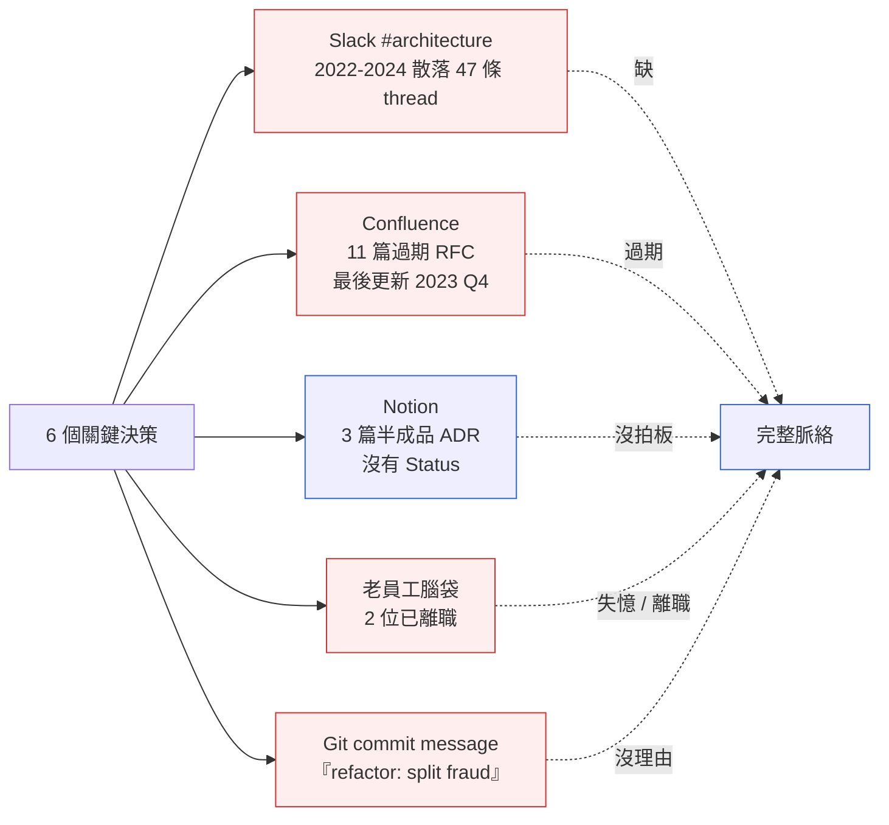
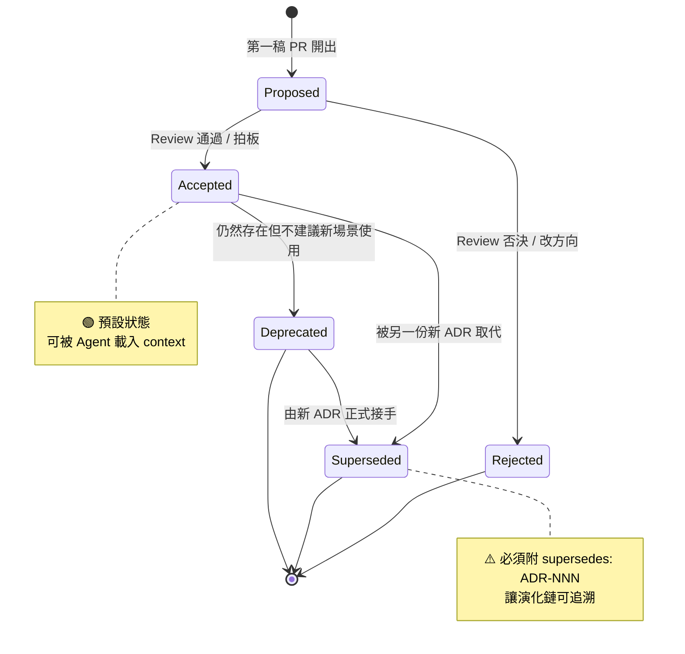
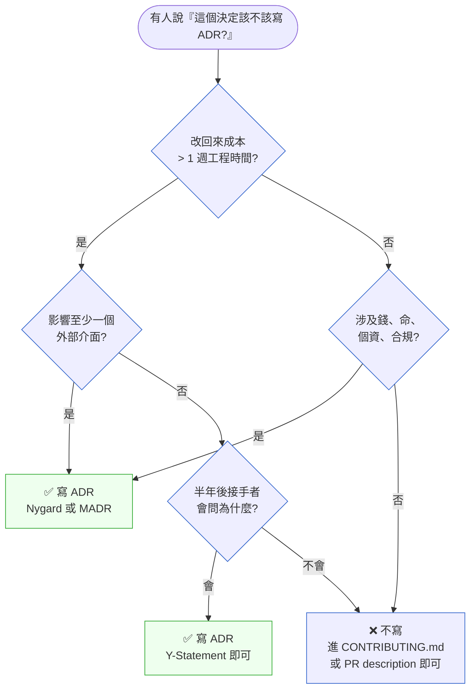

# 第 33 章|架構決策紀錄(ADR)與架構知識管理
## ⸺ 把決策寫成「決定的化石」

> **前置閱讀**:[Ch 1 為什麼 SA/SD](../part-01-foundations/ch-01-why-sa-sd.md)、[Ch 18 DDD 戰術設計](../part-04-architecture/ch-18-ddd-strategic-tactical.md)、[Ch 20 C4 Model 與架構視覺化](../part-04-architecture/ch-20-c4-model-visualization.md)
> **下游章節**:[Ch 34 Fitness Function 與演進式架構](./ch-34-fitness-functions.md)、[Ch 37 Context-Driven Engineering](../part-07-ai-era/ch-38-context-driven-engineering.md)
> **延伸補章**:無

---

## 33.1 冷觀察 ⸺ 8 個工程師,8 種版本的「為什麼」

我在 2026 年 2 月,陪一家虛構東南亞支付平台 **OrbitPay**(`CASE-FIN-008`)做新任架構長到任前的技術盡職調查。公司 96 人,工程 47 人,做新加坡與印尼跨境 e-wallet 與 SME 收單,日均交易約 180 萬筆,過了 PCI DSS 4.0、SOC 2 Type II,跑 Spring Boot 3.3 + PostgreSQL 17 + Kafka 3.7,21 個微服務。

那位即將上任的架構長 ⸺ 從某家美國發卡組織出身、五年資歷 ⸺ 進公司前先要了一份「過去三年所有重大技術決策清單」。她想看的是:**為什麼風控引擎是自研而不是接 Sift Science、為什麼 KMS 用 AWS KMS 不用 HashiCorp Vault、為什麼 Auth0 沒選改用自建 IDP、為什麼 Kafka 而不是 Pulsar、為什麼 PostgreSQL 而不是 CockroachDB、為什麼 IDR(印尼盾)清算用 Xendit 不接本地銀行 API**。

清單很短,六個問題。回答的人很多。

她週一上午約了當時的後端 lead(在公司第三年),下午約了 SRE lead(在公司第二年),週二約了風控組長(剛加入半年)、KYC 組長、清算組長、平台組長,週三約了 CTO 與最早的兩位創始工程師。一週下來,**6 個問題收到 8 種版本**。

她把答案攤在 Notion 上做交叉比對。光是「為什麼風控引擎是自研」這一題就有四種說法:

> 「2022 年那時 Sift 在新加坡沒有 region,延遲超過合規要求。」 ⸺ 後端 lead
>
> 「Sift 報價太高,當時月流水只有 20 萬美元,根本付不起。」 ⸺ CTO
>
> 「我們做過 PoC,Sift 的 ML 模型在東南亞 MCC 6010 場景的 false positive 太高。」 ⸺ 風控組長
>
> 「⋯⋯其實我也不太確定,我加入時就已經是自研了。」 ⸺ 平台組長

四個答案沒有彼此矛盾,但**也沒有一個能完整還原當時的決策脈絡**。原始的權衡 ⸺ 延遲、成本、模型準確度、合規 ⸺ 散在四個人的腦袋裡,湊起來才是完整的;而其中兩位早期關鍵決策者,一位已經離職、一位記憶模糊。

那一週,架構長翻了 OrbitPay 的所有「決策現場」:



那週的最後一天,她把調查報告交給董事會,中間有一句話被傳到工程團隊內部:

> 「OrbitPay 不是沒做過架構決策,是**從來沒有把任何一個決策真正寫下來**。」

這句話刺耳的不是「沒寫下來」這件事,而是 ⸺ 工程團隊一直以為自己有寫。Slack 的 thread、Confluence 的 RFC、Notion 的草稿、git commit、白板照片,**他們以為這些加總起來等於「有紀錄」**。但盡職調查那一週證明了:**散落的紀錄,等於沒有紀錄**。

---

## 33.2 真問題 ⸺ ADR 是「決定的化石」,不是「會議記錄」

Ch 1 已經把 ADR 介紹過一次:它是 Michael Nygard 在 2011 年那篇 800 字短文 [^CIT-300] 提出的格式,核心是**把每個重要架構決定寫成一份短文件,放在 repo 裡跟程式碼一起版本控制**。本章要做的不是重複介紹,是把它拆得更深一點。

把 OrbitPay 那場盡職調查的真問題拆開來看,它不是「沒寫文件」,而是**「沒有任何一份文件被設計成『三年後還能挖出來看』**。Slack 的 thread 不是,因為 Slack 是線性對話流,沒有索引;Confluence 的 RFC 不是,因為 RFC 通常在拍板那一刻就停止更新;git commit message 不是,因為 80 字的 subject 裝不下「為什麼不選另一個」。

ADR 的設計哲學就是對應這個缺口。它有三個刻意為之的特徵:

1. **跟程式碼同 repo、同 PR review** ⸺ 不會像 Confluence 那樣脫鉤腐爛
2. **不可變(immutable)** ⸺ 拍板後就不改,要改就寫一份新的 ADR Supersede 它,讓**演化軌跡可被追溯**
3. **對「為什麼不選另一個」誠實** ⸺ Consequences 一欄逼你寫下 trade-off,而不是只寫贏家

換句話說,ADR 真正在處理的是「**讓三年後的人能挖出當時的氣候**」。三年後接手的工程師、新任的架構長、AI Agent 在做 refactor 推論時 ⸺ 他們看到的不只是 git diff,還能看到那個 diff 當時**為什麼是合理的選擇**。

### 33.2.1 ADR 過度生產 vs 不足生產的雙重失敗

這個概念好懂,實務上卻容易翻車。現場最常見的失敗不是「沒寫 ADR」這個極端,而是兩個對稱的失敗模式同時存在於同一家公司。

**過度生產(Over-production)**:每個小決定都寫 ADR。`Tailwind vs Bootstrap`、`useState vs useReducer`、`commit message 用英文還是中文`,半年累積 200 份 ADR,沒人讀。團隊會逐漸發展出一種「ADR 阻力」⸺ 看到 ADR PR 就 LGTM 滑過去,因為**真的讀完每一份成本太高**。結果 ADR 倉庫在統計上是滿的,在認知上是空的。

**不足生產(Under-production)**:只在新專案 kickoff 時寫一次,後續任何決策更新都散落在 Slack、Notion、會議白板。OrbitPay 屬於這一型 ⸺ 他們的 `docs/adr/` 資料夾有 11 份 ADR,全部時間戳是 2022 年 Q1 公司剛成立那兩週,之後再也沒新增過。可是公司明明做了上百個重要決策。

這兩個極端的共同根源是同一件事:**沒有判準**。判準缺席,團隊只能憑直覺 ⸺ 直覺鬆的人就過度生產,直覺緊的人就不足生產。

### 33.2.2 判準很簡單:改回來成本 + 外部介面 + 不可逆

換句話說,寫不寫 ADR 不該靠「感覺重不重要」,而該靠三條結構性條件。Ch 1 §1.4 已經提過一個簡化版,本章把它寫成可直接抄走的判準:

> **改回來成本高**(reversibility cost)+ **影響至少一個外部介面**(external surface)+ **不可逆或半不可逆**(irreversibility)⸺ 三條中**任兩條成立,就值得寫 ADR**。

OrbitPay 那六題對照這個判準:

- 「為什麼 KMS 用 AWS KMS」⸺ 改回來要重加密所有 PII 與卡號 token、影響合規邊界、半不可逆。**三條都中,該寫 ADR**。
- 「為什麼 Kafka 不用 Pulsar」⸺ 改回來要重寫所有 producer/consumer、影響服務間契約、半不可逆。**三條都中,該寫 ADR**。
- 「為什麼 commit message 用英文」⸺ 改回來零成本、不影響任何外部介面、完全可逆。**零條中,不該寫 ADR**(寫進 CONTRIBUTING.md 即可)。

這個判準的好處是它不依賴主觀「感覺重不重要」,而是三個可驗證的結構性問題。團隊可以在 PR 模板裡放這三題,作為 ADR triage 的第一道閘門。

### 33.2.3 AI Agent 時代:ADR 變成 Skill 知識來源

到這裡為止講的都是 2011 年原版 ADR 的精神。2026 年多出一個維度:**ADR 不只是給人看的**,還是 AI Agent 的脈絡來源。

ManoMano 在 2026 年初公開了一篇工程部落格,描述他們把 `docs/adr/` 整批輸入 Claude Code 的 Skill 系統 [^CIT-307],讓 AI 在做架構提案時能「先讀過去的 ADR、避免重複討論已經拍板的決定」。Brevo 也在 2026 年發表了類似實踐 [^CIT-308],把 ADR 當成 Subagent 的 reference knowledge,refactor 任務啟動時 Subagent 會先撈所有 `Status: Accepted` 的 ADR 進 context window。

這個轉變的副作用是:**ADR 的品質要求提高了**。模糊的 ADR(「我們選了 PostgreSQL 因為它很好用」)會讓 AI Agent 做出錯誤推論;結構化的 ADR(「我們選了 PostgreSQL 17 是因為 partial index 對 multi-tenant 場景的 P95 比 MySQL 8 快 3.2x,trade-off 是 logical replication 比 MySQL 弱」)才能讓 Agent 在新場景做出對齊原始意圖的選擇。

換句話說,**人類讀者寬容,Agent 讀者不寬容**。ADR 在 AI 時代的品質紅線,被 Agent 拉高了。

---

## 33.3 決策框架 ⸺ ADR 的格式、判準、與架構知識整合

下面這幾張表跟兩張決策樹,在現場相當好用。它們的共同前提是:**ADR 不是寫得多就好,是寫得對才好**。

### 33.3.1 Nygard 模板四欄詳解

Michael Nygard 2011 年那篇短文 [^CIT-300] 提出的四欄模板,在 14 年後仍是業界共識。它故意只有四欄,不是因為簡單,是因為**多了的欄位通常會被跳過**。

| 欄位 | 一句話定義 | 寫得好的範例(OrbitPay 風控引擎) | 寫得壞的常見錯 |
|---|---|---|---|
| **Status** | 此 ADR 目前的生命狀態 | `Accepted` | 沒寫 / 永遠停在 `Proposed` / 用「進行中」「TBD」這種非標準字 |
| **Context** | 為什麼這個決策現在出現 | 「2022 Q1,月流水 20 萬美元,新加坡 region 上線在即,需要在 90 天內擋下 ≥ 80% 的卡片盜刷,P95 < 80ms。當時 Sift / Forter / Riskified 在 ap-southeast-1 都沒 region,延遲實測 220–340ms。」 | 寫成「業界普遍需要風控」這種沒上下文的描述 |
| **Decision** | 我們決定做什麼 | 「自研 FraudEngine 服務,規則引擎(Drools 8.x)+ XGBoost 二階段。Phase 1 規則為主、Phase 2 模型為輔。」 | 只寫「我們選 X」沒寫「不選 Y、Z」 |
| **Consequences** | 這個決定帶來的 trade-off(好與壞都要寫) | 「✅ P95 控制在 60ms;❌ 需要常駐 1.5 名 ML 工程師維護模型;❌ 模型 drift 監控需自建,沒有 vendor 現成方案;⚠️ 18 個月後若進入泰國市場,可能需要重新評估 Sift 是否已有 region。」 | 只寫好處、不寫壞處 |

這張表的關鍵在第四欄:**Consequences 必須寫壞處**。寫得好的 ADR 讀起來像在自我反駁,壞處欄位才是後人挖出來的真正價值 ⸺ 它告訴三年後的人「當時這個決定就已經知道會付出什麼代價」,讓後人能判斷代價是否仍然值得。

### 33.3.2 Status 生命週期狀態機

ADR 的 Status 不只是標籤,是一個有限狀態機。畫出來會比較清楚:



這張狀態機的關鍵在 `Superseded` 那條邊。當決策需要改變時,**不是去編輯舊 ADR**,而是寫一份新 ADR、在 frontmatter 標註 `supersedes: ADR-0017`,然後把舊的那份 Status 改成 `Superseded by ADR-0042`。這條紀律讓「決策的演化軌跡」變成可追溯的鏈,而不是被覆寫的歷史。

### 33.3.3 三種主流模板對照

ADR 不只 Nygard 一種寫法。2026 年現場最常見的有三種,各自取捨不同:

| 維度 | **Nygard 原版**(2011)[^CIT-300] | **MADR**(Markdown ADR)[^CIT-301] | **Y-Statement**(Olaf Zimmermann)[^CIT-302] |
|---|---|---|---|
| **欄位數** | 4(Status / Context / Decision / Consequences) | 7+(+ Considered Options / Decision Drivers / Pros & Cons) | 1 句結構化敘述 |
| **長度** | 200–500 字 | 500–1,500 字 | 50–80 字(一句話) |
| **格式哲學** | 極簡、四欄就夠 | 結構化、讓 trade-off 可比較 | 把整個決策壓成一句 |
| **適合場景** | 新創、團隊 < 20 人、決策高頻 | 中大型企業、決策需多方審查 | 嵌入 Slack / commit message / Jira card |
| **AI Agent 友好度** | 中(欄位少、語意清楚) | 高(欄位明確、Pros & Cons 結構化) | 低(過度壓縮,Agent 推不出 trade-off) |
| **Y-Statement 範例** | — | — | 「In the context of **跨境授權延遲控制**, facing **vendor 風控延遲 > 80ms** we decided **for 自研 FraudEngine** and against **Sift / Forter / Riskified** to achieve **P95 < 80ms**, accepting **常駐 1.5 名 ML 工程師維護成本**.」 |

**怎麼挑?** 一個堪用的拇指法則:**Nygard 是 daily driver,MADR 是 L 模式專案的升級版,Y-Statement 是 ADR 的 elevator pitch**。三者不必互斥 ⸺ OrbitPay 後來的做法是用 MADR 寫主檔,在 ADR 開頭加一行 Y-Statement 作為 TL;DR,讓忙碌的 reviewer 讀完那一句就有 80% 的理解。

### 33.3.4 ADR vs RFC 比較

這兩個常被混用,實際上定位不同。把它們攤開來看:

| 維度 | **ADR** | **RFC**(Request for Comments) |
|---|---|---|
| **時間點** | 決策**拍板後**的紀錄 | 決策**拍板前**的提案與討論 |
| **可變性** | Immutable(拍板後不改,改用 Supersede) | Mutable(討論期間反覆修改) |
| **長度** | 200–1,500 字 | 1,500–8,000 字 |
| **存活週期** | 永久(放 repo,跟程式碼同生命週期) | 通常 2–6 週(拍板後存歸檔) |
| **讀者** | 後人(三年後接手者、Agent) | 當下(同事 review、跨團隊對齊) |
| **產出物** | 「決定的化石」 | 「決策過程的會議記錄」 |
| **常見誤用** | 寫成「會議紀錄」(過長、有討論串) | 寫成「最終文件」(沒人後續更新到 ADR) |

**兩者的健康關係**:重大決策走 RFC 流程討論 → 拍板 → 把 RFC 的結論濃縮成 ADR 進 repo(RFC 本身可歸檔但不該成為 source of truth)。OrbitPay 的失敗模式是兩者混用 ⸺ 他們把 11 份 RFC 直接當 ADR,結果 RFC 過期沒更新、ADR 也沒寫,兩種 artifact 的好處都沒拿到。

### 33.3.5 寫不寫 ADR:一張決策樹

把 §33.2.2 的判準畫成決策樹會更直觀:



**這張圖的關鍵是右下角的 `Skip` 出口**。大部分日常決定走 Skip 是健康的。會被認為「太嚴格」是因為團隊習慣把每件事都寫進 ADR;真正的紀律是**留住那些「三年後還會被問」的決定**,其他都讓位給 PR description 或 CONTRIBUTING.md。

### 33.3.6 從 ADR 到 Architecture Knowledge Graph

當 ADR 數量累積到一定規模(50 份以上),會出現新的問題:**找不到**。「我記得有一份關於 KMS 的 ADR,但是哪一份來著?」這時候純 file-based 的 `docs/adr/` 已經不夠,需要往 Architecture Knowledge Graph(架構知識圖)演化 [^CIT-303]。

它的核心是把 ADR 之間的關係結構化:

| 關係 | 一句話定義 | 範例 |
|---|---|---|
| `supersedes` | A 取代 B | ADR-0042 supersedes ADR-0017(從自研 KMS 改用 AWS KMS) |
| `relates-to` | A 與 B 有相關決策 | ADR-0024(Kafka 選型)relates-to ADR-0031(Outbox Pattern) |
| `depends-on` | A 的成立依賴 B | ADR-0055(熱路徑用 Redis)depends-on ADR-0024(Kafka)的 EDA 決策 |
| `contradicts` | A 與 B 衝突(可能需要 review) | ADR-0067(自管 Postgres)contradicts ADR-0008(雲原生優先) |
| `implemented-in-c4` | A 對應 Container 圖某 view | ADR-0017 implemented-in-c4 `L2_AuthHotPath` |
| `verified-by-fitness` | A 由某條 Fitness Function 持續驗證 | ADR-0042 verified-by-fitness `kms-encryption-at-rest.sh` |

把這些關係寫進每份 ADR 的 frontmatter,就能用 Backstage(Spotify)[^CIT-304]、Glamorous Toolkit、或自寫腳本掃描 `docs/adr/*.md` 產出 graph。OrbitPay 後來導入 Backstage TechDocs 把 47 份 ADR 視覺化成 graph,新人 onboarding 時第一週的閱讀路徑從「翻 47 個檔案」變成「從 ADR-0001 沿著 relates-to / supersedes 邊走 12 步」。

### 33.3.7 ADR 與 C4 / Fitness Function 的整合節奏

ADR 不是孤島。Ch 20 §20.3.6 已經談過 ADR 與 C4 的整合,Ch 34 將談 Fitness Function。三者的關係可以這樣定:

- **C4(Ch 20)= 決定棲息的地形**(系統長什麼形狀)
- **ADR(Ch 33)= 決定的化石**(為什麼是這個形狀)
- **Fitness Function(Ch 34)= 決定的看守者**(這個形狀有沒有偏離)

整合節奏:

1. 每個 Level 2 Container 對應一份「為何存在」的 ADR(`Linked C4 view: L2_Container`)
2. 每份 ADR 的 Decision 欄位若可機器驗證,加一條 Fitness Function(`Linked Fitness Function: kms-at-rest.sh`)
3. CI 中 fitness function 失敗時,**自動在該 ADR 上開 issue**(「ADR-0042 的 invariant 被破壞,請 review 是否該寫一份 Supersede」)
4. ADR 進入 `Superseded` 狀態時,**對應的 fitness function 自動標 deprecated**

這條鏈條讓 ADR 不再是寫完就歸檔的文件,而是**活的契約**。

---

## 33.4 踩坑清單

下面這四個反模式,在 fintech、ecommerce、saas 各種領域都常見。它們的共同點是「有寫 ADR,但 ADR 沒在做 ADR 該做的事」。

### 反模式 1:每個 commit 都寫 ADR(過度生產)

某虛構新創在 kickoff 時被「ADR is best practice」說服,工程主管在 PR 模板加了一條「每個 commit 必附 ADR」。半年後 `docs/adr/` 累積 213 份,從「為什麼用 React 19」到「為什麼 button 用 padding 12px」都各自一份。團隊開始用 grep 找 ADR,找不到的就再寫一份,最終 ADR 變成「決策的雜訊」,reviewer 看到 ADR PR 全部 LGTM 滑過。

> ✅ **修正方向**:把 §33.3.5 的決策樹貼進 PR 模板。每份新 ADR PR 必須先回答三題(改回來成本 / 外部介面 / 不可逆),三題都不中的 PR reviewer 直接 reject 並建議改進 CONTRIBUTING.md 或 PR description。再做一次 ADR 大掃除:把過去過度生產的 ADR 標 `Status: Deprecated`(不刪,保留歷史),只留下符合判準的核心 ADR,讀的人才會回來讀。

### 反模式 2:ADR 只在 kickoff 寫,後續決策不更新(不足生產)

OrbitPay 的核心病灶。`docs/adr/` 只有 11 份,全部時間戳是公司剛成立那兩週,之後三年所有決策更新都散在 Slack thread、白板照片、老員工腦袋。決策本身做了上百個,**「決定的化石」卻只記錄了第一週的氣候**。

這個反模式特別容易發生在「公司起步快、技術主管自己腦袋裝得下」的階段。一旦團隊超過 20 人或工程主管離職,缺口就會被盡職調查、內部 audit、合規檢查放大。

> ✅ **修正方向**:把 ADR 寫入流程,而不是依賴自律。具體做法:在 PR 模板加一個 checkbox「本次變更是否符合 ADR 判準三題?符合請附 ADR-NNNN 連結」;在 sprint planning 結束前 5 分鐘留「ADR triage」固定議程;建立 ADR Index Card(本章 §33.5 交付),每月 review 一次新增的核心決策。**重點不是補寫,是把寫 ADR 變成日常節奏的一部分**。

### 反模式 3:ADR 沒 review 程序,寫了就過

某虛構支付公司導入 ADR 流程的第一年,團隊按 best practice 寫了 38 份 ADR,但沒有設定 review 流程 ⸺ 任何工程師可以開 PR 自己 merge。半年後 ADR-0017(KMS 選型)與 ADR-0028(secret 管理)相互矛盾,ADR-0024(Kafka)與 ADR-0031(訊息保證等級)沒對齊,ADR-0009(Auth 策略)在 ADR-0033 出現後從沒人標 Superseded。

ADR 的價值不只在「有寫」,在「**寫的時候有人挑戰、寫完後有人定期 review**」。沒 review 程序的 ADR,跟個人 Notion 上的隨筆沒有差別。

> ✅ **修正方向**:把 ADR 視為跟程式碼同等的工程產出,走相同 review 流程。具體做法:`docs/adr/` 在 GitHub `CODEOWNERS` 中指定 architecture team 為必審 reviewer;每份 ADR PR 至少 2 位 approve(其中一位必須是該領域 owner);每季度做一次「ADR audit」,掃所有 `Status: Accepted` 的 ADR 中是否有實際已被改變但沒 Supersede 的;建立 `relates-to` / `contradicts` 自動化檢查(見 Ch 34 fitness function)。

### 反模式 4:ADR 寫成週報(沒寫 Consequences)

某虛構 SaaS 的 ADR-0042 全文這樣寫:「我們決定改用 PostgreSQL 17。它比 MySQL 8 更好。已上線。⸺ 工程組,2026 Q1。」 這份 ADR 通過了 review,因為它有 Status、Context、Decision 三欄。問題在第四欄 Consequences 是空的 ⸺ 也就是說,**它沒寫下「這個決定要付什麼代價」**。

兩年後團隊評估遷移到 CockroachDB,沒人能回答「當初為什麼選 PG 17 而不是別的」⸺ 因為原始 ADR 沒寫 trade-off,只寫了「它比較好」。後人重新做一遍同樣的評估,等於沒寫 ADR。

> ✅ **修正方向**:把 Consequences 欄寫成必填,且必須包含「**至少兩個壞處或 trade-off**」。Reviewer 看到只寫好處的 ADR 直接打回。把這條規則寫進 PR 模板的自動檢查(可用 lint script 偵測 `❌` 或 `Trade-off:` 字串是否存在於 Consequences 段落)。**ADR 寫得好不好的最簡單測試,是讀起來像不像在自我反駁**。

---

## 33.5 交付清單 ⸺ 一頁式 ADR 模板 + Index Card

每份新 ADR,**第一份要產出的不是內容,是模板**。以下這份模板把 Nygard 原版四欄 + 2026 擴充欄位(Linked C4 / Linked Fitness Function / AI Skill Hint / Status timeline)整合在一頁,可直接抄走。

把它存在 `docs/adr/template.md`,新 ADR 從這份複製。

````markdown
---
adr: NNNN
title: {一句話描述決策}
status: Proposed | Accepted | Deprecated | Superseded
date: YYYY-MM-DD
deciders: [@alice, @bob]
supersedes: ADR-NNNN  # 可選
superseded-by: ADR-NNNN  # 可選
relates-to: [ADR-NNNN, ADR-NNNN]  # 可選
linked-c4-view: L2_Container  # 可選,對應 Ch 20 workspace.dsl
linked-fitness-function: scripts/fitness/{name}.sh  # 可選,對應 Ch 34
ai-skill-hint: |
  Agent 載入此 ADR 時應理解的核心 invariant
  (例:「KMS rotation 週期 ≤ 90 天」「所有 PII 必須 at-rest 加密」)
---

# ADR-NNNN: {標題}

## TL;DR(Y-Statement)

> In the context of **{場景}**, facing **{問題}** we decided **for {選擇}**
> and against **{未選擇的選項}** to achieve **{目標}**, accepting **{已知代價}**.

## Status

`Accepted` (YYYY-MM-DD)

### Status Timeline
- YYYY-MM-DD `Proposed` by @author
- YYYY-MM-DD `Accepted` after RFC-XXX discussion
- (若 Superseded) YYYY-MM-DD `Superseded by ADR-NNNN`

## Context

{當下的業務 / 技術 / 組織壓力,寫得讓三年後的人能還原氣候。
最少包含:時間點、規模(用戶數 / 流量 / 團隊大小)、約束(合規 / 預算 /
時程)、被拒絕的替代方案在當時為何不可行。}

## Decision

{我們決定做什麼。一句話,然後用 bullet 補細節。}

### Considered Alternatives
- **{選項 A}**:✅ {優點};❌ {為何當時不選}
- **{選項 B}**:✅ {優點};❌ {為何當時不選}
- **{選項 C / 我們的選擇}**:✅ {優點};⚠️ {已知代價}

## Consequences

### ✅ 好處(必填,≥ 1)
- {可量化的好處}
- {可量化的好處}

### ❌ 壞處 / Trade-off(必填,≥ 2)
- {代價 1}:{什麼情境下會痛}
- {代價 2}:{什麼情境下會痛}

### ⚠️ 未來 review 觸發條件
- 當 {條件} 發生時,本 ADR 應重新評估
- 例:「當月流水 > 500 萬美元」「當進入第三個地理市場」

## Verification

- **C4 view**:{對應 view 名稱,例 `L2_AuthHotPath`}
- **Fitness Function**:{腳本路徑與 invariant,例 `kms-rotation-90d.sh`}
- **手動 review 週期**:{例「每季度」}

## References

- RFC-XXX(若有)
- ADR-NNNN(相關決策)
- 外部 link(vendor 文件 / RFC / 論文)
````

**為什麼模板必須有 `ai-skill-hint` 欄位?** 2026 年 ADR 的讀者多了一類:Agent。Skill Hint 是寫給 Agent 看的「核心 invariant 摘要」,讓 Agent 在做新場景推論時能快速擷取本 ADR 的關鍵約束,不必 parse 全文。寫的時候用一兩句話即可,目的是讓 Agent 不會在 context window 滿載時把這個 ADR 當作雜訊跳過。

**為什麼必須有「未來 review 觸發條件」?** ADR 是不可變的,但決策的有效性有時效。「月流水 20 萬美元時自研風控」是合理的,「月流水 5,000 萬美元時還在自研」可能就需要重新評估。把觸發條件寫下來,等於替三年後的人預先設了鬧鐘。

### 33.5.1 範例:OrbitPay ADR-0042「採用 AWS KMS」

那位架構長要求工程團隊在到任 90 天內把 6 個關鍵決策補成 ADR。OrbitPay(`CASE-FIN-008`)補的時候已經是事實 4 年後 ⸺ 但**晚補的 ADR 比沒補強得多**。下面這份是其中之一:

````markdown
---
adr: 0042
title: 採用 AWS KMS 而非自管 HashiCorp Vault 處理 PII 與卡號 token 加密
status: Accepted
date: 2026-03-12  # 補寫日期(原始決策 2022-Q2)
deciders: [@cto, @sec-lead, @platform-lead]
supersedes: ADR-0008  # 原本提案自架 Vault
relates-to: [ADR-0017, ADR-0061]
linked-c4-view: L2_AuthHotPath
linked-fitness-function: scripts/fitness/kms-rotation-90d.sh
ai-skill-hint: |
  - 所有 PII 與 PAN token 必須以 AWS KMS CMK at-rest 加密
  - CMK 旋轉週期 ≤ 90 天(由 fitness function 自動驗證)
  - 跨 region failover 時需確認 multi-region key 已 replicate
---

# ADR-0042: 採用 AWS KMS 而非自管 HashiCorp Vault

## TL;DR(Y-Statement)
<!-- 為什麼這欄:Y-Statement 強迫作者把「在什麼情境下、為了什麼、放棄什麼」
     壓進一句話;寫不出 Y-Statement 表示自己其實沒搞清楚決策結構。 -->

> In the context of **2022 Q2、12 人團隊、月流水 USD 80 萬、PCI DSS 4.0 待認證**,
> facing **PII / PAN token 必須 at-rest 加密、且需通過外部稽核**, we decided
> **for AWS KMS(managed)** and against **自架 HashiCorp Vault HA cluster**
> to achieve **6 週內通過 PCI DSS Token Storage 控制項**, accepting
> **vendor lock-in 與每月 USD 1,200 較高的營運成本**.

## Status
`Accepted` (2026-03-12,補寫;原始決策 2022-Q2)

### Status Timeline
- 2022-04-08 `Proposed` 自架 HashiCorp Vault HA(原 ADR-0008)
- 2022-05-23 `Reversed` 改採 AWS KMS,但**未寫成 ADR**
- 2026-03-12 `Accepted` 補寫成本 ADR(架構長盡職調查觸發)

## Context
<!-- 為什麼這欄:三年後的人能不能還原當時的氣候,全靠這一欄;
     寫得太籠統(「當時人手不夠」)等於沒寫。 -->

2022 Q2 OrbitPay 12 人(工程 7 人,無專責 SRE),月流水 USD 80 萬,
PCI DSS 4.0 認證已啟動(目標 Q4 通過)。風控與發卡 token 化必須 at-rest
加密,且 KMS 操作需有完整 audit trail。

被拒絕的方案:**自架 HashiCorp Vault HA(3 nodes)**。當時拒絕理由:
- 7 人工程團隊裡沒人有 Vault 運維經驗
- HA topology + HSM 整合 PoC 估 8–10 週,擠壓 PCI 認證時程
- 稽核員首選 AWS KMS(現成 PCI DSS Level 1 attestation)

## Decision

採用 **AWS KMS** 作為 OrbitPay 所有 PII 與 PAN token 的 at-rest 加密 key
管理服務,key policy 由 IaC(Terraform)管理。

### Considered Alternatives
- **自架 HashiCorp Vault HA**:✅ 無 vendor lock-in、可跨雲;
  ❌ 運維能力不足、認證時程不允許、HSM 整合成本高
- **GCP Cloud KMS**:✅ 成熟、定價接近;
  ❌ 主要負載已在 AWS,跨雲增加複雜度
- **AWS KMS**(我們的選擇):✅ 6 週可上線、PCI 直接過、IAM 整合;
  ⚠️ vendor lock-in、跨 region failover 需額外設計

## Consequences

### ✅ 好處(必填,≥ 1)
- PCI DSS Token Storage 控制項 2022 Q4 一次通過,稽核 evidence 直接拉 KMS audit log
- 2024 從單區擴到雙區時,multi-region keys 啟用 < 1 天

### ❌ 壞處 / Trade-off(必填,≥ 2)
- **Vendor lock-in**:若未來決定離開 AWS,所有加密資料需重新 envelope encryption
- **成本**:每月 USD 1,200(2026 規模),自架 Vault 估 USD 400 + 0.3 FTE

### ⚠️ 未來 review 觸發條件
<!-- 為什麼這欄:ADR 不可變,但決策有時效;
     寫下觸發條件等於替三年後的人預先設了鬧鐘。 -->
- 當月流水 > USD 5,000 萬(自架成本回收期變短),重新評估
- 當進入第三個地理市場且該市場資料主權法規禁止 AWS,重新評估
- 當 KMS 月成本 > USD 5,000(目前 USD 1,200),重新評估

## Verification
- **C4 view**:`L2_AuthHotPath`(token 簽發路徑)
- **Fitness Function**:`scripts/fitness/kms-rotation-90d.sh`
  (每日 cron,驗證所有 CMK 最近 rotation < 90 天,失敗則 PagerDuty)
- **手動 review 週期**:每年 PCI 重認證時 + 任一觸發條件成立時

## References
- ADR-0008(原本提案自架 Vault,被本 ADR Supersede)
- ADR-0017(自研 FraudEngine,共用 KMS-encrypted token store)
- AWS KMS PCI DSS Attestation: https://aws.amazon.com/compliance/pci-dss-level-1-faqs/
````

OrbitPay 那 6 題用同樣方式補成 ADR,142 篇舊文檔被收斂成 47 篇活的。**這份 ADR 補寫於決策後 4 年,但因為 Context 一欄誠實寫了「當時 7 人團隊、無 Vault 運維」,接手的人 30 秒就懂為什麼這個選擇在 2022 是對的、為什麼在 2026 仍然不需要重做。**

### 33.5.2 ADR Index Card(repo 級別清單)

單份 ADR 之外,每個 repo 還需要一份索引,放在 `docs/adr/README.md`。它解決「ADR 累積到 50 份後找不到」的問題。

````markdown
# ADR Index — {專案名稱}

> 本 repo 所有 Architecture Decision Records 索引。
> 新增 ADR:複製 `template.md` → 編號取下一個未用 → 加入下表。
> 判準:見 [Ch 33 §33.3.5 決策樹](./ch-33-adr-architecture-knowledge.md#3335-寫不寫-adr一張決策樹)。

## 核心(Status: Accepted,Agent 應載入)

| ADR | 標題 | 領域 | 影響 C4 view | Fitness Func | 最近 review |
|---|---|---|---|---|---|
| `0001` | 從 Modular Monolith 起步 | 架構 | L2_Container | `module-boundary.sh` | 2026-Q1 |
| `0017` | 自研 FraudEngine | 風控 | L2_AuthHotPath | `fraud-p95-80ms.sh` | 2026-Q1 |
| `0042` | KMS 採用 AWS KMS | 安全 | L2_Container | `kms-rotation-90d.sh` | 2026-Q1 |

## 已被取代(Status: Superseded)

| ADR | 標題 | 被誰取代 |
|---|---|---|
| `0008` | 自架 HashiCorp Vault | ADR-0042 |

## 已棄用(Status: Deprecated)

| ADR | 標題 | 棄用日期 | 理由 |
|---|---|---|---|
| `0023` | CockroachDB PoC | 2025-Q3 | PoC 結束,未進入 production |

## 提案中(Status: Proposed)

| ADR | 標題 | RFC link | 預計拍板 |
|---|---|---|---|
| `0067` | Kafka → Pulsar 遷移評估 | RFC-019 | 2026-Q3 |
````

**為什麼 Index Card 要分四個區塊?** 不同讀者要找的東西不同:Agent 只應載入 `Accepted`;新人 onboarding 主要看 `Accepted` + `Superseded`(理解演化);架構長 review 看 `Proposed`;合規稽核可能要看全部。分區塊讓「按讀者意圖找」變得便宜。

### 33.5.3 範例:OrbitPay 收斂後的 Index Card

OrbitPay 把 142 篇舊文檔(11 篇老 ADR + 47 條 Slack thread + 11 篇過期 RFC + 73 條雜項)收斂成 47 篇活的 ADR 後,`docs/adr/README.md` 長這樣:

````markdown
# ADR Index — OrbitPay Platform

> 47 份活的 ADR,涵蓋 2022-04 至今所有「改回來成本高 + 影響外部介面 + 不可逆」
> 三條至少中兩條的決策。
> 新增 ADR:複製 `template.md`,編號取下一個未用,加入下表。

## 核心(Status: Accepted,Agent 應載入)
<!-- 為什麼這區塊放最上面:Agent 載入 ADR 時應該優先讀 Accepted;
     新人 onboarding 看完這區塊就懂 80% 決策。 -->

| ADR | 標題 | 領域 | 影響 C4 view | Fitness Func | 最近 review |
|---|---|---|---|---|---|
| `0001` | 從 Modular Monolith 起步 | 架構 | L2_Container | `module-boundary.sh` | 2026-Q1 |
| `0017` | 自研 FraudEngine 而非 Sift | 風控 | L2_AuthHotPath | `fraud-p95-80ms.sh` | 2026-Q1 |
| `0023` | 採用 Auth0 作 IDP | 安全 | L2_Container | `auth0-availability.sh` | 2026-Q1 |
| `0031` | Kafka 而非 Pulsar | 平台 | L2_EventBackbone | `kafka-lag-30s.sh` | 2026-Q1 |
| `0036` | PostgreSQL 而非 CockroachDB | 資料 | L2_DataPlane | `pg-replication-lag.sh` | 2026-Q1 |
| `0042` | AWS KMS 而非自管 Vault | 安全 | L2_AuthHotPath | `kms-rotation-90d.sh` | 2026-Q1 |
| `0049` | IDR 清算接 Xendit 而非本地銀行 | 清算 | L2_ClearingPath | `idr-settlement-t1.sh` | 2026-Q1 |

## 已被取代(Status: Superseded)
<!-- 為什麼有這區塊:演化軌跡不能丟;
     新人接手最常問的就是「為什麼之前那個方案不能用」。 -->

| ADR | 標題 | 被誰取代 |
|---|---|---|
| `0008` | 自架 HashiCorp Vault HA | ADR-0042 |
| `0019` | OAuth 2.0 自建 IDP | ADR-0023 |

## 已棄用(Status: Deprecated)
<!-- 為什麼跟 Superseded 分開:Deprecated 是「這條路試過、結束了」,
     Superseded 是「換了更好的方案」;讀者意圖不同。 -->

| ADR | 標題 | 棄用日期 | 理由 |
|---|---|---|---|
| `0027` | CockroachDB PoC | 2025-Q3 | PoC 結束,結果見 ADR-0036 |

## 提案中(Status: Proposed)
| ADR | 標題 | RFC link | 預計拍板 |
|---|---|---|---|
| `0067` | Kafka → Pulsar 遷移評估 | RFC-019 | 2026-Q3 |
| `0071` | Cell-based 跨區拓撲 | RFC-022 | 2026-Q4 |
````

那位架構長到任 90 天後在公司內信寫了一句:**「現在我問任何 6 題,所有人答的版本是同一個。」**

---

## 33.6 本章交付清單 Recap

讀完本章,你應該已經能做到:

- [ ] 講清楚 ADR 在 2026 年的雙重角色:**對人**是「決定的化石」、**對 Agent** 是 Skill 知識來源,並理解這兩個讀者對 ADR 品質的要求差異
- [ ] 用「改回來成本 + 外部介面 + 不可逆」三條判準幫當前團隊決定**這次該不該寫 ADR**,避開過度生產與不足生產的雙重失敗
- [ ] 在會議上認得出四個反模式(每 commit 都寫 / 只在 kickoff 寫 / 沒 review 程序 / 沒寫 Consequences),並有一句話的修正方向可以接著說
- [ ] 為手上的專案寫好一份 `docs/adr/template.md` + `docs/adr/README.md`(Index Card),並把第一份核心決策 ADR-0001 寫進去

如果四項中先挑一項做完就好,建議是最後那一項 ⸺ 把專案最重要的那一個架構決策(通常是「為什麼選這個架構風格」)寫成 ADR-0001,跟 Ch 20 的 `workspace.dsl` 同一個 PR 進 repo。本章 ADR 是「為什麼是這個形狀」,Ch 20 C4 是「形狀長什麼樣」,Ch 34 Fitness Function 是「形狀有沒有偏離」⸺ 三章的 artifact 合在一起,構成一個系統「**可被傳遞的理解**」的最小完整劑量。

---

## Cross-References

- **回顧**:[Ch 1 §1.4 反模式 2](../part-01-foundations/ch-01-why-sa-sd.md#反模式-2用-adr-當週報) ⸺ 本章把那個反模式深化為四個
- **回顧**:[Ch 18 DDD 戰術設計](../part-04-architecture/ch-18-ddd-strategic-tactical.md) ⸺ Bounded Context 邊界決策常產出 ADR
- **回顧**:[Ch 20 C4 Model](../part-04-architecture/ch-20-c4-model-visualization.md) ⸺ ADR 對應 Container 圖的整合節奏
- **下一章**:[Ch 34 Fitness Function 與演進式架構](./ch-34-fitness-functions.md) ⸺ 把 ADR 的 invariant 變成可機器驗證的看守者
- **AI 時代脈絡**:[Ch 37 Context-Driven Engineering](../part-07-ai-era/ch-38-context-driven-engineering.md) ⸺ ADR 作為 AI Agent 的 Skill 知識來源

## 引用

[^CIT-300]: Michael Nygard, "Documenting Architecture Decisions" (2011)。同 CIT-004,本章在 ADR 模板與「決定的化石」脈絡再引。cognitect.com/blog/2011/11/15/documenting-architecture-decisions。
[^CIT-301]: MADR (Markdown Any Decision Records) — adr.github.io/madr。MADR 4.0 模板,2024 年起為許多企業的預設 ADR 格式。
[^CIT-302]: Olaf Zimmermann, "Y-Statements: A Light Template for Architectural Decision Capturing" — medium.com/olzzio/y-statements-10eb07b5a177(2018)。
[^CIT-303]: Manuel Pérez-Vásquez et al., "Architecture Knowledge Graphs: A Systematic Mapping Study" — IEEE Access / IST 2023–2025 系列論文。
[^CIT-304]: Backstage (Spotify, CNCF Incubating) — backstage.io。TechDocs + Software Catalog 提供 ADR 索引與架構知識圖視覺化。
[^CIT-305]: adr.github.io — ADR community canonical site,匯整 Nygard / MADR / Y-Statement 等模板與工具(adr-tools、log4brains、adr-manager)。
[^CIT-306]: Anthropic, "Claude Code Skills" 與 "Subagents" 文檔(2025–2026)— docs.anthropic.com/claude-code/skills。Skill 載入機制讓 ADR 可作為 Agent 的 reference knowledge。
[^CIT-307]: ManoMano Tech Blog, "How we turned our ADRs into Claude Code Skills" (2026) — medium.com/manomano-tech。
[^CIT-308]: Brevo Engineering Blog, "ADR-driven Subagents for Refactor Tasks" (2026)。
[^CIT-309]: Neal Ford, Rebecca Parsons, Patrick Kua, "Building Evolutionary Architectures, 2nd Edition" (O'Reilly, 2023)。Fitness Function 與 ADR 整合的章節基礎。
