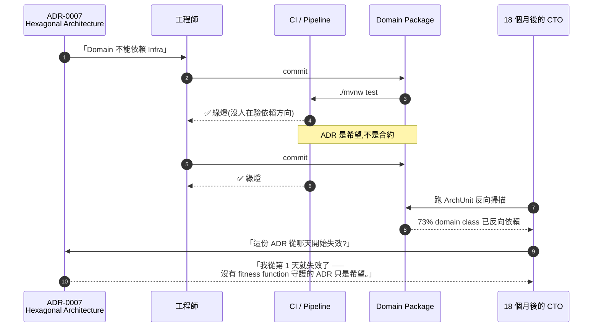
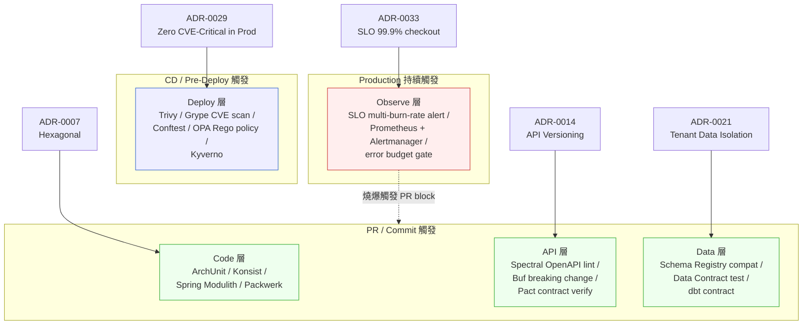
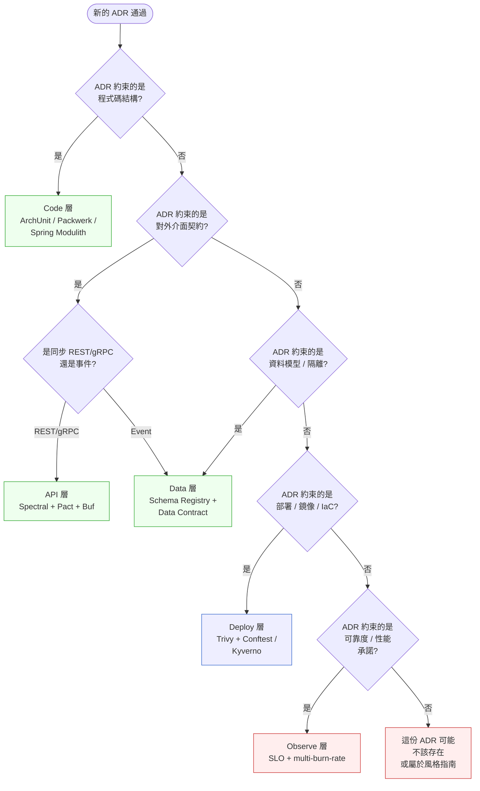

# 第 34 章|架構適應度函式
## ⸺ 把架構規則寫成可執行的測試

> **前置閱讀**:[Ch 11 設計原則 SOLID 與依賴方向](../part-03-design/ch-11-architecture-principles.md)、[Ch 21 Modular Monolith](../part-04-architecture/ch-21-modular-monolith.md)、[Ch 33 ADR](./ch-33-adr-architecture-knowledge.md)
> **下游章節**:[Ch 32 平台工程 / Internal Developer Platform](./ch-32-platform-engineering-idp.md)
> **延伸補章**:無

---

## 34.1 冷觀察 ⸺ ADR 寫了 Hexagonal,18 個月後依賴方向反向 73%

我在 2026 年 Q1 進過一家虛構多租戶 B2B SaaS 公司,內部代號 **HelixOps**(`CASE-SAS-008`)。HelixOps 做的是「給中型製造業的工單與資產管理平台」,1,200 客戶、ARR 6,800 萬美元、工程 34 人,主系統 Spring Boot 3.3 + PostgreSQL 17 + Kubernetes 1.31。

那次進場的原因,是他們的 CTO 在內部 town hall 講了一句話:

> 「我們三年前的 ADR-0007 寫得很漂亮,Hexagonal Architecture、Domain 不依賴 Infra、Application 只透過 Port 對外 ⸺ 但今天我們的 domain package 直接 `import javax.sql.DataSource`、直接 `@Autowired JdbcTemplate`、直接呼叫 `RestTemplate`。這份 ADR 從哪一天開始失效的,沒人知道。」

我把 HelixOps 那批 commit 拉下來,跑了一次 ArchUnit 反向掃描。報告長這樣:

| 違反方向 | 違反檔案數 | 第一次違反 commit | 從 ADR 到第一次違反 |
|---|---|---|---|
| domain → infrastructure | 47 | 2024-08-12 | 11 個月 |
| domain → web(controller) | 18 | 2024-11-03 | 14 個月 |
| application → 第三方 SDK 直接 import | 23 | 2025-02-19 | 17 個月 |
| 同一個 aggregate 跨 BC 直接讀 | 9 | 2025-04-07 | 19 個月 |
| **合計反向依賴** | **97** | ⸺ | ⸺ |
| 對應 domain 層 class 總數 | 132 | ⸺ | **73% 已反向** |

那場會議裡負責這份 ADR 的 staff engineer 沒答上來這 11 個月之間有誰知道、誰簽過、誰退過 PR。追查 git 記錄之後,因果鏈變得清晰:

- **2023-09**:ADR-0007 正式通過,Hexagonal Architecture 規則由 CTO 簽字。
- **2023-09 ~ 2024-08**:整整 11 個月,**ArchUnit 規則從來沒被寫進 CI**。不是「寫了但沒開」,是「計劃中但一直排不進 sprint」⸺ 每個 sprint 都有更緊急的功能。
- **2024-08-12**:第一次 domain → infrastructure 反向依賴進入 codebase,PR 被 merge,CI 綠燈。
- **2024-08 ~ 2025-04**:19 個月內,97 處違反逐筆累積,**平均每 5.8 天發生一次**,每次 CI 都是綠燈。
- **2026-01**:HelixOps 引入外部 SA 審查,跑 ArchUnit 反向掃描,才第一次看到 73% 這個數字。

如果 ArchUnit 規則在 ADR-0007 通過的同一週(2023-09)就進 CI,第一次違反(2024-08-12 那筆)就會被擋住,97 處違反的累積數字會是 **0**。問題不是「從一開始就該有還是 6 個月後補」⸺ 問題是**它被計劃了但從未被執行**。`./mvnw test` 永遠綠燈,SonarQube 永遠 A 級,因為那條本該存在的測試從來沒有被寫進 CI。

把 HelixOps 那 18 個月的腐爛壓成一張圖,大概長這樣:



事故 postmortem 那天,CTO 在白板上把一句話寫得很大,我把它原樣記下來:

> 「沒有 fitness function 的 ADR,不是文件,是希望。希望會腐爛,合約不會。」

這句話聽起來像箴言,但它的價值在它後面那條:**HelixOps 從來沒有「架構自然演進」,他們只有「架構自然腐爛」**。Evolutionary Architecture 不是一個被動描述,是一個主動工程實踐 ⸺ 沒有 Fitness Function 守護的演進,就是腐爛。

---

## 34.2 真問題 ⸺ Fitness Function 是把 ADR 變合約

「我們有 ADR 了,夠了吧?」「我們有 ArchUnit 了,夠了吧?」這兩個問題,把它拆開來看會比較清楚。它們的共同預設都錯了同一件事:預設了「寫下來的規則會被遵守」。

### 34.2.1 從「規則」到「合約」差一條 CI line

ADR 與 Fitness Function 的關係,可以用「合約 vs 希望」這組對照來看:

| 維度 | 沒有 Fitness Function 的 ADR | 有 Fitness Function 的 ADR |
|---|---|---|
| **形式** | Markdown 文件 | Markdown 文件 + CI 中可執行的測試 |
| **驗證時點** | PR review(人工,容易漏) | 每個 commit(自動,不會漏) |
| **失效時點** | 半年後沒人記得 | PR 違反當下被擋 |
| **新人 onboarding** | 「請去讀那份 ADR」(讀不讀沒人查) | 「不用讀,改錯了 CI 會擋你」 |
| **本質** | 希望 / 共識 / 紳士協定 | 合約 / 編譯期或 CI 強制 |

換句話說,Fitness Function 不是「另外一種文件」,**它是把 ADR 從希望升級為合約的那條 CI line**。Neal Ford 與 Rebecca Parsons 在 *Building Evolutionary Architectures* 2nd ed. (2023) [^CIT-310] 裡把這件事寫得很直接:「架構特徵(architectural characteristics)若沒有對應的 fitness function,就無法在演進中被守護」。

### 34.2.2 Evolutionary Architecture 不是「自然會演進」

Evolutionary Architecture 這個詞容易被誤讀成「架構會自己演進」。實際上 Ford/Parsons/Kua 在書裡反覆強調的是反面:**架構在沒有守護的情況下,不會演進,只會腐爛**。

把這個意思拆開來看:

- **架構腐爛(Architectural Erosion)**:依賴方向反轉、模組邊界破裂、契約版本失控、安全規則繞過 ⸺ 這四件事是熵的方向。
- **架構演進(Architectural Evolution)**:在腐爛的逆向上施加「**選擇性壓力**」,讓某些變動可以發生(新功能、新模式),某些變動被擋下(反向依賴、契約破壞)。
- **Fitness Function**:就是那組「選擇性壓力」的具體形式 ⸺ 一段可被機器執行的判斷,告訴 CI 哪些變動該過、哪些該擋。

Charles Darwin 講的是物種對環境的適應度,軟體架構這裡借用的是同一個詞:**fitness 是「對某個品質屬性的適應程度」,function 是「把這個適應程度量化成可執行測試」**。沒有 function,就沒有 fitness;沒有 fitness,就沒有 evolution,只有 erosion。

這裡需要一個重要的區分:腐爛能夠被發現的前提,是腐爛要**可觀測**且審查要**夠頻繁**。HelixOps 那 97 處違反是在 19 個月內以「平均每 5.8 天一筆」的速度累積的 ⸺ 如果他們每季做一次架構健康審查,第一次季度審查(2023-12)就能看到當時已有的 3–4 處違反。換言之,**季度架構審查也能抓到腐爛**,只是速度慢、人工成本高、且依賴「有人記得做」這個前提。

Fitness Function 的核心價值不是「它是守護架構的唯一方法」,而是:**偵測自動化 + 偵測即時**。違反發生在 commit 層,被擋也在 commit 層;不需要等到下一次季度 review,不需要有人記得安排這個會議,也不需要人工跑掃描工具。這兩個屬性讓腐爛的**發現延遲從「月」降到「分鐘」**,從而讓清理成本從「重構衝刺」降到「修這一個 PR」。準確的說法是:**沒有可觀測的 fitness function 加上定期審查,腐爛就會變得不可見且難以逆轉**;fitness function 是讓這個可觀測性自動化、持續化的最高效機制。

### 34.2.3 多數團隊只用了第一層

現場常見的情況是:團隊聽說過 ArchUnit、Packwerk,寫了三條規則(「不能跨 package import internal」、「Controller 不能依賴 Repository」、「不能用 deprecated API」),把它叫做「我們有做 fitness function 了」。然後就停在這裡。

這只是 fitness function 的**第一層 ⸺ Code 層**。實際上 fitness function 在現場至少有五層,每一層守護不同的架構特徵:

| 層級 | 守護什麼 | 沒守護的後果 |
|---|---|---|
| **Code** | 依賴方向、模組邊界、命名規範 | 程式碼腐爛(HelixOps § 31.1) |
| **API** | 介面相容性、契約破壞、版本升級節奏 | 上下游服務無預警斷 |
| **Data** | Schema 演進相容性、PII 標註、欄位語意 | 下游分析 / ML pipeline 默默壞掉 |
| **Deploy** | Image 漏洞、IaC 政策、Secret 洩漏 | 上線後才發現 CVE / Compliance 違反 |
| **Observe** | SLO 達成、Error Budget 燒盡速率 | 用戶比 dashboard 早三天知道你掛了 |

只做第一層,等於只擋住「程式碼腐爛」一種腐爛方向。API 默默破壞、Data Schema 默默不相容、Image 帶 critical CVE、SLO 燒爆 ⸺ 這四種腐爛全都不會被那三條 ArchUnit 擋下。HelixOps 那 18 個月,Code 層的問題只是冰山一角,API 層他們有 7 個 partner 接到過破壞性變更而不知情、Data 層 customer-events topic 的 schema 換過兩次沒做 backward compatibility 檢查、Deploy 層上線過 2 個帶 CVE-9.8 的 base image。

這一章接下來要做的,就是把這五層攤開講。

---

## 34.3 決策框架 ⸺ Fitness Function 五層 × 三維分類

### 34.3.1 五層 Fitness Function 全景圖

把 HelixOps 後來重建的那套 fitness function 體系畫成一張圖,大致長這樣。圖的價值不是「列出工具」,是讓你看到「**每一層的 fitness function 對應到 SDLC 的哪個時點、由誰擁有、卡哪個 PR**」。



這張圖最關鍵的是右下那條虛線:**Observe 層燒爆,反向回去 block PR**。SLO error budget 不只是 SRE 的事,它是 fitness function 的最後一層 ⸺ 如果近 7 天 error budget 燒掉超過 50%,新功能 PR 就應該被擋,這是 Ch 30 的延伸,也是 § 31.4 第四條反模式要處理的。

### 34.3.2 三維分類:Atomic / Holistic、Triggered / Continuous、Static / Dynamic

Ford & Parsons 在書裡給了一組三維分類,在現場用來決定「**這個 fitness function 該怎麼跑**」很好用 [^CIT-310]:

| 維度 | 兩端 | 在現場的意思 |
|---|---|---|
| **Atomic vs Holistic** | 單一架構特徵 ↔ 多個特徵組合 | Atomic: 「依賴方向」;Holistic: 「依賴方向 + 啟動時間 + tenant 隔離」綜合驗證 |
| **Triggered vs Continuous** | 觸發式 ↔ 連續式 | Triggered: PR 跑一次;Continuous: Production 24x7 跑(SLO 監控) |
| **Static vs Dynamic** | 靜態分析 ↔ 動態執行 | Static: ArchUnit 看 bytecode;Dynamic: Pact 真的跑請求驗證 |

這三維可以組成 8 種 fitness function。在 HelixOps 落地時,八種裡面真正常用的是其中四種:

| 組合 | 例子 | 在哪裡跑 |
|---|---|---|
| Atomic / Triggered / Static | ArchUnit「domain 不依賴 infra」 | PR CI(ms 級) |
| Atomic / Triggered / Dynamic | Pact 對 partner contract 的 verify | PR CI(秒級) |
| Holistic / Triggered / Dynamic | Trivy + Conftest + 啟動煙霧測試 | Pre-deploy(分鐘級) |
| Atomic / Continuous / Dynamic | SLO multi-burn-rate alert | Production(持續) |

剩下四種(Holistic Static、Holistic Continuous Static 等)在現場通常是 over-engineering,不建議第一年就上。

### 34.3.3 工具對照表(2026 年版)

選工具不是這節的重點,**選哪一層該用哪個工具,才是**。下面這張表把 § 31.3.1 五層的常用選項並排,版本標到 2026 Q1 還在維護的版本:

| 層 | 守護目標 | 主流工具 | 對應 ADR 類型 |
|---|---|---|---|
| **Code** | 模組邊界 / 依賴方向 / 命名 | ArchUnit 1.3 (Java/Kotlin) [^CIT-311]、Konsist 0.17 (Kotlin) [^CIT-312]、Spring Modulith 1.4 [^CIT-313]、Packwerk 3.x (Ruby) [^CIT-314]、NetArchTest 1.3 (.NET) | 架構風格、模組劃分 |
| **API** | OpenAPI lint / breaking change / consumer contract | Spectral 6.x [^CIT-315]、Buf CLI / Breaking change detector [^CIT-316]、Pact 2.x [^CIT-317] | API 版本政策、棄用節奏 |
| **Data** | Schema 相容性 / Data Contract / 欄位語意 | Confluent Schema Registry / Apicurio [^CIT-318]、dbt contract、Data Contract CLI、Great Expectations | 資料契約、PII 標註 |
| **Deploy** | CVE / IaC / 政策 | Trivy 0.5x / Grype [^CIT-319]、Conftest + OPA Rego、Kyverno、Checkov | 上線政策、Compliance |
| **Observe** | SLO / Error Budget | Prometheus + Alertmanager(multi-window multi-burn-rate) [^CIT-318b]、Sloth、OpenSLO、Pyrra | 可靠度承諾、容量規劃 |

### 34.3.4 「這條 ADR 該寫哪一層 Fitness Function」決策樹

寫了一份新的 ADR,接下來的問題是:**「我該為它寫哪一層的 fitness function?」** 答錯這個問題,fitness function 會變成裝飾品。



最右下那個「這份 ADR 可能不該存在」聽起來尖銳,但它是現場很常用的訊號:**寫不出對應 fitness function 的 ADR,通常是描述偏好而不是約束**(「我們偏好用 Records」、「程式碼要乾淨」)。這類東西寫進 coding style guide 就好,不該占用 ADR 編號。

### 34.3.5 程式碼長相:四層樣本

下面是 HelixOps 重建後的四層 fitness function,各取一個最小骨架。它們合在一起守護的是 ADR-0007(Hexagonal)、ADR-0014(API 版本)、ADR-0029(零 Critical CVE)三份 ADR。

**Code 層 ⸺ ArchUnit 1.3 + Spring Modulith 1.4 (Java 21)**

```java
// src/test/java/com/helixops/arch/HexagonalFitnessTest.java
@AnalyzeClasses(packages = "com.helixops")
class HexagonalFitnessTest {

    @ArchTest
    static final ArchRule domain_does_not_depend_on_infrastructure =
        noClasses().that().resideInAPackage("..domain..")
            .should().dependOnClassesThat()
            .resideInAnyPackage("..infrastructure..", "..web..",
                "javax.sql..", "org.springframework.jdbc..",
                "org.springframework.web..");

    @ArchTest
    static final ArchRule application_only_through_ports =
        classes().that().resideInAPackage("..application..")
            .should().onlyDependOnClassesThat()
            .resideInAnyPackage("..application..", "..domain..",
                "..port..", "java..");

    @ArchTest
    static final ArchRule modulith_module_dependencies_match_declaration =
        Modules.of("com.helixops").verify();   // Spring Modulith 1.4
}
```

**API 層 ⸺ Spectral 6.x ruleset + Buf breaking change**

```yaml
# .spectral.yaml — 守護「ADR-0014: 所有 v1 endpoint 必須 idempotent」
extends: [[spectral:oas, recommended]]
rules:
  helixops-mutating-must-have-idempotency-key:
    description: "POST/PUT/PATCH must declare Idempotency-Key header (ADR-0014)"
    given: "$.paths[*][post,put,patch]"
    severity: error
    then:
      field: parameters
      function: schema
      functionOptions:
        schema:
          type: array
          contains:
            properties:
              name: { const: "Idempotency-Key" }
              in: { const: "header" }
              required: { const: true }

  helixops-no-breaking-removal:
    description: "deleting an existing operation requires deprecation period"
    given: "$.paths"
    severity: error
    then: { function: defined }
```

```bash
# CI step:對 main 比對 OpenAPI 是否破壞性變更
buf breaking --against "https://github.com/helixops/api.git#branch=main" api/openapi.yaml
spectral lint api/openapi.yaml --fail-severity=error
```

**Deploy 層 ⸺ Conftest + OPA Rego(ADR-0029: 零 Critical CVE)**

```rego
# policy/deploy/no_critical_cve.rego
package main

deny[msg] {
  input.kind == "Deployment"
  some i
  container := input.spec.template.spec.containers[i]
  scan := data.trivy[container.image]
  some j
  vuln := scan.Vulnerabilities[j]
  vuln.Severity == "CRITICAL"
  msg := sprintf("ADR-0029 violated: image %s has CRITICAL CVE %s",
                 [container.image, vuln.VulnerabilityID])
}

deny[msg] {
  input.kind == "Deployment"
  not input.spec.template.metadata.annotations["helixops.io/tenant-isolation"]
  msg := "ADR-0021 violated: Deployment missing tenant-isolation annotation"
}
```

**Observe 層 ⸺ Prometheus multi-window multi-burn-rate(ADR-0033: SLO 99.9%)**

```yaml
# slo/checkout.yaml(Sloth / Pyrra 格式,2 視窗 2 燒率)
sli:
  ratio:
    good: sum(rate(http_requests_total{job="checkout",status!~"5.."}[5m]))
    total: sum(rate(http_requests_total{job="checkout"}[5m]))
slo: 0.999
alerts:
  - name: HelixOpsCheckoutFastBurn
    severity: page
    burn_rate_threshold: 14.4   # 1h 視窗燒掉 1 個月 budget 的 2%
    window: 1h
  - name: HelixOpsCheckoutSlowBurn
    severity: ticket
    burn_rate_threshold: 6      # 6h 視窗
    window: 6h
# multi-burn-rate alert 觸發後,經由 Argo Rollouts / Flagger 反向 block 新版本
```

四份檔案合在一起,大概 300 行。HelixOps 把它們塞進 monorepo 的 `policies/` 目錄,跟 ADR 一起 PR review。**規則本身可以慢慢加,但「規則進 CI」這件事是第一天就該做的**,不是某個 quarter 預定的「fitness function 專案」。

---

## 34.4 踩坑清單

下面這四個常見地雷,在 saas、fintech、ecommerce 都看得到。它們的共同點是「**形式上採用了 fitness function,但實質上沒有產生選擇性壓力**」⸺ 也就是 § 31.2.2 講的那個「沒有守護就只是腐爛」的退化路徑。每一個都附修正方向,下次遇到可以這樣處理。

### 反模式 1:只做 Code 層 Fitness Function

寫了 12 條 ArchUnit 規則,把 modular monolith 的依賴方向守得很穩。三個季度後,API 上 partner 接收到三次破壞性變更(其中一次造成 partner 退單)、`customer-events` topic schema 不相容默默壞掉下游兩個 ML pipeline、prod 進過一個 CVE-9.1 的 base image,團隊還在說「我們有 fitness function」。**Fitness Function 只覆蓋 Code 層,等於只擋一種腐爛方向**。

> ✅ **修正方向**:用 § 31.3.1 的五層全景圖盤點,**每一層至少要有一條 fitness function 在 CI 跑**,即使是最低劑量也要有。最小組合可以這樣定:Code 層 1 條 ArchUnit/Packwerk、API 層 1 條 Spectral lint + 1 條 Buf breaking、Data 層 1 條 Schema Registry 相容性、Deploy 層 1 條 Trivy CVE-Critical、Observe 層 1 條 multi-burn-rate alert。五條合計工程成本約 3 人週,比起腐爛的清理成本(HelixOps 那 18 個月)便宜很多。

### 反模式 2:Fitness Function 寫了但 CI 沒 fail-block

寫了 ArchUnit、寫了 Spectral、寫了 Trivy,看起來都在跑,但 CI 把它們設成 `continue-on-error: true` 或 severity 是 `warn` 不是 `error`。半年後跑 CI 報告:每個 PR 平均帶 12 條 warning,沒有人看 warning。**Fitness Function 不能阻擋 PR,就只是會發 email 的 lint**。

> ✅ **修正方向**:fitness function 的「強制度」要寫進 ADR,並且**不寫 fail-block 預設值就是 fail-block**。允許三種強制度:`error`(擋 PR)、`warn-with-expiry`(警告但設 expiry,過期後升 error)、`info`(只統計、不擋)。新規則進場可以用 `warn-with-expiry`(2 週內升 error),但不能停在 warn 永久。GitHub Required Status Checks 把對應 job 設 required,讓「忘了打開」這件事在組織層被擋住。

### 反模式 3:Pact / Spectral 寫了但消費者沒接

提供方寫了 OpenAPI、跑了 Spectral lint,提供方寫了 Pact provider verify。但消費端(partner / 內部下游服務)從來沒寫過 consumer pact、從來沒呼叫過 mock server 跑驗證。提供方改了 API,Spectral 過了(因為 Spectral 看的是 OpenAPI 自己的健康度,不是「對誰造成破壞」),Pact provider verify 也過了(因為沒有 consumer pact 可以驗)。**單邊契約測試 = 沒有契約測試**。

> ✅ **修正方向**:Pact 是雙邊機制,必須有 consumer 端產出 pact 檔案丟到 Pact Broker,provider 端才有東西可以 verify。判準:每個被 partner 或內部服務呼叫的 API,**必須有至少一份 consumer pact 在 Broker**;沒有的 API 視為「未被消費」(那它存在的意義也要重新檢查)。Spectral 守 OpenAPI 自身合規,Pact 守「對消費者不造成破壞」,Buf breaking 守「跨版本相容」⸺ 三者各管一件事,缺一不可。

### 反模式 4:SLO Burn Rate 不接 PR Block(觀測層脫鉤)

Prometheus + Sloth 都建好了,SLO catalog 寫了 14 條,multi-burn-rate alert 也接到 PagerDuty。但這些 alert 跟 deploy pipeline 完全脫鉤 ⸺ alert 響的時候 SRE 在滅火,工程組仍然在 merge PR、CD 仍然在推新版本。Error budget 燒到 -120%,新功能還在繼續上。**Observe 層存在,但它對 Code/API/Deploy 三層沒有反向約束力,等於把可靠度當風景看**。

> ✅ **修正方向**:observe 層要回接 PR / Deploy block。Argo Rollouts、Flagger、Codefresh 都支援以 Prometheus query 為 gate ⸺ 把 SLO error budget 接進去,**近 7 天 error budget 剩餘 < 50% 時,只允許 bug fix 與 reliability work merge,新 feature PR 自動擋**。這條規則在 Google SRE Workbook 與 Pyrra 文件 [^CIT-318b] 都有現成模板,把它落地的工程成本通常只有兩天。Observe 層接回 PR block 之後,Fitness Function 五層才真的閉環。

---

## 34.5 交付清單 ⸺ 一頁式 Fitness Function Card

每一份 ADR,**都該配一張 Fitness Function Card**。它不是文件,是合約 ⸺ 跟 CI 裡的 job 配套使用。寫不滿一頁就是還沒想清楚這份 ADR 該怎麼守護;寫超過一頁,就是把多份 ADR 混在同一張 card 裡,該拆。

把它存在 `docs/fitness/<adr-id>.md`,跟 ADR 同層、跟 fitness function 規則檔同 PR 更新。

````markdown
# Fitness Function Card — {對應的 ADR 編號與標題}

> 版本:v0.1 | 撰寫日期:YYYY-MM-DD | Owner:{team / person}
> 對應 ADR:`docs/adr/00NN-<title>.md`
> 規則檔位置:`{module}/src/test/java/...` 或 `policies/...` 或 `slo/...`

## 1. 守護目標(這條 fitness function 在守什麼)
- 守護的架構特徵:{依賴方向 / API 相容性 / Schema 相容性 / 安全 / SLO}
- 一句話描述:{若違反,會發生什麼商業 / 工程後果}
- 對應 ADR 段落:{ADR 中第幾節}

## 2. 五層分類(這是哪一層的 fitness function)
- ☐ Code  ☐ API  ☐ Data  ☐ Deploy  ☐ Observe(只能勾一個)
- 工具:{ArchUnit / Spectral / Pact / Trivy / Conftest / Prometheus / ...}
- 工具版本:{e.g. ArchUnit 1.3 / Spectral 6.x}

## 3. 三維分類(怎麼跑)
- Atomic / Holistic:☐ Atomic  ☐ Holistic
- Triggered / Continuous:☐ Triggered(PR 跑)  ☐ Continuous(Prod 跑)
- Static / Dynamic:☐ Static(只看碼)  ☐ Dynamic(實際執行)

## 4. CI 強制度(違反會發生什麼)
- ☐ error — 擋 PR,不能 merge
- ☐ warn-with-expiry — 警告 + expiry 日期({YYYY-MM-DD},過期升 error)
- ☐ info — 只統計、不擋(僅用於試驗期)
- GitHub Required Status Check 名稱:{job-name}
- 例外申請流程:{誰可以批准例外、批准結果寫進哪份 ADR}

## 5. Baseline(目前合規水位)
- 目前違反數:{N 處}(如為新導入規則,先盤點 baseline 再導入)
- 容忍上限:{N + 0 / 用 expiring suppressions 控制}
- Baseline 變動策略:☐ 只能下降不能上升  ☐ 暫凍 + 季度遞減

## 6. 量測週期(多久檢查一次趨勢)
- 觸發頻率:{每 PR / 每 commit / 每小時 / 每日}
- 趨勢報表頻率:{每週 / 每月}
- Trend dashboard 位置:{Grafana panel URL / Backstage techdocs}
- 異常上升警報接收人:{owner}

## 7. Owner & 共識
| 角色 | 名字 / Team |
|---|---|
| 規則 Owner(撰寫與維護) | |
| 對應 ADR Owner | |
| 例外審批人 | |
| 違反通知接收 | |

## 8. Sunset Plan(這條規則何時退場)
- 退場條件:{e.g.「全 codebase 違反數歸零並維持 6 個月後,可改 info 模式」}
- 不退場:☐(永久守護,e.g. 安全規則)
````

**為什麼是一頁?** 一頁的篇幅會逼出「這條 fitness function 到底在守什麼」這個答案。寫不出第 1 節「守護目標」,通常意思是規則只是 nice-to-have;寫不出第 4 節「CI 強制度」,通常意思是這條規則會在 6 個月內被忽略。

**為什麼 Baseline 那一節重要?** 大量團隊在導入 fitness function 時遇到的第一個阻力是「現有違反數太多,規則打開全部紅燈」。Baseline 機制(暫時容忍 N 處 + expiring suppressions)讓規則可以**在不癱瘓 CI 的前提下逐步收斂**。沒有這節,規則通常會被改回 warn 然後永久躺在那裡。

**為什麼有 Sunset Plan?** 不是每條 fitness function 都該活到永遠。有些是過渡性的(舊系統遷移期間守護),遷移完成後該退場。寫進 card 的退場條件,可以避免規則庫累積成無人維護的化石。HelixOps 在 18 個月後盤點,他們有 47 條 fitness function,其中 11 條已經沒有意義(對應的舊系統下線了),但沒人敢動 ⸺ 因為當初沒寫 sunset plan。

### 34.5.1 範例:HelixOps ADR-0007 配上的那張卡

HelixOps(`CASE-SAS-008`)在那 18 個月、73% 反向依賴的 postmortem 之後,做的第一張 Fitness Function Card 就是把 ADR-0007(Hexagonal)補上守護。下面是他們補回去、跟 ArchUnit 規則檔同 PR 的版本:

````markdown
# Fitness Function Card — ADR-0007 Hexagonal Architecture

> 版本:v1.0(補建)| 撰寫日期:2026-02-22 | Owner:Wei(staff eng)
> 對應 ADR:`docs/adr/0007-hexagonal-architecture.md`
> 規則檔:`core/src/test/java/arch/HexagonalRulesTest.java`(ArchUnit 1.3)

## 1. 守護目標
<!-- 為什麼這欄:沒這格,規則會在 6 個月後沒人記得「我們當初為什麼擋這條 import」。 -->
- 守護的架構特徵:**依賴方向**(domain 不依賴 infra / web / 第三方 SDK)
- 一句話:若 domain 反向依賴 infra,replay test、模擬器、跨 BC 測試全部失效
- 對應 ADR 段落:ADR-0007 § 3「Decision」第 2、3 條

## 2. 五層分類
- ☑ Code(其他層在另張卡)
- 工具:ArchUnit 1.3.0
- 規則 ID:`HEX-001` ~ `HEX-004`(對應四種違反方向)

## 3. 三維分類
- Atomic(每條規則獨立失敗)| Triggered(PR 跑)| Static(只看 byte code)

## 4. CI 強制度
<!-- 為什麼這欄:18 個月前如果這格勾了 error,73% 那筆數字不會發生。 -->
- ☑ error(擋 PR,不能 merge)
- GitHub Required Status Check:`arch-fitness / hexagonal`
- 例外申請:Staff Eng 雙簽 + 寫進新一份 ADR(過去 90 天:0 例外)

## 5. Baseline
<!-- 為什麼這欄:現有 97 處違反如果一打開全紅,規則會被立刻 revert;baseline + 遞減才走得下去。 -->
- 違反數(2026-02-22 起跑):97
- 策略:暫凍 baseline + expiring suppressions(每筆附 sunset 日期)
- 遞減目標:每季 -25 筆,2026 Q4 歸零
- 規則:**只能下降不能上升**(新增違反 → CI fail)

## 6. 量測週期
- 每 PR + 每日 trend(Grafana panel `arch-fitness/hexagonal`)
- 異常上升警報接收人:Wei + tech-lead-sync Slack channel

## 8. Sunset Plan
- 不退場(永久守護)— 依賴方向是架構基石,腐爛代價過高
- 但 baseline suppressions 全清完後,Q4 改 Continuous 模式跑 prod build
````

HelixOps 這張卡上線三個月後,違反數從 97 降到 51,新增 0;真正的價值不是數字,是**新人 PR 第一次被擋的那 30 秒,比讀完 ADR-0007 全文 3 次還有效**。

---

## 34.6 本章交付清單 Recap

讀完本章,你應該已經能做到:

- [ ] 講清楚 Fitness Function 與 ADR 的關係 ⸺ 沒有 fitness function 的 ADR 是希望,有的才是合約;Evolutionary Architecture 不是「自然會演進」,是「演進方向被 fitness function 守護」
- [ ] 在會議上分得清五層 fitness function ⸺ Code / API / Data / Deploy / Observe ⸺ 並能指出當前團隊覆蓋了哪些層、漏了哪些層
- [ ] 用 § 31.3.4 的決策樹,為一份新 ADR 判斷該寫哪一層 fitness function;寫不出對應規則的 ADR,要重新檢查它是否屬於風格指南而非架構約束
- [ ] 為手上系統的最關鍵那份 ADR(通常是依賴方向、API 版本、或 SLO 三選一)寫一張 Fitness Function Card,並把對應規則寫進 CI 並設為 Required Status Check

四項中先挑一項做完就好,建議從最後那一項 ⸺ 把當前最重要的那份 ADR 配一張 Fitness Function Card,即使第一版只有 Code 層一條規則也算數。下一輪再加一層。本書 Ch 35 會接著談「平台工程怎麼把這些 fitness function 包成 paved road,讓所有專案開箱就有」⸺ Fitness Function 是合約,Platform 是讓合約自動就在你身上的環境。

---

## Cross-References

- **回顧**:[Ch 11 SOLID 與依賴方向](../part-03-design/ch-11-architecture-principles.md) ⸺ ArchUnit 守的就是 SOLID 的可執行版本
- **回顧**:[Ch 21 Modular Monolith § 20.4 反模式 3](../part-04-architecture/ch-21-modular-monolith.md) ⸺ 沒有 fitness function 的模組邊界會在 18 個月內腐爛
- **回顧**:[Ch 14 API 設計與 Spectral](../part-03-design/ch-14-api-design.md) ⸺ API 層 fitness function 的場景
- **回顧**:[Ch 30 SRE 與 SLO](../part-05-quality/ch-30-sre-slo-chaos.md) ⸺ Observe 層 multi-burn-rate 來自這裡
- **前置**:[Ch 33 ADR](./ch-33-adr-architecture-knowledge.md) ⸺ Fitness Function 是 ADR 的可執行對偶
- **下一章**:[Ch 32 平台工程](./ch-32-platform-engineering-idp.md) ⸺ 把 fitness function 包成 paved road

## 引用

[^CIT-310]: Neal Ford, Rebecca Parsons, Patrick Kua, *Building Evolutionary Architectures*, 2nd Edition (O'Reilly, 2023)。第一版 2017,二版加入 GenAI 章節與更新案例。書中三維分類(Atomic/Holistic、Triggered/Continuous、Static/Dynamic)為本章 § 31.3.2 的依據。
[^CIT-311]: ArchUnit Project — archunit.org / github.com/TNG/ArchUnit。Java/Kotlin bytecode 架構規則靜態分析庫,1.3 版加入 Java 21 record 支援。
[^CIT-312]: Konsist — github.com/LemonAppDev/konsist。Kotlin-first 架構規則 DSL,2024–2025 在 Kotlin 社群快速採用,0.17 版穩定。
[^CIT-313]: Spring Modulith Reference Documentation — docs.spring.io/spring-modulith/。同 Ch 21 CIT-204。
[^CIT-314]: Shopify Packwerk — github.com/Shopify/packwerk。同 Ch 21 CIT-205。
[^CIT-315]: Spectral — github.com/stoplightio/spectral。Stoplight 維護的 OpenAPI / AsyncAPI / JSON Schema lint 工具,6.x 為 2024–2026 主線。
[^CIT-316]: Buf CLI / Breaking Change Detector — buf.build/docs/breaking。Protobuf 與 OpenAPI 的破壞性變更偵測,2025 起加入 OpenAPI 支援。
[^CIT-317]: Pact Foundation — pact.io / docs.pact.io。消費者驅動契約測試框架,Pact Broker 為協調中心,2.x 對應 v4 wire format。
[^CIT-318]: Confluent Schema Registry / Apicurio Registry — docs.confluent.io / apicur.io。事件 schema 演進相容性檢查(BACKWARD / FORWARD / FULL)。
[^CIT-318b]: Google SRE Workbook, "Alerting on SLOs" 章節 + Pyrra Project Documentation(github.com/pyrra-dev/pyrra)。Multi-window multi-burn-rate 告警模板的工程化來源。
[^CIT-319]: Trivy(github.com/aquasecurity/trivy)/ Grype(github.com/anchore/grype)。容器與 IaC 漏洞掃描器,Trivy 0.5x 與 Grype 0.7x 為 2026 主流版本。

---
