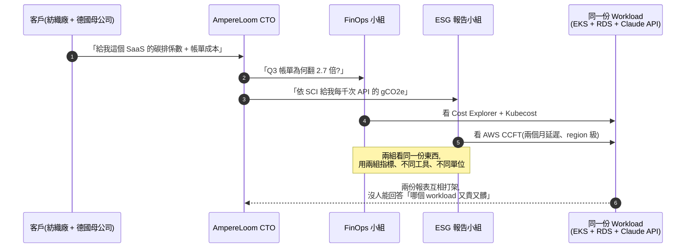
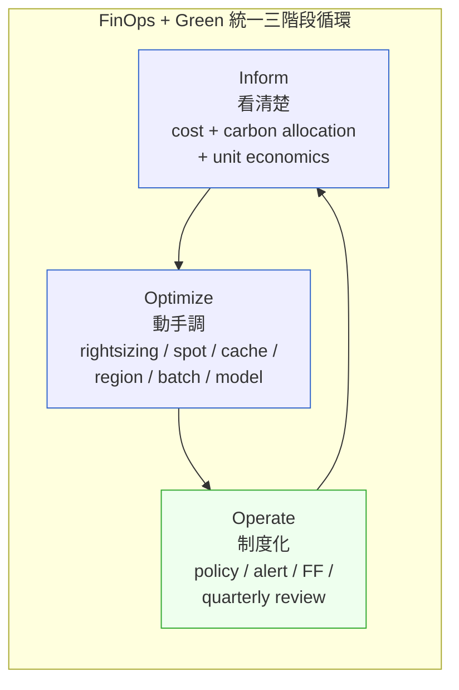
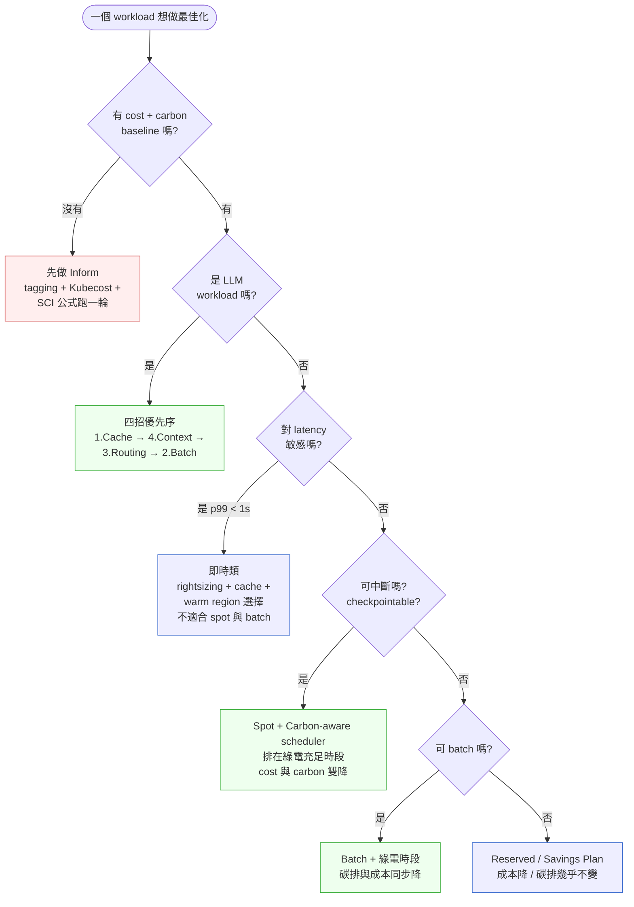

# 第 35 章|FinOps、永續工程與綠色軟體
## ⸺ 帳單與碳排是同一個 Workload Profile

> **前置閱讀**:[Ch 24 雲端原生與 Kubernetes](../part-04-architecture/ch-24-cloud-native-kubernetes.md)、[Ch 29 可觀測性與 OTel](../part-05-quality/ch-29-observability-otel.md)、[Ch 30 SRE / SLO / Chaos](../part-05-quality/ch-30-sre-slo-chaos.md)
> **下游章節**:[Ch 36 AI-Native Architecture](../part-07-ai-era/ch-36-ai-native-architecture.md)
> **延伸補章**:[Ch 26 邊緣 / OT-IT 融合](../part-04-architecture/ch-26-edge-ot-it.md)

---

## 32.1 冷觀察 ⸺ 一張 23 萬美元的雲帳單,後面跟著一封寫不出來的碳排報告

2026 年第一季,在現場看過一個案例(`CASE-ENR-006`)。

虛構儲能 / 太陽能整合平台 **AmpereLoom Energy**,42 名工程師,做的是「把分散的工商儲能櫃 + PV 案場接進同一個 EMS / 排程平台,代客戶向台電投標 dReg 0.25s 與 sReg 輔助服務」。技術棧:Spring Boot 3.3 + PostgreSQL 17 + Kafka 3.7 + EKS 1.31 跑在 AWS `us-east-1`,LLM 推理走 Anthropic Claude API + 部分自架 vLLM。

兩件事在同一週發生:

第一件,**Q3 雲帳單從 84,000 美元飆到 230,000 美元**。最大宗增幅來自三塊:Anthropic API token 費用從 6,000 美元變成 71,000 美元(因為新上的「案場異常告警自然語言摘要」每次都把過去 30 天運轉日誌整包丟進 prompt)、EKS 跨 AZ data transfer 從 4,000 變 18,000(微服務拆得太碎)、RDS Aurora 寫入 IOPS 翻三倍(時序資料沒下沉)。

第二件,**最大客戶(一家上市紡織廠)發信要求依 GHG Protocol Scope 3 Category 1 揭露這個平台在 2025 年提供給他們的「軟體即服務」對應碳排係數**,理由是他們自己要在 2026 年提交 ISSB IFRS S2 永續資訊揭露。同一天,德國某客戶(代工廠的歐洲母公司)要求平台符合 EU CSRD 揭露要求,並提供 SCI(Software Carbon Intensity)數字。

這兩封信落在 SRE 隊長桌上的時候,他在 Slack 留了一句話:

> 「FinOps 我們有看 Cost Explorer,但沒人在管 LLM token。碳排這邊我問了一下,AWS Customer Carbon Footprint Tool 有開,但只能看到 us-east-1 整體月排放,沒辦法切到 workload 級別,而且最新只有兩個月前的數字。客戶要的是『這個 API 每 1,000 次呼叫多少 gCO2e』,我寫不出來。」

CTO 在月度檢討會上問了一句話:

> 「我們的 FinOps 小組跟 ESG 那邊各自跑了一年,現在發現他們在管的是同一份 workload profile 的兩個面 ⸺ 那為什麼要拆兩組?」



這不是 FinOps 工具的鍋,也不是碳會計工具的鍋。問題出在**這個組織把同一份 workload profile,分給兩個從不對話的小組分別管**。LLM 那塊更慘 ⸺ 它同時是新興的「token 帳單黑洞」與「推論碳排黑洞」,但兩邊小組各自手上都沒有 LLM 的 SME,只能互相指對方。

---

## 32.2 真問題 ⸺ 帳單與碳排底層是同一個 Workload Profile

過去十年,FinOps 與 Green Software 各自從不同源頭發展:FinOps 起於 2019 年成立的 FinOps Foundation,談「雲支出的可視性與最佳化」[^CIT-320];Green Software 起於 2021 年由 Linux Foundation + Microsoft + Accenture + ThoughtWorks 共同成立的 Green Software Foundation,談「碳感知與碳效率」[^CIT-321]。兩條線在 2023 年前各跑各的會議、各推各的證照、各賣各的工具。

到了 2026 年,把兩條線拆開治理已經開始在帳單與報表上同時出事 ⸺ 不是因為哪一邊做錯了,而是**它們處理的物件其實是同一份東西**。把這件事拆開來看會比較清楚。

| 維度 | 帳單視角(FinOps) | 碳排視角(Green Software) |
|---|---|---|
| **計算資源消耗** | $/vCPU-hour、$/GB-month | gCO2e/vCPU-hour、gCO2e/GB-month |
| **跨區成本** | data transfer egress fee | 不同 region 不同 grid 碳係數 |
| **時段差異** | spot 折扣 / RI 折扣 | 風光多寡決定電力碳係數(carbon intensity) |
| **儲存層** | S3 Standard vs Glacier 價差 | 冷儲存 vs 熱儲存的內含碳排差異 |
| **LLM token** | $/1K input + $/1K output | gCO2e/1K token(訓練攤提 + 推論電力) |
| **被影響的決定** | 換 instance / 換 region / 用 spot / cache | 換 region(綠電時段)/ 用 spot / cache / batch |

最後一列最關鍵 ⸺ **被影響的決定欄位幾乎是同一組**。換句話說,FinOps 小組在做的 99% 的最佳化動作(rightsizing、spot、reserved capacity、caching、batching、移除孤兒資源),同時也是 Green Software 小組在做的事。差別只在前者用 dollar 量、後者用 gCO2e 量,而**單位之間有一條可計算的關係:`cost = (resource × $rate)`、`carbon = (resource × carbon_intensity)`,共用同一個 resource 變數**。

把這個事情整理成一句話:**FinOps 與 Green Software 不是兩件事,是同一份 Workload Profile 的兩個輸出欄位**。把它們分到兩個小組、用兩套儀表板治理,等於要兩個團隊各自重建同一份 workload 拓樸 ⸺ 重複造輪子,而且兩邊得出的最佳化建議還可能互相打架(FinOps 推「全面 spot」、Green Software 推「等綠電多的時段才跑」,兩個建議落在同一個 batch job 上,沒人對齊就誰先說話誰贏)。

### 32.2.1 為什麼 2026 年才變成必需

這個觀察在 2024 年就有人提,但要到 2026 年才變成不能不做的事,有三個推力:

1. **LLM 推論成本爆炸**:Anthropic、OpenAI、Google 的 API 帳單在 2025 年中後段成為許多 SaaS 公司的 Top 1–3 雲支出項。LLM 同時是「token 黑洞」與「推論電力黑洞」,兩個黑洞共用同一個 prompt size 變數 [^CIT-326]。
2. **法規逼近**:EU CSRD(2024 生效,2025 年起分階段擴大適用)、ISSB IFRS S2(2024 生效)、CSRDDD(2024 生效)、台灣金管會永續揭露要求(2026 起部分上市公司強制),客戶要 Scope 3 數字的請求從「年度」變「季度」[^CIT-327]。
3. **SCI 標準成 ISO**:Software Carbon Intensity Specification 在 2024 年成為 ISO/IEC 21031:2024 [^CIT-322],從「業界推動的方法論」變成「可被合約引用的標準」。

換句話說,「FinOps 與 Green 一起治理」從可選項變成法務、財務、客戶都可能來敲門的必答題。

### 32.2.2 Workload-Aware Engineering 是新的預設值

把 FinOps 與 Green Software 統一成「同一份 workload profile 的兩個輸出」之後,工程實踐的預設值會跟著換 ⸺ 這個新預設值在文獻裡逐漸被稱為 **Workload-Aware Engineering**:每一份 workload(API、batch、stream、LLM call)都有一張對外的卡片,寫清楚它的成本基線、碳排基線、Top 3 最佳化動作、SLO 互動,然後 FinOps、ESG、SRE 三個視角共用這張卡。

這個視角的好處是:三邊吵架時有同一份事實基礎。SRE 說「我要把 P99 從 1.2 秒壓到 800ms,需要加兩個 replica」,FinOps 與 ESG 在同一張卡上都能看到「會多花 $1,400/月、多 18 kgCO2e/月」 ⸺ 然後三邊用同一份數字討論,而不是各自拉自己的 dashboard 互相說服。

---

## 32.3 決策框架 ⸺ FinOps + Green 在同一張地圖上怎麼走

### 32.3.1 FinOps Foundation 三階段循環

FinOps Foundation 把成本治理拆成三個循環階段(Inform → Optimize → Operate),三階段不是一次走完,而是每季滾動 [^CIT-320]。



這三階段對映到 Green Software Foundation 三原則(Carbon Awareness / Carbon Efficiency / Carbon Hardware Efficiency)[^CIT-321],對齊起來如下:

| 階段 | FinOps 重點 | Green Software 對齊 | 共用工具 |
|---|---|---|---|
| **Inform** | 帳單分攤(tagging、showback、unit economics) | 量測 SCI、區分 Scope 2 與 Scope 3 | Cost Usage Report(CUR)+ AWS CCFT + Kubecost |
| **Optimize** | rightsizing、spot、commitment、cache | Carbon Awareness(時段)、Carbon Efficiency(每單位工作的碳)、Hardware Efficiency(設備使用率) | Vantage、Kubecost、Holori、Electricity Maps API |
| **Operate** | 預算告警、ADR、Fitness Function | 目標寫進 Charter、報告自動產出 | OTel 指標、CI fitness function、Backstage scorecard |

**三階段的卡關點**通常都不在 Optimize ⸺ 大部分團隊知道怎麼開 spot、怎麼換 region、怎麼開 cache。卡關點在 **Inform**(看不清楚,因為 tagging 沒做)與 **Operate**(調完一輪沒制度化,六個月後成本與碳排又默默漲回去)。

### 32.3.2 Inform 階段的最小工具集

Inform 階段的目標是「能在五分鐘內回答:這個 workload 上個月花了多少錢、排了多少碳、被哪些客戶/功能/環境用掉」。

| 工具 | 角色 | 拿來回答什麼 | 限制 |
|---|---|---|---|
| **AWS Cost Usage Report (CUR)** | 原始帳單事實 | 每筆資源的 hourly $$$ | 體積大,需要 Athena / Snowflake 查 |
| **AWS Cost Explorer** | 視覺化彙總 | 月趨勢、按 tag 切片 | tag 沒打就看不到 |
| **Kubecost** | K8s 內 namespace / pod / label 級分攤 | 「這個 service 上個月花多少」 | 只看 K8s,雲端 managed 服務看不到 [^CIT-323] |
| **Vantage** | 跨多雲 + SaaS 帳單聚合 | 「我們三朵雲 + Datadog + Snowflake 加起來多少」 | 需要授權連線 [^CIT-328] |
| **Holori** | 視覺化雲拓樸 + 預測 | 架構級別費用模擬 | 較適合 PoC / 架構提案階段 |
| **AWS Customer Carbon Footprint Tool (CCFT)** | AWS 帳號級碳排 | 月度 Scope 2 + Scope 3(market-based) | 兩三個月延遲、region 粒度、缺 workload 級切片 [^CIT-324] |
| **Google Cloud Carbon Footprint** | GCP 帳號級碳排 | 月度排放、可下載 CSV | 同上,也是延遲 + 粒度粗 |
| **Azure Sustainability Calculator (now Emissions Impact Dashboard)** | Azure 帳號級 | 同上 | 同上 |

**Inform 階段的真正勝負手不是工具,是 tagging 紀律**。沒有強制 tag 的組織,買十款工具都看不清楚 ⸺ 因為工具切片靠 tag,tag 不齊就只能切到「整個帳號」這個粒度,等於沒切。

把它寫成 fitness function:任何沒帶 `team`、`service`、`env`、`cost-center` 四個 tag 的資源,在 Terraform plan 階段擋下。這條 CI 是 Inform 階段最值得投資的一條規則,優先序高過「再買一款 dashboard 工具」。

### 32.3.3 SCI Specification 的量測公式(可抄)

Software Carbon Intensity 的核心公式 [^CIT-322]:

```
SCI = (E × I + M) per R

E = Energy consumed (kWh)
I = Location-based marginal carbon intensity (gCO2e/kWh, from Electricity Maps / WattTime)
M = Embodied emissions amortized over the workload's share of hardware lifetime (gCO2e)
R = Functional unit (e.g., 1,000 API calls / 1 user-session / 1 inference)
```

關鍵在四個變數的取值:

- **E(電力)** — Kubecost 可給出 pod 級的 kWh 估算(以 Cloud Carbon Footprint 開源係數推算 [^CIT-323]);自架機房得從 PDU 量。
- **I(碳係數)** — 不要用年平均。要用 **marginal carbon intensity**(邊際碳排係數),拿 Electricity Maps 或 WattTime 的即時 API,反映「現在多跑一度電,grid 要燒什麼來補」[^CIT-329]。
- **M(內含碳)** — 雲端 managed 服務由雲廠揭露(AWS / GCP / Azure 都有對應數字),自有伺服器照伺服器壽命攤提(常見 4–6 年)。
- **R(功能單元)** — 這個最關鍵也最容易被跳過。**SCI 沒有 R 就不能比較**。對 SaaS 來說,常見 R 是「每 1,000 次 API call」、「每月 active user」、「每 1M token processed」。

下面是一段最小可運行的 Python SCI 估算腳本(讀 Kubecost API + Electricity Maps),示範 Inform 階段怎麼自己算第一個 SCI 數字 ⸺ 不必等供應商給:

```python
# Python 3.12 — sci_estimate.py
# deps: requests, python-dateutil
import os, requests
from datetime import datetime, timedelta

KUBECOST = os.environ["KUBECOST_URL"]   # e.g., http://kubecost.kubecost.svc:9090
ELEC_MAPS_KEY = os.environ["ELEC_MAPS_KEY"]
REGION_ZONE = os.environ.get("ZONE", "US-MIDA-PJM")  # us-east-1 ≈ PJM
FUNCTIONAL_UNIT = "1000_api_calls"
NAMESPACE = "ampereloom-prod"

def kubecost_kwh(ns: str, hours: int = 24) -> float:
    r = requests.get(f"{KUBECOST}/model/allocation",
        params={"window": f"{hours}h", "aggregate": "namespace",
                "filterNamespaces": ns, "accumulate": "true"}).json()
    # Kubecost returns `kwh` if Cloud Carbon Footprint integration is on
    return r["data"][0][ns].get("kwh", 0.0)

def grid_intensity(zone: str) -> float:
    r = requests.get(
        f"https://api.electricitymap.org/v3/carbon-intensity/latest?zone={zone}",
        headers={"auth-token": ELEC_MAPS_KEY}).json()
    return r["carbonIntensity"]  # gCO2e/kWh, marginal where available

def amortized_embodied_g(ns: str) -> float:
    # Cloud-managed: pull provider-published numbers (here: rough placeholder)
    # AWS m6i.large embodied ~ 580 kgCO2e over ~6 yr lifetime
    # workload share = pod-hours / (instance-hours × 6yr-hours)
    return 12.0  # gCO2e for the 24h window, placeholder

def api_calls_24h(ns: str) -> int:
    # pull from Prometheus / OTel; placeholder
    return 4_200_000

E = kubecost_kwh(NAMESPACE, 24)
I = grid_intensity(REGION_ZONE)
M = amortized_embodied_g(NAMESPACE)
R = api_calls_24h(NAMESPACE) / 1000  # functional units = 1000-calls

SCI = (E * I + M) / R if R else 0
print(f"SCI = {SCI:.4f} gCO2e per {FUNCTIONAL_UNIT}")
```

第一次跑出來的 SCI 數字幾乎一定是錯的(tagging 不齊 / R 取得有偏差)。沒關係 ⸺ **重要的不是一次算對,是有一條可重跑、可放進 CI 的管道**。SCI 跟 SLO 一樣,先有粗略基線,再往下打磨。

### 32.3.4 LLM 成本與碳排控制四招

LLM 是 2026 年新興的 workload 類型,單一 LLM workload 的 cost / carbon 變化幅度可以達兩個數量級(同一份功能,做了 prompt caching 跟沒做差 5–10 倍 token、上 Batch API 又再差 50%)。把這四招分開列,因為每一招都有自己的設計取捨:

| 招 | 機制 | 典型成本減幅 | 碳排同步減幅 | 取捨 |
|---|---|---|---|---|
| **1. Prompt Caching** | 把固定的 system prompt + 文件 / 工具定義標記為 cache,5 分鐘 TTL,後續呼叫只付 cache read price(Anthropic 為 input 1/10) | input token 60–90% | 同步,因為計算量等比例 | cache 寫入要多花 1.25× 一次;設計上要把「固定大段」前置、「變動部分」後置 [^CIT-325] |
| **2. Batch API** | 把非即時的 LLM 任務丟進 batch queue,24h 內完成,Anthropic / OpenAI / Google 都有提供 50% 折扣 | 50% | 同步;且可被 carbon-aware scheduler 進一步排在綠電時段 | 不能用在即時對話;需要 idempotency + 結果回收機制 |
| **3. Model Routing** | 簡單請求路由到小模型(Haiku / mini),複雜請求才上 Opus / Sonnet 4.5+ | 視流量分布 60–95% | 視模型規模差距,通常更顯著(小模型推論電力差一個量級) | 需要分類器(可用 Haiku 自己做);要監控分類錯誤率對 SLO 的影響 |
| **4. Context Size 控制** | 不要把整個 30 天 log 餵給每次呼叫;用 retrieval / summary 壓縮 | input token 線性下降 | 同步 | 要建檢索 / 摘要 pipeline;品質要做 eval(見 Ch 44) |

**四招的優先序**通常是 1 → 4 → 3 → 2:Caching 與 Context size 控制是「總是該做」的,Model Routing 需要分類能力,Batch API 只適用於非即時。AmpereLoom 那筆 71,000 美元的 token 帳單,單做 Caching 一招就降到 18,000;再加 Context size 控制(改成 retrieval over 過去 30 天告警),降到 7,200。

下面是 Anthropic Prompt Caching 的最小範例(Claude Sonnet 4.5,2026):

```python
# Python — anthropic prompt caching
# deps: anthropic>=0.39
from anthropic import Anthropic

client = Anthropic()

LARGE_TOOL_DEFS = open("tools.json").read()      # 鎖定不變,適合 cache
ALARM_PLAYBOOK = open("playbook-30days.md").read()  # 30 天 playbook

resp = client.messages.create(
    model="claude-sonnet-4-5",
    max_tokens=1024,
    system=[
        {"type": "text", "text": "You are the EMS alarm summarizer."},
        # ↓ 這兩段標 cache_control,5 分鐘內重複呼叫只付 1/10 input price
        {"type": "text", "text": LARGE_TOOL_DEFS,
         "cache_control": {"type": "ephemeral"}},
        {"type": "text", "text": ALARM_PLAYBOOK,
         "cache_control": {"type": "ephemeral"}},
    ],
    messages=[
        {"role": "user", "content": "Site SUNHILL-07 inverter 2 trip 3x in 10min, summarize."}
    ],
)
print(resp.usage)
# usage 會回 cache_creation_input_tokens / cache_read_input_tokens
# ↑ 觀測到 cache_read 比例就是真省到的部分
```

**要在 PR review 看的不是程式碼長度,是 `cache_read_input_tokens / total_input_tokens` 的比值**。這個比值低於 70% 通常表示 system prompt 結構順序錯了(變動段放前面,把後面的 cache 都打掉)。

### 32.3.5 「這個 workload 該怎麼最佳化」決策樹



這張圖的關鍵不是分支,是 **Q0**。多數團隊跳過 Q0 直接做最佳化,動了一兩個月發現「我以為省了三萬,實際看反而貴」⸺ 因為基線從沒測過,改動的影響也測不出來。

### 32.3.6 Operate 階段:把它寫進 CI、寫進 ADR

Optimize 是一次性動作,Operate 才是讓最佳化「不會默默漲回去」的關鍵。Operate 階段該有的最小制度:

| 制度 | 形式 | 觸發 |
|---|---|---|
| **Cost & Carbon ADR** | 每個 > $5K/月或 > 50 kgCO2e/月的設計決策,寫一份 ADR(對照 Ch 33) | 設計階段 |
| **Tag fitness function** | Terraform / Pulumi plan 階段擋下沒打齊四 tag 的資源 | PR 階段 |
| **預算告警** | Cost Anomaly Detection + 自定 SCI threshold(每 1K API > X gCO2e 觸警) | runtime |
| **季度 Workload Review** | 每季拉出 Top 10 cost workload + Top 10 carbon workload(常常有 7–8 個重疊),討論 Optimize 動作 | 季度 |
| **LLM Cache Hit Ratio SLI** | 把 `cache_read / total_input` 當作 SLI,目標 > 70% | runtime |

把這些放到 Backstage 之類的 IDP 上做 Workload Scorecard,每個 service 一張卡,FinOps + ESG + SRE 共用。

---

## 32.4 踩坑清單

下面四個反模式,在 2024–2026 年現場反覆出現。共同點是**外觀像在做 FinOps 或 Green,但實質上沒有把 cost 與 carbon 當成同一份 workload profile 在治理**。

### 反模式 1:FinOps 與 Green 分開治理(目標互打)

FinOps 小組推「把所有 batch job 全面改 spot,省 70%」;ESG 小組推「把 batch job 排在風光充足的午間時段(carbon-aware scheduling)」。兩個建議落到同一個 batch job,沒人對齊就誰先動誰贏 ⸺ 結果通常是:FinOps 先動完,午間 spot 容量緊張被搶走,夜間執行(碳係數最高的火力為主時段),`成本省 35%、碳排卻多 20%`。

> ✅ **修正方向**:把兩個小組合成一個 **Workload Engineering Guild**,共用一張 Workload Cost & Carbon Card,共用一個季度 review。決策原則:**任何最佳化動作必須在 cost 與 carbon 兩欄都是負數或零,才算過關**;只省一邊代價在另一邊的動作要寫一份 ADR 解釋為何接受。

### 反模式 2:LLM workload 沒做 Prompt Caching(token 帳單翻倍)

把整個 system prompt + 大段工具定義 + RAG 檢索結果,每次呼叫都重送一次,沒標 `cache_control`。Anthropic / OpenAI 在 2024–2025 都已經提供 prompt caching 功能,沒用等於把該打的折讓給雲廠。AmpereLoom 那 71,000 美元的 token 帳單裡,有 84% 是「重複送的固定段」。

> ✅ **修正方向**:任何 production LLM 呼叫,system prompt 第一次成形時就把可緩存區段標 `cache_control`,並把 `cache_read_input_tokens / total_input_tokens` 設為 SLI 進 dashboard。低於 70% 觸發 review。對於非即時任務,進一步走 Batch API(再省 50%)。

### 反模式 3:Spot instance 沒做中斷處理(碳排省了但 SLO 掉)

看了「spot 平均比 on-demand 便宜 70%」就把 production API server 全改 spot,沒做 graceful drain、沒做 multi-AZ + 多 instance type 分散、沒做 backup capacity。一週後第一次大規模 spot 中斷,P99 latency 從 800ms 變 12 秒,SLO 燒完一整個季度的 Error Budget(對照 Ch 30)。

> ✅ **修正方向**:Spot 限定在「可中斷 + checkpointable」的 workload(batch、CI、非即時 inference);即時 API 用 Savings Plan / Reserved 為主、spot 為副(< 30%);上 spot 之前先寫 chaos drill 驗證中斷處理(對照 Ch 30 §27.3 Chaos)。**省下的成本不該以 SLO 為代價**。

### 反模式 4:碳排報告找代理商做(自己沒能力量測)

客戶要 SCI 數字,團隊不會算,找碳會計顧問公司,顧問拿 AWS CCFT 月報 + 一份「業界平均係數」,做出一份看起來很專業的 PDF。問題是:這份報告沒有 R(功能單元),所以**不能跨期、不能比較、不能用來最佳化**。客戶下季再要時,還是得再付一次顧問費,而且最佳化動作對碳排的影響在報告上看不出來。

> ✅ **修正方向**:SCI 量測能力要自己有 ⸺ 至少 §32.3.3 那段腳本級別的能力,跑進 CI、每日輸出。顧問可以幫忙審計、幫忙對齊 GHG Protocol / ISSB,但**核心量測管道要在自己手上**,因為這條管道接下來會跟 cost optimization 共用同一個 workload profile,外包出去等於把最佳化能力一起外包。

---

## 32.5 交付清單 ⸺ 一頁式 Workload Cost & Carbon Card

每個 production workload(API、batch、stream、LLM call)該產出的不是 cost dashboard,**是一頁 Markdown 卡片**。寫不滿一頁就是還沒想清楚這個 workload 到底在做什麼。

放在 `docs/workload-cards/{workload-name}.md`,跟程式碼同 repo,跟 service 的 README 同層,Backstage scorecard 直接 render。

````markdown
# Workload Cost & Carbon Card — {workload 名稱}

> 版本:v0.1 | 撰寫日期:YYYY-MM-DD | Owner:{名字}
> 對應服務 / namespace:{name} | 環境:prod | Region:{aws region}

## 1. Workload Profile(這個 workload 在做什麼)
- 功能單元 R:每 ____(1K API calls / 1M tokens / 1 user-session ...)
- 流量量級:____ R/day,P95 latency 預期 < ____ ms
- 是否即時(latency-sensitive):是 / 否
- 是否可中斷(checkpointable):是 / 否
- 是否 LLM workload:是(model: ____)/ 否

## 2. 月成本基線(USD)
| 項目 | $/月 | 來源 |
|---|---|---|
| Compute(EC2 / Fargate / Cloud Run) | | Cost Explorer |
| Storage(EBS / S3 / RDS) | | CUR |
| Data transfer | | CUR |
| LLM API token | | Anthropic / OpenAI usage |
| 其他(Datadog / Snowflake / SaaS) | | Vantage |
| **合計** | | |

## 3. 月碳排基線(kgCO2e)
| 項目 | kgCO2e/月 | 來源 |
|---|---|---|
| Compute(market-based)| | AWS CCFT × Kubecost split |
| Storage | | 同上 |
| LLM 推論(估算) | | 模型卡 + token 量 |
| **合計** | | |
| **SCI(每 R)** | gCO2e/R | §32.3.3 公式 |

## 4. 與 SLO 的互動
- 對應 SLO:____(Ch 30 SLO Catalog 中的哪一條)
- 本 workload 對 Error Budget 的近 90 天貢獻:____ %
- 任何成本 / 碳排最佳化動作不得讓 SLI 退化超過 ____ %

## 5. Top 3 最佳化動作(本季)
| # | 動作 | 預期 $/月 變化 | 預期 kgCO2e/月 變化 | 對 SLO 影響 | Owner | Due |
|---|---|---|---|---|---|---|
| 1 | | | | | | |
| 2 | | | | | | |
| 3 | | | | | | |

## 6. LLM 專屬指標(若是 LLM workload)
- Model routing 比例:Haiku ___% / Sonnet ___% / Opus ___%
- Cache hit ratio(`cache_read / total_input`):___ %
- Batch API 使用率(非即時部分):___ %
- 平均 input token / R:____ | 平均 output token / R:____

## 7. 治理
- 共用責任 RACI:
  - FinOps Lead:____(Inform 階段資料正確性)
  - SRE Lead:____(SLO 守門)
  - ESG Lead:____(SCI 計算與外部報告對齊)
  - Service Owner:____(Optimize 動作執行)
- 季度 review 排程:Q__ / __ / __

## 8. Out of Scope(這張卡不涵蓋什麼)
- 不含開發 / staging 環境(另卡)
- 不含跨 workload 共用基礎設施(observability stack、CI runner 等,另卡)
- 不含 Scope 1 / Scope 3 上下游(由企業層 ESG 報告涵蓋)
````

**為什麼要把 cost 與 carbon 放在同一張卡?** 因為三個小組(FinOps / SRE / ESG)在同一張卡上對話,才會發現 §2 與 §3 的最佳化動作 80% 是同一個 ⸺ 寫成兩張卡會逼出兩套世界觀,寫成一張卡會逼出一套 workload profile。

**為什麼要有「對 SLO 的互動」?** 因為這是 FinOps 與 SRE 最常打架的接口。AmpereLoom 那次的反模式 3,如果一開始就在卡上寫死「最佳化不得讓 SLI 退化超過 5%」,spot 那條就會在設計階段先過一次 chaos 才上線,而不是上線後燒 Error Budget 才發現。

**為什麼要有 LLM 專屬指標?** 因為 LLM workload 的成本與碳排可變動範圍是普通 workload 的 5–10 倍,沒這四個指標等於沒在管。

---

## 32.6 本章交付清單 Recap

讀完本章,你應該已經能做到:

- [ ] 講清楚「FinOps 與 Green Software 不是兩件事」⸺ 帳單與碳排是同一份 Workload Profile 的兩個輸出欄位,被影響的決定欄位幾乎全重疊
- [ ] 用 §32.3.5 決策樹回答「這個 workload 該怎麼最佳化」⸺ 不會跳過 Q0(沒 baseline 就先做 Inform),LLM 走四招優先序 1→4→3→2
- [ ] 在會議上認得出四個反模式的修正方向 ⸺ 特別是「FinOps 與 Green 各做各的(目標互打)」與「LLM 沒做 Prompt Caching」這兩個 2026 年最常見的隱形成本黑洞
- [ ] 為手上一個 production workload 寫好一張 Workload Cost & Carbon Card,跑出第一個粗略的 SCI 數字(用 §32.3.3 的腳本基底,接 Kubecost + Electricity Maps)

四項中先挑一項做完就好,建議從最後那一項 ⸺ 把目前帳單最大的那個 workload 拉出來填一張卡,**§3 月碳排基線那欄寫不出 R(功能單元)的 workload,就是下一個 sprint 該優先做 SCI 量測管道的對象**。本章的卡片格式會在 Ch 36 AI-Native Architecture 被延伸成 LLM-specific 的 model card + cost/carbon card 雙卡格式;Ch 26 邊緣 / OT-IT 場景下的「設備能耗」會把 Scope 2 與 Scope 3 的邊界拉得更清楚 ⸺ 自身就是能源產業的平台,自己每度雲端用電的碳排,也會反過來影響客戶的 Scope 3 揭露。FinOps + Green 統一治理在 2026 年是新預設值,2027 年大概會是「不做就拿不到 enterprise contract」的硬條件。

---

## Cross-References

- **回顧**:[Ch 24 雲端原生與 Kubernetes](../part-04-architecture/ch-24-cloud-native-kubernetes.md) ⸺ Kubecost 之所以能切到 namespace 級別,是 K8s 拓樸給的便利;[Ch 29 可觀測性與 OTel](../part-05-quality/ch-29-observability-otel.md) ⸺ cost / carbon 指標也是 OTel 平面上的訊號;[Ch 30 SRE / SLO / Chaos](../part-05-quality/ch-30-sre-slo-chaos.md) ⸺ Error Budget 與成本預算的雙軌管理在本章 §32.3.6 落地
- **下一章**:[Ch 36 AI-Native Architecture](../part-07-ai-era/ch-36-ai-native-architecture.md) ⸺ LLM-specific 的 cost / carbon 卡片格式延伸
- **延伸補章**:[Ch 26 邊緣 / OT-IT 融合](../part-04-architecture/ch-26-edge-ot-it.md) ⸺ 邊緣場景下 Scope 2 / Scope 3 邊界與設備能耗的對齊
- **決策制度化**:[Ch 33 架構決策紀錄(ADR)](./ch-33-adr-architecture-knowledge.md) ⸺ Cost & Carbon ADR 的觸發條件與模板

## 引用

[^CIT-320]: FinOps Foundation, *FinOps Framework* (v3, 2024) — finops.org/framework/。三階段循環(Inform / Optimize / Operate)、Six Principles、Personas 為本章 §32.3.1 主要參照。
[^CIT-321]: Green Software Foundation, *Principles of Green Software Engineering*(2021,2024 重修)— greensoftware.foundation/articles/sci-specification-principles-overview。Carbon Awareness / Carbon Efficiency / Carbon Hardware Efficiency 三原則。
[^CIT-322]: ISO/IEC 21031:2024, *Software Carbon Intensity (SCI) Specification* — iso.org/standard/86612.html。原 GSF v1.0 規範於 2024 年正式成為 ISO 標準。SCI 公式 `(E×I + M)/R` 出處。
[^CIT-323]: Kubecost Documentation — kubecost.com/docs。namespace / pod / label 級成本分攤,2024 年起整合 Cloud Carbon Footprint 開源係數提供 kWh 估算。
[^CIT-324]: AWS Customer Carbon Footprint Tool — aws.amazon.com/aws-cost-management/aws-customer-carbon-footprint-tool/。月度 Scope 2 + Scope 3(market-based),2–3 個月延遲、region 級粒度。Google Cloud Carbon Footprint(cloud.google.com/carbon-footprint)、Microsoft Emissions Impact Dashboard(microsoft.com/sustainability/emissions-impact-dashboard)為平行對照工具。
[^CIT-325]: Anthropic, *Prompt Caching with Claude* — docs.anthropic.com/claude/docs/prompt-caching。`cache_control: {"type": "ephemeral"}`、5 分鐘 TTL、cache write 1.25× / cache read 0.1× 計價;Sonnet 4.5 / Opus 4.7 (1M context) 適用。
[^CIT-326]: Anthropic, *Message Batches API* — docs.anthropic.com/claude/docs/message-batches-api;OpenAI Batch API — platform.openai.com/docs/guides/batch。非即時任務 50% 折扣,24h 完成 SLA。
[^CIT-327]: ISSB IFRS S2 *Climate-related Disclosures*(2024 effective)、EU CSRD(Directive 2022/2464,2024 起分階段)、台灣金管會「上市櫃公司永續發展行動方案(2023)」與 GRI / SASB 對照。
[^CIT-328]: Vantage(vantage.sh)、Holori(holori.com)— 跨多雲與 SaaS 帳單聚合 / 拓樸視覺化工具,2024–2026 為 FinOps Foundation 列名工具。
[^CIT-329]: Electricity Maps — electricitymaps.com / api.electricitymap.org;WattTime — watttime.org。提供 marginal carbon intensity(邊際碳排係數)即時 API,Green Software Foundation Carbon Aware SDK 預設整合對象。

---
