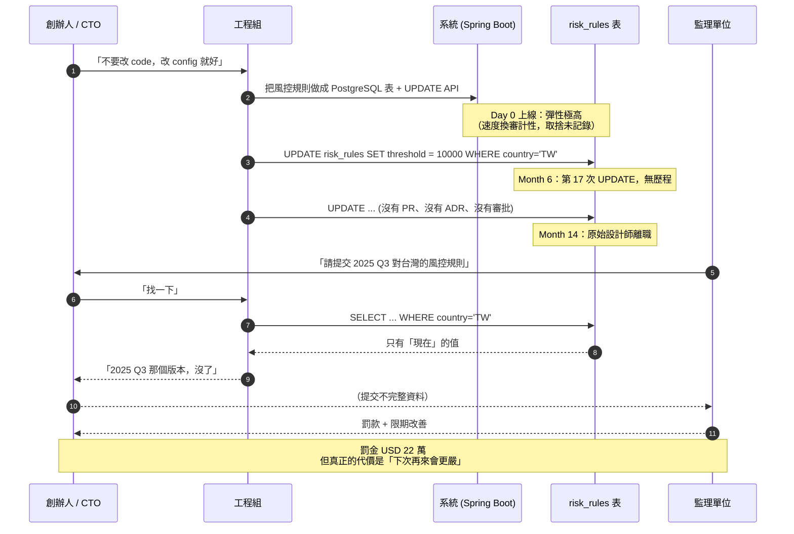
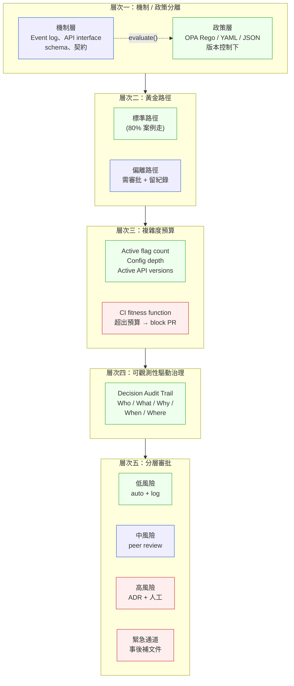
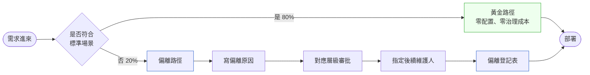
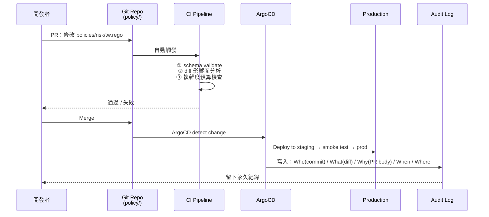

# 第 36 章｜治理架構
## ⸺ 在高彈性系統中控制管理複雜度

> **前置閱讀**：[Ch 33 ADR 與架構知識管理](./ch-33-adr-architecture-knowledge.md)、[Ch 34 架構適應度函式](./ch-34-fitness-functions.md)
> **下游章節**：[Ch 37 AI-Native 架構](../part-07-ai-era/ch-37-ai-native-architecture.md)（AI 系統的彈性更高，治理問題等比放大）
> **延伸補章**：無

---

## 36.1 冷觀察 ⸺ 72 小時，找不到三個月前的那條規則

我在 2026 年 Q1 進過一家虛構跨境支付平台，內部代號 **NovaPay**（`CASE-FIN-009`）。NovaPay 主打 12 個 APAC 國家的小額跨境匯款，年度交易額 USD 18 億、工程 47 人、主系統 Spring Boot 3.3 + PostgreSQL 17 + Redis 7.4 + Kafka 3.7、合規團隊 6 人。創辦人對「彈性」這個詞很自豪，他們的內部口號是：

> 「不要改 code，改 config 就好。」

那天我被請去，是因為金管單位來了一封信，內容只有一段：

> 「請於 72 小時內提交 2025 年第三季針對台灣小額匯款用戶的風控判斷規則全文，以及該版本規則的生效時間、核准人、與例外處理紀錄。」

工程組花了八個小時，找出了**現在**生效的風控規則。但 2025 Q3 那個版本，沒有人找得到。原因不是檔案被刪掉，而是他們把所有規則塞進一張 PostgreSQL 資料表 `risk_rules`，欄位是 `country, threshold_amount, kyc_level, action`，每次調整就 `UPDATE`。沒有版本表、沒有變更歷程、沒有 audit log。資料表是「永遠的當下」。

法務問了一句：「上次調 threshold 是誰決定的？」沒人答得出來。Slack 找到了幾條對話片段，但對話發起人已經離職。三個月前的真相，已經被這個季度的 UPDATE 蓋掉了。

NovaPay 最後以「資料不完整」被要求限期改善並罰款 USD 22 萬。對一家 ARR 不到一億的公司來說，這個罰金不是錢的問題，是**監理單位下次來會放大鏡看**的問題。

把那 18 個月壓成一條時間軸之前，先定位那個**決定性選擇的瞬間**。

Day 0，當時的首席工程師面前有兩條路：一是把風控規則寫進 git 管理的 YAML 或 Rego 檔，每次調整都走 PR；二是建一張 PostgreSQL 資料表，用 `UPDATE` API 即時覆寫。他選了第二條，理由簡單且合理 ⸺ 「MVP 階段，規則改動頻繁，不想每次走 PR review 等一個小時。」這不是壞工程師的壞決策，是一個有意識的速度換審計性的取捨。**問題不在決定本身，在於這個取捨從來沒有被寫下來，也從來沒有人說「彈性換來了，治理欠帳要還，什麼時候還、誰來還？」**

Month 6，第 17 次 `UPDATE` 進資料表，沒有人注意到「我們已經沒有任何辦法重現三個月前的規則狀態」。這不是惡意隱瞞，是系統設計讓這個問題**不可見**。Month 14，寫下第一行 `risk_rules` 建表語法的工程師離職，最後一條口耳相傳的設計意圖斷線。這是真正的不可逆點：從這一刻起，就算想補 audit，也找不到起點。

把那 18 個月壓成一條時間軸，大致長這樣：



事故 postmortem 那場會議，CFO 在白板上寫了一句話，我把它原樣記下來：

> 「我們的系統不是高度彈性，是高度**不可治理**。」

這句話聽起來像繞口令，但它的價值在後面那條：彈性本身不會壞事，**沒有治理機制的彈性才會**。NovaPay 的 70 幾個 feature flag、那張 `risk_rules` 表、那一堆「臨時性」的環境變數，每一個個別看都是合理工程選擇。錯的是這些彈性點被引入時，沒有一條配套的「這個彈性點怎麼被治理」的合約。

主大綱第 21–22 章談了分散式系統的狀態一致性，第 33 章談了 ADR、第 34 章談了 Fitness Function。但這三章都假設「**規則一旦寫下來，會被遵守**」。NovaPay 那 18 個月就是反證：寫下來不夠、CI 守不住、自然就會腐爛到「沒人敢動」的程度。這一章要補的就是這個缺口 ⸺ 當系統的彈性點多到無法靠 ADR + Fitness Function 完全覆蓋時，需要一套「治理架構」當作上層守護。

---

## 36.2 真問題 ⸺ 彈性是乘法器，它把治理缺失放大

「我們系統很彈性，這不是好事嗎？」「彈性多了複雜度，這是必要之惡吧？」這兩個問題把它拆開來看會比較清楚。

### 36.2.1 彈性點的狀態爆炸

一個系統有 N 個獨立的布林 feature flag，理論上有 2^N 種配置狀態：

| N（彈性點數） | 理論狀態空間 | 實務上的可測試組合（< 1% 覆蓋） |
|---|---|---|
| 5 | 32 | 32（可全測） |
| 10 | 1,024 | ~50（5%） |
| 30 | 約 10⁹ | ~200（10⁻⁷） |
| 70（NovaPay） | 約 10²¹ | 永遠不可窮舉 |

但實務上「彈性」不只是布林 flag。它至少有四種來源：

- **多值配置**：一個 config key 有 K 個選項，狀態空間乘 K
- **依賴關係**：flag A 只在 flag B 開時有意義；flag C 與 D 不能同時開
- **環境差異**：dev / staging / prod 的 config 各自演化
- **時序依賴**：某個值在某個時段是對的，過了就錯

每一個彈性點都不只是「一個選項」，是「**一個治理債的計息位置**」。沒有配套機制，這些債會以指數速度複利。

### 36.2.2 治理缺失的三種腐爛方向

把現場看過的所有「彈性失控」事件分類，會看到三條穩定的腐爛軌跡 ⸺ 它們不是互斥，而是會同時發生：

| 腐爛方向 | 典型症狀 | 最終結局 |
|---|---|---|
| **Configuration Drift（配置漂移）** | 「在 staging 是這樣，prod 不知道為什麼不一樣」 | 三個環境各自演化，「在我的環境可以跑」的分散式版本 |
| **Knowledge Decay（知識流失）** | 「這個 flag 是 Joe 開的，但 Joe 一年前離職了」 | 沒有人敢改，系統成為禁忌神器 |
| **Invisible Coupling（隱性耦合）** | 「我以為這兩個 config 沒關係…」 | 改 A 觸發 B 的奇怪行為，每次改動都是拆未爆彈 |

NovaPay 的稽核失敗其實是這三種同時發生的綜合症狀：規則表的 UPDATE 是 drift（沒有版本）、原始設計師離職是 decay（沒有設計意圖紀錄）、threshold 與 kyc_level 之間的隱含依賴沒有寫進文件是 coupling。

### 36.2.3 治理 ≠ 管理學詞彙，是工程問題

「治理（Governance）」這個詞在中文世界容易被誤讀成「管理委員會」「審批表單」這類管理學概念。把它放回工程語境，治理是一組**具體機制的組合**，而不是一種「我們想要的系統特性」：

> **治理 = Policy-as-Code（§ 36.3.2）+ 機制/政策分離（§ 36.3.2）+ 決策稽核軌跡（§ 36.3.5）+ 分層審批閘道（§ 36.3.6）**

這個定義刻意機制先行，有一個實務理由：**有 audit log 不等於有治理**。NovaPay 在整改前其實有 Kafka event log，也有資料庫的 `updated_at` 欄位。但他們沒有 Policy-as-Code、沒有機制/政策分離、沒有結構化稽核軌跡。工程師看著 log，仍然答不出「2025 Q3 的閾值是多少、誰核准的、依據哪條公告」。把機制擺在定義的核心，才能避免團隊誤以為「我們記了 log 就算治理到位」。

這四個機制成功落地時，才會帶出三個值得追求的**結果特性**：

- **可預測（Predictable）**：在 PR review 階段，能告訴開發者「你這個改動會影響哪些行為路徑」⸺ 因為政策層是獨立、可靜態分析的。
- **可追蹤（Traceable）**：六個月後，能回答「這個值在 2025-09-15 是多少、誰改的、依據哪份 ticket / ADR」⸺ 因為 audit trail 記錄了 Who / What / Why / When / Where。
- **可復原（Recoverable）**：發生問題時，能在 5 分鐘內回到上一個已知好的狀態⸺ 因為 Policy-as-Code 有版本歷程，`git checkout` 就是 rollback。

順序很重要：**先有機制，才有特性；有特性，才叫治理**。NovaPay 的稽核問題不是「他們不重視可追蹤性」，而是「他們沒有任何機制能讓可追蹤性成立」。

這一章接下來要做的，是把這四個機制的工程答案攤開來，組成一套五層的治理架構。

---

## 36.3 決策框架 ⸺ 治理系統的五個層次

### 36.3.1 五層全景圖

把這套體系畫成一張圖，先看全貌：



這張圖最關鍵的不是五層的名字，是它們的**順序**：層次一沒做就直接做層次五，會變成「審批一份混在程式碼裡的 if-else 改動」⸺ 沒意義。**從下往上一層層建立**，跳層幾乎一定會在 6–12 個月內崩。

接下來逐層拆。

### 36.3.2 層次一：機制與政策分離（Mechanism-Policy Separation）

這個概念可以追溯到 David Parnas 1972 年那篇模組分解論文 [^CIT-345]，後來在 Linux kernel 與 microkernel 設計裡被反覆強調。**機制不變、政策可變** ⸺ 把這個原則套到應用層，就是治理的地基。

把系統切成兩層：

| 層次 | 特性 | 設計目標 | 例子 |
|---|---|---|---|
| **機制層** | 固定、通用、穩定 | 永遠不需要為了業務需求而改 | Event log 格式、Contract schema、API interface、policy.evaluate() 函式 |
| **政策層** | 可配置、可版本化、可稽核 | 是唯一被允許改變的層 | KYC 等級對應規則、手續費分級、地區性合規開關 |

核心規則：**複雜度只允許在政策層增長。機制層一旦設計完成，不因業務需求而改動**。

實作形式上，政策層的常見選擇有三種，依複雜度遞增：

| 形式 | 適用情境 | 工具範例 |
|---|---|---|
| **YAML / JSON 規則檔** | 規則簡單、彼此獨立 | git 直管、CI 跑 schema validate |
| **DSL（自家定義）** | 規則有結構、需要 lint | 自寫 parser + golden file test |
| **OPA Rego / AWS Cedar** | 規則複雜、需要型別推論 | Open Policy Agent 0.69 [^CIT-346]、AWS Cedar 4.x [^CIT-347] |

NovaPay 的整改方向：把那張 `risk_rules` 表整個拔掉，換成 git 管的 OPA Rego policy，命名為 `policies/risk/<country>.rego`。每一次規則調整都是一個 PR，PR 走 review、合併、自動部署、寫進 audit log。三個月前的規則？`git checkout 2025-09-15` 就在眼前。

```rego
# policies/risk/tw.rego
package risk.tw

# Threshold for small remittance: TWD 30,000
# Per FSC 113 年第 7 號令；effective 2025-04-01
small_remittance_threshold := 30000

deny[msg] {
    input.amount > small_remittance_threshold
    input.kyc_level < 2
    msg := "TW small remittance > 30k requires KYC L2+"
}
```

這段 Rego 短短七行，但它做到了 NovaPay 那張 SQL 表做不到的所有事：版本歷程在 git、變更原因在 PR、合規依據寫在註解、能 100% 重現 2025-09-15 那個版本。

### 36.3.3 層次二：黃金路徑（Golden Path / Paved Road）

這個詞來自 Spotify 的內部工程文化 [^CIT-348]，後來被 Backstage 與 Platform Engineering 社群普及。它的核心主張很簡單：

> **讓 80% 的使用場景走不需要行使彈性的預設路徑。**

黃金路徑不是限制，是「預鋪好的最優解」。偏離黃金路徑被允許，但需要付出治理成本：留下偏離理由、通過對應層級審批、承擔後續維護責任。



設計黃金路徑的三條判準：

| 判準 | 怎麼用 |
|---|---|
| **覆蓋 80% 場景** | 不是覆蓋「最彈性的場景」，是覆蓋「最常發生的場景」 |
| **偏離代價透明** | 偏離不是懲罰，是公開帳本，讓決策者看見成本 |
| **黃金路徑會過時** | 每季重新評估，過時的黃金路徑比沒有更糟 ⸺ 會逼所有人偏離 |

NovaPay 後來的黃金路徑長這樣：「新規則上線 = 寫一份 Rego policy + PR + 自動部署」。任何不走 PR 的緊急改動都進偏離登記表，每月由合規長 review。三個月後，95% 的規則變動走黃金路徑，剩下 5% 進偏離表（其中大部分是真正的緊急事件）。

### 36.3.4 層次三：複雜度預算（Complexity Budget）

彈性不是無限資源，應該有明確的上限。沒有預算的彈性，會以新功能的速度膨脹，但永遠沒有對應的清理速度。

現場常用的三個量化指標：

| 指標 | 說明 | 建議上限 |
|---|---|---|
| Active flag count | 目前生效中的 feature flag 數量 | < 2 × 工程師人數（NovaPay 47 人 → 上限 94，目前 70+） |
| Configuration depth | Config 檔的巢狀深度 | ≤ 3 層 |
| Active API versions | 同時維護的 API 主版本數 | ≤ 2 個 |

關鍵：**超出預算時不是「警告」，而是阻斷**。在 CI pipeline 用 fitness function 自動量測（接 Ch 34 那一套）：

```yaml
# .github/workflows/complexity-budget.yml
- name: Check active feature flag count
  run: |
    count=$(grep -r "feature_flag" config/ | wc -l)
    if [ $count -gt $MAX_FLAGS ]; then
      echo "::error::Active flags ($count) exceed budget ($MAX_FLAGS). \
            Retire an old flag before adding new ones."
      exit 1
    fi
```

把「彈性擴張」從被動感知（事後才發現太複雜）變成主動阻斷（CI 直接擋住）。預算機制的副作用是會逼出「flag retirement」這件本來沒人想做的事。

預算上限怎麼設？一個現場常用的拇指法則是「**設在讓人感覺有點緊**的位置」。如果上限是 500 而現在只有 50，這個預算沒有約束力 ⸺ 大家會把它當風景。設在當前數量的 1.2 倍左右，會逼出「下次想加 flag，要先想哪個可以退場」這個對話。

### 36.3.5 層次四：可觀測性驅動治理（Observability-First Governance）

> **無法觀測的彈性等於無法治理。**

治理需要的觀測不是一般的 metrics 或 logs，而是 **Decision Audit Trail（決策稽核軌跡）** ⸺ 一份結構化的紀錄，回答「Who / What / Why / When / Where」這五個維度：

| 維度 | 紀錄內容 | NovaPay 整改前 | 整改後 |
|---|---|---|---|
| **Who** | 誰做了這個決策（人類 / 系統 / 自動化） | 不知道 | git commit author + reviewers |
| **What** | 改了什麼（before/after diff） | 只有「現在」 | git diff |
| **Why** | 依據哪個政策版本 / ticket / ADR | Slack 對話片段 | PR description + linked Jira |
| **When** | 什麼時間生效 | UPDATE 的 timestamp（可能） | git commit time + deploy log |
| **Where** | 影響哪些環境 / 服務 / 用戶 | 不確定 | ArgoCD app sync log |

這不只是 audit log，它是治理的 source of truth。沒有這層，後續的複雜度預算、分層審批都無從建立 ⸺ 因為無法回答「目前狀態是什麼」。

實作模式上，把 config 變更**視同 code 變更**，走相同的 GitOps 流程：



這條流程的隱含哲學是：**config 不是「設定」，是「程式碼」**。它有版本、有 review、有 deploy、有 rollback，整套 GitOps 工具鏈現成可用。

### 36.3.6 層次五：分層審批（Tiered Approval Gateway）

不是所有彈性都需要相同的治理成本。**過度治理低風險彈性會讓工程師繞過治理系統；治理缺失高風險彈性是事故前兆**。中間有一條合理的曲線。

風險 × 審批成本矩陣：

| 風險等級 | 彈性類型 | 治理機制 | SLA | 典型例子 |
|---|---|---|---|---|
| **低** | 無行為影響的配置調整 | 自動批准 + 寫入 audit log | < 1 分鐘 | log level、timeout 值、cache TTL |
| **中** | 改變系統行為路徑 | Peer review + diff 展示 | < 4 小時 | 開關 feature flag、角色權限調整 |
| **高** | 影響合規 / 安全 / 架構 | ADR + 人工審核 + staging 驗證 | 1–3 天 | 資料留存政策、加密方式、外部整合端點 |
| **緊急** | 線上事故的緊急修復 | 事後補文件（< 24h）+ 事後審查 | 立即 | 生產事故中的緊急 config rollback、緊急封鎖 |

**緊急通道是治理的壓力閥**。完全不允許緊急通道，工程師遇到事故會繞過所有治理；允許緊急通道但要求事後補文件，治理機制才能在壓力下存活。NovaPay 在整改第一個月，緊急通道走了 18% 的變更，他們沒有禁止，而是針對「為什麼正常流程要超過 4 小時」這件事優化 CI ⸺ 三個月後緊急通道下降到 4%，且其中 80% 是真正的事故。

風險判定怎麼做？把上面四層每一層的「典型例子」清單寫進團隊的 governance card（§ 36.5），每次新增規則時對照判等級。判錯的成本是「這條規則初期被審慎處理」，遠低於「判錯方向變成裸跑」的成本。

---

## 36.4 踩坑清單

### 反模式 1：治理工具比被治理的系統更複雜

聽說 OPA 很潮，導入了 OPA + Conftest + Gatekeeper + 自寫 admission webhook，半年後沒有人維護得了。**治理工具自己變成了下一個禁忌神器**。原本要解決的問題（彈性不可治理）反而被搬到了另一個更不可治理的地方。

> ✅ **修正方向**：從版本控制下的 YAML / JSON 政策檔開始，一條規則對一個檔案，跑 schema validate 就好。等到規則總數超過 30 條、跨服務共用、需要型別推論時，才升級到 OPA / Cedar。**治理機制的複雜度上限永遠要低於被治理的系統**，不然就是用更大的洞補小的洞。NovaPay 整改第一階段只用 Rego 的最基本 deny 規則，沒碰 partial evaluation、external data 這些進階功能，半年後再評估升級。

### 反模式 2：黃金路徑過時了比沒有更糟

黃金路徑兩年前定的，但現在的主流場景已經跟兩年前不一樣 ⸺ 80% 的需求現在都需要「偏離」。每次偏離都要寫原因、要審批、要登記，工程師的反應是「規定沒效率」，然後集體繞過治理流程改走暗門。**過時的黃金路徑比沒有更糟，因為它逼大家把治理當阻力**。

> ✅ **修正方向**：黃金路徑的維護是治理本身的一部分。每季 review 一次「過去 90 天偏離次數最多的場景」，如果某個偏離出現 5 次以上，那它就應該升格為新的黃金路徑（或併入現有黃金路徑的擴充版）。把黃金路徑當成 living document，不是當成禁令。Spotify Backstage 的 software template [^CIT-348] 就是這個機制的工程化版本：每個 template 有 owner、有 deprecation date，過期就自動進「不推薦」清單。

### 反模式 3：稽核日誌沒有人看

GitOps 流程做完了，audit log 規規矩矩寫了三個月，每天 200+ 條紀錄。但沒有任何儀表板、沒有人定期回顧、沒有觸發 review 的條件。直到某次出事去翻 log，才發現某條規則三個月前已經在「擴大適用範圍」的方向上偷偷漂移了 ⸺ **光記錄不分析等於白費**。

> ✅ **修正方向**：稽核軌跡需要兩種「被看」的機制。第一種是**週期性 review**：每週的 config review meeting（30 分鐘），把過去一週的高風險變更過一遍，看有沒有趨勢異常。第二種是**事件驅動 alert**：當某類規則在 7 天內被改 ≥ 5 次、或同一個 owner 在一週內變更 ≥ 10 條規則時，自動發 Slack 提醒對應的 governance owner（不是阻擋，是提醒）。Grafana / Backstage TechDocs 都有現成的 audit log 視覺化模板，落地成本通常兩天。

### 反模式 4：緊急通道被當成主要通道用

緊急通道設計得很方便（事後補文件），結果三個月後 30% 的變更都走緊急通道。回頭看 root cause，幾乎都是「正常流程要 8 小時，我等不了」。**緊急通道被濫用，等於沒有治理**。

> ✅ **修正方向**：解法不是取消緊急通道（那會在真正緊急時逼大家做更危險的事），而是**加速正常流程到緊急通道沒吸引力**。具體做法：把正常流程的 SLA 拆解 ⸺ schema validate 自動化（5 秒）、影響面分析自動化（30 秒）、reviewer 提醒走 Slack（即時）、staging 驗證並行（10 分鐘）。整個正常流程壓到 30 分鐘以內，緊急通道的相對優勢就消失。同時，緊急通道的事後補文件 deadline 要硬（24 小時），逾期自動 escalate 到工程主管 ⸺ 這條規則本身就是治理的一部分。

### 反模式 5：把「不彈性」當成治理失敗

導入治理機制後，團隊開始把「保留彈性」當成默認選項。每個新功能都先問「要不要做成 feature flag」、「要不要做成 config 可調」。結果系統的彈性點還在繼續長，治理成本水漲船高。**有時最好的治理決策是「拿掉這個彈性點」**。

> ✅ **修正方向**：彈性有成本，沒有真實業務需求驅動，不要保留彈性點。一個拇指法則：新加一個 feature flag 之前，先回答三個問題 ⸺ ①「這個彈性點對應到哪個業務場景的不確定性？」②「不確定性消除後（通常 3–6 個月內），這個 flag 的退場條件是什麼？」③「如果 hardcode 到 code 裡面，下次要改的成本是多少？」。三個問題答不出來，就 hardcode。**彈性是治理債，不是設計美德**。

---

## 36.5 交付清單 ⸺ 一頁式 Governance Card

每一個彈性點，**都該配一張 Governance Card**。它不是文件，是合約 ⸺ 跟對應的 policy 檔、CI 規則、audit log 配套使用。寫不滿一頁就是還沒想清楚這個彈性點為什麼存在。

把它存在 `docs/governance/<flag-or-config-id>.md`，跟 policy 規則檔同 PR 更新。

````markdown
# Governance Card — {彈性點 ID 與名稱}

> 版本：v0.1 | 撰寫日期：YYYY-MM-DD | Owner：{team / person}
> 對應政策檔：`policies/...`
> 對應 ADR（若有）：`docs/adr/00NN-<title>.md`

## 1. 這個彈性點為什麼存在
- 對應的業務不確定性：{什麼情況下需要不同行為}
- 一句話描述：{若拿掉，會發生什麼}
- 業務 owner：{誰會請求這個值改變}

## 2. 機制 / 政策分層（這是哪一層的彈性）
- ☐ 機制層（不該存在於這層；若勾選，需要 SA review）
- ☐ 政策層 ⸺ 形式：☐ YAML/JSON  ☐ DSL  ☐ OPA Rego / Cedar
- 工具版本：{e.g. OPA 0.69、Cedar 4.x}

## 3. 黃金路徑覆蓋（多少場景走預設）
- 預設值：{value}
- 預設值覆蓋場景比例：{e.g. 92% — 過去 90 天 PR 統計}
- 偏離預設值的審批層級：☐ 中  ☐ 高  ☐ 緊急（理由必填）

## 4. 風險等級（決定審批機制）
- ☐ 低 — auto + log，SLA < 1 min
- ☐ 中 — peer review + diff 展示，SLA < 4h
- ☐ 高 — ADR + 人工審核 + staging 驗證，SLA 1–3 days
- ☐ 緊急 — 事後補文件（< 24h）+ 事後審查
- 風險判定理由：{對應到哪個維度：合規 / 安全 / 架構 / 行為路徑}

## 5. 複雜度預算佔用
- 計入哪個指標：☐ Active flag count  ☐ Config depth  ☐ Active API versions
- 當前佔用：{N / Budget}
- 退場條件（Sunset Plan）：{e.g.「2026 Q4 該地區法規穩定後 hardcode」}

## 6. Audit Trail Schema（這個變更會被怎麼記錄）
- Who 來源：{git commit author / API caller identity / ...}
- What 來源：{git diff / API request body diff / ...}
- Why 來源：{PR description / Jira link / Slack reference / ...}
- When 來源：{git commit time / API request time / deploy time}
- Where 來源：{ArgoCD sync log / deployment log / ...}

## 7. Owner & 共識
| 角色 | 名字 / Team |
|---|---|
| 業務 Owner（值的決定者） | |
| 技術 Owner（規則的維護者） | |
| 審批人（依風險等級對應） | |
| 違反 / 異常通知接收 | |

## 8. 退場規劃
- 退場條件：{e.g.「某地區監理穩定 + 90 天無變更後改 hardcode」}
- 不退場（永久彈性）：☐（理由：{合規要求 / 業務本質波動 / ...}）
- 季度檢視：☐ Q1  ☐ Q2  ☐ Q3  ☐ Q4
````

**為什麼是一頁？** 一頁的篇幅會逼出「這個彈性點究竟為什麼存在」這個答案。寫不出第 1 節，這個彈性點通常就不該存在。

**為什麼有 Sunset Plan？** 不是每個彈性點都該活到永遠。NovaPay 第二輪盤點時發現，70 個 flag 裡有 23 個對應的不確定性已經消失（地區法規穩定、A/B test 結束），但沒人敢動 ⸺ 因為當初沒寫退場條件。**沒有 sunset 的彈性點，會在系統裡變成化石**。

### 36.5.1 範例：NovaPay 罰款後第一張補回去的卡

NovaPay（`CASE-FIN-009`）在 USD 22 萬罰款 + 限期改善之後，第一個被拿出來補卡的就是事故主角 ⸺ `risk_rules.threshold_amount`，即「台灣小額匯款風控閾值」。下面這份是合規與工程合擬、跟新版 Rego policy 同 PR 進 main 的版本：

````markdown
# Governance Card — risk-threshold-tw（台灣小額匯款風控閾值）

> 版本：v1.0 | 撰寫日期：2026-02-18 | Owner：合規 lead（Lin）+ 風控工程（Hsin）
> 對應政策檔：`policies/risk/threshold-tw.rego`（OPA 0.69）
> 對應 ADR：`docs/adr/0036-risk-rules-policy-as-code.md`

## 1. 這個彈性點為什麼存在
<!-- 為什麼這欄：寫不出這格的彈性點通常就不該存在；事故那條 UPDATE 就是這格沒人填。 -->
- 對應業務不確定性：金管會對小額匯款的閾值會跟著反洗錢公告調整（年內 1–3 次）
- 一句話：拿掉的話，每次法規調整需出新 release，無法在 24h 內生效
- 業務 owner：合規 lead（Lin），單一窗口

## 2. 機制 / 政策分層
<!-- 為什麼這欄：把規則寫進 PG UPDATE 是機制層污染，這次強制下到政策層。 -->
- ☑ 政策層 — 形式：☑ OPA Rego（`policies/risk/threshold-tw.rego`）
- 工具版本：OPA 0.69 + Conftest 進 CI
- **不**走 `risk_rules` 表 UPDATE（事故主因，已凍結 deprecation 期至 Q3）

## 3. 黃金路徑覆蓋
- 預設值：NTD 50,000（單筆觸發強化 KYC）
- 過去 90 天 PR 統計：97% 場景走預設不偏離
- 偏離預設值的審批：☑ 高（需 ADR + 合規雙簽）

## 4. 風險等級
<!-- 為什麼這欄：這格決定要不要走 ADR + staging 驗證；事故前這欄沒寫，所有 UPDATE 都用 SLA<1min 的「低」處理。 -->
- ☑ 高 — ADR + 人工審核 + staging 驗證 + reg-test 全綠，SLA 1–3 days
- 緊急通道：48h 內須補 ADR；一年至多 2 次（事故前無此上限）
- 風險判定理由：合規 + 法律可訴性

## 5. 複雜度預算
- 計入：Active flag count（風控類預算 12，目前 8/12）
- 退場條件：金管會於 2026 末完成統一閾值公告後 → 改 hardcode + 條文連結

## 6. Audit Trail Schema
<!-- 為什麼這欄：事故的根因就是 UPDATE 沒帶 Who/Why；這次每筆變更都進 immutable log。 -->
- Who：git commit author + signed PR approver（雙來源）
- What：Rego policy diff（Conftest report）
- Why：PR description 必填 + 引用合規公告編號
- When：commit time + ArgoCD sync time（雙時點）
- Where：ArgoCD sync log（`argocd-app-history`）

## 7. Owner & 共識
| 角色 | 名字 |
|---|---|
| 業務 Owner（值的決定者） | Lin（合規 lead）|
| 技術 Owner（規則維護） | Hsin（風控工程）|
| 審批人（高風險）| CFO + 合規 lead 雙簽 |
| 違反 / 異常通知 | `#risk-policy` Slack + 合規信箱 |

## 8. 退場規劃
- 退場條件：金管會發布統一閾值公告 + 連 90 天無調整 → 改 hardcode
- 季度檢視：☑ Q1 ☑ Q2 ☑ Q3 ☑ Q4（每季最後週五）
````

NovaPay 補完這張卡的兩週後，金管單位再來一封信問「2025 Q4 的閾值版本」。這次工程組 11 分鐘就生出 git commit + PR + ADR + audit log 一整套 ⸺ **彈性沒少，但它從「不可治理」變成「在合約裡」**。

---

## 36.6 本章交付清單 Recap

讀完本章，你應該已經能做到：

- [ ] 講清楚「彈性 ≠ 治理」的差別 ⸺ 高彈性系統如果沒有配套治理機制，會在 12–18 個月內以三種方向腐爛（drift / decay / coupling）
- [ ] 在 PR review 時分得清這個改動屬於機制層還是政策層 ⸺ 機制層的改動需要 ADR 與更高審批，政策層的改動走 GitOps 流程即可
- [ ] 用 § 36.3 的五層全景圖盤點手上系統 ⸺ 哪些層已經有、哪些層還沒有；不需要一次補齊，但每層至少要有最小劑量
- [ ] 為手上系統「最關鍵的那個彈性點」（通常是合規、權限、或計費規則三選一）寫一張 Governance Card，並把對應規則改成 git 可管理的形式

四項中先挑一項做完就好，建議從最後那項 ⸺ 為「最關鍵的那個彈性點」配一張 Governance Card，理由是它能讓你立刻體會到「把彈性從資料庫拉回 git」帶來的可追蹤性差異，是整套治理架構最值得先做的投資。下一章 Ch 37（AI-Native 架構）會接著談「當你的系統還引入 LLM 與 Agent 這種非確定性元件時，治理的彈性點再放大一個量級該怎麼處理」⸺ 治理的五層在 AI 系統裡每一層都要重新評估。

---

## Cross-References

- **回顧**：[Ch 33 ADR 與架構知識管理](./ch-33-adr-architecture-knowledge.md) ⸺ 治理架構的高風險變更必須走 ADR
- **回顧**：[Ch 34 架構適應度函式](./ch-34-fitness-functions.md) ⸺ 複雜度預算的執行依賴 fitness function
- **回顧**：[Ch 27 安全設計](../part-05-quality/ch-27-security-by-design.md) ⸺ 高風險彈性點通常涉及安全邊界
- **回顧**：[Ch 28 Compliance by Design](../part-05-quality/ch-28-compliance.md) ⸺ NovaPay 的稽核失敗根源在合規規則無版本控制
- **下一章**：[Ch 37 AI-Native 架構](../part-07-ai-era/ch-37-ai-native-architecture.md) ⸺ AI 系統的彈性點再放大一個量級
- **強連結**：[Ch 41 Multi-Agent 共識](../part-07-ai-era/ch-41-multi-agent-consensus.md) ⸺ Agent 系統的決策也需要 audit trail

## 引用

[^CIT-345]: David Parnas, *On the Criteria To Be Used in Decomposing Systems into Modules*, Communications of the ACM, Vol. 15, No. 12 (1972)。本章 § 36.3.2「機制與政策分離」的原始思想來源；後續 Lampson 1974 與 Linux kernel 設計都引用此文。
[^CIT-346]: Open Policy Agent (OPA) — openpolicyagent.org / github.com/open-policy-agent/opa。CNCF Graduated Project，0.69 為 2026 主線版本，Rego policy language 為事實標準。
[^CIT-347]: AWS Cedar — cedarpolicy.com / docs.aws.amazon.com/cedar。AWS 開源的 policy language，4.x 版（2026）支援 partial evaluation 與型別推論，適合 SaaS 多租戶授權場景。
[^CIT-348]: Spotify Engineering — *How We Use Backstage to Pave the Golden Path*, backstage.io/blog。Golden Path / Paved Road 概念在 Spotify 內部工程文化的最早系統化文件，後續被 Netflix、Airbnb 引用為 platform engineering 的核心理念之一。

<!-- PROPOSED-REFS
glossary:
  - anchor: governance-architecture
    name: 治理架構 (Governance Architecture)
    body: |
      在高彈性系統中，用以控制「允許被改變的部分」之變更可預測性、可追蹤性、可復原性的工程架構。包含五個層次：機制/政策分離、黃金路徑、複雜度預算、可觀測性驅動治理、分層審批。
  - anchor: mechanism-policy-separation
    name: 機制與政策分離 (Mechanism-Policy Separation)
    body: |
      將系統切成「機制層（固定、通用、穩定）」與「政策層（可配置、可版本化、可稽核）」的設計原則。複雜度只允許在政策層增長。源自 Parnas 1972。
  - anchor: golden-path
    name: 黃金路徑 (Golden Path / Paved Road)
    body: |
      讓 80% 使用場景走不需行使彈性的預設路徑；偏離路徑可被允許，但需付出治理成本。Spotify 工程文化用語，後被 Backstage 工程化。
  - anchor: complexity-budget
    name: 複雜度預算 (Complexity Budget)
    body: |
      對系統彈性點數量設定明確上限（如 active flag count、config depth、active API versions），超出時 CI 阻斷而非警告。
  - anchor: decision-audit-trail
    name: 決策稽核軌跡 (Decision Audit Trail)
    body: |
      對每一次「彈性被行使」的事件記錄 Who / What / Why / When / Where 五維度的結構化紀錄，作為治理的 source of truth。
  - anchor: tiered-approval-gateway
    name: 分層審批閘道 (Tiered Approval Gateway)
    body: |
      依變更的風險等級（低 / 中 / 高 / 緊急）對應不同的審批機制與 SLA，避免過度治理低風險或治理缺失高風險。
citations:
  - id: CIT-345
    body: "David Parnas, *On the Criteria To Be Used in Decomposing Systems into Modules*, Communications of the ACM, Vol. 15, No. 12 (1972)."
  - id: CIT-346
    body: "Open Policy Agent (OPA) — openpolicyagent.org. CNCF Graduated Project. 0.69 為 2026 主線版本。"
  - id: CIT-347
    body: "AWS Cedar Policy Language — cedarpolicy.com. AWS 開源 policy language，4.x（2026）支援 partial evaluation。"
  - id: CIT-348
    body: "Spotify Engineering Blog — How We Use Backstage to Pave the Golden Path. backstage.io/blog。"
cases:
  - id: CASE-FIN-009
    title: NovaPay 跨境支付平台稽核失敗事件
    domain: fintech
    chapters: [ch-36]
    summary: |
      虛構跨境支付平台 NovaPay（USD 18 億年交易額、47 工程、12 國市場）在 2026 Q1 因 70+ feature flag 與 risk_rules 表無版本控制，無法回應金管單位 72 小時內提交 2025 Q3 風控規則的稽核要求，遭罰 USD 22 萬並限期改善。整改方向為 OPA Rego policy + GitOps + 五層治理架構。
-->
