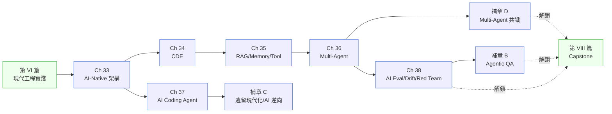

# 第 VII 篇|AI 時代的 SA/SD

> **NorthVale 那位病安長看著 LangSmith trace 問:「我們明明寫『AI 輔助分流』,為什麼 LLM 一旦答了,系統就直接把答案送進去,沒有人再看一眼?」這篇六章加三個補章,就是在回答這個問題。**

---

AI 工具讓工程師寫得更快了。但沒有人告訴你,**AI 寫出來的程式需要一個更清楚的「為什麼」才能被信任**。

第 VII 篇是全書密度最高的一篇。它不假設你反對 AI,也不假設你相信 AI 能解決所有問題。它假設你已經在用 AI 工具,而且開始遇到它帶來的新問題:LLM 怎麼和現有架構接線?Agent 的邊界怎麼劃?多個 Agent 衝突怎麼解?AI 寫的程式怎麼測?舊系統怎麼在 AI 的幫助下現代化?

六章依**系統複雜度增長**的順序排列:單一 LLM 接入(Ch 33)→ Context 設計(Ch 34)→ Memory 與 Tool(Ch 35)→ Multi-Agent(Ch 36)→ AI 寫程式(Ch 37)→ 評估與紅隊(Ch 38)。三個補章在旁邊等著回答三個更深的問題:非確定性系統的 QA(補章 B)、用 AI 逆向現有系統(補章 C)、Multi-Agent 的共識與衝突(補章 D)。

---

## 篇內章節依存圖

---

## 各章核心問句

| 章 | 標題簡稱 | 這章回答的真正問題 |
|---|---|---|
| Ch 33 | AI-Native 架構 | AI-Embedded / Augmented / Native 三個層次,差別在哪裡? |
| Ch 34 | CDE | CLAUDE.md 和 agents.md 是文件還是架構的一部分? |
| Ch 35 | RAG / Memory / Tool | 三種記憶(Semantic / Episodic / Procedural)各自解決什麼問題? |
| Ch 36 | Multi-Agent | 更多 Agent ≠ 更好——什麼時候該拆,什麼時候該合? |
| Ch 37 | AI Coding Agent | 讓 AI 寫程式和讓 AI 審程式,信任模型一樣嗎? |
| Ch 38 | AI Eval / Drift / Red Team | LLM 的「通過率」和傳統軟體的「通過率」,是同一種概念嗎? |
| 補章 B | Agentic QA | 當系統的輸出不確定時,測試的定義要怎麼改? |
| 補章 C | 遺留現代化 / AI 逆向 | 用 AI 讀懂一個沒有文件的遺留系統——從哪裡開始? |
| 補章 D | Multi-Agent 共識 | 兩個 Agent 給出相反結論時,誰說了算? |

---

## 不同讀者的建議入口

- **剛開始接觸 LLM 應用開發**:Ch 33 → Ch 34 → Ch 35。三章讀完你能設計一個有 Context 管理和 Memory 機制的 AI 功能。
- **正在做 Multi-Agent 系統**:Ch 36 → 補章 D。兩章對應「拆 Agent 的標準」和「Agent 衝突的仲裁機制」。
- **AI 工具的重度使用者(Cursor / Claude Code)**:Ch 37 是你的主章——AI Coding Agent 的委託模型、PR 審查標準、回歸測試策略。
- **QA 工程師**:補章 B 是你在 AI 時代的新工作定義。比主章更值得先讀。
- **正在做遺留系統評估**:補章 C 從「AI 逆向工程現有 codebase」的技術開始,到「選擇現代化策略」的決策框架結束。

---

## 前後篇連結

- **前置**:[第 VI 篇 現代工程實踐](../part-06-engineering/00-overview.md)（ADR 和 Fitness Functions 是 AI 時代工程實踐的地基）
- **這篇解鎖**:[第 VIII 篇 Capstone](../part-08-synthesis/00-overview.md) — 全部工具接上之後,Ch 39 用一個完整案例走一遍
- **長距離影響**:這篇是全書所有前置知識的集大成。Ch 17 DDD 的 Bounded Context 在 Ch 36 重出現為 Agent 邊界;Ch 25 的安全設計在 Ch 38 重出現為 AI 的 Red Team;Ch 31 的 Fitness Functions 在補章 B 重出現為 Agentic QA 的自動化驗證點
