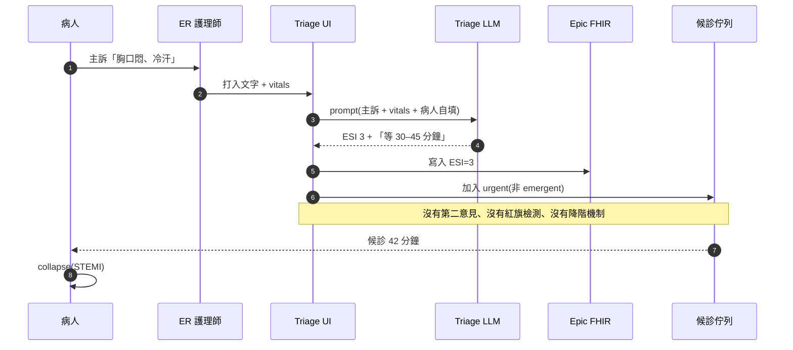
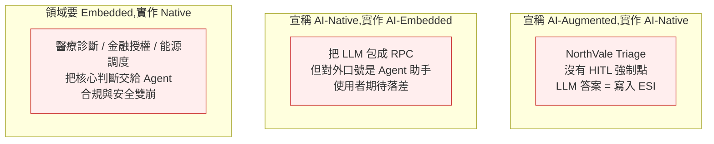
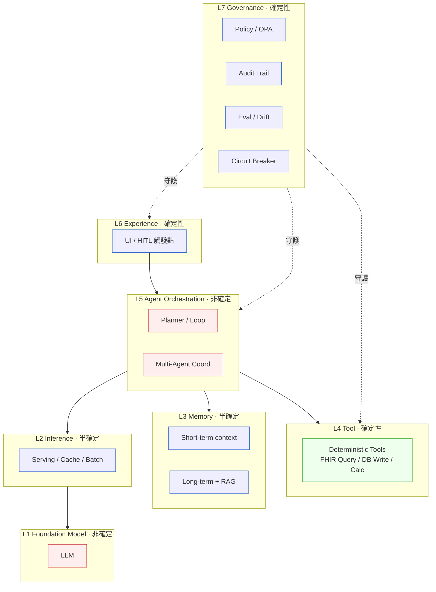
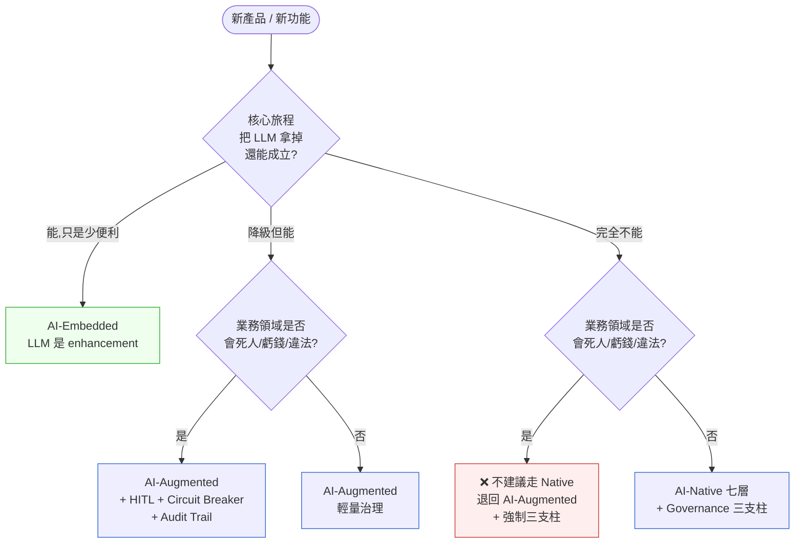

# 第 37 章|AI-Native 架構
## ⸺ 從 AI-Embedded 到 Agent-First

> **前置閱讀**:[Ch 13 架構風格與決策](../part-03-design/ch-13-architecture-styles.md)、[Ch 23 EDA / CQRS / ES](../part-04-architecture/ch-23-event-driven-cqrs-es.md)、[Ch 27 Security by Design](../part-05-quality/ch-27-security-by-design.md)
> **下游章節**:[Ch 37 Context-Driven Engineering](./ch-38-context-driven-engineering.md)、[Ch 38 RAG 與知識架構](./ch-39-rag-memory-tool.md)、[Ch 39 Multi-Agent 系統設計](./ch-40-multi-agent.md)
> **延伸補章**:[Ch 45 Agentic QA](./ch-46-agentic-qa.md)、[Ch 28 Compliance by Design](../part-05-quality/ch-28-compliance.md)

---

## 33.1 冷觀察 ⸺ 胸痛病人被 LLM 判成「非緊急」

我在 2026 年第一季看過一個案例。

虛構區域醫院聯盟 **NorthVale Health Network**(`CASE-HCR-007`),四家急診室、年急診人次 38 萬,做了一套 LLM-driven triage 助手,2025 年底上線。技術棧:GPT-4o-class 私有部署 + Anthropic Claude Sonnet 4.5(雙模型 fallback)+ FHIR R4 介接 Epic + HL7 v2.5.1 ADT 即時餵入,跑在自家機房 OpenShift 4.16,合規對齊 HIPAA 與台灣個資法。產品定位是「**AI-First 智慧分流**」,內部 Wiki 寫的是「ER 護理師可放心將 ESI(Emergency Severity Index)5 級判讀交由 LLM 完成,僅需在工作站確認即可」。

ESI 是美國急診護理協會維護的 5 級分流標準 [^CIT-336]:**Level 1 是會死的(立即),Level 2 是會壞掉的(< 10 分鐘),Level 3–5 視資源消耗下降排序**。Level 1 / 2 的誤判代價是命,Level 4 / 5 誤判代價是病人多等四十分鐘。這個尺度在 ER 圈是常識,但在做這套系統的工程團隊裡沒人講過這句話。

上線第十一週,週六下午,一位 58 歲男性走進 ER,主訴「**胸口悶、流冷汗、半小時前開始**」。LLM 拿到的輸入是一段護理師打進去的自由文字 + 體溫 36.8°C + 收縮壓 142 mmHg + SpO2 97%,加上病人自填表單上勾的「**沒有心臟病史**」。LLM 給出的分流建議是 **ESI Level 3「urgent, multiple resources needed」**,並附了一段「建議 EKG 與 troponin,可於候診區等待 30–45 分鐘」的說明文字。護理師當班忙、也已被訓練「LLM 跟我意見相同就直接送出」,點了確認。

四十二分鐘後病人 collapse。是 STEMI(ST 段抬高型心肌梗塞),door-to-balloon time 從原本應該 < 90 分鐘變成 144 分鐘。心肌壞死面積擴大,病人活下來但 ejection fraction 從入院前的 55% 掉到 32%。家屬在事故發生後第三天提告,媒體在第五天用「**AI 醫生害命差點害死人**」做標題。

事故覆盤會上,病安長(Chief Patient Safety Officer)看著 LangSmith trace 上 LLM 那段 reasoning 的 chain-of-thought,問了一句被原樣記下來的話:

> 「我們明明寫『AI 輔助分流』,為什麼 LLM 一旦答了,系統就直接把答案送進去,沒有人再看一眼?」

沒人答得出來。因為團隊在做架構時,從沒回答過一個問題:**這套系統,如果把 LLM 拿掉,還能不能跑?** 答案是不能 ⸺ 護理師工作站的「分流」按鈕被串成「呼叫 LLM → 等回應 → 寫進 ESI 欄位 → 進入候診佇列」一條路徑,LLM 不在,整條 triage 旅程斷在第一步。



那位病安長在事故報告的最後一頁寫了一句話:**「這套系統不是 AI-Augmented,是 AI-Dependent。我們把臨床判斷的最後一道閘門交給了一個機率模型,還叫它『輔助』。」**

接下來八週,團隊做了一件他們應該在動手寫第一行 prompt 之前就做的事:**把這套系統拆成「確定性層 + 非確定性層」兩半,並且回答「LLM 不在的時候,旅程怎麼走」**。重構之後,胸痛、頭部外傷、呼吸困難、嬰幼兒高燒等高風險主訴會先進一張**確定性的紅旗規則表**(由急診醫學會審核過、寫在 DMN 決策表裡、放進 git 版本控管),命中任何一條直接 ESI ≤ 2 並 paging 主治。LLM 仍然存在,但只在紅旗表沒命中時介入,而且任何 LLM 給的 ESI 3–5 必須由護理師主動「同意」才寫入 ⸺ 不是預設按確認,是預設要看一眼。

那位病安長離職前留了一句話在事故覆盤的白板上:**「AI-Native 不是把所有判斷都丟給 LLM,是讓系統知道哪些判斷不該丟。」**

---

## 33.2 真問題 ⸺ AI-Embedded / AI-Augmented / AI-Native 是三種不同定位

把 NorthVale 的事拆開來看,問題不是「LLM 不夠強」、也不是「prompt 沒寫好」⸺ 問題是團隊把 **AI-Embedded、AI-Augmented、AI-Native** 三種**本質不同**的系統定位混為一談,然後用「AI-Native」這四個字當口號上線了一個其實是「AI-Dependent」的系統。

這三個詞在 2025–2026 的會議室、投影片、徵才頁滿天飛,但意思常常各說各話。把它們拆開來看會比較清楚。

### 33.2.1 三種定位的本質差異

| 定位 | 一句話定義 | 拿掉 LLM 之後 | 適合場景 |
|---|---|---|---|
| **AI-Embedded** | 在既有系統某個節點塞進 LLM 呼叫 | 系統旅程**仍可成立**,只是少了便利功能 | 客服建議回覆、文件摘要、語意搜尋、autocomplete |
| **AI-Augmented** | 系統設計上預設「人 + AI」雙線決策,任一條斷掉旅程仍可閉環 | 系統旅程**降級但仍可成立**(可能慢、可能粗糙) | 程式碼 review 助手、放射科影像第二意見、合約條款比對 |
| **AI-Native** | 系統的**核心旅程**由 Agent 推理 / 規劃 / 工具調用所構成 | 系統旅程**整段崩潰**,等同於系統不存在 | Coding Agent、研究 Agent、自主查詢 / 預訂類助手 |

這張表的關鍵不在第二欄,在**第三欄**。判別一個系統是哪種定位的 litmus test 是:**把 LLM 拿掉,使用者旅程是否還能成立?** 能 = AI-Embedded;降級 = AI-Augmented;崩潰 = AI-Native。

NorthVale 的問題是:**他們宣稱做的是 AI-Augmented,實作出來的是 AI-Native,而業務領域(臨床決策、生命安全)其實只允許 AI-Embedded**。三層錯位,事故只是時間問題。

### 33.2.2 為什麼「AI-Native」不等於「多用 LLM」

業界有個常見誤解:LLM 呼叫密度越高 = 越 AI-Native。這個直覺是錯的。

換句話說,AI-Native 的判準不是「**有沒有用很多 AI**」,而是「**系統的旅程拓樸,是不是預設由 Agent 決定**」。一個每秒呼叫 LLM 一萬次的系統可能仍是 AI-Embedded(把 LLM 當成 stateless 的翻譯函式);一個每天只呼叫 LLM 三次的系統可能是 AI-Native(那三次決定下游所有 deterministic worker 該做什麼)。

差別在**控制流誰決定**:Embedded 是「人 / 規則決定流程,LLM 在某個 step 被呼叫」;Native 是「LLM / Agent 規劃整個流程,deterministic 元件被 Agent 呼叫」。

### 33.2.3 真正在處理的是「確定性 vs 非確定性」的邊界放在哪

進一步拆開來看,三種定位差別的**真正本質**,是「**確定性層**」與「**非確定性層**」的邊界放在哪。

- 在 **AI-Embedded** 系統,確定性層包住非確定性層 ⸺ LLM 是工具,被規則叫;
- 在 **AI-Augmented** 系統,兩層平行 ⸺ 各自跑、互相 cross-check;
- 在 **AI-Native** 系統,非確定性層包住確定性層 ⸺ Agent 是 orchestrator,deterministic worker 是 agent 的 tool。

這個拓樸決定了**錯誤模式**也不同:Embedded 系統的故障多半是「LLM 回不來/超時」,降級即可;Native 系統的故障是「Agent 規劃出錯誤的旅程」⸺ 不是某個 step 失敗,是**整條旅程選錯**。臨床決策、金融授權、能源調度這類「選錯比慢更糟」的領域,如果走 AI-Native,就必須在非確定性層外圍**強制套上確定性護欄**,否則就是 NorthVale 的故事。

### 33.2.4 三種定位錯位的代價

把三種定位錯位放上來看:



換句話說,**錯位的代價會分三批送達**:第一批是事故(NorthVale 那種);第二批是合規(EU AI Act 高風險系統 2026/8/2 全面執行);第三批是用戶信任(一旦失去,新功能再強也叫不回)。

---

## 33.3 決策框架 ⸺ 該選哪一種定位、AI-Native 怎麼分層

### 33.3.1 三種定位適用情境表

下面這張表在跨 PM / SA / 法遵的三方會議上很好用 ⸺ 當有人說「我們要做 AI-Native 產品」,先問一句「**這個業務,LLM 不在的時候你能不能上線**」,再決定要走哪一種:

| 維度 | AI-Embedded | AI-Augmented | AI-Native |
|---|---|---|---|
| **核心旅程依賴 LLM** | 不依賴 | 部分依賴(可降級) | 完全依賴 |
| **適合複雜度** | S / M | M / L | L(複雜開放任務) |
| **錯誤代價** | 可逆(改提示、再試) | 部分可逆(人工 fallback) | 不可逆(規劃錯整段) |
| **合規難度** | 低(LLM 是工具) | 中(需證明人類仍 in the loop) | 高(EU AI Act / 醫療 / 金融需專案級審查) |
| **HITL(Human-In-The-Loop)** | 可選 | 必要 | **強制**(高風險領域) |
| **典型 artifact** | API endpoint + prompt template | Eval set + 雙線比對日誌 | Agent skill 圖 + Audit Trail + Circuit Breaker |
| **領域案例** | EMR 自動生成出院摘要、客服回覆草稿 | 放射影像第二意見、合約條款比對 | 自主研究 Agent、Coding Agent |
| **若領域是「會死人 / 會虧錢 / 會違法」** | ✅ 推薦 | ⚠️ 限定子域 | ❌ 不建議,改 Augmented |

NorthVale 應該怎麼做?ER triage 是「會死人」的領域,**預設值應該是 AI-Embedded**(LLM 只在低風險 ESI 4 / 5 提供建議,且護理師預設要看一眼),完全不該走 AI-Native。如果要走 AI-Augmented,LLM 與 deterministic 紅旗規則表必須**雙線並行 + 取較嚴的那一邊**,而不是 LLM 答了就直接寫入。

### 33.3.2 AI-Native 七層架構

如果一個業務真的適合走 AI-Native(典型如 Coding Agent、研究助手、自主查詢類助手),那它的內部會自然形成七層 ⸺ 這個分層在 2025–2026 的 Anthropic Building Effective Agents [^CIT-330]、Chip Huyen *AI Engineering* [^CIT-333]、SAP 2026 AI-Native Architecture Whitepaper [^CIT-331]、LangGraph 文件 [^CIT-332] 之間趨於收斂。

| 層 | 名稱 | 職責 | 確定性? | 典型元件 |
|---|---|---|---|---|
| **L1** | **Foundation Model** | 推理本體 | 非確定 | Claude / GPT / Gemini / 開源 model |
| **L2** | **Inference / Serving** | 模型服務化、batching、caching、quota | 半確定(latency / cost) | vLLM / TGI / Bedrock / Anthropic API + Prompt Caching |
| **L3** | **Memory** | 短期 context、長期記憶、RAG 知識庫 | 半確定(召回精度) | Postgres + pgvector、Redis、Iceberg、Lakebase |
| **L4** | **Tool** | 賦予 Agent 的能力(查詢、寫入、計算、外部 API) | 確定(每個 tool 本身) | Function calling、MCP server、內部 API |
| **L5** | **Agent Orchestration** | 規劃、迴圈、多 Agent 協作 | 非確定 | LangGraph、AutoGen、Anthropic Skills、自寫 |
| **L6** | **Experience** | 介面、對話流、確認 UI、HITL 觸發 | 確定 | Web UI、IDE plugin、Slack bot、語音 |
| **L7** | **Governance** | 安全、合規、Audit、Circuit Breaker、Eval | 確定 | OPA、Constitutional AI、LangSmith、Eval set、紅隊 |

這七層放在一起的拓樸像這樣:



這張圖的關鍵不在元件,在**顏色**。**hot(紅)是非確定性層,cold(藍)是確定性層,goal(綠)是 Agent 真正能放心用的工具集**。L1 與 L5 是兩塊紅,意思是「規劃」與「推理」都是隨機的;L7 必須是藍 ⸺ 用非確定的方法守護非確定的系統,只會疊加風險,不會降低。這也是為什麼 Governance 一定要寫成可執行的 OPA policy / fitness function,不能寫成「我們有一份 AI 倫理章程」。

### 33.3.3 治理三支柱:HITL、Circuit Breaker、Audit Trail

L7 Governance 不是一個抽象口號,在 2026 年的現場,它至少有三根可落地的支柱:

| 支柱 | 一句話定義 | 落地手段 | 高風險領域必要性 |
|---|---|---|---|
| **HITL(Human-In-The-Loop)** | 在不可逆 / 高風險 step 強制要求人類確認 | UI 顯式 confirm + 雙因子(看 + 簽);**禁用「靜默通過」預設值** | 必要(醫療、金融、能源、法律) |
| **Circuit Breaker** | 當 Agent / LLM 行為異常時自動降級或停機 | drift 偵測 / cost spike / hallucination rate / consistency check;觸發後切到確定性 fallback 路徑 | 必要 |
| **Audit Trail** | 完整重現一次決策的輸入、prompt、tool call、輸出 | LangSmith / Langfuse / 自建,事件溯源 + 不可變儲存;對齊 EU AI Act Art. 12(Logging) | 必要(合規) |

NorthVale 後來把這三根支柱補回去:HITL 改成「ESI ≤ 2 必有兩位臨床人員確認;ESI 3–5 LLM 給出建議後,UI 顯示『你看過了嗎』而非『確認送出』,需要主動點擊看過細節」;Circuit Breaker 接到「同一班次 LLM 對胸痛主訴給出 ESI ≥ 3 的次數」這個指標 ⸺ 一旦超過閾值,系統自動把 triage 回退到純規則 + 人工模式;Audit Trail 用 LangSmith + 內部 Postgres event store 雙寫,保留期 10 年,對齊台灣醫療法規的病歷保存規定。

### 33.3.4 確定性層 vs 非確定性層的契約

把七層拓樸再壓縮一下,本質上 AI-Native 系統就是「**用一層確定性的殼,包住一團非確定性的核**」。這個殼跟核之間需要一份契約:

| 契約項 | 確定性層的義務 | 非確定性層的義務 |
|---|---|---|
| **輸入** | 提供結構化、schema 化的 input(JSON Schema、Pydantic) | 接受 free-form context,但**不**接受未清洗的使用者輸入(避免 prompt injection) |
| **輸出** | 對輸出做結構驗證(JSON 解析、schema 驗證、數值範圍檢查) | 在合理範圍內提供結構化輸出,失敗時 retry / fallback |
| **副作用** | 任何 write / call API / payment 必須走確定性層的 tool | 不直接執行副作用,只**規劃**該執行什麼 |
| **可重現** | 完整 log input / output / tool call / token usage | 提供 trace_id 與 reasoning chain 供 audit |
| **失敗模式** | 超時、錯誤碼明確、可降級 | hallucination 視為**可預期失敗**,需 caller 處理 |

這份契約在 Hexagonal 視角下,可以把「Agent + LLM」整體當成一個 **Adapter**(`Driven Adapter`),L4 Tool 是另一組 Adapter ⸺ Domain 核心(L4 deterministic tools 服務的真實業務邏輯)永遠不知道自己背後有 LLM。**「Domain 不知道自己用了 AI」是一條判斷 AI-Native 設計做得好不好的最簡單線**。

### 33.3.5 與 Modular Monolith / Hexagonal / Event-Driven 整合

七層架構不是另起爐灶,而是**架在現有架構風格之上**。落到實作有三種常見組合:

- **Modular Monolith + Agent**(S/M 規模):L1–L7 全部跑在一個 process 裡(透過 thread / async),Agent 與 deterministic worker 用模組邊界區隔(用 ArchUnit / Spring Modulith 守護)。NorthVale 重構後就是這個拓樸,複雜度收斂、debug 容易。
- **Hexagonal + Agent-as-Driven-Adapter**(M 規模):Domain 在中心,LLM 與 deterministic tools 都是 adapter,Agent Orchestrator 也是 adapter。Domain 對外只暴露 use case(`triage(case) → ESI`),不知道後面是規則還是 LLM。
- **Event-Driven + Agent Worker**(L 規模):Agent 訂閱 command bus、產出 event 到 event bus,Saga / Process Manager 協調 ⸺ Anthropic 的 Building Effective Agents [^CIT-330] 中 Orchestrator-Workers 模式就是這個拓樸。Audit Trail 自然就是 event store。

這三種組合不衝突,大致對應 S / M / L 三種複雜度。**起手建議用 Modular Monolith + Agent,等到 bounded context 穩了再考慮拆出 Agent Worker**(承接 Ch 21 / Ch 22 的判準)。

### 33.3.6 一張決策樹:這個產品該選哪一種定位



這張圖的關鍵不在分支,在 **Q1 那個問句**:「**把 LLM 拿掉,還能成立嗎?**」這個問題能逼出產品真正的定位。NorthVale 當初如果在 kickoff 會議上回答了這個問題,他們會發現 ER triage 的核心旅程「拿掉 LLM 走不下去」⸺ 那一刻他們就應該停下來重做設計,而不是上線等出事。

---

## 33.4 踩坑清單

下面這四個反模式,在 2025–2026 採用 LLM / Agent 的團隊裡反覆出現。每一個都附修正方向。

### 反模式 1:把「多用 LLM」當成「AI-Native」

工程團隊看到投資人 / 高層的 AI-Native 口號,把現有系統的每個 step 都塞一個 LLM call,結果是「每秒呼叫 LLM 一萬次的 AI-Embedded 系統」用「AI-Native」名義上線。半年後雲端帳單三倍、延遲飆升、產品還是原本的 CRUD ⸺ 因為控制流仍然是規則,LLM 只是裝飾。

> ✅ **修正方向**:在 kickoff 第一次架構討論回答兩個問題 ⸺(1)「**核心旅程的下一步,誰決定?**」是規則 / 流程引擎決定,就承認自己是 AI-Embedded;是 Agent 規劃決定,才是 AI-Native。(2)「**LLM 拿掉,使用者旅程還能成立嗎?**」答案寫進 System Charter 的 Decisions 區塊,後續 PR / 設計討論一律對齊這個答案。把這兩個答案寫下來,「多用 LLM = AI-Native」的誤解會在第一週就被擋下。

### 反模式 2:沒有 HITL 強制點(LLM 答案直接寫入)

像 NorthVale 一樣,介面上 LLM 給完答案就「預設按確認」,UI 上的「確認送出」按鈕變成肌肉記憶。一旦 LLM 出錯(模型升級、prompt drift、rare case),錯的答案直接寫入下游系統,事故發生後才發現整條鏈路上沒有任何人類擋下這個答案的設計。

> ✅ **修正方向**:HITL 不是「畫一個 confirm 按鈕」就算數,要做兩件事 ⸺(1)**預設值反轉**:UI 預設不是「確認送出」,而是「需要看過細節才能送」(顯示理由、影響、相反意見);(2)**雙因子確認**:不可逆 / 高風險動作要求兩位獨立角色簽核(臨床:護理師 + 主治;金融:操作員 + 主管;法律:律師 + 合夥人)。把 HITL 寫進 Threat Model 的 mitigation 欄位,並在 CI 加 fitness function 確保「unsafe-defaults」這類靜默通過 UI 不會回流。

### 反模式 3:把 Governance 寫成口號而不是 fitness function

公司網站貼上「我們秉持負責任 AI 原則 ⸺ 透明、公平、可解釋、安全」,treating AI ethics 為公關文案。但 PR 流程裡沒有 OPA policy 檢查 prompt diff、Audit Trail 沒接到 event store、Circuit Breaker 不存在、Eval set 連 baseline 都沒測過。事故發生時,合規團隊唯一能做的事是發新聞稿。

> ✅ **修正方向**:把 Governance 三支柱(HITL / Circuit Breaker / Audit Trail)各自寫成至少一條**可執行的 fitness function**(承接 Ch 34)。例如:HITL → Spectral 規則檢查 OpenAPI 中所有 `/decision` endpoint 必須有 `requires_human_confirm: true` 欄位;Circuit Breaker → Prometheus rule 檢查 LLM hallucination rate burn rate;Audit Trail → ArchUnit 規則禁止 LLM client 直接呼叫 write API,必須走經過 audit log 的 facade。**寫得出可執行 policy,治理才是真的存在;寫不出來,就是公關**。

### 反模式 4:Modular Monolith / Hexagonal / EDA 與 Agent 各做各的

團隊一邊跑「現代化架構轉型」(從 layered 遷到 Hexagonal、從同步遷到 EDA),一邊另外開一個「AI 創新團隊」用 LangChain 在隔壁倉庫疊另一套 service。半年後出現兩套並行架構:傳統那套有 ArchUnit / outbox / event store;AI 那套是一鍋 prompt + tool call,沒有 audit、沒有 schema 治理、沒有依賴方向。要整合時兩邊的 mental model 對不起來。

> ✅ **修正方向**:**Agent 是 Adapter,不是另一個系統**。從第一天起就把 Agent / LLM 接入既有架構風格的 adapter 槽位 ⸺ Hexagonal 系統把 LLM 當 Driven Adapter、Modular Monolith 系統把 Agent 視為一個模組(有自己的 Public API、Events、Boundary)、EDA 系統把 Agent 當成一個訂閱 command bus 的 worker。這個原則寫進 ADR(Ch 33)、用 Fitness Function(Ch 34)守護,新人 onboarding 那天就會看到「這裡的 AI 不是異類,是另一個 Adapter」。承接 Ch 13 的 Hexagonal 訓練,這條路最自然。

---

## 33.5 交付清單 ⸺ AI-Native System Vision Card

每次評估「這個產品該不該走 AI-Native」,**第一份要產出的不是技術選型投影片,是 AI-Native System Vision Card**。它是一頁 Markdown,逼出八個答案:定位、Litmus Test、七層元件、確定性邊界、HITL 觸發點、Circuit Breaker、Audit Trail、Owner。

把它存在 `docs/architecture/ai-native-vision-{slug}.md`,跟 ADR 同 repo,跟程式碼同步演化。

````markdown
# AI-Native System Vision Card — {產品 / 子系統名稱}

> 撰寫日期:YYYY-MM-DD | 擁有人:{名字}
> 對齊:System Charter v0.x、相關 ADR:{連結}
> 狀態:Draft | Reviewed | Approved

## 1. 定位選擇(勾一個)

- [ ] **AI-Embedded**:LLM 是 enhancement,核心旅程不依賴
- [ ] **AI-Augmented**:人 + AI 雙線決策,任一斷掉旅程仍可降級閉環
- [ ] **AI-Native**:核心旅程由 Agent 規劃 / 推理 / 工具調用構成

**理由**(2–3 句):為什麼是這一定位,不是上一格或下一格?

## 2. Litmus Test

> 「把 LLM 整體拿掉(回應 503),使用者旅程是否還能成立?」

- [ ] 仍可成立(對應 Embedded)
- [ ] 降級可成立(對應 Augmented)
- [ ] 完全不可成立(對應 Native)

**結論**與第 1 題的選擇一致嗎?不一致 → 回到第 1 題重新選。

## 3. 業務風險分級

- [ ] 業務領域涉及「會死人 / 會虧錢 / 會違法」?
  - [ ] 是 → 預設值是 **Embedded**;若需 Augmented,**強制**三支柱
  - [ ] 否 → 三定位皆可,但仍建議至少 Audit Trail

## 4. 七層元件清點

| 層 | 元件名稱 | 是否需要? | Owner |
|---|---|---|---|
| L1 Foundation Model | (e.g., Claude Sonnet 4.5) | | |
| L2 Inference / Serving | | | |
| L3 Memory | | | |
| L4 Tool | (列出 deterministic tool 清單) | | |
| L5 Agent Orchestration | | | |
| L6 Experience(HITL UI) | | | |
| L7 Governance | | | |

## 5. 確定性層 vs 非確定性層邊界

- 哪些 step 必須在確定性層執行?(寫 / 付款 / 不可逆動作)
- 哪些 step 允許在非確定性層執行?(規劃 / 摘要 / 排序建議)
- 兩層的契約:input schema / output schema / 失敗模式各是什麼?

## 6. HITL 觸發點

| 不可逆 / 高風險動作 | HITL 觸發策略 | 確認方式 |
|---|---|---|
| (e.g., ESI ≤ 2 寫入) | 強制 | 兩位臨床人員 |
| (e.g., > $10K 轉帳) | 強制 | 操作員 + 主管 |
| (e.g., 文件刪除) | 預設要看過細節 | 單人 + 顯式按鈕 |

## 7. Circuit Breaker

- 監測指標:(e.g., LLM hallucination rate / cost burn rate / latency P99 / drift)
- 觸發閾值:____
- 降級行為:(e.g., 切到純規則模式 / 進入只讀 / 強制 HITL 全量)
- 恢復條件:____

## 8. Audit Trail

- 工具:LangSmith / Langfuse / 自建 event store
- 保留期:____(對齊法規)
- 必含欄位:trace_id / prompt / model version / tool calls / output / human confirm log
- 對齊法規:HIPAA / EU AI Act Art. 12 / 醫療法 / 個資法 / PCI DSS

## 9. Owner

| 區塊 | Owner | 副手 |
|---|---|---|
| 產品定位與 vision | | |
| L4 Tool 開發 | | |
| L5 Orchestration | | |
| L7 Governance | | |
| HITL UI | | |
| 法遵 / 合規對齊 | | |
````

**為什麼是一頁?** 一頁的篇幅會逼出選擇。三十頁的 RFC 會讓你誤以為自己在做選擇,實際上只是在描述。

**為什麼第 1、2、3 題分開?** 這就是本章核心:三種定位是三種不同決定。第 1 題逼你拍定位;第 2 題用 litmus test 檢核第 1 題沒在自欺欺人;第 3 題把業務領域風險拉進來,擋下「臨床決策走 Native」這類災難性錯位。

**為什麼第 6 題寫「預設要看過細節」而不是「預設按確認」?** 這就是 NorthVale 那一場事故的本質。預設值決定行為,不是 UI 文案決定行為。

---

## 33.6 本章交付清單 Recap

讀完本章,你應該已經能做到:

- [ ] 用 Litmus Test(把 LLM 拿掉旅程是否成立)分辨 AI-Embedded / Augmented / Native 三種定位,並避免把「多用 LLM」誤認為 AI-Native
- [ ] 在會議上指認出三定位錯位的三種典型(Augmented 宣稱 Native 實作、Native 宣稱 Embedded 實作、領域要 Embedded 卻做成 Native)
- [ ] 用 AI-Native 七層架構表 + 治理三支柱表(HITL / Circuit Breaker / Audit Trail)切出確定性層與非確定性層的邊界,並為高風險領域強制三支柱
- [ ] 為手上規劃中的 AI 功能寫一份 AI-Native System Vision Card(放 `docs/architecture/ai-native-vision-{slug}.md`),逼自己在動手前回答八個答案

四項中先挑一項做完就好,建議是最後那一項 ⸺ 把手上正在規劃的 AI 功能拉出來,補一張 Vision Card,逼自己回答 Litmus Test。本章留給你的就是「把 LLM 拿掉,旅程還能成立嗎」這條判斷線。下一章 [Ch 37 Context-Driven Engineering](./ch-38-context-driven-engineering.md) 會接著回答:**確定性那一層,要怎麼餵給 AI 才能讓它穩定產出**。

---

## Cross-References

- **下一章**:[Ch 37 Context-Driven Engineering](./ch-38-context-driven-engineering.md) ⸺ AI 協作下的脈絡工程
- **架構風格基礎**:[Ch 13 架構風格與決策](../part-03-design/ch-13-architecture-styles.md) ⸺ Hexagonal 是 Agent-as-Adapter 的母體
- **事件流基礎**:[Ch 23 EDA / CQRS / ES](../part-04-architecture/ch-23-event-driven-cqrs-es.md) ⸺ Audit Trail 與 Agent Worker 的拓樸
- **安全設計**:[Ch 27 Security by Design](../part-05-quality/ch-27-security-by-design.md) ⸺ Threat Model + Prompt Injection
- **下游 RAG**:[Ch 38 RAG 與知識架構](./ch-39-rag-memory-tool.md) ⸺ L3 Memory 的展開
- **下游 Multi-Agent**:[Ch 39 Multi-Agent 系統設計](./ch-40-multi-agent.md) ⸺ L5 Agent Orchestration 的展開
- **延伸補章**:[Ch 45 Agentic QA](./ch-46-agentic-qa.md)、[Ch 28 Compliance by Design](../part-05-quality/ch-28-compliance.md)

## 引用

[^CIT-330]: Anthropic, "Building Effective Agents" (December 2024)。anthropic.com/research/building-effective-agents。Agent 七種模式(Augmented LLM / Prompt Chaining / Routing / Parallelization / Orchestrator-Workers / Evaluator-Optimizer / Autonomous)與「先簡單,別預設多 agent」原則。
[^CIT-331]: SAP, "AI-Native Architecture Whitepaper" (2026)。sap.com/research/ai-native。七層架構分層公開資料來源之一。
[^CIT-332]: LangGraph Documentation (langchain-ai.github.io/langgraph/, 2024–2026)。Stateful agent orchestration 框架,L5 層典型實作。
[^CIT-333]: Chip Huyen, *AI Engineering: Building Applications with Foundation Models* (O'Reilly, 2025)。AI-Native 系統設計、Eval、Memory、Inference 層次參考。
[^CIT-334]: Anthropic, "Constitutional AI" + "Tool Use Safety" (2023–2026)。同 CIT-258。Governance 層 alignment 基礎。
[^CIT-335]: EU AI Act, Regulation (EU) 2024/1689, Art. 12 (Logging) / Art. 14 (Human Oversight) / Art. 27 (FRIA)。高風險 AI 系統 HITL 與 Audit 法源。
[^CIT-336]: Emergency Severity Index (ESI) Implementation Handbook, Version 4 (Agency for Healthcare Research and Quality, US)。ahrq.gov/professionals/systems/hospital/esi/。ER 5 級分流標準。
[^CIT-337]: HL7 v2.5.1 ADT + FHIR R4 Standard。同 CIT-088 / CIT-137。臨床整合協定基礎。
[^CIT-338]: LangSmith / Langfuse / Phoenix Documentation。同 CIT-269。AI Agent observability 與 Audit Trail 工具。
[^CIT-339]: OWASP Top 10 for LLM Applications (2024 / 2025 update)。同 CIT-257。Prompt Injection / Insecure Output Handling / Excessive Agency 等與 AI-Native 治理對齊。

---
