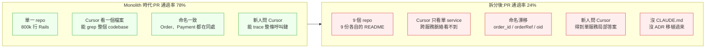
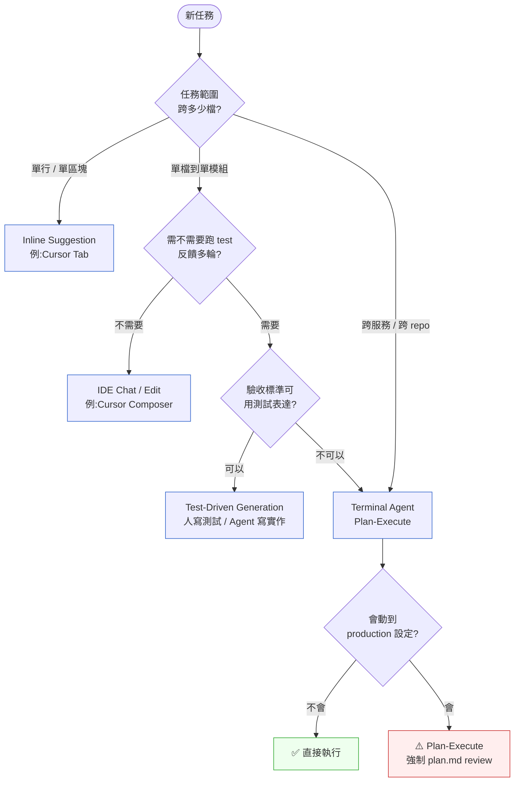
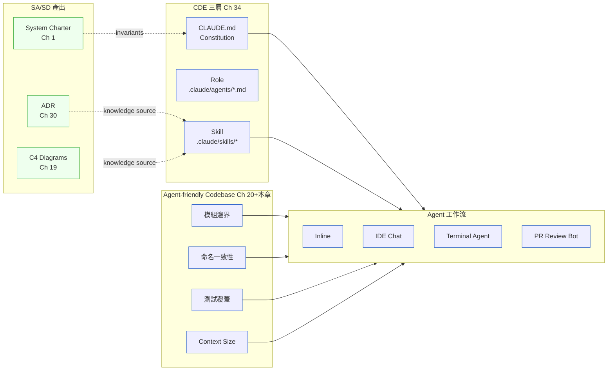

# 第 37 章|AI Coding Agent / Pair Programming
## ⸺ 從 Cursor 到 Claude Code 的工程整合

> **前置閱讀**:[Ch 1 為什麼 SA/SD](../part-01-foundations/ch-01-why-sa-sd.md)、[Ch 20 Modular Monolith](../part-04-architecture/ch-20-modular-monolith.md)、[Ch 30 ADR 與架構知識管理](../part-06-engineering/ch-30-adr-architecture-knowledge.md)、[Ch 34 Context-Driven Engineering](./ch-34-context-driven-engineering.md)
> **下游章節**:[Ch 38 AI 時代的 SA 角色重構](./ch-38-ai-eval-drift-redteam.md)
> **延伸補章**:[補章 C 遺留現代化](./chC-legacy-ai.md)

---

## 37.1 冷觀察 ⸺ 同一個 Cursor,在兩個 codebase 表現差三倍

我在 2026 年 3 月,看過一個虛構電商平台 **CartMosaic**(`CASE-ECM-009`)的事故覆盤。CartMosaic 做日韓跨境美妝 D2C,42 名工程師,2025 Q3 全公司導入 Cursor + Claude Code。前三個月團隊跑得很順,內部 dashboard 顯示 Cursor 寫的 PR 通過 review 的比例(以下稱 PR 通過率)穩定在 78%。技術 VP 在 all-hands 上把這個數字放出來,標題寫:

> 「我們的 AI Coding Agent ROI 已驗證 ⸺ Cursor 寫的 PR 有 78% 一次過。」

然後他們做了一個決定:**把那座從 2021 年養大的 Rails monolith,按 DDD bounded context 拆成 9 個微服務**。理由很標準 ⸺ team 變大、deploy 互卡、想讓 Cursor 在更小的 codebase 裡更聚焦。技術 VP 在拆分 kickoff 講過一句被內部記下來的話:

> 「服務小一點,Cursor 的 context window 才能裝得下,PR 通過率應該會更高。」

結果反過來。拆分後第六週,同一份 dashboard 顯示 Cursor 在新拆出的 9 個微服務 cluster 上,PR 通過率掉到 24%。同樣的工程師、同樣的 Cursor、同樣的 Claude Sonnet 4.7,在新拆的 codebase 上寫出來的 PR 大概每四個就有三個被 reviewer 退回 ⸺ 不是寫錯邏輯,是「寫得對但跟整個系統的脈絡接不起來」。RD lead 把過去六週被退回的 184 個 PR 標籤化,發現的退回理由集中在四種:

> - 「這個服務的事件名我們改過了,你用的是 monolith 時代的舊命名。」
> - 「這段邏輯應該在 `OrderService` 不是這裡 ⸺ 你怎麼判斷的?」
> - 「Stripe webhook 我們半年前已經改走 idempotent retry,ADR-0042 寫了,你又寫了一份自實作。」
> - 「測試只 mock 了一個服務,真實情境會跨三個服務。」

退回理由跟 Cursor 沒關係,跟 Claude Sonnet 4.7 也沒關係。**Cursor 變笨了嗎?沒有。是 codebase 提供的脈絡碎了**。同一個 Agent 在 monolith 時代能看到的「整體形狀」,在拆分後分散到 9 個 repo、9 份 README、9 套部署腳本、卻**沒有任何一份 CLAUDE.md、沒有任何一份 ADR、沒有任何一份模組邊界說明跟著一起搬過去**。



那場覆盤會議結束時,技術 VP 在白板上劃掉自己原本的金句,改寫了一行:

> 「Cursor 沒有變笨。是我們把 codebase 拆成 Agent 看不懂的形狀。」

這句話刺耳的不是「拆錯了」,是 ⸺ 工程團隊一直以為「服務小一點 = Agent 表現好一點」。實際上**剛好相反:Agent 的表現由「脈絡完整度」決定,而脈絡完整度跟服務切多細沒有單調關係**。Ch 1 的 PayLoop 在 180 天炸掉,炸的是「決策失憶」;Ch 34 的 AisleNova 在第六個月歸零,歸的是「沒有契約結構的脈絡」;CartMosaic 在第六週掉到 24%,掉的是「拆分時把脈絡留在原地」。同一條線在 2026 年反覆上演 ⸺ AI Coding Agent 的失敗,十次有八次是 codebase 沒準備好。

---

## 37.2 真問題 ⸺ Agent 的表現由 Codebase 決定,Codebase 是 Agent 的 Context

GitHub Copilot 在 2021 年 6 月以 OpenAI Codex 為底進入 GA,定位是 IDE 內的「下一行建議」⸺ 工程師打字、它接話 [^CIT-370]。Cursor 在 2023 年把這個格局推進一步,變成「整個 IDE 都圍繞 chat + edit 設計」,工程師可以選一段程式碼讓 Cursor 重寫、可以開 chat 讓 Cursor 跨檔修改 [^CIT-371]。Claude Code 在 2024 下半年再推進一步,把 Agent 從 IDE 拉到 terminal,讓 Agent 直接執行 shell 命令、跑 test、開 PR ⸺ 從「建議」走到「執行」[^CIT-372]。2025–2026 進入多 Agent 工作流時代:Orchestrator + Subagent、Skill 系統、PR Review Bot 並行 [^CIT-373]。

把這四代並排看,演化方向其實單調:**Agent 接觸到的脈絡量級越大、能執行的動作越多**。但反過來看也成立:**Agent 的失敗模式也跟著放大**。Copilot 寫錯一行,工程師 Tab 拒絕就好;Claude Code 寫錯一個 PR,可能已經跑過 test、push 到 remote、開了 PR、留了 comment ⸺ 後果鏈條長得多。

把 CartMosaic 那次事故的真問題拆開來看,它不是「Cursor 不好用」也不是「拆微服務錯了」,而是 ⸺ **AI Coding Agent 的成功不在「Agent 多強」,在「Codebase 多 Agent-friendly」**。同一個 Cursor,在 spaghetti monolith 與 modular monolith(Ch 20)裡的表現差距不是因為 Agent 變了,是因為 codebase 為 Agent 提供的脈絡密度不同。

換句話說,Codebase **就是** Agent 的 context。Cursor 一次能看 200k token、Claude Code 4.7 能看 1M token,但 codebase 隨便一個中型專案都是幾百萬行 ⸺ 任何 context window 都裝不下整個系統。Agent 看到的永遠是「片段」,**那個片段該裝什麼、用什麼形狀進來,由 codebase 自己提供的脈絡密度決定**。

### 37.2.1 為什麼「換更貴的模型」幾乎沒救

CartMosaic 的 RD lead 在覆盤中段問過一個問題:「我們把 Cursor 從 Sonnet 4.5 升到 Sonnet 4.7,是不是就好了?」答案是**沒用**。團隊做了 A/B 測試:同一批 50 個 PR,一半用 4.5、一半用 4.7,通過率分別是 23% 與 26%。換模型在 codebase 沒整理的情況下,得到的是統計噪音等級的改善。

這個結果跟 SWE-Bench 的觀察一致 [^CIT-374]:同一支模型在 SWE-Bench Verified(高品質、有完整測試的開源專案)上的 pass rate 可以到 60–70%,但在「真實企業 codebase」(內部命名、內部約定、沒有完整測試)上常常掉到 20–30%。**差距不在模型,在 benchmark 用的 codebase 跟你的 codebase 不一樣**。

| 投資項 | 平均 ROI(現場觀察) | 投資門檻 | 適合時機 |
|---|---|---|---|
| **換更貴 / 更新模型** | 低(5–15% 改善) | 低(改 config) | 做完下面三項之後 |
| **CLAUDE.md / agents.md 寫好** | 高(20–40% 改善) | 中(2–4 週) | 任何時候,優先做 |
| **Codebase 重構成模組化形狀**(Ch 20) | 極高(2–5x 改善) | 高(1–6 個月) | Agent 投資前先做 |
| **CDE 三層脈絡寫好**(Ch 34) | 極高(配合上一項放大) | 中(1–3 個月) | 跟重構並行 |
| **加裝 PR Review Bot** | 中(救尾、不救上游) | 低 | 上面三項都做完 |

CartMosaic 後來把預算重新分配:原本要花在「升級到下一代模型」的錢,改投到「把 9 個微服務各補齊 CLAUDE.md + 把 monolith 時代的 ADR 拆成各服務專屬版本 + 命名統一」⸺ 三個月後,同樣用 Sonnet 4.7,PR 通過率從 24% 回到 71%。**沒換模型,換的是 codebase**。

### 37.2.2 Agent-friendly Codebase 的工程意義

把這件事再拆細,所謂「Agent-friendly」不是玄學,是六個可被檢查的工程屬性。它們跟「人類友善的 codebase」高度重疊,但**有兩條對 Agent 特別關鍵**:

1. **CLAUDE.md / agents.md 完整度** ⸺ Agent 進來第一眼讀什麼
2. **Skill 對應 ADR**(Ch 34 §34.3.4)⸺ Agent 推論時讀的是當前生效的決策
3. **Codebase 模組邊界清楚**(Ch 20)⸺ Agent 局部推理不必撈整個 repo
4. **Test 覆蓋足以驗證生成程式**(Ch 34、Ch 31)⸺ Agent 寫完能自我驗證
5. **命名一致性** ⸺ 同一個概念在 codebase 各處用同一個名字
6. **Context Size 可控** ⸺ Agent 一次任務需要載入的脈絡量在合理範圍

第 5 項對 Agent 比對人類更關鍵。人類看到 `order_id` 跟 `orderRef` 會憑經驗猜這是同一個東西;Agent 看到會傾向當作兩個不同概念處理,於是寫出「為了相容兩種命名而做轉換」的多餘程式碼。CartMosaic 拆分時 9 個服務有 7 種訂單 ID 的命名,光整理這個就回收了 12% 的 PR 通過率。

第 6 項是 1M context window 的反直覺事實。Drew Breunig 在 2025 整理過長 context 衰減的多個觀察 [^CIT-375]:即使模型支援 1M token,實務上 ≥ 32k 後精度開始顯著下滑、≥ 128k 後幻覺率明顯上升。**Codebase 設計成「Agent 一次任務只需載入 < 32k token 脈絡」**,實質上比「Agent 能讀 1M token」對品質更有幫助。

換句話說,Codebase 設計是 AI 時代的隱形基礎建設。它不是 RD 的個人偏好,**是 RD Team 對 AI Coding Agent 的最大投資項目**。Ch 20 的 Modular Monolith 不只是「人類維護的形狀」,在 2026 是「Agent 推理的形狀」⸺ 同一個工程紀律,2026 多了一類受益者。

---

## 37.3 決策框架 ⸺ 工作流四種、Agent-friendly 判準、SDLC 五切入點

下面這幾張表跟兩張 Mermaid,在現場相當好用。它們的共同前提是:**選工作流之前,先把 codebase 設計到 Agent-friendly**;工作流選對了,SDLC 整合才有著力點。

### 37.3.1 Coding Agent 工作流四種

2026 年現場可見的工作流大致四類。它們不是替代,是按任務類型疊加的工具箱。CartMosaic 重整後同時用四種,每種對應不同任務。

| 工作流 | 一句話定義 | 代表工具 | 啟動成本 | 適合任務 |
|---|---|---|---|---|
| **Inline Suggestion** | 工程師打字、Agent 補完當前行 / 區塊 | Copilot、Cursor Tab、Cody | 極低(裝外掛) | 樣板程式碼、套路重複的小段 |
| **IDE Chat / Edit** | 工程師選一段或開 chat、Agent 跨檔修改 | Cursor Composer、Windsurf、Continue | 低(寫 prompt) | 重構單一模組、補測試、改設定 |
| **Terminal Agent** | Agent 在 shell 內直接執行 plan-execute 循環 | Claude Code、Aider、Goose | 中(設權限) | 跨 repo 任務、有 test 反饋的開發 |
| **PR Review Bot** | 在 PR 流程裡自動 review,留 comment 或 block | CodeRabbit、Greptile、Sweep、自建 | 中(設規則) | 守住 review 第一線、抓樣式問題 |

四種有不同的「適合解什麼問題」。CartMosaic 的分配是這樣:90% 的鍵盤輸入時間用 Cursor Inline 與 Composer;有「一個任務跨多檔、需要跑 test 反饋」時切到 Claude Code(terminal agent);PR 進入 review 時 CodeRabbit 自動掃一遍。**沒有「主力工具」⸺ 一個任務的形狀決定該用哪一類**。

### 37.3.2 Plan-Execute 與 Test-Driven Generation 兩種模式

Terminal Agent(尤其 Claude Code)在 2025 下半年定型出兩個成熟工作模式 [^CIT-376]。它們是同一個 Agent 在不同任務形狀下的不同節奏,值得單獨拿出來看。

```mermaid
flowchart TD
    subgraph PE[Plan-Execute 模式]
        P1[1.收到任務]
        P2[2.讀 CLAUDE.md + 相關檔案]
        P3[3.寫 plan.md<br/>列出步驟與驗收標準]
        P4[4.工程師 review plan]
        P5[5.執行 + 跑 test]
        P6[6.產 PR]
        P1 --> P2 --> P3 --> P4 --> P5 --> P6
    end

    subgraph TDG[Test-Driven Generation 模式]
        T1[1.工程師先寫失敗測試]
        T2[2.Agent 讀測試 + 相關脈絡]
        T3[3.Agent 寫實作]
        T4[4.跑 test → 失敗就改]
        T5[5.test 全綠 → 產 PR]
        T1 --> T2 --> T3 --> T4 --> T5
        T4 -.fail.-> T3
    end

    classDef hot fill:#fee,stroke:#c33
    classDef cold fill:#eef,stroke:#36c
    classDef goal fill:#efe,stroke:#3a3
    class P3,P4,T1 goal
    class P1,P2,P5,P6,T2,T3,T4,T5 cold
```



**Plan-Execute** 適合「目標清楚但步驟模糊」的任務。例:「把 OrderService 的 Stripe webhook 改用 idempotent retry」。Agent 先在 plan.md 寫「會動哪些檔案、會新增哪些測試、不會動哪些檔案」,讓工程師在開動前就攔截方向錯誤。CartMosaic 觀察到 Plan-Execute 模式的 PR 通過率比「直接讓 Agent 寫」高約 22 個百分點,主因是「方向錯」在 plan 階段就被退回,不會浪費 30 分鐘等 Agent 跑完才發現。

**Test-Driven Generation(TDG)** 適合「驗收標準可被測試表達」的任務。例:「實作部分退款的金額累計上限規則」。工程師先寫失敗測試,Agent 拿到測試 + 相關 ADR + 既有實作,反覆迭代直到綠燈。TDG 的關鍵不是「AI 自己寫測試」⸺ 而是**人寫測試,Agent 寫實作**。前者是常見反模式(§37.4 反模式 4 會展開),後者是 TDG 的本意。

### 37.3.3 Agent-friendly Codebase 的判準表

§37.2.2 的六個屬性,寫成可被 review 的判準表:

| 維度 | 不友善 | 可接受 | 友善 | 量測方式 |
|---|---|---|---|---|
| **CLAUDE.md 完整度** | 沒有 / 只有 README | 有 CLAUDE.md ≤ 200 字、寫了基本規則 | ≤ 800 字、含模組地圖、命令清單、紅線、Skill 索引 | PR 模板強制檢查存在;字數靠 lint |
| **Skill ↔ ADR** | Skill 不存在 / Skill 與 ADR 脫鉤 | Skill 存在但 Knowledge Sources 漂移 | 雙向連結 + CI fitness function 守(Ch 30) | `cde-skill-adr-consistency.sh` |
| **模組邊界** | 一個函式跨 7 個 domain(spaghetti) | bounded context 模糊但目錄分明 | Ch 20 modular monolith、ArchUnit / Konsist 守 | 反向依賴比例 < 5% |
| **Test 覆蓋** | 整體覆蓋率 < 30%、無契約測試 | 覆蓋率 50–70%、有 unit | 覆蓋率 ≥ 70% + contract test + e2e smoke | CI 報表 |
| **命名一致性** | 同一概念有 ≥ 3 種命名 | 有 glossary 但程式碼沒對齊 | glossary + linter 強制(例 ESLint custom rule) | grep 同義詞種數 / 概念 |
| **Context Size** | 一次任務需載入 > 100k token | 30–100k token | 一次任務 < 32k token 脈絡可解決 | 抽樣 5 個任務量測 |

這張表的**用法不是「全綠才開始用 Agent」**,而是「綠的維度越多,Agent ROI 越高」。CartMosaic 拆分前在 Monolith 階段是「混合綠 / 黃」,拆分後變成幾乎全紅,所以同一個 Agent 表現崩潰;補上 CLAUDE.md 與 ADR 連動後回到 monolith 時代的「混合綠 / 黃」,PR 通過率也跟著回來。

### 37.3.4 整合進 SDLC 的五個切入點

Agent 不是只在「寫 code 那一格」有用。把它整合進 SDLC,五個切入點各有適合的工具與責任邊界:

| 切入點 | 適合的工作流 | Agent 職責 | 不該做的事 |
|---|---|---|---|
| **本地開發**(IDE) | Inline + IDE Chat | 補完、重構、寫測試骨架 | 不直接 push、不直接動 production 設定 |
| **Terminal 任務** | Terminal Agent(Plan-Execute) | 跨檔重構、依 spec 實作、跑 test 反饋 | 不繞過 PR 直接 merge、不關 CI |
| **CI** | PR Review Bot + 自動化 fitness function | 樣式檢查、ADR 一致性、安全掃描 | 不替代人類 reviewer 的決策權 |
| **Code Review** | PR Review Bot(僅 advisory) | 標 risky 變更、提 alternative、找出未測 path | 不 self-approve、不 block 沒共識的問題 |
| **Incident Response** | Terminal Agent(read-only)+ runbook Skill | 拉 logs、抓 trace、跑 hypothesis | 不直接動 production、不 force-restart 服務 |

**最常被搞錯的是第 4 與第 5 列**。PR Review Bot 越界去當「最終把關者」會讓人類 reviewer 鬆懈;Incident Response 給 Agent write 權限會讓事故擴大(沒人能在第一時間判斷 Agent 動了什麼)。CartMosaic 後來的紀律是:**任何進 production 的 write 動作,Agent 只能 propose、不能 execute**。

### 37.3.5 工作流選擇決策樹



這張圖的關鍵在最後一個分支:**會動到 production 設定的任務,即使是 Terminal Agent 也要強制 plan.md review**。CartMosaic 早期吃過虧 ⸺ 一個「優化 Stripe retry policy」的 Claude Code 任務,Agent 直接改了 production 環境變數的預設值;後來上的紀律就是這條。

### 37.3.6 Agent-friendly Codebase ↔ CDE ↔ ADR 三角

把這條鏈條跟 Ch 34、Ch 30 接起來,可以畫成一張總覽圖:



這張圖要說的事很簡單:**Agent 的表現不是單點決定,是三角形(SA/SD artifact + CDE 三層 + Codebase 形狀)的乘積**。三項任一項是零,Agent 表現就接近零。CartMosaic 拆分時把 SA/SD 產出留在 monolith 的 git 歷史、CDE 三層沒整理、Codebase 形狀變動 ⸺ 三角形三邊一起打折,結果就是 24% 通過率。

### 37.3.7 完整 CLAUDE.md 範例片段

下面這份是 CartMosaic 重整後的 `inventory-service` 倉庫根目錄的 CLAUDE.md。它符合 §37.3.3 的「友善」判準(800 字內、含模組地圖、命令清單、紅線、Skill 索引),可直接抄走改寫。

````markdown
# CLAUDE.md — CartMosaic / inventory-service

> 這份檔案是 Agent(Claude Code / Cursor)進入此 repo 時的第一份 context。
> 任何違反「Hard Rules」的 PR 由 CI 直接 reject。
> 其他規則違反由 reviewer 退回並指向對應 ADR。

## 1. What This Service Does(一句話)

掌管 SKU 庫存、預留(reservation)、撥扣(allocation)。
**不負責** 訂單流程、金流、物流路由 ⸺ 那些在 `order-service` / `payment-service` / `fulfillment-service`。

## 2. Module Map(Agent 推理時的形狀)

```
src/
├── domain/          # 純業務邏輯,無外部依賴
│   ├── stock/       # SKU 庫存聚合根
│   └── reservation/ # 預留聚合根
├── application/     # use case 編排,呼叫 domain + ports
├── adapters/
│   ├── http/        # REST / gRPC 入口
│   ├── persistence/ # PostgreSQL 17 (Prisma 6.x)
│   └── messaging/   # Kafka 3.7 producer / consumer
└── shared/          # cross-cutting,只允許 logging / tracing
```

依賴方向:`adapters → application → domain`(反向依賴由 Konsist 守,違反 CI fail)。

## 3. Hard Rules(違反 = CI reject)

1. 不可在 `domain/` 內 import `adapters/` ⸺ Hexagonal 邊界(ADR-0011)
2. 不可在 `production` config 用明文密鑰 ⸺ 走 AWS Secrets Manager(ADR-0024)
3. 任何狀態轉移必須過 `StockStateMachine` ⸺ 18 條合法轉移寫死(ADR-0019)
4. 任何 Kafka 訊息必須附 `correlation_id` + `idempotency_key` ⸺(ADR-0027)
5. 任何 PII 欄位必須走 `PIIRedactor` 中介層才能進 logs(ADR-0033)

## 4. Naming(Agent 容易踩的)

- 訂單 ID:**一律** `order_id`(snake_case),不接受 `orderId` / `orderRef` / `oid`
- SKU 識別:**一律** `sku_code`,不接受 `sku_id` / `productCode`
- 金額:**一律** `Money` value object,不接受 raw number / string

## 5. Common Commands

- 跑單元測試:`pnpm test:unit`(< 30s)
- 跑整合測試:`pnpm test:integration`(需 `make db-up` 先起本機 PG)
- 跑契約測試:`pnpm test:contract`(對 order-service / payment-service)
- 本地起服務:`pnpm dev`(預設 :4001)
- 產 OpenAPI:`pnpm openapi:gen`

## 6. Where to Look First(Agent 任務啟動時)

| 任務類型 | 必讀檔案 |
|---|---|
| 新增庫存規則 | `src/domain/stock/`、ADR-0019 |
| 改 Kafka 訊息格式 | `src/adapters/messaging/`、ADR-0027、`asyncapi.yaml` |
| 改 schema | `prisma/schema.prisma`、`docs/adr/` 全掃 |
| 改外部 API | `src/adapters/http/`、`openapi.yaml`、ADR-0008 |

## 7. Skills(`.claude/skills/`)

- `inventory-stock-state-transition` — 庫存狀態轉移正典(ADR-0019)
- `inventory-kafka-event` — Kafka 事件契約(ADR-0027)
- `inventory-rest-contract` — REST 契約(ADR-0008)

不要自己重寫這三類邏輯,先載入 Skill。

## 8. What Not to Do

- 不要繞過 `StockStateMachine` 直接改 `stock.quantity`
- 不要在 `domain/` 內呼叫 HTTP / Database / Kafka
- 不要直接 push 到 `main`(走 PR + 2 approve)
- 不要 disable test ⸺ 退回讓 reviewer 決定是否 quarantine
````

**為什麼 Module Map 用樹狀圖而不是 prose?** 因為 Agent 對結構化的 ASCII 樹解析穩定度遠高於敘述句。「`adapters → application → domain`」這種箭頭表示法,Agent 能直接當作 dependency rule 推論,不必再從段落裡萃取。

**為什麼 Hard Rules 跟 Naming 分開?** Hard Rules 是會被 CI 擋的紅線,Naming 是 reviewer 退回的軟規。把兩者分開,Agent 能在「自我檢查」時知道哪些是「絕對不能做」、哪些是「做了但會被退回可修正」。這個區分讓 Agent 的決策邊界比「全部都重要」清楚很多。

---

## 37.4 踩坑清單

下面這四個反模式,在 ecommerce、saas、fintech 各種領域都常見。它們的共同點是「**有導入 AI Coding Agent,但 codebase / 流程沒有準備好**」⸺ 結果不是 Agent 不好用,是 Agent 把既有的工程債放大三倍。

### 反模式 1:沒有 CLAUDE.md 就讓 Agent 自由發揮

某虛構電商團隊 17 名工程師,2025 Q4 全員導入 Cursor,沒有任何人寫過 CLAUDE.md。每個工程師開新 chat 時,Cursor 從零開始摸索 codebase ⸺ 同一個「OrderService 的命名規則」,五位工程師的 chat history 裡 Cursor 用過五種不同的解讀,每次寫出的 PR 風格漂移。三個月後 reviewer 在 standup 抱怨:「我每天 review 的不是程式邏輯,是 Cursor 從哪個錯誤的方向開始猜的」。

> ✅ **修正方向**:每個 repo 一份 CLAUDE.md,大小 ≤ 800 字,內容對齊 §37.3.7 的範例。重點不是寫得長,是寫得「Agent 能在 5 秒內找到該讀什麼」⸺ Module Map、Hard Rules、Common Commands、Skill 索引四項是最低劑量。CartMosaic 重整時花了一週把 9 個服務各補 CLAUDE.md,其中六份是直接複用同一個模板填空。**不要等「我們先寫個完美的」⸺ 先有一份 200 字的,比沒有好十倍**。

### 反模式 2:Skill 寫了沒接 ADR

某虛構 SaaS 寫了一份 `.claude/skills/payment-retry/SKILL.md`,描述 Stripe 失敗時的重試邏輯。Knowledge Sources 列了「`src/payments/retry.ts` 與 Stripe 官方文檔」,但沒列任何 ADR。半年後 ADR-0042 拍板「改用 Stripe 自帶的 idempotent retry,不再自實作」⸺ Skill 沒同步更新。新工程師用 Cursor 寫新功能時,Agent 載入這份 Skill,仍然按舊邏輯產出自實作的重試,PR 被退回三次後才有人發現 Skill 跟 ADR 已經脫鉤半年。

這是 Ch 34 §34.4 反模式 4 在 coding agent 場景的具體版。Skill 與 ADR 不連動,Agent 就會在新場景裡參考舊決策 ⸺ 而且**錯得很有自信**,因為 Skill 本身寫得很完整。

> ✅ **修正方向**:Skill 與 ADR 走雙向連結(Ch 34 §34.3.4)。Skill 的 Knowledge Sources 必須列出所有對應 ADR 的路徑;ADR 的 frontmatter 加 `cde-skill-binding`(Ch 30 §30.5)。CI 加一條 fitness function:當 ADR Status 改為 `Superseded`,自動掃所有引用此 ADR 的 Skill 並開 issue。讓「Agent 與架構決策脫鉤」不再靠人的記憶維護,而靠 CI 的看守。

### 反模式 3:PR Review Bot 沒設 fail rule,comment 滿天飛無人理

某虛構電商在 GitHub 接了 CodeRabbit + Greptile 兩套 PR Review Bot,沒設定任何閘門規則,結果是 Bot 在每個 PR 留 15–30 條 advisory comment,大部分是「這裡可以更 idiomatic」「這個變數名可以更精準」這種建議。三週後工程師開始默默 collapse Bot 的 comment 區塊;六週後 Bot 抓到一個真的安全漏洞(SQL 拼接),也沒人看到 ⸺ 因為「Bot 留 comment」這件事已經被認知為「噪音」。

PR Review Bot 失敗的常見模式不是「抓不到問題」,是**「抓到的問題沒人讀」**。它跟 Slack 通知過載、Sentry alert fatigue 是同一個結構性問題。

> ✅ **修正方向**:PR Review Bot 必須有「**advisory** vs **blocking**」兩級規則。advisory 的 comment 預設 collapse,只有 blocking 才會擋 PR、需要 reviewer 手動 dismiss。blocking 規則嚴格限定在「客觀可驗證的安全 / 合規 / 架構紅線」(SQL injection、明文密鑰、跨 layer 的反向依賴),不放主觀風格建議。每月做一次「Bot health check」⸺ 把上個月被 dismiss 率 > 90% 的規則直接關閉,寧可少抓也不要噪音。CartMosaic 的紀律是「Bot 開的每條 blocking comment,必須能對應到一份 ADR 或 CLAUDE.md 的 Hard Rule」⸺ 沒對應就不夠資格 block。

### 反模式 4:SWE-Bench 分數高就上線(以及 AI 自己寫測試自己過)

某虛構 fintech 看到 Claude Sonnet 4.7 在 SWE-Bench Verified 上 pass rate 70%+,直接決策「全公司 PR 預設讓 Agent 寫,人類 review 即可」。三週後 production 出現一個 race condition bug,trace 回去是 Agent 寫的程式 + Agent 寫的測試,**測試只 cover 了 happy path 因為 Agent 寫測試時也只想到 happy path**。Bug 的本質是 SWE-Bench 的 codebase 都有完整的 maintainer 寫的測試,Agent 在那個環境是「拿著答題卡考試」;企業 codebase 沒這份答題卡,Agent 自己出題自己答,題目跟答案就一起偏。

> ✅ **修正方向**:SWE-Bench 是 capability 上限的指標,不是「在你 codebase 上的表現預測」。要評估 Agent 在自己環境的真實表現,做一份「**內部 SWE-Bench**」⸺ 從過去三個月真實 PR 抽 30 個任務、把對應的 spec / test 拆出來、讓 Agent 跑一次、人工 grade。這個內部分數才是 ROI 預估的依據。另外:**人寫測試 + Agent 寫實作**才是 Test-Driven Generation 的本意(§37.3.2);**Agent 寫測試 + Agent 寫實作**等於沒測試,因為兩邊的盲點是同一個。把這條紀律寫進 CLAUDE.md 的 Hard Rule:「critical path 的測試必須由人類撰寫或 review,Agent 只能補邊角測試」。

---

## 37.5 交付清單 ⸺ 一頁式 Agent-Friendly Codebase Card

每個 repo 要評估「自己對 Agent 多友善」時,**第一份要產出的不是改 codebase,是體檢卡**。它是一頁 Markdown,把 §37.3.3 的六個維度與 owner 攤開,讓團隊知道現況、知道下一步。

把它存在 `docs/agent-friendly-card.md`,跟 System Charter(Ch 1)、CDE Setup Card(Ch 34)同層,**三張卡片合在一起就是「這個 repo 讓 Agent 進得來、做得對、傳得出去」的最小完整劑量**。

````markdown
# Agent-Friendly Codebase Card — {repo 名稱}

> 版本:v0.1 | 撰寫日期:YYYY-MM-DD | Owner:{名字 / 團隊}
> 對齊複雜度:S | M | L(Ch 1 §1.3 Triage)
> 對齊 CDE Setup:`docs/cde-setup.md`(Ch 34 §34.5)

## 1. 六維體檢

| 維度 | 現況(紅 / 黃 / 綠) | 量測值 | 下一步 | Due |
|---|---|---|---|---|
| **CLAUDE.md 完整度** | 例:🟡 | 字數 380、缺 Skill 索引 | 補 Skill 索引段落 | YYYY-MM-DD |
| **Skill ↔ ADR 連動** | 例:🔴 | 12 份 Skill 有 4 份未連 ADR | 補連動 + 上 CI fitness | YYYY-MM-DD |
| **模組邊界** | 例:🟢 | 反向依賴 < 2% | 維持 Konsist 守 | 季度 review |
| **Test 覆蓋** | 例:🟡 | unit 72% / contract 缺 | 補 order/payment contract test | YYYY-MM-DD |
| **命名一致性** | 例:🟡 | order ID 有 3 種命名 | linter rule + 一次性 codemod | YYYY-MM-DD |
| **Context Size** | 例:🟢 | 抽樣 5 任務,平均 24k token | 維持 | 季度 review |

## 2. Owner

| 維度 | Owner |
|---|---|
| CLAUDE.md / agents.md | {name}(通常是 tech lead) |
| Skill ↔ ADR | {name}(通常是 SA / 架構師) |
| 模組邊界 / Test | {name}(通常是該服務 owner) |
| 命名一致性 | {name}(通常是 tech lead) |
| Context Size 監控 | {name}(可由 Platform team) |

## 3. 紅線(對應 §37.4)

- [ ] 不可有 repo 完全沒有 CLAUDE.md
- [ ] 不可有 Skill 不指向任何 ADR
- [ ] PR Review Bot 必須區分 advisory / blocking
- [ ] critical path 測試必須由人類寫或 review

## 4. 下一次體檢

- 日期:YYYY-MM-DD(建議季度)
- 觸發條件:任何下列發生時提前體檢
  - codebase 結構大改(例:拆 / 併服務)
  - 全公司 Agent 工具升級或更換
  - PR 通過率連續兩週 < 60%

## 5. Out of Scope(這張卡片不解決的事)

- 工程文化(走 Ch 38)
- AI 治理與責任邊界(走補章 C / 對應治理章節)
- 模型選型(這張卡片預設「先把 codebase 弄好」)
````

**為什麼是一頁?** 跟 System Charter 與 CDE Setup Card 同樣的理由:一頁的篇幅會自然逼出選擇。Agent-friendly 是 codebase 的長期屬性,不是某次 sprint 的目標 ⸺ 體檢卡的價值在「定期看一眼,知道哪一格紅了」,不在「寫得很完整」。CartMosaic 的紀律是把這張卡放在每月架構同步的會議首頁,30 秒掃過,有紅的才展開。

**為什麼 Owner 要寫人?** Skill ↔ ADR 連動沒人盯就會漂移、命名一致性沒人盯就會回到三種命名 ⸺ Agent-friendly 不是工具自動維護,是工程紀律維護。沒寫 Owner 的維度等於沒人負責,半年內一定回到紅色。

**為什麼有「下一次體檢觸發條件」?** CartMosaic 的事故就是在「拆服務」這個觸發點沒做體檢 ⸺ codebase 結構大改時 Agent 表現會經歷一段斷層,提前體檢讓你知道斷層多深、需要補哪幾格,而不是事後看 24% 通過率才驚醒。

---

## 37.6 本章交付清單 Recap

讀完本章,你應該已經能做到:

- [ ] 講清楚 AI Coding Agent 的成功不在「Agent 多強」,在「**Codebase 多 Agent-friendly**」⸺ 並能用 §37.2.1 的 ROI 表反駁「換更貴模型就好」這類提案
- [ ] 區分四種工作流(Inline / IDE Chat / Terminal Agent / PR Review Bot)的適用任務,以及 Plan-Execute / TDG 兩種模式的搭配時機;能在會議上回答「這個任務該用哪一種」
- [ ] 在 review 一個 repo 時用六維判準(CLAUDE.md / Skill↔ADR / 模組邊界 / Test / 命名 / Context Size)給出紅黃綠評估,並指出最該先動的那一格
- [ ] 為手上的 repo 寫好一份 `docs/agent-friendly-card.md`,並把第一份 CLAUDE.md 補進去(對齊 §37.3.7 範例)

如果四項中先挑一項做完就好,建議是最後那一項 ⸺ 找你手上**最常被工程師罵「Cursor 在這個 repo 寫不好」**的那個 repo,先補一份 800 字 CLAUDE.md,下個 sprint 看 PR 通過率有沒有改善。Ch 34 給你 CDE 三層的契約結構,本章給你「在 coding 場景具體怎麼用」的工作流與判準;補章 C 接著把這套邏輯擴展到「遺留 codebase 怎麼補做 Agent-friendly」⸺ 那是 2026 年大部分工程團隊真正會卡住的地方,本章先把基礎契約交到你手上。

---

## Cross-References

- **回顧**:[Ch 1 §1.2 SA/SD 是製造可被傳遞的理解](../part-01-foundations/ch-01-why-sa-sd.md) ⸺ Agent-friendly Codebase 是這句話在 coding 工具層的具體形式
- **回顧**:[Ch 20 Modular Monolith](../part-04-architecture/ch-20-modular-monolith.md) ⸺ Agent 推理的形狀就是模組化的形狀
- **回顧**:[Ch 30 ADR](../part-06-engineering/ch-30-adr-architecture-knowledge.md) ⸺ Skill 的 Knowledge Sources 骨幹
- **回顧**:[Ch 34 CDE](./ch-34-context-driven-engineering.md) ⸺ 本章是 CDE 在 coding agent 場景的應用層
- **下一章**:[Ch 38 AI 時代的 SA 角色重構](./ch-38-ai-eval-drift-redteam.md) ⸺ Coding Agent 普及後 SA 的職責變化
- **延伸補章**:[補章 C 遺留現代化](./chC-legacy-ai.md) ⸺ 既有 codebase 怎麼補做 Agent-friendly

## 引用

[^CIT-370]: GitHub Copilot 官方公告與技術文件(2021–2026)— github.com/features/copilot。Copilot 從 OpenAI Codex 起步,演化到 Copilot Workspace、Copilot Chat、Copilot Edits 的時間線。
[^CIT-371]: Cursor Documentation(2023–2026)— docs.cursor.com。Cursor Composer / Tab / Chat / Apply 的功能演化與 `.cursorrules` 機制。
[^CIT-372]: Anthropic, "Claude Code" 官方文檔(2024–2026)— docs.anthropic.com/claude-code。Terminal-based agent、Plan Mode、Skill 系統、Subagents。
[^CIT-373]: Anthropic, "Building Effective Agents"(2024)與後續 Multi-Agent 系列(2025–2026)— anthropic.com/research。Orchestrator-worker 模式與 Subagent 工作流。
[^CIT-374]: SWE-Bench 與 SWE-Bench Verified 官方排行榜(Princeton NLP, 2023–2026)— swebench.com。涵蓋 SWE-Bench Lite / Verified / Multimodal 各 split 的 benchmark 設計。
[^CIT-375]: Drew Breunig, "How Long Contexts Fail" / "How to Fix Your Context"(2025)— drewbreunig.com。長 context 衰減的觀察基礎。
[^CIT-376]: Anthropic, "Claude Code Plan Mode" 與 "Test-Driven Generation patterns"(2025–2026)— docs.anthropic.com/claude-code/plan-mode 與相關工程部落格系列。
[^CIT-377]: agents.md 開放規範(2025–2026)— agents.md。OpenAI / Cursor / Continue / Aider 等共同採納的 Agent 配置開放格式;與 Anthropic CLAUDE.md 形成 2026 年雙標準格局。
[^CIT-378]: GitHub, "GitHub Copilot Workspace" 與 "Copilot for PR Review" 文件(2024–2026)— GitHub 對 PR Review Bot 場景的官方實踐。
[^CIT-379]: CodeRabbit / Greptile / Sweep / Aider 等 PR Review Bot 與 Coding Agent 的工程部落格與比較研究系列(2025–2026)— PR Review Bot 在企業實踐的取捨與失敗模式。
