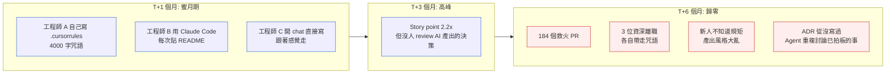
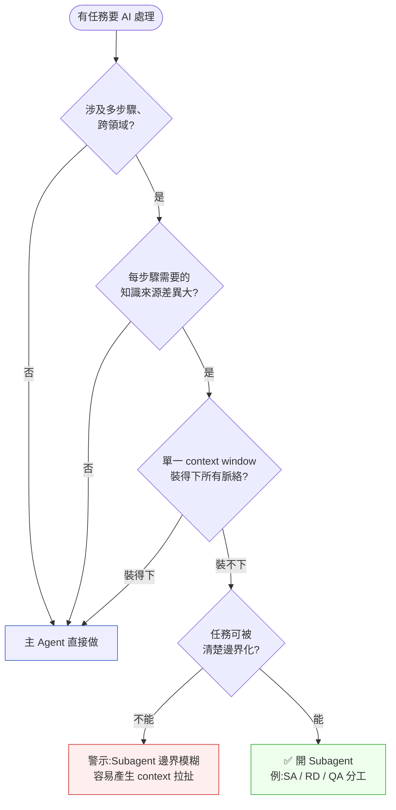
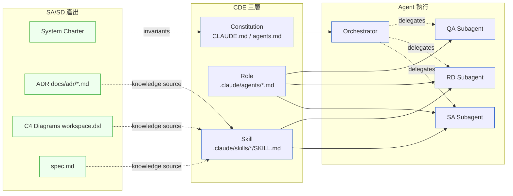

# 第 38 章|Context-Driven Engineering(CDE)
## ⸺ 從 Vibe Coding 到可被傳遞的脈絡

> **前置閱讀**:[Ch 1 為什麼 SA/SD](../part-01-foundations/ch-01-why-sa-sd.md)、[Ch 33 ADR 與架構知識管理](../part-06-engineering/ch-33-adr-architecture-knowledge.md)
> **下游章節**:[Ch 38 Skill 工程與 Subagent 設計](./ch-39-rag-memory-tool.md)、[Ch 39 AI 時代的 SA 角色重構](./ch-40-multi-agent.md)、[Ch 43 工程治理與責任邊界](./ch-44-coding-agent.md)
> **延伸補章**:無

---

## 38.1 冷觀察 ⸺ 三個月生產力 2x,然後歸零

我在 2026 年 3 月,看過一個虛構電商平台 **AisleNova**(`CASE-ECM-008`)的內部覆盤紀錄。AisleNova 做台灣與越南的中型 D2C 平台,28 名工程師,2025 年 11 月全員導入 Cursor + Claude Code,前三個月 Jira 上的 story point 完成數從每雙週 220 飆到 480。CTO 在公司全員會議上放了那張曲線圖,標題寫:

> 「Cursor + Claude Code,讓我們在三個月內生產力提升 2.2x。」

第四個月開始,曲線水平。第五個月開始下滑。第六個月,story point 完成數回到 235。CTO 從股東會的 Q&A 出來,把工程主管叫進會議室,把同一張曲線圖拿出來再看一次,中間有一句話被傳到工程內部:

> 「這條線怎麼跟我去年看過的那條一模一樣?」

那天工程主管做了一件事:把過去六個月所有「Claude 寫壞掉、後來人工救回」的 PR 拉出來看 ⸺ 共 184 個。他發現一個共同的痛點 ⸺ 每個資深工程師用 Cursor 都有一套自己的「咒語」:有人在 system prompt 裡塞 4,000 字的「我們公司的 coding style」,有人開新對話前一定先丟 README + ARCHITECTURE.md + 三個關鍵檔案,有人甚至寫了一份 `.cursorrules` 但只放在自己的 dotfiles repo 裡。

換句話說,**AisleNova 並沒有「導入 AI 工具」這件事,他們有的是「28 個各自摸索的 vibe coder」**。每個 prompt 都從零開始,每個對話結束 context 就消失,每個離職的工程師帶走一份只有他自己知道的 rules 檔。

這裡值得停一下釐清:文件不齊、離職帶走知識,傳統工程團隊也會碰到。**AisleNova 的問題有一個傳統 codebase 沒有的特殊性**:AI 工具讓一個人可以在「完全孤立」的狀態下持續高速出貨很長一段時間。傳統 codebase 裡,若你不在 commit 裡交代決策脈絡,你很快就會撞牆 ⸺ build 壞掉、integration test 紅燈、review 被退、別人的 merge 把你的假設蓋掉。這些阻力會在幾天內強迫知識共享。但 Cursor + Claude Code 讓工程師 A 可以帶著 4,000 字私人 `.cursorrules` 在自己的分支上獨立高速工作三個月,story point 飆到 2x,**看起來完全沒有問題 ⸺ 直到他離職的那天**。AI 工具消除了孤立工作的短期摩擦,卻把知識斷層的代價推後到「人離開」的那一刻才爆發。這才是 CDE 要解決的組織行為問題:AI 工具讓「不共享脈絡」變成一種可以持續很久的選擇,而不再是一個會快速暴露的錯誤。



那場覆盤會議的最後一張投影片,寫著一行字:

> 「我們以為導入了 AI,實際上我們是把 28 份私人 prompt 偽裝成『工程實踐』。」

刺耳的不是「沒有實踐」,是 ⸺ 工程團隊一直以為自己有。`.cursorrules`、CLAUDE.md、Slack pin 訊息、會議白板拍照、各自的 chat history,**他們以為這些加總起來等於「AI 協作流程」**。但第六個月證明了:**沒有契約結構的脈絡,等於沒有脈絡**。

Ch 1 講的是「決策失憶」會把 PayLoop 在 180 天炸掉;這一章要講的是它的 2026 升級版:**脈絡失憶會把整支工程團隊在第六個月炸掉**。

---

## 38.2 真問題 ⸺ Vibe Coding 的甜蜜陷阱與 CDE 的三層必要性

Andrej Karpathy 在 2025 年初提出 *Software 3.0* 概念 [^CIT-340],把寫程式分成三個世代:Software 1.0 是人類寫程式碼、Software 2.0 是訓練模型權重、Software 3.0 是用自然語言指揮 LLM 完成任務。他在同一場演講順手丟出 *vibe coding* 這個詞,描述「跟著感覺走、看 AI 寫得對不對再修」的開發節奏。這個詞被誤讀成「AI 時代的新工法」,但 Karpathy 自己後來補充:vibe coding 適合**週末玩具專案**,不適合需要交接、需要合規、需要長期維護的系統。

把 AisleNova 那場覆盤的真問題拆開來看,它不是「Cursor 不好用」也不是「Claude 寫得不好」,而是 ⸺ **vibe coding 本質上是一種無法被組織複製的個人能力**。資深工程師的咒語有效,因為它隱性地壓縮了多年的設計判斷;新人或不同領域的工程師拿同一份咒語不會得到同樣的結果,因為他們沒有對應的判斷語境。

換句話說,vibe coding 的天花板是「個人最強工程師的水準」;CDE 的天花板是「組織最強知識的水準」。兩者差一個量級。

### 38.2.1 為什麼小專案撞不到牆,大專案會

| 維度 | Vibe Coding 在小專案 | Vibe Coding 在大專案 |
|---|---|---|
| **脈絡量** | 200 行程式碼,一個 chat window 裝得下 | 80 萬行 + 20 個微服務,任何 chat 都裝不下 |
| **決策密度** | 一週 5 個小決定 | 一週 50 個跨團隊決定 |
| **接手成本** | 寫的人就是改的人 | 寫的人 6 個月後可能離職 |
| **錯誤代價** | 跑不起來重寫 | 半夜 P1、合規罰款、客訴爆量 |
| **AI 角色** | 副駕駛 | 同事(且是流動率最高那種) |
| **失敗症狀** | 「最後一個功能 AI 寫不出來」 | 「整個團隊在重複討論已經拍板的事」 |

AisleNova 撞牆的位置是右欄。他們的程式碼超過 60 萬行、12 個服務、4 個團隊;Cursor 的 context window 即使 1M token 也只能裝 5–8% 的 codebase,而那 5–8% 該裝什麼,**沒有契約規範就只能靠工程師當下的記憶**。資深工程師記憶好,新人記憶差,離職的人記憶帶走。生產力曲線回到原點,是這個結構的必然結果。

### 38.2.2 CDE 的核心定義:三件事的轉換

Context-Driven Engineering 不是 Anthropic 發明的口號。它是 2025 下半年起 Eventuallymaking、Latent Space、ManoMano、Brevo 等多家工程部落格陸續歸納出的工程實踐通稱 [^CIT-348]。它的核心主張可以用一句話說完:

> **CDE 不是「給 AI 寫 prompt 的新名字」,而是「把 SA/SD 產出物變成 AI 可讀脈絡」的工程實踐。**

把這句話拆開來看,它在處理三件事:

1. **把個人咒語變成組織契約** ⸺ `.cursorrules` 不再是個人 dotfile,而是 repo 內的 `CLAUDE.md` / `agents.md`,跟程式碼同 PR review。
2. **把對話脈絡變成持久知識** ⸺ ADR(Ch 33)、System Charter(Ch 1)、C4 圖(Ch 20)不只給人看,還是 Skill 的 Knowledge Source。
3. **把臨時 prompt 變成可調用能力** ⸺ Skill 是一個三要素契約:Description(何時用)+ Allowed Tools(能做什麼)+ Knowledge Sources(讀什麼脈絡)。

換句話說,CDE 真正在處理的是「**讓 AI 從會話結束就消失的副駕駛,變成 repo 內可被傳遞的同事**」。這條路徑跟 SA/SD 三十年的演化邏輯一致:從個人經驗,走向可被傳遞的理解。差別只在 2026 的傳遞對象多了一類非人類讀者。

### 38.2.3 為什麼必須是「三層」而不是「一層」

現場最常見的失敗,是把所有 AI 協作規範塞進同一個 CLAUDE.md ⸺ 結果是一份 6,000 字、什麼都寫又什麼都不夠細的長文件。Anthropic 在 2025 年 10 月公開的 Claude Code Skills 系統 [^CIT-341] 跟 OpenAI / Cursor 採納的 agents.md 開放規範 [^CIT-342] 都不約而同走向**三層分工**:

- **Constitution 層**(法律):整個 repo / 整個組織的不可動原則(寫在 `CLAUDE.md` / `agents.md`)
- **Role 層**(角色):某類任務的角色設定與職責邊界(Orchestrator / PM / SA / RD / DBA / QA / UI-UX)
- **Skill 層**(工具):某項具體能力,Description + Allowed Tools + Knowledge Sources 的契約

這三層之所以不能合併,是因為它們對應的**變動頻率不同**:Constitution 一年改一兩次(改了等於修憲)、Role 每季 review 一次、Skill 隨業務迭代每週都可能新增。把它們放在同一份檔案,結果就是「修一條規則要動到所有人的工作流」。

---

## 38.3 決策框架 ⸺ Constitution / Role / Skill 三層分工

下面這幾張表跟兩張 Mermaid,在現場相當好用。它們的共同前提是:**CDE 不是把 prompt 寫得更長,是把 prompt 拆得更結構化**。

### 38.3.1 三層分工表

| 層級 | 對應檔案 | 變動頻率 | 寫給誰看 | 內容範例 |
|---|---|---|---|---|
| **Constitution**(法律) | `/CLAUDE.md`、`/agents.md` | 季 / 年 | 所有 Agent + 所有人類 | 「所有金流相關變更必須走 ADR」「禁止在 production 直接 SQL」「PII 必須 at-rest 加密」 |
| **Role**(角色) | `.claude/agents/{role}.md` | 季 | 該角色的 Subagent | 「你是 SA Agent,任務是把模糊需求轉成 spec.md + ADR」「你是 QA Agent,只能讀不能寫 production 程式碼」 |
| **Skill**(技能) | `.claude/skills/{skill}/SKILL.md` | 週 / 雙週 | 載入此 Skill 的 Agent | 「電商訂單狀態機重構」「Stripe webhook 簽章驗證」「PostgreSQL 遷移腳本生成」 |

AisleNova 後來重整時,把原本那份 6,000 字的 `.cursorrules` 拆成:`CLAUDE.md`(420 字)+ 7 份 Role 檔(每份約 800 字)+ 32 份 Skill(每份 200–600 字)。**總字數變多,但每份的責任邊界變清楚**,新人 onboarding 時間從 12 週縮到 5 週。

### 38.3.2 Skill 三要素契約

Skill 是 CDE 三層裡最容易寫壞的一層。Anthropic 的 Skill spec [^CIT-341] 把 Skill 定義為三要素契約,缺一不可:

| 要素 | 一句話定義 | 寫得好的範例 | 寫得壞的常見錯 |
|---|---|---|---|
| **Description** | Agent 何時應該載入此 Skill 的判準 | 「當任務涉及 Stripe webhook 處理、簽章驗證、idempotency key 管理時載入。電商訂單退款流程必載。」 | 「處理 Stripe 相關事務」(太模糊,Agent 無法判斷何時載入) |
| **Allowed Tools** | 此 Skill 能調用的工具白名單 | `Read, Edit, Bash(git, pnpm, stripe-cli), WebFetch(stripe.com docs only)` | 不寫 / 寫 `*`(Agent 拿到無限權限) |
| **Knowledge Sources** | 此 Skill 應載入的脈絡來源 | `docs/adr/0017-stripe-webhook.md, docs/adr/0024-idempotency.md, src/payments/webhook.ts, https://stripe.com/docs/webhooks/signatures` | 沒列 / 把整個 repo 列進去(等於沒列) |

**Skill 寫成「prompt 集合」是最常見的失敗**。一份 Skill 如果只是 800 字的「請你做以下事情:1. … 2. … 3. …」,那它本質上還是 vibe coding,只是換了存放位置。正確的 Skill 是「能力 + 工具 + 知識來源」的三要素契約 ⸺ Agent 載入後得到的是**何時觸發**(Description)、**能動什麼**(Allowed Tools)、**該讀什麼脈絡**(Knowledge Sources),而不是「請按以下步驟做」。

### 38.3.3 Subagent 適用場景判準

Subagent 是 Claude Code 在 2025 年下半年推出的協作模式 [^CIT-343]:主 Agent 把特定任務委派給專責的子 Agent,子 Agent 有自己的 context window、自己的 Allowed Tools、自己的 system prompt。這個機制聽起來很美,但**不是所有任務都該開 Subagent**。



**這張圖的關鍵在最後一個分支**。AisleNova 一開始把所有任務都開 Subagent,結果 Orchestrator 跟 SA Subagent 在同一個任務上互相覆寫對方的決定,最後產出的 spec.md 是兩個 Agent 妥協後的「平均值」⸺ 哪一邊的 context 都沒有完整保留。

可以抄走的判準:**Subagent 適合「邊界清楚 + 知識來源差異大」的任務**(例如:SA 寫 spec、RD 寫程式、QA 寫測試)。不適合「需要持續對話協商」的任務(例如:跟 PM 釐清需求、跟客戶 demo)⸺ 那種任務開 Subagent 會讓 context 在主 Agent 與 Subagent 之間反覆來回,反而變慢。

### 38.3.4 ADR ↔ Skill 連動機制

Ch 33 提過,ADR 在 2026 年的雙重角色:對人是「決定的化石」,對 Agent 是 Skill 的 Knowledge Source。把這個連動畫成圖會比較清楚:



這張圖的關鍵在左半邊到中間的虛線:**SA/SD 的 artifact 不是「另外給 AI 看的副本」,而是直接被 Skill 引用**。AisleNova 後來定的紀律是:每份 `Status: Accepted` 的 ADR 在 frontmatter 加 `cde-skill-binding: skill-name`,該 Skill 的 Knowledge Sources 必須明確列出此 ADR 的路徑。當 ADR Status 改為 `Superseded`,CI 腳本自動掃所有 frontmatter 裡引用此 ADR 的 Skill,開 issue 提示人工 review。

**這個機制有兩個必須明說的限制。**

第一,**binding 是人宣告的,不是自動推斷的**。一份 Skill 可能對應 10 份 ADR,其中有些是強依賴(例如:Skill 的核心邏輯建立在 ADR-0024 的狀態機定義上),有些是弱依賴(例如:Skill 只引用 ADR-0031 的某一條格式規範)。如果 SA 在宣告 binding 時沒有說清楚依賴範圍,一份 ADR 被 Supersede 後,所有引用它的 Skill 都會被 flag ⸺ 包括那些其實完全不受影響的弱依賴 Skill。**建議在 `cde-skill-binding` 旁邊補一句 `binding-scope` 說明**:「僅引用 §3 狀態轉移表的部分」或「引用 §2 idempotency key 格式規則,不含 §4 失敗策略」,讓 reviewer 能判斷這份 Skill 是否真的需要隨 ADR 更新。

第二,**自動化 issue 的價值取決於 review 機制有沒有跟上**。如果 CI 一旦有 ADR 被 Supersede 就開 issue、但工程師養成「自動 issue 習慣關掉」的行為,那這個機制把風險從「人忘記更新」換成「人忽略自動化警示」,本質上沒有改善。AisleNova 的做法是:自動 issue 的 body 必須包含具體的 binding-scope 文字,讓 reviewer 能在五秒內判斷這份 Skill 是否需要動;**自動化的目標是降低 review 的認知成本,不是讓人停止判斷**。

### 38.3.5 三層的決策樹:這次該寫在哪一層?

| 問題類型 | 該寫在 |
|---|---|
| 「整個組織不可動的紅線」 | Constitution |
| 「某個角色的職責邊界」 | Role |
| 「某項可被反覆觸發的能力」 | Skill |
| 「這個專案的某個小決策」 | **ADR**(不是 CDE 三層,是 SA/SD 產出) |
| 「臨時的一次性 prompt」 | **不要寫進 CDE**,留在當次對話即可 |

這張表的關鍵是最後一行:**並不是所有 prompt 都該被 CDE 化**。臨時的、一次性的、探索性的 prompt 留在對話裡就好;只有「會被反覆觸發」「需要跨人傳遞」「需要跨對話保留」的脈絡,才值得寫進 CDE 三層。把所有 prompt 都寫進 Skill,結果跟 Ch 33 的「ADR 過度生產」是一樣的:倉庫滿了,但沒人讀。

---

## 38.4 踩坑清單

下面這四個反模式,在 ecommerce、saas、fintech 各種領域都常見。它們的共同點是「**有導入 CDE 形式,但脈絡沒有真的被傳遞**」。

### 反模式 1:Skill 寫成 Prompt 集合

某虛構 SaaS 團隊在 `.claude/skills/order-refund/SKILL.md` 裡寫了 1,200 字的「請依以下步驟處理退款:1. 查詢訂單 2. 確認金額 3. 呼叫 Stripe …」。Description 欄位寫「處理退款相關任務」、Allowed Tools 沒寫、Knowledge Sources 沒寫。半年後新人接手退款邏輯,發現 Skill 裡寫的步驟跟 Stripe API 改版後不符 ⸺ 但沒人知道該不該改 Skill,因為 Skill 沒連到任何 ADR、沒連到任何程式碼。

> ✅ **修正方向**:Skill 三要素是契約,不是建議。Description 必須是「Agent 何時載入」的判準(寫成可被 LLM 推論的觸發條件,不是任務描述);Allowed Tools 必須白名單(寫死哪些工具可用);Knowledge Sources 必須指向真實檔案路徑(ADR / 程式碼 / 外部文檔 URL)。把「步驟」從 Skill 移到對應的 ADR 或 RFC,讓 Skill 只負責「告訴 Agent 該讀哪份脈絡」,而不是「替 Agent 做決定」。

### 反模式 2:CLAUDE.md 寫成 6000 字長文

某虛構電商在 repo 根目錄放了一份 6,200 字的 `CLAUDE.md`,內容包含 coding style、commit convention、業務術語表、公司歷史、技術選型理由、安全規範、測試策略、上線流程 ⸺ 試圖一份檔案解決所有問題。結果 Agent 載入時這份檔案佔掉 8K token,實際任務只剩有限 context window;而工程師要更新「commit convention」這一條,還要打開整份檔案、捲到第 1,800 行才找得到。

> ✅ **修正方向**:Constitution 應該短、應該是「不可動的紅線」。建議 ≤ 800 字,內容只放真正會被 review 阻擋的硬規(例:「金流變更必走 ADR」「禁止 production SQL」)。其他內容下放到 Role(角色職責)、Skill(具體能力)、`docs/`(業務術語、技術背景)。一個堪用的檢查標準是:**CLAUDE.md 的每一條規則,違反時都該觸發 PR reject**;不到那個強度的內容,不該寫在這裡。

### 反模式 3:Subagent 邊界模糊,context 互相拉扯

AisleNova 早期的失敗。他們開了 Orchestrator / PM / SA / RD / QA 五個 Subagent,但每個 Subagent 的 system prompt 都寫「你應該確保整體交付品質」⸺ 結果同一個任務五個 Subagent 都認為自己有最終決定權。SA 寫的 spec 被 RD Subagent 在實作時改寫、QA Subagent review 時又把 spec 改回來、Orchestrator 在最後彙整時又用了第三個版本。產出物是「平均值」,沒有一份 context 完整保留。

> ✅ **修正方向**:Subagent 的 Role 檔必須明確寫**邊界**而不是**目標**。SA Subagent 的職責是「產出 spec.md 與 ADR draft,**不寫程式碼**」;RD Subagent 的職責是「依 spec 實作,**不修改 spec**;若 spec 有問題,在 PR 留 comment 退回 SA」;QA Subagent 的職責是「依 spec 寫測試與驗證,**只能讀不能改 production 程式碼**」。邊界寫死之後,context 就不會互相覆寫,每個 Subagent 對自己負責的那段脈絡才能保留完整。

### 反模式 4:Skill 與 ADR 不連動

某虛構 fintech 寫了一份 Skill `payment-retry-policy/SKILL.md`,描述當 Stripe 失敗時的重試邏輯。半年後 ADR-0042 拍板「改為走 Stripe 的 idempotent retry,不再自實作」⸺ 但 Skill 沒更新。工程師用 Cursor 寫新功能時,Agent 載入 Skill 後仍然按舊邏輯產出自實作的重試,PR 被 reviewer 退回三次後才有人發現 Skill 跟 ADR 脫節。

> ✅ **修正方向**:Skill 與 ADR 走雙向連結。Skill 的 Knowledge Sources 必須列出對應 ADR 路徑;ADR 的 frontmatter 加 `cde-skill-binding`(Ch 33 §33.5 模板已預留 `ai-skill-hint` 欄位)。在 CI 加一條 fitness function:當 ADR Status 改為 `Superseded`,自動掃所有引用此 ADR 的 Skill 並開 issue 提示 review。讓「決策化石」與「能力契約」之間有自動化的看守者,避免靠人的記憶維護一致性。

---

## 38.5 交付清單 ⸺ CDE Setup Card + 完整 SKILL.md 範例

每個專案要導入 CDE 時,**第一份要產出的不是 CLAUDE.md,是 CDE Setup Card**。它是一頁 Markdown,寫不滿一頁就是寫得不對,寫超過一頁也是寫得不對。

把它存在 `docs/cde-setup.md`,跟程式碼同 repo,跟 System Charter(Ch 1)同層。

````markdown
# CDE Setup Card — {專案名稱}

> 版本:v0.1 | 撰寫日期:YYYY-MM-DD | 擁有人:{名字}
> 對齊複雜度:S | M | L(Ch 1 §1.3 Triage)

## 1. Constitution(在哪裡)
- `CLAUDE.md`(主要,Claude Code 與 Cursor 共用)
- `agents.md`(可選,符合 OpenAI / Cursor 開放規範時加)
- 預期長度:≤ 800 字
- 預期更新頻率:季 / 年

## 2. Roles(我們有哪些 Agent 角色)
| 角色 | 檔案 | 主要職責邊界 | 不能做什麼 |
|---|---|---|---|
| Orchestrator | `.claude/agents/orchestrator.md` | 任務拆解與 Subagent 派發 | 不直接寫程式 |
| PM | `.claude/agents/pm.md` | 需求釐清、PRD 草稿 | 不做技術選型 |
| SA | `.claude/agents/sa.md` | spec.md、ADR draft、C4 圖 | 不寫實作程式碼 |
| RD | `.claude/agents/rd.md` | 依 spec 實作 | 不修改 spec |
| DBA | `.claude/agents/dba.md` | schema、遷移腳本 | 不直接動 production |
| QA | `.claude/agents/qa.md` | 測試、驗證 | 只讀 production code |
| UI-UX | `.claude/agents/ui-ux.md` | 前端、視覺、互動 | 不動後端 API |

## 3. Skills(我們有哪些可調用能力)
- 路徑:`.claude/skills/{skill-name}/SKILL.md`
- 命名規則:`{domain}-{capability}`(例 `ecommerce-order-state-machine`)
- 每份必填三要素:Description / Allowed Tools / Knowledge Sources
- Skill Index:`.claude/skills/README.md`(對齊 Ch 33 ADR Index 形式)

## 4. ADR ↔ Skill Binding
- 每份 ADR 在 frontmatter 加 `cde-skill-binding: {skill-name}`(可選)
- 每份 Skill 的 Knowledge Sources 必須列出對應 ADR 路徑
- CI 看守:`scripts/fitness/cde-skill-adr-consistency.sh`

## 5. Subagent 適用清單
- 適用:SA / RD / QA / DBA(邊界清楚、知識來源差異大)
- 不適用:跟 PM 釐清需求、跟客戶 demo(需持續對話協商)

## 6. Out of Scope(我們明確不做的事)
- 不把臨時 prompt 寫進 Skill
- 不把 PRD 寫進 CLAUDE.md
- 不在 Constitution 裡放 coding style(改放 Role 或 `docs/style/`)
````

**為什麼是一頁?** 跟 System Charter 同樣的理由:一頁的篇幅會自然逼出選擇。CDE 的價值在「結構清楚」,不在「內容豐富」⸺ 結構不清楚的時候,內容越豐富越容易出事。

### 38.5.1 完整 SKILL.md 範例(電商訂單狀態機)

下面這份是 AisleNova 重整後的核心 Skill 之一,可直接抄走改寫。它對應 `CASE-ECM-008` 的訂單退款場景,Knowledge Sources 引用了三份 ADR、兩個程式碼路徑、一份外部文檔。

````markdown
---
skill: ecommerce-order-state-transition
version: 1.4.0
last-reviewed: 2026-04-15
owner: "@payments-team"
linked-adrs:
  - docs/adr/0024-order-state-machine.md
  - docs/adr/0031-stripe-idempotency.md
  - docs/adr/0042-refund-policy.md
---

# Skill: Ecommerce Order State Transition

## Description

當任務涉及以下任一情境時載入本 Skill:

- 訂單狀態轉移(`pending` → `paid` → `shipped` → `delivered` / `refunded`)
- 訂單退款(全額退款、部分退款、爭議退款 chargeback)
- Stripe webhook 處理(`payment_intent.succeeded`、`charge.refunded`、`charge.dispute.created`)
- 訂單事件補償(missing event replay、out-of-order event handling)

不要在以下情境載入本 Skill:

- 純前端訂單顯示邏輯(無狀態變更)
- 訂單列表查詢、報表、analytics
- 庫存管理(走 `ecommerce-inventory-allocation` Skill)

## Allowed Tools

- `Read`(讀任何檔案)
- `Edit`(只能修改 `src/payments/**`、`src/orders/**`、`tests/payments/**`、`tests/orders/**`)
- `Bash` 限定子命令:
  - `git`(status / diff / log / add / commit;**禁止** push / force / reset --hard)
  - `pnpm`(install / test / lint / build)
  - `stripe`(stripe-cli,僅 listen / trigger / events,**禁止** 直接 charge)
- `WebFetch`:白名單
  - `https://stripe.com/docs/**`
  - `https://docs.stripe.com/**`

## Knowledge Sources

### 必讀(載入 Skill 時自動進 context)
- `docs/adr/0024-order-state-machine.md` — 訂單狀態機正典定義(11 個狀態 / 18 條合法轉移)
- `docs/adr/0031-stripe-idempotency.md` — Idempotency Key 規範(prefix 規則、TTL、衝突處理)
- `docs/adr/0042-refund-policy.md` — 退款政策(72 小時內全額自動、之後人工審核)
- `src/payments/state-machine.ts` — 狀態機實作 source of truth
- `src/orders/types.ts` — Order / Payment / Refund 型別定義

### 按需載入(Agent 判斷必要時讀)
- `src/payments/webhook.ts` — Stripe webhook handler
- `src/payments/__tests__/state-machine.test.ts` — 狀態機既有測試
- `https://stripe.com/docs/webhooks/signatures` — Stripe 簽章驗證最新文檔
- `https://stripe.com/docs/refunds` — Stripe 退款 API 最新文檔

## Operating Constraints

以下為跨任務常駐約束(對應 ADR-0024 / 0031 / 0042 的核心 invariant):

1. **狀態轉移合法性**:任何新增 / 修改狀態轉移,必須先檢查 ADR-0024 §3 的 18 條合法轉移表;不在表內的轉移需先寫 ADR Supersede ADR-0024,**不可直接改 code**。
2. **Idempotency 強制**:任何呼叫 Stripe 的寫入操作必須附 `Idempotency-Key`,key 格式遵守 ADR-0031 §2(`{order_id}:{operation}:{attempt_seq}`)。
3. **退款金額上限**:單次退款金額不可超過原訂單金額;部分退款累計不可超過原訂單金額(由 `src/payments/state-machine.ts` 的 `validateRefundAmount` 強制)。
4. **Webhook 簽章**:所有 webhook handler 必須先驗證 `Stripe-Signature`,驗證失敗一律 return 400 並記錄 audit log。

## Hand-off Contract

完成任務後產出物必須包含:

- 修改 / 新增的程式碼(範圍限於 Allowed Tools §Edit 白名單)
- 新增 / 修改的測試(`tests/payments/**` 或 `tests/orders/**`)
- 若觸及 ADR-0024 / 0031 / 0042 的 invariant,**先停下來開 PR 草稿,標題加 `[ADR-IMPACT]`**,等 SA Subagent review 後再續寫
- PR description 必須對應到本 Skill 哪一條 Knowledge Source(讓 reviewer 能追溯脈絡)

## Versioning

本 Skill 變更走 PR review,reviewer 至少包含 `@payments-team` 一位 + `@architecture-team` 一位。
重大變更(Allowed Tools 擴張、Knowledge Sources 新增 ADR)需在 commit message 標 `BREAKING:` 並更新 `version`。
````

**為什麼這份 Skill 不寫「步驟」?** 因為步驟屬於「這次怎麼做」,本質上是任務的可變部分;Skill 應該只寫「不可動的契約」。把步驟留給 Agent 在當次任務動態推論,Skill 提供的是「推論時的護欄」,不是「推論的腳本」。這份 Skill 寫於 2026 Q1,半年後 Stripe API 改版時,需要更新的是 Knowledge Sources(指向新文檔)而不是步驟段落 ⸺ 維護成本因此低很多。

**為什麼有 Hand-off Contract?** 這是 Skill 跟 Subagent 整合的關鍵。沒有 hand-off contract 的 Skill,Subagent 完成任務後產出物五花八門,Orchestrator 沒辦法可靠地把產物交給下一棒。把交付物寫成契約,等於替整條 Subagent pipeline 加了型別系統。

### 38.5.3 範例:AisleNova 第六個月覆盤後寫的 CDE Setup Card

184 個救火 PR、3 位資深離職那場會議結束後,AisleNova(`CASE-ECM-008`)做的第一件事不是改 prompt、不是換工具,是**停掉所有 AI 協作 PR 兩週**,把這頁先寫出來。下面就是他們第二週末那份 v0.1:

````markdown
# CDE Setup Card — AisleNova D2C 平台

> 版本:v0.1 | 撰寫日期:2026-04-08 | 擁有人:Howard(VP Engineering)
> 對齊複雜度:M  ←(Ch 1 §1.3 Triage:28 人、單一電商主系統、跨台越雙市場)

## 1. Constitution(在哪裡)
<!-- 為什麼這欄:之前 28 人有 28 份「咒語」,離職就帶走;
     先講清楚 single source of truth 在哪,後面才有得收斂。 -->
- `CLAUDE.md`(主要,Cursor 與 Claude Code 共用,放 repo root)
- `agents.md`(暫不啟用,等 OpenAI Codex 規範穩定再評估)
- 預期長度:≤ 800 字(目前 v0.1 為 720 字)
- 預期更新頻率:季 review;新 Subagent 上線時必更新

## 2. Roles(我們有哪些 Agent 角色)
<!-- 為什麼這欄:184 個救火 PR 中 71 個來自「Claude 同時寫 spec 又寫實作」;
     角色分開後,每個 Agent 的邊界與不能做什麼,寫進來才擋得住。 -->
| 角色 | 檔案 | 主要職責邊界 | 不能做什麼 |
|---|---|---|---|
| Orchestrator | `.claude/agents/orchestrator.md` | 任務拆解、Subagent 派發 | 不直接寫程式 |
| SA | `.claude/agents/sa.md` | spec.md、ADR draft | 不寫實作 |
| RD | `.claude/agents/rd.md` | 依 spec 實作 | 不修改 spec / ADR |
| QA | `.claude/agents/qa.md` | Playwright + pytest 測試 | 只讀 production code |
| DBA | `.claude/agents/dba.md` | schema、Flyway 遷移腳本 | 不直接動 production |

## 3. Skills(我們有哪些可調用能力)
- 路徑:`.claude/skills/{skill-name}/SKILL.md`
- 命名規則:`{domain}-{capability}`(例 `ecommerce-order-state-machine`)
- 每份必填:Description / Allowed Tools / Knowledge Sources
- Skill Index:`.claude/skills/README.md`(2026-04 啟用,首批 7 份)

## 4. ADR ↔ Skill Binding
<!-- 為什麼這欄:184 PR 裡 43 個是「Agent 重新提案三個月前已拍板的決策」;
     沒 binding 等於沒記憶,每次都重新爭論。 -->
- 每份 ADR frontmatter 加 `cde-skill-binding: {skill-name}`
- 每份 Skill 的 Knowledge Sources 必列出對應 ADR 路徑
- CI 看守:`scripts/fitness/cde-skill-adr-consistency.sh`(每日 cron)
- 補寫期:過去 14 個月決策回填 ADR,目標 90 天內補完 ≥ 30 份

## 5. Subagent 適用清單
- 適用:SA(寫 spec)、RD(實作 well-defined ticket)、QA(寫測試)、DBA(寫 migration)
- 不適用:跟 PM 釐清需求、跟客戶 demo、incident 第一時間決策

## 6. Out of Scope(我們明確不做的事)
<!-- 為什麼這欄:上一輪失敗就是各自把 prompt 塞進各自的地方;
     寫下「明確不做什麼」,新人才不會以為「沒寫=可以做」。 -->
- **不**把臨時 prompt 寫進 Skill(臨時 prompt 留在 PR description)
- **不**把 PRD 寫進 CLAUDE.md(PRD 屬於 PM,放 `docs/prd/`)
- **不**在 Constitution 放 coding style(放 `docs/style/` + linter)
- **不**接受未綁 ADR 的 Skill 進 main(CI gate)
````

那兩週沒寫程式,第三週開始恢復 AI 協作 PR。第八週的內部追蹤:救火 PR 比例從 14% 降到 3.7%;新人到第一個 PR 通過 review 的時間從 9 天縮到 2.5 天。**這頁不是「導入 AI」的文件,是把「28 份私人 prompt」收斂成「一份工程契約」的那條紅線。**

---

## 38.6 本章交付清單 Recap

讀完本章,你應該已經能做到:

- [ ] 講清楚 Vibe Coding 與 CDE 的差別:**Vibe Coding 的天花板是個人最強工程師,CDE 的天花板是組織最強知識**;並能說明為什麼小專案撞不到牆、大專案會。
- [ ] 區分 CDE 三層的責任邊界(Constitution / Role / Skill),為手上的專案決定每層各放什麼,不再把所有規範塞進同一份 `.cursorrules` 或 CLAUDE.md。
- [ ] 在 review 一份 Skill 時認得出它是「prompt 集合」還是「能力 + 工具 + 知識來源契約」,並有四個反模式的修正方向可以接著說。
- [ ] 為手上的專案寫好一份 `docs/cde-setup.md`(CDE Setup Card)+ 至少一份完整的 `SKILL.md`,並把對應 ADR 的 `cde-skill-binding` 雙向連結補上。

如果四項中先挑一項做完就好,建議是最後那一項 ⸺ 找出專案中最常被反覆觸發的那項能力(電商通常是訂單狀態變更、fintech 通常是金流結算、SaaS 通常是計費邏輯),把它寫成第一份 SKILL.md。Ch 33 的 ADR 是「為什麼是這個形狀」,本章的 Skill 是「Agent 在這個形狀裡能做什麼」。下一章 Ch 38 會把 Skill 工程與 Subagent 設計拆得更細,本章先把那一份基礎契約交到你手上。

---

## Cross-References

- **回顧**:[Ch 1 §1.2 SA/SD 是製造可被傳遞的理解](../part-01-foundations/ch-01-why-sa-sd.md) ⸺ CDE 是這句話在 AI 時代的具體實踐形式
- **回顧**:[Ch 33 ADR 與架構知識管理](../part-06-engineering/ch-33-adr-architecture-knowledge.md) ⸺ ADR 是 CDE Skill 的 Knowledge Source 骨幹
- **下一章**:[Ch 38 Skill 工程與 Subagent 設計](./ch-39-rag-memory-tool.md) ⸺ 把本章的契約展開到實作層級
- **延伸**:[Ch 39 AI 時代的 SA 角色重構](./ch-40-multi-agent.md) ⸺ SA 在 CDE 流程裡的職責變化
- **延伸**:[Ch 43 工程治理與責任邊界](./ch-44-coding-agent.md) ⸺ Subagent 出錯時誰負責

## 引用

[^CIT-340]: Andrej Karpathy, "Software 3.0" — YC AI Startup School Keynote (2025) 與後續 X 系列貼文。提出 vibe coding 一詞並補充其適用邊界。
[^CIT-341]: Anthropic, "Claude Code Skills" 官方文檔(2025–2026)— docs.anthropic.com/claude-code/skills。Skill 三要素規範(Description / Allowed Tools / Knowledge Sources)出處。
[^CIT-342]: agents.md 開放規範(2025)— agents.md / github.com/openai/agents-md。OpenAI / Cursor / Continue 等共同採納的 Agent 配置開放格式。
[^CIT-343]: Anthropic, "Subagents in Claude Code" 文檔(2025–2026)— docs.anthropic.com/claude-code/subagents。Subagent 機制、context window 隔離、Allowed Tools 規範。
[^CIT-344]: Cursor Documentation, "Rules for AI" / `.cursorrules`(2024–2026)— docs.cursor.com/context/rules-for-ai。Cursor 的 repo 級 prompt 規範機制。
[^CIT-345]: GitHub Copilot, "Custom Instructions" 與 `copilot-instructions.md`(2024–2026)— docs.github.com/copilot。
[^CIT-346]: Latent Space, "The Rise of Context Engineering" 系列(2025)— latent.space。CDE 在工程社群早期的論述基礎之一。
[^CIT-347]: ManoMano Tech Blog 與 Brevo Engineering Blog 系列(2026)— Skill 與 ADR 連動的早期工程實踐紀錄。
[^CIT-348]: Eventuallymaking, "Context-Driven Engineering: A 2026 Practitioner's Guide" (2026) — eventuallymaking.com。CDE 一詞的工程社群通行定義來源之一。
[^CIT-349]: Drew Breunig, "How Long Contexts Fail" / "How to Fix Your Context"(2025)— drewbreunig.com。長 context 衰減的觀察基礎,為 CDE 三層分工的精度動機。
