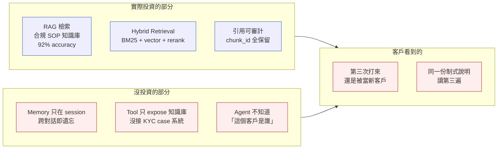
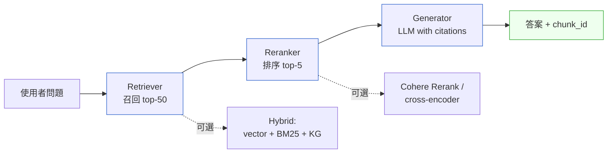
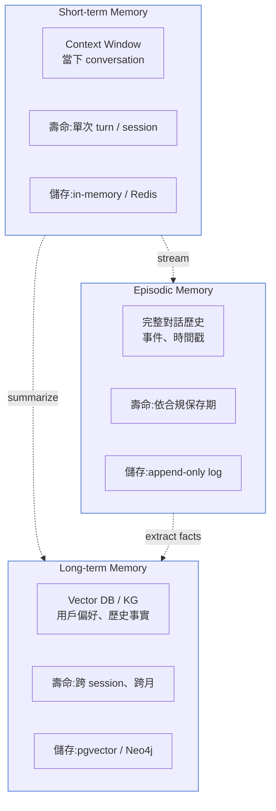

# 第 39 章|RAG、Memory 與 Tool 設計
## ⸺ Agent 系統的三組記憶與三種能力

> **前置閱讀**:[Ch 14 API 設計](../part-03-design/ch-14-api-design.md)、[Ch 15 資料儲存設計](../part-03-design/ch-15-data-storage.md)、[Ch 36 AI-Native Architecture](./ch-37-ai-native-architecture.md)、[Ch 37 Context-Driven Engineering](./ch-38-context-driven-engineering.md)
> **下游章節**:[Ch 39 Agent 編排與多代理協作](./ch-40-multi-agent.md)、[Ch 44 AI-Era SA/SD 心法](./ch-45-ai-eval-drift-redteam.md)
> **延伸補章**:[Ch 45 Agentic QA](./ch-46-agentic-qa.md)、[Ch 28 Compliance by Design](../part-05-quality/ch-28-compliance.md)

---

## 39.1 冷觀察 ⸺ 那個記不住客戶 KYC 進度的合規客服 RAG

我在 2026 年第一季看過一家虛構亞太數位銀行 **HavenAxis Bank**(`CASE-FIN-009`)的合規客服 Agent 上線案。這家銀行 320 萬個 KYC 通過用戶,跨 SG / HK / TW / JP 四市場,2025 Q4 上線一個叫 **ComplianceCopilot** 的客服 Agent,主打三件事:回答客戶 KYC 補件問題、回答 AML 警示通知的疑問、引導客戶完成補件。技術棧:Anthropic Claude Sonnet 4.7 + pgvector(PostgreSQL 17 + `pgvector` 0.8)+ BM25(`pg_trgm` + 自製 tsvector pipeline)+ Cohere Rerank v3 + LangGraph 0.2。

從技術指標看,RAG 做得相當好:11 個月的投資帶來 92% 的合規規則查詢準確率、retrieval latency P95 240ms、每一句答案都能回指 `chunk_id` 可審計。「KYC 補件規則是什麼?」「AML 警示代碼 304 代表什麼?」⸺ ComplianceCopilot 都回答得了。RAG 解決了它被要求解決的問題。

問題是團隊沒有意識到 RAG 之外還有另外兩件獨立的事沒有被設計:**這個客戶是誰**,以及**他過去七天發生過什麼**。

上線後第六週,合規長把客服主管叫進會議室,桌上攤了一份逐字稿。一位來自台灣的客戶,過去七天打過三通客服電話,Agent 三次都把他當成新客戶在對話:

> **第一通(週一)**:「您好,看到您的居住地址證明照片模糊,請補上六個月內的水電費或銀行對帳單。」
>
> **第二通(週三)**:「您好,請問您今天想處理什麼?…您的 KYC 缺地址證明,請補上水電費或銀行對帳單。」
>
> **第三通(週五)**:「您好,請問您今天想處理什麼?…您的 KYC 缺地址證明,請補上水電費或銀行對帳單。」

客戶在第三通的時候已經在罵人。他週一已經上傳了一份台電帳單但被退件(理由:超過六個月),週三已經改傳銀行對帳單但格式不對(銀行 logo 在 PDF 第二頁、OCR 抓不到),週五打來問「我到底還缺什麼」⸺ Agent 的回覆是把同一份制式說明再讀一次。

合規長問了一句話,客服主管把它原樣記下來:

> 「我們花了 11 個月做這套 RAG,搜尋準確度 92%、引用可審計、retrieval latency P95 240ms ⸺ 那為什麼它會把同一個客戶當成第一次來?」

這個問題問錯了對象。RAG 被要求記住「KYC 補件規則」,它做到了;但沒有人要求它記住「這位客戶本人的狀態」⸺ 因為那不在 RAG 的設計範圍內,也不在任何人的設計範圍內。

事故覆盤翻出三件事。第一,這套 Agent 的「Memory」其實是 LangGraph 預設的 `MemorySaver`,只在單次 session 內保存對話 state,session 結束就丟。第二,客戶每次打進來都是新的 session,Agent 完全不知道這個客戶是誰、過去七天問過什麼、上傳過什麼文件、被退件幾次。第三,**Agent 能查到「KYC 補件規則」的 RAG 知識庫**,因為那是合規團隊重點投資的部分;**但查不到「這個客戶 KYC 進度」的客戶資料**,因為沒有人設計這一層 ⸺ 它既不是 RAG 的職責,也不是任何已部署子系統的職責。



這不是 RAG 沒做好。RAG 做得很好。是這個團隊把整個 Agent 系統當成「**LLM + RAG**」兩件事 ⸺ 沒有把 Memory 與 Tool 當成獨立子系統認真設計。後續他們把 Agent System Card 重做一次,Memory 拆成三層、Tool 從直接 expose CRUD 改成「四原則」設計,第 14 週的客訴重複率從 32% 掉到 6%。但那 11 個月的時間成本與品牌損傷,是省不回來的。

---

## 39.2 真問題 ⸺ RAG / Memory / Tool 是三個獨立子系統

把 Agent 系統當成「LLM 加上幾個 RAG 與 function」是 2025 年很常見的腦圖。這個腦圖在 demo 階段沒問題,在生產階段會以三種不同的方式失敗。HavenAxis 撞到的是其中一種,另外兩種會在 §39.4 出現。

把它拆開來看會比較清楚。一個能在生產環境活著的 Agent,要同時處理三件結構上不同的事:

| 子系統 | 解的問題 | 失敗時的症狀 |
|---|---|---|
| **RAG(Retrieval-Augmented Generation)** | 「LLM 訓練資料外、時效性、私有領域」的知識落差 | 答非所問、編造法規條文、引用錯誤 |
| **Memory(三層記憶)** | 「跨對話、跨 session、跨用戶」的連續性 | 同一客戶三次被當新人、忘記上次說過什麼、用戶偏好歸零 |
| **Tool Use(對世界的動作)** | 「LLM 只會生成文字、無法查資料 / 寫資料 / 觸發流程」 | 只會「告訴你怎麼做」,不會「替你做」 |

這三件事的共通點是都跟「context」有關 ⸺ 但**它們是 context 的三個不同維度**。

- RAG 是**空間維度**:LLM 知道很多通則,但不知道「你的公司、你的客戶、你的產品」這個 namespace 內的事。RAG 是把外部知識空間 inject 進當下這個 prompt。
- Memory 是**時間維度**:LLM 在每個 token 之後就忘了上一句,Memory 是把時間軸上的「過去」帶回「現在」。
- Tool 是**因果維度**:LLM 只會描述世界,不會改變世界。Tool 是讓「生成的文字」變成「對外部系統的動作」。

換句話說,RAG 解「現在我不知道什麼」,Memory 解「過去發生過什麼」,Tool 解「接下來要做什麼」。三件事可以共用一個 vector DB(實作上),但**設計上要當成三個子系統**。

多數團隊只把 RAG 當主線在投資,理由很合理 ⸺ RAG 是 2023 年第一個被廣泛 demo 的模式,有清楚的論文(Lewis et al. NeurIPS 2020 [^CIT-350])、清楚的 stack(向量 DB + embedding + retrieval)、清楚的指標(precision@k、MRR、NDCG)。Memory 與 Tool 沒這麼乾淨:Memory 涉及 user identity、跨服務 state、PII;Tool 涉及 idempotency、failure handling、權限。投資 RAG 看起來「比較像在做 AI」,投資 Memory 與 Tool 看起來「只是在寫後端」⸺ 但 Agent 真正讓人覺得「能用」的瞬間,八成發生在 Memory 與 Tool 的設計細節上。

[Ch 36](./ch-37-ai-native-architecture.md) 把 AI-Native 的拓樸講完了,[Ch 37](./ch-38-context-driven-engineering.md) 把 Context-Driven Engineering 的工程實踐講完了。本章把鏡頭縮到 Agent 內部,看這三個子系統各自怎麼設計、怎麼決策、怎麼避免變成那種「答得很流暢但記不住客戶是誰」的健忘聊天機器人。

---

## 39.3 決策框架

### 39.3.1 RAG 三段式 ⸺ Retriever / Reranker / Generator

把 RAG 當成「向量搜尋 + LLM」是 demo 級理解。生產級 RAG 是三段式 pipeline,每段獨立失敗、獨立優化。



Retriever 求**召回率(recall)**,寧可多撈、寧可雜訊。Reranker 求**精準度(precision)**,把雜訊壓下去。Generator 求**可審計性**,每一句生成都對應到輸入的 chunk_id。三個目標彼此衝突,所以不能合併在同一個元件做。

現場看到最常見的失誤是「跳過 Reranker,直接用 vector top-5 餵給 LLM」。Vector 的相似度是語意空間的近似,不是語意上的「最相關」⸺ 兩者在實務上常差 30% 以上的精準度。Cohere Rerank v3 [^CIT-353] 或自架 cross-encoder 在 P95 50ms 內可以把 top-50 重新排成「LLM 真正需要的 top-5」,這個 50ms 通常是整個 RAG 系統 ROI 最高的一段投資。

### 39.3.2 Hybrid Retrieval 三軌

純語意檢索(dense retrieval)有個結構性弱點:**處理「特定字串」很差**。客戶問「我的 ISO 8583 1442 訊息為什麼被拒」,vector 會把所有「拒付相關」的 chunk 都拉上來,但「1442」這個錯誤代碼本身的精確比對,vector 不擅長。BM25 [^CIT-354] 處理這件事比 vector 強三倍。

| 軌道 | 擅長 | 不擅長 | 何時加入 |
|---|---|---|---|
| **Vector(dense)** | 語意接近、同義詞、改寫問句 | 罕見 token、產品代碼、法規條號 | 預設第一軌 |
| **BM25(sparse)** | 精確字串、產品 SKU、錯誤代碼、條號 | 同義詞、長句語意 | 領域內有很多代號 / 條號時加入 |
| **Knowledge Graph** | 關聯推理(「這條規則由誰負責」「這個帳戶屬於哪個 KYC tier」) | 開放性問題、模糊匹配 | 結構化關聯查詢佔比 > 20% 時加入 |

三軌混合的策略叫 **Reciprocal Rank Fusion(RRF)**,把三軌各自的 top-50 用 `1 / (k + rank)` 加權合併。在 fintech 合規場景(法規條號 + 自然語言問題混合),三軌混合的 recall@10 比純 vector 高 18~25 個百分點。

下面是 HavenAxis 後來在 PostgreSQL 17 + `pgvector` 0.8 上跑的 hybrid SQL,放在這裡作為「拿走可改」的起點:

```sql
-- Hybrid retrieval: vector + BM25 (tsvector) + RRF fusion
-- PostgreSQL 17, pgvector 0.8, English + Chinese 混合
WITH
vector_hits AS (
  SELECT
    chunk_id,
    1 - (embedding <=> $1::vector) AS vec_score,
    ROW_NUMBER() OVER (ORDER BY embedding <=> $1::vector) AS vec_rank
  FROM kb_chunks
  WHERE tenant_id = $2 AND deleted_at IS NULL
  ORDER BY embedding <=> $1::vector
  LIMIT 50
),
bm25_hits AS (
  SELECT
    chunk_id,
    ts_rank_cd(content_tsv, query_tsq) AS bm25_score,
    ROW_NUMBER() OVER (ORDER BY ts_rank_cd(content_tsv, query_tsq) DESC) AS bm25_rank
  FROM kb_chunks, plainto_tsquery('simple', $3) AS query_tsq
  WHERE tenant_id = $2
    AND deleted_at IS NULL
    AND content_tsv @@ query_tsq
  ORDER BY ts_rank_cd(content_tsv, query_tsq) DESC
  LIMIT 50
),
fused AS (
  SELECT
    COALESCE(v.chunk_id, b.chunk_id) AS chunk_id,
    -- RRF: k=60 是 Cormack et al. 2009 經典值
    COALESCE(1.0 / (60 + v.vec_rank), 0) +
    COALESCE(1.0 / (60 + b.bm25_rank), 0) AS rrf_score
  FROM vector_hits v
  FULL OUTER JOIN bm25_hits b USING (chunk_id)
)
SELECT c.chunk_id, c.text, c.source_uri, f.rrf_score
FROM fused f
JOIN kb_chunks c USING (chunk_id)
ORDER BY f.rrf_score DESC
LIMIT 20;  -- 給 reranker
```

注意三件事:`tenant_id` 在每個 CTE 都要寫(這是 [Ch 28](../part-05-quality/ch-28-compliance.md) §28.2.3 的硬規,vector index 共用必須靠 row-level filter 隔離);`LIMIT 50` 是經驗值,RRF 在 top-50 內最穩;最終取 top-20 給 reranker,reranker 才取最終 top-5 給 LLM。

### 39.3.3 Chunking 四種

Chunking 是 RAG 系統最早出現、最常被當成「設一下 chunk size」的決定。它其實有四種策略,對應四種不同 workload:

| 策略 | 切法 | 適用場景 | 風險 |
|---|---|---|---|
| **固定 Fixed Window** | 每 512 token 切一段、overlap 64 token | 同質性高的文檔(條款、SOP) | 切斷句子、段落語意斷裂 |
| **滑動 Sliding Window** | 每 256 token 切、stride 128 | 長段落多的法規、技術手冊 | 重複多、儲存成本 1.5~2 倍 |
| **語意 Semantic Chunking** | 用 embedding 距離找「語意斷點」 | 多主題混合的文檔 | 慢、需要預處理 pipeline |
| **Late Chunking** [^CIT-355] | 整篇先過 long-context embedding,token 級 embedding 再 pool 成 chunk | 跨段落引用多的長文件 | 需要支援 long-context 的 embedder |

Late Chunking(Jina AI 2024 提出)是 2025–2026 年的新做法,核心想法是「embedding 階段用整篇 context、chunk 階段才切」。對「客戶問題涉及前後文引用」的場景特別有效 ⸺ 因為它解決傳統 chunking 把「指代詞」(他、這、上一條)切離原始指涉的問題。

選擇上一個好用的法則是:文檔長度與引用鏈長度成正比,就值得試 late chunking;否則 fixed + overlap 是 80 分起跳的預設值。

### 39.3.4 Memory 三層

Memory 是被低估最嚴重的子系統。它的設計反向影響 Agent 體感最強。把 Memory 拆成三層,每層用不同儲存、不同生命週期:



| 層 | 內容 | 何時讀 / 寫 | 何時清 |
|---|---|---|---|
| **Short-term** | 當下 conversation 的 message list、scratchpad、tool call 中間結果 | 每個 turn 讀寫 | session 結束 |
| **Long-term** | 用戶偏好(語言、地區、KYC tier)、累積事實(「這個客戶的居住地址是 …」「他偏好 LINE 通知」) | session 開始時讀、結束時 summarize 寫入 | 用戶主動刪除 / 合規期滿 |
| **Episodic** | 完整對話歷史、tool call audit trail、決策時間戳 | 持續 append | 合規保存期(fintech 通常 7 年) |

HavenAxis 那個「客戶第三次被當新人」的問題,根因是只有 short-term memory(LangGraph `MemorySaver` 的 in-memory state)。後來補上 long-term memory(`user_facts` 表存「KYC 進度、上傳過哪些文件、退件次數」),Agent 開場第一句就從「您好,請問今天想處理什麼?」變成「林先生您好,看到您週三上傳的銀行對帳單因為 logo 在第二頁被退件,我們有兩個方案 …」。同一個 LLM、同一個 RAG,體感是兩個產品。

值得注意的反模式:**不要把所有對話 raw 存進 vector DB 然後拿 query 去搜**。這個做法表面上像 long-term memory,實際是「污染版 RAG」⸺ 它會把雜訊(寒暄、確認句、無關閒聊)當成事實檢索回來,精準度反而比沒做還差。Long-term memory 的關鍵動作是 **fact extraction**:在 session 結束時用 LLM 把對話濃縮成結構化事實再寫入,而不是把整段對話塞進 vector index。

### 39.3.5 Tool Use 四原則

Tool Use 是 Agent 從「會講話」變成「能做事」的開關。Anthropic Tool Use [^CIT-351] 與 OpenAI Function Calling [^CIT-352] 在介面上幾乎等價:你定義一組 JSON Schema 描述的 tool,LLM 生成「我要呼叫哪個 tool、參數是什麼」的 structured output,你執行後把結果餵回去,LLM 繼續推理。

問題從來不在介面。問題在**你 expose 哪些 tool、怎麼設計 tool 邊界**。現場常見的反模式是把現有 REST API 直接 1:1 包成 tool,結果 Agent 拿到一份「20 個 CRUD endpoint」的清單,在「該呼叫哪個」這件事上頻繁犯錯。Tool 設計有四個原則,這四個原則把 Agent 的成功率與安全性同時拉起來:

| 原則 | 核心 | 反模式 | 修正方向 |
|---|---|---|---|
| **1. Selection 易選性** | Tool 名稱與描述必須讓 LLM 在不看實作的情況下選對 | `update_user`(做什麼?)、`process_order`(模糊) | `mark_kyc_document_received(case_id, doc_type)`,動詞具體、名詞限定 |
| **2. Composition 可組合** | Tool 的 input / output 形狀讓多個 tool 可以串接,不需要 LLM 自己拼字串 | `search_customer` 回傳 free-text、下一個 tool 要 customer_id | 統一 ID 為一級 field,output 直接是下一個 tool 的 input |
| **3. Failure Handling 失敗回報** | 失敗回傳 LLM 看得懂、能據以決策的訊息;不要直接拋 stack trace | `500 Internal Server Error` | `{"error": "kyc_document_already_received", "next_action": "ask_user_for_replacement"}` |
| **4. Least Privilege 最小權限** | 寫操作預設 dry-run、危險動作必須 human-in-the-loop | `transfer_money(amount, to)` 直接寫資料庫 | `transfer_money` 預設回傳 confirmation token,實際執行需 user-approve tool |

Selection 與 Composition 影響**準確度**,Failure Handling 與 Least Privilege 影響**安全性**。生產級 Agent 四個都不能省。

下面是 HavenAxis 後來定義的其中一個 tool,用 Anthropic Tool Use schema 寫的,展示「四原則」怎麼落在一個具體 tool 上:

```python
# Anthropic Tool Use, claude-sonnet-4.7
# Tool 設計四原則範例:KYC 補件查詢

KYC_LOOKUP_TOOL = {
    "name": "lookup_kyc_case_status",
    # Selection:動詞具體 + 名詞限定,Agent 一看就知道何時用
    "description": (
        "查詢指定客戶當前 KYC case 的進度、缺件項、退件理由與最後互動時間。"
        "在『客戶詢問我的 KYC 還缺什麼』『為什麼被退件』『上次傳的有沒有收到』"
        "等問題出現時呼叫。不要用於修改狀態(請改用 mark_kyc_document_received)。"
    ),
    "input_schema": {
        "type": "object",
        "properties": {
            "customer_id": {
                "type": "string",
                "description": "從 conversation_state.customer_id 取得,不要從用戶自報手機號推測",
            },
            # Composition:回傳的 case_id 可直接餵給下一個 tool
        },
        "required": ["customer_id"],
    },
    # Least Privilege:這是 read-only,不需要 human approval
    "metadata": {"read_only": True, "pii_scope": "self"},
}

# 執行結果範例(Failure Handling 風格)
TOOL_RESULT_OK = {
    "case_id": "KYC-2026-04-771033",
    "status": "documents_pending",
    "missing_items": ["address_proof"],
    "last_rejection": {
        "doc_type": "bank_statement",
        "reason_code": "logo_not_on_first_page",
        "rejected_at": "2026-04-23T08:14:00+08:00",
        "user_facing_hint": "請確保銀行 logo 在 PDF 第一頁,可重新匯出或截圖整合。",
    },
    "next_action_for_agent": "explain_rejection_then_offer_alternatives",
}

TOOL_RESULT_ERR = {
    # 不是 raise Exception,是回傳 LLM 能據以決策的結構
    "error": "customer_not_in_compliance_scope",
    "message": "此客戶未啟用 ComplianceCopilot,請轉真人客服。",
    "next_action_for_agent": "handoff_to_human_agent",
    "handoff_queue": "kyc_l2",
}
```

這個 tool 看起來很普通,但它把四個原則都做到了:名稱動詞具體(Selection)、回傳的 `case_id` 與 `next_action_for_agent` 讓 LLM 知道下一步該呼叫哪個 tool(Composition)、錯誤訊息是「LLM 能讀的指令」而不是 stack trace(Failure Handling)、`read_only: True` 把寫操作隔離在另一組 tool(Least Privilege)。**Agent 的生產品質,80% 由這類 tool schema 決定,只有 20% 由 prompt 決定**。

### 39.3.6 2026 的 long context vs RAG

Anthropic Claude 在 2025 把 context 推到 1M token [^CIT-356],Gemini 2.5 Pro 在 2025 達到 2M token [^CIT-357]。這引發一個合理的問題:既然 context 這麼大,RAG 是不是可以扔了?

答案是:**RAG 與 long context 不是互相取代,是分工**。下面這張表是 2026 年現場常用的判準:

| 場景 | Long context 直接塞 | RAG 召回 + 精選 |
|---|---|---|
| 知識庫總量 | < 200K token | > 500K token |
| 查詢頻率 | 低(每天 < 100 次) | 高(每天 > 1,000 次) |
| 命中分散度 | 集中(常用 80% 的同一份) | 分散(長尾、每次 query 命中不同 chunk) |
| 成本敏感度 | 不在意每次 prompt 大 | 每次 prompt 縮到 < 10K token |
| 引用可審計性 | 整篇都丟、難精確指 | 每句答案對應 chunk_id |

合規場景(fintech、healthcare)幾乎都需要 RAG 的「逐句引用、可審計」特性,這是 long context 補不回來的。但**內部小型工具書**(產品手冊、API 文檔、設計準則)用 long context 直接塞進 prompt,通常比 RAG 簡單、便宜、準確。

換句話說,2026 的 stack 不是「long context vs RAG」,是「**1M context 是 working memory,RAG 是 long-term knowledge**」⸺ 跟 §39.3.4 的 Memory 三層其實是同一個結構,只是換了視角。

---

## 39.4 踩坑清單

下面這四個反模式,在現場每隔幾個月會撞到一次。它們的共同點是:**外觀上像在做 Agent,但結構上把三個子系統混在一起。**

### 反模式 1:把對話歷史當 long-term memory

最常見。團隊把每次對話 raw 存進 vector DB,query 時拿用戶問題去搜歷史對話,當成「個性化」。實際結果是雜訊污染:寒暄、誤輸入、被退回的中間結果都被當成事實檢索回來。

> ✅ **修正方向**:Long-term memory 是 fact extraction 的產物,不是對話的副本。Session 結束時用一個獨立的 LLM call 把對話濃縮成 5–10 條結構化事實(`{"key": "preferred_language", "value": "zh-TW", "confidence": 0.95}`),寫入 `user_facts` 表。對話原文走 episodic memory,放 append-only log,不參與檢索。

### 反模式 2:把 REST API 直接包成 tool

「我們已經有完整 REST API,給 Agent 用就好了」⸺ 結果 Agent 拿到 47 個 endpoint,40% 的 tool call 選錯。CRUD 是給工程師用的抽象,不是給 LLM 用的抽象。

> ✅ **修正方向**:Tool 是 task-oriented,不是 resource-oriented。同一個 `PATCH /users/{id}` 後面拆成五個面向 LLM 的 tool:`mark_kyc_document_received`、`update_user_preferred_language`、`flag_user_for_aml_review` 等。Tool 數量從 47 收斂到 12,選錯率從 40% 掉到 8%。

### 反模式 3:Chunking 只調 size 不看結構

「512 還是 1024?」這個問題從 2023 年問到現在。實際上 chunk size 影響有限,真正影響大的是 **chunk boundary 與文檔結構是否對齊**。把 ISO 8583 規格手冊用固定 512 切,會把「訊息類型 1100 的 DE-22 欄位定義」切成兩段,RAG 永遠搜不全。

> ✅ **修正方向**:先看文檔結構(Markdown heading、XML section、ISO 條號),用結構切;結構內超過 1024 token 才用 sliding window 二次切。長引用鏈場景(法規、技術規格)優先試 late chunking。Chunk 必須帶 metadata(`section_path`, `doc_type`, `effective_date`)讓 reranker 與引用可用。

### 反模式 4:Tool 直接執行寫入,沒 dry-run 與 human-in-the-loop

Demo 階段最酷的功能:「Agent 直接幫你轉帳」。生產階段最快變新聞的功能也是同一個。LLM 在 99% 的情況都對,但金融場景的 1% 不能丟。

> ✅ **修正方向**:寫操作 tool 預設兩段式:第一段 `prepare_transfer` 回傳一個 `confirmation_token` 與 dry-run 預覽;第二段 `execute_transfer(confirmation_token, user_signed_otp)` 才真的執行,且需要使用者額外簽核(OTP / passkey)。Agent 永遠拿不到「直接執行」的權限。這條規則對應 [Ch 27 Security by Design](../part-05-quality/ch-27-security-by-design.md) 與 [Ch 28](../part-05-quality/ch-28-compliance.md) §28.3.1 的人類監督 要求。

---

## 39.5 交付清單 ⸺ 一頁式 Agent System Card

每個 Agent 上線前,**第一份要產出的不是 prompt,是 Agent System Card**。它一頁,寫不滿一頁就是還沒想清楚。把它存在 `docs/agents/{agent-name}.md`,跟程式碼同 repo。

````markdown
# Agent System Card — {Agent 名稱}

> 版本:v0.1 | 撰寫日期:YYYY-MM-DD | 擁有人:{名字}
> 風險等級:Low | Medium | High  ←(對齊 EU AI Act Annex III 與Ch 28)

## 1. Purpose(這個 Agent 做什麼)
- 一句話任務:{服務誰、處理什麼類型的請求、不處理什麼}
- 成功指標(可量化):
- 失敗會怎樣(後果量化):

## 2. RAG(檢索子系統)
- 知識庫範圍與更新頻率:
- Retriever:vector / BM25 / KG 哪幾軌?
- Reranker:用什麼?P95 latency?
- Chunking 策略:fixed / sliding / semantic / late?chunk metadata 有哪些?
- 引用可審計性:每個答案能否回指 chunk_id?

## 3. Memory(三層記憶)
| 層 | 儲存 | 寫入時機 | 保存期 | 含 PII? |
|---|---|---|---|---|
| Short-term | | | | |
| Long-term | | | | |
| Episodic | | | | |

- Long-term fact extraction 由誰執行?何時執行?
- Memory 是否有「使用者主動清除」入口?(GDPR 對應)

## 4. Tools(對世界的動作)
| Tool 名稱 | 讀/寫 | PII 範圍 | 需 human-approve? | 失敗策略 |
|---|---|---|---|---|
| | | | | |

- Tool 數量上限:(經驗值 < 15 個)
- Selection 測試:給 50 個典型 query,LLM 選對率?(目標 > 95%)

## 5. Failure & Handoff
- LLM 拒絕 / 不確定時的行為:
- Handoff 給真人客服的觸發條件:
- 監控指標(MTTR、客訴率、tool error rate):

## 6. Out of Scope(這個 Agent 不做什麼)
- 不做 X,因為 ...
- 不做 Y,因為 ...

## 7. Eval(對應Ch 45)
- Eval set 規模與更新節奏:
- 線下指標(faithfulness / answer_relevancy / context_precision):
- 線上指標(thumbs up rate / handoff rate / escalation rate):
````

這份 Card 跟 [Ch 1](../part-01-foundations/ch-01-why-sa-sd.md) 的 System Charter 是同樣思路:**一頁逼出選擇,十頁讓你誤以為自己做了選擇,實際只是在描述**。

### 39.5.1 範例:HavenAxis ComplianceCopilot 重做後第一份 Card

HavenAxis(`CASE-FIN-009`)在「同一個客戶被當新客戶三次」事故後,把 ComplianceCopilot 的設計拉回起點重寫。下面這份就是他們在第 14 週客訴重複率回到 6% 之前,放上 git 的版本 ⸺ 第 3 題從一行變成三行,是這次重寫真正動的地方:

````markdown
# Agent System Card — ComplianceCopilot

> 版本:v0.4 | 撰寫日期:2026-02-09 | 擁有人:Wei(合規工程主管)
> 風險等級:**High**(對齊 EU AI Act Annex III 金融與 MAS Notice FSM-N16)

## 1. Purpose
- 一句話任務:服務已 KYC 通過的個人戶,處理 KYC 補件 / AML 警示說明 / 補件引導,**不**處理交易爭議與帳戶凍結
- 成功指標:同客戶 7 天內重複問同題 < 8%;補件首次成功率 > 70%
- 失敗會怎樣:重複客訴 + MAS thematic review 抽查不合格(2025 Q3 已發生過一次)

## 2. RAG(檢索子系統)
- 知識庫:合規 SOP(SG/HK/TW/JP 各市場)+ KYC 補件規則表(每月由合規團隊更新)
- Retriever:BM25(pg_trgm)+ vector(pgvector 0.8,bge-m3 1024 維)
- Reranker:Cohere Rerank v3,P95 latency 240ms
- Chunking:semantic + 條文邊界保留;chunk metadata 含 jurisdiction / effective_date
- 引用可審計:每個答案回指 `chunk_id` + `effective_date`,LangSmith trace 全保留

## 3. Memory(三層記憶)
<!-- 為什麼這欄:HavenAxis 事故的根因就在這格只有一層;
     單 session in-memory 等於每通電話都從零開始。 -->
| 層 | 儲存 | 寫入時機 | 保存期 | 含 PII? |
|---|---|---|---|---|
| Short-term | LangGraph StateGraph(in-memory) | 對話進行中 | session 結束 | 是(masked) |
| Long-term | PostgreSQL `customer_facts`(by customer_id) | session 結束時 fact extraction pipeline 寫入 | 7 年(對齊 MAS) | 是(欄位級加密) |
| Episodic | `conversation_episodes`(by customer_id + episode_id) | 每通結束摘要 + 嵌入 | 2 年 | 是(欄位級加密) |

- Long-term fact extraction:由獨立 Claude Haiku job 在 session 結束 60 秒內跑,SME 抽 1% 校驗
- 使用者主動清除入口:App「設定 → 隱私 → 清除客服記憶」(GDPR Art. 17 對應)

## 4. Tools(對世界的動作)
<!-- 為什麼這欄:第一版 Tool 只 expose 知識庫,Agent 永遠不知道客戶是誰;
     重做後 task-oriented,而不是把 CRUD 整套搬上來。 -->
| Tool 名稱 | 讀/寫 | PII 範圍 | 需 human-approve? | 失敗策略 |
|---|---|---|---|---|
| `get_kyc_case_status(customer_id)` | 讀 | 限該客戶 | 否 | 退回「請稍候,專員 5 分鐘內回電」+ 開單 |
| `list_kyc_pending_documents(customer_id)` | 讀 | 限該客戶 | 否 | 同上 |
| `request_document_resubmission(case_id, doc_type, reason)` | 寫 | 限該客戶 | **否(白名單動作)** | 失敗 + retry 1 次 → handoff |
| `escalate_to_human(reason)` | 寫 | 客戶 ID + 對話摘要 | 否(任何時候可呼叫) | n/a |

- Tool 數量上限:4(刻意控制 < 15)
- Selection 測試:50 題典型 query,選對率 96%(2026-02-08 跑)

## 5. Failure & Handoff
- LLM 不確定(self-reported confidence < 0.7)→ 強制 `escalate_to_human`
- 同一客戶 3 輪內無法解決 → 強制 handoff(避開「讀第三遍」反模式)
- 監控:重複問題率(weekly)、handoff rate、tool error rate

## 6. Out of Scope
- 不做交易爭議(走客服 Tier 2)
- 不做帳戶凍結 / 解凍(走風控)
- 不在客戶未驗證身分前 expose 任何 PII(預設 masked)

## 7. Eval(對應 Ch 45)
- Eval set:480 題,涵蓋四市場 KYC + AML 場景,每月新增 40 題
- 線下:faithfulness(RAGAS)≥ 0.9、context_precision ≥ 0.85
- 線上:thumbs down rate(weekly review)、3-輪未解決率
````

第一版那 11 個月把所有資源砸在第 2 題 RAG 上、第 3 題只填了一行 LangGraph `MemorySaver` ⸺ 卡片寫得出來、卻沒人質疑那一行為什麼這麼短。**第 3 題的篇幅,通常就是 Agent 真正記得多少客戶的篇幅。**

---

## 39.6 本章交付清單 Recap

讀完本章,你應該已經能做到:

- [ ] 把 Agent 拆成 RAG / Memory / Tool 三個子系統,各自有獨立的設計、儲存、failure mode
- [ ] 用 RAG 三段式(Retriever / Reranker / Generator)+ Hybrid 三軌(vector / BM25 / KG)+ Chunking 四種,為手上的知識庫做出符合 workload 的選擇
- [ ] 把 Memory 拆成 Short-term / Long-term / Episodic 三層,知道哪些事該寫進哪層、什麼時候清
- [ ] 用 Tool 四原則(Selection / Composition / Failure / Least Privilege)重審現有的 tool 列表,把「直接包 REST」收斂成「task-oriented tools」
- [ ] 為手上的 Agent 寫好一份 Agent System Card(一頁,放 `docs/agents/{name}.md`)

四項中先挑一項做的話,建議是最後那一項 ⸺ Card 寫完之後,前面四項的缺口會自然浮上來。下一步可以接 [Ch 39](./ch-40-multi-agent.md) 學多 Agent 協作,或先跳到 [Ch 45 Agentic QA](./ch-46-agentic-qa.md) 學怎麼把 Agent 的品質量化(RAGAS [^CIT-358]、TruLens、DeepEval),再回來把 [Ch 28](../part-05-quality/ch-28-compliance.md) 的細粒度存取補上。本章留給你的就是那一頁 Card,把它寫出來,Agent 會少健忘八成。

---

## Cross-References

- **下一章**:[Ch 39 Agent 編排與多代理協作](./ch-40-multi-agent.md) ⸺ 多 Agent 之間的 context 傳遞與職責分工
- **AI 時代的 SA/SD 心法**:[Ch 44 AI-Era SA/SD](./ch-45-ai-eval-drift-redteam.md)
- **品質量化**:[Ch 45 Agentic QA](./ch-46-agentic-qa.md)
- **合規與隔離**:[Ch 28 Compliance by Design](../part-05-quality/ch-28-compliance.md)
- **儲存引擎選型**:[Ch 15 資料儲存設計](../part-03-design/ch-15-data-storage.md)

## 引用

[^CIT-350]: Lewis et al., "Retrieval-Augmented Generation for Knowledge-Intensive NLP Tasks", NeurIPS 2020 — RAG 原始論文。
[^CIT-351]: Anthropic, "Tool Use with Claude" (2024) — anthropic.com/docs/tool-use。
[^CIT-352]: OpenAI, "Function Calling Guide" (2024) — platform.openai.com/docs/guides/function-calling。
[^CIT-353]: Cohere, "Rerank v3" (2024) — cohere.com/rerank。
[^CIT-354]: Robertson & Zaragoza, "The Probabilistic Relevance Framework: BM25 and Beyond" (2009)。
[^CIT-355]: Günther et al., "Late Chunking: Contextual Chunk Embeddings Using Long-Context Embedding Models", Jina AI 2024。
[^CIT-356]: Anthropic, "Claude with 1M Context Window" (2025)。
[^CIT-357]: Google DeepMind, "Gemini 2.5 Pro: 2M Context" (2025)。
[^CIT-358]: Es et al., "RAGAS: Automated Evaluation of Retrieval Augmented Generation" (2023)。
